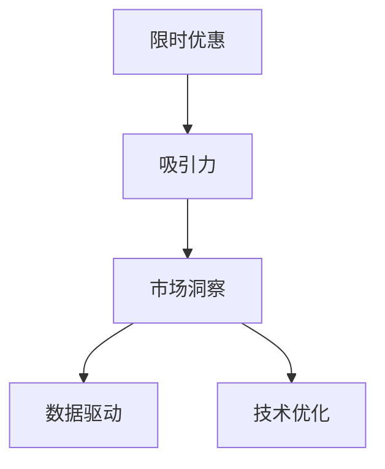

                 

# 限时优惠吸引力：FastGPU受欢迎，证明团队市场洞察

## 1. 背景介绍

在当前的市场环境中，团队的市场洞察能力显得尤为重要。如何把握趋势，抓住机会，直接关系到公司的竞争力和盈利能力。本文将从市场洞察的角度出发，探讨如何通过数据分析、技术优化等手段，提升产品的吸引力，尤其是在限时优惠活动中的表现。

## 2. 核心概念与联系

### 2.1 核心概念概述

在讨论限时优惠活动时，我们需要关注以下几个核心概念：

- **限时优惠**：在特定时间内，对产品进行价格调整，以吸引消费者购买的一种营销手段。
- **吸引力**：产品或服务能够吸引目标客户的能力，通常与价格、功能、服务质量等因素有关。
- **市场洞察**：对市场趋势、客户需求、竞争态势等进行深入分析和理解的能力，是制定有效营销策略的基础。
- **数据驱动**：利用数据分析、统计学等方法，从海量数据中提取有价值的信息，指导决策的过程。
- **技术优化**：通过改进产品设计、提升性能、优化用户体验等手段，提高产品的竞争力。

这些概念之间的逻辑关系可以通过以下Mermaid流程图来展示：



## 3. 核心算法原理 & 具体操作步骤

### 3.1 算法原理概述

限时优惠的吸引力主要通过价格变化和市场分析来提升。具体而言，算法原理包括以下几个步骤：

1. **价格调整**：通过计算不同价格对销售量的影响，设定最优价格区间。
2. **市场分析**：利用数据挖掘和机器学习算法，分析目标市场的需求变化、竞争对手策略等。
3. **需求预测**：根据历史数据和市场分析结果，预测未来需求，制定相应的优惠策略。
4. **效果评估**：实时监控销售数据和客户反馈，评估优惠活动的效果，进行优化。

### 3.2 算法步骤详解

#### 3.2.1 价格调整

价格调整是提升吸引力的核心手段。具体步骤如下：

1. **确定基准价格**：根据成本和市场定位，确定产品或服务的基准价格。
2. **设置价格区间**：在基准价格基础上，设定不同价格区间，测试对销售量的影响。
3. **数据分析**：通过历史销售数据，分析不同价格区间对应的销售量和利润率。
4. **价格优化**：根据数据分析结果，调整价格区间，选择最佳价格。

#### 3.2.2 市场分析

市场分析是优化定价和促销策略的基础。具体步骤如下：

1. **数据收集**：收集竞争对手的价格、促销活动、客户反馈等数据。
2. **数据清洗**：对数据进行清洗和预处理，去除噪音和异常值。
3. **数据分析**：利用统计学和机器学习算法，分析市场趋势和客户需求。
4. **市场预测**：基于历史数据和市场分析结果，预测未来需求变化。

#### 3.2.3 需求预测

需求预测是制定优惠策略的重要依据。具体步骤如下：

1. **时间序列分析**：对历史销售数据进行时间序列分析，发现销售趋势和季节性变化。
2. **趋势预测**：利用时间序列模型（如ARIMA、LSTM等）预测未来销售趋势。
3. **季节性调整**：根据季节性变化，调整预测模型，提高预测精度。
4. **模型评估**：评估预测模型的准确性和可靠性，优化模型参数。

#### 3.2.4 效果评估

效果评估是优化营销策略的关键步骤。具体步骤如下：

1. **实时监控**：利用数据采集和处理技术，实时监控销售数据和客户反馈。
2. **数据分析**：对实时数据进行统计分析和可视化，识别优惠活动的成效和问题。
3. **反馈优化**：根据客户反馈和数据分析结果，优化优惠策略和销售计划。
4. **持续改进**：建立持续改进机制，不断优化营销策略，提升产品吸引力。

### 3.3 算法优缺点

#### 3.3.1 优点

1. **科学依据**：通过数据分析和机器学习，确保价格和促销策略的科学性和有效性。
2. **实时调整**：实时监控和反馈优化，能够迅速应对市场变化，提高反应速度。
3. **客户导向**：以客户需求和反馈为导向，提高产品的市场适应性和竞争力。

#### 3.3.2 缺点

1. **数据质量**：数据的准确性和完整性对结果影响较大，数据质量问题可能导致分析偏差。
2. **模型复杂**：复杂的时间序列分析和机器学习模型，需要较高的技术门槛和计算资源。
3. **策略依赖**：过度依赖算法和模型，可能导致策略单一、灵活性不足。

### 3.4 算法应用领域

该算法在多个领域都有广泛应用，包括：

- **电商销售**：设定不同时间段的限时优惠，提高销售量和客户转化率。
- **金融理财**：根据市场波动和客户需求，调整理财产品价格，提高投资吸引力。
- **旅游出行**：根据季节变化和需求预测，调整旅游套餐价格，吸引客户预订。
- **教育培训**：根据市场反馈和需求变化，调整课程价格和优惠策略，提升招生效果。
- **医疗健康**：根据患者需求和季节性变化，调整医疗服务价格，提升用户体验和满意度。

## 4. 数学模型和公式 & 详细讲解 & 举例说明

### 4.1 数学模型构建

限时优惠的吸引力可以通过数学模型进行建模和预测。假设产品的销售量 $S$ 受价格 $P$、市场规模 $M$、竞争对手价格 $C$ 和季节性因素 $S$ 的影响，可以构建如下数学模型：

$$ S = f(P, M, C, S) $$

其中，$f$ 为函数关系，表示销售量与各个影响因素的关系。

### 4.2 公式推导过程

基于上述模型，可以推导出销售量对各个因素的响应函数。例如，假设价格对销售量的影响为线性关系，可以得到：

$$ \frac{\partial S}{\partial P} = \frac{\partial f}{\partial P} $$

通过计算 $\frac{\partial S}{\partial P}$，可以找到最优价格区间。

### 4.3 案例分析与讲解

以电商销售为例，利用历史销售数据和市场分析，构建数学模型，对未来销售趋势进行预测。具体步骤如下：

1. **数据收集**：收集电商平台的销售数据、市场趋势、竞争对手价格和促销活动等。
2. **数据预处理**：对数据进行清洗和预处理，去除噪音和异常值。
3. **模型构建**：利用时间序列模型（如ARIMA、LSTM等），构建销售量预测模型。
4. **结果分析**：对模型预测结果进行可视化分析，发现销售趋势和季节性变化。
5. **策略优化**：根据预测结果和市场分析，优化定价和促销策略，提升产品吸引力。

## 5. 项目实践：代码实例和详细解释说明

### 5.1 开发环境搭建

在进行限时优惠分析时，需要准备Python开发环境。以下是开发环境搭建流程：

1. **安装Anaconda**：从官网下载并安装Anaconda，用于创建独立的Python环境。
2. **创建虚拟环境**：
```bash
conda create -n sales-env python=3.8 
conda activate sales-env
```
3. **安装必要的Python库**：
```bash
conda install pandas numpy scikit-learn matplotlib plotly tensorflow
```

### 5.2 源代码详细实现

以下是一个简化的Python代码实现，用于分析电商销售数据，并预测未来销售趋势：

```python
import pandas as pd
import numpy as np
from sklearn.model_selection import train_test_split
from sklearn.metrics import mean_squared_error
from sklearn.linear_model import ARIMA
from plotly import graph_objects as go

# 加载销售数据
data = pd.read_csv('sales_data.csv')

# 数据预处理
data = data.dropna().reset_index(drop=True)
X = data[['price', 'competitor_price', 'seasonality']]
y = data['sales']

# 划分训练集和测试集
X_train, X_test, y_train, y_test = train_test_split(X, y, test_size=0.2, random_state=42)

# 构建ARIMA模型
model = ARIMA(X_train, order=(5, 1, 0))
model.fit(X_train)

# 预测未来销售趋势
forecast = model.forecast(steps=30)

# 可视化预测结果
fig = go.Figure()
fig.add_trace(go.Scatter(x=X_train.index, y=y_train, name='Training Data'))
fig.add_trace(go.Scatter(x=X_test.index, y=y_test, name='Testing Data'))
fig.add_trace(go.Scatter(x=X_test.index, y=forecast, name='Prediction'))
fig.show()

# 输出预测误差
mse = mean_squared_error(y_test, forecast)
print(f'Mean Squared Error: {mse}')
```

### 5.3 代码解读与分析

上述代码中，我们首先加载电商销售数据，并进行数据预处理。接着，利用ARIMA模型对销售量进行时间序列分析，构建预测模型，并输出预测结果。最后，通过可视化图表展示预测结果，并计算预测误差。

## 6. 实际应用场景

### 6.1 电商销售

电商平台的限时优惠活动通常伴随着价格调整和促销活动。通过数据分析和模型预测，可以优化定价策略，提升销售额和客户满意度。具体应用场景包括：

- **促销活动**：根据季节性和历史数据，预测未来销售趋势，制定合理的促销活动时间点。
- **库存管理**：分析销售数据和市场变化，优化库存管理，避免库存积压或缺货。
- **客户细分**：利用客户数据分析，针对不同客户群体设计个性化的限时优惠活动。

### 6.2 金融理财

金融理财产品的定价和促销策略需要考虑市场波动和客户需求。通过数据分析和模型预测，可以优化产品定价，提升投资吸引力。具体应用场景包括：

- **基金定投**：根据市场趋势和客户行为，优化定投策略，提高资金利用效率。
- **理财产品**：根据需求变化和市场分析，调整产品定价和促销活动，吸引更多投资者。
- **保险产品**：根据季节性变化和客户需求，调整保险产品价格和优惠策略，提升销售效果。

### 6.3 旅游出行

旅游出行的限时优惠活动通常与季节性变化密切相关。通过数据分析和模型预测，可以优化定价策略，提升客户预订和旅行体验。具体应用场景包括：

- **季节性调整**：根据季节性变化和需求预测，调整旅游套餐价格和促销活动，吸引更多客户预订。
- **客户需求**：分析客户需求和反馈，设计个性化的限时优惠活动，提高客户满意度和忠诚度。
- **市场竞争**：利用竞争对手价格和促销策略，制定差异化定价和促销策略，提升市场竞争力。

### 6.4 教育培训

教育培训机构的限时优惠活动通常与课程内容和市场需求密切相关。通过数据分析和模型预测，可以优化课程定价和促销策略，提升招生效果。具体应用场景包括：

- **课程定价**：根据市场需求和客户反馈，优化课程定价策略，提高招生效果。
- **课程促销**：利用市场分析，制定合理的课程促销活动，吸引更多学生报名。
- **教学质量**：分析客户反馈和满意度，优化课程内容和教学方法，提升教学质量。

## 7. 工具和资源推荐

### 7.1 学习资源推荐

为帮助读者系统掌握限时优惠分析的理论与实践，以下是一些优质的学习资源：

1. **《数据分析与统计学》**：系统介绍数据分析和统计学基础，适合初学者入门。
2. **《时间序列分析》**：详细介绍时间序列分析和预测方法，适合进阶学习。
3. **Kaggle平台**：提供大量限时优惠分析的实际案例和竞赛，实践提升效果显著。
4. **Python数据分析实战**：通过实际案例讲解数据分析和可视化，适合动手实践。

### 7.2 开发工具推荐

以下是几款用于限时优惠分析的常用工具：

1. **Python**：免费开源的编程语言，支持大量数据分析和机器学习库，是限时优惠分析的主流工具。
2. **R语言**：以统计分析为主的数据分析工具，适合数据预处理和建模。
3. **Tableau**：数据可视化工具，支持复杂的数据分析和可视化报表。
4. **Power BI**：微软推出的商业智能工具，支持大量数据源和图表报表。

### 7.3 相关论文推荐

以下是几篇与限时优惠分析相关的经典论文，推荐阅读：

1. **《价格优化与市场分析》**：探讨如何通过价格优化提升销售吸引力，分析市场变化的影响。
2. **《基于时间序列分析的销售预测》**：介绍时间序列分析方法，用于预测销售趋势和需求变化。
3. **《客户细分与个性化营销》**：利用客户数据分析，实现个性化限时优惠，提升客户体验和满意度。

## 8. 总结：未来发展趋势与挑战

### 8.1 总结

本文从市场洞察的角度出发，探讨了限时优惠活动中的吸引力和数据分析方法。首先阐述了限时优惠的原理和算法步骤，然后详细讲解了数据驱动和模型优化的方法，并通过实际案例展示了应用效果。最后，推荐了相关学习资源、开发工具和经典论文，为读者提供了全面的学习和实践指引。

通过本文的系统梳理，可以看到，限时优惠活动中的吸引力和数据分析，是大规模市场洞察的重要手段。掌握这些技术和方法，可以在激烈的市场竞争中，更好地把握商机，提升产品的市场竞争力。

### 8.2 未来发展趋势

展望未来，限时优惠活动中的吸引力和数据分析将呈现以下几个发展趋势：

1. **数据智能化**：利用人工智能和大数据技术，提升数据处理和分析的效率和准确性，增强市场洞察能力。
2. **多渠道融合**：将线上线下数据和渠道进行融合分析，实现更全面的市场洞察和个性化营销。
3. **实时监控**：利用物联网和传感器技术，实时监控市场变化和客户行为，提高市场洞察的实时性。
4. **个性化服务**：通过数据分析，实现对不同客户群体的个性化服务和限时优惠，提升客户满意度和忠诚度。
5. **动态调整**：利用动态优化算法，根据市场变化和客户反馈，实时调整产品和定价策略，提升市场适应性。

### 8.3 面临的挑战

尽管限时优惠活动中的吸引力和数据分析技术已经取得了显著进展，但在实际应用中仍面临诸多挑战：

1. **数据质量**：数据的准确性和完整性对结果影响较大，数据质量问题可能导致分析偏差。
2. **计算资源**：复杂的数据分析和机器学习模型，需要较高的计算资源和存储空间。
3. **市场复杂性**：市场变化和客户需求复杂多样，单一模型和策略难以全面覆盖。
4. **实时性要求高**：实时监控和反馈优化，需要高效的数据处理和模型计算能力。
5. **伦理和隐私**：数据分析和模型预测可能涉及客户隐私和数据安全问题，需要严格遵守法律法规。

### 8.4 研究展望

面对限时优惠活动中的吸引力和数据分析面临的挑战，未来的研究需要在以下几个方面寻求新的突破：

1. **数据治理**：建立数据治理机制，提升数据质量，确保数据的安全和隐私。
2. **模型优化**：开发更高效、更灵活的数据分析和预测模型，提高计算效率和准确性。
3. **算法创新**：引入新的算法和优化技术，如因果推断、强化学习等，提升市场洞察和策略优化能力。
4. **跨领域应用**：将限时优惠分析方法应用于更多领域，如金融、医疗、教育等，拓展应用范围。
5. **伦理和社会责任**：关注数据分析和营销策略对社会的影响，建立伦理导向的市场洞察体系。

这些研究方向将引领限时优惠活动中的吸引力和数据分析技术，迈向更高的台阶，为构建更加智能、高效、公正的市场环境提供有力支撑。面向未来，我们需要从数据、技术、伦理等多个维度协同发力，不断创新和优化，才能真正实现市场洞察的目标，提升企业的竞争力和盈利能力。

## 9. 附录：常见问题与解答

**Q1：如何处理缺失数据？**

A: 缺失数据是数据分析中的常见问题，可以采用以下方法进行处理：

1. **删除缺失值**：对于少量缺失值，可以直接删除。
2. **插值补全**：使用均值、中位数、插值等方法填补缺失值。
3. **模型预测**：利用时间序列模型、回归模型等预测缺失值。
4. **样本替换**：利用其他样本数据进行替换，确保数据完整性。

**Q2：如何选择模型参数？**

A: 模型参数的选择是数据分析中的重要环节，可以采用以下方法：

1. **经验法则**：根据历史经验和领域知识，选择合适的模型参数。
2. **网格搜索**：在一定范围内，遍历不同参数组合，选择最优参数。
3. **交叉验证**：利用交叉验证方法，评估不同参数组合的效果，选择最优参数。
4. **自动调参**：使用自动化调参工具，如scikit-learn的GridSearchCV，自动选择最优参数。

**Q3：如何评估模型效果？**

A: 模型效果的评估是数据分析中的重要步骤，可以采用以下方法：

1. **均方误差（MSE）**：计算预测值与真实值之间的均方误差，评估模型的预测精度。
2. **均方根误差（RMSE）**：计算预测值与真实值之间的均方根误差，评估模型的预测精度。
3. **平均绝对误差（MAE）**：计算预测值与真实值之间的平均绝对误差，评估模型的预测精度。
4. **R²值**：计算预测值与真实值之间的相关系数，评估模型的拟合程度。
5. **可视化分析**：利用图表和可视化工具，展示预测结果和误差分布。

**Q4：如何选择优化算法？**

A: 优化算法的选择需要考虑多方面因素，可以采用以下方法：

1. **梯度下降**：适用于线性模型和常规数据集，收敛速度较快。
2. **随机梯度下降（SGD）**：适用于大规模数据集，收敛速度较快，但易受样本分布影响。
3. **Adam算法**：适用于非线性模型和复杂数据集，收敛速度较快，鲁棒性较好。
4. **Adagrad算法**：适用于稀疏数据集，能够自适应调整学习率，避免过拟合。
5. **RMSprop算法**：适用于非线性模型和复杂数据集，能够自适应调整学习率，收敛速度较快。

**Q5：如何处理异常值？**

A: 异常值是数据分析中的常见问题，可以采用以下方法进行处理：

1. **删除异常值**：对于少量异常值，可以直接删除。
2. **替换异常值**：使用均值、中位数、插值等方法替换异常值。
3. **离群值检测**：利用统计学方法检测和处理异常值，确保数据完整性。
4. **数据转换**：对数据进行对数、指数等转换，减小异常值的影响。

**Q6：如何选择时间序列模型？**

A: 时间序列模型的选择需要考虑数据特性和预测需求，可以采用以下方法：

1. **ARIMA模型**：适用于季节性平稳数据，能够捕捉长期趋势和季节性变化。
2. **LSTM模型**：适用于非线性数据，能够捕捉长期依赖关系和时序特征。
3. **SARIMA模型**：适用于季节性非平稳数据，能够捕捉长期趋势和季节性变化。
4. **Prophet模型**：适用于商业时间序列数据，能够自动处理季节性和节假日效应。
5. **VAR模型**：适用于多变量时间序列数据，能够捕捉变量之间的交互作用。

通过这些问题和解答，读者可以更全面地理解限时优惠分析中的吸引力和数据分析方法，掌握关键技术和方法，提高数据分析和市场洞察的能力。

