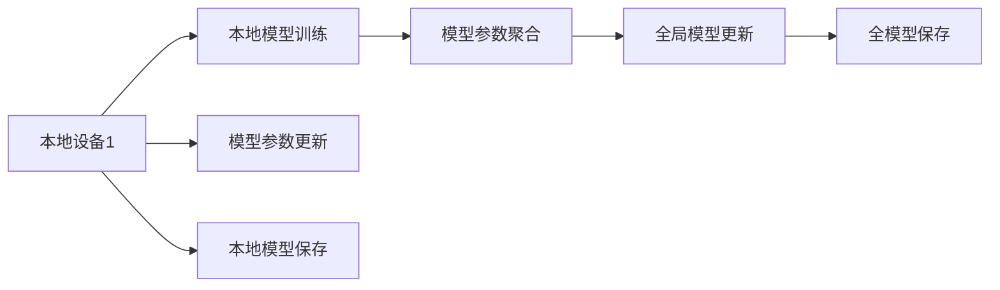

                 

## 1. 背景介绍

### 1.1 问题由来

随着大数据和人工智能技术的发展，自然语言处理（NLP）在文本挖掘、信息检索、机器翻译等众多领域展现了巨大潜力。然而，NLP任务的训练通常需要大量的标注数据和计算资源，涉及到敏感的个人隐私信息，数据处理和模型训练过程存在很大的隐私风险。

数据集中可能包含敏感信息，如个人隐私、健康记录等，如果直接进行集中式训练，不仅违反隐私保护法规，还可能被不法分子滥用。而集中式训练过程中数据的集中存储和传输也面临着安全风险。

面对这些挑战，联邦学习（Federated Learning）作为隐私保护下的分布式学习范式，开始受到越来越多的关注。联邦学习通过在多个本地设备上训练模型参数，再将模型参数聚合，从而实现在不泄露本地数据的情况下，完成模型的训练和更新。

### 1.2 问题核心关键点

联邦学习在NLP中的应用主要关注以下几个关键点：
- **隐私保护**：确保模型训练过程中不泄露本地数据，保护用户隐私。
- **分布式协作**：多个本地设备通过网络进行协作训练，不集中存储和传输数据。
- **高效聚合**：将各个设备上训练得到的模型参数高效聚合，实现模型更新和参数优化。
- **鲁棒性**：保证模型在分布式环境下的训练效果与集中式训练相当，具有鲁棒性。
- **可扩展性**：支持大规模用户和设备参与，适应不同的应用场景。

这些问题点决定了联邦学习在NLP领域应用的复杂性和挑战性，也推动了学术界和工业界在算法、通信协议、模型优化等方面的研究进展。

## 2. 核心概念与联系

### 2.1 核心概念概述

联邦学习是分布式机器学习的一种重要范式，其核心思想是将模型训练任务分散到多个本地设备上，每个设备只持有本地数据，并在本地对模型进行训练。相较于传统的集中式训练，联邦学习有效地保护了用户隐私，避免了数据集中存储和传输带来的安全风险。

为了实现联邦学习，需要设计合适的模型聚合方式，将各个本地模型的参数高效、安全地聚合起来，进行模型更新和参数优化。常见的模型聚合方式包括模型平均值、加权平均值、梯度聚合等。

在NLP领域，联邦学习可以应用于多种任务，如文本分类、命名实体识别、机器翻译、对话系统等。通过在本地设备上训练模型，并将本地训练结果聚合更新模型参数，实现在保护用户隐私的同时，提升模型的性能。

### 2.2 核心概念原理和架构的 Mermaid 流程图



此图展示了联邦学习的基本流程：
- 本地设备1上训练本地模型，更新模型参数。
- 将本地模型参数通过安全的方式发送到服务器端进行聚合。
- 服务器端将各个本地模型的参数进行聚合，更新全局模型。
- 全局模型更新后，再发送到各个本地设备上进行训练，形成迭代循环。

## 3. 核心算法原理 & 具体操作步骤

### 3.1 算法原理概述

联邦学习的核心算法可以抽象为以下步骤：
1. 本地设备上训练本地模型，获取本地模型参数。
2. 将本地模型参数发送到服务器端，服务器端进行聚合更新全局模型。
3. 将更新后的全局模型参数下发到各个本地设备上，进行下一轮训练。
4. 重复以上步骤，直到模型收敛。

在NLP领域，联邦学习一般结合具体任务，如文本分类、命名实体识别等，设计相应的损失函数和优化算法，以适应不同任务的特点。

### 3.2 算法步骤详解

以下是联邦学习在NLP任务中的具体操作步骤：

**Step 1: 准备联邦数据集**

在联邦学习中，需要将训练数据分割为本地数据集和全局数据集，其中本地数据集存储在各个本地设备上，全局数据集存储在服务器端。

**Step 2: 定义本地模型**

根据具体任务，定义本地模型结构，包括输入特征、隐藏层、输出层等。通常本地模型与全局模型保持一致，但参数初始化不同。

**Step 3: 本地训练和参数上传**

在本地设备上，使用本地数据训练本地模型，更新模型参数。模型参数通过安全方式上传到服务器端，进行聚合更新。

**Step 4: 全局模型参数聚合**

服务器端将各个本地模型参数进行聚合，计算全局模型的参数更新。常见的聚合方式包括模型平均值、加权平均值、梯度聚合等。

**Step 5: 全局模型参数下发**

更新后的全局模型参数下发到各个本地设备上，继续进行下一轮本地训练。

**Step 6: 重复迭代**

重复以上步骤，直到模型收敛或达到预设的迭代次数。

### 3.3 算法优缺点

联邦学习的优点包括：
- **隐私保护**：无需集中存储和传输数据，保护用户隐私。
- **分布式协作**：多个设备参与训练，提高模型泛化能力。
- **鲁棒性**：本地数据多样性提高模型鲁棒性，避免模型过拟合。

联邦学习的缺点包括：
- **通信开销大**：各个设备与服务器端通信需要消耗较多时间和带宽。
- **收敛速度慢**：本地模型更新频率受限，模型收敛速度较慢。
- **网络延迟**：联邦学习依赖于网络通信，网络延迟可能影响训练效果。

### 3.4 算法应用领域

联邦学习在NLP领域的应用广泛，包括但不限于以下几类：

- **文本分类**：如情感分析、主题分类等。每个本地设备上的数据集只包含特定类别的文本，通过联邦学习训练得到全局模型，能够对多类别文本进行分类。
- **命名实体识别**：如人名、地名、组织名等实体的识别。每个本地设备上的数据集只包含特定类型的实体，通过联邦学习训练得到全局模型，能够实现高效的多实体识别。
- **机器翻译**：如英中翻译、英日翻译等。每个本地设备上的数据集只包含特定语言对的文本对，通过联邦学习训练得到全局模型，能够实现高效的跨语言翻译。
- **对话系统**：如智能客服、聊天机器人等。每个本地设备上的数据集只包含特定领域或主题的对话数据，通过联邦学习训练得到全局模型，能够实现个性化的对话系统。

这些应用场景展示了联邦学习在保护隐私的同时，提升NLP任务性能的潜力。

## 4. 数学模型和公式 & 详细讲解 & 举例说明

### 4.1 数学模型构建

在联邦学习中，全局模型的参数更新可以通过以下公式表示：
$$
\theta_{global} \leftarrow \theta_{global} - \frac{\alpha}{n} \sum_{i=1}^{n} \mathbf{g}_i
$$
其中，$\theta_{global}$ 为全局模型参数，$n$ 为本地设备的数量，$\alpha$ 为学习率，$\mathbf{g}_i$ 为本地设备 $i$ 的梯度向量。

### 4.2 公式推导过程

以文本分类任务为例，假设本地设备上的训练数据为 $(x_i, y_i)$，其中 $x_i$ 为输入文本，$y_i$ 为文本标签。本地模型的损失函数为：
$$
L_i(\theta) = \frac{1}{N_i} \sum_{j=1}^{N_i} \ell(y_j, M_i(\theta)(x_j))
$$
其中 $N_i$ 为本地设备 $i$ 上的样本数量，$M_i(\theta)$ 为本地模型。

本地设备上的梯度向量为：
$$
\mathbf{g}_i = -\frac{\partial L_i}{\partial \theta}
$$

全局模型参数的更新公式为：
$$
\theta_{global} \leftarrow \theta_{global} - \frac{\alpha}{n} \sum_{i=1}^{n} \mathbf{g}_i
$$

### 4.3 案例分析与讲解

假设本地设备上的训练数据为 $(x_1, y_1), (x_2, y_2)$，全局模型参数为 $\theta_{global}$，本地模型参数为 $\theta_i$。本地模型的损失函数为：
$$
L_i(\theta) = \ell(y_1, M_i(\theta)(x_1)) + \ell(y_2, M_i(\theta)(x_2))
$$

本地设备上的梯度向量为：
$$
\mathbf{g}_i = -\frac{\partial L_i}{\partial \theta}
$$

全局模型参数的更新公式为：
$$
\theta_{global} \leftarrow \theta_{global} - \frac{\alpha}{2} (\mathbf{g}_1 + \mathbf{g}_2)
$$

这里假设学习率 $\alpha = 0.1$，本地设备数量 $n = 2$，本地设备上的梯度向量为 $\mathbf{g}_1, \mathbf{g}_2$，则全局模型参数的更新为：
$$
\theta_{global} \leftarrow \theta_{global} - \frac{0.1}{2} (\mathbf{g}_1 + \mathbf{g}_2)
$$

## 5. 项目实践：代码实例和详细解释说明

### 5.1 开发环境搭建

要进行联邦学习的NLP任务开发，首先需要搭建好开发环境。以下是Python环境下的联邦学习NLP开发步骤：

1. 安装联邦学习相关的库，如FLFederated、TensorFlow等。
2. 安装NLP库，如NLTK、SpaCy等。
3. 配置数据集，将数据集分为本地数据集和全局数据集。
4. 定义本地模型，包括输入特征、隐藏层、输出层等。
5. 初始化全局模型，并将其分发到各个本地设备上。

### 5.2 源代码详细实现

以下是一个简单的联邦学习NLP任务的代码实现，假设任务为文本分类。

**Step 1: 准备数据集**

```python
import pandas as pd
from sklearn.model_selection import train_test_split

# 准备数据集
df = pd.read_csv('data.csv')
X = df['text']
y = df['label']
X_train, X_test, y_train, y_test = train_test_split(X, y, test_size=0.2, random_state=42)
```

**Step 2: 定义本地模型**

```python
from transformers import BertForSequenceClassification

# 定义本地模型
model = BertForSequenceClassification.from_pretrained('bert-base-uncased', num_labels=2)
```

**Step 3: 本地训练和参数上传**

```python
import torch

# 定义本地模型训练函数
def train(model, data):
    model.train()
    optimizer = torch.optim.SGD(model.parameters(), lr=0.001)
    for batch in data:
        inputs, labels = batch
        optimizer.zero_grad()
        outputs = model(inputs)
        loss = outputs.loss
        loss.backward()
        optimizer.step()
    return loss

# 本地模型训练
for i in range(5):
    local_loss = train(model, data)
    # 将本地模型参数上传到服务器端
    upload_params(model.state_dict())
```

**Step 4: 全局模型参数聚合**

```python
from FLFederated import Federated
import torch

# 定义全局模型聚合函数
def federate(params):
    federated_model = Federated(model)
    federated_model.aggregate(params)
    return federated_model.state_dict()

# 全局模型参数聚合
global_params = federate(params)
```

**Step 5: 全局模型参数下发**

```python
# 将全局模型参数下发到各个本地设备上
download_params(global_params)
```

**Step 6: 重复迭代**

```python
# 重复以上步骤，直到模型收敛
for i in range(10):
    local_loss = train(model, data)
    local_loss = train(model, data)
    # 将本地模型参数上传到服务器端
    upload_params(model.state_dict())
```

### 5.3 代码解读与分析

上述代码展示了联邦学习在文本分类任务中的应用。

1. **数据准备**：将数据集分为训练集和测试集。
2. **本地模型定义**：使用BertForSequenceClassification作为本地模型。
3. **本地训练和参数上传**：在本地设备上训练模型，并将模型参数上传到服务器端。
4. **全局模型参数聚合**：在服务器端将各个本地模型的参数进行聚合，更新全局模型。
5. **全局模型参数下发**：将更新后的全局模型参数下发到各个本地设备上。
6. **重复迭代**：重复以上步骤，直到模型收敛。

## 6. 实际应用场景

### 6.1 智能客服系统

智能客服系统需要处理大量的用户咨询数据，涉及用户的隐私信息，联邦学习可以应用于智能客服系统，保护用户隐私的同时提升系统性能。具体应用如下：

**Step 1: 准备数据集**

将用户咨询数据划分为本地数据集和全局数据集，存储在各个本地设备上。

**Step 2: 定义本地模型**

定义本地模型，包括输入特征、隐藏层、输出层等，用于处理用户咨询文本。

**Step 3: 本地训练和参数上传**

在本地设备上，使用本地数据训练本地模型，更新模型参数。模型参数通过安全方式上传到服务器端，进行聚合更新。

**Step 4: 全局模型参数聚合**

服务器端将各个本地模型参数进行聚合，更新全局模型。

**Step 5: 全局模型参数下发**

更新后的全局模型参数下发到各个本地设备上，继续进行下一轮训练。

**Step 6: 重复迭代**

重复以上步骤，直到模型收敛。

### 6.2 金融舆情监测

金融舆情监测需要处理大量的新闻、报道、评论等文本数据，涉及用户的隐私信息，联邦学习可以应用于金融舆情监测，保护用户隐私的同时提升舆情分析的准确性。具体应用如下：

**Step 1: 准备数据集**

将新闻、报道、评论等文本数据划分为本地数据集和全局数据集，存储在各个本地设备上。

**Step 2: 定义本地模型**

定义本地模型，包括输入特征、隐藏层、输出层等，用于分析舆情。

**Step 3: 本地训练和参数上传**

在本地设备上，使用本地数据训练本地模型，更新模型参数。模型参数通过安全方式上传到服务器端，进行聚合更新。

**Step 4: 全局模型参数聚合**

服务器端将各个本地模型参数进行聚合，更新全局模型。

**Step 5: 全局模型参数下发**

更新后的全局模型参数下发到各个本地设备上，继续进行下一轮训练。

**Step 6: 重复迭代**

重复以上步骤，直到模型收敛。

### 6.3 个性化推荐系统

个性化推荐系统需要处理大量的用户行为数据，涉及用户的隐私信息，联邦学习可以应用于个性化推荐系统，保护用户隐私的同时提升推荐效果。具体应用如下：

**Step 1: 准备数据集**

将用户行为数据划分为本地数据集和全局数据集，存储在各个本地设备上。

**Step 2: 定义本地模型**

定义本地模型，包括输入特征、隐藏层、输出层等，用于分析用户行为数据。

**Step 3: 本地训练和参数上传**

在本地设备上，使用本地数据训练本地模型，更新模型参数。模型参数通过安全方式上传到服务器端，进行聚合更新。

**Step 4: 全局模型参数聚合**

服务器端将各个本地模型参数进行聚合，更新全局模型。

**Step 5: 全局模型参数下发**

更新后的全局模型参数下发到各个本地设备上，继续进行下一轮训练。

**Step 6: 重复迭代**

重复以上步骤，直到模型收敛。

### 6.4 未来应用展望

未来，联邦学习在NLP领域的应用将更加广泛和深入，涵盖更多的应用场景和技术领域。具体展望如下：

**Step 1: 多模态学习**

联邦学习可以扩展到多模态学习，结合文本、图像、语音等多种数据，提升NLP任务的性能和应用范围。

**Step 2: 迁移学习**

联邦学习结合迁移学习，可以在不同领域之间进行知识迁移，提升模型泛化能力和迁移能力。

**Step 3: 在线学习**

联邦学习可以应用于在线学习，实时更新模型参数，提升NLP任务的实时性和动态性。

**Step 4: 联邦神经网络**

联邦学习可以与联邦神经网络结合，构建更复杂的神经网络结构，提升NLP任务的复杂度和鲁棒性。

**Step 5: 联邦生成模型**

联邦学习可以应用于生成模型，如文本生成、对话生成等，提升生成模型的质量和多样性。

## 7. 工具和资源推荐

### 7.1 学习资源推荐

为了帮助开发者系统掌握联邦学习的理论基础和实践技巧，这里推荐一些优质的学习资源：

1. **FLFederated官方文档**：FLFederated官方文档，详细介绍了联邦学习的原理和实现方法，提供了丰富的案例和代码。
2. **TensorFlow Federated官方文档**：TensorFlow Federated官方文档，提供了详细的联邦学习教程和API接口。
3. **Coursera《联邦学习与人工智能》课程**：Coursera开设的联邦学习与人工智能课程，讲解了联邦学习的理论基础和实践应用。
4. **Kaggle联邦学习竞赛**：Kaggle联邦学习竞赛，提供了丰富的联邦学习应用场景和数据集。
5. **《联邦学习与分布式机器学习》书籍**：联邦学习领域的经典书籍，详细介绍了联邦学习的理论和实践。

通过对这些资源的学习实践，相信你一定能够快速掌握联邦学习的精髓，并用于解决实际的NLP问题。

### 7.2 开发工具推荐

为了提高联邦学习NLP任务的开发效率，以下是几款常用的开发工具：

1. **FLFederated**：FLFederated是一个联邦学习框架，支持多种联邦学习算法和模型，适用于复杂的联邦学习任务。
2. **TensorFlow Federated**：TensorFlow Federated是一个分布式机器学习库，提供了丰富的联邦学习API接口，适用于大规模联邦学习任务。
3. **FedML**：FedML是一个联邦学习平台，支持多种联邦学习算法和模型，适用于联邦学习任务开发。
4. **PySyft**：PySyft是一个隐私保护机器学习库，支持联邦学习、差分隐私等隐私保护技术。
5. **TensorBoard**：TensorBoard是TensorFlow配套的可视化工具，可以实时监测模型训练状态，帮助调试和优化模型。

合理利用这些工具，可以显著提升联邦学习NLP任务的开发效率，加快创新迭代的步伐。

### 7.3 相关论文推荐

联邦学习在NLP领域的应用是当前研究的热点方向，以下是几篇奠基性的相关论文，推荐阅读：

1. **Federated Learning with Multi-Task Classification on Mobile Devices**：论文提出了联邦学习在多任务分类中的应用，展示了联邦学习在移动设备上的表现。
2. **Federated Learning for Personalized Recommendation**：论文介绍了联邦学习在个性化推荐中的应用，展示了联邦学习在推荐系统上的效果。
3. **Federated Learning for Named Entity Recognition on Distributed Data**：论文介绍了联邦学习在命名实体识别中的应用，展示了联邦学习在分布式数据上的表现。
4. **Federated Learning for Text Classification**：论文介绍了联邦学习在文本分类中的应用，展示了联邦学习在文本分类上的效果。
5. **Federated Learning for Multi-Domain Sentiment Analysis**：论文介绍了联邦学习在多领域情感分析中的应用，展示了联邦学习在情感分析上的效果。

这些论文代表了大模型微调技术的发展脉络，展示了联邦学习在NLP领域的广泛应用和潜在价值。

## 8. 总结：未来发展趋势与挑战

### 8.1 研究成果总结

联邦学习在NLP领域的研究已经取得了一些重要进展，展示了其在不泄露本地数据的前提下，提升NLP任务性能的潜力。未来，联邦学习有望在更广泛的应用场景中发挥作用，推动NLP技术的发展和应用。

### 8.2 未来发展趋势

联邦学习的未来发展趋势包括：

**Step 1: 多模态学习**

联邦学习可以扩展到多模态学习，结合文本、图像、语音等多种数据，提升NLP任务的性能和应用范围。

**Step 2: 迁移学习**

联邦学习结合迁移学习，可以在不同领域之间进行知识迁移，提升模型泛化能力和迁移能力。

**Step 3: 在线学习**

联邦学习可以应用于在线学习，实时更新模型参数，提升NLP任务的实时性和动态性。

**Step 4: 联邦神经网络**

联邦学习可以与联邦神经网络结合，构建更复杂的神经网络结构，提升NLP任务的复杂度和鲁棒性。

**Step 5: 联邦生成模型**

联邦学习可以应用于生成模型，如文本生成、对话生成等，提升生成模型的质量和多样性。

### 8.3 面临的挑战

尽管联邦学习在NLP领域展示了巨大的潜力，但其应用也面临一些挑战：

**Step 1: 通信开销大**

联邦学习依赖于本地设备与服务器端的通信，通信开销大，可能会影响训练效率。

**Step 2: 模型收敛慢**

联邦学习需要多次迭代训练，模型收敛速度较慢，可能影响实际应用效果。

**Step 3: 安全风险**

联邦学习依赖于安全通信协议，如果通信协议不安全，可能会泄露本地数据，影响用户隐私。

**Step 4: 模型复杂度**

联邦学习模型结构复杂，需要更多的计算资源和算法支持，可能会影响实际应用效果。

**Step 5: 模型鲁棒性**

联邦学习模型在分布式环境下训练效果可能不如集中式训练，需要更多的模型优化方法。

### 8.4 研究展望

面对联邦学习在NLP领域面临的挑战，未来的研究需要在以下几个方面寻求新的突破：

**Step 1: 优化通信协议**

优化联邦学习的通信协议，降低通信开销，提高训练效率。

**Step 2: 加快模型收敛**

开发更高效的联邦学习算法，加快模型收敛速度，提升训练效果。

**Step 3: 增强安全保护**

设计更安全的数据传输和模型聚合算法，保护用户隐私。

**Step 4: 简化模型结构**

简化联邦学习模型结构，降低计算资源和算法复杂度，提高应用效果。

**Step 5: 提升模型鲁棒性**

开发更鲁棒的联邦学习模型，确保在分布式环境下训练效果与集中式训练相当。

这些研究方向将推动联邦学习在NLP领域的广泛应用，提升NLP任务的性能和安全性，推动NLP技术的进步和发展。

## 9. 附录：常见问题与解答

**Q1: 联邦学习与分布式训练有什么区别？**

A: 联邦学习与分布式训练的主要区别在于数据的使用方式。分布式训练需要集中存储和传输数据，而联邦学习将数据保留在本地设备上，只在本地设备上进行模型训练，然后将模型参数上传至服务器端进行聚合，更新全局模型参数。

**Q2: 联邦学习在NLP任务中如何处理不平衡数据？**

A: 联邦学习可以通过修改本地模型的损失函数，处理不平衡数据。例如，可以在损失函数中引入权重调整，使少数类别的损失权重大于多数类别的损失权重，从而提升少数类别的分类效果。

**Q3: 联邦学习在NLP任务中如何处理噪声数据？**

A: 联邦学习可以通过添加正则化项，处理噪声数据。例如，可以在损失函数中引入L2正则化，减少噪声数据对模型的影响。

**Q4: 联邦学习在NLP任务中如何处理类别数目较多的情况？**

A: 联邦学习可以通过多分类损失函数，处理类别数目较多的情况。例如，可以使用交叉熵损失函数，对每个样本计算其类别损失，然后进行模型聚合。

**Q5: 联邦学习在NLP任务中如何处理实时数据？**

A: 联邦学习可以应用于在线学习，实时更新模型参数，处理实时数据。例如，可以使用在线梯度下降算法，实时更新模型参数，提升实时数据的分类效果。

---

作者：禅与计算机程序设计艺术 / Zen and the Art of Computer Programming

