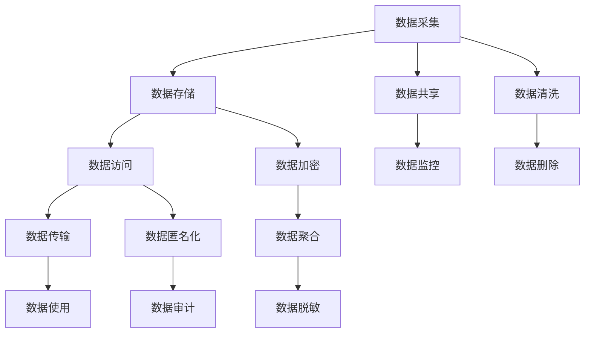

                 

## 1. 背景介绍

随着人工智能技术的飞速发展，其在医疗、金融、社交、教育等领域的广泛应用，显著提升了人类社会的效率和便利性。然而，随着数据规模的爆炸式增长，数据隐私和安全问题也随之而来，成为制约人工智能技术进一步发展的重大挑战。隐私安全不仅关乎个人隐私权益，更是构建安全、可信的社会基础。因此，如何在享受科技便利的同时，保障数据隐私安全，成为当前研究的重要课题。

本文将从隐私安全的概念出发，深入探讨隐私保护的技术框架和实际应用，分析目前隐私保护面临的挑战与未来发展方向，旨在为人工智能技术的普及与推广，保驾护航，确保数据隐私安全。

## 2. 核心概念与联系

### 2.1 核心概念概述

隐私安全（Privacy Security）是指在数据处理过程中，对敏感数据进行保护，防止未授权的访问和滥用，保障数据隐私权益的技术和措施。隐私安全的核心在于如何在数据使用和共享的过程中，最小化敏感信息的暴露风险，从而维护用户和社会的利益。

### 2.2 核心概念原理和架构的 Mermaid 流程图



上述流程图展示了一个典型的数据处理流程，从数据采集到数据使用，隐私保护涉及多个环节：数据清洗、数据加密、数据匿名化、数据聚合、数据脱敏、数据共享、数据监控和数据删除等。各环节相互依赖，共同构成隐私保护的技术架构。

### 2.3 核心概念间的联系

隐私安全涉及多个核心概念和技术手段，各概念和技术手段相互配合，共同保障数据隐私权益。具体而言：

- **数据清洗**：去除不必要的数据，减少数据暴露风险，是数据隐私保护的前提。
- **数据加密**：对数据进行加密处理，保障数据在传输和存储过程中的机密性，是数据隐私保护的核心技术手段之一。
- **数据匿名化**：通过数据去标识化处理，防止数据泄露特定用户身份信息，降低数据敏感性。
- **数据聚合**：将分散的敏感数据聚合汇总，进行统一处理，减少数据管理复杂度，同时保护个体隐私。
- **数据脱敏**：对敏感数据进行模糊化处理，降低数据泄露风险。
- **数据共享**：在数据共享过程中，采取隐私保护措施，防止数据被滥用。
- **数据监控**：实时监测数据使用情况，防止未授权访问，及时发现和响应数据安全事件。
- **数据删除**：在数据生命周期结束时，及时删除数据，防止数据长时间存储导致隐私泄露。

这些技术手段各具特点，需要根据实际应用场景进行选择和组合，共同构建完整的隐私保护体系。

## 3. 核心算法原理 & 具体操作步骤

### 3.1 算法原理概述

隐私保护的技术手段多种多样，核心算法原理可以归纳为以下几个方面：

1. **差分隐私（Differential Privacy）**：通过在统计分析中添加随机噪声，保障个体数据隐私，防止个体数据被反识别。
2. **同态加密（Homomorphic Encryption）**：允许在不解密的情况下，对加密数据进行计算，保障计算过程的隐私性。
3. **匿名化技术（Anonymization Techniques）**：通过对数据进行去标识化处理，降低数据泄露个体身份信息的风险。
4. **数据聚合（Data Aggregation）**：通过汇总聚合数据，减少数据管理的复杂性，同时保障数据隐私。
5. **数据脱敏（Data Masking）**：对敏感数据进行模糊化处理，防止敏感信息被滥用。
6. **访问控制（Access Control）**：通过身份验证、权限管理等手段，限制数据访问，保障数据使用合规性。
7. **监控与审计（Monitoring and Auditing）**：实时监测数据使用情况，定期审计数据处理流程，保障数据安全。

这些算法原理构成了隐私保护的基本框架，各算法通过协同作用，共同构建了隐私保护的安全屏障。

### 3.2 算法步骤详解

以差分隐私为例，介绍隐私保护的核心算法步骤：

1. **定义隐私预算（ε-δ隐私预算）**：确定隐私预算（ε和δ），ε表示数据泄露的机率，δ表示数据不泄露的概率。
2. **添加噪声**：在统计分析中随机添加噪声，扰乱数据，防止个体数据被反识别。
3. **计算结果**：对扰动后的数据进行统计计算，得出隐私保护的结果。
4. **隐私评估**：评估结果的隐私性，确保其满足隐私预算要求。

具体算法步骤为：

$$
\text{ privatized result } = \text{ original result } + \text{ noise }
$$

其中，noise 是随机噪声，满足 $\text{Pr}[| noise | > \epsilon] \leq \delta$。

### 3.3 算法优缺点

差分隐私的主要优点包括：

- **隐私保障**：通过添加噪声，确保个体数据隐私，防止数据泄露。
- **鲁棒性**：能够抵御攻击者对数据的选择性攻击，保障数据的整体隐私性。
- **可配置性**：通过调整隐私预算，实现隐私保护与数据利用之间的平衡。

其主要缺点包括：

- **计算复杂度**：添加噪声和隐私评估增加了计算复杂度，影响了数据处理的效率。
- **结果偏差**：由于噪声的引入，统计结果可能存在一定的偏差。
- **噪声敏感度**：噪声的敏感度与数据量相关，数据量越大，噪声的影响越小。

### 3.4 算法应用领域

隐私保护算法在多个领域得到了广泛应用，例如：

- **医疗数据保护**：在医疗数据共享和研究中，采用差分隐私等技术保障患者隐私，防止敏感医疗信息被滥用。
- **金融数据分析**：在金融数据挖掘和风险评估中，通过同态加密等技术，保障数据在计算过程中的隐私性。
- **社交网络安全**：在社交网络数据处理中，采用匿名化、数据脱敏等技术，防止用户隐私被泄露。
- **教育数据保护**：在教育数据共享和分析中，通过访问控制、数据监控等手段，保障学生隐私。
- **政府数据开放**：在政府数据公开中，采用隐私保护技术，确保数据开放不侵犯个人隐私。

## 4. 数学模型和公式 & 详细讲解 & 举例说明

### 4.1 数学模型构建

隐私保护的数学模型主要涉及概率论、统计学、密码学等领域的知识。这里以差分隐私为例，构建数学模型：

设 $D$ 为数据集，$S_D$ 为数据集的敏感属性，$S'_D$ 为数据集在隐私处理后的敏感属性，$A$ 为攻击者，$P$ 为数据隐私保护的概率模型。则差分隐私的目标是：

$$
P(S_D = S'_D | A) \approx P(S_D = S'_D | A) + \epsilon
$$

其中，$\epsilon$ 表示隐私预算。

### 4.2 公式推导过程

假设数据集 $D$ 包含 $n$ 个记录，每个记录 $d_i$ 包含 $k$ 个敏感属性 $S_i$。差分隐私的计算过程包括两个步骤：

1. **数据扰动**：对每个记录 $d_i$ 添加噪声 $n_i$，得到扰动后的记录 $d'_i$。
2. **隐私评估**：计算扰动后的数据集 $D'$ 的敏感属性 $S'_D$，并评估其隐私性，确保满足隐私预算。

具体推导如下：

$$
S'_D = f(D') = f(\{d'_1, d'_2, ..., d'_n\})
$$

其中，$f$ 为统计函数。

差分隐私的隐私预算定义如下：

$$
\epsilon = \max_{d \in D, d' \in D'} \frac{P(S_D = S'_D | A)}{P(S_D = S'_D | A)}
$$

### 4.3 案例分析与讲解

假设有一个包含医疗记录的数据集 $D$，其中每个记录包含患者的年龄、性别、病史等信息。采用差分隐私对数据集进行隐私处理，得到扰动后的数据集 $D'$。攻击者通过计算 $D'$ 中的敏感属性 $S'_D$，并评估其隐私性，确保满足隐私预算。

## 5. 项目实践：代码实例和详细解释说明

### 5.1 开发环境搭建

在进行隐私保护项目实践前，我们需要准备好开发环境。以下是使用Python进行差分隐私项目开发的常见环境配置流程：

1. 安装Anaconda：从官网下载并安装Anaconda，用于创建独立的Python环境。

2. 创建并激活虚拟环境：
```bash
conda create -n diffpriv-env python=3.8 
conda activate diffpriv-env
```

3. 安装差分隐私库和依赖：
```bash
pip install diffprivpy numpy pandas scipy
```

4. 安装相关工具包：
```bash
pip install matplotlib seaborn jupyter notebook ipython
```

完成上述步骤后，即可在`diffpriv-env`环境中开始差分隐私项目开发。

### 5.2 源代码详细实现

以下是一个简单的Python代码示例，用于计算差分隐私的隐私预算：

```python
import numpy as np
from diffprivpy.privacy import PrivacyBudget, DifferentialPrivacy

def compute_privacy_budget(n, k, epsilon, delta):
    # 数据集大小和敏感属性数量
    n = n
    k = k
    
    # 隐私预算
    epsilon = epsilon
    delta = delta
    
    # 生成模拟数据集
    data = np.random.randint(0, 2, size=(n, k))
    
    # 计算隐私预算
    privacy_budget = PrivacyBudget(data, epsilon=epsilon, delta=delta)
    
    # 添加噪声
    noisy_data = privacy_budget.noise()
    
    # 计算扰动后的数据集
    noisy_data = noisy_data + data
    
    return noisy_data, privacy_budget

# 参数设置
n = 1000  # 数据集大小
k = 10    # 敏感属性数量
epsilon = 0.1  # 隐私预算
delta = 0.05  # 隐私预算

# 计算隐私预算
noisy_data, privacy_budget = compute_privacy_budget(n, k, epsilon, delta)
```

### 5.3 代码解读与分析

让我们再详细解读一下关键代码的实现细节：

**compute_privacy_budget函数**：
- `n`：数据集大小，即样本数量
- `k`：敏感属性数量，即每个样本的特征数量
- `epsilon`：隐私预算，用于控制隐私泄露的概率
- `delta`：隐私预算，用于控制隐私泄露的概率

**数据生成**：
- 生成一个 $n \times k$ 的随机数据集，每个元素为0或1，代表敏感属性的取值。

**隐私预算计算**：
- 使用差分隐私库计算隐私预算，确保隐私预算满足给定的 $\epsilon$ 和 $\delta$。

**噪声添加**：
- 根据隐私预算计算得到噪声，添加到原始数据上，得到扰动后的数据集。

可以看到，差分隐私的实现相对简单，主要依赖于差分隐私库提供的函数和接口。实际应用中，需要根据具体需求调整参数，确保隐私保护的效果。

### 5.4 运行结果展示

以下是一个简单的运行结果展示：

```python
import matplotlib.pyplot as plt

# 计算隐私预算
noisy_data, privacy_budget = compute_privacy_budget(n, k, epsilon, delta)

# 绘制隐私预算变化曲线
plt.plot(np.arange(0, 1, 0.01), privacy_budget.get_privacy_budget(), label='Privacy Budget')
plt.xlabel('Epsilon')
plt.ylabel('Budget')
plt.title('Differential Privacy Budget')
plt.legend()
plt.show()
```

运行结果将显示隐私预算随 $\epsilon$ 的变化曲线，直观展示隐私预算的控制效果。

## 6. 实际应用场景

### 6.1 医疗数据保护

在医疗数据共享和研究中，差分隐私等隐私保护技术被广泛应用于保护患者隐私。通过差分隐私，医疗机构可以在不泄露患者具体信息的前提下，公开数据分析结果，供学术研究和公共政策制定使用。

具体而言，可以收集医疗机构的数据集，如住院记录、就诊信息等，对其进行差分隐私处理，并公开分析结果。通过差分隐私，攻击者无法反识别具体患者信息，保障了患者隐私权益。

### 6.2 金融数据分析

在金融数据挖掘和风险评估中，同态加密等隐私保护技术被广泛应用于保障数据隐私。通过同态加密，金融机构可以在加密状态下进行数据分析，防止数据泄露。

具体而言，可以收集金融机构的交易记录、客户信息等，对其进行同态加密处理，并公开分析结果。通过同态加密，攻击者无法解密具体数据，保障了数据隐私。

### 6.3 社交网络安全

在社交网络数据处理中，匿名化、数据脱敏等技术被广泛应用于保护用户隐私。通过匿名化和数据脱敏，社交网络平台可以在不泄露用户具体信息的前提下，进行数据分析和优化。

具体而言，可以收集社交网络平台的用户数据，如好友关系、点赞记录等，对其进行匿名化和数据脱敏处理，并公开分析结果。通过匿名化和数据脱敏，攻击者无法反识别具体用户信息，保障了用户隐私。

### 6.4 教育数据保护

在教育数据共享和分析中，访问控制、数据监控等手段被广泛应用于保护学生隐私。通过访问控制和数据监控，教育机构可以在不泄露学生具体信息的前提下，进行数据共享和分析。

具体而言，可以收集教育机构的学生数据，如成绩、出勤记录等，对其进行访问控制和数据监控处理，并公开分析结果。通过访问控制和数据监控，攻击者无法访问具体学生信息，保障了学生隐私。

### 6.5 政府数据开放

在政府数据公开中，隐私保护技术被广泛应用于保障数据隐私。通过隐私保护技术，政府可以在不泄露个人信息的前提下，公开数据供公众使用。

具体而言，可以收集政府的公共数据，如人口普查数据、气象数据等，对其进行隐私保护处理，并公开数据。通过隐私保护技术，攻击者无法反识别具体个人信息，保障了公众隐私。

## 7. 工具和资源推荐

### 7.1 学习资源推荐

为了帮助开发者系统掌握隐私保护的理论基础和实践技巧，这里推荐一些优质的学习资源：

1. 《数据隐私保护》系列博文：由隐私保护专家撰写，深入浅出地介绍了隐私保护的基本概念和常用技术。

2. 《数据隐私保护技术与应用》课程：由知名大学开设的隐私保护课程，涵盖隐私保护的理论和实践，适合系统学习。

3. 《隐私保护：原理与实践》书籍：系统介绍了隐私保护的理论基础和实用技术，适合深入研究。

4. 《数据隐私保护技术指南》：官方出版的隐私保护技术指南，提供了丰富的隐私保护案例和解决方案。

5. 《隐私保护实战指南》：实用指南，提供隐私保护的技术实践和工具使用，适合实际应用。

通过对这些资源的学习实践，相信你一定能够快速掌握隐私保护的核心技术和应用技巧，并用于解决实际的数据隐私问题。

### 7.2 开发工具推荐

高效的开发离不开优秀的工具支持。以下是几款用于隐私保护开发的常用工具：

1. Anonymize-it：Java编写的数据匿名化工具，支持多种数据匿名化方法。
2. Diffprivpy：Python编写的差分隐私库，支持差分隐私计算和隐私预算评估。
3. PySyft：Python编写的同态加密库，支持同态加密计算。
4. BeautifulSoup：Python编写的HTML解析库，支持数据去标识化处理。
5. AccessControl：Python编写的访问控制库，支持身份验证和权限管理。
6. TensorBoard：TensorFlow配套的可视化工具，支持隐私保护指标的实时监测和展示。

合理利用这些工具，可以显著提升隐私保护项目的开发效率，加快创新迭代的步伐。

### 7.3 相关论文推荐

隐私保护技术的研究始于学界的持续探索。以下是几篇奠基性的相关论文，推荐阅读：

1. "Differential Privacy" by Cynthia Dwork et al.：差分隐私的基本原理和理论基础，奠定了差分隐私研究的基石。
2. "Homomorphic Encryption" by Victor Shoup：同态加密的基本原理和实现方法，提供了同态加密的详细指南。
3. "Anonymization Techniques" by Linda Garrow：匿名化技术的全面介绍和实际应用案例，提供了匿名化的实用技术。
4. "Data Aggregation and Privacy" by Sheng Huang et al.：数据聚合与隐私保护的研究综述，探讨了数据聚合的隐私保护策略。
5. "Data Masking and Privacy" by Zhanru Guo et al.：数据脱敏与隐私保护的研究综述，提供了数据脱敏的实用技术。

这些论文代表了大数据隐私保护技术的发展脉络。通过学习这些前沿成果，可以帮助研究者把握学科前进方向，激发更多的创新灵感。

## 8. 总结：未来发展趋势与挑战

### 8.1 总结

本文对隐私保护的核心概念、算法原理和操作步骤进行了全面系统的介绍。首先阐述了隐私保护的概念和重要性，明确了隐私保护在数据处理中的关键作用。其次，从原理到实践，详细讲解了隐私保护的主要算法，包括差分隐私、同态加密、匿名化等，提供了隐私保护的基本框架。最后，本文探讨了隐私保护在多个领域的应用场景，展示了隐私保护技术的广泛应用前景。

通过本文的系统梳理，可以看到，隐私保护技术在大数据时代具有重要的应用价值。这些技术在保障数据隐私的同时，也促进了数据的高效利用和共享，为人工智能技术的普及与推广，保驾护航。

### 8.2 未来发展趋势

展望未来，隐私保护技术将呈现以下几个发展趋势：

1. **隐私保护算法的多样化**：未来的隐私保护算法将更加多样化，适应不同场景和需求。差分隐私、同态加密、匿名化等技术将不断完善，形成更加全面的隐私保护体系。
2. **隐私保护的智能化**：隐私保护算法将更多地引入人工智能技术，通过智能推理和决策，实现动态隐私保护和实时监控。
3. **隐私保护的一体化**：未来的隐私保护将更多地与其他数据处理技术结合，如数据清洗、数据聚合等，形成一体化的数据处理流程。
4. **隐私保护的标准化**：隐私保护将更多地依赖标准化流程和协议，保障隐私保护的一致性和可验证性。
5. **隐私保护的自动化**：隐私保护算法将更多地实现自动化，减少人工干预，提高隐私保护的效率和可靠性。

### 8.3 面临的挑战

尽管隐私保护技术已经取得了显著进展，但在实际应用过程中，仍面临诸多挑战：

1. **隐私保护的计算复杂度**：隐私保护算法通常需要引入额外的计算和存储资源，增加了数据处理的复杂度，影响了数据处理的效率。
2. **隐私保护的精度控制**：隐私保护算法需要在隐私和数据利用之间进行平衡，如何在不损害数据利用性的前提下，保障隐私保护效果，是一个需要解决的问题。
3. **隐私保护的泛化能力**：隐私保护算法需要适应不同的数据分布和攻击场景，如何在各种环境下保持隐私保护的效果，是一个需要解决的问题。
4. **隐私保护的标准化和规范化**：隐私保护算法需要建立统一的标准和规范，以保障不同系统之间的互操作性和可验证性。
5. **隐私保护的自动化和智能化**：隐私保护算法需要更多地引入人工智能技术，实现智能推理和决策，提升隐私保护的效果。

### 8.4 研究展望

面向未来，隐私保护技术需要在以下几个方面寻求新的突破：

1. **隐私保护算法的自动化和智能化**：通过引入人工智能技术，实现隐私保护的自动化和智能化，提升隐私保护的效率和可靠性。
2. **隐私保护算法的多样化和灵活性**：开发更加多样化和灵活的隐私保护算法，适应不同场景和需求。
3. **隐私保护算法的可解释性和可验证性**：增强隐私保护算法的可解释性和可验证性，提升隐私保护的透明度和可信度。
4. **隐私保护算法的跨平台兼容性**：提高隐私保护算法的跨平台兼容性，实现不同系统之间的无缝集成和互操作。
5. **隐私保护算法的标准化和规范化**：建立统一的隐私保护标准和规范，推动隐私保护技术的普及和应用。

这些研究方向的探索，必将引领隐私保护技术迈向更高的台阶，为构建安全、可信的社会提供坚实的技术保障。

## 9. 附录：常见问题与解答

**Q1：什么是差分隐私？**

A: 差分隐私是一种隐私保护技术，通过在统计分析中添加随机噪声，保障个体数据隐私，防止个体数据被反识别。其核心在于控制隐私泄露的概率，确保数据集在小样本变化下的敏感性。

**Q2：差分隐私和同态加密有什么区别？**

A: 差分隐私和同态加密都是隐私保护技术，但应用场景和保护方式不同。差分隐私通过添加噪声保障隐私，适用于个体数据保护，适用于大规模数据分析；同态加密通过加密计算保障隐私，适用于数据在加密状态下进行计算，适用于敏感数据的保护。

**Q3：隐私保护对数据利用有何影响？**

A: 隐私保护技术可以在保障隐私的前提下，实现数据的高效利用和共享，但也可能对数据精度和利用性产生一定的影响。隐私保护需要在隐私和数据利用之间进行平衡，采用合适的算法和技术手段，尽可能减少对数据利用的负面影响。

**Q4：隐私保护算法是否一定增加计算复杂度？**

A: 是的，隐私保护算法通常需要引入额外的计算和存储资源，增加了数据处理的复杂度，影响了数据处理的效率。但随着技术的发展，未来的隐私保护算法将更加高效，减少对计算资源的需求。

**Q5：隐私保护在实际应用中是否一定影响数据精度？**

A: 是的，隐私保护技术需要在隐私和数据精度之间进行平衡，通过引入噪声和扰动，可能对数据精度产生一定的影响。但通过优化算法和参数，可以在不损害数据精度的前提下，保障隐私保护效果。

---

作者：禅与计算机程序设计艺术 / Zen and the Art of Computer Programming

