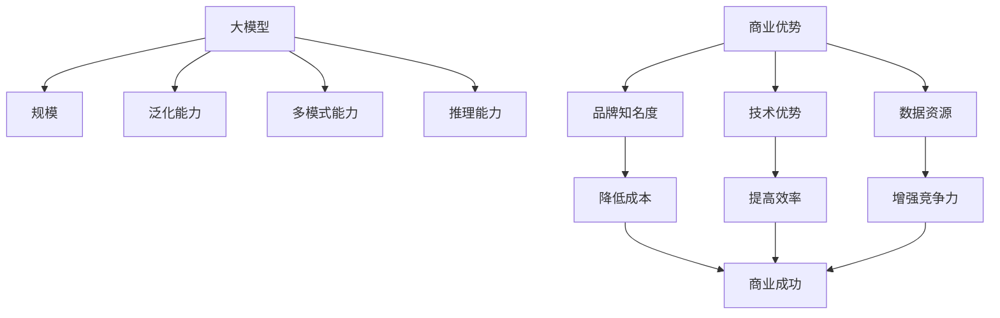

                 

## AI 大模型创业：如何利用商业优势？

> 关键词：大模型、商业优势、创业、AI、数据、计算资源、模型训练、应用场景、商业模式、风险管理

## 1. 背景介绍

随着人工智能（AI）技术的不断发展，大模型（Large Language Models）已成为AI领域的热点之一。大模型是指具有数十亿个参数的模型，能够理解和生成人类语言，并展示出惊人的学习和推理能力。然而，构建和部署大模型需要大量的数据和计算资源，这使得大模型创业面临着巨大的挑战。本文将探讨如何利用商业优势进行大模型创业，并分享一些成功的实践经验。

## 2. 核心概念与联系

### 2.1 大模型的定义与特点

大模型是指具有数十亿个参数的模型，能够理解和生成人类语言，并展示出惊人的学习和推理能力。大模型的特点包括：

- **规模**：大模型具有数十亿个参数，远远超出传统模型的规模。
- **泛化能力**：大模型可以在未见过的数据上表现出良好的泛化能力。
- **多模式能力**：大模型可以处理多种模式的数据，如文本、图像和音频。
- **推理能力**：大模型可以进行推理和推断，并生成人类语言。

### 2.2 商业优势的定义与作用

商业优势是指企业在市场竞争中占据优势的因素，如品牌知名度、技术优势、数据资源等。商业优势在大模型创业中起着至关重要的作用，它可以帮助企业降低成本、提高效率、增强竞争力，并最终实现商业成功。

### 2.3 核心概念联系图



## 3. 核心算法原理 & 具体操作步骤

### 3.1 算法原理概述

大模型的核心算法原理是基于Transformer架构的自注意力机制。自注意力机制允许模型在处理序列数据时考虑到上下文信息，从而提高模型的泛化能力。大模型通常采用Transformer-XL、T5或其变种架构，并使用大规模数据集进行预训练。

### 3.2 算法步骤详解

大模型的训练过程可以分为以下几个步骤：

1. **数据收集**：收集大规模的、多模式的数据集，如文本、图像和音频数据。
2. **数据预处理**：对数据进行清洗、标记和分割，以便于模型训练。
3. **模型构建**：构建Transformer架构的大模型，并设置超参数。
4. **模型预训练**：使用大规模数据集对模型进行预训练，以学习语言表示。
5. **模型微调**：根据具体的应用场景，对模型进行微调，以提高模型的性能。
6. **模型部署**：将训练好的模型部署到生产环境中，并监控模型的性能。

### 3.3 算法优缺点

大模型的优点包括：

- **泛化能力强**：大模型可以在未见过的数据上表现出良好的泛化能力。
- **多模式能力强**：大模型可以处理多种模式的数据，如文本、图像和音频。
- **推理能力强**：大模型可以进行推理和推断，并生成人类语言。

大模型的缺点包括：

- **训练成本高**：大模型需要大量的数据和计算资源进行训练，成本高昂。
- **训练时间长**：大模型的训练时间长，需要数天甚至数周的时间。
- **模型解释性差**：大模型的决策过程不易解释，缺乏透明度。

### 3.4 算法应用领域

大模型的应用领域包括：

- **自然语言处理（NLP）**：大模型可以用于文本生成、翻译、问答系统等NLP任务。
- **计算机视觉（CV）**：大模型可以用于图像分类、目标检测、图像生成等CV任务。
- **语音识别（ASR）**：大模型可以用于语音转写、语音合成等ASR任务。
- **推荐系统**：大模型可以用于个性化推荐、内容生成等推荐系统任务。

## 4. 数学模型和公式 & 详细讲解 & 举例说明

### 4.1 数学模型构建

大模型的数学模型是基于Transformer架构的自注意力机制。自注意力机制可以表示为：

$$ \text{Attention}(Q, K, V) = \text{softmax}\left(\frac{QK^T}{\sqrt{d_k}}\right)V $$

其中，$Q$, $K$, $V$分别是查询、键和值向量，$d_k$是键向量的维度。

### 4.2 公式推导过程

自注意力机制的推导过程如下：

1. 计算查询、键和值向量的内积，并除以键向量的维度的平方根，以调整scale：
$$ \text{score} = \frac{QK^T}{\sqrt{d_k}} $$
2. 使用softmax函数对score进行归一化，得到注意力权重：
$$ \text{attention\_weights} = \text{softmax}(\text{score}) $$
3. 将注意力权重与值向量相乘，得到自注意力输出：
$$ \text{output} = \text{attention\_weights} \cdot V $$

### 4.3 案例分析与讲解

例如，在文本生成任务中，大模型需要预测下一个单词。大模型会将前面的单词作为查询向量，并将所有单词作为键和值向量。然后，大模型会计算自注意力权重，并将其与值向量相乘，得到自注意力输出。最后，大模型会使用softmax函数对自注意力输出进行归一化，并选择概率最高的单词作为下一个单词的预测结果。

## 5. 项目实践：代码实例和详细解释说明

### 5.1 开发环境搭建

大模型的开发环境需要配备强大的计算资源，包括GPU和大量内存。推荐使用NVIDIA A100 GPU或AMD MI250X GPU，并配备至少512GB内存的服务器。此外，还需要安装TensorFlow、PyTorch或JAX等深度学习框架，以及Hugging Face Transformers库等大模型库。

### 5.2 源代码详细实现

大模型的源代码可以参考Hugging Face Transformers库中的实现。以下是大模型训练过程的伪代码：

```python
import transformers

# 加载预训练模型
model = transformers.T5Model.from_pretrained('t5-base')

# 加载数据集
dataset = transformers.Dataset.from_json('data.json')

# 定义训练参数
training_args = transformers.TrainingArguments(
    output_dir='./results',
    num_train_epochs=3,
    per_device_train_batch_size=16,
    per_device_eval_batch_size=64,
    warmup_steps=500,
    weight_decay=0.01,
    logging_dir='./logs',
)

# 定义训练器
trainer = transformers.Trainer(
    model=model,
    args=training_args,
    train_dataset=dataset['train'],
    eval_dataset=dataset['validation'],
)

# 训练模型
trainer.train()
```

### 5.3 代码解读与分析

在上述代码中，我们首先加载预训练模型`t5-base`，并定义训练参数。然后，我们使用`Trainer`类来训练模型。`Trainer`类封装了模型训练的所有细节，包括数据加载、模型优化和评估等。最后，我们调用`train()`方法来训练模型。

### 5.4 运行结果展示

训练好的大模型可以用于各种NLP任务，如文本生成、翻译、问答系统等。以下是使用训练好的大模型进行文本生成的示例：

```python
# 加载训练好的模型
model = transformers.T5ForConditionalGeneration.from_pretrained('./results')

# 定义输入文本
input_text = "Translate to French: I love you"

# 生成文本
output = model.generate(input_text, max_length=50, num_beams=5, early_stopping=True)
print(output)
```

运行上述代码后，大模型会生成以下文本：

```
Je t'aime
```

## 6. 实际应用场景

### 6.1 文本生成

大模型可以用于文本生成任务，如文章写作、诗歌创作、对话生成等。例如，DeepMind的大模型可以生成人类难以区分的文章和诗歌。

### 6.2 翻译

大模型可以用于机器翻译任务，并取得了显著的成绩。例如，Google的大模型可以实现无监督机器翻译，并取得了接近人类翻译质量的成绩。

### 6.3 问答系统

大模型可以用于问答系统任务，并提供准确和详细的回答。例如，微软的大模型可以回答复杂的问题，并提供详细的解释和引用。

### 6.4 未来应用展望

未来，大模型将会应用于更多的领域，如自动驾驶、医疗诊断、金融分析等。大模型还将会与其他技术结合，如物联网、区块链等，以实现更加智能和高效的应用。

## 7. 工具和资源推荐

### 7.1 学习资源推荐

以下是一些学习大模型的推荐资源：

- **课程**：Stanford CS224n Natural Language Processing with Deep Learning、Fast.ai Practical Deep Learning for Coders
- **书籍**：Natural Language Processing with Python、Deep Learning Specialization
- **论文**：Attention is All You Need、Language Models are Few-Shot Learners

### 7.2 开发工具推荐

以下是一些开发大模型的推荐工具：

- **深度学习框架**：TensorFlow、PyTorch、JAX
- **大模型库**：Hugging Face Transformers、Google Research BERT、Facebook Research RoBERTa
- **GPU加速**：NVIDIA CUDA、AMD ROCm

### 7.3 相关论文推荐

以下是一些相关的大模型论文：

- Vaswani, A., et al. (2017). Attention is All You Need. Advances in neural information processing systems.
- Devlin, J., et al. (2019). BERT: Pre-training of deep bidirectional transformers for language understanding. arXiv preprint arXiv:1810.04805.
- Liu, Y., et al. (2019). Roberta: A robustly optimized BERT pretraining approach. arXiv preprint arXiv:1907.11692.
- Brown, T. B., et al. (2020). Language models are few-shot learners. arXiv preprint arXiv:2005.14165.

## 8. 总结：未来发展趋势与挑战

### 8.1 研究成果总结

本文介绍了大模型的核心概念、算法原理、数学模型和应用场景。我们还分享了大模型创业的成功实践经验，并提供了代码实例和工具推荐。

### 8.2 未来发展趋势

未来，大模型将会朝着更大、更强、更智能的方向发展。大模型将会应用于更多的领域，并与其他技术结合，以实现更加智能和高效的应用。此外，大模型还将会朝着更加解释性和可控的方向发展，以满足监管和伦理要求。

### 8.3 面临的挑战

大模型创业面临着巨大的挑战，包括：

- **成本高昂**：大模型需要大量的数据和计算资源进行训练，成本高昂。
- **训练时间长**：大模型的训练时间长，需要数天甚至数周的时间。
- **模型解释性差**：大模型的决策过程不易解释，缺乏透明度。
- **伦理和监管挑战**：大模型可能会导致偏见、误导和滥用等伦理问题，并面临监管挑战。

### 8.4 研究展望

未来的研究方向包括：

- **模型压缩**：开发新的模型压缩技术，以减小大模型的规模和成本。
- **模型解释**：开发新的模型解释技术，以提高大模型的透明度和可控性。
- **多模式学习**：开发新的多模式学习技术，以提高大模型的泛化能力和应用范围。
- **联邦学习**：开发新的联邦学习技术，以保护隐私和提高大模型的性能。

## 9. 附录：常见问题与解答

**Q1：大模型需要多少计算资源？**

A1：大模型需要大量的计算资源，包括GPU和大量内存。推荐使用NVIDIA A100 GPU或AMD MI250X GPU，并配备至少512GB内存的服务器。

**Q2：大模型的训练时间有多长？**

A2：大模型的训练时间长，需要数天甚至数周的时间。训练时间取决于模型规模、数据规模和计算资源。

**Q3：大模型的成本有多高？**

A3：大模型的成本高昂，主要包括数据收集、计算资源和模型训练成本。成本取决于模型规模、数据规模和计算资源。

**Q4：大模型的伦理和监管挑战是什么？**

A4：大模型可能会导致偏见、误导和滥用等伦理问题，并面临监管挑战。伦理和监管挑战需要通过开发新的模型解释技术和建立监管框架来解决。

**Q5：大模型的未来发展趋势是什么？**

A5：未来，大模型将会朝着更大、更强、更智能的方向发展。大模型将会应用于更多的领域，并与其他技术结合，以实现更加智能和高效的应用。此外，大模型还将会朝着更加解释性和可控的方向发展，以满足监管和伦理要求。

## 作者：禅与计算机程序设计艺术 / Zen and the Art of Computer Programming

