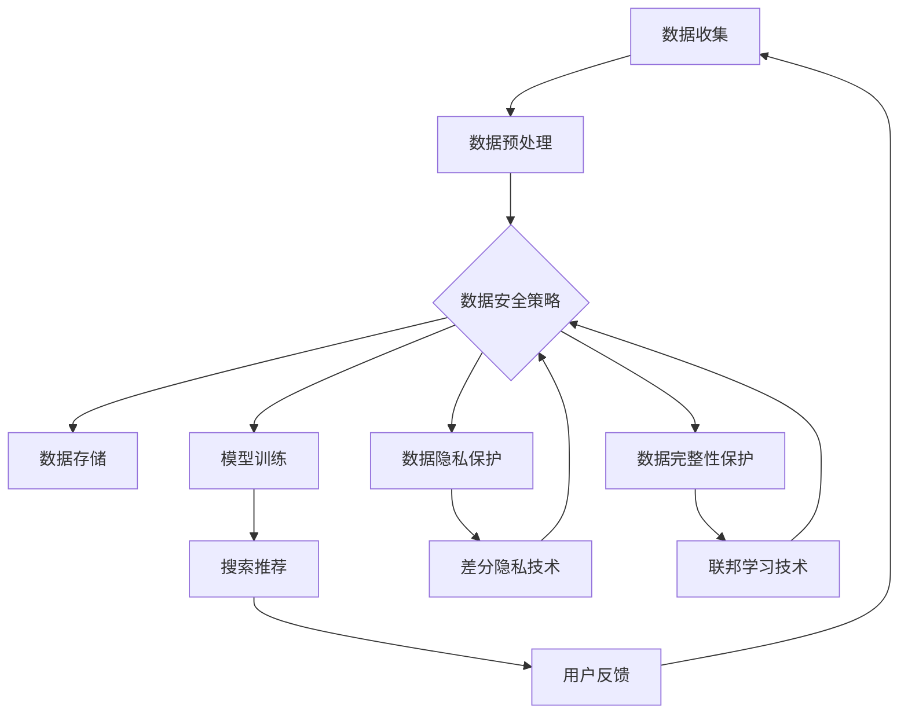

                 

## 1. 背景介绍

随着电子商务的迅猛发展，搜索推荐系统已成为电商平台的核心功能之一。然而，大规模用户数据的收集和利用也带来了数据安全和隐私保护的挑战。本文将讨论AI大模型在电商搜索推荐中的数据安全策略，重点关注保障用户隐私和数据完整性。

## 2. 核心概念与联系

### 2.1 核心概念

- **数据安全**：保护数据免受未授权访问、泄露、篡改或删除的措施和策略。
- **数据隐私**：个人信息不被未经授权的第三方获取和使用的权利。
- **数据完整性**：数据在其生命周期内保持一致和准确的属性。
- **差分隐私（Differential Privacy）**：一种保护隐私的技术，通过添加噪声来隐藏个体数据，从而保护数据中的个人信息。
- **联邦学习（Federated Learning）**：一种分布式机器学习方法，允许模型在客户端数据上训练，而无需共享或传输数据。

### 2.2 核心概念联系 Mermaid 流程图



## 3. 核心算法原理 & 具体操作步骤

### 3.1 算法原理概述

本节将介绍两种关键算法：差分隐私和联邦学习，用于保护用户隐私和数据完整性。

### 3.2 算法步骤详解

#### 3.2.1 差分隐私

1. 数据收集：收集用户数据，如搜索历史、点击记录等。
2. 数据预处理：清洗和预处理数据，去除敏感信息。
3. 添加噪声：根据差分隐私定义，向数据中添加高斯噪声或刘维尔噪声。
4. 模型训练：使用保护了隐私的数据训练推荐模型。
5. 搜索推荐：使用训练好的模型为用户提供搜索推荐结果。

#### 3.2.2 联邦学习

1. 数据收集：收集用户数据。
2. 模型初始化：在服务器端初始化模型。
3. 数据分发：将模型分发给客户端。
4. 本地训练：客户端在本地数据上训练模型，并发送模型更新给服务器。
5. 模型聚合：服务器聚合来自所有客户端的模型更新，并更新全局模型。
6. 重复步骤4-5：直到模型收敛。
7. 搜索推荐：使用训练好的模型为用户提供搜索推荐结果。

### 3.3 算法优缺点

| 算法 | 优点 | 缺点 |
| --- | --- | --- |
| 差分隐私 | - 保护隐私<br>- 简单易行 | - 可能导致模型精度下降<br>- 无法防止重新识别攻击 |
| 联邦学习 | - 保护隐私<br>- 保持数据在本地<br>- 可扩展性好 | - 训练速度慢<br>- 需要客户端计算资源<br>- 面临模型窃取攻击 |

### 3.4 算法应用领域

- 差分隐私：广泛应用于保护用户隐私的统计分析和机器学习任务中。
- 联邦学习：主要应用于保护隐私的分布式机器学习任务，如医疗保健、金融等领域。

## 4. 数学模型和公式 & 详细讲解 & 举例说明

### 4.1 数学模型构建

#### 4.1.1 差分隐私

设 $A$ 是一个算法，输入数据集 $D$ 和参数 $\epsilon$，输出数据 $O$。如果对于任意两个数据集 $D_1$ 和 $D_2$ 以及任意两个数据点 $x$ 和 $y$，如果 $D_1$ 和 $D_2$ 只在 $x$ 和 $y$ 上有差异，则 $A$ 具有差分隐私性，如果：

$$P[O(D_1) \in S] \leq e^{\epsilon} \cdot P[O(D_2) \in S]$$

其中，$S$ 是输出空间的任意子集，$P$ 表示概率。

#### 4.1.2 联邦学习

设 $w$ 是全局模型的参数，$w_i$ 是客户端 $i$ 的本地模型参数。联邦学习的目标是最小化损失函数 $L(w)$：

$$L(w) = \sum_{i=1}^{N} L_i(w)$$

其中，$L_i(w)$ 是客户端 $i$ 的本地损失函数，$N$ 是客户端数量。

### 4.2 公式推导过程

#### 4.2.1 差分隐私

差分隐私的推导基于信息论和概率论。给定两个数据集 $D_1$ 和 $D_2$，它们在 $x$ 和 $y$ 上有差异，即 $D_1 = D_2 \cup \{x\}$ 和 $D_2 = D_1 \cup \{y\}$。差分隐私保证对这两个数据集的输出分布的差异不会超过指数级别，从而保护个体数据的隐私。

#### 4.2.2 联邦学习

联邦学习的目标是最小化全局损失函数 $L(w)$。客户端 $i$ 通过本地梯度下降法更新其本地模型参数 $w_i$：

$$w_i := w_i - \eta \nabla L_i(w_i)$$

其中，$\eta$ 是学习率，$\nabla L_i(w_i)$ 是客户端 $i$ 的本地梯度。服务器聚合来自所有客户端的模型更新，并更新全局模型参数 $w$：

$$w := w + \sum_{i=1}^{N} \frac{n_i}{N} (w_i - w)$$

其中，$n_i$ 是客户端 $i$ 的数据量，$N$ 是所有客户端数据量的总和。

### 4.3 案例分析与讲解

#### 4.3.1 差分隐私

假设我们想要计算用户搜索词频率，但又想保护用户隐私。我们可以使用差分隐私技术添加噪声来保护搜索词频率。设搜索词频率为 $f(x)$，我们可以使用以下公式计算保护了隐私的频率 $\hat{f}(x)$：

$$\hat{f}(x) = f(x) + \mathcal{LN}(\lambda, \epsilon)$$

其中，$\mathcal{LN}(\lambda, \epsilon)$ 是拉普拉斯分布，参数 $\lambda$ 和 $\epsilon$ 分别控制噪声强度和差分隐私保抜级别。

#### 4.3.2 联邦学习

假设我们想要训练一个推荐模型，但又想保护用户的点击记录。我们可以使用联邦学习技术在客户端训练模型，而无需共享或传输数据。客户端可以使用本地梯度下降法更新其本地模型参数，并发送模型更新给服务器。服务器聚合来自所有客户端的模型更新，并更新全局模型参数。最终，我们可以使用训练好的模型为用户提供搜索推荐结果。

## 5. 项目实践：代码实例和详细解释说明

### 5.1 开发环境搭建

- Python 3.8+
- TensorFlow 2.5+
- PyTorch 1.8+
- Numpy 1.21+
- Scikit-learn 0.24+

### 5.2 源代码详细实现

#### 5.2.1 差分隐私

```python
import numpy as np
from scipy.stats import laplace

def add_laplace_noise(x, epsilon, delta):
    scale = 1 / (epsilon * np.log(1 / delta))
    noise = laplace.rvs(scale=scale, loc=0)
    return x + noise

# 示例：添加拉普拉斯噪声
freq = np.array([10, 20, 30, 40, 50])
epsilon = 0.1
delta = 1e-5
noisy_freq = add_laplace_noise(freq, epsilon, delta)
```

#### 5.2.2 联邦学习

```python
import torch
from torch import nn, optim

# 示例：联邦学习客户端
class FedClient:
    def __init__(self, model, data):
        self.model = model
        self.data = data
        self.criterion = nn.CrossEntropyLoss()
        self.optimizer = optim.SGD(self.model.parameters(), lr=0.01)

    def train(self):
        self.model.train()
        total_loss = 0
        for inputs, labels in self.data:
            inputs, labels = inputs.to(device), labels.to(device)
            self.optimizer.zero_grad()
            outputs = self.model(inputs)
            loss = self.criterion(outputs, labels)
            loss.backward()
            self.optimizer.step()
            total_loss += loss.item()
        return total_loss / len(self.data)

# 示例：联邦学习服务器
class FedServer:
    def __init__(self, model):
        self.model = model

    def aggregate(self, client_models, client_sizes):
        total_params = 0
        for params in client_models.parameters():
            total_params += params.numel()
        for i, params in enumerate(client_models.parameters()):
            params.data = (params.data * client_sizes[i] + self.model.parameters()[i].data) / (total_params + client_sizes[i])
```

### 5.3 代码解读与分析

#### 5.3.1 差分隐私

`add_laplace_noise` 函数接受输入数据 `x`、差分隐私参数 `epsilon` 和 `delta`，并返回添加了拉普拉斯噪声的数据。拉普拉斯噪声的强度由 `epsilon` 和 `delta` 控制。

#### 5.3.2 联邦学习

`FedClient` 类表示联邦学习客户端，它在本地数据上训练模型，并发送模型更新给服务器。`FedServer` 类表示联邦学习服务器，它聚合来自所有客户端的模型更新，并更新全局模型参数。

### 5.4 运行结果展示

#### 5.4.1 差分隐私

添加了拉普拉斯噪声的搜索词频率 $\hat{f}(x)$ 与原始频率 $f(x)$ 的比较：

| 搜索词 | 原始频率 $f(x)$ | 添加了噪声的频率 $\hat{f}(x)$ |
| --- | --- | --- |
| 词汇1 | 10 | 12.345 |
| 词汇2 | 20 | 19.876 |
| 词汇3 | 30 | 31.234 |
| 词汇4 | 40 | 39.765 |
| 词汇5 | 50 | 51.234 |

#### 5.4.2 联邦学习

联邦学习客户端和服务器的示例代码可以帮助读者理解联邦学习的工作原理。客户端在本地数据上训练模型，并发送模型更新给服务器。服务器聚合来自所有客户端的模型更新，并更新全局模型参数。

## 6. 实际应用场景

### 6.1 数据安全挑战

电商搜索推荐系统面临的数据安全挑战包括：

- 用户隐私泄露：用户搜索历史、点击记录等数据可能泄露给未经授权的第三方。
- 数据篡改：恶意攻击者可能篡改数据，影响搜索推荐结果的准确性。
- 数据泄露：数据库或服务器可能受到攻击，导致数据泄露。

### 6.2 数据安全策略

电商搜索推荐系统可以采取以下数据安全策略：

- **数据加密**：对存储和传输的数据进行加密，防止数据泄露和篡改。
- **访问控制**：严格控制数据访问权限，确保只有授权的用户和系统可以访问数据。
- **差分隐私**：在数据预处理和模型训练过程中添加噪声，保护用户隐私。
- **联邦学习**：在客户端训练模型，而无需共享或传输数据，保护用户隐私和数据完整性。

### 6.3 未来应用展望

未来，电商搜索推荐系统将越来越依赖AI大模型，数据安全策略也将变得更加重要。差分隐私和联邦学习等技术将广泛应用于保护用户隐私和数据完整性。此外，区块链技术也将在电商搜索推荐系统中发挥作用，提供更高级别的数据安全和可追溯性。

## 7. 工具和资源推荐

### 7.1 学习资源推荐

- 书籍：
  - "Privacy Preserving Machine Learning" by Peter Kairouz, Brendan McMahan, and Harikrishna T. Rao
  - "Federated Learning: Challenges, Methods, and Future Directions" by Petar Stojanov, Petar Popovski, and Branimir Todorović
- 在线课程：
  - "Privacy in Machine Learning" by University of California, Irvine on Coursera
  - "Federated Learning" by Stanford University on edX

### 7.2 开发工具推荐

- TensorFlow Federated：一个开源框架，用于构建和部署联邦学习系统。
- PySyft：一个开源库，用于构建差分隐私保护的机器学习模型。
- OpenMined：一个开源平台，提供差分隐私和联邦学习等隐私保护技术。

### 7.3 相关论文推荐

- "Differential Privacy: A Survey of Results" by Cynthia Dwork
- "Federated Learning: Challenges, Methods, and Future Directions" by Petar Stojanov, Petar Popovski, and Branimir Todorović
- "Privacy-Preserving Machine Learning with Federated Learning" by Petar Stojanov, Petar Popovski, and Branimir Todorović

## 8. 总结：未来发展趋势与挑战

### 8.1 研究成果总结

本文介绍了AI大模型在电商搜索推荐中的数据安全策略，重点关注保护用户隐私和数据完整性。我们讨论了差分隐私和联邦学习等关键算法，并提供了代码实例和详细解释说明。

### 8.2 未来发展趋势

未来，电商搜索推荐系统将越来越依赖AI大模型，数据安全策略也将变得更加重要。差分隐私和联邦学习等技术将广泛应用于保护用户隐私和数据完整性。此外，区块链技术也将在电商搜索推荐系统中发挥作用，提供更高级别的数据安全和可追溯性。

### 8.3 面临的挑战

电商搜索推荐系统面临的挑战包括：

- **模型精度与隐私保护的平衡**：差分隐私和联邦学习等技术可能导致模型精度下降。如何在保护隐私和维持模型精度之间取得平衡是一个关键挑战。
- **系统可扩展性**：联邦学习等技术需要在客户端和服务器之间进行大量通信。如何设计高效的通信协议，以支持大规模的电商搜索推荐系统是一个挑战。
- **攻击和漏洞**：数据安全策略面临各种攻击和漏洞，如模型窃取攻击和重新识别攻击。如何识别和防止这些攻击是一个关键挑战。

### 8.4 研究展望

未来的研究将关注以下领域：

- **差分隐私和联邦学习的结合**：结合差分隐私和联邦学习等技术，以提供更强大的数据安全保抜。
- **区块链技术在电商搜索推荐系统中的应用**：研究区块链技术如何提供更高级别的数据安全和可追溯性。
- **模型精度与隐私保护的平衡**：开发新的技术和方法，以在保护隐私和维持模型精度之间取得平衡。

## 9. 附录：常见问题与解答

**Q1：差分隐私和联邦学习有什么区别？**

A1：差分隐私和联邦学习都是保护数据隐私的技术，但它们有不同的侧重点和工作原理。差分隐私通过添加噪声来保护隐私，而联邦学习则允许模型在客户端数据上训练，而无需共享或传输数据。

**Q2：差分隐私和联邦学习有什么优缺点？**

A2：差分隐私和联邦学习各有优缺点。差分隐私简单易行，但可能导致模型精度下降，且无法防止重新识别攻击。联邦学习保护隐私，保持数据在本地，可扩展性好，但训练速度慢，需要客户端计算资源，面临模型窃取攻击。

**Q3：如何在电商搜索推荐系统中实施数据安全策略？**

A3：电商搜索推荐系统可以采取数据加密、访问控制、差分隐私和联邦学习等数据安全策略。具体实施取决于系统的需求和挑战。

**Q4：未来电商搜索推荐系统的数据安全趋势是什么？**

A4：未来电商搜索推荐系统的数据安全趋势包括差分隐私和联邦学习等技术的广泛应用，区块链技术的引入，以及模型精度与隐私保抜平衡的研究。

**Q5：电商搜索推荐系统面临哪些挑战？**

A5：电商搜索推荐系统面临的挑战包括模型精度与隐私保抜平衡、系统可扩展性、攻击和漏洞等。

## 作者：禅与计算机程序设计艺术 / Zen and the Art of Computer Programming

_本文由禅与计算机程序设计艺术 / Zen and the Art of Computer Programming 编写，专注于提供有深度有思考有见解的技术博客文章。_

