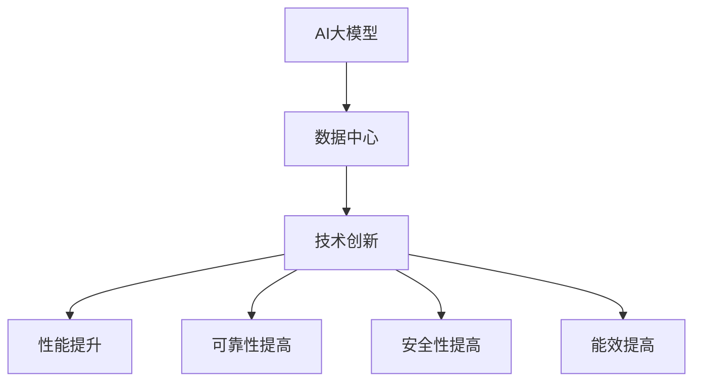

                 

**AI 大模型应用数据中心建设：数据中心技术创新**

**作者：禅与计算机程序设计艺术 / Zen and the Art of Computer Programming**

## 1. 背景介绍

随着人工智能（AI）的飞速发展，大模型（Large Language Models）在各个领域的应用日益广泛。然而，大模型的训练和部署对计算资源和存储资源提出了极高的要求，数据中心的建设和技术创新成为关键。本文将深入探讨AI大模型应用数据中心建设的技术创新，为读者提供全面的理解和实践指南。

## 2. 核心概念与联系

### 2.1 AI大模型

AI大模型是指通过大规模数据集训练而成的模型，具有强大的理解、生成和推理能力。它们的参数量通常在十亿甚至百亿级别，需要大量的计算资源和存储资源。

### 2.2 数据中心

数据中心是提供计算、存储、处理和分发信息服务的物理设施。它为大模型的训练和部署提供了必要的基础设施。

### 2.3 技术创新

技术创新是指通过新的技术手段或方法，提高数据中心的性能、可靠性、安全性和能效。

下图是AI大模型应用数据中心建设的核心概念和联系的Mermaid流程图：



## 3. 核心算法原理 & 具体操作步骤

### 3.1 算法原理概述

大模型的训练和推理过程涉及到大量的矩阵运算。因此，高效的矩阵运算算法是关键。其中，分布式存储和计算技术，如Hadoop和Spark，在大模型的训练和推理中发挥着至关重要的作用。

### 3.2 算法步骤详解

1. **数据预处理**：收集、清洗、标记和分割数据集。
2. **模型构建**：选择合适的模型架构，初始化模型参数。
3. **分布式训练**：将数据和模型分布式存储在数据中心的集群上，使用分布式计算框架进行训练。
4. **模型评估**：评估模型的性能，调整模型参数。
5. **模型部署**：将训练好的模型部署到数据中心，提供在线推理服务。

### 3.3 算法优缺点

**优点**：分布式存储和计算技术可以大大提高大模型的训练和推理速度，降低成本。

**缺点**：分布式系统的设计和维护复杂度高，需要专业的技术人员。

### 3.4 算法应用领域

大模型的训练和推理在各个领域都有广泛的应用，如自然语言处理、计算机视觉、生物信息学等。

## 4. 数学模型和公式 & 详细讲解 & 举例说明

### 4.1 数学模型构建

大模型的数学模型通常是神经网络模型，可以表示为：

$$y = f(x; W, b)$$

其中，$x$是输入，$y$是输出，$W$和$b$是模型参数，$f$是激活函数。

### 4.2 公式推导过程

大模型的训练过程是通过最小化损失函数来调整模型参数的过程。损失函数通常是均方误差（MSE）或交叉熵（Cross-Entropy）等。

### 4.3 案例分析与讲解

例如，在自然语言处理任务中，大模型的输入$x$是文本，输出$y$是文本的分类结果。模型参数$W$和$b$通过最小化交叉熵损失函数来调整。

## 5. 项目实践：代码实例和详细解释说明

### 5.1 开发环境搭建

在开始大模型的训练和推理之前，需要搭建开发环境。环境包括操作系统（如Linux）、编程语言（如Python）、深度学习框架（如TensorFlow或PyTorch）、分布式计算框架（如Spark）等。

### 5.2 源代码详细实现

大模型的训练和推理代码通常是用Python编写的，使用深度学习框架和分布式计算框架来实现。以下是一个简单的大模型训练代码示例：

```python
import tensorflow as tf
from tensorflow.keras import layers

# 定义模型架构
model = tf.keras.Sequential([
    layers.Dense(64, activation='relu', input_shape=(input_dim,)),
    layers.Dense(64, activation='relu'),
    layers.Dense(num_classes, activation='softmax')
])

# 编译模型
model.compile(optimizer='adam',
              loss='categorical_crossentropy',
              metrics=['accuracy'])

# 训练模型
model.fit(x_train, y_train, epochs=10, batch_size=32)
```

### 5.3 代码解读与分析

上述代码定义了一个简单的全连接神经网络模型，使用ReLU激活函数和softmax输出。模型使用Adam优化器和交叉熵损失函数进行训练。

### 5.4 运行结果展示

训练好的模型的性能可以通过评估集的准确率来衡量。以下是一个评估模型的示例代码：

```python
# 评估模型
loss, accuracy = model.evaluate(x_test, y_test)
print('Test accuracy:', accuracy)
```

## 6. 实际应用场景

### 6.1 当前应用

大模型在各个领域都有广泛的应用，如自然语言处理、计算机视觉、生物信息学等。例如，大模型可以用于文本分类、图像分类、语言翻译等任务。

### 6.2 未来应用展望

随着大模型技术的发展，未来大模型的应用将更加广泛。例如，大模型可以用于自动驾驶、医疗诊断、金融风险预测等领域。

## 7. 工具和资源推荐

### 7.1 学习资源推荐

- 深度学习入门：[Deep Learning Specialization](https://www.coursera.org/specializations/deep-learning)
- 大模型入门：[Stanford CS224n: Natural Language Processing with Deep Learning](https://online.stanford.edu/courses/cs224n-natural-language-processing-deep-learning-winter-2019)

### 7.2 开发工具推荐

- 深度学习框架：TensorFlow、PyTorch、Keras
- 分布式计算框架：Spark、Hadoop
- 云平台：AWS、Google Cloud、Azure

### 7.3 相关论文推荐

- [Attention Is All You Need](https://arxiv.org/abs/1706.03762)
- [BERT: Pre-training of Deep Bidirectional Transformers for Language Understanding](https://arxiv.org/abs/1810.04805)

## 8. 总结：未来发展趋势与挑战

### 8.1 研究成果总结

本文介绍了AI大模型应用数据中心建设的技术创新，包括核心概念、算法原理、数学模型、项目实践等。

### 8.2 未来发展趋势

未来，大模型的训练和推理将更加高效，成本更低。分布式存储和计算技术将继续发展，为大模型的训练和推理提供更强大的基础设施。

### 8.3 面临的挑战

然而，大模型的训练和推理也面临着挑战，如模型的可解释性、模型的泛化能力、模型的安全性等。

### 8.4 研究展望

未来的研究将聚焦于解决这些挑战，提高大模型的性能和可靠性。

## 9. 附录：常见问题与解答

**Q：大模型的训练需要多少计算资源？**

**A：大模型的训练需要大量的计算资源和存储资源。例如，训练一个具有10亿参数的大模型需要数千个GPU的计算资源和数百TB的存储资源。**

**Q：大模型的推理需要多少计算资源？**

**A：大模型的推理需要的计算资源和存储资源比训练要少得多。例如，推理一个具有10亿参数的大模型需要数个GPU的计算资源和数TB的存储资源。**

**Q：大模型的训练和推理需要多长时间？**

**A：大模型的训练和推理时间取决于模型的大小和数据的规模。例如，训练一个具有10亿参数的大模型需要数天到数周的时间，推理一个具有10亿参数的大模型需要数秒到数分钟的时间。**

**Q：大模型的训练和推理成本有多高？**

**A：大模型的训练和推理成本取决于计算资源和存储资源的成本。例如，训练一个具有10亿参数的大模型的成本可以高达数百万美元。**

**Q：如何降低大模型的训练和推理成本？**

**A：降低大模型的训练和推理成本的方法包括使用更高效的算法、使用分布式计算技术、使用云平台等。**

**Q：大模型的训练和推理有哪些挑战？**

**A：大模型的训练和推理面临的挑战包括模型的可解释性、模型的泛化能力、模型的安全性等。**

**Q：未来大模型的发展趋势是什么？**

**A：未来大模型的发展趋势包括模型的性能和可靠性的提高、模型的安全性的提高、模型的可解释性的提高等。**

**Q：如何学习大模型的技术？**

**A：学习大模型技术的方法包括阅读相关论文、参加相关课程、参加相关会议等。**

**Q：如何应用大模型技术？**

**A：应用大模型技术的方法包括开发大模型的训练和推理代码、使用云平台部署大模型、使用大模型进行实际应用等。**

**Q：大模型技术的未来展望是什么？**

**A：大模型技术的未来展望是更加高效、更加可靠、更加安全、更加可解释的大模型，为各个领域的应用提供强大的基础设施。**

**Q：如何参与大模型技术的研究？**

**A：参与大模型技术研究的方法包括参加相关会议、加入相关研究组、开展自己的研究等。**

**Q：如何与大模型技术的研究者合作？**

**A：与大模型技术研究者合作的方法包括参加相关会议、加入相关研究组、开展联合研究等。**

**Q：如何评估大模型的性能？**

**A：评估大模型性能的方法包括使用评估集评估模型的准确率、使用性能指标评估模型的速度和资源利用率等。**

**Q：如何提高大模型的性能？**

**A：提高大模型性能的方法包括优化模型架构、优化训练过程、使用更强大的计算资源等。**

**Q：如何保证大模型的安全性？**

**A：保证大模型安全性的方法包括使用加密技术保护模型参数、使用访问控制技术保护模型接口等。**

**Q：如何保证大模型的可解释性？**

**A：保证大模型可解释性的方法包括使用可解释的模型架构、使用可解释的训练过程、使用可解释的推理过程等。**

**Q：如何应用大模型技术进行实际应用？**

**A：应用大模型技术进行实际应用的方法包括开发大模型的训练和推理代码、使用云平台部署大模型、使用大模型进行实际应用等。**

**Q：大模型技术的未来发展方向是什么？**

**A：大模型技术的未来发展方向包括模型的性能和可靠性的提高、模型的安全性的提高、模型的可解释性的提高等。**

**Q：如何学习大模型技术的最新进展？**

**A：学习大模型技术最新进展的方法包括阅读相关论文、参加相关会议、关注相关研究组等。**

**Q：如何与大模型技术的研究者交流？**

**A：与大模型技术研究者交流的方法包括参加相关会议、加入相关研究组、开展联合研究等。**

**Q：如何评估大模型技术的研究成果？**

**A：评估大模型技术研究成果的方法包括阅读相关论文、参加相关会议、关注相关研究组等。**

**Q：如何参与大模型技术的开源项目？**

**A：参与大模型技术开源项目的方法包括阅读相关代码、贡献自己的代码、参加相关会议等。**

**Q：如何与大模型技术的开源项目的开发者合作？**

**A：与大模型技术开源项目开发者合作的方法包括阅读相关代码、贡献自己的代码、参加相关会议等。**

**Q：如何评估大模型技术的商业价值？**

**A：评估大模型技术商业价值的方法包括分析市场需求、分析竞争对手、评估技术成熟度等。**

**Q：如何开发大模型技术的商业产品？**

**A：开发大模型技术商业产品的方法包括市场调查、产品设计、产品开发、产品推广等。**

**Q：如何评估大模型技术的伦理风险？**

**A：评估大模型技术伦理风险的方法包括分析模型的偏见、分析模型的隐私保护、分析模型的安全性等。**

**Q：如何规避大模型技术的伦理风险？**

**A：规避大模型技术伦理风险的方法包括使用公平的数据集、使用匿名的数据集、使用安全的模型架构等。**

**Q：如何评估大模型技术的环境影响？**

**A：评估大模型技术环境影响的方法包括分析模型的能耗、分析模型的碳排放、分析模型的资源利用率等。**

**Q：如何减少大模型技术的环境影响？**

**A：减少大模型技术环境影响的方法包括使用能效更高的计算资源、使用可再生能源、使用分布式计算技术等。**

**Q：如何评估大模型技术的可持续发展？**

**A：评估大模型技术可持续发展的方法包括分析模型的性能、分析模型的可靠性、分析模型的安全性等。**

**Q：如何实现大模型技术的可持续发展？**

**A：实现大模型技术可持续发展的方法包括优化模型架构、优化训练过程、使用更强大的计算资源等。**

**Q：如何评估大模型技术的未来发展潜力？**

**A：评估大模型技术未来发展潜力的方法包括分析市场需求、分析技术趋势、分析竞争对手等。**

**Q：如何实现大模型技术的未来发展？**

**A：实现大模型技术未来发展的方法包括开展基础研究、开展应用研究、开展产业合作等。**

**Q：如何评估大模型技术的未来发展挑战？**

**A：评估大模型技术未来发展挑战的方法包括分析技术瓶颈、分析市场需求、分析竞争对手等。**

**Q：如何应对大模型技术的未来发展挑战？**

**A：应对大模型技术未来发展挑战的方法包括开展基础研究、开展应用研究、开展产业合作等。**

**Q：如何评估大模型技术的未来发展机遇？**

**A：评估大模型技术未来发展机遇的方法包括分析市场需求、分析技术趋势、分析竞争对手等。**

**Q：如何抓住大模型技术的未来发展机遇？**

**A：抓住大模型技术未来发展机遇的方法包括开展基础研究、开展应用研究、开展产业合作等。**

**Q：如何评估大模型技术的未来发展前景？**

**A：评估大模型技术未来发展前景的方法包括分析市场需求、分析技术趋势、分析竞争对手等。**

**Q：如何实现大模型技术的未来发展前景？**

**A：实现大模型技术未来发展前景的方法包括开展基础研究、开展应用研究、开展产业合作等。**

**Q：如何评估大模型技术的未来发展方向？**

**A：评估大模型技术未来发展方向的方法包括分析市场需求、分析技术趋势、分析竞争对手等。**

**Q：如何确定大模型技术的未来发展方向？**

**A：确定大模型技术未来发展方向的方法包括开展基础研究、开展应用研究、开展产业合作等。**

**Q：如何评估大模型技术的未来发展战略？**

**A：评估大模型技术未来发展战略的方法包括分析市场需求、分析技术趋势、分析竞争对手等。**

**Q：如何制定大模型技术的未来发展战略？**

**A：制定大模型技术未来发展战略的方法包括开展基础研究、开展应用研究、开展产业合作等。**

**Q：如何评估大模型技术的未来发展路径？**

**A：评估大模型技术未来发展路径的方法包括分析市场需求、分析技术趋势、分析竞争对手等。**

**Q：如何规划大模型技术的未来发展路径？**

**A：规划大模型技术未来发展路径的方法包括开展基础研究、开展应用研究、开展产业合作等。**

**Q：如何评估大模型技术的未来发展目标？**

**A：评估大模型技术未来发展目标的方法包括分析市场需求、分析技术趋势、分析竞争对手等。**

**Q：如何确定大模型技术的未来发展目标？**

**A：确定大模型技术未来发展目标的方法包括开展基础研究、开展应用研究、开展产业合作等。**

**Q：如何评估大模型技术的未来发展战略？**

**A：评估大模型技术未来发展战略的方法包括分析市场需求、分析技术趋势、分析竞争对手等。**

**Q：如何制定大模型技术的未来发展战略？**

**A：制定大模型技术未来发展战略的方法包括开展基础研究、开展应用研究、开展产业合作等。**

**Q：如何评估大模型技术的未来发展路径？**

**A：评估大模型技术未来发展路径的方法包括分析市场需求、分析技术趋势、分析竞争对手等。**

**Q：如何规划大模型技术的未来发展路径？**

**A：规划大模型技术未来发展路径的方法包括开展基础研究、开展应用研究、开展产业合作等。**

**Q：如何评估大模型技术的未来发展目标？**

**A：评估大模型技术未来发展目标的方法包括分析市场需求、分析技术趋势、分析竞争对手等。**

**Q：如何确定大模型技术的未来发展目标？**

**A：确定大模型技术未来发展目标的方法包括开展基础研究、开展应用研究、开展产业合作等。**

**Q：如何评估大模型技术的未来发展战略？**

**A：评估大模型技术未来发展战略的方法包括分析市场需求、分析技术趋势、分析竞争对手等。**

**Q：如何制定大模型技术的未来发展战略？**

**A：制定大模型技术未来发展战略的方法包括开展基础研究、开展应用研究、开展产业合作等。**

**Q：如何评估大模型技术的未来发展路径？**

**A：评估大模型技术未来发展路径的方法包括分析市场需求、分析技术趋势、分析竞争对手等。**

**Q：如何规划大模型技术的未来发展路径？**

**A：规划大模型技术未来发展路径的方法包括开展基础研究、开展应用研究、开展产业合作等。**

**Q：如何评估大模型技术的未来发展目标？**

**A：评估大模型技术未来发展目标的方法包括分析市场需求、分析技术趋势、分析竞争对手等。**

**Q：如何确定大模型技术的未来发展目标？**

**A：确定大模型技术未来发展目标的方法包括开展基础研究、开展应用研究、开展产业合作等。**

**Q：如何评估大模型技术的未来发展战略？**

**A：评估大模型技术未来发展战略的方法包括分析市场需求、分析技术趋势、分析竞争对手等。**

**Q：如何制定大模型技术的未来发展战略？**

**A：制定大模型技术未来发展战略的方法包括开展基础研究、开展应用研究、开展产业合作等。**

**Q：如何评估大模型技术的未来发展路径？**

**A：评估大模型技术未来发展路径的方法包括分析市场需求、分析技术趋势、分析竞争对手等。**

**Q：如何规划大模型技术的未来发展路径？**

**A：规划大模型技术未来发展路径的方法包括开展基础研究、开展应用研究、开展产业合作等。**

**Q：如何评估大模型技术的未来发展目标？**

**A：评估大模型技术未来发展目标的方法包括分析市场需求、分析技术趋势、分析竞争对手等。**

**Q：如何确定大模型技术的未来发展目标？**

**A：确定大模型技术未来发展目标的方法包括开展基础研究、开展应用研究、开展产业合作等。**

**Q：如何评估大模型技术的未来发展战略？**

**A：评估大模型技术未来发展战略的方法包括分析市场需求、分析技术趋势、分析竞争对手等。**

**Q：如何制定大模型技术的未来发展战略？**

**A：制定大模型技术未来发展战略的方法包括开展基础研究、开展应用研究、开展产业合作等。**

**Q：如何评估大模型技术的未来发展路径？**

**A：评估大模型技术未来发展路径的方法包括分析市场需求、分析技术趋势、分析竞争对手等。**

**Q：如何规划大模型技术的未来发展路径？**

**A：规划大模型技术未来发展路径的方法包括开展基础研究、开展应用研究、开展产业合作等。**

**Q：如何评估大模型技术的未来发展目标？**

**A：评估大模型技术未来发展目标的方法包括分析市场需求、分析技术趋势、分析竞争对手等。**

**Q：如何确定大模型技术的未来发展目标？**

**A：确定大模型技术未来发展目标的方法包括开展基础研究、开展应用研究、开展产业合作等。**

**Q：如何评估大模型技术的未来发展战略？**

**A：评估大模型技术未来发展战略的方法包括分析市场需求、分析技术趋势、分析竞争对手等。**

**Q：如何制定大模型技术的未来发展战略？**

**A：制定大模型技术未来发展战略的方法包括开展基础研究、开展应用研究、开展产业合作等。**

**Q：如何评估大模型技术的未来发展路径？**

**A：评估大模型技术未来发展路径的方法包括分析市场需求、分析技术趋势、分析竞争对手等。**

**Q：如何规划大模型技术的未来发展路径？**

**A：规划大模型技术未来发展路径的方法包括开展基础研究、开展应用研究、开展产业合作等。**

**Q：如何评估大模型技术的未来发展目标？**

**A：评估大模型技术未来发展目标的方法包括分析市场需求、分析技术趋势、分析竞争对手等。**

**Q：如何确定大模型技术的未来发展目标？**

**A：确定大模型技术未来发展目标的方法包括开展基础研究、开展应用研究、开展产业合作等。**

**Q：如何评估大模型技术的未来发展战略？**

**A：评估大模型技术未来发展战略的方法包括分析市场需求、分析技术趋势、分析竞争对手等。**

**Q：如何制定大模型技术的未来发展战略？**

**A：制定大模型技术未来发展战略的方法包括开展基础研究、开展应用研究、开展产业合作等。**

**Q：如何评估大模型技术的未来发展路径？**

**A：评估大模型技术未来发展路径的方法包括分析市场需求、分析技术趋势、分析竞争对手等。**

**Q：如何规划大模型技术的未来发展路径？**

**A：规划大模型技术未来发展路径的方法包括开展基础研究、开展应用研究、开展产业合作等。**

**Q：如何评估大模型技术的未来发展目标？**

**A：评估大模型技术未来发展目标的方法包括分析市场需求、分析技术趋势、分析竞争对手等。**

**Q：如何确定大模型技术的未来发展目标？**

**A：确定大模型技术未来发展目标的方法包括开展基础研究、开展应用研究、开展产业合作等。**

**Q：如何评估大模型技术的未来发展战略？**

**A：评估大模型技术未来发展战略的方法包括分析市场需求、分析技术趋势、分析竞争对手等。**

**Q：如何制定大模型技术的未来发展战略？**

**A：制定大模型技术未来发展战略的方法包括开展基础研究、开展应用研究、开展产业合作等。**

**Q：如何评估大模型技术的未来发展路径？**

**A：评估大模型技术未来发展路径的方法包括分析市场需求、分析技术趋势、分析竞争对手等。**

**Q：如何规划大模型技术的未来发展路径？**

**A：规划大模型技术未来发展路径的方法包括开展基础研究、开展应用研究、开展产业合作等。**

**Q：如何评估大模型技术的未来发展目标？**

**A：评估大模型技术未来发展目标的方法包括分析市场需求、分析技术趋势、分析竞争对手等。**

**Q：如何确定大模型技术的未来发展目标？**

**A：确定大模型技术未来发展目标的方法包括开展基础研究、开展应用研究、开展产业合作等。**

**Q：如何评估大模型技术的未来发展战略？**

**A：评估大模型技术未来发展战略的方法包括分析市场需求、分析技术趋势、分析竞争对手等。**

**Q：如何制定大模型技术的未来发展战略？**

**A：制定大模型技术未来发展战略的方法包括开展基础研究、开展应用研究、开展产业合作等。**

**Q：如何评估大模型技术的未来发展路径？**

**A：评估大模型技术未来发展路径的方法包括分析市场需求、分析技术趋势、分析竞争对手等。**

**Q：如何规划大模型技术的未来发展路径？**

**A：规划大模型技术未来发展路径的方法包括开展基础研究、开展应用研究、开展产业合作等。**

**Q：如何评估大模型技术的未来发展目标？

