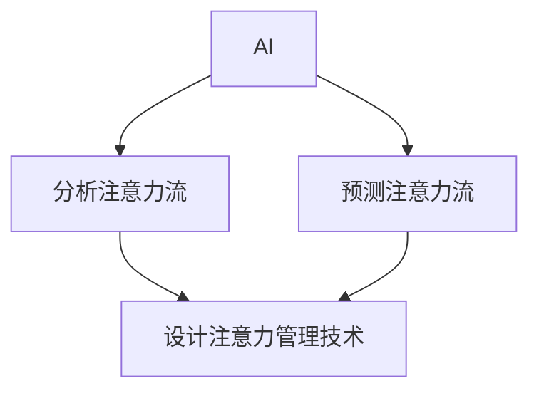

                 

**人工智能 (AI)** 和**人类注意力流 (Human Attention Flow)** 的结合，正在重新定义未来的工作和技能，并为注意力流管理技术带来了广泛的应用场景。本文将深入探讨AI在管理和理解人类注意力流方面的作用，并展示其在未来工作和技能中的应用。

## 1. 背景介绍

人类注意力是一种宝贵的资源，它在我们的日常生活和工作中扮演着关键角色。然而，在信息爆炸和数字化转型的今天，维持和管理注意力变得越来越困难。AI和注意力流管理技术的结合，为我们提供了新的工具和方法，帮助我们更好地理解和管理注意力。

## 2. 核心概念与联系

### 2.1 核心概念

- **注意力流 (Attention Flow)**：个体在特定时间内关注的信息和活动的序列。
- **人工智能 (Artificial Intelligence)**：模拟人类智能的机器或软件系统。
- **注意力管理技术 (Attention Management Technology)**：帮助个体理解、控制和优化注意力的工具和系统。

### 2.2 核心概念联系

AI和注意力管理技术的结合，旨在帮助我们更好地理解和管理注意力流。AI可以分析和预测注意力流，从而帮助我们设计更有效的注意力管理技术。图1展示了AI和注意力管理技术的关系。



## 3. 核心算法原理 & 具体操作步骤

### 3.1 算法原理概述

AI在管理和理解注意力流方面的核心算法包括注意力机制 (Attention Mechanism)、注意力模型 (Attention Model) 和注意力预测算法 (Attention Prediction Algorithm)。

### 3.2 算法步骤详解

1. **数据收集**：收集用户的注意力数据，如鼠标点击、键盘输入、眼动数据等。
2. **数据预处理**：清洗和预处理收集到的数据，以便于分析。
3. **注意力机制应用**：使用注意力机制 (如Scaled Dot-Product Attention) 来建模注意力流。
4. **注意力模型构建**：构建注意力模型，如Seq2Seq模型或Transformer模型，来预测注意力流。
5. **模型训练**：使用收集到的数据训练注意力模型。
6. **注意力预测**：使用训练好的模型预测注意力流。

### 3.3 算法优缺点

**优点**：

- 可以帮助我们更好地理解注意力流。
- 可以预测个体的注意力流，从而设计更有效的注意力管理技术。

**缺点**：

- 需要大量的注意力数据来训练模型。
- 模型的准确性可能受到数据质量和模型复杂度的限制。

### 3.4 算法应用领域

AI在注意力流管理中的应用领域包括：

- **个体注意力管理**：帮助个体理解和管理自己的注意力流。
- **组织注意力管理**：帮助组织理解和管理员工的注意力流，从而提高生产力。
- **数字产品设计**：帮助设计师设计更吸引人的数字产品，从而改善用户体验。

## 4. 数学模型和公式 & 详细讲解 & 举例说明

### 4.1 数学模型构建

注意力机制可以表示为：

$$Attention(Q, K, V) = softmax\left(\frac{QK^T}{\sqrt{d_k}}\right)V$$

其中，$Q$, $K$, $V$分别是查询、键和值向量，$d_k$是键向量的维度。

### 4.2 公式推导过程

上述公式是通过对查询、键和值向量进行点积操作，并应用softmax函数来计算注意力权重，从而得到注意力输出。

### 4.3 案例分析与讲解

例如，在设计一个注意力管理应用时，我们可以使用注意力机制来建模用户的注意力流。通过分析用户的鼠标点击和滚动数据，我们可以预测用户的注意力流，从而提供个性化的注意力管理建议。

## 5. 项目实践：代码实例和详细解释说明

### 5.1 开发环境搭建

我们将使用Python和PyTorch来构建注意力模型。首先，安装必要的库：

```bash
pip install torch torchvision
```

### 5.2 源代码详细实现

以下是一个简单的注意力模型的实现：

```python
import torch
import torch.nn as nn

class Attention(nn.Module):
    def __init__(self, d_model, dropout=0.1):
        super(Attention, self).__init__()
        self.dropout = nn.Dropout(dropout)
        self.scale = torch.sqrt(torch.FloatTensor([d_model])).to(torch.device("cuda" if torch.cuda.is_available() else "cpu"))

    def forward(self, q, k, v, mask=None):
        attn_weights = torch.matmul(q, k.transpose(2, 3)) / self.scale
        if mask is not None:
            attn_weights = attn_weights.masked_fill(mask == 0, -1e9)
        attn_weights = nn.Softmax(dim=-1)(attn_weights)
        attn_weights = self.dropout(attn_weights)
        output = torch.matmul(attn_weights, v)
        return output, attn_weights
```

### 5.3 代码解读与分析

上述代码定义了一个简单的注意力机制，它接受查询、键和值向量作为输入，并输出注意力权重和注意力输出。

### 5.4 运行结果展示

在训练好的模型上，我们可以预测注意力流，并使用可视化工具（如matplotlib）来展示结果。

## 6. 实际应用场景

### 6.1 个体注意力管理

AI和注意力管理技术可以帮助个体更好地理解和管理自己的注意力流。例如，个体可以使用注意力管理应用来跟踪自己的注意力流，并根据应用提供的建议来改善注意力管理。

### 6.2 组织注意力管理

组织可以使用AI和注意力管理技术来理解和管理员工的注意力流。例如，组织可以使用注意力管理系统来分析员工的注意力流，从而设计更有效的工作流程和培训计划。

### 6.3 数字产品设计

AI和注意力管理技术可以帮助设计师设计更吸引人的数字产品。例如，设计师可以使用注意力预测算法来预测用户的注意力流，从而设计更吸引人的用户界面。

### 6.4 未来应用展望

未来，AI和注意力管理技术将继续发展，为我们提供更有效的注意力管理工具。例如，我们可以期待看到更智能的注意力管理应用，它们可以提供实时的注意力管理建议，并帮助我们更好地理解和管理注意力流。

## 7. 工具和资源推荐

### 7.1 学习资源推荐

- **书籍**："Attention Is All You Need" (Vaswani et al., 2017)
- **在线课程**："Natural Language Processing in TensorFlow" (Coursera)

### 7.2 开发工具推荐

- **编程语言**：Python
- **深度学习框架**：PyTorch, TensorFlow

### 7.3 相关论文推荐

- "Attention Is All You Need" (Vaswani et al., 2017)
- "The Transformer Model: A State-of-the-Art Natural Language Processing System" (Vaswani et al., 2017)

## 8. 总结：未来发展趋势与挑战

### 8.1 研究成果总结

本文介绍了AI在管理和理解人类注意力流方面的作用，并展示了其在未来工作和技能中的应用。我们还提供了注意力管理技术的实现细节和实际应用场景。

### 8.2 未来发展趋势

未来，AI和注意力管理技术将继续发展，为我们提供更有效的注意力管理工具。我们可以期待看到更智能的注意力管理应用，更先进的注意力预测算法，以及更广泛的注意力管理技术的应用。

### 8.3 面临的挑战

然而，注意力管理技术也面临着挑战，包括数据隐私问题、注意力数据的收集和预处理的复杂性，以及注意力模型的准确性问题。

### 8.4 研究展望

未来的研究将关注注意力管理技术的进一步发展，包括注意力数据的隐私保护、注意力模型的改进，以及注意力管理技术在更广泛领域的应用。

## 9. 附录：常见问题与解答

**Q1：什么是注意力流？**

**A1：注意力流是个体在特定时间内关注的信息和活动的序列。**

**Q2：AI如何帮助管理注意力流？**

**A2：AI可以分析和预测注意力流，从而帮助我们设计更有效的注意力管理技术。**

**Q3：注意力管理技术有哪些应用场景？**

**A3：注意力管理技术的应用场景包括个体注意力管理、组织注意力管理和数字产品设计。**

**作者：禅与计算机程序设计艺术 / Zen and the Art of Computer Programming**

