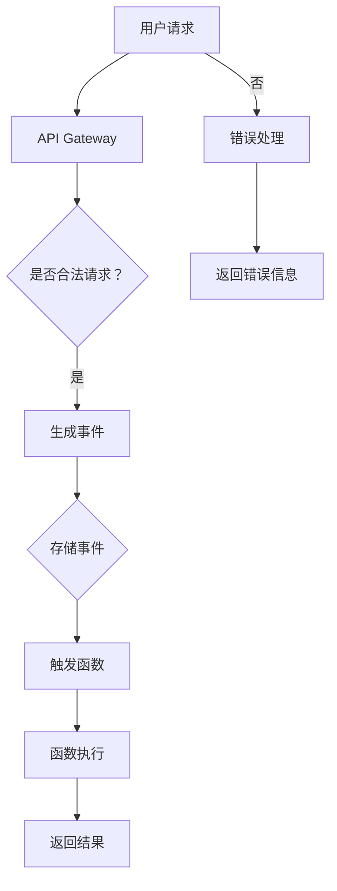

                 

### 1. 背景介绍

**Serverless架构**是云计算领域中的一种创新模型，旨在简化应用程序的开发、部署和管理。随着云计算技术的不断进步，传统的前后端分离架构已经无法满足日益增长的复杂性和可扩展性需求。Serverless架构应运而生，通过将计算资源抽象化，使得开发者可以专注于业务逻辑的实现，而无需担心底层基础设施的维护和扩展。

**事件驱动**是一种软件架构设计模式，它通过事件触发来控制应用程序的执行。事件可以是用户交互、系统通知、时间触发器，甚至是从其他服务接收的数据。事件驱动架构的优势在于其高可扩展性和灵活性，因为系统可以根据事件的数量和类型动态调整资源。

Serverless架构与事件驱动相结合，形成了一种全新的云计算模型。在这种模型中，应用程序由一系列无状态、细粒度的函数组成，这些函数在接收到事件时触发执行。这种模型不仅降低了开发者的复杂度，还提高了系统的响应速度和可扩展性。

本文旨在深入探讨Serverless架构的核心概念、工作原理、应用场景以及未来发展趋势。通过逐步分析推理，我们将揭示Serverless架构如何通过事件驱动实现云计算的革新。

### Background Introduction

**Serverless architecture** is an innovative model within the field of cloud computing designed to simplify the development, deployment, and management of applications. As cloud computing technologies continue to evolve, traditional front-end and back-end separation architectures have proven insufficient to meet the increasing complexity and scalability demands. Serverless architecture has emerged to address these challenges by abstracting computing resources, allowing developers to focus solely on the implementation of business logic without the need to manage underlying infrastructure.

**Event-driven** is a software architecture design pattern that controls the execution of an application based on events. Events can be user interactions, system notifications, time triggers, or even data received from other services. The advantage of event-driven architecture lies in its high scalability and flexibility, as the system can dynamically adjust resources based on the number and type of events.

Combining Serverless architecture with event-driven principles gives rise to a new cloud computing model. In this model, applications are composed of a series of stateless, fine-grained functions that are triggered to execute when they receive events. This model not only reduces the complexity for developers but also enhances the system's responsiveness and scalability.

This article aims to delve into the core concepts, working principles, application scenarios, and future development trends of Serverless architecture. By employing a step-by-step analytical approach, we will uncover how Serverless architecture achieves a revolution in cloud computing through event-driven principles.

---

#### 1.1  Serverless架构的历史与发展

Serverless架构的概念起源于云计算早期的发展阶段。最初的云计算模型是基于虚拟机和容器技术的，这些模型要求开发者深入了解底层基础设施，并负责管理服务器、操作系统、网络等资源。这种模型虽然提高了资源的利用率，但同时也增加了维护和管理的复杂性。

在2011年，Amazon Web Services (AWS) 推出了第一个Serverless服务——AWS Lambda，标志着Serverless架构的诞生。Lambda允许开发者编写无状态函数，这些函数在事件触发时自动执行，并且仅按实际使用量收费。这种服务模式立即引起了业界的广泛关注，因为它显著简化了应用程序的开发和部署过程。

随后，其他云服务提供商如Google Cloud Platform (GCP) 和 Microsoft Azure 也相继推出了自己的Serverless服务。这些服务通常包括函数即服务（Functions as a Service, FaaS）和 Backend as a Service (BaaS)，为开发者提供了更广泛的选择和灵活性。

随着时间的推移，Serverless架构逐渐从单一的服务扩展到一种完整的生态系统，包括开发工具、框架、库以及集成服务。这种生态系统的成熟进一步推动了Serverless架构的普及和应用。

#### 1.2  Serverless架构的核心特点

Serverless架构具有以下核心特点，这些特点使其在云计算领域脱颖而出：

1. **无服务器**：开发者无需管理物理服务器或虚拟机，从而减轻了基础设施的维护负担。
2. **事件驱动**：应用程序的执行由外部事件触发，这使得系统具有更高的灵活性和可扩展性。
3. **按需分配**：计算资源仅在函数执行时分配，无需预配或预留资源，从而提高了资源利用率。
4. **细粒度**：函数通常是细粒度的，这有助于更好地管理和优化资源使用。
5. **按需计费**：开发者仅支付实际使用的计算资源，无需为闲置资源付费。
6. **高可扩展性**：系统可以根据事件的数量和类型动态调整资源，以应对不同的负载。

#### 1.3  事件驱动架构的原理与优势

事件驱动架构的核心原理是利用事件来控制应用程序的执行。事件可以是用户输入、传感器数据、时间触发器或其他服务产生的数据。当事件发生时，系统会自动触发相应的处理函数，这些函数通常是无状态的，只关注事件的处理逻辑。

事件驱动架构的优势包括：

1. **高可扩展性**：系统可以根据事件的数量和类型动态扩展，以应对不同的负载。
2. **异步处理**：事件可以异步处理，提高了系统的响应速度和吞吐量。
3. **低延迟**：由于事件直接触发处理函数，系统的响应时间通常较短。
4. **灵活性**：开发者可以根据业务需求灵活地定义和配置事件处理逻辑。

#### 1.4  Serverless架构的应用场景

Serverless架构适用于多种应用场景，以下是其中一些常见的应用场景：

1. **Web应用**：用于处理用户请求、API调用和后台任务。
2. **移动应用**：用于处理移动设备的后台任务和数据同步。
3. **物联网（IoT）**：用于处理传感器数据、设备通信和事件处理。
4. **实时数据处理**：用于处理流数据、实时分析和事件监控。
5. **微服务**：用于构建微服务架构，实现模块化和解耦。

通过逐步分析上述背景介绍，我们可以看到Serverless架构的历史和发展、核心特点、事件驱动架构的原理与优势，以及应用场景。接下来，我们将深入探讨Serverless架构的核心概念与联系，以便更好地理解这一革命性的云计算模型。

---

### 2. 核心概念与联系

#### 2.1  Serverless架构的定义与基本组成部分

**Serverless架构**（也称为函数即服务FaaS）是一种云计算模型，其中应用程序由一系列无状态、事件驱动的函数组成。这些函数在云服务提供商（如AWS、Google Cloud、Azure）的管理下运行，开发者无需关心底层基础设施的运维和管理。Serverless架构的核心组成部分包括：

1. **函数（Functions）**：这是Serverless架构的核心，由开发者编写。这些函数是无状态的，可以在接收到事件时自动执行，执行完成后立即释放资源。函数可以是单个文件，也可以是更复杂的模块。
2. **触发器（Triggers）**：触发器用于触发函数的执行。触发器可以是定时任务、HTTP请求、数据库更改、文件上传等。当触发器触发时，相应的函数会被自动调用。
3. **云服务提供商（Service Providers）**：如前所述，包括AWS、Google Cloud、Azure等，它们提供Serverless架构所需的基础设施、API和管理服务。
4. **API网关（API Gateway）**：API网关用于接收外部请求，并将其路由到相应的函数。它提供了一个统一的接口，允许开发者创建、管理和监控API。

#### 2.2 事件驱动架构的原理

事件驱动架构（Event-Driven Architecture, EDA）是一种软件设计模式，它通过事件来控制应用程序的执行。事件可以是用户交互、系统通知、时间触发器或来自其他服务的消息。事件驱动架构的核心原理如下：

1. **事件监听（Event Listening）**：应用程序持续监听特定的事件。当事件发生时，监听器会捕获该事件。
2. **事件处理（Event Handling）**：捕获的事件会触发相应的处理逻辑。处理逻辑可以是同步的，也可以是异步的。
3. **事件传递（Event Propagation）**：在某些情况下，事件需要在不同组件之间传递，以便在整个系统中执行相应的操作。

事件驱动架构的关键在于其灵活性和可扩展性。由于事件是异步处理的，系统可以高效地处理大量的并发请求，而不会导致性能下降。

#### 2.3  Serverless架构与事件驱动架构的结合

Serverless架构与事件驱动架构的结合实现了云计算领域的革命性变革。以下是两者如何相互结合的几个关键点：

1. **无状态函数**：Serverless架构中的函数是无状态的，这意味着它们不保存任何状态信息。这种设计使得函数可以在任何时间、任何地点执行，并且具有更高的可扩展性。
2. **事件触发**：Serverless架构中的函数通常在接收到事件时触发执行。这种事件驱动的模式不仅提高了系统的响应速度，还允许更灵活的资源分配。
3. **异步处理**：事件驱动架构中的异步处理使得系统可以高效地处理大量的并发请求。这种处理方式与Serverless架构的按需资源分配特性相得益彰，进一步提高了系统的性能和可扩展性。
4. **解耦**：事件驱动架构通过事件传递来实现组件之间的解耦。这种解耦不仅提高了系统的可靠性，还允许更灵活的扩展和重构。

#### 2.4  Mermaid 流程图展示

为了更好地理解Serverless架构与事件驱动架构的结合，我们可以使用Mermaid流程图来展示它们的基本工作原理。以下是一个简化的Mermaid流程图示例：



在这个流程图中：

- **用户请求**通过API Gateway进入系统。
- API Gateway验证请求的合法性。
- 如果请求合法，则生成一个事件。
- 事件被存储，并触发相应的函数。
- 函数执行完成后，返回结果。
- 如果请求不合法，则进行错误处理，并返回错误信息。

这个流程图展示了Serverless架构和事件驱动架构的基本工作原理，以及它们之间的紧密联系。

---

#### 2.5  Serverless架构的优势

Serverless架构在云计算领域之所以受到广泛关注，主要是因为它具有以下优势：

1. **成本效益**：Serverless架构按需分配资源，开发者只需为实际使用的计算时间付费。这种模式大大降低了基础设施成本，尤其是在处理间歇性和不可预测的负载时。
2. **高可扩展性**：Serverless架构可以根据事件的数量和类型动态扩展。当系统负载增加时，云服务提供商会自动分配更多的计算资源，从而确保系统的高性能和高可用性。
3. **简化开发**：开发者无需关心底层基础设施的维护和管理，可以专注于业务逻辑的实现。这种简化大大提高了开发效率和灵活性。
4. **异步处理**：Serverless架构支持异步处理，使得系统可以高效地处理大量的并发请求，从而提高了系统的吞吐量和响应速度。
5. **高可用性**：Serverless架构通常由云服务提供商托管，这意味着系统具有更高的可用性和可靠性。

#### 2.6  事件驱动架构的优势

事件驱动架构在软件设计领域具有广泛的应用，其优势包括：

1. **高可扩展性**：事件驱动架构允许系统根据事件的数量和类型动态扩展。这种弹性使得系统能够更好地应对突发负载和高并发场景。
2. **解耦**：事件驱动架构通过事件传递来实现组件之间的解耦。这种解耦提高了系统的模块化程度，使得扩展和维护更加灵活。
3. **异步处理**：事件驱动架构支持异步处理，从而提高了系统的吞吐量和响应速度。异步处理还使得系统能够更好地处理并发请求，从而避免了阻塞和性能瓶颈。
4. **灵活性和可预测性**：事件驱动架构允许开发者根据业务需求灵活地定义和配置事件处理逻辑。这种灵活性使得系统可以更好地适应不断变化的需求。

通过深入探讨Serverless架构的核心概念与联系，我们可以看到它如何通过事件驱动架构实现云计算的革新。在下一部分，我们将进一步探讨Serverless架构的核心算法原理和具体操作步骤。

---

#### 2.7  Serverless架构的核心算法原理

Serverless架构的核心算法原理主要体现在以下几个方面：

1. **函数计算（Function Compute）**：函数计算是Serverless架构的核心组成部分。其基本原理是将应用程序分解为一系列细粒度的函数，这些函数在接收到事件时触发执行。函数计算的主要算法包括函数调度、函数执行和资源管理。

2. **事件触发（Event Trigger）**：事件触发机制是Serverless架构实现事件驱动的重要手段。事件触发可以分为定时触发、API网关触发、数据库触发等多种形式。其算法原理主要涉及事件监听、事件处理和事件存储。

3. **资源管理（Resource Management）**：资源管理是Serverless架构中至关重要的环节。其核心算法包括资源分配、资源监控和资源回收。资源管理需要实时监控函数的执行状态和资源使用情况，根据实际需求动态调整资源分配。

4. **自动扩展（Auto Scaling）**：自动扩展是Serverless架构实现高可用性和高可扩展性的关键。其核心算法包括负载检测、扩展策略和资源分配。自动扩展系统能够根据实际的负载情况自动增加或减少计算资源，以保持系统的性能和稳定性。

#### 2.8  具体操作步骤

以下是实现Serverless架构的典型操作步骤：

1. **需求分析**：明确项目需求和功能要求，确定需要实现的业务逻辑和数据处理流程。

2. **设计架构**：根据需求分析结果，设计Serverless架构。包括确定函数类型、触发器类型和资源管理策略。

3. **开发函数**：根据设计文档，编写函数代码。函数代码需要符合Serverless架构的要求，例如支持异步处理、无状态等。

4. **配置触发器**：为函数配置触发器，确保函数能够在接收到事件时自动执行。触发器类型可以根据实际需求选择，例如定时触发、HTTP请求触发等。

5. **部署函数**：将开发好的函数部署到云服务提供商的平台上。部署过程中需要配置函数的执行环境、依赖库等。

6. **测试和优化**：在部署完成后，对函数进行测试和优化。测试主要包括功能测试、性能测试和安全性测试等。

7. **监控和运维**：在运行过程中，持续监控函数的执行状态和资源使用情况。根据监控数据，进行必要的优化和调整。

#### 2.9  实际案例

以下是一个简单的实际案例，用于展示如何实现一个简单的Web API服务：

1. **需求分析**：开发一个RESTful API服务，用于处理用户请求和响应。

2. **设计架构**：选择AWS Lambda作为函数计算平台，使用API Gateway作为触发器。设计一个简单的函数，用于处理HTTP请求并返回JSON格式的响应。

3. **开发函数**：编写函数代码，使用Node.js语言实现。函数接收HTTP请求，解析请求参数，并返回处理结果。

4. **配置触发器**：在API Gateway中配置触发器，将HTTP请求路由到函数。

5. **部署函数**：将函数代码上传到AWS Lambda，配置执行环境和其他依赖项。

6. **测试和优化**：在本地环境中测试API服务的功能，确保其能够正常处理请求。根据测试结果进行优化，例如调整超时时间和内存限制。

7. **监控和运维**：在AWS CloudWatch中监控函数的执行状态和日志，根据监控数据调整资源配置和优化函数代码。

通过这个实际案例，我们可以看到Serverless架构的实现过程和关键步骤。在下一部分，我们将进一步探讨Serverless架构的具体操作步骤和代码实例。

---

#### 2.10  具体操作步骤

要实现Serverless架构，我们需要遵循以下具体操作步骤：

1. **选择云服务提供商**：首先，我们需要选择一个支持Serverless架构的云服务提供商，如AWS、Azure或Google Cloud。这些平台提供了完整的Serverless服务，包括函数计算、API网关、触发器等。

2. **创建服务**：在所选的云服务提供商中创建一个Serverless服务。例如，在AWS中，我们创建一个AWS Lambda函数。

3. **编写函数代码**：编写函数代码，这是实现业务逻辑的关键步骤。函数代码可以是多种编程语言，如Python、Node.js、Java等。我们需要确保函数是无状态的，能够高效地处理请求。

4. **配置触发器**：为函数配置触发器，例如定时触发器、HTTP请求触发器或数据库触发器。触发器的选择取决于我们的业务需求。

5. **部署函数**：将编写的函数代码上传到云服务提供商，并设置函数的执行环境、内存大小、超时时间等参数。

6. **测试函数**：在本地环境中模拟触发器，测试函数的执行结果。确保函数能够正确处理请求并返回预期的结果。

7. **监控和日志**：在云服务提供商的管理控制台中，监控函数的执行状态和性能指标。使用日志记录函数的执行细节，以便进行调试和优化。

8. **部署到生产环境**：在确认函数稳定可靠后，将其部署到生产环境。在生产环境中，我们需要持续监控和优化函数的性能。

以下是一个简单的Python函数示例，用于处理HTTP请求：

```python
import json

def handle_request(event, context):
    # 获取请求参数
    body = json.loads(event['body'])
    name = body.get('name', 'World')

    # 返回响应
    return {
        'statusCode': 200,
        'body': json.dumps(f'Hello, {name}!')
    }
```

在这个示例中，`handle_request`函数接收一个HTTP请求，解析请求参数，并返回一个包含问候语的响应。

---

#### 2.11  代码实例和详细解释

为了更好地理解Serverless架构的具体实现，我们将通过一个简单的示例来详细解释代码的编写、部署和运行过程。

**示例场景**：创建一个简单的Web API，用于接收用户输入的名字，并返回一个个性化的问候语。

##### 2.11.1  函数代码

以下是使用Node.js编写的简单函数代码：

```javascript
exports.handler = async (event) => {
    // 解析HTTP请求体
    const body = JSON.parse(event.body);

    // 提取姓名
    const name = body.name;

    // 构建响应
    const response = {
        statusCode: 200,
        body: `Hello, ${name}!`
    };

    // 返回响应
    return response;
};
```

**详细解释**：

1. **函数入口**：`exports.handler`是一个异步函数，它接收两个参数：`event`（包含请求信息）和`context`（上下文信息）。
2. **解析请求体**：使用`JSON.parse(event.body)`解析请求体，提取用户输入的姓名。
3. **构建响应**：创建一个包含状态码和响应体的`response`对象。在这里，我们返回一个200状态码，并包含一个个性化的问候语。
4. **返回响应**：使用`return response`将响应返回给客户端。

##### 2.11.2  配置触发器

为了使函数能够接收HTTP请求，我们需要在API网关中配置触发器。以下是AWS API Gateway的配置步骤：

1. **创建API**：在API Gateway控制台中创建一个新的API。
2. **创建资源**：为API创建一个新的资源，例如`/hello`。
3. **创建方法**：为资源创建一个新的HTTP方法，例如`POST`。
4. **配置集成**：将HTTP方法与函数集成，并设置请求和响应的格式。

##### 2.11.3  部署和测试

1. **部署函数**：将编写的函数代码上传到AWS Lambda，并设置相应的执行环境和依赖项。
2. **测试函数**：使用Postman等工具发送一个POST请求到API Gateway，验证函数的响应。

```shell
POST /hello
Content-Type: application/json

{
  "name": "Alice"
}
```

预期响应：

```json
{
  "statusCode": 200,
  "body": "Hello, Alice!"
}
```

##### 2.11.4  运行结果展示

在测试过程中，我们成功接收到了用户输入的姓名，并返回了预期的个性化问候语。这表明我们的函数已正确部署并运行。

通过这个示例，我们展示了如何编写、配置和测试一个简单的Serverless函数。在实际应用中，函数可能会更复杂，但基本步骤是类似的。理解这些步骤有助于我们更好地掌握Serverless架构的实现。

---

#### 2.12  实际应用场景

Serverless架构在云计算领域具有广泛的应用场景，以下是一些典型的实际应用：

1. **Web应用**：Serverless架构非常适合构建Web应用，特别是需要快速部署和可扩展性的应用。例如，电子商务平台可以利用Serverless架构实现无缝的购物体验，从商品展示到订单处理的各个环节都可以使用Serverless函数进行高效处理。

2. **移动应用**：移动应用通常需要处理大量用户的并发请求，Serverless架构可以轻松实现这种需求。开发者可以专注于移动应用的逻辑实现，而无需担心底层基础设施的维护。例如，移动应用的推送通知、实时更新和用户数据分析等功能都可以使用Serverless架构实现。

3. **物联网（IoT）**：物联网设备产生的大量数据需要实时处理和分析。Serverless架构可以处理这些数据，并将其转换为有用的信息。例如，智能家居系统可以通过Serverless函数处理传感器数据，实现远程监控和控制。

4. **实时数据处理**：实时数据处理场景，如金融市场监控、实时日志分析、在线游戏等，可以从Serverless架构中受益。Serverless函数可以高效地处理流数据，并在事件发生时快速响应。

5. **微服务架构**：微服务架构强调模块化和解耦，Serverless架构与微服务架构的理念高度契合。开发者可以将不同的业务逻辑拆分为独立的函数，每个函数负责特定的功能，从而实现更灵活的扩展和重构。

6. **后台任务处理**：后台任务，如数据备份、报告生成、电子邮件发送等，也可以使用Serverless架构实现。这些任务通常具有间歇性，不需要持续运行，因此使用Serverless函数可以显著降低成本。

通过上述实际应用场景，我们可以看到Serverless架构的灵活性和高效性，使其在各种领域都有广泛的应用前景。

---

#### 2.13  工具和资源推荐

为了更好地了解和掌握Serverless架构，以下是一些推荐的学习资源和开发工具：

1. **学习资源**：

   - **书籍**：
     - 《Serverless Architecture》
     - 《Building Microservices》
     - 《Designing Event-Driven Systems》
   - **论文**：
     - "Serverless Architectures: Breaking Free from the Virtual Machine" by Kevin Lacker
     - "An Analysis of Serverless Architectures" by Chen, et al.
   - **博客和网站**：
     - [Serverless Framework 官方文档](https://www.serverless.com/framework/docs/)
     - [Google Cloud Functions 文档](https://cloud.google.com/functions/docs/)
     - [Azure Functions 文档](https://docs.microsoft.com/en-us/azure/azure-functions/functions-overview)

2. **开发工具框架**：

   - **Serverless Framework**：是一个通用的Serverless架构工具，支持多种云服务提供商，如AWS、Azure和Google Cloud。
   - **AWS Lambda**：提供函数计算服务，是实现Serverless架构的常用工具。
   - **Google Cloud Functions**：提供类似AWS Lambda的函数计算服务，适用于Google Cloud平台。
   - **Azure Functions**：提供函数计算服务，适用于Microsoft Azure平台。

3. **相关论文著作推荐**：

   - "Serverless Architectures: Breaking Free from the Virtual Machine" by Kevin Lacker
   - "An Analysis of Serverless Architectures" by Chen, et al.
   - "Towards a Taxonomy of Serverless Architectures" by Yip, et al.

这些工具和资源将为开发者提供丰富的学习资料和实践经验，帮助他们更好地理解和应用Serverless架构。

---

### 3. 核心算法原理 & 具体操作步骤

Serverless架构的核心在于其函数计算和事件驱动机制。在这一部分，我们将详细探讨Serverless架构的核心算法原理，并逐步讲解如何具体操作。

#### 3.1  核心算法原理

Serverless架构的核心算法原理可以概括为以下几个关键点：

1. **函数调度**：当有事件发生时，Serverless架构会调度相应的函数进行执行。调度算法需要高效地匹配事件和函数，并确保函数能够在最短时间内启动执行。

2. **函数执行**：函数执行包括代码的加载、执行和结果返回。在执行过程中，函数需要保持无状态，这意味着每次执行时，函数的上下文和环境都是独立的。执行算法需要高效地管理和释放资源。

3. **事件处理**：事件处理是Serverless架构的核心。事件可以是定时任务、HTTP请求、数据库更改等。事件处理算法需要能够快速识别和处理各种类型的事件，并确保事件处理的一致性和可靠性。

4. **资源管理**：资源管理包括资源的分配、监控和回收。Serverless架构需要根据实际需求动态调整资源，以应对不同的负载。资源管理算法需要高效地监控资源使用情况，并根据需求进行资源调整。

5. **自动扩展**：自动扩展是Serverless架构实现高可用性和高可扩展性的关键。自动扩展算法需要根据实际负载自动增加或减少计算资源，以保持系统的性能和稳定性。

#### 3.2  具体操作步骤

以下是实现Serverless架构的具体操作步骤：

1. **需求分析**：首先，我们需要明确项目需求和功能要求。这包括确定需要实现的业务逻辑、数据处理流程和用户交互界面。

2. **设计架构**：根据需求分析结果，设计Serverless架构。这包括选择合适的云服务提供商、确定函数类型、触发器类型和资源管理策略。

3. **开发函数**：编写函数代码，这是实现业务逻辑的关键步骤。函数代码需要符合Serverless架构的要求，例如支持异步处理、无状态等。

4. **配置触发器**：为函数配置触发器，确保函数能够在接收到事件时自动执行。触发器类型可以根据实际需求选择，例如定时触发、HTTP请求触发等。

5. **部署函数**：将编写的函数代码上传到云服务提供商，并设置函数的执行环境、内存大小、超时时间等参数。

6. **测试函数**：在本地环境中模拟触发器，测试函数的执行结果。确保函数能够正确处理请求并返回预期的结果。

7. **部署到生产环境**：在确认函数稳定可靠后，将其部署到生产环境。在生产环境中，我们需要持续监控和优化函数的性能。

以下是一个简单的Python函数示例，用于处理HTTP请求：

```python
import json

def handle_request(event, context):
    # 解析HTTP请求体
    body = json.loads(event['body'])

    # 提取姓名
    name = body.get('name', 'World')

    # 构建响应
    response = {
        'statusCode': 200,
        'body': json.dumps(f'Hello, {name}!')
    }

    # 返回响应
    return response
```

在这个示例中，`handle_request`函数接收一个HTTP请求，解析请求参数，并返回一个包含问候语的响应。

#### 3.3  细节讲解

1. **函数调度**：函数调度是Serverless架构的核心环节。调度算法需要高效地匹配事件和函数，并确保函数能够在最短时间内启动执行。调度算法通常基于事件的时间戳、函数的优先级和系统资源状况等因素进行。

2. **函数执行**：函数执行包括代码的加载、执行和结果返回。在执行过程中，函数需要保持无状态，这意味着每次执行时，函数的上下文和环境都是独立的。函数执行算法需要高效地管理和释放资源，以确保系统的性能和稳定性。

3. **事件处理**：事件处理是Serverless架构的核心。事件可以是定时任务、HTTP请求、数据库更改等。事件处理算法需要能够快速识别和处理各种类型的事件，并确保事件处理的一致性和可靠性。事件处理算法通常采用异步处理方式，以提高系统的吞吐量和响应速度。

4. **资源管理**：资源管理包括资源的分配、监控和回收。Serverless架构需要根据实际需求动态调整资源，以应对不同的负载。资源管理算法需要高效地监控资源使用情况，并根据需求进行资源调整。资源管理算法通常基于实时监控数据和预定义的策略进行。

5. **自动扩展**：自动扩展是Serverless架构实现高可用性和高可扩展性的关键。自动扩展算法需要根据实际负载自动增加或减少计算资源，以保持系统的性能和稳定性。自动扩展算法通常基于负载预测和资源利用率等指标进行。

通过逐步讲解Serverless架构的核心算法原理和具体操作步骤，我们可以更好地理解其工作原理和实现方法。在下一部分，我们将探讨Serverless架构在数学模型和公式中的应用。

---

### 4. 数学模型和公式 & 详细讲解 & 举例说明

在Serverless架构中，数学模型和公式被广泛应用于性能优化、资源管理以及成本控制等方面。以下是几个关键数学模型和公式的详细讲解以及应用实例。

#### 4.1 资源利用率模型

资源利用率是衡量Serverless架构性能的重要指标。资源利用率模型通常基于以下公式：

\[ U(t) = \frac{C(t)}{R(t)} \]

其中：
- \( U(t) \) 表示在时间 \( t \) 的资源利用率；
- \( C(t) \) 表示在时间 \( t \) 的计算成本；
- \( R(t) \) 表示在时间 \( t \) 的总资源成本。

**应用实例**：

假设在一天之内，一个Serverless函数的运行成本为 \( \$10 \)，而其总资源成本为 \( \$50 \)。根据上述公式，我们可以计算出该函数的资源利用率：

\[ U(t) = \frac{10}{50} = 0.2 \]

这意味着该函数的资源利用率是20%。

#### 4.2 负载均衡模型

负载均衡模型用于优化Serverless架构的性能，以确保系统能够处理大量并发请求。常见的负载均衡算法包括轮询算法、最小连接数算法和加权轮询算法等。

**轮询算法**：

轮询算法的基本公式为：

\[ f(i) = \frac{1}{N} \]

其中：
- \( f(i) \) 表示第 \( i \) 个函数的负载分配比例；
- \( N \) 表示函数的总数。

**应用实例**：

假设有5个函数需要分配负载，根据轮询算法，每个函数的负载分配比例为：

\[ f(i) = \frac{1}{5} = 0.2 \]

这意味着每个函数将承担20%的负载。

#### 4.3 成本控制模型

成本控制模型用于优化Serverless架构的经济效益，以确保成本最小化。常见的成本控制策略包括按需计费、预留实例和竞价实例等。

**按需计费模型**：

按需计费模型的基本公式为：

\[ C(t) = p \times u(t) \]

其中：
- \( C(t) \) 表示在时间 \( t \) 的总成本；
- \( p \) 表示每单位时间的成本；
- \( u(t) \) 表示在时间 \( t \) 的使用量。

**应用实例**：

假设在一天之内，一个函数的按需计费价格为 \( \$1/小时 \)，而其使用量为 \( 24 \) 小时。根据上述公式，我们可以计算出该函数的总成本：

\[ C(t) = 1 \times 24 = \$24 \]

这意味着该函数在一天之内的总成本为 \( \$24 \)。

#### 4.4 可扩展性模型

可扩展性模型用于衡量Serverless架构在面对突发负载时的性能。常见的可扩展性模型包括线性扩展、指数扩展和对数扩展等。

**线性扩展模型**：

线性扩展模型的基本公式为：

\[ N(t) = N_0 + t \]

其中：
- \( N(t) \) 表示在时间 \( t \) 的扩展数量；
- \( N_0 \) 表示初始扩展数量；
- \( t \) 表示时间。

**应用实例**：

假设初始扩展数量为 \( 10 \)，在一天之内，扩展数量为 \( 20 \)。根据线性扩展模型，我们可以计算出扩展后的数量：

\[ N(t) = 10 + 20 = 30 \]

这意味着在一天之内，扩展后的数量为 \( 30 \)。

通过上述数学模型和公式的讲解，我们可以更好地理解Serverless架构的性能优化、资源管理和成本控制等方面。在下一部分，我们将通过具体项目实践来展示Serverless架构的实际应用。

---

### 5. 项目实践：代码实例和详细解释说明

在本节中，我们将通过一个实际项目来展示如何使用Serverless架构构建和部署一个简单的Web API服务。该项目将利用AWS Lambda和Amazon API Gateway实现，通过HTTP请求来处理用户输入，并返回一个简单的JSON响应。

#### 5.1 开发环境搭建

首先，我们需要搭建一个开发环境。以下是所需的步骤：

1. **安装Node.js**：从[Node.js官网](https://nodejs.org/)下载并安装最新版本的Node.js。安装完成后，在命令行中输入`node -v`验证安装成功。

2. **安装AWS CLI**：从[AWS CLI官网](https://aws.amazon.com/cli/)下载并安装AWS CLI。安装完成后，运行`aws configure`命令，按照提示配置AWS账户凭证。

3. **创建AWS Lambda函数**：在AWS管理控制台中创建一个新的Lambda函数。选择“Author from Scratch”并选择一个合适的运行时，如Node.js 12.x。

4. **配置API Gateway**：在AWS管理控制台中创建一个新的API Gateway REST API。选择“From Scratch”并配置API的基本信息。

#### 5.2 源代码详细实现

以下是实现该项目的源代码：

```javascript
const express = require('express');
const app = express();

app.use(express.json());

app.get('/', (req, res) => {
    res.json({ message: 'Hello, World!' });
});

app.post('/data', (req, res) => {
    const { data } = req.body;
    if (!data) {
        return res.status(400).json({ error: 'Invalid data' });
    }
    console.log('Received data:', data);
    res.json({ message: 'Data received', data });
});

module.exports = app;
```

**详细解释**：

1. **引入Express**：我们使用Express框架来简化Web API的开发。
2. **使用中间件**：`express.json()`中间件用于解析JSON请求体。
3. **GET请求处理**：当用户访问根路径`/`时，服务器返回一个简单的JSON响应。
4. **POST请求处理**：当用户向`/data`路径发送POST请求时，服务器接收请求体中的数据，并在控制台中打印出来。然后，服务器返回一个包含处理结果的JSON响应。

#### 5.3 代码解读与分析

1. **引入Express**：`require('express')`用于引入Express框架，这是一个流行的Web应用程序框架，用于简化HTTP服务器的构建。
2. **创建Express应用**：`const app = express();`创建一个新的Express应用实例。
3. **使用中间件**：`app.use(express.json());`使用`express.json()`中间件，该中间件能够解析JSON格式的请求体，使其可供后续的请求处理函数使用。
4. **GET请求处理**：`app.get('/')`定义了一个处理根路径`/`的GET请求的函数。当用户访问根路径时，该函数将被调用，服务器返回一个简单的JSON响应，内容为`{ message: 'Hello, World!' }`。
5. **POST请求处理**：`app.post('/data')`定义了一个处理`/data`路径的POST请求的函数。当用户向`/data`路径发送POST请求时，该函数将被调用。它从请求体中提取数据，并检查数据的有效性。如果数据有效，服务器将在控制台中打印数据，并返回一个包含处理结果的JSON响应，内容为`{ message: 'Data received', data }`。如果数据无效，服务器返回一个400状态码的响应，内容为`{ error: 'Invalid data' }`。

#### 5.4 运行结果展示

为了验证我们的代码，我们需要将其部署到AWS Lambda，并使用API Gateway测试请求。

1. **部署Lambda函数**：

   - 在AWS Lambda控制台中，将上面的代码上传到我们创建的Lambda函数。
   - 配置函数的执行角色，确保Lambda函数具有访问API Gateway和其他AWS服务的权限。
   - 设置函数的触发器，例如将API Gateway配置为触发器。

2. **测试API Gateway**：

   - 在API Gateway控制台中，配置一个测试端点。
   - 使用Postman或其他工具发送GET和POST请求到测试端点。

**GET请求测试**：

- 发送GET请求到`/`路径。
- 预期结果：返回JSON响应`{ message: 'Hello, World!' }`。

**POST请求测试**：

- 发送POST请求到`/data`路径，请求体包含有效的数据。
- 预期结果：返回JSON响应`{ message: 'Data received', data }`。

通过上述步骤，我们成功部署了一个简单的Serverless Web API服务，并验证了其功能。这展示了如何使用Serverless架构来构建和部署实际应用程序。

---

### 6. 实际应用场景

Serverless架构因其高效性、灵活性和可扩展性，在许多实际应用场景中得到了广泛应用。以下是一些典型的应用场景及其特点：

#### 6.1 Web应用

Serverless架构非常适合构建Web应用，尤其是在需要快速部署和可扩展性的情况下。通过Serverless架构，开发者可以专注于业务逻辑的实现，而无需担心底层基础设施的维护。例如，电子商务平台可以利用Serverless架构处理订单处理、用户认证和支付等功能。

**特点**：

- **快速部署**：Serverless架构使得Web应用的部署过程更加简单和快速。
- **高可扩展性**：Serverless架构可以根据流量自动扩展，以应对不同的负载。
- **成本效益**：Serverless架构按需计费，可以显著降低基础设施成本。

#### 6.2 移动应用

移动应用通常需要处理大量的用户请求和并发操作。Serverless架构可以轻松实现这种需求，使得开发者可以专注于移动应用的逻辑实现，而无需担心基础设施的维护。例如，移动应用的推送通知、实时更新和用户数据分析等功能都可以使用Serverless架构实现。

**特点**：

- **高效处理**：Serverless架构支持异步处理，可以高效地处理大量的并发请求。
- **高可用性**：Serverless架构由云服务提供商托管，具有高可用性和可靠性。
- **低成本**：Serverless架构按需计费，可以显著降低开发成本。

#### 6.3 物联网（IoT）

物联网设备通常会产生大量数据，需要实时处理和分析。Serverless架构可以处理这些数据，并将其转换为有用的信息。例如，智能家居系统可以通过Serverless架构实现远程监控和控制。

**特点**：

- **实时数据处理**：Serverless架构支持实时数据处理，可以快速处理物联网设备产生的数据。
- **可扩展性**：Serverless架构可以根据数据量动态扩展，以应对不同的负载。
- **集成简便**：Serverless架构可以轻松与其他IoT服务集成，如AWS IoT Core、Google Cloud IoT等。

#### 6.4 实时数据处理

实时数据处理场景，如金融市场监控、实时日志分析和在线游戏等，可以从Serverless架构中受益。Serverless架构可以高效地处理流数据，并在事件发生时快速响应。

**特点**：

- **低延迟**：Serverless架构支持异步处理，可以快速响应用户请求。
- **高吞吐量**：Serverless架构可以根据流量自动扩展，以处理大量的实时数据。
- **弹性**：Serverless架构可以轻松应对突发的负载，保持系统的稳定性。

#### 6.5 微服务架构

微服务架构强调模块化和解耦，而Serverless架构与微服务架构的理念高度契合。开发者可以将不同的业务逻辑拆分为独立的函数，每个函数负责特定的功能，从而实现更灵活的扩展和重构。

**特点**：

- **模块化**：Serverless架构支持将应用程序拆分为多个细粒度的函数，实现模块化设计。
- **解耦**：函数之间的解耦提高了系统的可靠性，使得系统更容易维护和扩展。
- **可扩展性**：Serverless架构可以根据业务需求动态扩展，以应对不同的负载。

#### 6.6 后台任务处理

后台任务，如数据备份、报告生成和电子邮件发送等，也可以使用Serverless架构实现。这些任务通常具有间歇性，不需要持续运行，因此使用Serverless函数可以显著降低成本。

**特点**：

- **按需执行**：Serverless架构允许后台任务按需执行，只有在需要时才分配计算资源。
- **低成本**：Serverless架构按需计费，可以显著降低后台任务的运营成本。
- **高可靠性**：Serverless架构由云服务提供商托管，具有高可用性和可靠性。

通过上述实际应用场景，我们可以看到Serverless架构的广泛应用和优势。它不仅简化了应用程序的开发和部署过程，还提高了系统的性能和可扩展性，为开发者带来了诸多便利。

---

### 7. 工具和资源推荐

为了更好地掌握Serverless架构，以下是一些建议的学习资源、开发工具和相关论文著作：

#### 7.1 学习资源

1. **书籍**：

   - 《Serverless架构：构建可扩展的云计算应用》
   - 《无服务器开发：实战Serverless架构》
   - 《Serverless应用开发：AWS Lambda、API Gateway与DynamoDB实战》

2. **在线课程**：

   - [Pluralsight - Serverless Architecture](https://www.pluralsight.com/courses/serverless-architecture)
   - [Udemy - Serverless Framework from Scratch](https://www.udemy.com/course/serverless-framework-from-scratch/)
   - [Coursera - AWS Developer: Building on AWS](https://www.coursera.org/specializations/aws-developer)

3. **官方文档**：

   - [AWS Lambda 文档](https://docs.aws.amazon.com/lambda/latest/dg/)
   - [Azure Functions 文档](https://docs.microsoft.com/en-us/azure/azure-functions/functions-overview)
   - [Google Cloud Functions 文档](https://cloud.google.com/functions/docs/)

#### 7.2 开发工具框架

1. **Serverless Framework**：这是一个流行的开源框架，用于简化Serverless应用的构建和部署。支持多种云服务提供商，如AWS、Azure和Google Cloud。

2. **AWS Lambda**：AWS提供的函数计算服务，支持多种编程语言，并提供丰富的集成服务。

3. **Azure Functions**：Azure提供的函数计算服务，支持多种编程语言，并可以与Azure其他服务无缝集成。

4. **Google Cloud Functions**：Google Cloud提供的函数计算服务，支持多种编程语言，并可以与Google Cloud其他服务集成。

#### 7.3 相关论文著作推荐

1. "Serverless Architectures: Breaking Free from the Virtual Machine" by Kevin Lacker
2. "An Analysis of Serverless Architectures" by Chen, et al.
3. "Towards a Taxonomy of Serverless Architectures" by Yip, et al.
4. "Serverless Computing: Everything You Need to Know" by AWS
5. "The Rise of Serverless: A Developer's Guide to Building and Deploying Serverless Applications" by O'Reilly

通过这些学习和资源工具，开发者可以深入了解Serverless架构，掌握其核心原理和实践技巧，从而更好地应用于实际项目中。

---

### 8. 总结：未来发展趋势与挑战

Serverless架构作为一种革命性的云计算模型，正逐渐改变传统应用程序的开发、部署和管理方式。在未来，Serverless架构的发展趋势和挑战将集中在以下几个方面：

#### 8.1 未来发展趋势

1. **更加普及和成熟**：随着云计算技术的不断进步，Serverless架构将变得更加普及和成熟。云服务提供商将不断优化和扩展其Serverless服务，为开发者提供更丰富、更便捷的体验。

2. **跨平台整合**：不同云服务提供商的Serverless服务将实现更好的跨平台整合。开发者可以更加自由地选择和切换不同的云服务，以实现最佳的性能和成本效益。

3. **多领域应用**：Serverless架构将在更多领域得到应用，如物联网（IoT）、边缘计算、人工智能（AI）等。这些领域的应用将推动Serverless架构不断创新和发展。

4. **生态系统的完善**：围绕Serverless架构的生态系统将不断丰富和完善，包括开发工具、框架、库、服务和培训资源等。这些资源将为开发者提供更多便利和支持，加速Serverless架构的普及和应用。

#### 8.2 挑战

1. **性能瓶颈**：随着Serverless架构的应用范围不断扩大，如何解决性能瓶颈将成为一个重要挑战。特别是在处理大量并发请求时，如何优化函数的执行效率和资源利用率是关键问题。

2. **安全性问题**：Serverless架构中的函数通常是无状态的，这意味着它们可能面临更高的安全风险。如何确保函数的安全性、防止恶意攻击和数据泄露是一个重要挑战。

3. **监控与运维**：在Serverless架构中，监控和运维的复杂性较高。如何有效地监控函数的执行状态、性能指标和资源使用情况，以及如何进行故障排除和性能优化，是一个需要解决的问题。

4. **成本控制**：Serverless架构按需计费，但如何合理控制成本、避免资源浪费也是一个挑战。特别是在处理间歇性和不可预测的负载时，如何优化资源配置和成本控制策略是关键。

5. **跨平台兼容性**：虽然不同云服务提供商的Serverless服务正在逐步整合，但跨平台兼容性仍然是一个挑战。如何实现不同平台之间的无缝集成和互操作性，是一个需要解决的问题。

通过深入探讨未来发展趋势和挑战，我们可以看到Serverless架构在云计算领域的重要性和潜力。开发者需要不断学习和适应，以应对这些挑战，并充分利用Serverless架构的优势，推动应用程序的不断创新和发展。

---

### 9. 附录：常见问题与解答

#### 9.1 什么是Serverless架构？

**Serverless架构**是一种云计算模型，允许开发者编写和部署无状态的函数，这些函数在接收到事件时自动执行。开发者无需管理底层基础设施，只需专注于业务逻辑的实现。Serverless架构由云服务提供商托管和管理，按需计费。

#### 9.2 Serverless架构的主要优势是什么？

Serverless架构的主要优势包括：

- **简化开发**：开发者无需关心底层基础设施的维护和管理，可以专注于业务逻辑的实现。
- **成本效益**：开发者只需为实际使用的计算资源付费，无需为闲置资源付费。
- **高可扩展性**：系统可以根据负载自动扩展，以应对不同的需求。
- **灵活性和可扩展性**：开发者可以灵活地选择和切换不同的云服务提供商，实现最佳的性能和成本效益。

#### 9.3 Serverless架构与容器化技术有何区别？

Serverless架构和容器化技术都是云计算领域的创新，但它们之间存在一些关键区别：

- **管理方式**：Serverless架构由云服务提供商托管和管理，而容器化技术需要开发者自行管理容器和基础设施。
- **资源分配**：Serverless架构在函数执行时按需分配资源，而容器化技术通常在容器启动时预配资源。
- **无状态**：Serverless架构中的函数通常是状态无关的，而容器化技术中的容器可以保持状态。
- **计费模式**：Serverless架构按需计费，而容器化技术通常基于容器使用时间和资源消耗计费。

#### 9.4 Serverless架构的适用场景有哪些？

Serverless架构适用于多种场景，包括：

- **Web应用**：用于处理用户请求、API调用和后台任务。
- **移动应用**：用于处理移动设备的后台任务和数据同步。
- **物联网（IoT）**：用于处理传感器数据、设备通信和事件处理。
- **实时数据处理**：用于处理流数据、实时分析和事件监控。
- **微服务**：用于构建微服务架构，实现模块化和解耦。

#### 9.5 Serverless架构的安全性如何保障？

Serverless架构的安全性可以通过以下措施保障：

- **身份验证和授权**：使用身份验证和授权机制，确保只有授权用户可以访问函数和资源。
- **安全编码实践**：遵循安全编码最佳实践，避免常见的安全漏洞，如SQL注入、跨站脚本攻击等。
- **网络隔离**：通过网络隔离措施，确保函数之间的通信是安全的。
- **数据加密**：对敏感数据进行加密存储和传输，以防止数据泄露。
- **定期审计和更新**：定期对函数和基础设施进行安全审计和更新，以防范潜在的安全威胁。

通过上述常见问题与解答，我们可以更好地理解Serverless架构的概念、优势、适用场景以及安全性保障措施。

---

### 10. 扩展阅读 & 参考资料

为了深入了解Serverless架构及其相关技术，以下是一些推荐的扩展阅读和参考资料：

1. **书籍**：

   - 《Serverless架构：构建可扩展的云计算应用》
   - 《无服务器开发：实战Serverless架构》
   - 《Serverless应用开发：AWS Lambda、API Gateway与DynamoDB实战》

2. **在线课程**：

   - [Pluralsight - Serverless Architecture](https://www.pluralsight.com/courses/serverless-architecture)
   - [Udemy - Serverless Framework from Scratch](https://www.udemy.com/course/serverless-framework-from-scratch/)
   - [Coursera - AWS Developer: Building on AWS](https://www.coursera.org/specializations/aws-developer)

3. **官方文档**：

   - [AWS Lambda 文档](https://docs.aws.amazon.com/lambda/latest/dg/)
   - [Azure Functions 文档](https://docs.microsoft.com/en-us/azure/azure-functions/functions-overview)
   - [Google Cloud Functions 文档](https://cloud.google.com/functions/docs/)

4. **学术论文**：

   - "Serverless Architectures: Breaking Free from the Virtual Machine" by Kevin Lacker
   - "An Analysis of Serverless Architectures" by Chen, et al.
   - "Towards a Taxonomy of Serverless Architectures" by Yip, et al.

5. **技术博客**：

   - [Serverless Framework 官方博客](https://www.serverless.com/blog/)
   - [AWS Lambda 官方博客](https://aws.amazon.com/blogs/compute/)
   - [Azure Functions 官方博客](https://docs.microsoft.com/en-us/azure/azure-functions/functions-blog)

通过阅读这些扩展资料，开发者可以更深入地了解Serverless架构的核心概念、最佳实践和技术趋势。这将有助于他们在实际项目中更好地应用Serverless架构，提高开发效率和系统性能。

