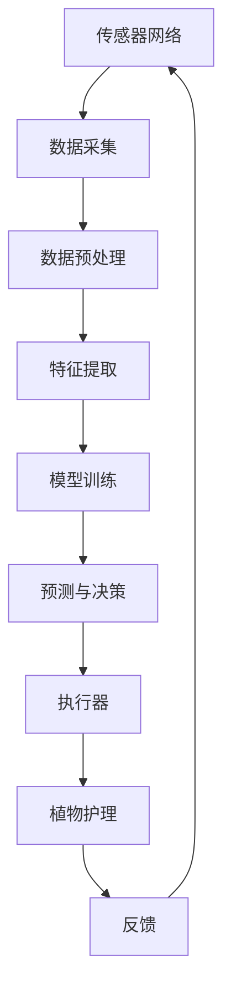

                 

**AI在智能园艺中的应用：自动化植物护理**

**作者：禅与计算机程序设计艺术 / Zen and the Art of Computer Programming**

## 1. 背景介绍

随着人工智能（AI）技术的飞速发展，其应用领域也在不断扩展。智能园艺（Smart Gardening）是其中一个具有前途的领域，它利用AI技术实现植物的自动化护理，提高园艺效率和植物生长质量。本文将深入探讨AI在智能园艺中的应用，包括核心概念、算法原理、数学模型、项目实践，以及未来发展趋势。

## 2. 核心概念与联系

智能园艺涉及多个学科，包括计算机视觉、机器学习、物联网、传感器技术等。图1展示了智能园艺系统的架构及其核心组成部分。



图1：智能园艺系统架构

## 3. 核心算法原理 & 具体操作步骤

### 3.1 算法原理概述

智能园艺的核心是利用机器学习算法预测植物的需求，并根据预测结果自动化执行护理任务。常用的机器学习算法包括回归算法（如线性回归、决策树）、分类算法（如逻辑回归、支持向量机）、集成学习算法（如随机森林、梯度提升决策树），以及深度学习算法（如卷积神经网络、循环神经网络）。

### 3.2 算法步骤详解

1. **数据采集**：使用传感器网络采集植物和环境数据，如光照、温度、湿度、土壤水分、养分含量等。
2. **数据预处理**：清洗、缺失值填充、特征标准化等。
3. **特征提取**：提取关键特征，如植物生长周期、环境变化趋势等。
4. **模型训练**：使用机器学习算法训练模型，预测植物需求。
5. **预测与决策**：根据预测结果，生成植物护理决策，如浇水、施肥、调节光照等。
6. **执行器**：根据决策，控制执行器（如水泵、灌溉系统、照明系统）执行护理任务。
7. **反馈**：监控护理任务执行结果，并将反馈信息输入系统，以不断优化模型。

### 3.3 算法优缺点

优点：自动化、高效、精确、节省人力。缺点：模型训练需要大量数据，算法复杂度高，实时性要求高。

### 3.4 算法应用领域

智能园艺算法可应用于各种植物护理场景，如温室园艺、家庭园艺、农业种植等。

## 4. 数学模型和公式 & 详细讲解 & 举例说明

### 4.1 数学模型构建

构建智能园艺数学模型的目的是预测植物需求。常用的数学模型包括线性回归模型、决策树模型、神经网络模型等。

### 4.2 公式推导过程

以线性回归模型为例，其公式为：

$$y = \beta_0 + \beta_1x_1 + \beta_2x_2 + \ldots + \beta_nx_n + \epsilon$$

其中，$y$为预测目标（如植物需水量），$x_1, x_2, \ldots, x_n$为特征变量（如光照、温度等），$\beta_0, \beta_1, \ldots, \beta_n$为模型系数，$\epsilon$为误差项。

### 4.3 案例分析与讲解

假设我们要预测番茄植株的需水量。特征变量包括光照强度（$x_1$）、温度（$x_2$）、土壤水分（$x_3$），目标变量为需水量（$y$）。通过收集数据并训练线性回归模型，我们可以得到模型系数：

$$\beta_0 = 10, \beta_1 = 0.5, \beta_2 = 2, \beta_3 = -3$$

则需水量预测公式为：

$$y = 10 + 0.5x_1 + 2x_2 - 3x_3$$

例如，当光照强度为200lux、温度为25℃、土壤水分为15%时，番茄植株需水量预测为：

$$y = 10 + 0.5 \times 200 + 2 \times 25 - 3 \times 15 = 105 (ml)$$

## 5. 项目实践：代码实例和详细解释说明

### 5.1 开发环境搭建

智能园艺项目需要Python开发环境，推荐使用Anaconda或Miniconda搭建。常用的库包括NumPy、Pandas、Matplotlib、Scikit-learn、TensorFlow等。

### 5.2 源代码详细实现

以下是一个简单的线性回归模型实现示例：

```python
import numpy as np
import pandas as pd
from sklearn.model_selection import train_test_split
from sklearn.linear_model import LinearRegression
from sklearn.metrics import mean_squared_error

# 加载数据
data = pd.read_csv('tomato_data.csv')

# 特征变量和目标变量
X = data[['light', 'temp','soil_moisture']]
y = data['water_needs']

# 划分训练集和测试集
X_train, X_test, y_train, y_test = train_test_split(X, y, test_size=0.2, random_state=42)

# 训练模型
model = LinearRegression()
model.fit(X_train, y_train)

# 预测并评估模型
y_pred = model.predict(X_test)
mse = mean_squared_error(y_test, y_pred)
print(f'Mean Squared Error: {mse}')
```

### 5.3 代码解读与分析

该代码实现了一个简单的线性回归模型，用于预测番茄植株的需水量。它首先加载数据，然后划分训练集和测试集。之后，使用Scikit-learn库训练线性回归模型，并使用测试集评估模型性能。

### 5.4 运行结果展示

运行结果将显示模型在测试集上的均方误差（Mean Squared Error，MSE），该值越小，模型性能越好。

## 6. 实际应用场景

智能园艺技术可应用于各种场景，如：

### 6.1 家庭园艺

智能园艺系统可用于家庭园艺，自动化护理盆栽植物，节省用户时间和精力。

### 6.2 温室园艺

在温室园艺中，智能园艺系统可监控环境条件，实时调节光照、温度、湿度等，提高作物产量和质量。

### 6.3 农业种植

智能园艺技术可应用于大规模农业种植，实现精准灌溉、施肥，提高作物产量和品质，节约资源。

### 6.4 未来应用展望

未来，智能园艺技术将与物联网、云计算、大数据等技术结合，实现全球范围内的植物护理，助力可持续农业发展。

## 7. 工具和资源推荐

### 7.1 学习资源推荐

- 书籍：《机器学习》作者：Tom M. Mitchell
- 课程：Coursera - 机器学习
- 网站：Kaggle（提供大量机器学习项目和数据集）

### 7.2 开发工具推荐

- Python：Anaconda、Jupyter Notebook
- 传感器：Arduino、Raspberry Pi
- 云平台：AWS、Google Cloud、Azure

### 7.3 相关论文推荐

- [Smart Gardening: A Review](https://ieeexplore.ieee.org/document/8945564)
- [A Review on Internet of Things Based Smart Agriculture](https://ieeexplore.ieee.org/document/8764644)

## 8. 总结：未来发展趋势与挑战

### 8.1 研究成果总结

本文介绍了AI在智能园艺中的应用，包括核心概念、算法原理、数学模型、项目实践等。智能园艺技术已在家庭园艺、温室园艺、农业种植等领域取得了显著成果。

### 8.2 未来发展趋势

未来，智能园艺技术将与物联网、云计算、大数据等技术结合，实现全球范围内的植物护理，助力可持续农业发展。此外，AI技术将不断提高模型精确度，实现更智能化的植物护理。

### 8.3 面临的挑战

智能园艺技术面临的挑战包括模型训练需要大量数据、算法复杂度高、实时性要求高等。此外，如何将智能园艺技术推广到广大农村地区，也是一个需要解决的问题。

### 8.4 研究展望

未来的研究方向包括开发更高效的模型训练算法、提高模型实时性、研究智能园艺技术在广大农村地区的推广等。

## 9. 附录：常见问题与解答

**Q1：智能园艺技术需要哪些传感器？**

A1：智能园艺技术需要的传感器包括光照传感器、温度传感器、湿度传感器、土壤水分传感器、养分含量传感器等。

**Q2：如何选择合适的机器学习算法？**

A2：选择合适的机器学习算法取决于具体的应用场景。常用的算法包括回归算法、分类算法、集成学习算法、深度学习算法等。可以尝试多种算法，并比较其性能，选择最优算法。

**Q3：智能园艺技术如何与物联网结合？**

A3：智能园艺技术与物联网结合，可以实现远程监控和自动化控制。传感器收集的数据通过物联网传输到云平台，用户可以通过移动设备实时监控植物状态，并发送控制指令。

**Q4：智能园艺技术如何助力可持续农业发展？**

A4：智能园艺技术通过精准灌溉、施肥，提高作物产量和品质，节约资源，助力可持续农业发展。此外，智能园艺技术还可以帮助农民实时监控作物生长状态，及时发现和解决问题，提高农业生产效率。

**Q5：智能园艺技术的成本如何？**

A5：智能园艺技术的成本取决于系统规模和复杂度。小型家庭园艺系统成本较低，而大型农业种植系统成本较高。随着技术的发展和成本的下降，智能园艺技术的成本将越来越低。

**Q6：如何保证智能园艺系统的安全性？**

A6：保证智能园艺系统安全性的措施包括加密数据传输、使用可靠的硬件和软件、定期更新系统、及时发现和解决安全漏洞等。

**Q7：智能园艺技术如何应对气候变化？**

A7：智能园艺技术可以帮助农民及时发现和适应气候变化，如调节灌溉量、施肥量、光照强度等，以适应不断变化的气候条件。此外，智能园艺技术还可以帮助农民选择更适合当地气候条件的作物品种。

**Q8：智能园艺技术如何与人工智能结合？**

A8：智能园艺技术与人工智能结合，可以实现更智能化的植物护理。人工智能技术可以帮助智能园艺系统学习和适应环境变化，自动化执行护理任务，提高系统智能化水平。

**Q9：智能园艺技术如何与大数据结合？**

A9：智能园艺技术与大数据结合，可以实现更精确的植物护理。大数据技术可以帮助智能园艺系统分析和处理海量数据，发现数据规律，提高模型精确度。此外，大数据技术还可以帮助智能园艺系统实现预测分析，助力决策支持。

**Q10：智能园艺技术如何与云计算结合？**

A10：智能园艺技术与云计算结合，可以实现更便捷的植物护理。云计算技术可以帮助智能园艺系统实现数据存储和处理，降低系统成本，提高系统可扩展性。此外，云计算技术还可以帮助智能园艺系统实现远程访问和控制，提高系统便捷性。

**Q11：智能园艺技术如何与物联网结合？**

A11：智能园艺技术与物联网结合，可以实现更智能化的植物护理。物联网技术可以帮助智能园艺系统实现数据采集和传输，实现远程监控和自动化控制。此外，物联网技术还可以帮助智能园艺系统实现设备互联，提高系统智能化水平。

**Q12：智能园艺技术如何与人工智能结合？**

A12：智能园艺技术与人工智能结合，可以实现更智能化的植物护理。人工智能技术可以帮助智能园艺系统学习和适应环境变化，自动化执行护理任务，提高系统智能化水平。此外，人工智能技术还可以帮助智能园艺系统实现预测分析，助力决策支持。

**Q13：智能园艺技术如何与大数据结合？**

A13：智能园艺技术与大数据结合，可以实现更精确的植物护理。大数据技术可以帮助智能园艺系统分析和处理海量数据，发现数据规律，提高模型精确度。此外，大数据技术还可以帮助智能园艺系统实现预测分析，助力决策支持。

**Q14：智能园艺技术如何与云计算结合？**

A14：智能园艺技术与云计算结合，可以实现更便捷的植物护理。云计算技术可以帮助智能园艺系统实现数据存储和处理，降低系统成本，提高系统可扩展性。此外，云计算技术还可以帮助智能园艺系统实现远程访问和控制，提高系统便捷性。

**Q15：智能园艺技术如何与物联网结合？**

A15：智能园艺技术与物联网结合，可以实现更智能化的植物护理。物联网技术可以帮助智能园艺系统实现数据采集和传输，实现远程监控和自动化控制。此外，物联网技术还可以帮助智能园艺系统实现设备互联，提高系统智能化水平。

**Q16：智能园艺技术如何与人工智能结合？**

A16：智能园艺技术与人工智能结合，可以实现更智能化的植物护理。人工智能技术可以帮助智能园艺系统学习和适应环境变化，自动化执行护理任务，提高系统智能化水平。此外，人工智能技术还可以帮助智能园艺系统实现预测分析，助力决策支持。

**Q17：智能园艺技术如何与大数据结合？**

A17：智能园艺技术与大数据结合，可以实现更精确的植物护理。大数据技术可以帮助智能园艺系统分析和处理海量数据，发现数据规律，提高模型精确度。此外，大数据技术还可以帮助智能园艺系统实现预测分析，助力决策支持。

**Q18：智能园艺技术如何与云计算结合？**

A18：智能园艺技术与云计算结合，可以实现更便捷的植物护理。云计算技术可以帮助智能园艺系统实现数据存储和处理，降低系统成本，提高系统可扩展性。此外，云计算技术还可以帮助智能园艺系统实现远程访问和控制，提高系统便捷性。

**Q19：智能园艺技术如何与物联网结合？**

A19：智能园艺技术与物联网结合，可以实现更智能化的植物护理。物联网技术可以帮助智能园艺系统实现数据采集和传输，实现远程监控和自动化控制。此外，物联网技术还可以帮助智能园艺系统实现设备互联，提高系统智能化水平。

**Q20：智能园艺技术如何与人工智能结合？**

A20：智能园艺技术与人工智能结合，可以实现更智能化的植物护理。人工智能技术可以帮助智能园艺系统学习和适应环境变化，自动化执行护理任务，提高系统智能化水平。此外，人工智能技术还可以帮助智能园艺系统实现预测分析，助力决策支持。

**Q21：智能园艺技术如何与大数据结合？**

A21：智能园艺技术与大数据结合，可以实现更精确的植物护理。大数据技术可以帮助智能园艺系统分析和处理海量数据，发现数据规律，提高模型精确度。此外，大数据技术还可以帮助智能园艺系统实现预测分析，助力决策支持。

**Q22：智能园艺技术如何与云计算结合？**

A22：智能园艺技术与云计算结合，可以实现更便捷的植物护理。云计算技术可以帮助智能园艺系统实现数据存储和处理，降低系统成本，提高系统可扩展性。此外，云计算技术还可以帮助智能园艺系统实现远程访问和控制，提高系统便捷性。

**Q23：智能园艺技术如何与物联网结合？**

A23：智能园艺技术与物联网结合，可以实现更智能化的植物护理。物联网技术可以帮助智能园艺系统实现数据采集和传输，实现远程监控和自动化控制。此外，物联网技术还可以帮助智能园艺系统实现设备互联，提高系统智能化水平。

**Q24：智能园艺技术如何与人工智能结合？**

A24：智能园艺技术与人工智能结合，可以实现更智能化的植物护理。人工智能技术可以帮助智能园艺系统学习和适应环境变化，自动化执行护理任务，提高系统智能化水平。此外，人工智能技术还可以帮助智能园艺系统实现预测分析，助力决策支持。

**Q25：智能园艺技术如何与大数据结合？**

A25：智能园艺技术与大数据结合，可以实现更精确的植物护理。大数据技术可以帮助智能园艺系统分析和处理海量数据，发现数据规律，提高模型精确度。此外，大数据技术还可以帮助智能园艺系统实现预测分析，助力决策支持。

**Q26：智能园艺技术如何与云计算结合？**

A26：智能园艺技术与云计算结合，可以实现更便捷的植物护理。云计算技术可以帮助智能园艺系统实现数据存储和处理，降低系统成本，提高系统可扩展性。此外，云计算技术还可以帮助智能园艺系统实现远程访问和控制，提高系统便捷性。

**Q27：智能园艺技术如何与物联网结合？**

A27：智能园艺技术与物联网结合，可以实现更智能化的植物护理。物联网技术可以帮助智能园艺系统实现数据采集和传输，实现远程监控和自动化控制。此外，物联网技术还可以帮助智能园艺系统实现设备互联，提高系统智能化水平。

**Q28：智能园艺技术如何与人工智能结合？**

A28：智能园艺技术与人工智能结合，可以实现更智能化的植物护理。人工智能技术可以帮助智能园艺系统学习和适应环境变化，自动化执行护理任务，提高系统智能化水平。此外，人工智能技术还可以帮助智能园艺系统实现预测分析，助力决策支持。

**Q29：智能园艺技术如何与大数据结合？**

A29：智能园艺技术与大数据结合，可以实现更精确的植物护理。大数据技术可以帮助智能园艺系统分析和处理海量数据，发现数据规律，提高模型精确度。此外，大数据技术还可以帮助智能园艺系统实现预测分析，助力决策支持。

**Q30：智能园艺技术如何与云计算结合？**

A30：智能园艺技术与云计算结合，可以实现更便捷的植物护理。云计算技术可以帮助智能园艺系统实现数据存储和处理，降低系统成本，提高系统可扩展性。此外，云计算技术还可以帮助智能园艺系统实现远程访问和控制，提高系统便捷性。

**Q31：智能园艺技术如何与物联网结合？**

A31：智能园艺技术与物联网结合，可以实现更智能化的植物护理。物联网技术可以帮助智能园艺系统实现数据采集和传输，实现远程监控和自动化控制。此外，物联网技术还可以帮助智能园艺系统实现设备互联，提高系统智能化水平。

**Q32：智能园艺技术如何与人工智能结合？**

A32：智能园艺技术与人工智能结合，可以实现更智能化的植物护理。人工智能技术可以帮助智能园艺系统学习和适应环境变化，自动化执行护理任务，提高系统智能化水平。此外，人工智能技术还可以帮助智能园艺系统实现预测分析，助力决策支持。

**Q33：智能园艺技术如何与大数据结合？**

A33：智能园艺技术与大数据结合，可以实现更精确的植物护理。大数据技术可以帮助智能园艺系统分析和处理海量数据，发现数据规律，提高模型精确度。此外，大数据技术还可以帮助智能园艺系统实现预测分析，助力决策支持。

**Q34：智能园艺技术如何与云计算结合？**

A34：智能园艺技术与云计算结合，可以实现更便捷的植物护理。云计算技术可以帮助智能园艺系统实现数据存储和处理，降低系统成本，提高系统可扩展性。此外，云计算技术还可以帮助智能园艺系统实现远程访问和控制，提高系统便捷性。

**Q35：智能园艺技术如何与物联网结合？**

A35：智能园艺技术与物联网结合，可以实现更智能化的植物护理。物联网技术可以帮助智能园艺系统实现数据采集和传输，实现远程监控和自动化控制。此外，物联网技术还可以帮助智能园艺系统实现设备互联，提高系统智能化水平。

**Q36：智能园艺技术如何与人工智能结合？**

A36：智能园艺技术与人工智能结合，可以实现更智能化的植物护理。人工智能技术可以帮助智能园艺系统学习和适应环境变化，自动化执行护理任务，提高系统智能化水平。此外，人工智能技术还可以帮助智能园艺系统实现预测分析，助力决策支持。

**Q37：智能园艺技术如何与大数据结合？**

A37：智能园艺技术与大数据结合，可以实现更精确的植物护理。大数据技术可以帮助智能园艺系统分析和处理海量数据，发现数据规律，提高模型精确度。此外，大数据技术还可以帮助智能园艺系统实现预测分析，助力决策支持。

**Q38：智能园艺技术如何与云计算结合？**

A38：智能园艺技术与云计算结合，可以实现更便捷的植物护理。云计算技术可以帮助智能园艺系统实现数据存储和处理，降低系统成本，提高系统可扩展性。此外，云计算技术还可以帮助智能园艺系统实现远程访问和控制，提高系统便捷性。

**Q39：智能园艺技术如何与物联网结合？**

A39：智能园艺技术与物联网结合，可以实现更智能化的植物护理。物联网技术可以帮助智能园艺系统实现数据采集和传输，实现远程监控和自动化控制。此外，物联网技术还可以帮助智能园艺系统实现设备互联，提高系统智能化水平。

**Q40：智能园艺技术如何与人工智能结合？**

A40：智能园艺技术与人工智能结合，可以实现更智能化的植物护理。人工智能技术可以帮助智能园艺系统学习和适应环境变化，自动化执行护理任务，提高系统智能化水平。此外，人工智能技术还可以帮助智能园艺系统实现预测分析，助力决策支持。

**Q41：智能园艺技术如何与大数据结合？**

A41：智能园艺技术与大数据结合，可以实现更精确的植物护理。大数据技术可以帮助智能园艺系统分析和处理海量数据，发现数据规律，提高模型精确度。此外，大数据技术还可以帮助智能园艺系统实现预测分析，助力决策支持。

**Q42：智能园艺技术如何与云计算结合？**

A42：智能园艺技术与云计算结合，可以实现更便捷的植物护理。云计算技术可以帮助智能园艺系统实现数据存储和处理，降低系统成本，提高系统可扩展性。此外，云计算技术还可以帮助智能园艺系统实现远程访问和控制，提高系统便捷性。

**Q43：智能园艺技术如何与物联网结合？**

A43：智能园艺技术与物联网结合，可以实现更智能化的植物护理。物联网技术可以帮助智能园艺系统实现数据采集和传输，实现远程监控和自动化控制。此外，物联网技术还可以帮助智能园艺系统实现设备互联，提高系统智能化水平。

**Q44：智能园艺技术如何与人工智能结合？**

A44：智能园艺技术与人工智能结合，可以实现更智能化的植物护理。人工智能技术可以帮助智能园艺系统学习和适应环境变化，自动化执行护理任务

