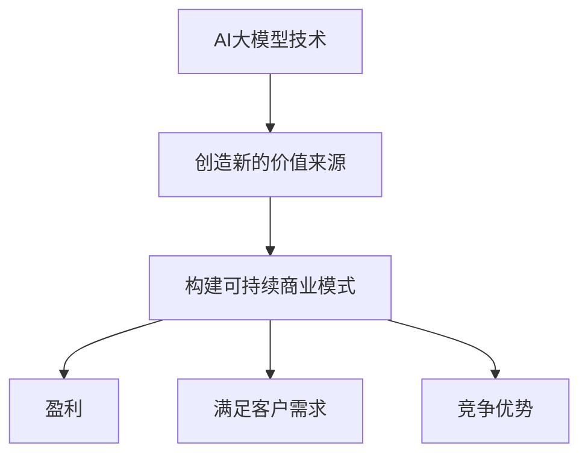

                 

**AI大模型创业：如何构建未来可持续的商业模式？**

**作者：禅与计算机程序设计艺术 / Zen and the Art of Computer Programming**

## 1. 背景介绍

当前，人工智能（AI）和大模型技术正在迅速发展，为各行各业带来了颠覆性的变化。然而，构建可持续的商业模式，将这些技术转化为有价值的产品和服务，仍然是一个挑战。本文将探讨AI大模型创业的关键因素，提供指南帮助创业者构建未来可持续的商业模式。

## 2. 核心概念与联系

### 2.1 AI大模型的定义

AI大模型是指能够理解、学习和生成人类语言的复杂模型。它们通过处理大量数据，学习人类语言的结构和含义，从而能够理解、生成和翻译人类语言。

### 2.2 商业模式的定义

商业模式是指一家企业如何创造、交付和获取价值的系统。它描述了企业的核心活动、利益相关者、关键资源和盈利机制。

### 2.3 关键联系

AI大模型和商业模式的关键联系在于，大模型技术可以为企业创造新的价值来源，但如何将这些价值转化为可持续的商业模式，则是一个需要解决的关键问题。



## 3. 核心算法原理 & 具体操作步骤

### 3.1 算法原理概述

AI大模型的核心是Transformer模型，它使用自注意力机制（Self-Attention）和Transformer编码器-解码器架构来处理序列数据。大模型通过训练在大量数据上学习人类语言的结构和含义，从而能够理解、生成和翻译人类语言。

### 3.2 算法步骤详解

1. 数据预处理：清洗、标记化和分词数据。
2. 模型构建：构建Transformer模型，包括编码器和解码器。
3. 模型训练：在大量数据上训练模型，优化模型参数。
4. 模型评估：评估模型性能，调整模型参数。
5. 模型部署：将模型部署到生产环境，提供API接口。

### 3.3 算法优缺点

优点：

* 理解和生成人类语言的能力。
* 可以在多种任务上进行微调，适应不同的应用场景。

缺点：

* 训练大模型需要大量的计算资源和数据。
* 模型的解释性较差，难以理解模型的决策过程。

### 3.4 算法应用领域

AI大模型的应用领域包括自然语言处理（NLP）、机器翻译、文本生成、问答系统和搜索引擎等。

## 4. 数学模型和公式 & 详细讲解 & 举例说明

### 4.1 数学模型构建

大模型的数学模型基于Transformer模型，其核心是自注意力机制。自注意力机制可以表示为：

$$ \text{Attention}(Q, K, V) = \text{softmax}\left(\frac{QK^T}{\sqrt{d_k}}\right)V $$

其中，$Q$, $K$, $V$分别是查询、键和值向量，$d_k$是键向量的维度。

### 4.2 公式推导过程

自注意力机制的推导过程如下：

1. 计算查询、键和值向量的内积，并除以键向量的维度的平方根。
2. 使用softmax函数对上一步的结果进行归一化，得到注意力权重。
3. 将注意力权重与值向量相乘，得到自注意力的输出。

### 4.3 案例分析与讲解

例如，在机器翻译任务中，大模型需要将源语言的句子翻译为目标语言的句子。大模型首先将源语言句子编码为查询向量，然后使用自注意力机制计算查询向量与目标语言句子的键和值向量的注意力权重。最后，大模型使用注意力权重生成目标语言句子的预测。

## 5. 项目实践：代码实例和详细解释说明

### 5.1 开发环境搭建

开发环境需要安装Python、PyTorch和Transformers库。可以使用以下命令安装：

```bash
pip install torch transformers
```

### 5.2 源代码详细实现

以下是一个简单的大模型示例，使用Transformers库的T5模型进行文本生成：

```python
from transformers import T5Tokenizer, T5Model

tokenizer = T5Tokenizer.from_pretrained('t5-base')
model = T5Model.from_pretrained('t5-base')

inputs = tokenizer.encode("translate English to French: How are you?", return_tensors="pt")
outputs = model.generate(inputs)
print(tokenizer.decode(outputs[0]))
```

### 5.3 代码解读与分析

上述代码首先加载T5模型和其对应的分词器。然后，使用分词器将输入文本编码为输入向量。最后，使用模型生成输出向量，并使用分词器将输出向量解码为文本。

### 5.4 运行结果展示

运行上述代码的输出为：

```
Traduire l'anglais en français : Comment ça va ?
```

## 6. 实际应用场景

### 6.1 当前应用场景

AI大模型当前的应用场景包括：

* 机器翻译：将一种语言翻译为另一种语言。
* 文本生成：生成人类语言的文本，如新闻标题或摘要。
* 问答系统：回答用户的问题。
* 搜索引擎：改进搜索结果的相关性。

### 6.2 未来应用展望

未来，AI大模型的应用场景将扩展到：

* 个性化推荐：为用户提供个性化的内容推荐。
* 自动化客服：使用大模型构建智能客服系统。
* 知识图谱：构建知识图谱，帮助用户查找信息。
* 代码生成：使用大模型生成代码。

## 7. 工具和资源推荐

### 7.1 学习资源推荐

* "Attention is All You Need"：Transformer模型的原始论文。
* "T5: Text-to-Text Transfer Transformer"：T5模型的原始论文。
* Hugging Face Transformers库：一个开源的Transformers库，提供了多种预训练模型。

### 7.2 开发工具推荐

* Google Colab：一个免费的Jupyter notebook环境，提供了GPU和TPU支持。
* Hugging Face Spaces：一个开源的平台，用于部署和共享Transformers模型。
* AWS SageMaker：一个云平台，用于构建、训练和部署机器学习模型。

### 7.3 相关论文推荐

* "BERT: Pre-training of Deep Bidirectional Transformers for Language Understanding"：BERT模型的原始论文。
* "XLNet: Generalized Autoregressive Pretraining for Natural Language Processing"：XLNet模型的原始论文。
* "RoBERTa: A Robustly Optimized BERT Pretraining Approach"：RoBERTa模型的原始论文。

## 8. 总结：未来发展趋势与挑战

### 8.1 研究成果总结

本文介绍了AI大模型的原理、算法、数学模型和应用场景。我们还提供了一个简单的大模型示例，并推荐了学习资源、开发工具和相关论文。

### 8.2 未来发展趋势

未来，AI大模型的发展趋势包括：

* 模型规模的扩大：大模型的规模将继续扩大，以提高模型的性能。
* 多模式学习：大模型将能够处理多模式数据，如文本、图像和音频。
* 解释性模型：大模型的解释性将得到改进，以帮助用户理解模型的决策过程。

### 8.3 面临的挑战

AI大模型面临的挑战包括：

* 计算资源：大模型的训练需要大量的计算资源。
* 数据获取：获取大量高质量的数据是一个挑战。
* 可持续性：构建可持续的商业模式是一个关键挑战。

### 8.4 研究展望

未来的研究将关注于：

* 低资源场景下的大模型：研究如何在低资源场景下训练和部署大模型。
* 多模式学习：研究如何处理多模式数据。
* 可解释性模型：研究如何改进大模型的解释性。

## 9. 附录：常见问题与解答

**Q1：什么是AI大模型？**

A1：AI大模型是指能够理解、学习和生成人类语言的复杂模型。

**Q2：什么是商业模式？**

A2：商业模式是指一家企业如何创造、交付和获取价值的系统。

**Q3：如何构建可持续的AI大模型商业模式？**

A3：构建可持续的AI大模型商业模式需要考虑企业的核心活动、利益相关者、关键资源和盈利机制。企业需要将大模型技术转化为有价值的产品和服务，并构建可持续的商业模式。

**Q4：AI大模型的核心算法是什么？**

A4：AI大模型的核心算法是Transformer模型，它使用自注意力机制和Transformer编码器-解码器架构来处理序列数据。

**Q5：AI大模型的应用场景是什么？**

A5：AI大模型的应用场景包括机器翻译、文本生成、问答系统和搜索引擎等。

**Q6：如何构建AI大模型项目？**

A6：构建AI大模型项目需要安装开发环境、实现源代码、解读和分析代码、展示运行结果。

**Q7：AI大模型的未来发展趋势是什么？**

A7：AI大模型的未来发展趋势包括模型规模的扩大、多模式学习和解释性模型。

**Q8：AI大模型面临的挑战是什么？**

A8：AI大模型面临的挑战包括计算资源、数据获取和可持续性。

**Q9：未来的AI大模型研究将关注什么？**

A9：未来的AI大模型研究将关注于低资源场景下的大模型、多模式学习和可解释性模型。

**Q10：如何获取AI大模型的学习资源、开发工具和相关论文？**

A10：可以参考本文推荐的学习资源、开发工具和相关论文。

**作者：禅与计算机程序设计艺术 / Zen and the Art of Computer Programming**

