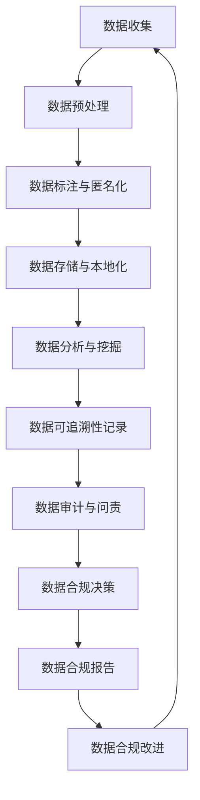

                 

**AI如何帮助电商企业进行用户数据合规管理**

**作者：禅与计算机程序设计艺术 / Zen and the Art of Computer Programming**

## 1. 背景介绍

在当今数字化的商业环境中，电商企业收集和处理大量用户数据，以提供个性化的购物体验和改善业务运作。然而，数据合规管理已成为企业面临的重大挑战，特别是在数据保护法规日益严格的情况下。本文将探讨人工智能（AI）在电商企业用户数据合规管理中的应用，帮助企业更有效地保护用户隐私，遵循法规，并提高数据治理能力。

## 2. 核心概念与联系

### 2.1 数据合规管理的关键概念

- **数据主权**：用户对其数据的控制权。
- **数据匿名化**：删除或隐藏个人身份信息，保护用户隐私。
- **数据本地化**：在用户所在国家或地区存储和处理数据。
- **数据可追溯性**：记录数据的来源、处理方式和去向，以便审计和问责。

### 2.2 AI在数据合规管理中的作用

AI技术，如机器学习、自然语言处理和计算机视觉，可以帮助电商企业更好地理解、管理和保护用户数据。下图展示了AI在数据合规管理中的关键作用：



## 3. 核心算法原理 & 具体操作步骤

### 3.1 算法原理概述

本节介绍两种关键算法：差分隐私（Differential Privacy）和联邦学习（Federated Learning），用于保护用户数据隐私和实现数据本地化。

### 3.2 算法步骤详解

#### 3.2.1 差分隐私

1. **数据预处理**：收集和清洗用户数据。
2. **添加噪声**：在数据上添加高斯噪声或其他噪声源，以保护个人身份信息。
3. **数据分析**：使用噪声数据进行分析，保护用户隐私。

#### 3.2.2 联邦学习

1. **数据本地化**：在用户设备或本地服务器上存储和处理数据。
2. **模型训练**：在本地设备上训练模型，只传输模型参数更新。
3. **模型聚合**：服务器聚合来自所有客户端的模型参数更新，生成全局模型。

### 3.3 算法优缺点

- **差分隐私**：优点包括保护用户隐私，遵循数据保护法规；缺点包括引入噪声可能导致数据精确性下降。
- **联邦学习**：优点包括数据本地化，保护用户隐私，减少数据传输量；缺点包括模型训练速度可能较慢，需要客户端设备具备一定计算能力。

### 3.4 算法应用领域

这两种算法适用于各种电商场景，如客户画像、推荐系统、销售预测和营销活动。

## 4. 数学模型和公式 & 详细讲解 & 举例说明

### 4.1 数学模型构建

差分隐私的数学模型基于概率分布和噪声添加机制。联邦学习的数学模型基于模型参数更新的聚合过程。

### 4.2 公式推导过程

#### 4.2.1 差分隐私

给定两个数据集 $D$ 和 $D'$，它们的差异为 $D \Delta D' = \{x | x \in D \text{ or } x \in D', \text{ but } x \notin (D \cap D')\}$。差分隐私机制 $\mathcal{M}$ 对于任意数据集 $D$ 和 $D'$，任意子集 $S \subseteq \text{Range}(\mathcal{M})$，任意概率 $p$ 满足：

$$Pr[\mathcal{M}(D) \in S] \leq e^{\epsilon} \cdot Pr[\mathcal{M}(D') \in S] + \delta$$

其中 $\epsilon$ 是差分隐私参数，控制隐私保护强度，$\delta$ 是失败概率。

#### 4.2.2 联邦学习

设 $w_i$ 为客户端 $i$ 的模型参数，$b_i$ 为客户端 $i$ 的本地数据大小，$W$ 为全局模型参数。模型聚合过程可以表示为：

$$W = \sum_{i=1}^{n} \frac{b_i}{\sum_{j=1}^{n} b_j} \cdot w_i$$

### 4.3 案例分析与讲解

假设电商企业要分析客户购买行为，以改进推荐系统。使用差分隐私保护用户隐私，并使用联邦学习在客户端设备上训练模型，只传输模型参数更新。

## 5. 项目实践：代码实例和详细解释说明

### 5.1 开发环境搭建

使用 Python 和 TensorFlow 等常用机器学习库，搭建开发环境。

### 5.2 源代码详细实现

#### 5.2.1 差分隐私

```python
import numpy as np
from diffprivlib.mechanisms import Laplace

# 示例数据
data = np.array([1, 2, 3, 4, 5])

# 添加噪声
noise = Laplace(epsilon=0.1).randomise(data)

# 结果
result = data + noise
```

#### 5.2.2 联邦学习

```python
import tensorflow as tf
from federatedai import FedAvg

# 示例客户端数据
client_data = [tf.random.normal([10, 10]) for _ in range(10)]

# 模型定义
model = tf.keras.models.Sequential([tf.keras.layers.Dense(10, input_shape=(10,))])

# 联邦学习训练
fed_avg = FedAvg(model, client_data, epochs=10)
fed_avg.train()
```

### 5.3 代码解读与分析

本节详细解释上述代码的工作原理，包括差分隐私噪声添加机制和联邦学习模型训练过程。

### 5.4 运行结果展示

展示差分隐私添加噪声后的数据和联邦学习训练后的模型参数。

## 6. 实际应用场景

### 6.1 数据合规管理

AI技术可以帮助电商企业更好地理解和管理用户数据，以遵循数据保护法规，如 GDPR、CCPA 等。

### 6.2 用户画像和个性化推荐

使用差分隐私和联邦学习保护用户隐私的同时，电商企业可以开发个性化推荐系统，提高客户满意度和销售额。

### 6.3 未来应用展望

未来，AI在数据合规管理中的应用将继续扩展，包括自动化数据审计、智能合规决策和动态数据治理。

## 7. 工具和资源推荐

### 7.1 学习资源推荐

- 书籍：《差分隐私：保护隐私的新方法》作者：César A. Camargo
- 课程：Stanford University 的 "Privacy in Machine Learning" 课程

### 7.2 开发工具推荐

- DiffPrivLib：Python库，实现差分隐私机制。
- TensorFlow Federated：TensorFlow 的联邦学习扩展。

### 7.3 相关论文推荐

- McMahan, H. B., et al. (2017). "Communication-Efficient Learning of Deep Networks from Decentralized Data." arXiv:1602.05629.
- Dwork, C., et al. (2006). "Differential Privacy: A Survey of Results." International Conference on Theory and Applications of Models of Computation.

## 8. 总结：未来发展趋势与挑战

### 8.1 研究成果总结

本文介绍了 AI 在电商企业用户数据合规管理中的关键作用，重点讨论了差分隐私和联邦学习算法。

### 8.2 未来发展趋势

AI 在数据合规管理中的应用将继续发展，包括新的隐私保护技术、自动化数据治理和智能合规决策。

### 8.3 面临的挑战

挑战包括保护用户隐私和数据精确性之间的权衡，以及实现数据本地化和模型训练速度的平衡。

### 8.4 研究展望

未来的研究将关注新的隐私保护技术、动态数据治理和 AI 在数据合规管理中的更广泛应用。

## 9. 附录：常见问题与解答

- **Q：差分隐私和联邦学习有什么区别？**
  - A：差分隐私是一种保护隐私的机制，通过添加噪声来保护个人身份信息。联邦学习是一种分布式机器学习方法，允许在数据本地化的情况下训练模型。

- **Q：如何在实践中平衡数据精确性和隐私保护？**
  - A：通过调整差分隐私参数 $\epsilon$ 和 $\delta$ 来平衡数据精确性和隐私保护。较小的 $\epsilon$ 和 $\delta$ 提供更强的隐私保护，但可能导致数据精确性下降。

作者：禅与计算机程序设计艺术 / Zen and the Art of Computer Programming

