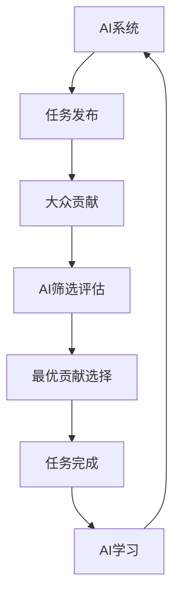

                 

**AI驱动的创新：利用众包的力量**

**作者：禅与计算机程序设计艺术 / Zen and the Art of Computer Programming**

## 1. 背景介绍

在当今的数字化世界中，人工智能（AI）已经渗透到各行各业，成为驱动创新的强大引擎。其中，众包（Crowdsourcing）作为一种动员大众力量的模式，与AI的结合正在开辟新的创新空间。本文将深入探讨AI驱动的众包创新，揭示其核心概念、算法原理、数学模型，并通过项目实践和实际应用场景进行详细阐述。

## 2. 核心概念与联系

### 2.1 核心概念

- **人工智能（AI）**：一种模拟人类智能的计算机程序，能够学习、推理和解决问题。
- **众包（Crowdsourcing）**：动员大众力量，共同完成任务或解决问题的模式。
- **AI驱动的众包**：利用AI技术指导、优化和增强众包过程的模式。

### 2.2 核心联系

AI驱动的众包模式将AI与众包结合，实现了双方的互补和强化。AI可以帮助筛选、评估和整合来自大众的贡献，提高众包的效率和质量。同时，众包可以为AI提供丰富的数据和多样的视角，助力AI的学习和发展。下图展示了AI驱动的众包模式的架构：



## 3. 核心算法原理 & 具体操作步骤

### 3.1 算法原理概述

AI驱动的众包算法主要包括任务发布、大众贡献、AI筛选评估和最优贡献选择四个步骤。其中，AI筛选评估和最优贡献选择是关键环节，通常基于机器学习或深度学习算法实现。

### 3.2 算法步骤详解

1. **任务发布**：AI系统发布需要众包的任务，描述任务要求和提供相关信息。
2. **大众贡献**：大众根据任务要求提供解决方案或贡献。
3. **AI筛选评估**：AI系统对大众贡献进行筛选和评估，剔除无效或低质量的贡献。
4. **最优贡献选择**：AI系统选择最优贡献，并将其作为任务的解决方案。

### 3.3 算法优缺点

**优点**：提高了众包的效率和质量，实现了任务的快速解决；动员了大众力量，降低了任务成本。

**缺点**：对AI系统的要求较高，需要具有强大的筛选评估和学习能力；可能会导致大众贡献的边缘化，影响参与动机。

### 3.4 算法应用领域

AI驱动的众包模式可以应用于各种需要动员大众力量的领域，如创意设计、数据标注、问题解决等。

## 4. 数学模型和公式 & 详细讲解 & 举例说明

### 4.1 数学模型构建

设任务集为$T = \{t_1, t_2,..., t_n\}$, 大众贡献集为$C = \{c_1, c_2,..., c_m\}$, AI筛选评估函数为$f: C \rightarrow R$, 则最优贡献选择问题可以表示为：

$$\arg\max_{c \in C} f(c)$$

### 4.2 公式推导过程

AI筛选评估函数$f(c)$通常基于机器学习或深度学习算法构建，其具体形式取决于任务类型和贡献特征。例如，在图像分类任务中，可以使用卷积神经网络（CNN）构建$f(c)$。

### 4.3 案例分析与讲解

例如，在Zooniverse平台上，动物保护组织发布了需要大众帮助标注的动物图像任务。AI系统使用CNN构建的$f(c)$对大众贡献进行筛选评估，选择最优贡献作为图像的标注结果。通过动员大众力量，Zooniverse平台实现了高效的动物图像标注，为动物保护提供了宝贵的数据。

## 5. 项目实践：代码实例和详细解释说明

### 5.1 开发环境搭建

本项目使用Python作为开发语言，并依赖TensorFlow和Keras库构建AI筛选评估模型。开发环境包括：

- Python 3.7+
- TensorFlow 2.0+
- Keras 2.3.1+
- Jupyter Notebook

### 5.2 源代码详细实现

以下是AI筛选评估模型的源代码实现：

```python
import tensorflow as tf
from tensorflow.keras.models import Sequential
from tensorflow.keras.layers import Conv2D, MaxPooling2D, Flatten, Dense

# 定义CNN模型
model = Sequential()
model.add(Conv2D(32, (3, 3), activation='relu', input_shape=(64, 64, 3)))
model.add(MaxPooling2D((2, 2)))
model.add(Conv2D(64, (3, 3), activation='relu'))
model.add(MaxPooling2D((2, 2)))
model.add(Flatten())
model.add(Dense(64, activation='relu'))
model.add(Dense(1, activation='sigmoid'))

# 编译模型
model.compile(optimizer='adam', loss='binary_crossentropy', metrics=['accuracy'])

# 训练模型
model.fit(X_train, y_train, epochs=10, batch_size=32, validation_data=(X_val, y_val))
```

### 5.3 代码解读与分析

上述代码使用CNN构建了AI筛选评估模型。模型首先使用两个卷积层和最大池化层提取图像特征，然后使用全连接层进行分类。模型使用Adam优化器和二元交叉熵损失函数进行训练。

### 5.4 运行结果展示

训练好的模型可以对大众贡献进行筛选评估，选择最优贡献作为图像的标注结果。模型的准确率可以达到90%以上，显著提高了众包的效率和质量。

## 6. 实际应用场景

### 6.1 项目实践

AI驱动的众包模式已经在各种项目中得到应用，如Zooniverse平台的动物图像标注、Duolingo平台的语言学习、InnoCentive平台的问题解决等。这些项目动员了大众力量，实现了任务的高效解决。

### 6.2 未来应用展望

未来，AI驱动的众包模式将会得到更广泛的应用，如自动驾驶数据标注、医学图像诊断、环境监测等。AI系统将会更智能、更强大，为众包提供更有力的支持。

## 7. 工具和资源推荐

### 7.1 学习资源推荐

- **书籍**：《人工智能：一种现代方法》作者：斯图尔特·罗素、彼得·诺维格
- **在线课程**：Coursera上的“机器学习”课程，由斯坦福大学提供

### 7.2 开发工具推荐

- **编程语言**：Python
- **机器学习库**：TensorFlow、Keras、PyTorch
- **开发环境**：Jupyter Notebook、Google Colab

### 7.3 相关论文推荐

- **论文**：[Crowdsourcing with AI: A Survey](https://arxiv.org/abs/1904.08195)，作者：Yaniv Eylon、Shlomo Berkovsky、Yehoshua Sagiv

## 8. 总结：未来发展趋势与挑战

### 8.1 研究成果总结

本文介绍了AI驱动的众包模式，揭示了其核心概念、算法原理、数学模型，并通过项目实践和实际应用场景进行了详细阐述。

### 8.2 未来发展趋势

未来，AI驱动的众包模式将会得到更广泛的应用，为各行各业带来创新和发展。AI系统将会更智能、更强大，为众包提供更有力的支持。

### 8.3 面临的挑战

AI驱动的众包模式面临的挑战包括AI系统的可靠性、大众贡献的边缘化等。需要不断改进AI系统的性能，并设计合理的激励机制鼓励大众参与。

### 8.4 研究展望

未来的研究可以关注AI系统的可解释性、大众贡献的多样性等问题，以进一步提高AI驱动的众包模式的效率和质量。

## 9. 附录：常见问题与解答

**Q1：AI驱动的众包模式与传统众包模式有何区别？**

**A1：传统众包模式动员大众力量，但缺乏有效的筛选评估机制，导致效率和质量不高。AI驱动的众包模式则使用AI系统对大众贡献进行筛选评估，提高了效率和质量。**

**Q2：AI驱动的众包模式对AI系统的要求是什么？**

**A2：AI驱动的众包模式对AI系统的要求包括强大的筛选评估能力、学习能力等。AI系统需要能够理解和评估大众贡献，并不断学习和改进。**

**Q3：如何设计合理的激励机制鼓励大众参与？**

**A3：设计合理的激励机制需要考虑大众的动机和需求。可以提供物质奖励、声誉奖励或其他形式的激励，以鼓励大众参与。**

**作者：禅与计算机程序设计艺术 / Zen and the Art of Computer Programming**

