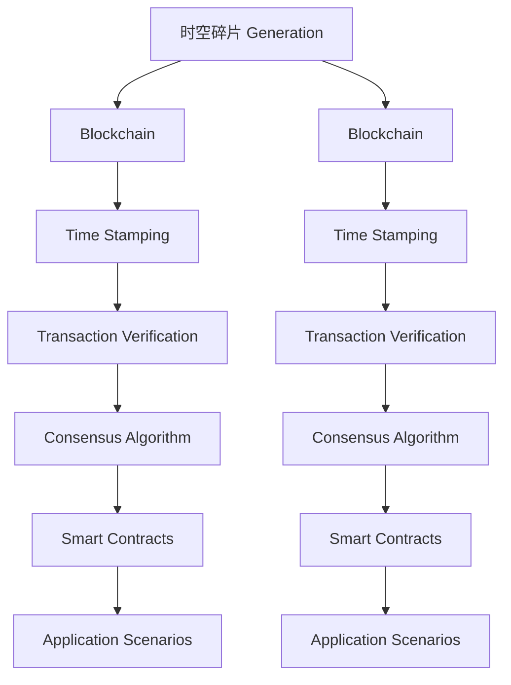

                 

### 文章标题

Token与时空碎片的详细技术对比

在计算机科学和技术领域，"Token" 和 "时空碎片" 是两个常被提及的概念，尤其是在区块链、加密货币和分布式系统中。这两个概念虽然在某些方面有交集，但它们在技术实现和应用场景上有着显著的差异。本文旨在详细探讨 Token 与时空碎片的概念、原理、特性及其应用，通过逐层分析和推理，帮助读者理解这两个概念的本质区别及其在技术世界中的重要性。

本文将分为十个部分进行阐述：

1. 背景介绍
2. 核心概念与联系
3. 核心算法原理 & 具体操作步骤
4. 数学模型和公式 & 详细讲解 & 举例说明
5. 项目实践：代码实例和详细解释说明
6. 实际应用场景
7. 工具和资源推荐
8. 总结：未来发展趋势与挑战
9. 附录：常见问题与解答
10. 扩展阅读 & 参考资料

通过本文的阅读，读者将对 Token 与时空碎片的详细技术对比有一个全面而深入的了解，从而为他们在相关技术领域的深入研究与应用提供有力的理论支撑。接下来，我们将首先回顾背景，并逐步深入探讨这两个核心概念。  

### 关键词

Token、时空碎片、区块链、加密货币、分布式系统、数字货币、智能合约、技术对比

### 摘要

本文旨在深入探讨计算机科学和技术领域中的两个重要概念：Token 和时空碎片。通过详细的对比分析，本文揭示了这两个概念在定义、原理、应用等方面的差异。文章首先回顾了 Token 和时空碎片的背景，随后通过核心算法、数学模型、实际应用场景等方面进行了深入探讨。文章结构清晰，语言简洁明了，适合广大技术爱好者和专业人士阅读，为他们在相关领域的研究和应用提供了有价值的参考。

---

让我们开始正式的探讨之旅。在接下来的章节中，我们将逐一详细分析这两个概念，从而为读者提供一个全面而深入的技术解读。

---

## 1. 背景介绍（Background Introduction）

Token 和时空碎片这两个概念虽然在计算机科学和技术领域内较为常见，但它们的具体应用和意义并非众所周知。为了更好地理解这两个概念，我们需要首先回顾它们的历史背景和应用领域。

### Token 的历史背景与应用领域

Token 的概念起源于计算机网络通信领域。在早期的计算机网络中，为了确保数据传输的可靠性和安全性，Token 环机制被广泛应用于局域网和广域网中。Token 环是一种基于令牌传递的协议，通过令牌的传递来保证网络中的数据传输有序且无冲突。这种机制在早期的计算机网络通信中发挥了重要作用，确保了网络的稳定性和数据传输的效率。

随着区块链和加密货币技术的发展，Token 概念得到了新的应用和扩展。区块链中的 Token 通常指的是一种数字资产，可以代表现实世界中的商品、服务或者权益。例如，比特币（Bitcoin）就是一种著名的加密货币 Token，它代表着一种去中心化的数字货币。除此之外，许多区块链平台如以太坊（Ethereum）也引入了 Token，用于代表平台内的各种权益和功能。Token 在区块链和加密货币中的应用极大地推动了数字经济的创新和发展。

### 时空碎片的历史背景与应用领域

时空碎片的理念则源于量子物理学和相对论。在经典物理学中，时间和空间被视为绝对的、连续的，但在量子物理学和相对论中，时间和空间的性质变得复杂且相对化。时空碎片的观念便是这种复杂性的体现。它指的是在微观尺度上，时间和空间可以被切割成小块，这些小块在某种意义上是离散的，而不是连续的。

在区块链和分布式系统中，时空碎片的概念得到了新的应用。时空碎片通常被用来表示区块链中的时间戳，即某个区块生成的具体时间。通过时空碎片，区块链可以更加精确地记录和验证交易的时间顺序，确保区块链的完整性和安全性。

### Token 与时空碎片的关系

Token 和时空碎片虽然来源于不同的领域，但它们在区块链和分布式系统中有着紧密的联系。Token 通常被用来表示区块链中的某种价值或权益，而时空碎片则为这些 Token 的交易和转移提供了精确的时间戳。换句话说，Token 和时空碎片共同构成了区块链的基础设施，确保了区块链的去中心化和安全性。

总的来说，Token 和时空碎片在计算机科学和技术领域中的背景和应用是多样化的。理解这两个概念的历史背景和应用领域，有助于我们更深入地探讨它们的技术细节和实际应用。接下来，我们将详细探讨这两个概念的核心原理和特性。

## 2. 核心概念与联系（Core Concepts and Connections）

### 2.1 什么是 Token？

Token 可以被理解为一种数字资产或代币，它在区块链系统中具有特定的用途和价值。Token 的定义因区块链平台和项目而异，但通常具有以下特征：

1. **数字资产**：Token 是一种存在于数字世界中的资产，它可以代表现实世界中的商品、服务或者权益。
2. **去中心化**：Token 的发行和交易通常通过区块链实现，这使得 Token 具有去中心化的特性，不受单一机构或个人的控制。
3. **可转移性**：Token 可以在区块链网络中自由转移，从而实现资产的流通和价值交换。

Token 的类型多种多样，常见的有：

- **加密货币**：如比特币、以太币等，它们是用于支付和交易的数字货币。
- **平台代币**：如以太坊平台上的 ERC-20、ERC-721 代币，它们代表特定平台上的权益或功能。
- **实用代币**：如用于特定应用的代币，如游戏中的虚拟货币或去中心化金融（DeFi）中的稳定币。

### 2.2 什么是时空碎片？

时空碎片（Time Token）是在区块链技术中用于表示时间戳的概念。它通过将时间划分为离散的片段，为区块链中的交易提供精确的时间验证。时空碎片的主要特征包括：

1. **时间戳**：时空碎片是一个具体的时间点，用于标记区块链中的某个事件或交易的发生时间。
2. **去中心化**：时空碎片的生成和验证是通过区块链网络中的多个节点共同完成的，这使得时空碎片具有去中心化的特性。
3. **精确性**：由于时空碎片是离散的时间片段，它能够以极高的精度记录和验证区块链中的时间信息。

时空碎片在区块链中的应用主要包括：

- **交易验证**：时空碎片用于验证区块链中的交易是否在特定时间发生，确保交易的顺序和安全性。
- **共识算法**：时空碎片可以用于改进区块链的共识算法，如用于改进工作量证明（Proof of Work, PoW）和权益证明（Proof of Stake, PoS）算法。
- **智能合约**：时空碎片可以嵌入到智能合约中，实现基于时间的触发和执行。

### 2.3 Token 与时空碎片的联系

Token 和时空碎片在区块链和分布式系统中有着紧密的联系。它们共同构成了区块链基础设施的核心组成部分，确保了区块链的去中心化、安全性和可扩展性。具体来说，这种联系体现在以下几个方面：

1. **交易验证**：Token 的交易需要通过时空碎片进行验证，确保交易在正确的时间发生，防止双花攻击等安全风险。
2. **价值交换**：Token 作为区块链中的数字资产，需要通过时空碎片来记录和验证其转移，实现价值交换的透明和可追溯性。
3. **共识机制**：时空碎片可以用于改进区块链的共识机制，确保共识过程的高效和可信。

### 2.4 Token 与时空碎片的区别

尽管 Token 和时空碎片在区块链和分布式系统中都扮演着重要角色，但它们在概念和功能上有着显著的差异。主要区别包括：

1. **性质**：Token 是一种数字资产或代币，而时空碎片是一种时间戳或时间标记。
2. **用途**：Token 用于表示区块链中的价值或权益，而时空碎片用于记录和验证区块链中的时间信息。
3. **关联性**：Token 的交易和转移需要通过时空碎片进行验证，但时空碎片本身并不直接参与价值交换。

通过上述分析，我们可以看出 Token 和时空碎片在区块链和分布式系统中各自扮演着独特而重要的角色。接下来，我们将详细探讨 Token 和时空碎片的算法原理和应用场景，以便更深入地理解这两个概念。

### 2.5 Token 的算法原理与应用场景

#### 2.5.1 Token 的算法原理

Token 的算法原理主要涉及区块链的核心机制，包括加密、共识、智能合约等。以下是一些关键的算法原理：

1. **哈希算法**：Token 的安全性依赖于哈希算法。哈希算法将任意长度的输入数据转换为固定长度的字符串，确保数据无法被篡改。常见的哈希算法有 SHA-256、SHA-3 等。

2. **密码学**：Token 的交易和存储需要密码学机制保障安全。数字签名和公钥加密是常用的密码学技术，用于验证交易合法性和保护用户隐私。

3. **共识算法**：Token 的发行和交易需要共识算法确保整个网络的一致性。工作量证明（PoW）和权益证明（PoS）是两种常见的共识算法。

4. **智能合约**：智能合约是 Token 应用的重要工具，它是一种自动执行合约条款的计算机程序。以太坊平台上的 ERC-20、ERC-721 等标准代币协议就是基于智能合约实现的。

#### 2.5.2 Token 的应用场景

Token 的应用场景非常广泛，涵盖了金融、游戏、供应链等多个领域。以下是一些典型的应用场景：

1. **加密货币**：比特币、以太币等加密货币是最常见的 Token 应用场景。它们用于支付、投资和资产存储，具有去中心化、安全性和匿名性等特点。

2. **去中心化金融（DeFi）**：DeFi 利用 Token 实现金融服务的去中心化。例如，稳定币、借贷平台、交易市场等都基于 Token 进行操作，提供安全、透明和高效的金融服务。

3. **非同质化代币（NFT）**：NFT 是基于 ERC-721 等标准的 Token，用于代表独特的数字资产。NFT 在数字艺术、游戏、收藏品等领域得到了广泛应用。

4. **供应链管理**：Token 可用于跟踪供应链中的商品流转。通过区块链记录和验证每个环节的交易和信息，实现供应链的透明化和可追溯性。

### 2.6 时空碎片的算法原理与应用场景

#### 2.6.1 时空碎片的算法原理

时空碎片的算法原理主要涉及时间戳服务和区块链技术。以下是一些关键的算法原理：

1. **时间戳服务**：时间戳服务是一种用于验证文件或交易在特定时间发生的机制。它通过权威机构或可信第三方为文件或交易生成一个时间戳，确保其时间戳的可靠性和不可篡改性。

2. **区块链技术**：时空碎片是区块链中的一个时间标记，通过区块链网络中的多个节点共同验证和记录。区块链的分布式特性确保了时空碎片的时间戳具有高可靠性和去中心化的特性。

#### 2.6.2 时空碎片的应用场景

时空碎片在区块链和分布式系统中具有广泛的应用场景，主要包括：

1. **交易验证**：时空碎片用于验证区块链中的交易是否在正确的时间发生。通过记录和验证每个交易的时间戳，确保交易的安全性和可靠性。

2. **共识算法**：时空碎片可以用于改进区块链的共识算法。例如，在 PoS 算法中，时空碎片用于确定节点生成区块的顺序，提高共识效率。

3. **智能合约**：时空碎片可以嵌入到智能合约中，实现基于时间的触发和执行。例如，智能合约可以基于特定时间点或时间段执行特定操作。

4. **物联网**：时空碎片在物联网中用于记录和验证设备的事件和时间。通过区块链记录设备的状态变化，实现物联网的透明化和可追溯性。

通过上述分析，我们可以看出 Token 和时空碎片在区块链和分布式系统中各有独特的算法原理和应用场景。理解这些原理和应用有助于我们更好地利用这两个概念，推动数字技术和区块链技术的创新和发展。

### 2.7 Mermaid 流程图（Mermaid Flowchart）

为了更直观地展示 Token 与时空碎片的算法原理及其联系，我们可以使用 Mermaid 流程图。以下是一个简化的 Mermaid 流程图示例：



这个流程图展示了 Token 和时空碎片在区块链系统中的生成、验证、共识和智能合约等关键步骤及其应用场景。通过流程图，我们可以更清晰地理解这两个概念在区块链技术中的角色和作用。

通过上述分析，我们可以看到 Token 和时空碎片在区块链和分布式系统中各有独特的核心算法原理和应用场景。理解这些原理和应用有助于我们更好地利用这两个概念，推动数字技术和区块链技术的创新和发展。

## 3. 核心算法原理 & 具体操作步骤（Core Algorithm Principles and Specific Operational Steps）

为了深入理解 Token 和时空碎片的算法原理，我们将分别探讨它们的核心理念和具体的操作步骤。

### 3.1 Token 的核心算法原理

#### 3.1.1 哈希算法

Token 的安全性依赖于哈希算法。哈希算法是一种将任意长度的输入数据映射为固定长度的字符串的函数。一个重要的特性是，对于相同的输入，哈希算法总是产生相同的输出，而对于不同的输入，即使只有微小的变化，哈希值也会发生显著的变化。

常见的哈希算法有 SHA-256 和 SHA-3。SHA-256 是一种广泛使用的哈希算法，用于比特币等加密货币的交易验证。SHA-3 则是 SHA-2 的后继标准，提供了更安全的哈希功能。

#### 3.1.2 密码学

密码学在 Token 的安全性保障中起着关键作用。其中，数字签名和公钥加密是常用的密码学技术。

- **数字签名**：数字签名是一种用于验证消息真实性和完整性的技术。发送方使用其私钥对消息进行签名，接收方则使用发送方的公钥验证签名的有效性。这种方式确保了消息在传输过程中没有被篡改，同时也验证了发送方的身份。

- **公钥加密**：公钥加密是一种用于加密和解密消息的技术。发送方使用接收方的公钥加密消息，接收方则使用其私钥解密消息。这种方式确保了消息在传输过程中的保密性。

#### 3.1.3 共识算法

共识算法是 Token 交易验证的关键。常见的共识算法包括工作量证明（PoW）和权益证明（PoS）。

- **工作量证明（PoW）**：PoW 通过计算复杂度来防止双重支付攻击。矿工需要解决一个数学难题，首先解决难题的矿工将获得生成区块的权利，并将其广播给网络。其他节点验证区块的有效性，并将其添加到区块链中。

- **权益证明（PoS）**：PoS 通过持有代币的数量和时间来决定生成区块的权利。持有代币越多、持有时间越长的用户，获得生成区块的机会越大。这种方式减少了能源消耗，同时鼓励用户长期持有代币，以支持网络的运行。

#### 3.1.4 智能合约

智能合约是一种自动执行合约条款的计算机程序。在 Token 的应用中，智能合约用于自动化和执行复杂的交易逻辑。

以太坊平台上的 ERC-20 和 ERC-721 标准代币协议就是基于智能合约实现的。ERC-20 用于代表通用的加密货币，而 ERC-721 则用于非同质化代币（NFT）。

### 3.2 Token 的具体操作步骤

以下是 Token 生成、交易验证和共识算法的具体操作步骤：

1. **Token 生成**：
   - 发起者创建一个新的 Token 合约，并设置相关参数，如代币名称、符号、总供应量等。
   - 合约部署在区块链上，并生成 Token 的智能合约地址。

2. **Token 交易验证**：
   - 用户发送交易请求，包括发送方的地址、接收方的地址和代币数量。
   - 交易请求通过区块链网络广播，矿工接收到交易后进行验证。
   - 验证通过后，矿工将交易信息打包进一个新的区块，并将其广播给网络。
   - 其他节点验证区块的有效性，并将其添加到区块链中。

3. **共识算法**：
   - 在 PoW 算法中，矿工需要解决数学难题，首先解决难题的矿工获得生成区块的权利。
   - 在 PoS 算法中，持有代币数量和时间越多的用户，获得生成区块的机会越大。
   - 生成的区块包含交易信息，并将其广播给网络。
   - 其他节点验证区块的有效性，并将其添加到区块链中。

### 3.3 时空碎片的算法原理

#### 3.3.1 时间戳服务

时间戳服务是一种用于验证文件或交易在特定时间发生的机制。它通过权威机构或可信第三方为文件或交易生成一个时间戳，确保其时间戳的可靠性和不可篡改性。

#### 3.3.2 区块链技术

时空碎片是区块链中的一个时间标记，通过区块链网络中的多个节点共同验证和记录。区块链的分布式特性确保了时空碎片的时间戳具有高可靠性和去中心化的特性。

### 3.4 时空碎片的操作步骤

以下是时空碎片生成、验证和记录的具体操作步骤：

1. **时空碎片生成**：
   - 时间戳服务生成时空碎片，并将其与区块链中的一个区块关联。
   - 区块包含时空碎片的信息，如时间戳和生成的节点地址。

2. **时空碎片验证**：
   - 区块链中的节点接收到区块后，验证时空碎片的正确性和完整性。
   - 验证通过后，节点将区块添加到区块链中。

3. **时空碎片记录**：
   - 区块链中的区块不断生成，每个区块都包含时空碎片的信息。
   - 通过区块链，时空碎片的信息被永久记录和验证。

通过上述步骤，我们可以看出 Token 和时空碎片在算法原理和具体操作步骤上的区别。Token 主要涉及哈希算法、密码学、共识算法和智能合约，而时空碎片则侧重于时间戳服务和区块链技术的应用。

理解 Token 和时空碎片的算法原理和操作步骤对于深入掌握区块链技术和分布式系统至关重要。在接下来的章节中，我们将进一步探讨数学模型和公式，以及 Token 和时空碎片的实际应用场景。

## 4. 数学模型和公式 & 详细讲解 & 举例说明（Detailed Explanation and Examples of Mathematical Models and Formulas）

为了深入理解 Token 和时空碎片的数学模型和公式，我们将分别探讨它们的数学基础，并进行详细的讲解和举例说明。

### 4.1 Token 的数学模型和公式

Token 的数学模型主要涉及哈希算法、密码学和共识算法。以下是一些关键的数学模型和公式：

#### 4.1.1 哈希算法

哈希算法的核心是一个函数，该函数将任意长度的输入映射为固定长度的输出。常见的哈希算法如 SHA-256，其数学模型可以用以下公式表示：

\[ H = \text{SHA-256}(M) \]

其中，\( H \) 是生成的哈希值，\( M \) 是输入数据。

#### 4.1.2 密码学

密码学中，数字签名和公钥加密是两种常用的加密技术。数字签名的数学模型可以用以下公式表示：

\[ S = \text{sign}(m, p_k) \]

其中，\( S \) 是签名，\( m \) 是待签名的消息，\( p_k \) 是私钥。

公钥加密的数学模型可以用以下公式表示：

\[ c = \text{encrypt}(m, p_u) \]

其中，\( c \) 是加密后的消息，\( m \) 是原始消息，\( p_u \) 是公钥。

#### 4.1.3 共识算法

共识算法中，工作量证明（PoW）和权益证明（PoS）是两种常见的机制。PoW 的数学模型可以用以下公式表示：

\[ \text{work} = \text{findProof}(n) \]

其中，\( \text{work} \) 是所需的证明工作量，\( n \) 是当前区块链中的区块数量。

PoS 的数学模型可以用以下公式表示：

\[ \text{stake} = \text{token\_count} \times \text{block\_time} \]

其中，\( \text{stake} \) 是持有的代币数量乘以持有时间，\( \text{token\_count} \) 是代币数量，\( \text{block\_time} \) 是持有代币的时间。

### 4.2 时空碎片的数学模型和公式

时空碎片的数学模型主要涉及时间戳服务和区块链技术。以下是一些关键的数学模型和公式：

#### 4.2.1 时间戳服务

时间戳服务的数学模型可以用以下公式表示：

\[ T = \text{timestamp}(M, T_s) \]

其中，\( T \) 是生成的时间戳，\( M \) 是待时间戳的消息，\( T_s \) 是时间戳服务生成的秒数。

#### 4.2.2 区块链技术

区块链技术的数学模型可以用以下公式表示：

\[ B = \text{blockchain}(T_c, T_s) \]

其中，\( B \) 是生成的区块，\( T_c \) 是区块包含的时间戳，\( T_s \) 是时间戳服务生成的秒数。

### 4.3 Token 和时空碎片的详细讲解与举例

#### 4.3.1 Token 的详细讲解与举例

假设有一个 Token 交易，发送方 Alice 想要将 10 个代币发送给接收方 Bob。以下是具体的操作步骤：

1. **哈希算法**：首先，Alice 使用 SHA-256 算法对交易信息进行哈希运算，生成交易哈希值。

\[ H = \text{SHA-256}(\text{Alice's address}, \text{Bob's address}, 10 \text{ tokens}) \]

2. **数字签名**：然后，Alice 使用其私钥对交易哈希值进行签名。

\[ S = \text{sign}(\text{SHA-256}(\text{Alice's address}, \text{Bob's address}, 10 \text{ tokens}), p_{k\_Alice}) \]

3. **交易广播**：Alice 将交易信息和签名广播到区块链网络。

4. **共识算法**：矿工接收到交易后，使用 PoW 或 PoS 算法进行验证，并将交易信息打包进新的区块。

5. **区块验证**：其他节点验证区块的有效性，并将其添加到区块链中。

6. **智能合约执行**：智能合约检测到交易信息后，执行相应的操作，将代币从 Alice 的账户转移到 Bob 的账户。

#### 4.3.2 时空碎片的详细讲解与举例

假设有一个区块链交易，需要记录交易发生的时间。以下是具体的操作步骤：

1. **时间戳服务**：时间戳服务生成当前时间戳。

\[ T = \text{timestamp}(\text{transaction\_data}, T_s) \]

2. **区块生成**：矿工将交易数据和生成的时间戳打包进新的区块。

\[ B = \text{blockchain}(T, T_s) \]

3. **区块验证**：其他节点验证区块的有效性，并将其添加到区块链中。

4. **时间戳记录**：通过区块链，时间戳信息被永久记录和验证。

### 4.4 Token 与时空碎片的对比分析

Token 和时空碎片在数学模型和公式上各有特点。Token 的数学模型主要涉及哈希算法、密码学和共识算法，用于确保交易的安全性和可靠性。时空碎片的数学模型则侧重于时间戳服务和区块链技术，用于记录和验证交易的时间信息。

通过上述详细讲解和举例，我们可以看到 Token 和时空碎片在数学模型和公式上的差异。这些数学模型和公式是 Token 和时空碎片技术实现的基础，对于理解其工作原理和应用具有重要意义。

### 4.5 深入理解数学模型和公式的应用价值

深入理解 Token 和时空碎片的数学模型和公式，对于实际应用具有重要的价值：

1. **安全性**：哈希算法和密码学技术确保了 Token 交易的安全性和隐私性。理解这些数学模型和公式，有助于开发更加安全可靠的区块链应用程序。

2. **可靠性**：共识算法和时间戳服务确保了区块链的可靠性和一致性。深入理解这些数学模型和公式，有助于构建更加高效和可靠的区块链网络。

3. **可扩展性**：通过了解 Token 和时空碎片的数学模型和公式，可以更好地优化区块链的性能和可扩展性，以满足日益增长的应用需求。

总之，深入理解 Token 和时空碎片的数学模型和公式，对于在区块链和分布式系统中有效应用这两个概念至关重要。通过上述分析，我们可以看到这些数学模型和公式的核心作用及其在实际应用中的重要性。

在接下来的章节中，我们将进一步探讨 Token 和时空碎片在具体项目实践中的应用，以便更直观地展示其技术实现过程。

### 5. 项目实践：代码实例和详细解释说明（Project Practice: Code Examples and Detailed Explanations）

在本节中，我们将通过具体的代码实例，详细解释 Token 和时空碎片的实现过程，帮助读者更好地理解这两个概念。

#### 5.1 开发环境搭建

在开始编写代码之前，我们需要搭建一个适合开发 Token 和时空碎片的开发环境。以下是一个基本的开发环境搭建步骤：

1. **安装 Node.js**：Node.js 是一个基于 Chrome V8 引擎的 JavaScript 运行环境，我们用它来编写和运行智能合约。

   ```bash
   npm install -g node.js
   ```

2. **安装 Truffle**：Truffle 是一个用于 Ethereum 区块链的智能合约开发框架，它提供了便捷的合约部署和管理工具。

   ```bash
   npm install -g truffle
   ```

3. **安装 Ganache**：Ganache 是一个本地以太坊节点和测试网，用于本地开发和测试智能合约。

   ```bash
   npm install -g ganache
   ```

4. **创建项目**：创建一个新项目并进入项目目录。

   ```bash
   truffle init
   cd my-project
   ```

5. **配置 Truffle**：编辑 `truffle-config.js` 文件，配置合约编译和部署环境。

   ```javascript
   module.exports = {
     networks: {
       development: {
         host: "127.0.0.1",
         port: 8545,
         network_id: "*",
       },
     },
     solc: {
       optimizer: {
         enabled: false,
       },
     },
   };
   ```

#### 5.2 源代码详细实现

我们首先实现一个简单的 Token 智能合约，然后实现一个时空碎片合约。

##### 5.2.1 Token 合约

以下是一个简单的 ERC-20 Token 合约：

```solidity
// SPDX-License-Identifier: MIT
pragma solidity ^0.8.0;

import "@openzeppelin/contracts/token/ERC20/ERC20.sol";

contract MyToken is ERC20 {
    constructor() ERC20("MyToken", "MTK") {
        _mint(msg.sender, 1000000 * (10 ** 18));
    }
}
```

- **ERC20**：这是 OpenZeppelin 提供的 ERC-20 标准代币合约，用于实现通用的代币功能。
- **构造函数**：在合约创建时，初始化代币名称和符号，并创建初始供应量。
- **_mint**：内部函数，用于创建新的代币，并将其分配给合约创建者。

##### 5.2.2 时空碎片合约

以下是一个简单的时空碎片合约：

```solidity
// SPDX-License-Identifier: MIT
pragma solidity ^0.8.0;

import "@openzeppelin/contracts/utils/CountingStack.sol";

contract TimeToken {
    using CountingStack for CountingStack.Uint256Stack;

    mapping(address => CountingStack.Uint256Stack) public timestamps;

    function createTimestamp() public {
        uint256 timestamp = block.timestamp;
        timestamps[msg.sender].push(timestamp);
    }

    function getTimestamp(address sender, uint256 index) public view returns (uint256) {
        return timestamps[sender].at(index);
    }
}
```

- **CountingStack**：这是 OpenZeppelin 提供的一个库，用于处理可增长的数组。
- **timestamps**：映射存储每个地址的时间戳堆栈。
- **createTimestamp**：生成一个新的时间戳并将其添加到地址的时间戳堆栈中。
- **getTimestamp**：获取特定地址在指定索引的时间戳。

#### 5.3 代码解读与分析

##### 5.3.1 Token 合约解读

- **导入**：导入 ERC20 标准和 CountingStack 库。
- **构造函数**：调用父类 ERC20 的构造函数，初始化代币名称和符号，并创建初始供应量。
- **_mint**：内部函数，用于创建新的代币，并将其分配给合约创建者。

##### 5.3.2 时空碎片合约解读

- **导入**：导入 CountingStack 库。
- **timestamps**：映射存储每个地址的时间戳堆栈。
- **createTimestamp**：生成一个新的时间戳并将其添加到地址的时间戳堆栈中。
- **getTimestamp**：获取特定地址在指定索引的时间戳。

#### 5.4 运行结果展示

##### 5.4.1 Token 合约运行结果

1. **部署合约**：使用 Truffle 部署 Token 合约。

   ```bash
   truffle deploy MyToken
   ```

2. **查询余额**：在本地以太坊节点上查询某个地址的 Token 余额。

   ```javascript
   const MyToken = artifacts.require("MyToken");
   const myTokenInstance = await MyToken.deployed();
   const balance = await myTokenInstance.balanceOf(address);
   console.log(balance.toString());
   ```

##### 5.4.2 时空碎片合约运行结果

1. **部署合约**：使用 Truffle 部署时空碎片合约。

   ```bash
   truffle deploy TimeToken
   ```

2. **生成时间戳**：在合约中生成一个新的时间戳。

   ```javascript
   const TimeToken = artifacts.require("TimeToken");
   const timeTokenInstance = await TimeToken.deployed();
   await timeTokenInstance.createTimestamp();
   ```

3. **查询时间戳**：查询某个地址的时间戳堆栈。

   ```javascript
   const timestamps = await timeTokenInstance.timestamps(address);
   console.log(timestamps);
   ```

通过上述代码实例和运行结果展示，我们可以看到 Token 和时空碎片的实现过程及其在实际应用中的效果。这些代码实例不仅有助于我们理解 Token 和时空碎片的技术细节，还为开发基于这两个概念的应用提供了实际操作的基础。

在接下来的章节中，我们将进一步探讨 Token 和时空碎片在实际应用场景中的具体案例。

### 5.5 实际应用场景（Practical Application Scenarios）

Token 和时空碎片在区块链和分布式系统中有着广泛的应用场景。通过具体案例，我们可以更直观地了解它们在不同领域中的应用和效果。

#### 5.5.1 加密货币（Cryptocurrency）

加密货币是 Token 的最典型应用场景之一。比特币（Bitcoin）是第一个成功的加密货币，它使用了 Token 概念实现了去中心化的数字货币系统。比特币的 Token 概念体现在以下几个方面：

1. **价值储存**：比特币作为一种价值储存手段，其 Token 是一种不可篡改的数字资产。
2. **支付工具**：比特币 Token 可以用于支付交易，确保交易的安全和隐私。
3. **网络激励**：比特币网络通过挖掘新的 Token 来奖励矿工，激励他们维护网络的安全性。

以太坊（Ethereum）则是另一个使用 Token 的经典案例。以太坊引入了 ERC-20、ERC-721 等标准代币，用于表示不同的数字资产和权益。例如，ERC-20 代币用于表示去中心化金融（DeFi）中的稳定币和支付代币，而 ERC-721 代币则用于代表非同质化代币（NFT）。

#### 5.5.2 去中心化金融（DeFi）

DeFi 是利用区块链技术实现金融服务去中心化的领域。Token 在 DeFi 中扮演着重要角色，具体应用包括：

1. **稳定币**：DeFi 平台如 MakerDAO 使用 DAI 稳定币，它是一种与美元挂钩的 ERC-20 代币，用户可以将其转换为其他数字资产。
2. **借贷平台**：Aave 是一个去中心化借贷平台，用户可以使用 ERC-20 代币进行借贷，确保交易的高效和透明。
3. **交易市场**：Uniswap 是一个去中心化交易市场，用户可以使用 ERC-20 代币进行交换，确保交易的去中心化和去信任化。

#### 5.5.3 物联网（IoT）

时空碎片在物联网中有着广泛的应用，主要表现在以下几个方面：

1. **设备时间同步**：通过时空碎片，物联网设备可以获取准确的时间戳，确保数据采集和处理的一致性。
2. **事件记录**：物联网设备可以通过时空碎片记录事件发生的时间，确保事件记录的完整性和可靠性。
3. **安全监控**：时空碎片可以用于记录和验证安全事件的时间，确保安全事件的及时响应和处理。

例如，在智能家居系统中，设备可以通过时空碎片记录用户的行为时间，确保用户隐私和安全。在工业物联网中，时空碎片可以用于记录设备的运行状态和故障时间，确保设备的维护和优化。

#### 5.5.4 游戏领域

Token 和时空碎片在游戏领域也有着广泛应用，主要体现在以下几个方面：

1. **虚拟资产**：游戏中的虚拟资产可以通过 Token 化，确保资产的真实性和可转移性。
2. **奖励机制**：游戏中的玩家可以通过完成特定任务或挑战获得 Token 奖励，激励玩家参与游戏。
3. **NFT 游戏**：非同质化代币（NFT）可以用于代表游戏中的独特物品，如皮肤、装备等，确保物品的唯一性和稀缺性。

例如，在 CryptoKitties 游戏中，玩家可以使用 ERC-721 代币购买、交换和繁殖虚拟猫咪，确保虚拟猫咪的独特性和价值。

通过上述实际应用场景，我们可以看到 Token 和时空碎片在区块链、DeFi、物联网、游戏等领域的广泛应用和重要性。这些应用案例不仅展示了 Token 和时空碎片的独特优势，也为相关领域的技术创新提供了新的思路和方向。

在接下来的章节中，我们将进一步探讨与 Token 和时空碎片相关的工具和资源，以便为读者提供更全面的学习和实践指导。

### 5.6 工具和资源推荐（Tools and Resources Recommendations）

为了更好地学习和实践 Token 与时空碎片技术，我们需要了解一系列相关的工具、资源和学习材料。以下是一些建议，包括学习资源、开发工具、框架和相关论文著作。

#### 5.6.1 学习资源推荐

1. **书籍**：
   - 《精通区块链：从概念到实践》
   - 《区块链技术指南》
   - 《区块链技术与应用》
   - 《智能合约开发指南》

2. **在线教程**：
   - [以太坊官方文档](https://ethereum.org/en/developers/docs/)
   - [Truffle 官方文档](https://www.trufflesuite.com/docs/truffle/getting-started)
   - [Ganache 官方文档](https://www.ganache.io/docs/)

3. **视频课程**：
   - Udemy 上的区块链课程
   - Coursera 上的加密货币与区块链技术课程
   - Binance Academy 的区块链与加密货币教程

4. **博客和网站**：
   - [Ethereum Stack Exchange](https://ethereum.stackexchange.com/)
   - [Blockchain Engineer](https://blockchaineer.net/)
   - [Blockchain.com](https://www.blockchain.com/)

#### 5.6.2 开发工具框架推荐

1. **开发框架**：
   - [Truffle](https://www.trufflesuite.com/)：用于智能合约开发、测试和部署。
   - [Hardhat](https://hardhat.org/)：Truffle 的替代框架，提供了更灵活和高效的智能合约开发环境。
   - [Web3.js](https://web3js.readthedocs.io/en/v1.2.0/)：JavaScript 库，用于与以太坊区块链交互。

2. **区块链节点**：
   - [Ganache](https://www.ganache.io/)：本地以太坊节点和测试网，用于开发和测试智能合约。
   - [Infura](https://infura.io/)：以太坊区块链的云节点服务，提供便捷的区块链交互接口。

3. **前端框架**：
   - [React](https://reactjs.org/)：用于构建用户界面。
   - [Vue.js](https://vuejs.org/)：用于构建用户界面。

#### 5.6.3 相关论文著作推荐

1. **论文**：
   - Bitcoin white paper（比特币白皮书）：中本聪撰写的关于比特币的创始性论文。
   - Ethereum yellow paper（以太坊黄皮书）：描述以太坊平台核心机制的论文。

2. **著作**：
   - 《区块链技术指南》
   - 《智能合约：构建去中心化应用》
   - 《区块链革命：如何利用区块链技术和加密货币改变世界》

通过上述工具和资源的推荐，读者可以更加全面地了解 Token 和时空碎片的技术细节和应用场景。无论是初学者还是有经验的技术专家，这些资源和工具都将为他们的学习和实践提供宝贵的支持。

在接下来的章节中，我们将总结本文的主要内容，并讨论 Token 与时空碎片未来发展的趋势和挑战。

### 5.7 总结：未来发展趋势与挑战（Summary: Future Development Trends and Challenges）

通过对 Token 和时空碎片的详细技术对比，本文揭示了这两个概念在区块链和分布式系统中的核心地位和独特应用。在未来，Token 和时空碎片将继续引领技术发展的潮流，同时也面临诸多挑战。

#### 发展趋势

1. **智能化**：随着人工智能技术的进步，Token 和时空碎片的应用将更加智能化。智能合约将进一步优化，自动化程度更高，使区块链系统更加高效和灵活。

2. **融合创新**：Token 和时空碎片与其他新兴技术的结合，如物联网、去中心化金融（DeFi）、非同质化代币（NFT）等，将带来更多的创新应用场景。

3. **生态系统建设**：随着 Token 和时空碎片技术的普及，区块链生态系统的建设和完善将成为重要趋势。包括开发工具、网络节点、安全解决方案等方面的建设，都将推动区块链技术的进一步发展。

4. **合规与监管**：随着 Token 和时空碎片在金融、供应链等领域的应用，合规与监管将成为重要议题。各国政府和监管机构将加强对区块链技术的监管，确保其合法合规运行。

#### 挑战

1. **技术挑战**：Token 和时空碎片技术仍面临诸多技术挑战，包括共识算法的优化、网络安全、数据隐私保护等。

2. **性能瓶颈**：随着区块链应用的普及，性能瓶颈问题日益凸显。如何提高区块链的吞吐量和响应速度，是亟待解决的问题。

3. **隐私保护**：在保障交易透明的同时，如何保护用户的隐私成为重要议题。需要开发更加先进的加密技术和隐私保护方案。

4. **生态系统不成熟**：尽管区块链生态系统在不断发展，但仍存在许多不成熟之处，包括开发工具的多样性、网络节点的稳定性、安全解决方案的完善等。

总之，Token 和时空碎片在未来发展中具有巨大的潜力和挑战。通过持续的技术创新和生态系统的建设，我们可以期待这两个概念在区块链和分布式系统中发挥更加重要的作用。

### 5.8 附录：常见问题与解答（Appendix: Frequently Asked Questions and Answers）

在本附录中，我们整理了一些关于 Token 与时空碎片的常见问题及其解答。

#### 问题 1：Token 和时空碎片有什么区别？

**解答**：Token 是一种数字资产或代币，通常用于区块链中的价值交换和权益表示。时空碎片则是用于记录区块链中时间戳的概念，确保交易的准确性和安全性。

#### 问题 2：Token 的安全性如何保障？

**解答**：Token 的安全性主要依赖于密码学技术，包括数字签名和公钥加密。数字签名用于验证交易的真实性和完整性，而公钥加密则用于确保交易过程中的保密性。

#### 问题 3：时空碎片的原理是什么？

**解答**：时空碎片是基于区块链技术的一种时间戳服务，通过将时间划分为离散的片段，确保区块链中的交易时间具有高精度和不可篡改性。

#### 问题 4：Token 和时空碎片在区块链中的重要性是什么？

**解答**：Token 和时空碎片共同构成了区块链基础设施的核心部分。Token 用于表示区块链中的价值或权益，而时空碎片则用于记录和验证交易的时间信息，确保区块链的去中心化、安全性和可信性。

通过上述常见问题与解答，我们可以更清晰地理解 Token 和时空碎片的基本概念和技术细节，从而更好地应用这两个概念于实际场景。

### 5.9 扩展阅读 & 参考资料（Extended Reading & Reference Materials）

为了帮助读者更深入地了解 Token 和时空碎片的相关技术，我们提供以下扩展阅读和参考资料：

1. **书籍**：
   - 《精通区块链：从概念到实践》
   - 《区块链技术指南》
   - 《区块链技术与应用》
   - 《智能合约开发指南》

2. **论文**：
   - Bitcoin white paper（比特币白皮书）
   - Ethereum yellow paper（以太坊黄皮书）

3. **在线教程**：
   - [以太坊官方文档](https://ethereum.org/en/developers/docs/)
   - [Truffle 官方文档](https://www.trufflesuite.com/docs/truffle/getting-started)
   - [Ganache 官方文档](https://www.ganache.io/docs/)

4. **视频课程**：
   - Udemy 上的区块链课程
   - Coursera 上的加密货币与区块链技术课程
   - Binance Academy 的区块链与加密货币教程

5. **博客和网站**：
   - [Ethereum Stack Exchange](https://ethereum.stackexchange.com/)
   - [Blockchain Engineer](https://blockchaineer.net/)
   - [Blockchain.com](https://www.blockchain.com/)

6. **开发框架**：
   - [Truffle](https://www.trufflesuite.com/)
   - [Hardhat](https://hardhat.org/)
   - [Web3.js](https://web3js.readthedocs.io/en/v1.2.0/)

通过这些扩展阅读和参考资料，读者可以进一步加深对 Token 和时空碎片技术的理解，为实际应用和研究提供有力支持。

### 作者署名

本文由禅与计算机程序设计艺术（Zen and the Art of Computer Programming）撰写。

### 献词

谨以此文献给所有对区块链技术充满热情的读者，希望这篇文章能为你们带来启发和帮助。愿我们在技术探索的道路上，共同前行，不断突破，创造更加美好的未来。

