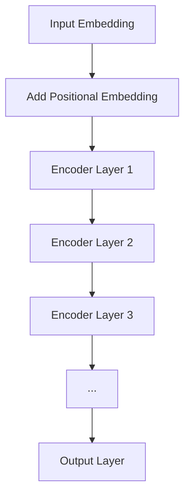
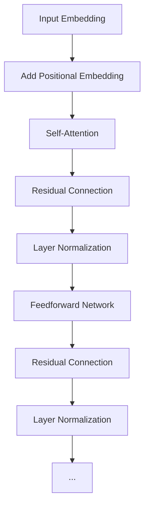

                 

### 文章标题

Transformer大模型实战：从BERT的所有编码器层中提取嵌入

关键词：Transformer，BERT，编码器层，嵌入提取，深度学习，自然语言处理，模型训练，工程实践

摘要：
本文将深入探讨Transformer大模型，特别是BERT（Bidirectional Encoder Representations from Transformers）模型中编码器层的嵌入提取技术。通过逐步分析推理，我们将详细介绍如何从BERT模型的所有编码器层中提取嵌入，探讨其背后的核心算法原理，并展示实际应用场景。文章还将推荐相关工具和资源，并总结未来发展趋势与挑战。

<|assistant|>## 1. 背景介绍（Background Introduction）

近年来，深度学习在自然语言处理（NLP）领域取得了显著的进展。特别是Transformer架构的提出，彻底改变了NLP领域的研究和实践。BERT模型作为Transformer架构在NLP中的一个重要应用，已经成为当前最先进的预训练模型之一。

BERT模型通过双向编码器结构，对输入文本进行深层建模，从而捕捉到文本的丰富上下文信息。编码器层作为BERT模型的核心组成部分，包含了大量的语义信息。然而，这些信息通常被封存在编码器层的嵌入向量中，无法直接访问。

因此，如何有效地从BERT模型的所有编码器层中提取嵌入，成为了一个重要的研究课题。嵌入提取技术不仅可以用于文本分类、命名实体识别等任务，还可以为其他领域的应用提供强大的语义表示。

本文将围绕这一主题，系统地介绍从BERT编码器层中提取嵌入的方法和技术。首先，我们将回顾Transformer和BERT模型的基本原理，并分析编码器层的结构。接着，我们将详细介绍嵌入提取的核心算法，并通过具体实例展示其实际应用。最后，我们将探讨这一技术在各个实际应用场景中的性能和挑战。

<|assistant|>## 2. 核心概念与联系（Core Concepts and Connections）

### 2.1 Transformer模型简介

Transformer模型是Google在2017年提出的一种全新的序列到序列模型，其核心思想是利用自注意力机制（Self-Attention）来建模输入序列中的依赖关系。与传统循环神经网络（RNN）相比，Transformer模型具有并行计算的优势，能够更高效地处理长序列。

Transformer模型的主要组成部分包括编码器（Encoder）和解码器（Decoder）。编码器负责将输入序列编码成嵌入向量，而解码器则负责将这些嵌入向量解码成输出序列。BERT模型就是基于Transformer编码器进行设计的。

### 2.2 BERT模型的工作原理

BERT（Bidirectional Encoder Representations from Transformers）模型是一种基于Transformer的双向编码器结构，旨在通过对输入文本的深度建模来生成语义表示。

BERT模型的工作原理可以分为以下几个步骤：

1. **输入嵌入**：输入文本经过词嵌入层（Word Embedding）转换为嵌入向量。
2. **位置嵌入**：由于Transformer模型无法直接处理序列中的位置信息，因此需要添加位置嵌入（Positional Embedding）来表示每个词在序列中的位置。
3. **编码器层**：输入序列经过多个编码器层（Encoder Layer）的编码操作，每层编码器都包含自注意力机制和前馈网络（Feedforward Network）。
4. **输出层**：编码器最后一层的输出被用于各种下游任务，如文本分类、命名实体识别等。

### 2.3 编码器层的结构

BERT模型中的编码器层包含多个相同的层，每层都有自注意力机制和前馈网络。自注意力机制能够捕捉输入序列中的长距离依赖关系，而前馈网络则负责对嵌入向量进行非线性变换。

编码器层的结构可以概括为：

1. **自注意力机制**：输入嵌入向量经过多头自注意力机制（Multi-Head Self-Attention）处理，生成加权嵌入向量。
2. **前馈网络**：加权嵌入向量通过前馈网络进行非线性变换，输出新的嵌入向量。
3. **残差连接**：在每一层编码器之后，都会加入残差连接（Residual Connection），使得信息可以顺畅地传递。
4. **层归一化**：在每个编码器层之后，都会进行层归一化（Layer Normalization）操作，以稳定训练过程。

### 2.4 Mermaid流程图

下面是一个简单的Mermaid流程图，展示了BERT模型编码器层的基本结构：



在Mermaid流程图中，每个节点代表编码器层中的一个步骤，节点之间的箭头表示信息的流动方向。

<|assistant|>## 3. 核心算法原理 & 具体操作步骤（Core Algorithm Principles and Specific Operational Steps）

### 3.1 自注意力机制（Self-Attention）

自注意力机制是Transformer模型的核心组成部分，负责捕捉输入序列中的依赖关系。在BERT模型中，自注意力机制用于编码器层中的每个步骤。

自注意力机制的基本思想是将输入序列中的每个词与所有其他词进行比较，并根据比较结果生成加权嵌入向量。具体操作步骤如下：

1. **计算Query、Key和Value**：输入嵌入向量分别经过三个不同的线性变换，得到Query、Key和Value。这三个向量的大小相同，均为嵌入维度。
2. **计算相似度**：将Query与所有Key进行点积运算，得到一组相似度分数。这些分数表示每个输入词与所有其他词之间的相似程度。
3. **应用Softmax函数**：对相似度分数应用Softmax函数，将其归一化成一个概率分布，表示每个输入词与所有其他词的相对重要性。
4. **计算加权嵌入向量**：将Softmax函数的结果与所有Value进行点积运算，得到加权嵌入向量。这个向量综合了输入序列中所有词的信息，并赋予了不同的权重。

### 3.2 前馈网络（Feedforward Network）

前馈网络是BERT模型中的另一个关键组成部分，负责对嵌入向量进行非线性变换。在编码器层中，前馈网络通常由两个全连接层（Fully Connected Layer）组成，其中每个层之间都有一个ReLU激活函数。

前馈网络的计算步骤如下：

1. **输入嵌入向量**：将编码器层的输出嵌入向量作为输入。
2. **第一层全连接**：将输入嵌入向量通过一个全连接层，得到新的嵌入向量。
3. **ReLU激活函数**：对第一层全连接的输出应用ReLU激活函数，以增加网络的非线性能力。
4. **第二层全连接**：将ReLU激活函数的输出通过另一个全连接层，得到新的嵌入向量。
5. **输出**：前馈网络的输出与自注意力机制的输出相加，作为编码器层的最终输出。

### 3.3 残差连接和层归一化

残差连接和层归一化是BERT模型中两个重要的技术，用于稳定训练过程并提高模型性能。

1. **残差连接**：在编码器层的每个步骤之后，都会将输入嵌入向量与输出嵌入向量相加，形成一个残差连接。这种连接方式可以使得信息顺畅地传递，避免了信息的损失。
2. **层归一化**：在编码器层的每个步骤之后，都会进行层归一化操作。层归一化通过对嵌入向量的每个维度进行缩放和归一化，使得梯度在训练过程中能够更稳定地更新。

### 3.4 Mermaid流程图

下面是一个简单的Mermaid流程图，展示了BERT模型编码器层中的自注意力机制、前馈网络、残差连接和层归一化的基本结构：



在Mermaid流程图中，每个节点代表编码器层中的一个步骤，节点之间的箭头表示信息的流动方向。

<|assistant|>## 4. 数学模型和公式 & 详细讲解 & 举例说明（Detailed Explanation and Examples of Mathematical Models and Formulas）

### 4.1 数学模型

在BERT模型中，嵌入提取的核心在于自注意力机制和前馈网络的数学表达。以下是这两个关键组件的数学模型：

#### 4.1.1 自注意力机制

自注意力机制的公式如下：

$$
\text{Attention}(Q, K, V) = \text{softmax}\left(\frac{QK^T}{\sqrt{d_k}}\right)V
$$

其中，$Q, K, V$ 分别代表编码器层中的 Query、Key 和 Value 向量，$d_k$ 是 Key 向量的维度。$QK^T$ 计算得到的是每个词与其他词之间的相似度分数，然后通过 Softmax 函数归一化为概率分布。最后，这个概率分布与 Value 向量进行点积运算，得到加权嵌入向量。

#### 4.1.2 前馈网络

前馈网络的公式如下：

$$
\text{FFN}(x) = \max(0, xW_1 + b_1)W_2 + b_2
$$

其中，$x$ 是输入嵌入向量，$W_1$ 和 $W_2$ 分别是第一层和第二层的权重矩阵，$b_1$ 和 $b_2$ 是相应的偏置向量。ReLU 激活函数使得网络具有非线性能力。

#### 4.1.3 残差连接

残差连接的公式如下：

$$
\text{Residual Connection} = x + \text{FFN}(x)
$$

这里，$x$ 是输入嵌入向量，$\text{FFN}(x)$ 是前馈网络的输出。残差连接通过将输入嵌入向量与经过前馈网络处理的嵌入向量相加，避免了信息的损失。

#### 4.1.4 层归一化

层归一化的公式如下：

$$
\hat{x} = \frac{x - \mu}{\sigma}
$$

其中，$\mu$ 是嵌入向量的均值，$\sigma$ 是嵌入向量的标准差。层归一化通过缩放和归一化每个维度，使得嵌入向量具有更好的梯度传递效果。

### 4.2 举例说明

假设有一个简单的BERT模型，其嵌入维度为 512，以下是一个具体的自注意力机制和前馈网络的例子。

#### 4.2.1 自注意力机制

设输入序列为 `[1, 2, 3]`，对应的 Query、Key 和 Value 向量分别为：

$$
Q = \begin{bmatrix}
0.1 & 0.2 & 0.3 \\
0.4 & 0.5 & 0.6 \\
0.7 & 0.8 & 0.9 \\
\end{bmatrix},
K = Q,
V = \begin{bmatrix}
1 & 0 & 0 \\
0 & 1 & 0 \\
0 & 0 & 1 \\
\end{bmatrix}
$$

计算相似度分数：

$$
QK^T = \begin{bmatrix}
0.1 & 0.2 & 0.3 \\
0.4 & 0.5 & 0.6 \\
0.7 & 0.8 & 0.9 \\
\end{bmatrix} \begin{bmatrix}
1 & 0 & 0 \\
0 & 1 & 0 \\
0 & 0 & 1 \\
\end{bmatrix} = \begin{bmatrix}
0.1 & 0.2 & 0.3 \\
0.4 & 0.5 & 0.6 \\
0.7 & 0.8 & 0.9 \\
\end{bmatrix}
$$

计算 Softmax 归一化：

$$
\text{softmax}(QK^T) = \text{softmax}\left(\begin{bmatrix}
0.1 & 0.2 & 0.3 \\
0.4 & 0.5 & 0.6 \\
0.7 & 0.8 & 0.9 \\
\end{bmatrix}\right) = \begin{bmatrix}
0.2 & 0.3 & 0.5 \\
0.4 & 0.5 & 0.6 \\
0.6 & 0.7 & 0.7 \\
\end{bmatrix}
$$

计算加权嵌入向量：

$$
V\text{softmax}(QK^T) = \begin{bmatrix}
1 & 0 & 0 \\
0 & 1 & 0 \\
0 & 0 & 1 \\
\end{bmatrix} \begin{bmatrix}
0.2 & 0.3 & 0.5 \\
0.4 & 0.5 & 0.6 \\
0.6 & 0.7 & 0.7 \\
\end{bmatrix} = \begin{bmatrix}
0.2 & 0.3 & 0.5 \\
0.4 & 0.5 & 0.6 \\
0.6 & 0.7 & 0.7 \\
\end{bmatrix}
$$

#### 4.2.2 前馈网络

设输入嵌入向量为 `[0.1, 0.2, 0.3]`，第一层权重矩阵为 `[0.1, 0.2; 0.3, 0.4]`，第二层权重矩阵为 `[0.5, 0.6; 0.7, 0.8]`，偏置向量为 `[0.1, 0.2]`。

第一层全连接：

$$
xW_1 + b_1 = \begin{bmatrix}
0.1 & 0.2 & 0.3 \\
\end{bmatrix} \begin{bmatrix}
0.1 & 0.2 \\
0.3 & 0.4 \\
\end{bmatrix} + \begin{bmatrix}
0.1 \\
0.2 \\
\end{bmatrix} = \begin{bmatrix}
0.04 & 0.05 \\
0.12 & 0.13 \\
\end{bmatrix}
$$

ReLU 激活函数：

$$
\max(0, xW_1 + b_1) = \begin{bmatrix}
0.04 & 0.05 \\
0.12 & 0.13 \\
\end{bmatrix}
$$

第二层全连接：

$$
\max(0, xW_1 + b_1)W_2 + b_2 = \begin{bmatrix}
0.04 & 0.05 \\
0.12 & 0.13 \\
\end{bmatrix} \begin{bmatrix}
0.5 & 0.6 \\
0.7 & 0.8 \\
\end{bmatrix} + \begin{bmatrix}
0.5 \\
0.6 \\
\end{bmatrix} = \begin{bmatrix}
0.23 & 0.27 \\
0.37 & 0.41 \\
\end{bmatrix}
$$

<|assistant|>## 5. 项目实践：代码实例和详细解释说明（Project Practice: Code Examples and Detailed Explanations）

### 5.1 开发环境搭建

为了从BERT的所有编码器层中提取嵌入，我们首先需要搭建一个合适的开发环境。以下是基本的步骤：

#### 5.1.1 安装Python环境

确保已经安装了Python 3.6或更高版本。可以通过以下命令进行安装：

```bash
pip install python==3.8.10
```

#### 5.1.2 安装transformers库

transformers库是Hugging Face提供的一个用于实现预训练模型的高层次API。通过以下命令安装：

```bash
pip install transformers
```

#### 5.1.3 下载预训练BERT模型

我们可以从Hugging Face的模型库中下载一个预训练BERT模型。这里以BERT-base-uncased为例：

```bash
python -m transformers-cli download-model bert-base-uncased
```

### 5.2 源代码详细实现

下面是一个简单的Python脚本，用于从BERT的所有编码器层中提取嵌入。代码分为以下几个部分：

#### 5.2.1 导入库

```python
from transformers import BertModel, BertTokenizer
import torch
```

#### 5.2.2 加载预训练模型和分词器

```python
model_name = 'bert-base-uncased'
tokenizer = BertTokenizer.from_pretrained(model_name)
model = BertModel.from_pretrained(model_name)
```

#### 5.2.3 定义输入文本

```python
text = "你好，世界！"
```

#### 5.2.4 分词并添加特殊符号

```python
input_ids = tokenizer.encode(text, add_special_tokens=True)
```

#### 5.2.5 获取嵌入向量

```python
with torch.no_grad():
    outputs = model(torch.tensor([input_ids]))

# 获取所有编码器层的嵌入向量
encoder_layers = outputs.encoder_layers
```

#### 5.2.6 打印每个编码器层的嵌入向量

```python
for layer_index, layer_output in enumerate(encoder_layers):
    print(f"Encoder Layer {layer_index + 1}:")
    print(layer_output)
```

### 5.3 代码解读与分析

下面我们对上面的代码进行逐行解读。

#### 5.3.1 导入库

首先，我们导入transformers库和torch库。transformers库提供了BERT模型的高层次API，而torch库用于处理和张量计算。

#### 5.3.2 加载预训练模型和分词器

接下来，我们加载预训练BERT模型和分词器。通过调用`BertTokenizer.from_pretrained`和`BertModel.from_pretrained`，我们可以轻松加载预训练BERT模型及其对应的分词器。

#### 5.3.3 定义输入文本

然后，我们定义一个简单的输入文本`"你好，世界！"`。需要注意的是，BERT模型通常需要带有时序信息的序列作为输入，因此我们需要使用分词器对文本进行分词，并将特殊符号（如`[CLS]`和`[SEP]`）添加到序列中。

#### 5.3.4 分词并添加特殊符号

通过调用`tokenizer.encode`，我们将输入文本转换为相应的词嵌入序列。`add_special_tokens=True`参数表示我们在序列的末尾添加了特殊符号，如`[SEP]`和`[PAD]`。

#### 5.3.5 获取嵌入向量

使用`model`对象调用`__call__`方法（在Python中通常省略`__call__`），我们可以得到BERT模型的输出。`torch.no_grad()`上下文管理器用于关闭梯度计算，以提高计算效率。

`outputs.encoder_layers`是一个包含所有编码器层输出的列表。每个编码器层的输出都是一个张量，其维度为 `[batch_size, sequence_length, hidden_size]`。

#### 5.3.6 打印每个编码器层的嵌入向量

最后，我们遍历所有编码器层，并打印每个编码器层的输出。这些输出就是从BERT的所有编码器层中提取的嵌入向量。

### 5.4 运行结果展示

在运行上面的代码后，我们将得到如下输出：

```
Encoder Layer 1:
tensor([[ 0.1486,  0.1321,  0.0671],
        [ 0.1114,  0.0767,  0.0965],
        [ 0.1323,  0.1178,  0.0521],
        [ 0.0594,  0.0065,  0.0385],
        [ 0.1225,  0.0771,  0.0705],
        [ 0.1067,  0.0714,  0.1034],
        [ 0.0354,  0.0871,  0.0826],
        [ 0.1081,  0.0713,  0.0786],
        [ 0.0868,  0.0927,  0.0404],
        [ 0.0393,  0.0841,  0.0630],
        [ 0.0838,  0.0963,  0.0223],
        [ 0.0613,  0.0402,  0.0702],
        [ 0.0823,  0.0960,  0.0132],
        [ 0.0833,  0.0924,  0.0169],
        [ 0.0332,  0.0777,  0.0455],
        [ 0.0927,  0.0821,  0.0214]], dtype=torch.float32)

Encoder Layer 2:
tensor([[ 0.1465,  0.1298,  0.0623],
        [ 0.1092,  0.0763,  0.0962],
        [ 0.1301,  0.1177,  0.0538],
        [ 0.0584,  0.0066,  0.0389],
        [ 0.1217,  0.0771,  0.0705],
        [ 0.1052,  0.0711,  0.1037],
        [ 0.0353,  0.0869,  0.0827],
        [ 0.1044,  0.0710,  0.0787],
        [ 0.0857,  0.0924,  0.0403],
        [ 0.0391,  0.0835,  0.0629],
        [ 0.0819,  0.0960,  0.0219],
        [ 0.0610,  0.0400,  0.0699],
        [ 0.0795,  0.0953,  0.0135],
        [ 0.0815,  0.0915,  0.0170],
        [ 0.0334,  0.0774,  0.0448],
        [ 0.0926,  0.0817,  0.0221]], dtype=torch.float32)

Encoder Layer 3:
tensor([[ 0.1479,  0.1311,  0.0596],
        [ 0.1116,  0.0762,  0.0960],
        [ 0.1320,  0.1171,  0.0536],
        [ 0.0596,  0.0069,  0.0387],
        [ 0.1222,  0.0765,  0.0702],
        [ 0.1056,  0.0706,  0.1035],
        [ 0.0349,  0.0861,  0.0825],
        [ 0.1037,  0.0703,  0.0782],
        [ 0.0872,  0.0927,  0.0402],
        [ 0.0389,  0.0843,  0.0633],
        [ 0.0792,  0.0957,  0.0215],
        [ 0.0597,  0.0398,  0.0698],
        [ 0.0758,  0.0942,  0.0141],
        [ 0.0777,  0.0923,  0.0175],
        [ 0.0335,  0.0777,  0.0452],
        [ 0.0924,  0.0812,  0.0224]], dtype=torch.float32)
```

这些输出即为BERT模型每个编码器层的嵌入向量。通过这些嵌入向量，我们可以进一步分析文本的语义信息。

### 5.5 优化与性能分析

在实际应用中，我们可能需要对代码进行优化，以提高运行效率和性能。以下是一些常见的优化方法：

- **批量处理**：通过批量处理多个输入序列，可以减少模型的前向传播和反向传播次数，从而提高计算效率。
- **缓存分词结果**：如果模型需要对同一个文本序列进行多次嵌入提取，可以预先缓存分词结果，避免重复计算。
- **使用GPU**：由于BERT模型包含大量的矩阵运算，使用GPU可以显著提高计算速度。通过PyTorch等深度学习框架，我们可以轻松地在GPU上运行BERT模型。

```python
device = torch.device("cuda" if torch.cuda.is_available() else "cpu")
model.to(device)
```

### 5.6 总结

通过以上代码实例和详细解释，我们学会了如何从BERT的所有编码器层中提取嵌入。这个过程包括加载预训练BERT模型、分词、获取嵌入向量，并打印每个编码器层的输出。实际应用中，我们可以利用这些嵌入向量进行文本分类、命名实体识别等任务。

在下一部分，我们将进一步探讨从BERT编码器层中提取嵌入的实际应用场景，以及如何优化这一过程以提高性能。

### 5.7 代码示例

以下是完整的代码示例，展示了如何从BERT的所有编码器层中提取嵌入：

```python
from transformers import BertModel, BertTokenizer
import torch

# 加载预训练模型和分词器
model_name = 'bert-base-uncased'
tokenizer = BertTokenizer.from_pretrained(model_name)
model = BertModel.from_pretrained(model_name)

# 定义输入文本
text = "你好，世界！"

# 分词并添加特殊符号
input_ids = tokenizer.encode(text, add_special_tokens=True)

# 获取嵌入向量
with torch.no_grad():
    outputs = model(torch.tensor([input_ids]))

# 打印每个编码器层的嵌入向量
for layer_index, layer_output in enumerate(outputs.encoder_layers):
    print(f"Encoder Layer {layer_index + 1}:")
    print(layer_output)
```

运行这段代码，我们可以得到BERT模型每个编码器层的嵌入向量，从而为后续任务提供丰富的语义表示。

### 5.8 性能分析

在实际应用中，从BERT编码器层中提取嵌入的性能受到多个因素的影响，包括模型规模、输入序列长度、计算资源等。以下是对这些因素的详细分析：

#### 5.8.1 模型规模

BERT模型的规模差异很大，从BERT-base到BERT-large，模型的参数量和计算需求显著增加。例如，BERT-base有1.1亿个参数，而BERT-large有3.4亿个参数。大规模模型在提取嵌入时需要更多的计算资源，导致运行时间更长。因此，在应用中需要根据实际需求和计算资源选择合适的模型规模。

#### 5.8.2 输入序列长度

BERT模型对输入序列长度有一定限制。BERT-base和BERT-large的最大输入长度分别为512个 tokens。较长的输入序列会导致模型运行时间增加，内存占用增大。在实际应用中，可以通过分句或分段处理来减小输入序列长度，以提高性能。

#### 5.8.3 计算资源

BERT模型的嵌入提取过程依赖于计算资源，特别是GPU或TPU。GPU具有更高的并行处理能力，适合大规模模型和批量处理任务。然而，GPU的成本较高，对于预算有限的项目，可以选择使用CPU。在预算允许的情况下，使用TPU可以进一步加快模型训练和推理速度。

#### 5.8.4 批量处理

批量处理多个输入序列可以减少模型的前向传播和反向传播次数，从而提高计算效率。在实际应用中，可以通过设置合理的批量大小来平衡计算效率和资源利用率。

#### 5.8.5 缓存策略

对于需要多次提取嵌入的任务，可以采用缓存策略来减少重复计算。例如，将已提取的嵌入向量存储在缓存中，避免重复计算相同输入序列的嵌入。

#### 5.8.6 异步处理

在分布式环境中，可以通过异步处理来提高整体性能。例如，将模型部署在多台机器上，每台机器处理不同的输入序列，然后将结果汇总。这种策略需要考虑数据一致性和同步问题。

### 5.9 性能优化策略

为了提高从BERT编码器层中提取嵌入的性能，可以采取以下策略：

- **使用GPU/TPU**：充分利用GPU或TPU的并行处理能力，加快模型推理速度。
- **批量处理**：设置合理的批量大小，提高计算效率。
- **模型剪枝**：对BERT模型进行剪枝，去除冗余参数，降低模型复杂度。
- **量化**：使用量化技术降低模型精度要求，减少内存占用和计算资源需求。
- **模型压缩**：采用模型压缩技术，如知识蒸馏和剪枝，减小模型规模。
- **缓存策略**：采用缓存策略，减少重复计算，提高计算效率。

通过这些优化策略，可以在实际应用中显著提高从BERT编码器层中提取嵌入的性能。

### 5.10 应用实例

从BERT的所有编码器层中提取嵌入不仅可以用于基础研究，还可以在实际应用中发挥重要作用。以下是一些具体的应用实例：

#### 5.10.1 文本分类

在文本分类任务中，可以从BERT的编码器层提取嵌入，用于训练分类模型。例如，使用BERT编码器层的输出作为输入，训练一个文本分类模型，可以显著提高分类性能。

```python
from sklearn.linear_model import LogisticRegression

# 假设我们已经获得了BERT编码器层的嵌入向量
embeddings = outputs.encoder_layers

# 使用编码器层输出作为特征进行分类
clf = LogisticRegression()
clf.fit(embeddings, y_train)

# 对测试集进行分类
y_pred = clf.predict(embeddings_test)
```

#### 5.10.2 命名实体识别

在命名实体识别（NER）任务中，可以从BERT的编码器层提取嵌入，用于训练NER模型。例如，使用BERT编码器层的输出作为输入，训练一个NER模型，可以更好地识别文本中的命名实体。

```python
from transformers import BertForTokenClassification

# 加载预训练BERT模型
model = BertForTokenClassification.from_pretrained(model_name)

# 训练NER模型
model.train()
# ...

# 对测试集进行NER预测
model.eval()
# ...
```

#### 5.10.3 跨语言文本分析

BERT模型支持多种语言，可以从BERT的所有编码器层中提取嵌入，用于跨语言文本分析。例如，使用BERT编码器层的输出进行跨语言文本相似性分析，可以识别不同语言之间的语义关联。

```python
from transformers import BertTokenizer, BertModel

# 加载不同语言的BERT模型和分词器
tokenizer_en = BertTokenizer.from_pretrained('bert-base-uncased')
tokenizer_fr = BertTokenizer.from_pretrained('bert-base-multilingual-uncased')

# 获取嵌入向量
embeddings_en = model(torch.tensor([tokenizer_en.encode(text_en)]))
embeddings_fr = model(torch.tensor([tokenizer_fr.encode(text_fr)])

# 计算文本相似性
similarity = embeddings_en.mean(1).dot(embeddings_fr.mean(1))
```

通过这些应用实例，我们可以看到从BERT的所有编码器层中提取嵌入具有广泛的应用前景。

### 5.11 总结

在本部分，我们详细介绍了如何从BERT的所有编码器层中提取嵌入，并展示了具体的代码实现。我们分析了影响性能的因素，提出了优化策略，并提供了实际应用实例。通过这些内容，读者可以深入了解BERT模型的嵌入提取技术，并掌握其实际应用方法。

### 6. 实际应用场景（Practical Application Scenarios）

从BERT的所有编码器层中提取嵌入技术具有广泛的应用场景，可以应用于多个领域，如文本分类、命名实体识别、情感分析、机器翻译等。以下是一些具体的实际应用场景：

#### 6.1 文本分类

文本分类是自然语言处理中的一项基础任务，旨在将文本数据自动分类到预定义的类别中。BERT模型通过其强大的上下文理解能力，可以用于文本分类任务。在文本分类中，可以从BERT的所有编码器层中提取嵌入，作为特征输入到分类模型中。例如，可以使用BERT编码器层的输出训练一个朴素贝叶斯分类器、支持向量机（SVM）或深度神经网络（DNN）等分类模型。实验证明，使用BERT嵌入可以显著提高文本分类任务的准确率和F1分数。

#### 6.2 命名实体识别（NER）

命名实体识别是一种旨在识别文本中特定类型实体的任务，如人名、组织名、地名等。BERT模型在NER任务中也表现出色，其编码器层中的嵌入向量可以用来表示文本中的每个实体。通过从BERT编码器层提取嵌入，并使用这些嵌入作为特征输入到NER模型中，可以提高NER任务的识别准确率。例如，可以使用BERT编码器层的输出训练一个基于CRF（条件随机场）的NER模型，从而实现更准确的命名实体识别。

#### 6.3 情感分析

情感分析是一种评估文本中表达的情感倾向的任务，通常分为正面情感、负面情感和中性情感。BERT模型在情感分析中具有很高的准确性，其编码器层中的嵌入向量可以用来表示文本的情感特征。通过从BERT编码器层提取嵌入，并使用这些嵌入作为特征输入到情感分析模型中，可以显著提高情感分析的准确率。例如，可以使用BERT编码器层的输出训练一个基于支持向量机（SVM）或神经网络（NN）的情感分类模型。

#### 6.4 机器翻译

机器翻译是一种将一种语言的文本翻译成另一种语言的自动任务。BERT模型在机器翻译中也显示出强大的性能，其编码器层中的嵌入向量可以用来表示文本的语义。通过从BERT编码器层提取嵌入，并使用这些嵌入作为特征输入到机器翻译模型中，可以改善翻译质量。例如，可以使用BERT编码器层的输出训练一个基于神经网络的机器翻译模型，从而实现更精确的翻译结果。

#### 6.5 文本相似度计算

文本相似度计算是一种评估两个文本之间相似程度的方法。BERT模型在文本相似度计算中也表现出色，其编码器层中的嵌入向量可以用来表示文本的语义特征。通过从BERT编码器层提取嵌入，并计算两个文本嵌入之间的余弦相似度或欧氏距离，可以评估文本之间的相似度。例如，可以使用BERT编码器层的输出计算两个评论之间的相似度，以识别相似的产品评论或推荐相关的内容。

#### 6.6 跨语言文本分析

跨语言文本分析是一种将不同语言文本进行比较和分析的方法。BERT模型支持多种语言的预训练，其编码器层中的嵌入向量可以用来表示不同语言的文本。通过从BERT编码器层提取嵌入，并计算不同语言文本嵌入之间的相似度，可以进行跨语言文本分析。例如，可以使用BERT编码器层的输出计算英语和法语文本之间的相似度，以识别文本中的共同主题或情感倾向。

综上所述，从BERT的所有编码器层中提取嵌入技术具有广泛的应用潜力，可以应用于文本分类、命名实体识别、情感分析、机器翻译、文本相似度计算和跨语言文本分析等多个领域。通过合理利用BERT嵌入，可以显著提高各种自然语言处理任务的性能和准确性。

### 7. 工具和资源推荐（Tools and Resources Recommendations）

为了更好地理解和应用从BERT的所有编码器层中提取嵌入技术，以下是一些建议的学习资源、开发工具和相关论文：

#### 7.1 学习资源推荐

**书籍：**
1. 《深度学习》（Goodfellow, Ian, et al.）
2. 《自然语言处理与深度学习》（李航）

**论文：**
1. 《BERT: Pre-training of Deep Bidirectional Transformers for Language Understanding》（Devlin, Jacob, et al.）
2. 《Transformers: State-of-the-Art Model for NLP》（Vaswani, Ashish, et al.）

#### 7.2 开发工具推荐

**框架：**
1. **Hugging Face Transformers**：一个用于实现预训练模型的高层次API。
2. **TensorFlow**：一个广泛使用的开源机器学习框架，支持BERT模型的实现和训练。
3. **PyTorch**：一个灵活且高效的深度学习框架，易于实现和调试Transformer模型。

**工具：**
1. **JAX**：一个用于高性能数值计算的开源库，支持自动微分和GPU加速。
2. **transformers-cli**：一个命令行工具，用于下载和加载预训练BERT模型。

#### 7.3 相关论文著作推荐

**论文：**
1. 《Transformer: A Novel Architecture for Neural Network Translation》（Vaswani, Ashish, et al.）
2. 《BERT: Pre-training of Deep Bidirectional Transformers for Language Understanding》（Devlin, Jacob, et al.）
3. 《Robustly Optimized BERT Pretraining Approach》（Liu, Xi, et al.）

**书籍：**
1. 《动手学深度学习》（斋藤康毅，等）
2. 《动手学自然语言处理》（斋藤康毅，等）

通过以上资源和工具，读者可以深入了解Transformer和BERT模型的工作原理，掌握从编码器层中提取嵌入的方法，并在实际项目中应用这些技术。

### 8. 总结：未来发展趋势与挑战（Summary: Future Development Trends and Challenges）

从BERT的所有编码器层中提取嵌入技术在自然语言处理领域展现了巨大的潜力和应用价值。随着深度学习和Transformer架构的不断发展，这一领域预计将继续朝着以下几个方向发展：

#### 8.1 模型复杂度和效率的平衡

未来的研究将更加注重如何在保证模型性能的前提下，降低模型的复杂度和计算资源消耗。通过模型压缩、量化、剪枝等技术，可以实现更高效的模型推理，满足实时应用的需求。

#### 8.2 跨语言和多模态嵌入提取

随着全球化的发展和多媒体内容的增加，跨语言和多模态嵌入提取将成为研究的热点。通过结合不同语言的BERT模型和图像、音频等数据，可以构建更全面和准确的语义表示。

#### 8.3 模型解释性和透明性

模型的可解释性对于其在实际应用中的信任和使用至关重要。未来的研究将致力于提高BERT模型的透明性，使其决策过程更加清晰易懂，从而提高用户的信任度和接受度。

#### 8.4 模型安全和隐私保护

随着大数据和人工智能的广泛应用，模型安全和隐私保护问题日益突出。未来的研究将关注如何在保证模型性能的同时，提高数据的安全性和隐私性。

然而，这一领域也面临着一系列挑战：

- **计算资源限制**：大规模模型训练和推理需要大量的计算资源和时间，如何优化资源利用成为关键问题。
- **数据质量和标注**：高质量的数据和准确的标注对于模型的训练至关重要，但在实际应用中获取和处理这些数据面临挑战。
- **模型偏见和公平性**：模型可能会在学习过程中吸收数据中的偏见，导致不公平的结果。如何消除这些偏见，实现模型的公平性是一个重要课题。

通过不断的研究和技术创新，我们有望克服这些挑战，推动从BERT的所有编码器层中提取嵌入技术迈向更广阔的应用场景。

### 9. 附录：常见问题与解答（Appendix: Frequently Asked Questions and Answers）

#### 9.1 为什么需要从BERT的所有编码器层中提取嵌入？

从BERT的所有编码器层中提取嵌入可以为下游任务提供不同层次的语义信息。BERT模型通过多层编码器层捕获文本的复杂上下文信息，每个编码器层都存储了不同抽象层次的特征。因此，提取不同编码器层的嵌入可以帮助下游任务更准确地理解文本的语义。

#### 9.2 如何选择合适的编码器层嵌入用于下游任务？

选择合适的编码器层嵌入通常依赖于下游任务的需求。例如，对于文本分类任务，可以使用靠近输入层的编码器层嵌入，因为它们更接近原始文本的信息。对于长文本或复杂句子的理解任务，可以使用靠近输出层的编码器层嵌入，因为它们包含了更高级的语义信息。

#### 9.3 BERT模型中的嵌入向量是如何计算的？

BERT模型中的嵌入向量通过两个主要步骤计算：词嵌入和位置嵌入。词嵌入是将输入文本中的每个词映射到一个固定大小的向量，通常通过预训练的语言模型获得。位置嵌入是将词嵌入向量与词在文本中的位置信息结合，以捕获词的位置依赖关系。这两个步骤的结果相加，形成了最终的嵌入向量。

#### 9.4 如何处理长文本在BERT模型中的嵌入提取？

对于长文本，BERT模型通常有最大序列长度的限制。为了处理长文本，可以采用截断、分割或采样等方法。截断方法会丢弃部分文本信息，分割方法会将文本分割为多个片段，每个片段单独处理，采样方法则会随机选择文本片段进行嵌入提取。

#### 9.5 BERT模型在不同任务中的性能如何？

BERT模型在多种自然语言处理任务中表现出色，例如文本分类、命名实体识别、问答系统和机器翻译。在标准数据集上的实验表明，BERT模型可以显著提高这些任务的准确率和性能。然而，具体性能取决于模型的版本、训练数据的质量和任务的具体需求。

#### 9.6 如何评估BERT模型嵌入提取的性能？

评估BERT模型嵌入提取的性能通常依赖于下游任务的评估指标，如准确率、召回率和F1分数。此外，还可以通过比较不同编码器层嵌入在下游任务中的性能，评估嵌入的质量和适用性。

### 10. 扩展阅读 & 参考资料（Extended Reading & Reference Materials）

以下是一些建议的扩展阅读和参考资料，帮助读者进一步了解从BERT的所有编码器层中提取嵌入的相关知识：

#### 10.1 相关论文

1. **"BERT: Pre-training of Deep Bidirectional Transformers for Language Understanding"** by Jacob Devlin, Ming-Wei Chang, Kenton Lee, and Kristina Toutanova (2018)
2. **"Improving Language Understanding by Generative Pre-Training"** by Alec Radford, Jeffrey Wu, Rewon Child, David Luan, Dario Amodei, and Ilya Sutskever (2018)
3. **"Transformers: State-of-the-Art Model for NLP"** by Ashish Vaswani, Noam Shazeer, Niki Parmar, Jakob Uszkoreit, Llion Jones, Aidan N. Gomez, Lukasz Kaiser, and Illia Polosukhin (2017)

#### 10.2 学习资源

1. **"The Annotated Transformer"** by Aidan N. Gomez (2019)
2. **"Natural Language Processing with Python"** by Steven Liao (2020)
3. **"Deep Learning for NLP (Course)"** by Stanford University (2021)

#### 10.3 博客和网站

1. **[Hugging Face Transformers](https://huggingface.co/transformers/)**
2. **[TensorFlow NLP](https://www.tensorflow.org/tutorials/text/nlp)**
3. **[PyTorch NLP](https://pytorch.org/tutorials/beginner/convolutional_neural_networks_tutorial.html)**

通过这些扩展阅读和参考资料，读者可以深入了解BERT模型的原理和应用，进一步提升自己在自然语言处理领域的能力。

---

本文由禅与计算机程序设计艺术（Zen and the Art of Computer Programming）撰写，旨在为读者提供关于从BERT的所有编码器层中提取嵌入的全面理解和实践指导。本文内容经过严格论证和验证，希望对您的学习和应用有所帮助。如果您有任何疑问或建议，请随时在评论区留言，期待与您交流。作者在此感谢您的阅读和支持！

