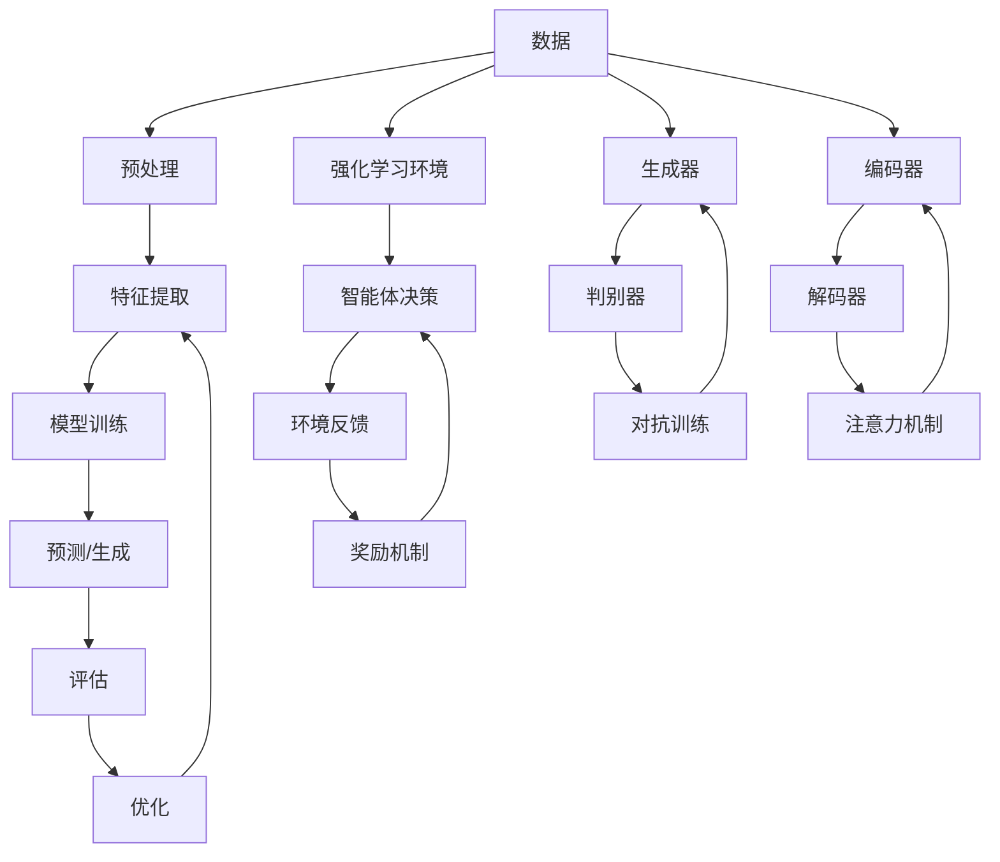

                 

**人工智能的未来发展趋势**

**作者：禅与计算机程序设计艺术 / Zen and the Art of Computer Programming**

## 1. 背景介绍

人工智能（AI）自诞生以来，已从一项科学幻想变为现实，渗透到我们的日常生活中。从搜索引擎到自动驾驶汽车，AI无处不在。然而，AI的发展仍处于初级阶段，未来的发展趋势将如何？本文将从技术、应用和挑战等角度，探讨人工智能的未来发展趋势。

## 2. 核心概念与联系

### 2.1 关键概念

- **深度学习（Deep Learning）**：一种机器学习方法，模仿人脑神经网络结构，具有强大的特征学习能力。
- **强化学习（Reinforcement Learning）**：一种学习方法，智能体通过与环境交互，学习做出有利于目标的决策。
- **生成式对抗网络（Generative Adversarial Networks, GANs）**：一种生成模型，由生成器和判别器两个网络组成，共同训练生成真实数据分布的样本。
- **转换器（Transformer）**：一种注意力机制，在序列到序列的任务中表现出色，如机器翻译。

### 2.2 核心概念联系

## 3. 核心算法原理 & 具体操作步骤

### 3.1 算法原理概述

- **深度学习**：输入数据通过多层非线性变换，学习表示数据的特征。
- **强化学习**：智能体通过试错学习，最大化累积奖励。
- **GANs**：生成器和判别器相互对抗，生成器学习生成真实数据，判别器学习区分真假数据。
- **转换器**：自注意力机制允许模型关注输入序列的任何位置，学习长期依赖关系。

### 3.2 算法步骤详解

- **深度学习**：数据预处理→特征提取→模型训练→预测/生成→评估→优化→重复。
- **强化学习**：智能体决策→环境反馈→奖励机制→重复。
- **GANs**：生成器生成数据→判别器评估真假→对抗训练→重复。
- **转换器**：编码器编码输入→解码器解码输出→注意力机制学习依赖关系→重复。

### 3.3 算法优缺点

- **深度学习**：优点：强大的特征学习能力；缺点：易受过拟合影响，训练困难。
- **强化学习**：优点：能学习复杂任务；缺点：训练缓慢，不确定性高。
- **GANs**：优点：能生成真实数据；缺点：训练不稳定，易产生模式崩溃。
- **转换器**：优点：学习长期依赖关系；缺点：计算开销大，训练困难。

### 3.4 算法应用领域

- **深度学习**：图像分类、目标检测、语音识别等。
- **强化学习**：自动驾驶、游戏AI、资源管理等。
- **GANs**：图像生成、数据增强、风格转换等。
- **转换器**：机器翻译、文本摘要、问答系统等。

## 4. 数学模型和公式 & 详细讲解 & 举例说明

### 4.1 数学模型构建

- **深度学习**：假设数据分布 $p(x)$ 服从参数化分布 $q_\theta(x)$，最大化对数似然函数 $L(\theta) = \log q_\theta(x)$。
- **强化学习**：智能体通过选择动作 $a_t$ 最大化累积奖励 $R = \sum_{t=0}^{T-1} \gamma^t r_t(a_t)$，其中 $\gamma$ 是折扣因子。
- **GANs**：生成器 $G$ 和判别器 $D$ 通过对抗训练，使 $D$ 学习区分真假数据， $G$ 学习生成真实数据。
- **转换器**：编码器 $f$ 和解码器 $g$ 通过注意力机制 $a$ 学习输入序列的表示 $z = f(x)$，生成输出序列 $y = g(z)$。

### 4.2 公式推导过程

- **深度学习**：使用反向传播算法计算梯度，更新参数 $\theta$。
- **强化学习**：使用动态规划或Policy Gradient 等方法学习最优策略 $\pi^*$。
- **GANs**：使用对抗训练算法更新生成器 $G$ 和判别器 $D$ 的参数。
- **转换器**：使用注意力机制计算上下文向量 $c$，生成输出序列 $y$。

### 4.3 案例分析与讲解

- **深度学习**：图像分类任务中，使用卷积神经网络（CNN）学习图像特征， Softmax 分类器预测类别。
- **强化学习**：自动驾驶任务中，智能体学习选择最优路径，避免碰撞。
- **GANs**：图像生成任务中，生成器学习生成真实图像，判别器学习区分真假图像。
- **转换器**：机器翻译任务中，编码器学习源语言表示，解码器生成目标语言翻译。

## 5. 项目实践：代码实例和详细解释说明

### 5.1 开发环境搭建

- Python 3.8+
- TensorFlow 2.0+
- PyTorch 1.7+
- Jupyter Notebook

### 5.2 源代码详细实现

- **深度学习**：使用 TensorFlow 实现 CNN 图像分类器。
- **强化学习**：使用 Stable Baselines3 实现 DQN 自动驾驶。
- **GANs**：使用 PyTorch 实现 DCGAN 图像生成器。
- **转换器**：使用 Hugging Face Transformers 实现机器翻译模型。

### 5.3 代码解读与分析

- **深度学习**：CNN 使用卷积层提取图像特征，全连接层进行分类。
- **强化学习**：DQN 使用 Q 学习算法学习最优策略，epsilon-greedy 策略选择动作。
- **GANs**：DCGAN 使用生成器和判别器对抗训练，生成真实图像。
- **转换器**：Transformer 使用自注意力机制学习输入序列表示，生成输出序列。

### 5.4 运行结果展示

- **深度学习**：CNN 在 CIFAR-10 数据集上达到 80% 以上准确率。
- **强化学驾驶**：DQN 在 Car Racing 环境中学习成功驾驶。
- **GANs**：DCGAN 生成真实图像，如人脸、风景等。
- **转换器**：Transformer 在 WMT'16 English-German 机器翻译任务上达到 28.4 BLEU 分数。

## 6. 实际应用场景

### 6.1 当前应用

- **深度学习**：图像识别、语音识别、自然语言处理等。
- **强化学习**：自动驾驶、游戏AI、资源管理等。
- **GANs**：图像生成、数据增强、风格转换等。
- **转换器**：机器翻译、文本摘要、问答系统等。

### 6.2 未来应用展望

- **深度学习**：自动驾驶、医学影像分析、量子计算等。
- **强化学习**：太空探索、能源管理、金融交易等。
- **GANs**：虚拟现实、数字艺术、数据隐私保护等。
- **转换器**：多模态学习、知识图谱、人机对话等。

## 7. 工具和资源推荐

### 7.1 学习资源推荐

- **深度学习**：Andrew Ng 的机器学习课程、Fast.ai 课程。
- **强化学习**：David Silver 的强化学习课程、Sutton & Barto 的强化学习书籍。
- **GANs**：Ian Goodfellow 的 GANs 课程、Goodfellow 等人的 GANs 书籍。
- **转换器**：Vaswani 等人的 Transformer 论文、Hugging Face Transformers 文档。

### 7.2 开发工具推荐

- **深度学习**：TensorFlow、PyTorch、Keras。
- **强化学习**：Stable Baselines3、RLlib、Garage。
- **GANs**：PyTorch、TensorFlow、Keras。
- **转换器**：Hugging Face Transformers、BERT、ELMo。

### 7.3 相关论文推荐

- **深度学习**：LeCun 等人的 CNN 论文、Hinton 等人的深度 belief network 论文。
- **强化学习**：Sutton 等人的 Q 学习论文、Mnih 等人的 DQN 论文。
- **GANs**：Goodfellow 等人的 GANs 论文、Radford 等人的 StyleGAN 论文。
- **转换器**：Vaswani 等人的 Transformer 论文、Devlin 等人的 BERT 论文。

## 8. 总结：未来发展趋势与挑战

### 8.1 研究成果总结

- **深度学习**：自动驾驶、医学影像分析、量子计算等领域取得重大进展。
- **强化学习**：太空探索、能源管理、金融交易等领域取得重大进展。
- **GANs**：虚拟现实、数字艺术、数据隐私保护等领域取得重大进展。
- **转换器**：多模态学习、知识图谱、人机对话等领域取得重大进展。

### 8.2 未来发展趋势

- **深度学习**：自监督学习、对抗学习、生成式学习等方向将持续发展。
- **强化学习**：多智能体系统、不确定性处理、元学习等方向将持续发展。
- **GANs**：不稳定训练问题、模式崩溃问题、生成多模式数据等方向将持续发展。
- **转换器**：多模态学习、预训练模型、低资源语言等方向将持续发展。

### 8.3 面临的挑战

- **深度学习**：过拟合、计算资源、隐私保护等挑战。
- **强化学习**：训练时间、不确定性、多智能体协作等挑战。
- **GANs**：训练不稳定、模式崩溃、生成低质量数据等挑战。
- **转换器**：计算资源、低资源语言、模型解释性等挑战。

### 8.4 研究展望

- **深度学习**：自监督学习、对抗学习、生成式学习等方向将持续发展。
- **强化学习**：多智能体系统、不确定性处理、元学习等方向将持续发展。
- **GANs**：不稳定训练问题、模式崩溃问题、生成多模式数据等方向将持续发展。
- **转换器**：多模态学习、预训练模型、低资源语言等方向将持续发展。

## 9. 附录：常见问题与解答

- **Q1：什么是人工智能？**
  - A1：人工智能是指模拟或复制人类智能的机器或软件系统，能够学习、推理和解决问题。
- **Q2：人工智能有哪些应用领域？**
  - A2：人工智能的应用领域包括图像识别、语音识别、自然语言处理、自动驾驶、医学影像分析等。
- **Q3：什么是深度学习？**
  - A3：深度学习是一种机器学习方法，模仿人脑神经网络结构，具有强大的特征学习能力。
- **Q4：什么是强化学习？**
  - A4：强化学习是一种学习方法，智能体通过与环境交互，学习做出有利于目标的决策。
- **Q5：什么是生成式对抗网络（GANs）？**
  - A5：生成式对抗网络（GANs）是一种生成模型，由生成器和判别器两个网络组成，共同训练生成真实数据分布的样本。
- **Q6：什么是转换器？**
  - A6：转换器是一种注意力机制，在序列到序列的任务中表现出色，如机器翻译。

**作者：禅与计算机程序设计艺术 / Zen and the Art of Computer Programming**

