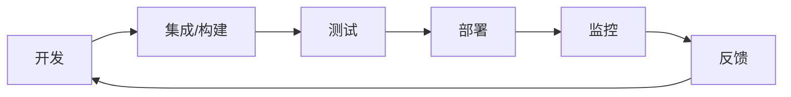

                 

## 1. 背景介绍

在当今快速变化的商业环境中，软件开发和部署的速度和质量至关重要。传统的水fall模型已经无法满足当前的需求，因此，DevOps（开发运维）应运而生。DevOps是一种文化、实践和工具，旨在提高软件开发和部署的速度、可靠性和质量。本文将深入探讨DevOps工程的核心概念，重点介绍自动化和监控。

## 2. 核心概念与联系

### 2.1 DevOps的核心理念

DevOps的核心理念是消除开发和运维之间的壁垒，实现协作和流程的自动化。这包括：

- **自动化**：通过自动化工具和流程，减少人为错误，提高效率和一致性。
- **协作**：开发和运维团队密切合作，共同负责软件的整个生命周期。
- **持续集成/持续交付（CI/CD）**：开发和测试频繁进行，新代码集成到主干后立即进行自动化测试，通过后交付给运维部署。

### 2.2 DevOps架构


上图展示了DevOps架构的关键组件：

- **开发**：编写代码，进行单元测试。
- **集成/构建**：将代码集成到主干，自动构建可部署的软件包。
- **测试**：自动化测试，确保软件功能正确。
- **部署**：将软件部署到生产环境。
- **监控**：监控软件的性能和可用性，及时发现和解决问题。

### 2.3 DevOps流程图



## 3. 核心算法原理 & 具体操作步骤

### 3.1 自动化原理概述

自动化是DevOps的关键，它通过自动化工具和流程，减少人为错误，提高效率和一致性。自动化原理包括：

- **无人值守**：自动化工具可以在没有人工干预的情况下运行。
- **可重复性**：自动化流程可以重复执行，确保结果一致。
- **可扩展性**：自动化工具可以处理大量的任务，适应需求的变化。

### 3.2 自动化步骤详解

自动化的具体步骤包括：

1. **识别需要自动化的任务**：这些任务通常是重复的、繁琐的，或者容易出错的。
2. **选择合适的自动化工具**：选择工具时，要考虑其功能、可靠性、易用性和成本。
3. **设计自动化流程**：流程应该清晰明确，易于理解和维护。
4. **实现自动化流程**：使用选定的工具，实现自动化流程。
5. **测试和验证**：确保自动化流程按预期工作。
6. **维护和改进**：自动化流程应该定期维护和改进，以适应需求的变化。

### 3.3 自动化优缺点

自动化的优点包括：

- 提高效率和一致性
- 减少人为错误
- 降低成本
- 提高灵活性和适应能力

自动化的缺点包括：

- 初始投入成本高
- 需要技术和维护人员
- 可能会导致过度自动化，忽略人工智慧和判断

### 3.4 自动化应用领域

自动化在DevOps中的应用领域包括：

- **构建**：自动化构建工具（如Jenkins）可以自动构建软件包。
- **测试**：自动化测试工具（如Selenium）可以自动执行测试用例。
- **部署**：自动化部署工具（如Ansible）可以自动部署软件到生产环境。
- **配置管理**：自动化配置管理工具（如Puppet）可以自动配置服务器。

## 4. 数学模型和公式 & 详细讲解 & 举例说明

### 4.1 数学模型构建

自动化和监控的数学模型可以用控制论的框架来构建。控制论研究系统的行为和控制系统的动态特性。自动化和监控系统可以看作是一个闭环控制系统，其数学模型如下：


其中：

- **G(s)**：被控对象的传递函数
- **C(s)**：控制器的传递函数
- **R(s)**：期望输出
- **Y(s)**：实际输出
- **E(s)**：控制误差

### 4.2 公式推导过程

控制论模型的公式推导过程如下：

1. **控制器设计**：设计控制器的传递函数C(s)，使得系统稳定且跟踪性能好。
2. **闭环传递函数**：计算闭环传递函数T(s)，即：

   $$T(s) = \frac{G(s)C(s)}{1 + G(s)C(s)}$$

3. **稳定性分析**：分析闭环传递函数T(s)的稳定性，确保系统稳定。
4. **跟踪性能分析**：分析系统的跟踪性能，确保系统能够跟踪期望输出R(s)。

### 4.3 案例分析与讲解

例如，考虑一个简单的温度控制系统。被控对象是一个恒温器，其传递函数为：

$$G(s) = \frac{1}{s(1+s)}$$

控制器选择为比例-积分（PI）控制器，其传递函数为：

$$C(s) = K_p + \frac{K_i}{s}$$

其中，$K_p$和$K_i$是比例和积分系数。闭环传递函数为：

$$T(s) = \frac{G(s)C(s)}{1 + G(s)C(s)} = \frac{K_p + K_i}{s^2 + (K_p + 1)s + K_i}$$

通过分析闭环传递函数的稳定性和跟踪性能，可以设计合适的$K_p$和$K_i$，使得系统稳定且跟踪性能好。

## 5. 项目实践：代码实例和详细解释说明

### 5.1 开发环境搭建

本项目使用Jenkins作为自动化构建和部署工具，使用Prometheus和Grafana进行监控。开发环境需要安装Jenkins、Prometheus、Grafana和相关的插件。

### 5.2 源代码详细实现

以下是Jenkins配置文件的示例：

```xml
<project>
  <actions/>
  <description>自动化构建和部署</description>
  <keepDependenciesVersion>False</keepDependenciesVersion>
  <properties/>
  <scm class="hudson.plugins.git.GitSCM">
    <configVersion>2</configVersion>
    <userRemoteConfigs>
      <hudson.plugins.git.UserRemoteConfig>
        <url>https://github.com/user/repo.git</url>
      </hudson.plugins.git.UserRemoteConfig>
    </userRemoteConfigs>
    <branches>
      <hudson.plugins.git.BranchSpec>
        <name>*/master</name>
      </hudson.plugins.git.BranchSpec>
    </branches>
    <doGenerateSubmoduleConfigurations>false</doGenerateSubmoduleConfigurations>
    <submoduleCfg class="list"/>
    <extensions/>
  </scm>
  <canRoam>true</canRoam>
  <disabled>false</disabled>
  <blockBuildWhenDownstreamBuilding>false</blockBuildWhenDownstreamBuilding>
  <blockBuildWhenUpstreamBuilding>false</blockBuildWhenUpstreamBuilding>
  <triggers class="vector"/>
  <concurrentBuild>true</concurrentBuild>
  <builders>
    <hudson.tasks.Shell>
      <command>sh build.sh</command>
    </hudson.tasks.Shell>
  </builders>
  <publishers/>
  <buildWrappers/>
</project>
```

### 5.3 代码解读与分析

上述配置文件配置了一个自动化构建和部署的Jenkins项目。它从GitHub上拉取代码，执行构建脚本`build.sh`，没有配置任何发布器或构建包装器。

### 5.4 运行结果展示

当代码推送到GitHub上时，Jenkins会自动触发构建。构建日志会记录构建过程，包括错误和警告信息。构建完成后，Jenkins会将构建结果发布到Prometheus和Grafana，进行监控和可视化。

## 6. 实际应用场景

### 6.1 自动化构建和部署

自动化构建和部署可以应用于各种软件项目，包括Web应用、移动应用、桌面应用等。它可以提高构建和部署的速度和可靠性，减少人为错误。

### 6.2 自动化测试

自动化测试可以应用于各种软件测试任务，包括单元测试、集成测试、端到端测试等。它可以提高测试的速度和一致性，减少人为错误。

### 6.3 自动化监控

自动化监控可以应用于各种软件系统，包括Web应用、数据库系统、消息队列等。它可以实时监控系统的性能和可用性，及时发现和解决问题。

### 6.4 未来应用展望

未来，自动化和监控技术将继续发展，出现更多的自动化工具和监控平台。这些技术将更加智能化，可以自动学习和适应系统的变化。此外，自动化和监控技术将更加集成化，可以与其他技术（如人工智能、物联网等）结合，实现更复杂的应用。

## 7. 工具和资源推荐

### 7.1 学习资源推荐

- **书籍**：《DevOps Handbook》《Site Reliability Engineering》《Continuous Delivery》等。
- **在线课程**：Pluralsight、Udemy、Coursera等平台上的DevOps课程。
- **博客**：Atlassian、Docker、Jenkins等官方博客，以及各种DevOps博客。

### 7.2 开发工具推荐

- **自动化构建和部署**：Jenkins、Travis CI、CircleCI等。
- **自动化测试**：Selenium、Appium、Robot Framework等。
- **自动化监控**：Prometheus、Grafana、New Relic等。

### 7.3 相关论文推荐

- **自动化构建和部署**：[Continuous Delivery: Reliable Software Releases through Build, Test, and Deployment Automation](https://itrevolution.com/books/continuous-delivery/)
- **自动化测试**：[Test Automation Patterns: A Practical Guide](https://www.amazon.com/Test-Automation-Patterns-Practical-Engineering/dp/0321714939)
- **自动化监控**：[Site Reliability Engineering: How Google Runs Production Systems](https://landing.google.com/sre/books/)

## 8. 总结：未来发展趋势与挑战

### 8.1 研究成果总结

本文介绍了DevOps工程的核心概念，重点介绍了自动化和监控。自动化可以提高软件开发和部署的速度和质量，监控可以及时发现和解决系统问题。本文还介绍了自动化和监控的数学模型和公式，并提供了项目实践的示例。

### 8.2 未来发展趋势

未来，自动化和监控技术将继续发展，出现更多的自动化工具和监控平台。这些技术将更加智能化，可以自动学习和适应系统的变化。此外，自动化和监控技术将更加集成化，可以与其他技术（如人工智能、物联网等）结合，实现更复杂的应用。

### 8.3 面临的挑战

自动化和监控技术面临的挑战包括：

- **初始投入成本高**：自动化和监控技术需要购买和维护昂贵的工具和设备。
- **技术和维护人员短缺**：自动化和监控技术需要专门的技术和维护人员。
- **过度自动化**：过度自动化可能会导致系统缺乏灵活性和适应能力。

### 8.4 研究展望

未来的研究方向包括：

- **自动化和监控技术的集成化**：研究如何将自动化和监控技术与其他技术（如人工智能、物联网等）结合，实现更复杂的应用。
- **自动化和监控技术的智能化**：研究如何使自动化和监控技术更加智能化，可以自动学习和适应系统的变化。
- **自动化和监控技术的成本优化**：研究如何降低自动化和监控技术的成本，使其更加经济实惠。

## 9. 附录：常见问题与解答

**Q1：自动化和监控技术的优点是什么？**

A1：自动化和监控技术的优点包括提高软件开发和部署的速度和质量，及时发现和解决系统问题，降低人为错误，提高系统的可靠性和可用性。

**Q2：自动化和监控技术的缺点是什么？**

A2：自动化和监控技术的缺点包括初始投入成本高，技术和维护人员短缺，过度自动化可能会导致系统缺乏灵活性和适应能力。

**Q3：自动化和监控技术的未来发展趋势是什么？**

A3：未来，自动化和监控技术将继续发展，出现更多的自动化工具和监控平台。这些技术将更加智能化，可以自动学习和适应系统的变化。此外，自动化和监控技术将更加集成化，可以与其他技术（如人工智能、物联网等）结合，实现更复杂的应用。

**Q4：自动化和监控技术面临的挑战是什么？**

A4：自动化和监控技术面临的挑战包括初始投入成本高，技术和维护人员短缺，过度自动化可能会导致系统缺乏灵活性和适应能力。

**Q5：未来的研究方向是什么？**

A5：未来的研究方向包括自动化和监控技术的集成化，自动化和监控技术的智能化，自动化和监控技术的成本优化。

**作者：禅与计算机程序设计艺术 / Zen and the Art of Computer Programming**

