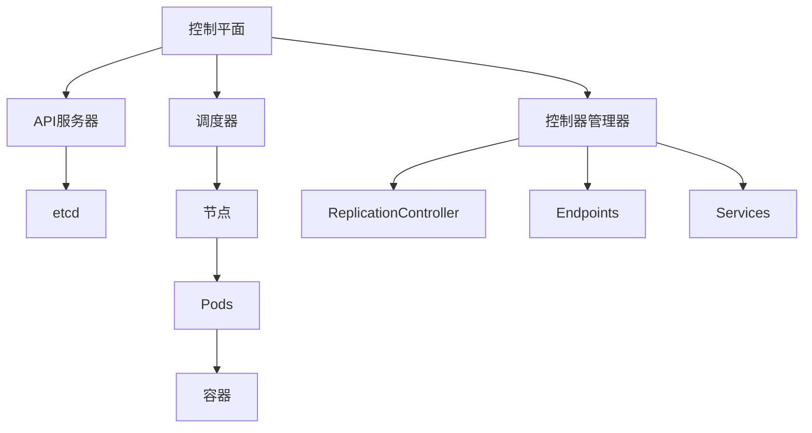

                 

## 1. 背景介绍

在当今的云原生时代，容器化应用的部署和管理已成为主流。Kubernetes（K8s）是一个开源的容器编排平台，它提供了自动化部署、扩展和管理容器化应用的能力。本文将深入探讨Kubernetes集群管理和应用部署的相关知识，帮助读者理解其核心概念、算法原理，并提供实践指南和工具推荐。

## 2. 核心概念与联系

### 2.1 Kubernetes架构

Kubernetes架构由多个组件组成，它们协同工作以管理集群和部署应用。下图是Kubernetes架构的Mermaid流程图：



### 2.2 主要组件

- **控制平面（Control Plane）**：管理集群的整体运行状态，包括API服务器、调度器和控制器管理器。
- **API服务器（API Server）**：提供了Kubernetes集群的入口点，处理来自用户和其他组件的请求。
- **调度器（Scheduler）**：负责为新创建的Pod选择合适的节点运行。
- **控制器管理器（Controller Manager）**：运行多个控制器，维护集群的状态，如ReplicationController、Endpoints和Services。
- **节点（Node）**：运行Pod的主机，由一个kubelet进程管理。
- **Pod**：最小的Kubernetes部署单位，包含一个或多个容器。
- **Services**：提供了对Pod的网络访问，并为Pod提供稳定的网络标识。
- **etcd**：用于存储和管理Kubernetes集群的共享状态。

## 3. 核心算法原理 & 具体操作步骤

### 3.1 算法原理概述

Kubernetes的核心算法原理是基于声明式管理的控制器模式。用户描述了集群的期望状态，控制器会不断地将当前状态调整为期望状态。

### 3.2 算法步骤详解

1. 用户创建一个描述集群期望状态的对象（如Deployment、Service等），并将其发送给API服务器。
2. API服务器将对象存储在etcd中，并通知控制器管理器。
3. 控制器管理器运行多个控制器，检查当前状态是否符合期望状态。
4. 如果有偏差，控制器会触发相应的操作（如创建、更新或删除Pod、Services等）以纠正偏差。
5. 调度器选择合适的节点运行新创建的Pod。
6. kubelet在节点上管理Pod的生命周期，并与容器运行时（如Docker）交互以运行容器。

### 3.3 算法优缺点

**优点：**

- 声明式管理简化了集群管理。
- 控制器模式提供了自动化和弹性的部署和扩展能力。
- 可扩展的架构允许添加自定义控制器。

**缺点：**

- 学习曲线陡峭，需要一定的时间和努力才能掌握。
- 部署和管理集群需要一定的资源和技能。

### 3.4 算法应用领域

Kubernetes广泛应用于云原生应用的部署和管理，包括微服务架构、CI/CD流水线和大数据处理等领域。

## 4. 数学模型和公式 & 详细讲解 & 举例说明

### 4.1 数学模型构建

Kubernetes的数学模型可以表示为一个有向图 $G = (V, E)$，其中：

- $V$ 是集群中所有对象的集合（如Pod、Service、Deployment等）。
- $E$ 是对象之间的依赖关系集合。

### 4.2 公式推导过程

假设用户创建了一个Deployment对象，期望运行$n$个Pod。控制器管理器会创建一个ReplicationController对象，其期望状态为$n$个Pod。如果当前状态为$m$个Pod，则偏差为$|n - m|$。控制器会不断地创建或删除Pod以最小化偏差。

### 4.3 案例分析与讲解

考虑一个运行Nginx容器的Deployment对象，其期望状态为3个Pod。如果当前状态为2个Pod，则偏差为$|3 - 2| = 1$。控制器会创建一个新的Pod以最小化偏差。

## 5. 项目实践：代码实例和详细解释说明

### 5.1 开发环境搭建

在开始之前，请确保您的环境中安装了Kubernetes（本地或云端）和kubectl命令行工具。

### 5.2 源代码详细实现

创建一个名为`nginx-deployment.yaml`的文件，内容如下：

```yaml
apiVersion: apps/v1
kind: Deployment
metadata:
  name: nginx-deployment
spec:
  replicas: 3
  selector:
    matchLabels:
      app: nginx
  template:
    metadata:
      labels:
        app: nginx
    spec:
      containers:
      - name: nginx
        image: nginx:latest
        ports:
        - containerPort: 80
```

### 5.3 代码解读与分析

- `apiVersion`和`kind`指定了对象的版本和类型。
- `metadata`包含对象的元数据，如名称。
- `spec`描述了对象的期望状态，包括副本数（`replicas`）、选择器（`selector`）和Pod模板（`template`）。

### 5.4 运行结果展示

使用`kubectl apply -f nginx-deployment.yaml`命令创建Deployment对象。您可以使用`kubectl get pods`命令检查Pod的状态，并使用`kubectl get deployments`命令检查Deployment的状态。

## 6. 实际应用场景

### 6.1 微服务架构

Kubernetes是微服务架构的理想选择，它提供了自动化部署、扩展和管理微服务的能力。

### 6.2 CI/CD流水线

Kubernetes可以与CI/CD工具（如Jenkins、GitLab CI等）集成，自动部署和更新应用。

### 6.3 大数据处理

Kubernetes支持大数据处理框架（如Spark、Hadoop等）的部署和管理，提供了弹性和可扩展的处理能力。

### 6.4 未来应用展望

未来，Kubernetes将继续发展，支持更多的应用场景，如边缘计算、人工智能和物联网等。此外，Kubernetes也将与其他云原生技术（如Service Mesh、Function as a Service等）集成，提供更完整的解决方案。

## 7. 工具和资源推荐

### 7.1 学习资源推荐

- [Kubernetes官方文档](https://kubernetes.io/docs/home/)
- [Kubernetes中文文档](https://www.kubernetes.org.cn/)
- [Kubernetes Bootcamp](https://www.katacoda.com/learn/kubernetes)

### 7.2 开发工具推荐

- [Minikube](https://minikube.sigs.k8s.io/)：本地开发环境。
- [kubectl](https://kubernetes.io/docs/reference/generated/kubectl/kubectl-commands)：命令行工具。
- [Helm](https://helm.sh/)：包管理器。
- [Kube-bench](https://github.com/aquasecurity/kube-bench)：安全检查工具。

### 7.3 相关论文推荐

- [Borg, Omega, and Kubernetes: Borg Background](https://research.google/pubs/pub43438/)
- [Kubernetes: A Decade of Container Orchestration](https://arxiv.org/abs/2006.06818)

## 8. 总结：未来发展趋势与挑战

### 8.1 研究成果总结

本文介绍了Kubernetes集群管理和应用部署的核心概念、算法原理和实践指南。读者现在应该能够理解Kubernetes的工作原理，并能够部署和管理Kubernetes集群。

### 8.2 未来发展趋势

未来，Kubernetes将继续发展，支持更多的应用场景，并与其他云原生技术集成。此外，Kubernetes也将变得更加易于使用和管理，提供更多的自动化和智能化功能。

### 8.3 面临的挑战

Kubernetes面临的挑战包括学习曲线陡峭、部署和管理集群需要一定的资源和技能，以及安全和可靠性等问题。

### 8.4 研究展望

未来的研究将关注Kubernetes的可扩展性、安全性和智能化，并探索Kubernetes在新应用场景（如边缘计算、人工智能和物联网等）中的应用。

## 9. 附录：常见问题与解答

**Q：如何安装Kubernetes？**

A：您可以使用[Minikube](https://minikube.sigs.k8s.io/)在本地安装Kubernetes，或在云端使用提供商的Kubernetes服务（如GKE、EKS等）。

**Q：如何部署应用到Kubernetes集群？**

A：您可以创建一个Deployment对象，描述应用的期望状态，并使用`kubectl apply`命令部署应用。

**Q：如何扩展应用的副本数？**

A：您可以更新Deployment对象的`replicas`字段，并使用`kubectl apply`命令更新应用。

**Q：如何管理Kubernetes集群的安全？**

A：您可以使用RBAC（角色基于访问控制）来管理集群的访问控制，并使用网络策略来控制Pod之间的通信。

## 作者：禅与计算机程序设计艺术 / Zen and the Art of Computer Programming

