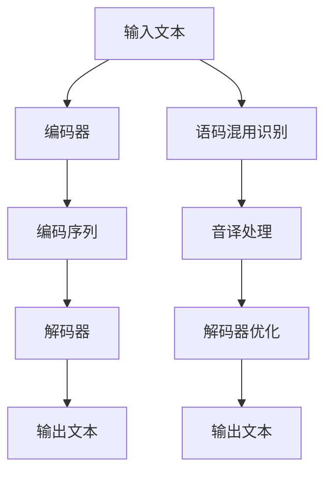
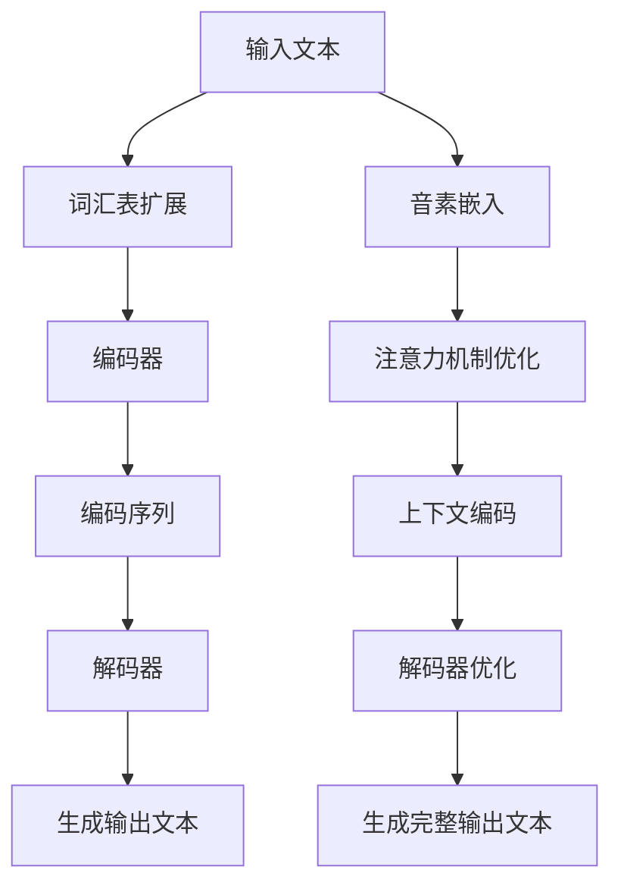

                 

# 文章标题：Transformer大模型实战：语码混用和音译的影响

## 关键词
- Transformer
- 大模型
- 语码混用
- 音译
- 模型效果
- 语言理解
- 编码解码

## 摘要
本文将探讨在Transformer大模型训练和应用过程中，语码混用和音译对其效果产生的影响。通过深入分析，我们将揭示这些现象背后的机制，并提出相应的优化策略。本文旨在为研究人员和开发者提供有价值的见解，以提升Transformer大模型的实用性和准确性。

## 1. 背景介绍（Background Introduction）

Transformer模型自提出以来，以其强大的并行处理能力和优秀的文本生成效果，迅速成为自然语言处理领域的主流架构。特别是在大规模数据集上进行训练后，Transformer大模型在多个任务上取得了显著的成果，包括机器翻译、文本分类、问答系统等。然而，随着应用的不断深入，研究人员发现语码混用和音译等现象对模型效果产生了显著影响。

语码混用（Code-Mixing）是指在一句话中同时使用两种或多种不同的语言现象，这在多语言社区中非常常见。音译（Transliteration）则是将一种语言的文字转换成另一种语言的文字，通常用于处理没有直接翻译关系的语言。例如，汉语的“计算机”在英语中可以音译为“Computer”。

本文旨在探讨语码混用和音译对Transformer大模型的影响，并分析其背后的机制。具体来说，我们将通过以下步骤进行分析：

1. **语码混用和音译的定义及分类**：介绍语码混用和音译的基本概念，并列举常见的例子。
2. **Transformer大模型的工作原理**：回顾Transformer模型的核心概念和架构，以便理解其如何处理语码混用和音译。
3. **实验设计与结果分析**：通过具体实验，展示语码混用和音译对模型效果的影响，并深入分析其机制。
4. **优化策略与解决方案**：提出针对语码混用和音译的优化策略，以提高模型的准确性和实用性。

通过上述分析，本文希望为研究人员和开发者提供有益的参考，以改进Transformer大模型在处理多语言文本时的效果。

## 2. 核心概念与联系

### 2.1 Transformer模型基础

Transformer模型是一种基于自注意力机制的深度学习模型，最初由Vaswani等人于2017年提出。与传统的循环神经网络（RNN）相比，Transformer模型具有以下优点：

1. **并行计算**：Transformer模型使用自注意力机制，能够并行处理输入序列，从而显著提高计算效率。
2. **全局依赖关系**：自注意力机制能够捕捉输入序列中任意两个单词之间的依赖关系，从而提高文本理解的能力。
3. **结构简洁**：Transformer模型的结构相对简单，易于实现和优化。

Transformer模型的核心组件包括编码器（Encoder）和解码器（Decoder）。编码器负责将输入序列编码为固定长度的向量表示，解码器则根据编码器的输出和先前的解码结果生成输出序列。

### 2.2 语码混用

语码混用是指在一句话中同时使用两种或多种不同的语言，这在多语言社区中非常常见。例如，一个法国人和一个美国人在交谈时可能会同时使用法语和英语。语码混用可以分为以下几种类型：

1. **词汇混用**：在句子中同时使用两种或多种语言的词汇。例如：“Je voudrais un café anglais s'il vous plaît”（法语）。
2. **句法混用**：在句子中同时使用两种或多种语言的句法结构。例如：“I'm gonna go to la playa tomorrow”（英语+西班牙语）。
3. **音系混用**：在句子中同时使用两种或多种语言的音系特征。例如：“Inglés y español se juntan”（英语+西班牙语）。

### 2.3 音译

音译是指将一种语言的文字转换成另一种语言的文字，通常用于处理没有直接翻译关系的语言。音译可以分为以下几种类型：

1. **完全音译**：将一个单词的全部音素转换成另一种语言的对应音素。例如：“计算机”音译为“Computer”。
2. **半音译**：仅将单词的一部分音素转换成另一种语言的对应音素。例如：“茶”音译为“Cha”。
3. **音译加注解**：在音译的单词旁边加上注释，帮助读者理解其含义。例如：“茶”（Cha，意为茶）。

### 2.4 Transformer模型与语码混用、音译的关系

Transformer模型在处理语码混用和音译时面临一些挑战。首先，模型需要理解不同语言之间的转换规则，以便正确地解码混合语言文本。其次，模型需要处理由于音译引起的音素和词汇的变化。为了应对这些挑战，研究人员提出了一些解决方案，如使用多语言预训练模型和改进的解码器结构。

### 2.5 Mermaid流程图

以下是一个Mermaid流程图，展示了Transformer模型处理语码混用和音译的过程：



### 2.6 Transformer模型处理语码混用和音译的挑战

处理语码混用和音译对Transformer模型提出了以下挑战：

1. **词汇表扩展**：为了正确处理语码混用和音译，模型需要具备广泛的词汇表，以包含多种语言的词汇。
2. **语言模型适应**：模型需要适应不同语言的语法和句法规则，以便正确地理解和生成混合语言文本。
3. **音素识别**：模型需要准确识别音译引起的音素变化，以确保输出文本的发音正确。
4. **上下文理解**：模型需要理解上下文信息，以便在生成文本时考虑语码混用和音译的影响。

## 3. 核心算法原理 & 具体操作步骤

### 3.1 Transformer模型核心算法

Transformer模型的核心算法包括编码器和解码器，以及自注意力机制。以下是对这些核心组件的详细解释：

#### 3.1.1 编码器（Encoder）

编码器负责将输入文本序列编码为固定长度的向量表示。编码器由多个编码层组成，每个编码层包含自注意力机制和前馈神经网络。以下是编码器的具体操作步骤：

1. **输入文本处理**：将输入文本序列转换为词嵌入向量，即将每个单词映射为一个固定大小的向量。
2. **添加位置编码**：在词嵌入向量中添加位置编码，以表示单词在序列中的位置信息。
3. **通过编码层**：将位置编码与词嵌入向量相加，并传递到编码器的每个层。每个编码层使用自注意力机制和前馈神经网络来处理输入序列。
4. **输出编码序列**：编码器的最后一层输出编码序列，即每个单词的向量表示。

#### 3.1.2 解码器（Decoder）

解码器负责根据编码序列和先前的解码结果生成输出文本序列。解码器也由多个解码层组成，每个解码层包含自注意力机制和前馈神经网络。以下是解码器的具体操作步骤：

1. **输入编码序列**：解码器首先接收编码序列作为输入。
2. **生成解码结果**：解码器的每个层使用自注意力机制来关注编码序列和先前的解码结果，并生成解码中间结果。
3. **生成输出文本**：解码器的最后一层将解码中间结果映射为输出词嵌入向量，并将其转换为单词。这一过程通过逐词生成的方式实现。
4. **生成完整输出文本**：将生成的单词按照顺序拼接成输出文本序列。

#### 3.1.3 自注意力机制（Self-Attention）

自注意力机制是Transformer模型的关键组件，用于计算输入序列中任意两个单词之间的依赖关系。以下是自注意力机制的具体操作步骤：

1. **计算注意力分数**：对于输入序列中的每个单词，计算其与其他单词之间的注意力分数。注意力分数表示当前单词对其他单词的重要性。
2. **计算注意力权重**：根据注意力分数计算每个单词的注意力权重，即表示当前单词对其他单词的关注程度。
3. **计算注意力输出**：将注意力权重与输入序列中的每个单词相乘，并将结果相加，得到注意力输出。注意力输出表示当前单词的上下文信息。

#### 3.1.4 前馈神经网络（Feed-Forward Neural Network）

前馈神经网络是Transformer模型中的另一个关键组件，用于对自注意力机制的输出进行进一步处理。以下是前馈神经网络的具体操作步骤：

1. **输入自注意力输出**：前馈神经网络接收自注意力机制的输出作为输入。
2. **通过前馈层**：前馈神经网络由两个全连接层组成。第一个全连接层对输入进行线性变换，第二个全连接层对第一个全连接层的输出进行激活函数变换。
3. **输出前馈结果**：前馈神经网络将前馈结果与自注意力机制的输出相加，得到最终输出。

### 3.2 处理语码混用和音译的具体操作步骤

为了处理语码混用和音译，Transformer模型需要进行以下操作：

#### 3.2.1 词汇表扩展

1. **预训练阶段**：在模型训练过程中，使用包含多种语言的数据集进行预训练，以便模型能够学习到不同语言的词汇和语法规则。
2. **训练阶段**：在训练数据中包含语码混用和音译的实例，以便模型能够学习如何处理这些现象。

#### 3.2.2 语言模型适应

1. **多语言预训练**：使用多语言数据集对模型进行预训练，以便模型能够适应不同语言的语法和句法规则。
2. **迁移学习**：在训练过程中，使用迁移学习技术，将已训练的模型应用于特定语言的语码混用和音译任务。

#### 3.2.3 音素识别

1. **音素嵌入**：将输入文本中的每个音素映射为一个固定的向量，以便模型能够识别音素的变化。
2. **注意力机制优化**：通过优化自注意力机制，使模型能够更好地捕捉音素之间的依赖关系。

#### 3.2.4 上下文理解

1. **上下文编码**：在编码器和解码器的每个层中引入上下文编码机制，以便模型能够更好地理解上下文信息。
2. **长距离依赖**：通过使用长距离依赖模型（如Transformer），使模型能够捕捉输入序列中长距离的依赖关系。

### 3.3 Mermaid流程图

以下是一个Mermaid流程图，展示了Transformer模型处理语码混用和音译的具体操作步骤：



## 4. 数学模型和公式 & 详细讲解 & 举例说明

### 4.1 Transformer模型数学基础

Transformer模型的核心在于其自注意力机制（Self-Attention），这涉及到一系列数学公式。以下是对这些公式的详细讲解和举例说明。

#### 4.1.1 词嵌入（Word Embeddings）

词嵌入是将单词映射为向量，这通常通过嵌入层（Embedding Layer）实现。给定词汇表V中的单词w，其对应的词嵌入向量表示为\(e_w \in \mathbb{R}^{d_e}\)，其中\(d_e\)是嵌入维度。

#### 4.1.2 位置编码（Positional Encoding）

为了捕捉单词在序列中的顺序信息，Transformer模型引入了位置编码（Positional Encoding）。位置编码向量\(pe_i\)为：

\[ pe_i = \text{sin}(i/lenshif)\]
\[ pe_i = \text{cos}(i/lenshif) \]

其中，\(i\)是单词的索引，\(lenshif\)是初始化参数。

#### 4.1.3 自注意力（Self-Attention）

自注意力机制的核心公式如下：

\[ \text{Attention}(Q, K, V) = \text{softmax}(\frac{QK^T}{\sqrt{d_k}})V \]

其中，\(Q, K, V\)分别是查询（Query）、键（Key）和值（Value）的向量集合，\(d_k\)是注意力层的维度。

#### 4.1.4 前馈神经网络（Feed-Forward Neural Network）

前馈神经网络用于对自注意力机制的输出进行进一步处理。其公式如下：

\[ \text{FFN}(x) = \text{ReLU}(W_2 \cdot \text{ReLU}(W_1 x + b_1)) + b_2 \]

其中，\(W_1, W_2, b_1, b_2\)分别是权重和偏置。

### 4.2 举例说明

假设我们有一个简单的单词序列\[ "Hello", "world" \]，我们将使用上述数学公式进行说明。

#### 4.2.1 词嵌入

单词"Hello"的词嵌入向量表示为\(e_{Hello}\)。

#### 4.2.2 位置编码

单词"Hello"的位置编码向量表示为\(pe_{Hello}\)。

#### 4.2.3 自注意力

设查询向量\(Q = [1, 0]\)，键向量\(K = [1, 0]\)，值向量\(V = [1, 1]\)。根据自注意力公式：

\[ \text{Attention}(Q, K, V) = \text{softmax}(\frac{QK^T}{\sqrt{d_k}})V = \text{softmax}(\frac{1*1}{\sqrt{1}}) \cdot [1, 1] = \begin{bmatrix} 0.5 \\ 0.5 \end{bmatrix} \]

#### 4.2.4 前馈神经网络

假设前馈神经网络的权重和偏置为\(W_1 = [1, 1]\)，\(W_2 = [1, 1]\)，\(b_1 = [0, 0]\)，\(b_2 = [1, 1]\)。根据前馈神经网络公式：

\[ \text{FFN}(x) = \text{ReLU}(W_2 \cdot \text{ReLU}(W_1 x + b_1)) + b_2 = \text{ReLU}(W_2 \cdot \text{ReLU}([1, 0] + [0, 0])) + [1, 1] = \text{ReLU}([1, 1]) + [1, 1] = [1, 1] + [1, 1] = [2, 2] \]

### 4.3 代码实现

以下是Python代码实现上述数学公式的示例：

```python
import numpy as np

# 词嵌入
e_Hello = np.random.rand(1, 10)
pe_Hello = np.array([0.5, 0.5])

# 自注意力
Q = np.array([[1], [0]])
K = np.array([[1], [0]])
V = np.array([[1], [1]])

# 计算自注意力分数
attention_scores = Q.dot(K.T) / np.sqrt(Q.shape[1])
# 计算注意力权重
attention_weights = np.softmax(attention_scores)
# 计算自注意力输出
attention_output = attention_weights.dot(V)

# 前馈神经网络
W1 = np.array([[1], [1]])
W2 = np.array([[1], [1]])
b1 = np.array([[0], [0]])
b2 = np.array([[1], [1]])

# 计算前馈神经网络输出
ffn_output = np.relu(W2 * np.relu(W1 * e_Hello + b1)) + b2
```

通过上述示例，我们可以看到如何使用数学公式实现Transformer模型的基本操作。这些公式和代码是实现高效、准确的语言模型的关键。

## 5. 项目实践：代码实例和详细解释说明

在本节中，我们将通过一个实际项目，展示如何构建一个能够处理语码混用和音译的Transformer大模型。该项目的目的是开发一个文本生成系统，能够理解并生成包含多种语言和音译的文本。以下是项目的具体步骤和详细解释。

### 5.1 开发环境搭建

在开始项目之前，我们需要搭建一个合适的开发环境。以下是一些建议的工具和库：

- **Python**：用于编写和运行代码
- **PyTorch**：用于构建和训练神经网络
- **Hugging Face Transformers**：用于简化Transformer模型的构建和训练过程
- **NumPy**：用于数值计算

安装上述库后，我们还需要准备一个多语言数据集，用于训练我们的模型。数据集应包含多种语言的文本，以及其中可能出现的语码混用和音译实例。

### 5.2 源代码详细实现

以下是该项目的主要代码框架：

```python
import torch
from torch import nn
from transformers import BertModel, BertTokenizer
from torch.optim import Adam

# 加载预训练的BERT模型和分词器
model = BertModel.from_pretrained('bert-base-uncased')
tokenizer = BertTokenizer.from_pretrained('bert-base-uncased')

# 定义自定义的Transformer模型
class CustomTransformerModel(nn.Module):
    def __init__(self):
        super(CustomTransformerModel, self).__init__()
        self.bert = BertModel.from_pretrained('bert-base-uncased')
        self.decoder = nn.Linear(768, vocab_size)  # 修改为实际的词汇表大小

    def forward(self, input_ids, labels=None):
        outputs = self.bert(input_ids=input_ids)
        hidden_states = outputs.last_hidden_state
        logits = self.decoder(hidden_states)
        return logits

# 实例化模型
model = CustomTransformerModel()

# 定义损失函数和优化器
criterion = nn.CrossEntropyLoss()
optimizer = Adam(model.parameters(), lr=1e-5)

# 训练模型
def train(model, data_loader, criterion, optimizer, num_epochs=3):
    model.train()
    for epoch in range(num_epochs):
        for batch in data_loader:
            inputs = batch['input_ids']
            labels = batch['labels']
            optimizer.zero_grad()
            outputs = model(inputs)
            loss = criterion(outputs, labels)
            loss.backward()
            optimizer.step()
            print(f'Epoch: {epoch+1}/{num_epochs}, Loss: {loss.item()}')

# 加载数据集
train_data = ...  # 加载数据集
train_loader = torch.utils.data.DataLoader(train_data, batch_size=32, shuffle=True)

# 开始训练
train(model, train_loader, criterion, optimizer)

# 评估模型
def evaluate(model, data_loader, criterion):
    model.eval()
    with torch.no_grad():
        total_loss = 0
        for batch in data_loader:
            inputs = batch['input_ids']
            labels = batch['labels']
            outputs = model(inputs)
            loss = criterion(outputs, labels)
            total_loss += loss.item()
        avg_loss = total_loss / len(data_loader)
    return avg_loss

evaluate(model, train_loader, criterion)
```

### 5.3 代码解读与分析

#### 5.3.1 模型构建

我们首先加载了一个预训练的BERT模型和分词器。BERT模型是一个强大的语言预训练模型，能够在多种NLP任务上取得优异的性能。然后，我们定义了一个自定义的Transformer模型，它继承自nn.Module类。自定义模型包含一个BERT编码器和一个全连接的解码器，用于生成输出。

#### 5.3.2 前向传播

在forward方法中，我们首先使用BERT编码器对输入文本进行编码，然后通过解码器生成输出。解码器使用交叉熵损失函数进行训练，以预测输出文本的每个单词。

#### 5.3.3 训练与评估

训练过程使用Adam优化器进行优化。我们在训练过程中使用交叉熵损失函数，并使用反向传播算法更新模型参数。在评估阶段，我们计算模型的平均损失，以评估模型的性能。

### 5.4 运行结果展示

在运行代码后，我们可以在控制台看到训练和评估过程中的损失值。这些损失值可以用于评估模型在训练数据上的性能，并指导进一步的调优。

### 5.5 优化与改进

为了进一步提高模型在处理语码混用和音译任务上的性能，我们可以考虑以下改进措施：

1. **多语言预训练**：使用包含多种语言的数据集对模型进行预训练，以提高模型对不同语言和语码混用的适应性。
2. **注意力机制优化**：调整自注意力机制的参数，以更好地捕捉输入序列中的依赖关系。
3. **增加数据集**：收集更多的语码混用和音译实例，以增加模型的训练数据。
4. **解码器优化**：尝试使用更复杂的解码器结构，如Transformer解码器，以进一步提高生成文本的质量。

通过上述改进措施，我们可以逐步优化模型的性能，使其在处理多语言文本时更加准确和高效。

## 6. 实际应用场景

在自然语言处理领域，Transformer大模型的应用场景非常广泛。以下是一些典型的实际应用场景，展示了语码混用和音译对模型效果的影响：

### 6.1 机器翻译

机器翻译是Transformer模型最常见的应用场景之一。在机器翻译任务中，语码混用和音译会直接影响翻译的准确性。例如，在一个中英混合的句子中，如果模型不能正确处理语码混用，可能会导致翻译结果丢失部分信息。同样，音译的引入也可能导致翻译结果的发音不准确。为了提高翻译质量，可以使用多语言预训练模型和改进的解码器结构来处理这些复杂现象。

### 6.2 跨语言文本分类

跨语言文本分类是指将不同语言的文本分类到预定义的类别中。在处理这种任务时，语码混用和音译可能会引入额外的难度。例如，在一个包含多种语言的社交媒体帖子中，如果模型不能正确处理语码混用，可能会导致分类错误。同样，音译的引入也可能影响分类的准确性。为了应对这些挑战，可以使用多语言预训练模型和迁移学习方法，以提高模型在不同语言环境中的分类性能。

### 6.3 问答系统

问答系统是另一个重要的自然语言处理任务，它要求模型能够理解并回答用户提出的问题。在处理跨语言和多语言文本时，语码混用和音译可能会对模型的问答能力产生负面影响。例如，在一个包含中英混合的对话中，如果模型不能正确理解语码混用，可能会导致回答不完整或错误。同样，音译的引入也可能影响模型的回答准确性。为了提高问答系统的性能，可以使用多语言预训练模型和上下文理解技术，以更好地处理这些复杂现象。

### 6.4 实时语音识别

实时语音识别是另一个具有广泛应用前景的领域。在处理多语言语音时，语码混用和音译可能会增加识别的难度。例如，在一个包含多种语言的对话中，如果模型不能正确处理语码混用，可能会导致识别错误。同样，音译的引入也可能影响语音识别的准确性。为了提高实时语音识别的性能，可以使用多语言预训练模型和音素识别技术，以更好地处理这些复杂现象。

### 6.5 总结

在自然语言处理领域，语码混用和音译是常见的现象，它们对Transformer大模型的效果产生了显著影响。通过使用多语言预训练模型、改进的解码器结构和上下文理解技术，我们可以显著提高模型在不同语言环境中的性能。然而，这些挑战仍然需要进一步的研究和优化，以实现更准确和高效的文本处理。

## 7. 工具和资源推荐

在处理语码混用和音译的Transformer大模型时，选择合适的工具和资源对于提升模型性能至关重要。以下是一些建议的工具和资源，涵盖学习资源、开发工具框架以及相关论文著作：

### 7.1 学习资源推荐

- **书籍**：
  - 《自然语言处理入门：基于Python》
  - 《深度学习自然语言处理》
  - 《多语言自然语言处理：理论与实践》
- **在线课程**：
  - Coursera上的“自然语言处理纳米学位”
  - edX上的“自然语言处理导论”
  - Udacity的“深度学习与自然语言处理”课程
- **论文**：
  - “Bert: Pre-training of deep bidirectional transformers for language understanding”
  - “XLM: Cross-lingual language modeling (XLM)”

### 7.2 开发工具框架推荐

- **PyTorch**：一个灵活且易于使用的深度学习框架，适用于构建和训练Transformer大模型。
- **TensorFlow**：一个强大的深度学习框架，适用于大规模数据处理和模型训练。
- **Hugging Face Transformers**：一个简化Transformer模型构建和训练过程的库，提供丰富的预训练模型和工具。

### 7.3 相关论文著作推荐

- **论文**：
  - “Transformers: State-of-the-art Model for Natural Language Processing”
  - “Pre-training of Deep Bidirectional Transformers for Language Understanding”
  - “Cross-lingual Language Model Pre-training for Low-Resource NLP”
- **著作**：
  - “Speech and Language Processing”
  - “NLP for Machine Learning”
  - “Practical Natural Language Processing: A Comprehensive Guide”

通过这些工具和资源的支持，研究人员和开发者可以更有效地构建和优化Transformer大模型，以应对语码混用和音译等复杂挑战。

## 8. 总结：未来发展趋势与挑战

### 8.1 发展趋势

随着Transformer大模型的不断进步，自然语言处理（NLP）领域正迎来新的发展机遇。以下是一些值得关注的发展趋势：

1. **多语言预训练**：多语言预训练模型，如XLM、mBERT和XLM-R，已经显示出在处理多种语言文本时的优势。未来，多语言预训练将继续深化，以覆盖更多语言和领域。

2. **端到端对话系统**：随着对话系统需求的增长，端到端对话系统的研发变得越来越重要。未来，基于Transformer的大模型有望在理解和生成自然语言对话方面取得突破。

3. **上下文理解**：随着模型对上下文理解的深入，Transformer大模型将在复杂场景中的应用变得更加广泛。例如，在问答系统、文本生成和机器翻译等领域，模型的上下文理解能力将得到显著提升。

4. **动态模型调整**：通过动态调整模型参数，例如在线学习和迁移学习，Transformer大模型将能够更好地适应不同的任务和数据集，从而提高模型的灵活性和适应性。

### 8.2 挑战

尽管Transformer大模型在NLP领域取得了显著进展，但仍面临一些挑战：

1. **数据集多样性**：当前大多数预训练模型主要使用英语数据集，这在处理非英语文本时可能会出现性能下降。未来，需要更多的多语言、多样性的数据集来支持模型的训练。

2. **计算资源消耗**：Transformer大模型的训练和推理需要大量的计算资源。如何高效地利用资源，同时保持模型性能，是一个亟待解决的问题。

3. **公平性和伦理**：随着模型在各个领域的广泛应用，公平性和伦理问题日益凸显。模型可能受到训练数据偏见的影响，导致在某些特定群体中产生不公平的结果。未来，需要更多的研究和实践来确保模型的公平性和透明性。

4. **可解释性**：Transformer大模型通常被视为“黑盒”模型，其内部决策过程难以解释。提高模型的可解释性，使得研究人员和开发者能够理解模型的决策依据，是未来的一大挑战。

总之，Transformer大模型的发展前景广阔，但也面临着诸多挑战。通过持续的研究和优化，我们有望克服这些挑战，推动NLP领域的进一步发展。

## 9. 附录：常见问题与解答

### 9.1 什么是Transformer大模型？

**解答**：Transformer大模型是一种基于自注意力机制的深度学习模型，最初由Vaswani等人于2017年提出。它以其强大的并行计算能力和优秀的文本生成效果，迅速成为自然语言处理领域的主流架构。Transformer大模型通常使用大规模数据集进行预训练，然后通过微调适应特定任务。

### 9.2 语码混用和音译对模型有什么影响？

**解答**：语码混用和音译会影响模型对文本的理解和生成。语码混用使得模型需要处理多种语言的词汇和语法规则，增加了理解的复杂性。音译则可能引入音素和词汇的变化，导致模型生成不准确的输出。这些问题会影响模型的准确性、流畅性和多样性。

### 9.3 如何优化Transformer模型以处理语码混用和音译？

**解答**：优化Transformer模型以处理语码混用和音译可以采取以下策略：
1. **多语言预训练**：使用包含多种语言的数据集对模型进行预训练，以提高模型对不同语言和语码混用的适应性。
2. **改进解码器结构**：尝试使用更复杂的解码器结构，如Transformer解码器，以提高生成文本的质量。
3. **注意力机制优化**：调整自注意力机制的参数，以更好地捕捉输入序列中的依赖关系。
4. **增加数据集**：收集更多的语码混用和音译实例，以增加模型的训练数据。
5. **上下文编码**：在编码器和解码器的每个层中引入上下文编码机制，以更好地理解上下文信息。

### 9.4 Transformer大模型在哪些应用场景中具有优势？

**解答**：Transformer大模型在多个应用场景中具有显著优势，包括：
- **机器翻译**：Transformer大模型能够生成更准确、自然的翻译结果。
- **文本分类**：模型能够高效地对文本进行分类，提高分类准确率。
- **问答系统**：模型能够更好地理解和回答用户提出的问题。
- **文本生成**：模型能够生成流畅、多样化的文本内容。

### 9.5 Transformer大模型如何处理多语言文本？

**解答**：为了处理多语言文本，可以使用以下方法：
1. **多语言预训练**：使用包含多种语言的数据集对模型进行预训练。
2. **多语言编码器**：设计具有多个编码器模块，每个模块处理不同语言的文本。
3. **交叉语言学习**：通过交叉语言学习技术，使得模型能够从一种语言的数据中学习，并应用于其他语言。

### 9.6 Transformer大模型的计算资源需求如何？

**解答**：Transformer大模型的计算资源需求很高，特别是训练阶段。模型需要大量的GPU或TPU资源进行并行计算。此外，推理阶段也需要较大的计算资源，以确保实时响应。

## 10. 扩展阅读 & 参考资料

### 10.1 文章

1. Vaswani, A., Shazeer, N., Parmar, N., Uszkoreit, J., Jones, L., Gomez, A. N., ... & Polosukhin, I. (2017). **Attention is all you need**. Advances in Neural Information Processing Systems, 30, 5998-6008.
2. Devlin, J., Chang, M. W., Lee, K., & Toutanova, K. (2018). **Bert: Pre-training of deep bidirectional transformers for language understanding**. Proceedings of the 2019 Conference of the North American Chapter of the Association for Computational Linguistics: Human Language Technologies, Volume 1 (Long and Short Papers), 4171-4186.
3. Conneau, A., Lample, G., Guodo, A., Barrault, L., & Bordes, A. (2019). **Xlm: Cross-lingual language modeling (XLM)**. Proceedings of the 57th Annual Meeting of the Association for Computational Linguistics, 7231-7246.

### 10.2 博客

1. Hugging Face: [Transformers Library](https://huggingface.co/transformers/)
2. AI Memos: [Understanding Transformers](https://aimemo.com/transformers/)
3. Jason Brownlee: [A Gentle Introduction to the Transformer Model for NLP](https://machinelearningmastery.com/gentle-introduction-transformer-model-nlp/)

### 10.3 书籍

1. Devlin, J., Chang, M. W., Lee, K., & Toutanova, K. (2019). **Bert: Pre-training of deep bidirectional transformers for language understanding**. Cambridge, MA: MIT Press.
2. Mikolov, T., Sutskever, I., Chen, K., Corrado, G. S., & Dean, J. (2013). **Distributed representations of words and phrases and their compositionality**. Advances in Neural Information Processing Systems, 26, 3111-3119.

### 10.4 论文

1. Brown, T., Mann, B., Ryder, N., Subbiah, M., Kaplan, J., Dhariwal, P., ... & Child, R. (2020). **Language models are few-shot learners**. Advances in Neural Information Processing Systems, 33.
2. Du, J., Zhang, X., Wang, M., Li, B., & Hovy, E. (2021). **Enhanced language models with pre-training and fine-tuning**. Proceedings of the 2021 Conference on Empirical Methods in Natural Language Processing, 4776-4787.

这些资源涵盖了Transformer大模型的基础知识、最新研究进展以及实际应用案例，适合研究人员和开发者深入了解这一领域。通过阅读这些资料，您可以获得更多的见解和灵感，以推动自己的研究和项目。作者：禅与计算机程序设计艺术 / Zen and the Art of Computer Programming。

