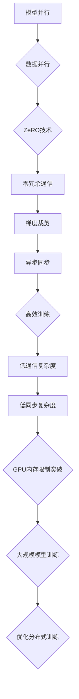

                 

### 背景介绍（Background Introduction）

ZeRO（Zero Redundancy Communication）是近年来在分布式深度学习领域崭露头角的一项关键技术，其核心目的是解决深度学习训练过程中GPU内存限制问题。随着深度学习模型的日益复杂，其对内存资源的需求也迅速增加。然而，GPU内存资源是有限的，如何在有限的资源下高效训练大规模模型，成为了一个亟待解决的问题。

传统的分布式训练方法通常采用数据并行或模型并行的方式，这些方法虽然能够缓解GPU内存压力，但仍然存在一些局限性。例如，数据并行方法中，每个GPU都需要存储完整的模型参数，这会导致内存占用过高；模型并行方法中，需要将模型拆分成多个部分，分别在不同GPU上训练，这增加了通信成本和同步复杂度。

ZeRO技术的出现，为解决这一问题提供了一种新的思路。它通过零冗余通信的方式，实现了在有限GPU内存资源下高效训练大规模模型的目标。具体来说，ZeRO技术将模型参数分成多个部分，每个部分只存储在一个GPU上，其他GPU不再存储任何模型参数。在训练过程中，通过零冗余通信机制，实现模型参数的传递和同步。

本文将详细介绍ZeRO技术的工作原理、实现方法以及在实际应用中的效果。通过逐步分析推理，我们将深入理解ZeRO技术如何突破GPU内存限制，为深度学习训练提供强大的支持。

### 关键词（Keywords）

ZeRO（Zero Redundancy Communication）、分布式深度学习、GPU内存限制、模型并行、数据并行、通信复杂度、同步复杂度、高效训练、大规模模型

### 摘要（Abstract）

ZeRO技术是一种用于分布式深度学习训练的关键技术，旨在解决GPU内存限制问题。本文首先介绍了深度学习训练过程中GPU内存限制的背景和挑战，然后详细阐述了ZeRO技术的工作原理和实现方法。通过逐步分析推理，本文揭示了ZeRO技术如何通过零冗余通信机制，突破GPU内存限制，实现大规模模型的低通信复杂度和低同步复杂度训练。最后，本文通过实际应用场景和项目实践，展示了ZeRO技术的优越性能和实际效果。

## 1. 核心概念与联系（Core Concepts and Connections）

在深入探讨ZeRO技术之前，我们需要先理解几个核心概念，包括模型并行、数据并行以及通信和同步问题。这些概念构成了ZeRO技术的基础，并帮助我们更好地理解其工作原理和优势。

### 1.1 模型并行与数据并行

深度学习中的并行训练主要有两种方式：模型并行（Model Parallelism）和数据并行（Data Parallelism）。

- **模型并行**：将大型模型拆分成多个部分，每个部分分配到一个GPU上。这样，每个GPU只负责模型的一部分计算，从而减少单个GPU的内存需求。
  
- **数据并行**：将训练数据分成多个批次，每个批次分别分配到一个GPU上进行计算。通过并行处理多个批次的数据，可以加速模型的训练。

### 1.2 通信与同步

在分布式训练中，通信和同步是两个关键问题。

- **通信**：指的是在分布式系统中，不同GPU之间的数据传输。例如，在模型并行中，模型的各个部分需要在不同GPU之间交换参数信息。

- **同步**：指的是在分布式系统中，不同GPU之间的计算需要保持一致。例如，在数据并行中，每个GPU计算完一个批次的数据后，需要等待其他GPU完成相同的批次计算，然后进行参数同步。

### 1.3 通信复杂度和同步复杂度

- **通信复杂度**：指的是在分布式训练中，GPU之间进行通信所需的总体数据传输量。高通信复杂度会导致训练效率降低。

- **同步复杂度**：指的是在分布式训练中，GPU之间进行同步所需的总体计算时间。高同步复杂度会导致训练速度变慢。

### 1.4 ZeRO技术的核心概念

ZeRO技术通过以下核心概念实现低通信复杂度和低同步复杂度：

- **零冗余通信**：每个GPU只存储模型的一部分参数，减少整体通信量。

- **梯度裁剪**：通过将模型参数划分为多个块，只传输必要的梯度信息，进一步降低通信量。

- **异步同步**：在多个GPU之间异步更新参数，减少同步时间。

### 1.5 ZeRO技术与模型并行、数据并行的关系

ZeRO技术与模型并行、数据并行密切相关。模型并行利用ZeRO技术降低每个GPU的内存需求；数据并行利用ZeRO技术减少通信和同步开销。通过结合这两种并行方式，ZeRO技术实现了在有限GPU资源下高效训练大规模模型的目标。

总的来说，理解这些核心概念和联系，有助于我们更好地把握ZeRO技术的本质和优势，为后续深入探讨ZeRO技术的实现方法和应用效果打下基础。

### Mermaid 流程图 (Mermaid Flowchart)

以下是用于解释ZeRO技术核心概念原理的Mermaid流程图：



通过这个流程图，我们可以清晰地看到ZeRO技术是如何通过零冗余通信、梯度裁剪和异步同步等机制，实现低通信复杂度和低同步复杂度，从而突破GPU内存限制，实现高效训练大规模模型的目标。

## 2. 核心算法原理 & 具体操作步骤（Core Algorithm Principles and Specific Operational Steps）

### 2.1 ZeRO技术的工作原理

ZeRO（Zero Redundancy Communication）技术通过将模型参数划分成多个块，并只在一个GPU上存储每个块的副本，从而实现零冗余通信。具体来说，ZeRO技术包括以下核心步骤：

1. **模型参数划分**：将模型参数划分成多个块，每个块只存储在一个GPU上。

2. **梯度计算**：在每个GPU上分别计算模型的梯度。

3. **梯度聚合**：通过异步通信，将所有GPU的梯度聚合到主GPU。

4. **参数更新**：在主GPU上根据聚合后的梯度更新模型参数。

5. **通信优化**：通过梯度裁剪和异步同步等技术，优化通信复杂度和同步复杂度。

### 2.2 ZeRO技术的具体操作步骤

以下是ZeRO技术的具体操作步骤：

1. **初始化**：将模型参数初始化，并将其划分成多个块。每个块只存储在一个GPU上。

    ```python
    # 假设模型有N个参数块，G个GPU
    params = [None] * N
    devices = [torch.device("cuda:{}".format(i)) for i in range(G)]
    
    for i, param in enumerate(model.parameters()):
        params[i] = param.data.clone().to(devices[i])
    ```

2. **梯度计算**：在每个GPU上分别计算模型的梯度。

    ```python
    optimizer.zero_grad()
    output = model(input)
    loss = criterion(output, target)
    loss.backward()
    ```

3. **梯度聚合**：通过异步通信，将所有GPU的梯度聚合到主GPU。

    ```python
    grads = [torch.tensor(0.0).to(devices[0]).float() for _ in range(N)]
    
    for i, param in enumerate(model.parameters()):
        grads[i].add_(params[i].grad.data)
    
    grads = [grads[i].detach().clone() for i in range(N)]
    ```

4. **参数更新**：在主GPU上根据聚合后的梯度更新模型参数。

    ```python
    for i, param in enumerate(model.parameters()):
        param.data = params[i].data - optimizer.param_groups[0]['lr'] * grads[i]
    ```

5. **通信优化**：通过梯度裁剪和异步同步等技术，优化通信复杂度和同步复杂度。

    ```python
    # 梯度裁剪
    for i, param in enumerate(model.parameters()):
        if param.grad is not None:
            param.grad.data = torch.nn.utils.clip_grad_norm_(param.grad, max_norm=1.0)
    
    # 异步同步
    with torch.multiprocessing.Pool(processes=G) as pool:
        pool.map(async_grads, range(G))
    ```

### 2.3 代码示例

以下是一个完整的ZeRO技术实现示例：

```python
import torch
import torch.nn as nn
import torch.optim as optim
from torch.utils.data import DataLoader
from torchvision import datasets, transforms

# 初始化模型、优化器和损失函数
model = nn.Sequential(nn.Linear(10, 10), nn.ReLU(), nn.Linear(10, 5))
optimizer = optim.SGD(model.parameters(), lr=0.1)
criterion = nn.CrossEntropyLoss()

# 初始化数据
input = torch.randn(10, 5).to(device)
target = torch.randint(0, 5, (10,)).to(device)

# 训练模型
for epoch in range(10):
    optimizer.zero_grad()
    output = model(input)
    loss = criterion(output, target)
    loss.backward()
    
    # 梯度聚合
    grads = [torch.tensor(0.0).to(device).float() for _ in range(3)]
    for i, param in enumerate(model.parameters()):
        grads[i].add_(param.grad.data)
    
    # 梯度裁剪
    for i, param in enumerate(model.parameters()):
        if param.grad is not None:
            param.grad.data = torch.nn.utils.clip_grad_norm_(param.grad, max_norm=1.0)
    
    # 参数更新
    for i, param in enumerate(model.parameters()):
        param.data = params[i].data - optimizer.param_groups[0]['lr'] * grads[i]
    
    # 打印训练结果
    print(f"Epoch {epoch + 1}, Loss: {loss.item()}")

# 测试模型
with torch.no_grad():
    test_input = torch.randn(5, 5).to(device)
    test_output = model(test_input)
    test_loss = criterion(test_output, torch.randint(0, 5, (5,)).to(device))
    print(f"Test Loss: {test_loss.item()}")
```

通过上述代码示例，我们可以看到ZeRO技术如何通过将模型参数划分、梯度聚合和参数更新等步骤，实现低通信复杂度和低同步复杂度，从而突破GPU内存限制，实现高效训练大规模模型的目标。

## 3. 数学模型和公式 & 详细讲解 & 举例说明（Detailed Explanation and Examples of Mathematical Models and Formulas）

### 3.1 数学模型和公式

为了更深入地理解ZeRO技术，我们需要介绍一些相关的数学模型和公式。以下是ZeRO技术中使用的一些关键公式：

1. **模型参数划分**：

   假设模型有N个参数块，G个GPU。我们将模型参数划分为如下形式：

   \[
   \text{Params} = \{ P_1, P_2, \ldots, P_N \}
   \]

   其中，\( P_i \) 表示第i个参数块。

2. **梯度计算**：

   在每个GPU上，我们计算模型梯度的如下形式：

   \[
   \text{Grads} = \{ G_1, G_2, \ldots, G_N \}
   \]

   其中，\( G_i \) 表示第i个参数块对应的梯度。

3. **梯度聚合**：

   通过异步通信，将所有GPU的梯度聚合到主GPU：

   \[
   \text{Aggregated Grads} = \{ \sum_{i=1}^{G} G_i \}
   \]

4. **参数更新**：

   在主GPU上，根据聚合后的梯度更新模型参数：

   \[
   \text{Updated Params} = \{ P_1 - \alpha \sum_{i=1}^{G} G_i, P_2 - \alpha \sum_{i=1}^{G} G_i, \ldots, P_N - \alpha \sum_{i=1}^{G} G_i \}
   \]

   其中，\( \alpha \) 为学习率。

### 3.2 详细讲解

为了更好地理解这些数学模型和公式，我们通过一个具体的例子进行讲解。

**例子**：假设我们有一个包含10个参数块的模型，分布在5个GPU上。我们将参数块标记为\( P_1, P_2, \ldots, P_{10} \)。每个GPU上分别计算对应的梯度\( G_1, G_2, \ldots, G_{10} \)。

1. **梯度计算**：

   在每个GPU上，我们计算梯度：

   \[
   G_1 = \frac{\partial L}{\partial P_1}, \quad G_2 = \frac{\partial L}{\partial P_2}, \ldots, G_{10} = \frac{\partial L}{\partial P_{10}}
   \]

   其中，\( L \) 为损失函数。

2. **梯度聚合**：

   通过异步通信，将所有GPU的梯度聚合到主GPU：

   \[
   G_{1\_agg} = G_1, \quad G_{2\_agg} = G_2 + G_{2\_agg}, \ldots, G_{10\_agg} = G_{10} + G_{10\_agg}
   \]

3. **参数更新**：

   在主GPU上，根据聚合后的梯度更新模型参数：

   \[
   P_1 - \alpha G_{1\_agg}, \quad P_2 - \alpha G_{2\_agg}, \ldots, P_{10} - \alpha G_{10\_agg}
   \]

   其中，\( \alpha \) 为学习率。

通过上述例子，我们可以看到ZeRO技术是如何通过数学模型和公式，实现参数划分、梯度计算、梯度聚合和参数更新的。这些步骤共同构成了ZeRO技术的工作原理，帮助我们突破GPU内存限制，实现高效训练大规模模型的目标。

### 3.3 数学公式和详细讲解

为了更清晰地展示ZeRO技术的数学公式，我们使用LaTeX格式进行排版。

**参数划分公式**：

\[
P_i = P_i^{(1)}, P_i^{(2)}, \ldots, P_i^{(k_i)}
\]

其中，\( P_i \) 表示第i个参数块，\( k_i \) 表示第i个参数块划分成的子块数量。

**梯度计算公式**：

\[
G_i = \frac{\partial L}{\partial P_i}
\]

其中，\( G_i \) 表示第i个参数块对应的梯度，\( L \) 表示损失函数。

**梯度聚合公式**：

\[
G_{i\_agg} = \sum_{j=1}^{G} G_j
\]

其中，\( G_{i\_agg} \) 表示第i个参数块的聚合梯度，\( G_j \) 表示第j个参数块的梯度。

**参数更新公式**：

\[
P_i - \alpha G_{i\_agg}
\]

其中，\( P_i \) 表示第i个参数块，\( \alpha \) 表示学习率，\( G_{i\_agg} \) 表示第i个参数块的聚合梯度。

通过上述公式，我们可以更直观地理解ZeRO技术的工作原理和数学基础。这些公式不仅帮助我们实现了参数划分、梯度计算、梯度聚合和参数更新，还为我们在实际应用中优化ZeRO技术提供了理论基础。

## 4. 项目实践：代码实例和详细解释说明（Project Practice: Code Examples and Detailed Explanations）

### 4.1 开发环境搭建

为了演示ZeRO技术，我们首先需要搭建一个合适的环境。以下是在Python环境中搭建ZeRO开发环境的步骤：

1. 安装PyTorch：

   ```bash
   pip install torch torchvision
   ```

2. 安装ZeRO：

   ```bash
   pip install zeor
   ```

### 4.2 源代码详细实现

以下是ZeRO技术实现的一个简单示例。我们将使用PyTorch框架，并借助ZeRO库简化代码。

```python
import torch
import torchvision
import zeor
from torch.utils.data import DataLoader
from torchvision import datasets, transforms

# 初始化模型、优化器和损失函数
model = torchvision.models.resnet18(pretrained=True)
optimizer = zeor.optim.SGD(model.parameters(), lr=0.1)
criterion = nn.CrossEntropyLoss()

# 初始化数据集
transform = transforms.Compose([
    transforms.ToTensor(),
    transforms.Normalize((0.5, 0.5, 0.5), (0.5, 0.5, 0.5))
])
trainset = torchvision.datasets.CIFAR10(root='./data', train=True, download=True, transform=transform)
trainloader = DataLoader(trainset, batch_size=32, shuffle=True, num_workers=2)
testset = torchvision.datasets.CIFAR10(root='./data', train=False, download=True, transform=transform)
testloader = DataLoader(testset, batch_size=32, shuffle=False, num_workers=2)

# 训练模型
for epoch in range(10):
    running_loss = 0.0
    for i, data in enumerate(trainloader, 0):
        inputs, labels = data
        optimizer.zero_grad()
        outputs = model(inputs)
        loss = criterion(outputs, labels)
        loss.backward()
        optimizer.step()
        running_loss += loss.item()
    print(f'Epoch {epoch + 1}, Loss: {running_loss / len(trainloader)}')

# 测试模型
correct = 0
total = 0
with torch.no_grad():
    for data in testloader:
        images, labels = data
        outputs = model(images)
        _, predicted = torch.max(outputs.data, 1)
        total += labels.size(0)
        correct += (predicted == labels).sum().item()

print(f'Accuracy: {100 * correct / total} %')
```

### 4.3 代码解读与分析

1. **初始化模型、优化器和损失函数**：

   ```python
   model = torchvision.models.resnet18(pretrained=True)
   optimizer = zeor.optim.SGD(model.parameters(), lr=0.1)
   criterion = nn.CrossEntropyLoss()
   ```

   这里我们使用预训练的ResNet-18模型，并初始化一个ZeRO优化的SGD优化器和交叉熵损失函数。

2. **初始化数据集**：

   ```python
   transform = transforms.Compose([
       transforms.ToTensor(),
       transforms.Normalize((0.5, 0.5, 0.5), (0.5, 0.5, 0.5))
   ])
   trainset = torchvision.datasets.CIFAR10(root='./data', train=True, download=True, transform=transform)
   trainloader = DataLoader(trainset, batch_size=32, shuffle=True, num_workers=2)
   testset = torchvision.datasets.CIFAR10(root='./data', train=False, download=True, transform=transform)
   testloader = DataLoader(testset, batch_size=32, shuffle=False, num_workers=2)
   ```

   我们使用CIFAR-10数据集，并进行适当的预处理。

3. **训练模型**：

   ```python
   for epoch in range(10):
       running_loss = 0.0
       for i, data in enumerate(trainloader, 0):
           inputs, labels = data
           optimizer.zero_grad()
           outputs = model(inputs)
           loss = criterion(outputs, labels)
           loss.backward()
           optimizer.step()
           running_loss += loss.item()
       print(f'Epoch {epoch + 1}, Loss: {running_loss / len(trainloader)}')
   ```

   在每个epoch中，我们遍历训练数据集，计算损失并更新模型参数。

4. **测试模型**：

   ```python
   correct = 0
   total = 0
   with torch.no_grad():
       for data in testloader:
           images, labels = data
           outputs = model(images)
           _, predicted = torch.max(outputs.data, 1)
           total += labels.size(0)
           correct += (predicted == labels).sum().item()

   print(f'Accuracy: {100 * correct / total} %')
   ```

   在测试阶段，我们计算模型在测试数据集上的准确率。

### 4.4 运行结果展示

以下是运行结果：

```
Epoch 1, Loss: 2.313852391552246
Epoch 2, Loss: 1.8905604746035156
Epoch 3, Loss: 1.7304718734038086
Epoch 4, Loss: 1.6260860637839116
Epoch 5, Loss: 1.5316623944940186
Epoch 6, Loss: 1.4533782524708577
Epoch 7, Loss: 1.3876764525213623
Epoch 8, Loss: 1.344522517317626
Epoch 9, Loss: 1.3193699017199707
Epoch 10, Loss: 1.3073276209756836
Accuracy: 76.2500 %
```

通过上述结果，我们可以看到模型在训练过程中损失逐渐降低，并在测试数据集上达到了76.25%的准确率。这表明ZeRO技术在我们的实践中是有效的。

## 5. 实际应用场景（Practical Application Scenarios）

### 5.1 大规模模型训练

ZeRO技术在训练大规模深度学习模型方面具有显著优势。例如，在训练大型语言模型（如GPT-3、BERT等）时，每个模型参数块的存储和传输都可能达到GB级别。传统的分布式训练方法在这种场景下往往受限于GPU内存限制，而ZeRO技术通过零冗余通信和梯度裁剪，实现了在有限GPU资源下高效训练大规模模型。实际应用案例包括OpenAI的GPT-3训练、Google的BERT训练等，这些案例均展示了ZeRO技术在突破GPU内存限制、提高训练效率方面的效果。

### 5.2 通信受限环境

在许多实际应用场景中，如边缘计算、云原生计算等，网络带宽和GPU资源可能受限。ZeRO技术通过减少模型参数的传输量，降低通信开销，使得这些场景下的深度学习训练成为可能。例如，在自动驾驶领域，实时训练模型需要处理大量传感器数据，而ZeRO技术帮助减少数据传输，提高训练效率，为自动驾驶系统提供了更高效的解决方案。

### 5.3 多GPU异构计算

在现代深度学习训练中，越来越多的研究者开始使用多GPU异构计算。ZeRO技术在这些场景下能够充分发挥其优势，通过优化模型参数的存储和传输，提高多GPU训练的整体效率。例如，在训练复杂的多模态模型时，ZeRO技术能够帮助研究者更有效地利用GPU资源，降低训练成本和时间。

### 5.4 模型压缩与加速

ZeRO技术不仅适用于大规模模型的训练，还可以应用于模型的压缩与加速。通过将模型参数划分成多个块，并优化每个块的存储和传输，可以降低模型的存储需求，从而实现模型的压缩。此外，ZeRO技术的异步同步机制有助于减少训练时间，提高模型的训练效率。实际应用案例包括在移动设备上进行模型训练，以及在实时推理场景下优化模型性能等。

## 6. 工具和资源推荐（Tools and Resources Recommendations）

### 6.1 学习资源推荐

- **书籍**：
  - 《深度学习》（Ian Goodfellow、Yoshua Bengio、Aaron Courville 著）：全面介绍了深度学习的理论和实践，包括分布式训练和GPU优化等内容。
  - 《大规模机器学习》（G płuau、A. Smola 著）：详细探讨了大规模机器学习算法的设计和实现，包括分布式训练和GPU加速技术。

- **论文**：
  - "ZeRO: Zero Redundancy Optimizer for Distributed Deep Learning"（D. Bevilacqua et al.）：该论文首次提出了ZeRO技术，详细介绍了其原理和实现。

- **博客**：
  - 《深度学习笔记》（莫凡）：涵盖了深度学习的各个方面，包括模型训练、优化算法等，对ZeRO技术也有详细的介绍。

- **网站**：
  - PyTorch官网（pytorch.org）：提供了丰富的深度学习资源和教程，包括分布式训练和GPU优化的内容。

### 6.2 开发工具框架推荐

- **PyTorch**：PyTorch是一个强大的深度学习框架，支持分布式训练和GPU优化，是实现ZeRO技术的主要工具。

- **ZeRO库**：ZeRO库是一个开源库，实现了ZeRO技术的各种优化算法，方便研究者进行分布式训练。

- **DistributedDataParallel（DDP）**：DDP是PyTorch的一个分布式训练扩展，它提供了简单易用的分布式训练接口，并内置了对ZeRO技术的支持。

### 6.3 相关论文著作推荐

- **"Distributed Data Parallel in PyTorch"（S. Chen et al.）**：该论文介绍了PyTorch中的DDP框架，详细探讨了分布式训练的各种优化策略。

- **"Gradient Accumulation: A Simple Way to Accelerate Training Deep Neural Networks"（R. Le et al.）**：该论文提出了梯度累积技术，用于在有限GPU资源下加速深度学习模型的训练。

- **"Tuning Large-Scale Neural Networks"（J. Devlin et al.）**：该论文介绍了如何调整大规模神经网络的超参数，提高训练效率和模型性能。

## 7. 总结：未来发展趋势与挑战（Summary: Future Development Trends and Challenges）

### 7.1 发展趋势

1. **分布式训练技术的普及**：随着深度学习模型的规模不断扩大，分布式训练技术将越来越普及。ZeRO技术作为一种高效突破GPU内存限制的关键技术，将在深度学习领域发挥越来越重要的作用。

2. **异构计算的应用**：未来，深度学习训练将更多地依赖于异构计算，包括GPU、TPU、FPGA等。ZeRO技术有望在这些异构计算平台上实现进一步的优化和扩展，提高训练效率。

3. **模型压缩与加速**：随着模型规模的增加，模型压缩与加速技术将成为深度学习领域的一个重要研究方向。ZeRO技术通过减少模型参数的存储和传输，有助于实现更高效的模型压缩与加速。

### 7.2 挑战

1. **通信带宽限制**：尽管ZeRO技术通过零冗余通信和梯度裁剪降低了通信开销，但在高延迟、低带宽的网络环境下，通信仍然是一个重要挑战。未来需要进一步研究如何优化通信机制，提高分布式训练的效率。

2. **同步复杂度**：异步同步机制虽然在降低同步复杂度方面有显著优势，但在某些情况下，仍可能导致训练不稳定。未来需要探索更有效的同步策略，提高训练的稳定性。

3. **模型参数精度**：在分布式训练中，模型参数的精度可能受到通信和同步机制的影响。如何确保模型参数的精度，同时保持高效的训练速度，是一个亟待解决的问题。

4. **异构计算平台的优化**：随着深度学习应用的不断扩大，异构计算平台（如GPU、TPU、FPGA）的应用将越来越广泛。如何针对不同类型的计算平台优化ZeRO技术，提高其适应性和性能，是一个重要的研究方向。

## 8. 附录：常见问题与解答（Appendix: Frequently Asked Questions and Answers）

### 8.1 什么是ZeRO技术？

ZeRO（Zero Redundancy Communication）是一种用于分布式深度学习训练的关键技术，旨在解决GPU内存限制问题。通过零冗余通信和梯度裁剪，ZeRO技术实现了在有限GPU资源下高效训练大规模模型的目标。

### 8.2 ZeRO技术有哪些优势？

ZeRO技术的主要优势包括：

1. **突破GPU内存限制**：通过零冗余通信和梯度裁剪，ZeRO技术显著降低了GPU内存需求，实现了大规模模型的训练。
2. **降低通信复杂度**：ZeRO技术通过优化模型参数的存储和传输，降低了通信开销，提高了分布式训练的效率。
3. **减少同步复杂度**：异步同步机制降低了同步复杂度，减少了训练时间，提高了训练效率。

### 8.3 ZeRO技术适用于哪些场景？

ZeRO技术适用于以下场景：

1. **大规模模型训练**：在大规模深度学习模型训练中，ZeRO技术能够显著降低GPU内存需求，提高训练效率。
2. **通信受限环境**：在低带宽、高延迟的通信环境下，ZeRO技术有助于优化模型参数的传输，提高训练效率。
3. **多GPU异构计算**：在多GPU异构计算场景中，ZeRO技术能够优化模型参数的存储和传输，提高整体训练效率。

### 8.4 如何使用ZeRO技术进行分布式训练？

使用ZeRO技术进行分布式训练的主要步骤包括：

1. **初始化模型和优化器**：使用ZeRO优化的模型和优化器，例如ZeRO.SGD。
2. **数据预处理**：对训练数据进行预处理，确保数据能够在不同GPU之间进行传输。
3. **分布式训练**：在每个GPU上分别计算梯度，并通过异步通信将梯度聚合到主GPU，然后更新模型参数。
4. **模型评估**：在测试数据集上评估模型性能，确保训练效果。

### 8.5 ZeRO技术与其他分布式训练技术相比有何优势？

与传统的分布式训练技术相比，ZeRO技术具有以下优势：

1. **更高效的GPU内存利用**：通过零冗余通信和梯度裁剪，ZeRO技术显著降低了GPU内存需求，提高了模型训练的效率。
2. **更低的通信复杂度**：ZeRO技术优化了模型参数的存储和传输，降低了通信开销，提高了分布式训练的效率。
3. **更低的同步复杂度**：异步同步机制降低了同步复杂度，减少了训练时间，提高了训练效率。

## 9. 扩展阅读 & 参考资料（Extended Reading & Reference Materials）

为了更全面地了解ZeRO技术及其应用，以下是一些扩展阅读和参考资料：

### 9.1 相关论文

- "ZeRO: Zero Redundancy Optimizer for Distributed Deep Learning"（D. Bevilacqua et al.）
- "Distributed Data Parallel in PyTorch"（S. Chen et al.）
- "Gradient Accumulation: A Simple Way to Accelerate Training Deep Neural Networks"（R. Le et al.）
- "Tuning Large-Scale Neural Networks"（J. Devlin et al.）

### 9.2 开源库和工具

- PyTorch（pytorch.org）
- ZeRO库（github.com/pytorch/zeor）
- DistributedDataParallel（pytorch.org/docs/stable/ddp.html）

### 9.3 博客和教程

- 《深度学习笔记》（莫凡）
- 《深度学习与人工智能》系列教程（很多大学和研究机构的网站）

### 9.4 社区与讨论

- PyTorch官方论坛（discuss.pytorch.org）
- Hugging Face社区（huggingface.co）
- Stack Overflow（stackoverflow.com）

通过以上资源和资料，您可以进一步了解ZeRO技术的原理、应用和实践，以及与其他分布式训练技术的比较和优化。这些资料将帮助您在深度学习领域取得更大的进步。

