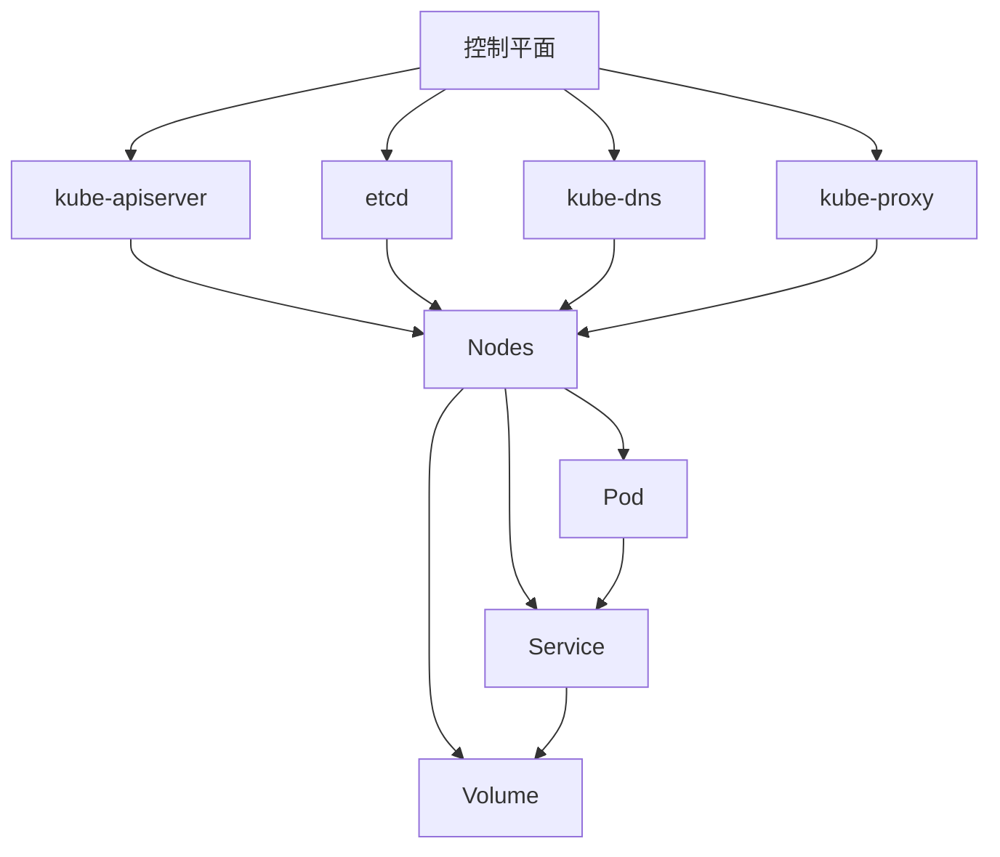

                 

## Kubernetes集群高可用部署方案

> 关键词：Kubernetes, 高可用, 集群部署, 容器编排, 服务发现, 自动扩缩容, 容器存储

## 1. 背景介绍

在当今的云原生应用架构中，Kubernetes（K8s）已经成为容器编排和管理的事实标准。然而，构建一个高可用的Kubernetes集群并非易事，需要考虑多个维度，包括集群节点的高可用、服务发现和负载均衡、自动扩缩容、容器存储等。本文将详细介绍如何构建一个高可用的Kubernetes集群，并提供实践指南和工具推荐。

## 2. 核心概念与联系

### 2.1 Kubernetes核心概念

Kubernetes是一个开源的容器编排平台，它提供了容器的自动部署、扩缩容、滚动更新和服务发现等功能。其核心组件包括：

- **控制平面（Control Plane）**：包含kube-apiserver、etcd、kube-dns、kube-proxy等组件，负责集群的控制和管理。
- **节点（Nodes）**：运行用户应用的主机，包含kubelet、kube-proxy、container runtime（如Docker或 containerd）等组件。
- **Pod**：最小的Kubernetes工作单位，包含一个或多个容器，共享存储和网络。
- **Service**：提供内部或外部的网络访问，实现服务发现和负载均衡。
- **Volume**：提供容器存储，可以是本地存储、网络存储或云存储。

### 2.2 Kubernetes高可用架构


上图展示了一个高可用的Kubernetes集群架构。控制平面组件部署在多个主机上，实现了冗余和故障转移。节点组成了一个池，可以动态扩缩容。Pod和Service提供了应用的运行环境和网络访问。Volume提供了容器存储。

### 2.3 Mermaid流程图



## 3. 核心算法原理 & 具体操作步骤

### 3.1 算法原理概述

Kubernetes使用控制器（Controller）模式来实现自动化管理。控制器监控集群状态，并根据期望状态（Desired State）和实际状态（Current State）的差异，触发相应的操作来修正偏差。常见的控制器包括ReplicationController、Deployment、Horizontal Pod Autoscaler等。

### 3.2 算法步骤详解

1. **集群初始化**：安装和配置Kubernetes控制平面组件，并加入节点。
2. **应用部署**：创建Deployment资源，指定期望的Pod数量和镜像。
3. **服务发现**：创建Service资源，提供内部或外部的网络访问。
4. **自动扩缩容**：创建Horizontal Pod Autoscaler资源，根据CPU利用率动态调整Pod数量。
5. **存储配置**：创建PersistentVolumeClaim资源，挂载容器存储。

### 3.3 算法优缺点

**优点**：

- 自动化管理，降低运维成本。
- 扩缩容灵活，应对流量变化。
- 服务发现和负载均衡，提高应用可用性。

**缺点**：

- 学习曲线陡峭，需要一定的专业知识。
- 部署和维护复杂，需要一定的运维经验。
- 资源消耗较大，需要合理配置。

### 3.4 算法应用领域

Kubernetes适用于各种云原生应用，包括：

- 微服务架构：每个服务部署为一个Pod，使用Service实现服务发现和负载均衡。
- 周期性任务：使用Job或CronJob资源定时执行任务。
- 数据库：使用StatefulSet资源部署有状态应用，并配置持久化存储。

## 4. 数学模型和公式 & 详细讲解 & 举例说明

### 4.1 数学模型构建

Kubernetes使用控制论模型来实现自动化管理。控制器根据期望状态（Desired State）和实际状态（Current State）的差异，触发相应的操作来修正偏差。数学模型可以表示为：

$$e(t) = r(t) - y(t)$$

其中，$e(t)$为偏差，$r(t)$为期望状态，$y(t)$为实际状态。

### 4.2 公式推导过程

控制器根据偏差触发相应的操作，以修正偏差。控制器的响应时间和稳定性取决于控制参数的选择。常见的控制参数包括P（比例）、I（积分）、D（微分），组成PI、PD、PID控制器。

### 4.3 案例分析与讲解

例如，Horizontal Pod Autoscaler控制器根据CPU利用率动态调整Pod数量。其控制参数包括：

- `cpu-percent`：触发扩缩容的CPU利用率阈值。
- `min-pods`：最小Pod数量。
- `max-pods`：最大Pod数量。
- `scale-up`：扩容步长。
- `scale-down`：缩容步长。

通过调整这些参数，可以平滑应对流量变化，并防止过度扩缩容。

## 5. 项目实践：代码实例和详细解释说明

### 5.1 开发环境搭建

本文使用Minikube搭建单节点Kubernetes集群，并使用kubectl命令行工具进行操作。Minikube可以在本地虚拟机或Docker中运行，并提供了Kubernetes控制平面和一个节点。

### 5.2 源代码详细实现

以下是部署一个简单的Nginx应用的示例：

1. 创建Deployment资源：

```yaml
apiVersion: apps/v1
kind: Deployment
metadata:
  name: nginx-deployment
spec:
  replicas: 3
  selector:
    matchLabels:
      app: nginx
  template:
    metadata:
      labels:
        app: nginx
    spec:
      containers:
      - name: nginx
        image: nginx:1.16
        ports:
        - containerPort: 80
```

2. 创建Service资源：

```yaml
apiVersion: v1
kind: Service
metadata:
  name: nginx-service
spec:
  selector:
    app: nginx
  ports:
    - protocol: TCP
      port: 80
      targetPort: 80
  type: LoadBalancer
```

3. 创建Horizontal Pod Autoscaler资源：

```yaml
apiVersion: autoscaling/v1
kind: HorizontalPodAutoscaler
metadata:
  name: nginx-hpa
spec:
  scaleTargetRef:
    apiVersion: apps/v1
    kind: Deployment
    name: nginx-deployment
  minReplicas: 1
  maxReplicas: 10
  targetCPUUtilizationPercentage: 50
```

### 5.3 代码解读与分析

- Deployment资源指定了期望的Pod数量（3个）和镜像（nginx:1.16），并配置了Pod的标签和端口。
- Service资源提供了内部和外部的网络访问，并配置了端口映射。
- Horizontal Pod Autoscaler资源根据CPU利用率动态调整Pod数量，并设置了最小和最大Pod数量。

### 5.4 运行结果展示

部署应用后，可以使用kubectl命令行工具查看Pod、Service和Horizontal Pod Autoscaler资源的状态。例如：

```bash
kubectl get pods
kubectl get services
kubectl get hpa
```

## 6. 实际应用场景

### 6.1 电商平台

电商平台需要应对突发流量，Kubernetes可以动态扩缩容应用，平滑应对流量变化。此外，Kubernetes还可以实现服务发现和负载均衡，提高应用可用性。

### 6.2 金融行业

金融行业对系统可用性和稳定性要求很高，Kubernetes可以实现高可用集群部署，并提供故障转移和自动修复功能。此外，Kubernetes还可以实现容器存储，保证数据持久化。

### 6.3 未来应用展望

未来，Kubernetes将继续发展，并与其他云原生技术集成，提供更丰富的功能和更好的用户体验。例如，Kubernetes可以与Service Mesh（如Istio）集成，提供更细粒度的流量控制和观察性能。此外，Kubernetes还可以与云原生存储（如Ceph或Rook）集成，提供更灵活的容器存储解决方案。

## 7. 工具和资源推荐

### 7.1 学习资源推荐

- [Kubernetes官方文档](https://kubernetes.io/docs/home/)
- [Kubernetes中文文档](https://www.kubernetes.org.cn/)
- [Kubernetes Best Practices](https://github.com/kubernetes/community/blob/master/contributors/guide/best-practices.md)
- [Kubernetes The Book](https://www.kubernetes-the-book.com/)

### 7.2 开发工具推荐

- [Minikube](https://minikube.sigs.k8s.io/docs/start/)：本地Kubernetes集群开发环境。
- [kubectl](https://kubernetes.io/docs/reference/generated/kubectl/kubectl-commands)：Kubernetes命令行工具。
- [Helm](https://helm.sh/)：Kubernetes包管理器。
- [Kubeadm](https://kubernetes.io/docs/setup/production-environment/tools/kubeadm/create-cluster-kubeadm/)：Kubernetes集群部署工具。

### 7.3 相关论文推荐

- [Borg, Omega, and Kubernetes: Borg Background and Motivation](https://research.google/pubs/pub43438/)
- [Kubernetes: Google's Container Orchestration System](https://research.google/pubs/pub43439/)
- [Kubernetes: A Decade of Container Orchestration](https://arxiv.org/abs/2004.04047)

## 8. 总结：未来发展趋势与挑战

### 8.1 研究成果总结

本文介绍了Kubernetes集群高可用部署方案，包括核心概念、算法原理、数学模型、项目实践和实际应用场景。通过实践指南和工具推荐，读者可以构建和管理高可用的Kubernetes集群。

### 8.2 未来发展趋势

未来，Kubernetes将继续发展，并与其他云原生技术集成，提供更丰富的功能和更好的用户体验。此外，Kubernetes还将与边缘计算和物联网等领域结合，提供更广泛的应用。

### 8.3 面临的挑战

然而，Kubernetes也面临着挑战，包括：

- **复杂性**：Kubernetes学习曲线陡峭，需要一定的专业知识和运维经验。
- **资源消耗**：Kubernetes资源消耗较大，需要合理配置。
- **安全性**：Kubernetes需要保护集群和应用免受攻击，需要合理配置安全策略。

### 8.4 研究展望

未来的研究方向包括：

- **多云和多集群管理**：提供更好的跨云和跨集群管理工具。
- **服务网格**：与服务网格（如Istio）集成，提供更细粒度的流量控制和观察性能。
- **容器存储**：与云原生存储（如Ceph或Rook）集成，提供更灵活的容器存储解决方案。

## 9. 附录：常见问题与解答

**Q：如何部署高可用的Kubernetes控制平面？**

A：部署多个kube-apiserver、etcd和kube-dns实例，并配置故障转移和负载均衡。

**Q：如何实现自动扩缩容？**

A：使用Horizontal Pod Autoscaler资源根据CPU利用率动态调整Pod数量。

**Q：如何配置容器存储？**

A：使用PersistentVolumeClaim资源挂载本地存储、网络存储或云存储。

**Q：如何保证应用的可用性？**

A：使用Deployment资源部署应用，并配置期望的Pod数量。使用Service资源提供内部或外部的网络访问，并配置负载均衡。

## 作者：禅与计算机程序设计艺术 / Zen and the Art of Computer Programming

> 如果您喜欢这篇文章，请点赞并分享给更多的人。如果您有任何问题或建议，请留言告诉我。感谢阅读！

