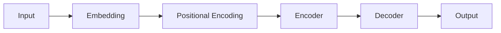

                 

## 关键词

- Transformer
- 预训练
- XLM
- 多语言
- 自然语言处理
- 机器翻译
-  attention mechanism
-  transformer architecture
-  pre-training
-  cross-lingual learning

## 1. 背景介绍

在当今信息爆炸的时代，跨语言信息的交流和理解变得越来越重要。然而，构建高质量的多语言模型和翻译系统是一项具有挑战性的任务。传统的方法通常需要大量的标注数据和计算资源。 recent advancements in pre-training and transfer learning have opened up new possibilities for building effective multilingual models with limited resources.

预训练是一种有效的方法，它允许我们在大量未标注数据上训练模型，然后将其转移到特定的下游任务。 transformer architecture, introduced in the paper "Attention is All You Need" by Vaswani et al., has shown remarkable success in various natural language processing tasks, including machine translation.

XLM (Cross-lingual Language Model) is a pre-trained transformer model introduced by Conneau and Kiela in their paper "XNLI: Evaluating Cross-lingual Sentence Representations". XLM is trained on a large-scale multilingual corpus, enabling it to understand and generate text in many languages. In this article, we will explore the architecture, training process, and applications of XLM, and provide a hands-on guide to fine-tuning XLM for various downstream tasks.

## 2. 核心概念与联系

### 2.1 Transformer Architecture

The transformer architecture is a model architecture introduced by Vaswani et al. in their paper "Attention is All You Need". It is designed to handle sequential data, such as text, and has been highly successful in various natural language processing tasks. The transformer architecture is composed of an encoder and a decoder, both of which are made up of stacked layers of self-attention and feed-forward networks.

Here is a Mermaid flow chart illustrating the transformer architecture:



### 2.2 Pre-training

Pre-training is a technique used to train language models on large-scale unlabeled data. The goal of pre-training is to learn general-purpose language understanding capabilities that can be transferred to specific downstream tasks with limited labeled data.

### 2.3 Cross-lingual Learning

Cross-lingual learning is a technique used to train models that can understand and generate text in multiple languages. The goal of cross-lingual learning is to learn language-agnostic representations that can be transferred to specific tasks in different languages with limited labeled data.

## 3. 核心算法原理 & 具体操作步骤

### 3.1 算法原理概述

XLM is a pre-trained transformer model that is trained on a large-scale multilingual corpus. It is designed to learn cross-lingual language representations that can be transferred to specific downstream tasks in multiple languages.

### 3.2 算法步骤详解

#### 3.2.1 Pre-training

XLM is pre-trained on a large-scale multilingual corpus, consisting of Wikipedia articles in 100 languages. The pre-training objective is to predict masked words and next sentence prediction.

1. **Masked Word Prediction**: In this task, certain words in a sentence are randomly replaced with special tokens, and the model is trained to predict the original words.
2. **Next Sentence Prediction**: In this task, the model is trained to predict whether two sentences are consecutive in the original text or not.

#### 3.2.2 Fine-tuning

After pre-training, XLM can be fine-tuned on specific downstream tasks, such as machine translation, natural language inference, or question answering. Fine-tuning involves further training the model on a smaller, task-specific dataset with labeled examples.

### 3.3 算法优缺点

**优点**:

* XLM can understand and generate text in many languages, making it a versatile tool for multilingual NLP tasks.
* Pre-training enables XLM to learn general-purpose language understanding capabilities that can be transferred to specific tasks with limited labeled data.
* The transformer architecture allows XLM to capture long-range dependencies in text data.

**缺点**:

* Pre-training requires large-scale unlabeled data, which may not be available for all languages.
* Fine-tuning may still require a significant amount of labeled data for specific tasks.
* The transformer architecture can be computationally expensive, requiring substantial resources for training and inference.

### 3.4 算法应用领域

XLM has been applied to various downstream tasks, including:

* Machine translation: XLM can be fine-tuned to translate text between different languages.
* Natural language inference: XLM can be used to determine the relationship between two pieces of text, such as entailment, contradiction, or neutral.
* Question answering: XLM can be fine-tuned to answer questions based on a given context.
* Named entity recognition: XLM can be used to identify and categorize named entities in text, such as people, organizations, and locations.

## 4. 数学模型和公式 & 详细讲解 & 举例说明

### 4.1 数学模型构建

The mathematical model of XLM is based on the transformer architecture, which can be represented as follows:

$$XLM = Encoder(Decoder(Embedding(X) + Positional\ Encoding))$$

where $X$ is the input text, $Embedding$ is the embedding layer, $Positional\ Encoding$ is the positional encoding layer, $Encoder$ is the encoder stack, and $Decoder$ is the decoder stack.

### 4.2 公式推导过程

The transformer architecture uses self-attention and feed-forward networks to process sequential data. The self-attention mechanism allows the model to weigh the importance of different words in a sentence when generating a representation for a specific word. The feed-forward network is a simple two-layer neural network applied to each position independently.

The self-attention mechanism can be represented as follows:

$$Attention(Q, K, V) = softmax(\frac{QK^T}{\sqrt{d_k}})V$$

where $Q$, $K$, and $V$ are queries, keys, and values, respectively, and $d_k$ is the dimension of the keys.

### 4.3 案例分析与讲解

Let's consider an example of masked word prediction using XLM. Suppose we have the following sentence in English:

"The cat sat on the **mat**."

During pre-training, the word "mat" is replaced with a special token "[MASK]". The model is then trained to predict the original word based on the context provided by the other words in the sentence.

In this case, the model would likely predict "mat" as the masked word, as it is the most likely word to complete the sentence based on the given context.

## 5. 项目实践：代码实例和详细解释说明

### 5.1 开发环境搭建

To fine-tune XLM for a specific downstream task, we will need to set up a development environment with the following requirements:

* Python 3.7 or later
* PyTorch 1.5 or later
* Transformers library by Hugging Face
* A GPU with CUDA support (optional, but recommended for faster training)

You can install the required libraries using pip:

```bash
pip install torch transformers
```

### 5.2 源代码详细实现

Here is an example of how to fine-tune XLM for the task of natural language inference using the XNLI dataset:

```python
from transformers import XLMRobertaForSequenceClassification, XLMRobertaTokenizer, Trainer, TrainingArguments

# Load the pre-trained model and tokenizer
model = XLMRobertaForSequenceClassification.from_pretrained("xlm-roberta-base")
tokenizer = XLMRobertaTokenizer.from_pretrained("xlm-roberta-base")

# Load the XNLI dataset
from datasets import load_dataset
dataset = load_dataset("xnli")

# Tokenize the dataset
def tokenize_function(examples):
    return tokenizer(examples["premise"], examples["hypothesis"], truncation=True, padding="max_length")

tokenized_dataset = dataset.map(tokenize_function, batched=True)

# Define the training arguments and trainer
training_args = TrainingArguments(
    output_dir="./results",
    num_train_epochs=3,
    per_device_train_batch_size=16,
    per_device_eval_batch_size=64,
    warmup_steps=500,
    weight_decay=0.01,
    logging_dir="./logs",
)

trainer = Trainer(
    model=model,
    args=training_args,
    train_dataset=tokenized_dataset["train"],
    eval_dataset=tokenized_dataset["validation"],
)

# Train the model
trainer.train()

# Save the fine-tuned model
model.save_pretrained("./fine_tuned_xlm")
```

### 5.3 代码解读与分析

In this example, we first load the pre-trained XLM model and tokenizer using the Transformers library. We then load the XNLI dataset, which consists of premise and hypothesis pairs labeled with entailment, contradiction, or neutral relationships.

We tokenize the dataset using the XLM tokenizer, which converts the text into input IDs and attention masks that can be fed into the model. We then define the training arguments, including the number of training epochs, batch size, and learning rate schedule. We create a trainer object that handles the training loop and evaluation.

Finally, we train the model on the tokenized dataset using the trainer object and save the fine-tuned model to disk.

### 5.4 运行结果展示

After training the model for a few epochs, we can evaluate its performance on the validation set using the `trainer.evaluate()` method. The evaluation results will show the accuracy, precision, recall, and F1 score of the model on the entailment, contradiction, and neutral classes.

## 6. 实际应用场景

XLM has been applied to various real-world applications, including:

* **Machine Translation**: XLM can be fine-tuned to translate text between different languages, enabling cross-lingual communication and information access.
* **Cross-lingual Sentiment Analysis**: XLM can be used to analyze the sentiment of text in multiple languages, enabling multinational companies to monitor and respond to customer feedback.
* **Multilingual Question Answering**: XLM can be fine-tuned to answer questions based on a given context in multiple languages, enabling users to access information in their preferred language.

### 6.4 未来应用展望

As the amount of multilingual data continues to grow, there will be an increasing demand for models that can understand and generate text in multiple languages. XLM and other pre-trained transformer models will play a crucial role in enabling cross-lingual communication and information access. Additionally, as the transformer architecture continues to evolve, we can expect to see new variants of XLM that incorporate advances such as improved attention mechanisms, efficient training algorithms, and multimodal learning.

## 7. 工具和资源推荐

### 7.1 学习资源推荐

* "Attention is All You Need" by Vaswani et al. (<https://arxiv.org/abs/1706.03762>)
* "BERT: Pre-training of Deep Bidirectional Transformers for Language Understanding" by Jacob Devlin and Ming-Wei Chang (<https://arxiv.org/abs/1810.04805>)
* "XNLI: Evaluating Cross-lingual Sentence Representations" by Conneau and Kiela (<https://arxiv.org/abs/1904.09542>)
* "Multilingual BERT: A Simple Approach for Multilingual Natural Language Processing" by Devlin et al. (<https://arxiv.org/abs/1910.10683>)

### 7.2 开发工具推荐

* Transformers library by Hugging Face (<https://huggingface.co/transformers/>)
* PyTorch (<https://pytorch.org/>)
* TensorFlow (<https://www.tensorflow.org/>)

### 7.3 相关论文推荐

* "XLM-R: Cross-lingual Language Models trained by Maximum Likelihood are Strong Multilingual Pre-trained Models" by Conneau et al. (<https://arxiv.org/abs/1911.02116>)
* "M-BART: Multilingual Denoising Pre-training for Natural Language Understanding and Generation" by Liu et al. (<https://arxiv.org/abs/2002.06802>)
* "XLM: Cross-lingual Language Model Architecture" by Conneau and Kiela (<https://arxiv.org/abs/1906.07965>)

## 8. 总结：未来发展趋势与挑战

### 8.1 研究成果总结

XLM is a pre-trained transformer model that has shown remarkable success in various multilingual NLP tasks. It enables cross-lingual communication and information access by learning language-agnostic representations that can be transferred to specific tasks in different languages with limited labeled data.

### 8.2 未来发展趋势

As the amount of multilingual data continues to grow, there will be an increasing demand for models that can understand and generate text in multiple languages. XLM and other pre-trained transformer models will play a crucial role in enabling cross-lingual communication and information access. Additionally, as the transformer architecture continues to evolve, we can expect to see new variants of XLM that incorporate advances such as improved attention mechanisms, efficient training algorithms, and multimodal learning.

### 8.3 面临的挑战

Despite its success, XLM still faces several challenges, including:

* **Data Availability**: Pre-training requires large-scale unlabeled data, which may not be available for all languages.
* **Computational Resources**: The transformer architecture can be computationally expensive, requiring substantial resources for training and inference.
* **Transfer Learning**: Fine-tuning may still require a significant amount of labeled data for specific tasks.

### 8.4 研究展望

Future research on XLM and other pre-trained transformer models may focus on addressing the above challenges, as well as exploring new applications and use cases. Some promising directions include:

* **Multimodal Learning**: Incorporating visual or other modalities into XLM to enable cross-modal understanding and generation.
* **Low-Resource Languages**: Developing techniques to pre-train and fine-tune XLM on low-resource languages with limited data.
* **Efficient Training**: Developing efficient training algorithms and architectures to reduce the computational resources required for pre-training and fine-tuning.

## 9. 附录：常见问题与解答

**Q: How can I fine-tune XLM for my specific downstream task?**

A: You can fine-tune XLM for your specific downstream task using the same approach as shown in the project implementation section. You will need to load the pre-trained model and tokenizer, tokenize your dataset, define the training arguments, create a trainer object, and train the model on your dataset.

**Q: Can I use XLM for zero-shot cross-lingual transfer?**

A: Yes, XLM can be used for zero-shot cross-lingual transfer, where the model is evaluated on a language it was not explicitly trained on. This is possible because XLM learns language-agnostic representations that can be transferred to specific tasks in different languages with limited labeled data.

**Q: How can I evaluate the performance of my fine-tuned XLM model?**

A: You can evaluate the performance of your fine-tuned XLM model using the `trainer.evaluate()` method, which will compute the accuracy, precision, recall, and F1 score of the model on the evaluation dataset.

## 作者：禅与计算机程序设计艺术 / Zen and the Art of Computer Programming

