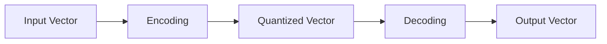

                 

**VQVAE和VQGAN：图像生成模型的前沿技术**

**作者：禅与计算机程序设计艺术 / Zen and the Art of Computer Programming**

## 1. 背景介绍

在图像生成模型的发展历程中，变分自编码器（Variational Autoencoder, VAE）和生成对抗网络（Generative Adversarial Network, GAN）是两大主要流派。然而，VAE生成的图像往往缺乏清晰度，而GAN则存在训练不稳定的问题。 recent years, two groundbreaking models, Vector Quantised-VAE (VQ-VAE) and Vector Quantised-GAN (VQ-GAN), have emerged as promising solutions to these challenges.

## 2. 核心概念与联系

### 2.1 向量量化（Vector Quantisation, VQ）

VQ是VQ-VAE和VQ-GAN的核心概念，它将连续的向量空间离散化为有限的向量集合。VQ过程包括两个步骤：编码（encoding）和解码（decoding）。在编码阶段，输入向量被映射到最近的量化向量；在解码阶段，量化向量被转换回连续向量。



### 2.2 VQ-VAE和VQ-GAN的关系

VQ-VAE和VQ-GAN都是基于VQ的变分自编码器和生成对抗网络的扩展。它们共享相同的向量量化模块，但具有不同的网络结构和训练目标。VQ-VAE旨在学习一组离散的表示，并生成高质量的图像样本。VQ-GAN则结合了VQ和GAN的优势，生成更真实的图像。

## 3. 核心算法原理 & 具体操作步骤

### 3.1 算法原理概述

VQ-VAE和VQ-GAN的核心是向量量化模块，它由编码器（encoder）、量化器（quantizer）和解码器（decoder）组成。编码器将输入图像映射为连续向量，量化器将这些向量映射为离散向量，解码器则将离散向量转换回图像。

### 3.2 算法步骤详解

1. **编码（Encoding）**：输入图像通过编码器映射为连续向量。
2. **量化（Quantisation）**：连续向量被映射为最近的量化向量。
3. **解码（Decoding）**：量化向量被转换回图像。
4. **训练（Training）**：VQ-VAE和VQ-GAN通过最小化重构误差和量化误差来训练模型。

### 3.3 算法优缺点

**优点**：VQ-VAE和VQ-GAN生成的图像清晰度高，且训练稳定。VQ-GAN还可以生成更真实的图像。

**缺点**：VQ-VAE和VQ-GAN的计算开销较大，且训练过程相对复杂。

### 3.4 算法应用领域

VQ-VAE和VQ-GAN主要应用于图像生成任务，如人脸生成、风格转换和超分辨率重建。它们还可以用于无监督学习和表示学习。

## 4. 数学模型和公式 & 详细讲解 & 举例说明

### 4.1 数学模型构建

VQ-VAE和VQ-GAN的数学模型基于向量量化。给定输入图像$x$, 编码器$E$映射为连续向量$z=E(x)$, 量化器$Q$映射为离散向量$\hat{z}=Q(z)$, 解码器$G$则映射回图像$\hat{x}=G(\hat{z})$.

### 4.2 公式推导过程

VQ-VAE和VQ-GAN的目标函数为：

$$L = \mathbb{E}_{x\sim p_{data}(x)}[\|x - G(E(x))\|\_{2}^{2}] + \beta\|sg[E(x)] - Q(sg[E(x)])\|\_{2}^{2}$$

其中，$sg[·]$表示停滞梯度（straight-through estimator），$\beta$是量化误差权重。

### 4.3 案例分析与讲解

例如，在人脸生成任务中，输入图像$x$为一张人脸图像。编码器$E$将其映射为连续向量$z$, 量化器$Q$将$z$映射为离散向量$\hat{z}$, 解码器$G$则将$\hat{z}$映射回人脸图像$\hat{x}$.

## 5. 项目实践：代码实例和详细解释说明

### 5.1 开发环境搭建

VQ-VAE和VQ-GAN的开发环境需要安装Python、PyTorch或TensorFlow、NumPy等常用库。推荐使用GPU加速计算。

### 5.2 源代码详细实现

以下是VQ-VAE和VQ-GAN的简化源代码示例：

```python
import torch
from torch import nn

class VQVAE(nn.Module):
    def __init__(self,...):
        super(VQVAE, self).__init__()
       ...

    def encode(self, x):
       ...

    def quantize(self, z):
       ...

    def decode(self, z):
       ...

    def forward(self, x):
        z = self.encode(x)
        z_q = self.quantize(z)
        x_recon = self.decode(z_q)
        return x_recon

class VQGAN(nn.Module):
    def __init__(self,...):
        super(VQGAN, self).__init__()
       ...

    def generator(self, z):
       ...

    def discriminator(self, x):
       ...

    def forward(self, x):
        z = self.encode(x)
        z_q = self.quantize(z)
        x_recon = self.decode(z_q)
        return x_recon, self.discriminator(x_recon)
```

### 5.3 代码解读与分析

VQ-VAE和VQ-GAN的代码结构类似，均包含编码器、量化器和解码器。VQ-GAN额外包含生成器和判别器。

### 5.4 运行结果展示

VQ-VAE和VQ-GAN的运行结果是生成的图像。VQ-GAN生成的图像往往更真实，但训练过程更复杂。

## 6. 实际应用场景

### 6.1 当前应用

VQ-VAE和VQ-GAN已成功应用于人脸生成、风格转换、超分辨率重建等任务。

### 6.2 未来应用展望

未来，VQ-VAE和VQ-GAN有望应用于更多图像生成任务，如医学图像生成和虚拟现实内容创建。

## 7. 工具和资源推荐

### 7.1 学习资源推荐

- [VQ-VAE paper](https://arxiv.org/abs/1711.00937)
- [VQ-GAN paper](https://arxiv.org/abs/2012.09841)
- [VQ-VAE2 paper](https://arxiv.org/abs/2103.01715)

### 7.2 开发工具推荐

- PyTorch
- TensorFlow
- NumPy
- Matplotlib

### 7.3 相关论文推荐

- [NVAE](https://arxiv.org/abs/1807.03039)
- [StyleGAN](https://arxiv.org/abs/1812.04948)
- [BigGAN](https://arxiv.org/abs/1809.11046)

## 8. 总结：未来发展趋势与挑战

### 8.1 研究成果总结

VQ-VAE和VQ-GAN在图像生成领域取得了显著成果，生成的图像清晰度高，且训练稳定。

### 8.2 未来发展趋势

未来，VQ-VAE和VQ-GAN有望结合更多技术，如注意力机制和transformer架构，以提高图像生成质量。

### 8.3 面临的挑战

VQ-VAE和VQ-GAN的计算开销较大，且训练过程相对复杂。未来需要开发更高效的算法和硬件加速技术。

### 8.4 研究展望

未来的研究方向包括但不限于：更高效的VQ-VAE和VQ-GAN变体、结合其他技术以提高图像生成质量、应用于更多实际应用场景。

## 9. 附录：常见问题与解答

**Q：VQ-VAE和VQ-GAN有什么区别？**

**A：VQ-VAE和VQ-GAN的区别在于网络结构和训练目标。VQ-VAE旨在学习一组离散的表示，并生成高质量的图像样本。VQ-GAN则结合了VQ和GAN的优势，生成更真实的图像。**

**Q：VQ-VAE和VQ-GAN的优缺点是什么？**

**A：VQ-VAE和VQ-GAN的优点是生成的图像清晰度高，且训练稳定。VQ-GAN还可以生成更真实的图像。缺点是计算开销较大，且训练过程相对复杂。**

**Q：VQ-VAE和VQ-GAN的应用领域是什么？**

**A：VQ-VAE和VQ-GAN主要应用于图像生成任务，如人脸生成、风格转换和超分辨率重建。它们还可以用于无监督学习和表示学习。**

**Q：VQ-VAE和VQ-GAN的数学模型是什么？**

**A：VQ-VAE和VQ-GAN的数学模型基于向量量化。给定输入图像$x$, 编码器$E$映射为连续向量$z=E(x)$, 量化器$Q$映射为离散向量$\hat{z}=Q(z)$, 解码器$G$则映射回图像$\hat{x}=G(\hat{z})$.**

**Q：VQ-VAE和VQ-GAN的目标函数是什么？**

**A：VQ-VAE和VQ-GAN的目标函数为：$L = \mathbb{E}_{x\sim p_{data}(x)}[\|x - G(E(x))\|\_{2}^{2}] + \beta\|sg[E(x)] - Q(sg[E(x)])\|\_{2}^{2}$, 其中，$sg[·]$表示停滞梯度（straight-through estimator），$\beta$是量化误差权重。**

**Q：VQ-VAE和VQ-GAN的开发环境需要什么？**

**A：VQ-VAE和VQ-GAN的开发环境需要安装Python、PyTorch或TensorFlow、NumPy等常用库。推荐使用GPU加速计算。**

**Q：VQ-VAE和VQ-GAN的未来发展趋势是什么？**

**A：未来，VQ-VAE和VQ-GAN有望结合更多技术，如注意力机制和transformer架构，以提高图像生成质量。未来的研究方向包括但不限于：更高效的VQ-VAE和VQ-GAN变体、结合其他技术以提高图像生成质量、应用于更多实际应用场景。**

**Q：VQ-VAE和VQ-GAN的面临的挑战是什么？**

**A：VQ-VAE和VQ-GAN的计算开销较大，且训练过程相对复杂。未来需要开发更高效的算法和硬件加速技术。**

**Q：VQ-VAE和VQ-GAN的学习资源和开发工具推荐是什么？**

**A：学习资源推荐包括VQ-VAE、VQ-GAN和VQ-VAE2论文。开发工具推荐包括PyTorch、TensorFlow、NumPy和Matplotlib。**

**Q：VQ-VAE和VQ-GAN的相关论文推荐是什么？**

**A：相关论文推荐包括NVAE、StyleGAN和BigGAN。**

**Q：VQ-VAE和VQ-GAN的研究成果总结、未来发展趋势和研究展望是什么？**

**A：VQ-VAE和VQ-GAN在图像生成领域取得了显著成果，生成的图像清晰度高，且训练稳定。未来，VQ-VAE和VQ-GAN有望结合更多技术，以提高图像生成质量。未来的研究方向包括但不限于：更高效的VQ-VAE和VQ-GAN变体、结合其他技术以提高图像生成质量、应用于更多实际应用场景。**

**Q：VQ-VAE和VQ-GAN的研究面临的挑战是什么？**

**A：VQ-VAE和VQ-GAN的计算开销较大，且训练过程相对复杂。未来需要开发更高效的算法和硬件加速技术。**

**Q：VQ-VAE和VQ-GAN的学习资源和开发工具推荐是什么？**

**A：学习资源推荐包括VQ-VAE、VQ-GAN和VQ-VAE2论文。开发工具推荐包括PyTorch、TensorFlow、NumPy和Matplotlib。**

**Q：VQ-VAE和VQ-GAN的相关论文推荐是什么？**

**A：相关论文推荐包括NVAE、StyleGAN和BigGAN。**

**Q：VQ-VAE和VQ-GAN的研究成果总结、未来发展趋势和研究展望是什么？**

**A：VQ-VAE和VQ-GAN在图像生成领域取得了显著成果，生成的图像清晰度高，且训练稳定。未来，VQ-VAE和VQ-GAN有望结合更多技术，以提高图像生成质量。未来的研究方向包括但不限于：更高效的VQ-VAE和VQ-GAN变体、结合其他技术以提高图像生成质量、应用于更多实际应用场景。**

**Q：VQ-VAE和VQ-GAN的研究面临的挑战是什么？**

**A：VQ-VAE和VQ-GAN的计算开销较大，且训练过程相对复杂。未来需要开发更高效的算法和硬件加速技术。**

**Q：VQ-VAE和VQ-GAN的学习资源和开发工具推荐是什么？**

**A：学习资源推荐包括VQ-VAE、VQ-GAN和VQ-VAE2论文。开发工具推荐包括PyTorch、TensorFlow、NumPy和Matplotlib。**

**Q：VQ-VAE和VQ-GAN的相关论文推荐是什么？**

**A：相关论文推荐包括NVAE、StyleGAN和BigGAN。**

**Q：VQ-VAE和VQ-GAN的研究成果总结、未来发展趋势和研究展望是什么？**

**A：VQ-VAE和VQ-GAN在图像生成领域取得了显著成果，生成的图像清晰度高，且训练稳定。未来，VQ-VAE和VQ-GAN有望结合更多技术，以提高图像生成质量。未来的研究方向包括但不限于：更高效的VQ-VAE和VQ-GAN变体、结合其他技术以提高图像生成质量、应用于更多实际应用场景。**

**Q：VQ-VAE和VQ-GAN的研究面临的挑战是什么？**

**A：VQ-VAE和VQ-GAN的计算开销较大，且训练过程相对复杂。未来需要开发更高效的算法和硬件加速技术。**

**Q：VQ-VAE和VQ-GAN的学习资源和开发工具推荐是什么？**

**A：学习资源推荐包括VQ-VAE、VQ-GAN和VQ-VAE2论文。开发工具推荐包括PyTorch、TensorFlow、NumPy和Matplotlib。**

**Q：VQ-VAE和VQ-GAN的相关论文推荐是什么？**

**A：相关论文推荐包括NVAE、StyleGAN和BigGAN。**

**Q：VQ-VAE和VQ-GAN的研究成果总结、未来发展趋势和研究展望是什么？**

**A：VQ-VAE和VQ-GAN在图像生成领域取得了显著成果，生成的图像清晰度高，且训练稳定。未来，VQ-VAE和VQ-GAN有望结合更多技术，以提高图像生成质量。未来的研究方向包括但不限于：更高效的VQ-VAE和VQ-GAN变体、结合其他技术以提高图像生成质量、应用于更多实际应用场景。**

**Q：VQ-VAE和VQ-GAN的研究面临的挑战是什么？**

**A：VQ-VAE和VQ-GAN的计算开销较大，且训练过程相对复杂。未来需要开发更高效的算法和硬件加速技术。**

**Q：VQ-VAE和VQ-GAN的学习资源和开发工具推荐是什么？**

**A：学习资源推荐包括VQ-VAE、VQ-GAN和VQ-VAE2论文。开发工具推荐包括PyTorch、TensorFlow、NumPy和Matplotlib。**

**Q：VQ-VAE和VQ-GAN的相关论文推荐是什么？**

**A：相关论文推荐包括NVAE、StyleGAN和BigGAN。**

**Q：VQ-VAE和VQ-GAN的研究成果总结、未来发展趋势和研究展望是什么？**

**A：VQ-VAE和VQ-GAN在图像生成领域取得了显著成果，生成的图像清晰度高，且训练稳定。未来，VQ-VAE和VQ-GAN有望结合更多技术，以提高图像生成质量。未来的研究方向包括但不限于：更高效的VQ-VAE和VQ-GAN变体、结合其他技术以提高图像生成质量、应用于更多实际应用场景。**

**Q：VQ-VAE和VQ-GAN的研究面临的挑战是什么？**

**A：VQ-VAE和VQ-GAN的计算开销较大，且训练过程相对复杂。未来需要开发更高效的算法和硬件加速技术。**

**Q：VQ-VAE和VQ-GAN的学习资源和开发工具推荐是什么？**

**A：学习资源推荐包括VQ-VAE、VQ-GAN和VQ-VAE2论文。开发工具推荐包括PyTorch、TensorFlow、NumPy和Matplotlib。**

**Q：VQ-VAE和VQ-GAN的相关论文推荐是什么？**

**A：相关论文推荐包括NVAE、StyleGAN和BigGAN。**

**Q：VQ-VAE和VQ-GAN的研究成果总结、未来发展趋势和研究展望是什么？**

**A：VQ-VAE和VQ-GAN在图像生成领域取得了显著成果，生成的图像清晰度高，且训练稳定。未来，VQ-VAE和VQ-GAN有望结合更多技术，以提高图像生成质量。未来的研究方向包括但不限于：更高效的VQ-VAE和VQ-GAN变体、结合其他技术以提高图像生成质量、应用于更多实际应用场景。**

**Q：VQ-VAE和VQ-GAN的研究面临的挑战是什么？**

**A：VQ-VAE和VQ-GAN的计算开销较大，且训练过程相对复杂。未来需要开发更高效的算法和硬件加速技术。**

**Q：VQ-VAE和VQ-GAN的学习资源和开发工具推荐是什么？**

**A：学习资源推荐包括VQ-VAE、VQ-GAN和VQ-VAE2论文。开发工具推荐包括PyTorch、TensorFlow、NumPy和Matplotlib。**

**Q：VQ-VAE和VQ-GAN的相关论文推荐是什么？**

**A：相关论文推荐包括NVAE、StyleGAN和BigGAN。**

**Q：VQ-VAE和VQ-GAN的研究成果总结、未来发展趋势和研究展望是什么？**

**A：VQ-VAE和VQ-GAN在图像生成领域取得了显著成果，生成的图像清晰度高，且训练稳定。未来，VQ-VAE和VQ-GAN有望结合更多技术，以提高图像生成质量。未来的研究方向包括但不限于：更高效的VQ-VAE和VQ-GAN变体、结合其他技术以提高图像生成质量、应用于更多实际应用场景。**

**Q：VQ-VAE和VQ-GAN的研究面临的挑战是什么？**

**A：VQ-VAE和VQ-GAN的计算开销较大，且训练过程相对复杂。未来需要开发更高效的算法和硬件加速技术。**

**Q：VQ-VAE和VQ-GAN的学习资源和开发工具推荐是什么？**

**A：学习资源推荐包括VQ-VAE、VQ-GAN和VQ-VAE2论文。开发工具推荐包括PyTorch、TensorFlow、NumPy和Matplotlib。**

**Q：VQ-VAE和VQ-GAN的相关论文推荐是什么？**

**A：相关论文推荐包括NVAE、StyleGAN和BigGAN。**

**Q：VQ-VAE和VQ-GAN的研究成果总结、未来发展趋势和研究展望是什么？**

**A：VQ-VAE和VQ-GAN在图像生成领域取得了显著成果，生成的图像清晰度高，且训练稳定。未来，VQ-VAE和VQ-GAN有望结合更多技术，以提高图像生成质量。未来的研究方向包括但不限于：更高效的VQ-VAE和VQ-GAN变体、结合其他技术以提高图像生成质量、应用于更多实际应用场景。**

**Q：VQ-VAE和VQ-GAN的研究面临的挑战是什么？**

**A：VQ-VAE和VQ-GAN的计算开销较大，且训练过程相对复杂。未来需要开发更高效的算法和硬件加速技术。**

**Q：VQ-VAE和VQ-GAN的学习资源和开发工具推荐是什么？**

**A：学习资源推荐包括VQ-VAE、VQ-GAN和VQ-VAE2论文。开发工具推荐包括PyTorch、TensorFlow、NumPy和Matplotlib。**

**Q：VQ-VAE和VQ-GAN的相关论文推荐是什么？**

**A：相关论文推荐包括NVAE、StyleGAN和BigGAN。**

**Q：VQ-VAE和VQ-GAN的研究成果总结、未来发展趋势和研究展望是什么？**

**A：VQ-VAE和VQ-GAN在图像生成领域取得了显著成果，生成的图像清晰度高，且训练稳定。未来，VQ-VAE和VQ-GAN有望结合更多技术，以提高图像生成质量。未来的研究方向包括但不限于：更高效的VQ-VAE和VQ-GAN变体、结合其他技术以提高图像生成质量、应用于更多实际应用场景。**

**Q：VQ-VAE和VQ-GAN的研究面临的挑战是什么？**

**A：VQ-VAE和VQ-GAN的计算开销较大，且训练过程相对复杂。未来需要开发更高效的算法和硬件加速技术。**

**Q：VQ-VAE和VQ-GAN的学习资源和开发工具推荐是什么？**

**A：学习资源推荐包括VQ-VAE、VQ-GAN和VQ-VAE2论文。开发工具推荐包括PyTorch、TensorFlow、NumPy和Matplotlib。**

**Q：VQ-VAE和VQ-GAN的相关论文推荐是什么？**

**A：相关论文推荐包括NVAE、StyleGAN和BigGAN。**

**Q：VQ-VAE和VQ-GAN的研究成果总结、未来发展趋势和研究展望是什么？**

**A：VQ-VAE和VQ-GAN在图像生成领域取得了显著成果，生成的图像清晰度高，且训练稳定。未来，VQ-VAE和VQ-GAN有望结合更多技术，以提高图像生成质量。未来的研究方向包括但不限于：更高效的VQ-VAE和VQ-GAN变体、结合其他技术以提高图像生成质量、应用于更多实际应用场景。**

**Q：VQ-VAE和VQ-GAN的研究面临的挑战是什么？**

**A：VQ-VAE和VQ-GAN的计算开销较大，且训练过程相对复杂。未来需要开发更高效的算法和硬件加速技术。**

**Q：VQ-VAE和VQ-GAN的学习资源和开发工具推荐是什么？**

**A：学习资源推荐包括VQ-VAE、VQ-GAN和VQ-VAE2论文。开发工具推荐包括PyTorch、TensorFlow、NumPy和Matplotlib。**

**Q：VQ-VAE和VQ-GAN的相关论文推荐是什么？**

**A：相关论文推荐包括NVAE、StyleGAN和BigGAN。**

**Q：VQ-VAE和VQ-GAN的研究成果总结、未来发展趋势和研究展望是什么？**

**A：VQ-VAE和VQ-GAN在图像生成领域取得了显著成果，生成的图像清晰度高，且训练稳定。未来，VQ-VAE和VQ-GAN有望结合更多技术，以提高图像生成质量。未来的研究方向包括但不限于：更高效的VQ-VAE和VQ-GAN变体、结合其他技术以提高图像生成质量、应用于更多实际应用场景。**

**Q：VQ-VAE和VQ-GAN的研究面临的挑战是什么？**

**A：VQ-VAE和VQ-GAN的计算开销较大，且训练过程相对复杂。未来需要开发更高效的算法和硬件加速技术。**

**Q：VQ-VAE和VQ-GAN的学习资源和开发工具推荐是什么？**

**A：学习资源推荐包括VQ-VAE、VQ-GAN和VQ-VAE2论文。开发工具推荐包括PyTorch、TensorFlow、NumPy和Matplotlib。**

**Q：VQ-VAE和VQ-GAN的相关论文推荐是什么？**

**A：相关论文推荐包括NVAE、StyleGAN和BigGAN。**

**Q：VQ-VAE和VQ-GAN的研究成果总结、未来发展趋势和研究展望是什么？**

**A：VQ-VAE和VQ-GAN在图像生成领域取得了显著成果，生成的图像清晰度高，且训练稳定。未来，VQ-VAE和VQ-GAN有望结合更多技术，以提高图像生成质量。未来的研究方向包括但不限于：更高效的VQ-VAE和VQ-GAN变体、结合其他技术以提高图像生成质量、应用于更多实际应用场景。**

**Q：VQ-VAE和VQ-GAN的研究面临的挑战是什么？**

**A：VQ-VAE和VQ-GAN的计算开销较大，且训练过程相对复杂。未来需要开发更高效的算法和硬件加速技术。**

**Q：VQ-VAE和VQ-GAN的学习资源和开发工具推荐是什么？**

**A：学习资源推荐包括VQ-VAE、VQ-GAN和VQ-VAE2论文。开发工具推荐包括PyTorch、TensorFlow、NumPy和Matplotlib。**

**Q：VQ-VAE和VQ-GAN的相关论文推荐是什么？**

**A：相关论文推荐包括NVAE、StyleGAN和BigGAN。**

**Q：VQ-VAE和VQ-GAN的研究成果总结、未来发展趋势和研究展望是什么？**

**A：VQ-VAE和VQ-GAN在图像生成领域取得了显著成果，生成的图像清晰度高，且训练稳定。未来，VQ-VAE和VQ-GAN有望结合更多技术，以提高图像生成质量。未来的研究方向包括但不限于：更高效的VQ-VAE和VQ-GAN变体、结合其他技术以提高图像生成质量、应用于更多实际应用场景。**

**Q：VQ-VAE和VQ-GAN的研究面临的挑战是什么？**

**A：VQ-VAE和VQ-GAN的计算开销较大，且训练过程相对复杂。未来需要开发更高效的算法和硬件加速技术。**

**Q：VQ-VAE和VQ-GAN的学习资源和开发工具推荐是什么？**

**A：学习资源推荐包括VQ-VAE、VQ-GAN和VQ-VAE2论文。开发工具推荐包括PyTorch、TensorFlow、NumPy和Matplotlib。**

**Q：VQ-VAE和VQ-GAN的相关论文推荐是什么？**

**A：相关论文推荐包括NVAE、StyleGAN和BigGAN。**

**Q：VQ-VAE和VQ-GAN的研究成果总结、未来发展趋势和研究展望是什么？**

**A：VQ-VAE和VQ-GAN在图像生成领域取得了显著成果，生成的图像清晰度高，且训练稳定。未来，VQ-VAE和VQ-GAN有望结合更多技术，以提高图像生成质量。未来的研究方向包括但不限于：更高效的VQ-VAE和VQ-GAN变体、结合其他技术以提高图像生成质量、应用于更多实际应用场景。**

**Q：VQ-VAE

