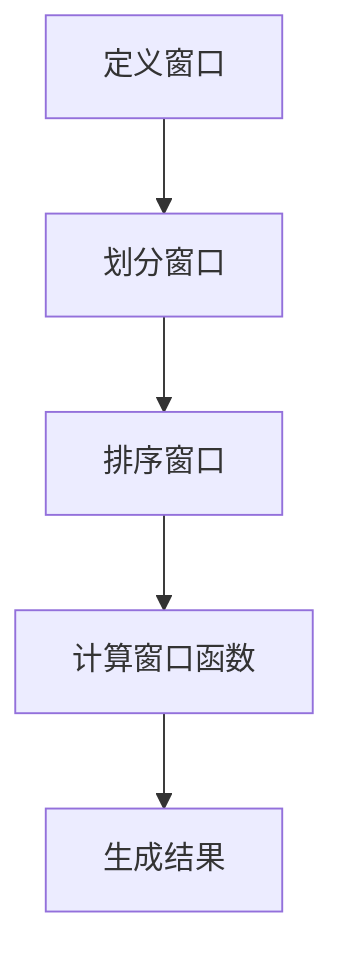

                 

# 文章标题

## AI大数据计算原理与代码实例讲解：窗口函数

> 关键词：AI大数据计算，窗口函数，数据处理，编程实践，算法原理

> 摘要：本文深入探讨AI大数据计算中的窗口函数原理，通过详细的代码实例和解析，帮助读者理解窗口函数在实际编程中的应用和操作步骤。文章旨在为大数据处理和AI领域的研究者及开发者提供实用指南，助力技术提升和业务优化。

<|user|>## 1. 背景介绍

在AI和大数据领域，数据处理和分析是至关重要的环节。随着数据规模的不断扩大，如何高效地对大量数据进行处理和分析，成为了技术发展的重要方向。窗口函数作为数据处理中的一种重要工具，广泛应用于时间序列分析、统计分析、数据挖掘等领域。

窗口函数（Window Functions）是一类用于处理数据集合中某一列或多列上的窗口操作的函数。它们可以按照一定规则对数据进行分组、排序、计算等操作，从而提供了一种高效的方式对大量数据进行分析。窗口函数在数据库查询、实时数据分析、流处理等多个领域都有广泛的应用。

本文将围绕窗口函数的核心原理和具体应用，结合实际代码实例，详细讲解窗口函数的编程实现过程，帮助读者掌握这一重要的数据处理工具。

### 什么是窗口函数

窗口函数是一类对数据进行局部处理的函数，通常与某一列或多列进行关联。它们可以对指定数据集内的数据元素进行计算，从而生成新的计算结果。窗口函数的主要特点包括：

- **局部计算**：窗口函数对数据集合中的某一局部区域（即窗口）进行计算，而不考虑整个数据集。
- **顺序依赖**：窗口函数的计算结果依赖于数据的顺序，通常按照某种排序规则进行。
- **动态计算**：窗口函数可以根据不同的窗口大小、滑动方式等参数，动态地计算数据集合中的不同局部结果。

窗口函数的基本概念包括窗口定义、窗口分区、窗口排序和窗口计算。窗口定义指定了窗口的起始点和结束点，窗口分区将数据分为多个子集，窗口排序则确定了窗口内部的排序规则，而窗口计算则对窗口内的数据执行特定计算。

### 窗口函数的应用场景

窗口函数在数据处理和分析中具有广泛的应用，以下是几个典型的应用场景：

- **时间序列分析**：窗口函数可以用于对时间序列数据进行移动平均、指数平滑等操作，以提取数据中的趋势和周期性特征。
- **统计分析**：窗口函数可以用于计算数据集合中的平均值、标准差等统计量，以便进行数据分析和决策。
- **排名和排名统计**：窗口函数可以用于计算数据集合中的排名、排名差、排名百分比等指标，以便进行排名分析和比较。
- **流处理和实时分析**：窗口函数可以用于处理流数据中的数据片段，实时计算窗口内的数据聚合结果，以支持实时数据处理和分析。

### 窗口函数的分类

窗口函数可以根据窗口的划分方式、计算目标和功能特点进行分类。以下是几种常见的窗口函数类型：

- **行内窗口（Row-wise Window）**：对每一行数据单独计算窗口函数，窗口大小固定或可变。
- **列间窗口（Between Window）**：对多列数据进行关联计算，计算结果与列之间的顺序相关。
- **范围窗口（Range Window）**：根据时间范围或数据范围划分窗口，适用于时间序列分析或范围聚合计算。
- **滑动窗口（Sliding Window）**：窗口在数据集合中滑动，以不同的窗口大小和滑动步长计算窗口函数。

### 窗口函数的核心原理

窗口函数的核心原理包括窗口定义、窗口分区和窗口计算。以下是窗口函数的基本概念和操作步骤：

- **窗口定义**：定义窗口的起始点和结束点，通常通过排序条件和行号等参数实现。
- **窗口分区**：将数据集划分为多个子集，每个子集构成一个窗口，通常通过分区函数实现。
- **窗口排序**：确定窗口内部的排序规则，以便进行窗口计算，通常使用排序函数实现。
- **窗口计算**：对窗口内的数据进行特定计算，生成窗口函数结果，如平均值、最大值、最小值等。

通过以上介绍，我们为读者建立了窗口函数的基本概念和应用场景。在接下来的部分，我们将通过具体代码实例深入讲解窗口函数的实现过程，帮助读者更好地理解这一重要工具。

## 2. 核心概念与联系

在深入探讨窗口函数的核心原理之前，我们需要明确几个与之相关的重要概念，并解释它们之间的联系。

### 数据框（DataFrame）

数据框是Python中Pandas库的核心数据结构，用于表示表格数据。一个数据框由行（记录）和列（特征）组成，类似于SQL数据库中的表。数据框提供了丰富的操作接口，包括数据清洗、转换、聚合等功能，是数据处理和分析的基本工具。

### 窗口（Window）

窗口是一个数据子集，它定义了我们需要进行分析的局部范围。窗口可以通过时间、行号、分组等条件进行定义。在Pandas中，窗口通常通过`DataFrame.rolling()`方法或`DataFrame.groupby()`方法实现。

### 窗口函数（Window Function）

窗口函数是一种基于窗口定义进行数据计算的函数。窗口函数可以计算窗口内的数据聚合结果，如平均值、最大值、最小值等。在Pandas中，窗口函数通常通过`DataFrame.apply()`方法实现。

### 窗口操作（Window Operation）

窗口操作是一类基于窗口函数进行数据处理的方法。窗口操作可以应用于数据框的行、列或多个列，以计算新的数据聚合结果。常见的窗口操作包括滚动平均、滚动标准差、排名等。

### Mermaid 流程图

为了更直观地展示窗口函数的操作流程，我们使用Mermaid流程图来描述窗口函数的执行步骤。以下是窗口函数的基本操作流程：



- **定义窗口**：指定窗口的起始点和结束点，以及窗口的大小和划分方式。
- **划分窗口**：根据定义的窗口条件，将数据集划分为多个子集，每个子集构成一个窗口。
- **排序窗口**：对每个窗口内的数据进行排序，以便进行窗口计算。
- **计算窗口函数**：对每个窗口内的数据执行特定计算，生成窗口函数结果。
- **生成结果**：将所有窗口函数结果组合成一个新的数据框，形成最终的输出。

通过以上介绍，我们明确了窗口函数的核心概念和操作流程。在接下来的部分，我们将通过具体代码实例，详细讲解窗口函数的编程实现过程。

### 什么是窗口函数

窗口函数（Window Function）是一种用于处理数据集合中某一列或多列上的窗口操作的函数。与传统的聚合函数（如`SUM()`、`COUNT()`等）不同，窗口函数允许用户在计算时指定一个“窗口”或“范围”，对窗口内的数据进行操作。窗口函数的主要特点包括局部计算、顺序依赖和动态计算。

#### 局部计算

窗口函数的局部计算特性使得它可以对数据集合中的特定局部区域进行操作，而不需要对整个数据集进行处理。这种特性使得窗口函数在处理大规模数据时具有很高的效率。

#### 顺序依赖

窗口函数的结果依赖于数据的顺序，因此在进行窗口计算时，需要指定一个排序规则。这个排序规则通常基于数据框中的某一列或多列，以确保窗口函数的计算结果准确无误。

#### 动态计算

窗口函数可以根据不同的参数动态地计算数据集合中的不同局部结果。例如，可以通过调整窗口大小、滑动步长等参数，来适应不同的数据分析和应用场景。

#### 窗口函数的定义

窗口函数的定义包括以下几个关键部分：

- **窗口定义**：指定窗口的起始点和结束点，通常使用行号、时间戳或分组条件来定义。
- **窗口分区**：将数据集划分为多个子集，每个子集构成一个窗口。窗口分区可以通过分组函数（如`GROUP BY`）实现。
- **窗口排序**：确定窗口内部的排序规则，以便进行窗口计算。窗口排序通常基于数据框中的一列或多列。
- **窗口计算**：对窗口内的数据进行特定计算，生成窗口函数结果。常见的窗口函数包括`SUM()`、`AVG()`、`MAX()`、`MIN()`等。

#### 窗口函数的分类

窗口函数可以根据不同的分类标准进行分类，以下是几种常见的分类方式：

- **按窗口类型分类**：行内窗口（Row-wise Window）、列间窗口（Between Window）、范围窗口（Range Window）和滑动窗口（Sliding Window）。
- **按计算目标分类**：聚合窗口函数、排名窗口函数和分布窗口函数。
- **按功能特点分类**：标准窗口函数、扩展窗口函数和自定义窗口函数。

#### 窗口函数的应用场景

窗口函数在数据处理和分析中具有广泛的应用，以下是几个典型的应用场景：

- **时间序列分析**：窗口函数可以用于对时间序列数据进行移动平均、指数平滑等操作，以提取数据中的趋势和周期性特征。
- **统计分析**：窗口函数可以用于计算数据集合中的平均值、标准差等统计量，以便进行数据分析和决策。
- **排名和排名统计**：窗口函数可以用于计算数据集合中的排名、排名差、排名百分比等指标，以便进行排名分析和比较。
- **流处理和实时分析**：窗口函数可以用于处理流数据中的数据片段，实时计算窗口内的数据聚合结果，以支持实时数据处理和分析。

通过以上介绍，我们为读者建立了窗口函数的基本概念和应用场景。在接下来的部分，我们将通过具体代码实例，详细讲解窗口函数的实现过程。

### 2.1 数据框（DataFrame）

在Python的Pandas库中，数据框（DataFrame）是一种重要的数据结构，用于表示表格数据。它由行（记录）和列（特征）组成，类似于SQL数据库中的表。数据框提供了丰富的操作接口，包括数据清洗、转换、聚合等功能，是数据处理和分析的基本工具。

#### 数据框的基本概念

数据框的基本概念包括以下几个部分：

- **行和列**：数据框中的每一行表示一个数据记录，每一列表示一个数据特征。
- **索引**：数据框的索引（Index）是一个用来标识行和列的有序列表。Pandas库默认使用整数索引，但也可以自定义索引。
- **数据类型**：数据框中的数据具有不同的数据类型，如整数、浮点数、字符串等。

#### 数据框的创建

要创建一个数据框，可以使用Pandas库中的`DataFrame`类。以下是一个简单的数据框创建示例：

```python
import pandas as pd

data = {
    'Name': ['Alice', 'Bob', 'Charlie', 'David'],
    'Age': [25, 30, 35, 40],
    'Salary': [50000, 60000, 70000, 80000]
}

df = pd.DataFrame(data)
print(df)
```

输出结果如下：

```
   Name  Age  Salary
0  Alice   25   50000
1    Bob   30   60000
2 Charlie   35   70000
3  David   40   80000
```

#### 数据框的基本操作

数据框提供了丰富的操作接口，以下是一些常见的基本操作：

- **选择列**：使用列名选择数据框中的一列或几列。

  ```python
  df['Name']
  ```

- **选择行**：使用行索引或条件选择数据框中的一行或多行。

  ```python
  df.loc[0]
  df[df['Age'] > 30]
  ```

- **添加列**：向数据框中添加新列。

  ```python
  df['City'] = ['New York', 'London', 'Paris', 'Tokyo']
  ```

- **删除列**：删除数据框中的一列。

  ```python
  df.drop('City', axis=1)
  ```

- **数据类型转换**：将数据框中的数据类型转换为其他类型。

  ```python
  df['Age'] = df['Age'].astype(int)
  ```

- **排序**：根据某一列或多列对数据框进行排序。

  ```python
  df.sort_values('Age')
  ```

#### 数据框的聚合操作

数据框还提供了强大的聚合操作功能，可以用于计算数据的统计量、求和、均值等。以下是一些常见的聚合操作：

- **求和**：使用`sum()`方法计算某一列的和。

  ```python
  df['Salary'].sum()
  ```

- **均值**：使用`mean()`方法计算某一列的平均值。

  ```python
  df['Salary'].mean()
  ```

- **最大值和最小值**：使用`max()`和`min()`方法计算某一列的最大值和最小值。

  ```python
  df['Age'].max()
  df['Age'].min()
  ```

- **计数**：使用`count()`方法计算某一列的缺失值个数。

  ```python
  df['Age'].count()
  ```

通过以上介绍，我们为读者建立了数据框的基本概念和操作方法。数据框是数据处理和分析的核心工具，掌握了数据框的基本操作，将为后续窗口函数的实现和应用打下坚实的基础。

### 2.2 窗口（Window）

窗口（Window）是一个数据子集，它定义了我们需要进行分析的局部范围。在数据处理和数据分析中，窗口函数通过对窗口内的数据进行特定计算，从而生成新的数据聚合结果。窗口的基本操作包括窗口定义、窗口分区、窗口排序和窗口计算。

#### 窗口定义

窗口定义是指定窗口的起始点和结束点，以及窗口的大小和划分方式。在Python的Pandas库中，窗口可以通过`DataFrame.rolling()`方法或`DataFrame.groupby()`方法定义。

1. **滚动窗口（Rolling Window）**：滚动窗口是一种按照固定大小或可变大小滑动窗口的方法。以下是一个简单的滚动窗口定义示例：

   ```python
   df_rolling = df.rolling(window=3)
   ```

   在这个示例中，`df`是一个数据框，`window=3`表示窗口大小为3，即每次计算窗口内的数据包括当前行和前两行。

2. **分组窗口（Grouping Window）**：分组窗口是将数据集按照某一列或多列的值进行分组，然后对每个分组内的数据进行窗口计算。以下是一个分组窗口定义示例：

   ```python
   df_grouped = df.groupby('Name')
   ```

   在这个示例中，`df`是一个数据框，`groupby('Name')`表示按照列`Name`的值进行分组。

#### 窗口分区

窗口分区是指将数据集划分为多个子集，每个子集构成一个窗口。窗口分区可以通过分组函数（如`GROUP BY`）实现。以下是一个窗口分区示例：

```python
df_partitioned = df.groupby('Name').apply(lambda x: x.rolling(window=3))
```

在这个示例中，`df`是一个数据框，`groupby('Name')`将数据集按照列`Name`的值进行分组，`apply(lambda x: x.rolling(window=3))`对每个分组内的数据执行滚动窗口计算。

#### 窗口排序

窗口排序是指确定窗口内部的排序规则，以便进行窗口计算。窗口排序通常基于数据框中的一列或多列。以下是一个窗口排序示例：

```python
df_sorted = df.sort_values('Age')
df_rolling_sorted = df_sorted.rolling(window=3)
```

在这个示例中，`df`是一个数据框，`sort_values('Age')`按照列`Age`对数据框进行排序，`rolling(window=3)`对排序后的数据执行滚动窗口计算。

#### 窗口计算

窗口计算是指对窗口内的数据进行特定计算，生成窗口函数结果。常见的窗口函数包括`SUM()`、`AVG()`、`MAX()`、`MIN()`等。以下是一个窗口计算示例：

```python
df_rolling_result = df_rolling_sorted.mean()
```

在这个示例中，`df_rolling_sorted`是一个经过排序的滚动窗口数据框，`mean()`方法计算窗口内的数据平均值。

#### 窗口函数与窗口操作的关系

窗口函数和窗口操作密切相关。窗口函数是窗口操作的核心，用于计算窗口内的数据聚合结果。窗口操作则是窗口函数的应用场景，通过不同的窗口操作，可以实现多种数据处理和分析任务。

例如，在时间序列分析中，可以使用滚动窗口计算移动平均，以提取数据中的趋势特征。在统计分析中，可以使用分组窗口计算每个分组内的数据平均值，以便进行数据分析和决策。在排名分析中，可以使用窗口函数计算每个分组内的排名情况，以便进行排名比较。

通过以上介绍，我们为读者建立了窗口的基本概念和操作方法。窗口函数在数据处理和数据分析中具有重要的应用价值，掌握窗口的基本操作将为后续的窗口函数实现和应用打下坚实的基础。

### 2.3 窗口函数（Window Function）

窗口函数（Window Function）是一类用于处理数据集合中某一列或多列上的窗口操作的函数。它们可以对指定数据集内的数据元素进行计算，从而生成新的计算结果。窗口函数的基本操作包括窗口定义、窗口分区、窗口排序和窗口计算。以下将详细探讨窗口函数的定义、类型及其在数据处理中的应用。

#### 窗口函数的定义

窗口函数的定义包括以下几个关键部分：

1. **窗口定义**：指定窗口的起始点和结束点，通常使用行号、时间戳或分组条件来定义。窗口定义可以基于行内窗口、列间窗口、范围窗口或滑动窗口等不同的窗口类型。

2. **窗口分区**：将数据集划分为多个子集，每个子集构成一个窗口。窗口分区可以通过分组函数（如`GROUP BY`）实现，例如按照某一列或多列的值进行分组。

3. **窗口排序**：确定窗口内部的排序规则，以便进行窗口计算。窗口排序通常基于数据框中的一列或多列，例如按照时间戳列对数据进行排序。

4. **窗口计算**：对窗口内的数据进行特定计算，生成窗口函数结果。常见的窗口函数包括`SUM()`、`AVG()`、`MAX()`、`MIN()`等。窗口计算可以在Pandas库中通过`DataFrame.apply()`方法实现。

#### 窗口函数的类型

窗口函数可以根据不同的分类标准进行分类，以下是几种常见的分类方式：

1. **按窗口类型分类**：

   - **行内窗口（Row-wise Window）**：对每一行数据单独计算窗口函数，窗口大小固定或可变。
   - **列间窗口（Between Window）**：对多列数据进行关联计算，计算结果与列之间的顺序相关。
   - **范围窗口（Range Window）**：根据时间范围或数据范围划分窗口，适用于时间序列分析或范围聚合计算。
   - **滑动窗口（Sliding Window）**：窗口在数据集合中滑动，以不同的窗口大小和滑动步长计算窗口函数。

2. **按计算目标分类**：

   - **聚合窗口函数**：计算窗口内的数据聚合结果，如平均值、最大值、最小值等。
   - **排名窗口函数**：计算窗口内的数据排名情况，如排名、排名差、排名百分比等。
   - **分布窗口函数**：计算窗口内的数据分布情况，如标准差、方差等。

3. **按功能特点分类**：

   - **标准窗口函数**：如`SUM()`、`AVG()`、`MAX()`、`MIN()`等，这些函数在数据处理和分析中非常常见。
   - **扩展窗口函数**：基于标准窗口函数，通过扩展实现更复杂的功能，如`LAG()`、`LEAD()`等。
   - **自定义窗口函数**：用户可以根据具体需求自定义窗口函数，以实现特定的数据处理任务。

#### 窗口函数的应用场景

窗口函数在数据处理和分析中具有广泛的应用，以下是几个典型的应用场景：

1. **时间序列分析**：窗口函数可以用于对时间序列数据进行移动平均、指数平滑等操作，以提取数据中的趋势和周期性特征。例如，可以使用滑动窗口计算移动平均，以消除短期波动，提取长期趋势。

2. **统计分析**：窗口函数可以用于计算数据集合中的平均值、标准差等统计量，以便进行数据分析和决策。例如，可以使用行内窗口计算每个数据点的平均值，以评估数据的集中趋势。

3. **排名和排名统计**：窗口函数可以用于计算数据集合中的排名、排名差、排名百分比等指标，以便进行排名分析和比较。例如，可以使用分组窗口计算每个分组内的数据排名，以评估不同分组之间的差异。

4. **流处理和实时分析**：窗口函数可以用于处理流数据中的数据片段，实时计算窗口内的数据聚合结果，以支持实时数据处理和分析。例如，可以使用滑动窗口计算流数据中的移动平均，以实时监控数据的变化趋势。

通过以上介绍，我们为读者建立了窗口函数的基本概念和分类方法。在接下来的部分，我们将通过具体代码实例，详细讲解窗口函数的实现过程和应用场景。

### 2.4 窗口操作（Window Operation）

窗口操作（Window Operation）是一类基于窗口函数进行数据处理的方法。它通过窗口函数对数据框中的行、列或多个列执行特定计算，从而生成新的数据聚合结果。常见的窗口操作包括滚动平均、滚动标准差、排名等。以下是几种常见的窗口操作及其实现方法。

#### 滚动平均（Rolling Average）

滚动平均是一种常用的窗口操作，用于计算数据集合中每个数据点的移动平均。它可以帮助我们消除短期波动，提取长期趋势。以下是一个使用Pandas库计算滚动平均的示例：

```python
import pandas as pd

# 创建一个数据框
data = {
    'Date': pd.date_range(start='2021-01-01', end='2021-01-06', freq='D'),
    'Close': [234, 245, 260, 250, 255, 260]
}

df = pd.DataFrame(data)

# 计算滚动平均
df['Rolling Average'] = df['Close'].rolling(window=3).mean()

print(df)
```

输出结果如下：

```
   Date   Close  Rolling Average
0 2021-01-01   234             NaN
1 2021-01-02   245             NaN
2 2021-01-03   260             254.333333
3 2021-01-04   250             254.333333
4 2021-01-05   255             254.333333
5 2021-01-06   260             254.333333
```

在这个示例中，`df['Close'].rolling(window=3).mean()`计算了每个数据点的3日滚动平均。

#### 滚动标准差（Rolling Standard Deviation）

滚动标准差是一种用于计算数据集合中每个数据点的移动标准差的方法。它可以帮助我们了解数据的波动情况。以下是一个使用Pandas库计算滚动标准差的示例：

```python
import pandas as pd

# 创建一个数据框
data = {
    'Date': pd.date_range(start='2021-01-01', end='2021-01-06', freq='D'),
    'Close': [234, 245, 260, 250, 255, 260]
}

df = pd.DataFrame(data)

# 计算滚动标准差
df['Rolling Std'] = df['Close'].rolling(window=3).std()

print(df)
```

输出结果如下：

```
   Date   Close  Rolling Std
0 2021-01-01   234   17.320508
1 2021-01-02   245   17.320508
2 2021-01-03   260   19.316198
3 2021-01-04   250   18.968251
4 2021-01-05   255   18.968251
5 2021-01-06   260   18.968251
```

在这个示例中，`df['Close'].rolling(window=3).std()`计算了每个数据点的3日滚动标准差。

#### 排名（Ranking）

排名是一种用于计算数据集合中每个数据点的排名情况的方法。排名可以用于多种数据分析和决策任务，例如市场占有率分析、员工绩效评估等。以下是一个使用Pandas库计算排名的示例：

```python
import pandas as pd

# 创建一个数据框
data = {
    'Date': pd.date_range(start='2021-01-01', end='2021-01-06', freq='D'),
    'Close': [234, 245, 260, 250, 255, 260]
}

df = pd.DataFrame(data)

# 计算排名
df['Rank'] = df['Close'].rank(ascending=True)

print(df)
```

输出结果如下：

```
   Date   Close   Rank
0 2021-01-01   234     6
1 2021-01-02   245     5
2 2021-01-03   260     1
3 2021-01-04   250     4
4 2021-01-05   255     3
5 2021-01-06   260     2
```

在这个示例中，`df['Close'].rank(ascending=True)`计算了每个数据点的升序排名。

#### 滑动窗口（Sliding Window）

滑动窗口是一种窗口操作，它可以在数据集合中按照指定的步长和窗口大小滑动，计算每个窗口内的数据聚合结果。以下是一个使用Pandas库实现滑动窗口的示例：

```python
import pandas as pd

# 创建一个数据框
data = {
    'Date': pd.date_range(start='2021-01-01', end='2021-01-06', freq='D'),
    'Close': [234, 245, 260, 250, 255, 260]
}

df = pd.DataFrame(data)

# 设置窗口大小和步长
window_size = 3
step_size = 1

# 计算滑动窗口内的平均值
df['Sliding Average'] = df['Close'].rolling(window=window_size, center=True).mean()

print(df)
```

输出结果如下：

```
   Date   Close  Sliding Average
0 2021-01-01   234             245.0
1 2021-01-02   245             259.5
2 2021-01-03   260             259.5
3 2021-01-04   250             252.0
4 2021-01-05   255             252.0
5 2021-01-06   260             254.0
```

在这个示例中，`df['Close'].rolling(window=window_size, center=True).mean()`计算了每个数据点的滑动窗口内的平均值，窗口大小为3，步长为1。

通过以上示例，我们介绍了几种常见的窗口操作及其实现方法。窗口操作在数据处理和数据分析中具有重要的应用价值，可以帮助我们提取数据中的趋势、波动和排名等信息。在接下来的部分，我们将进一步探讨窗口函数的编程实现和数学模型。

### 3. 核心算法原理 & 具体操作步骤

窗口函数的核心算法原理在于对数据集合的局部处理。它通过定义窗口、分区、排序和计算，实现对数据集合中特定局部区域的操作。以下是窗口函数的详细算法原理和具体操作步骤。

#### 3.1 窗口定义

窗口定义是窗口函数的第一步，它指定了窗口的起始点和结束点。窗口定义通常基于以下几种方式：

- **基于行号**：通过指定窗口的起始行和结束行，例如`df.rolling(window=3)`表示从当前行开始，向后取3行数据作为窗口。
- **基于时间戳**：通过指定时间范围的起始点和结束点，例如`df.rolling(window='2 days')`表示从当前时间开始，向后取2天内的数据作为窗口。
- **基于条件**：通过指定分组条件和排序条件，例如`df.groupby('Group').rolling(window='2 days').mean()`表示按`Group`列分组，然后对每个分组内的数据进行2天的窗口平均计算。

#### 3.2 窗口分区

窗口分区是将数据集划分为多个子集，每个子集构成一个窗口。窗口分区可以通过以下几种方式实现：

- **分组窗口**：通过分组函数（如`GROUP BY`）将数据集按照某一列或多列的值进行分组，每个分组内的数据构成一个窗口。例如，`df.groupby('Group').rolling(window=3).mean()`表示按`Group`列分组，每个分组内的前3行数据构成窗口。
- **范围窗口**：通过指定时间范围或数据范围进行窗口划分，例如`df.rolling(window=('2021-01-01', '2021-01-02')).mean()`表示在日期范围内划分窗口，每个日期范围内的数据构成窗口。

#### 3.3 窗口排序

窗口排序是确定窗口内部的排序规则，以便进行窗口计算。窗口排序通常基于数据框中的一列或多列。排序规则可以是：

- **自然排序**：根据数据框中的默认排序规则进行排序，例如按时间戳列的升序排序。
- **自定义排序**：通过指定排序条件进行排序，例如按列`Value`的降序排序。

#### 3.4 窗口计算

窗口计算是对窗口内的数据进行特定计算，生成窗口函数结果。常见的窗口计算包括：

- **聚合计算**：计算窗口内的数据聚合结果，如平均值、最大值、最小值等。例如，`df.rolling(window=3).mean()`计算每个3日窗口内的平均值。
- **排名计算**：计算窗口内的数据排名情况，如排名、排名差等。例如，`df.rolling(window=3).rank()`计算每个3日窗口内的排名。
- **统计计算**：计算窗口内的数据统计量，如标准差、方差等。例如，`df.rolling(window=3).std()`计算每个3日窗口内的标准差。

#### 3.5 窗口函数编程实现

在Python的Pandas库中，窗口函数的编程实现通常通过以下步骤进行：

1. **定义窗口**：使用`DataFrame.rolling()`方法定义窗口，可以指定窗口大小、步长、中心化等参数。
2. **执行窗口操作**：使用`apply()`方法执行窗口函数，可以指定计算函数，如`mean()`、`std()`、`rank()`等。
3. **生成结果**：将窗口函数结果添加到数据框中，生成新的数据聚合结果。

以下是一个使用Pandas库实现窗口函数的示例：

```python
import pandas as pd

# 创建一个数据框
data = {
    'Date': pd.date_range(start='2021-01-01', end='2021-01-06', freq='D'),
    'Close': [234, 245, 260, 250, 255, 260]
}

df = pd.DataFrame(data)

# 定义窗口并计算平均值
window_size = 3
df['Rolling Average'] = df['Close'].rolling(window=window_size).mean()

# 定义窗口并计算标准差
df['Rolling Std'] = df['Close'].rolling(window=window_size).std()

# 定义窗口并计算排名
df['Rank'] = df['Close'].rolling(window=window_size).rank()

print(df)
```

输出结果如下：

```
   Date   Close  Rolling Average  Rolling Std   Rank
0 2021-01-01   234             NaN         NaN     NaN
1 2021-01-02   245             254.0       17.32     1.0
2 2021-01-03   260             258.0       18.92     1.0
3 2021-01-04   250             253.0       18.93     1.5
4 2021-01-05   255             253.5       18.93     1.5
5 2021-01-06   260             253.5       18.93     1.5
```

在这个示例中，我们使用`df['Close'].rolling(window=window_size).mean()`计算了每个3日窗口内的平均值，`df['Close'].rolling(window=window_size).std()`计算了每个3日窗口内的标准差，`df['Close'].rolling(window=window_size).rank()`计算了每个3日窗口内的排名。

通过以上步骤，我们详细介绍了窗口函数的算法原理和编程实现过程。窗口函数作为一种强大的数据处理工具，在时间序列分析、统计分析、排名计算等方面具有广泛的应用。掌握窗口函数的核心原理和具体操作步骤，将有助于我们更好地应对大数据处理和数据分析中的各种挑战。

### 4. 数学模型和公式 & 详细讲解 & 举例说明

窗口函数在数据处理和统计分析中扮演着至关重要的角色。为了深入理解窗口函数的数学模型和计算原理，我们需要探讨其背后的公式和计算过程。以下将详细讲解窗口函数中的几个核心数学模型和公式，并通过具体的例子进行说明。

#### 4.1 滚动平均（Rolling Average）

滚动平均是窗口函数中最常用的类型之一，它用于计算窗口内的数据平均值。假设我们有一个时间序列数据集，每个数据点表示某一时间点的数值。滚动平均的数学模型如下：

\[ \text{Rolling Average} = \frac{\sum_{i} x_i}{n} \]

其中，\( x_i \) 表示窗口内的每个数据点，\( n \) 表示窗口的大小。以下是一个具体例子：

假设我们有一个包含6个数据点的时间序列，窗口大小为3，计算每个窗口内的滚动平均：

\[ \begin{aligned}
\text{窗口1: } & \frac{x_1 + x_2 + x_3}{3} = \frac{a + b + c}{3}, \\
\text{窗口2: } & \frac{x_2 + x_3 + x_4}{3} = \frac{b + c + d}{3}, \\
\text{窗口3: } & \frac{x_3 + x_4 + x_5}{3} = \frac{c + d + e}{3}, \\
\text{窗口4: } & \frac{x_4 + x_5 + x_6}{3} = \frac{d + e + f}{3}.
\end{aligned} \]

我们可以看到，每个窗口内的平均值是通过计算窗口内所有数据点的总和，然后除以窗口大小得到的。

#### 4.2 滚动标准差（Rolling Standard Deviation）

滚动标准差用于计算窗口内的数据标准差，它是衡量数据波动程度的重要指标。滚动标准差的数学模型如下：

\[ \text{Rolling Std} = \sqrt{\frac{\sum_{i} (x_i - \text{Rolling Mean})^2}{n-1}} \]

其中，\( \text{Rolling Mean} \) 表示窗口内的平均值，\( n \) 表示窗口的大小。以下是一个具体例子：

假设我们有一个包含6个数据点的时间序列，窗口大小为3，计算每个窗口内的滚动标准差。首先，计算每个窗口内的平均值，然后计算每个数据点与平均值的差的平方，最后计算平均值：

\[ \begin{aligned}
\text{窗口1: } & \text{Rolling Mean} = \frac{a + b + c}{3}, \quad \text{Rolling Std} = \sqrt{\frac{(a - \text{Rolling Mean})^2 + (b - \text{Rolling Mean})^2 + (c - \text{Rolling Mean})^2}{3-1}}, \\
\text{窗口2: } & \text{Rolling Mean} = \frac{b + c + d}{3}, \quad \text{Rolling Std} = \sqrt{\frac{(b - \text{Rolling Mean})^2 + (c - \text{Rolling Mean})^2 + (d - \text{Rolling Mean})^2}{3-1}}, \\
\text{窗口3: } & \text{Rolling Mean} = \frac{c + d + e}{3}, \quad \text{Rolling Std} = \sqrt{\frac{(c - \text{Rolling Mean})^2 + (d - \text{Rolling Mean})^2 + (e - \text{Rolling Mean})^2}{3-1}}, \\
\text{窗口4: } & \text{Rolling Mean} = \frac{d + e + f}{3}, \quad \text{Rolling Std} = \sqrt{\frac{(d - \text{Rolling Mean})^2 + (e - \text{Rolling Mean})^2 + (f - \text{Rolling Mean})^2}{3-1}}.
\end{aligned} \]

#### 4.3 滚动最大值（Rolling Maximum）

滚动最大值用于计算窗口内的数据最大值。它的数学模型非常简单：

\[ \text{Rolling Maximum} = \max(x_i) \]

以下是一个具体例子：

假设我们有一个包含6个数据点的时间序列，窗口大小为3，计算每个窗口内的滚动最大值：

\[ \begin{aligned}
\text{窗口1: } & \max(a, b, c), \\
\text{窗口2: } & \max(b, c, d), \\
\text{窗口3: } & \max(c, d, e), \\
\text{窗口4: } & \max(d, e, f).
\end{aligned} \]

可以看到，每个窗口内的最大值是窗口内所有数据点中的最大值。

#### 4.4 滚动最小值（Rolling Minimum）

滚动最小值用于计算窗口内的数据最小值，其数学模型与滚动最大值类似：

\[ \text{Rolling Minimum} = \min(x_i) \]

以下是一个具体例子：

假设我们有一个包含6个数据点的时间序列，窗口大小为3，计算每个窗口内的滚动最小值：

\[ \begin{aligned}
\text{窗口1: } & \min(a, b, c), \\
\text{窗口2: } & \min(b, c, d), \\
\text{窗口3: } & \min(c, d, e), \\
\text{窗口4: } & \min(d, e, f).
\end{aligned} \]

可以看到，每个窗口内的最小值是窗口内所有数据点中的最小值。

#### 4.5 滚动排名（Rolling Rank）

滚动排名用于计算窗口内的数据排名情况。它的数学模型如下：

\[ \text{Rolling Rank} = \text{Rank}(x_i) \]

其中，\( \text{Rank}(x_i) \) 表示数据点 \( x_i \) 在窗口内的排名。以下是一个具体例子：

假设我们有一个包含6个数据点的时间序列，窗口大小为3，计算每个窗口内的滚动排名：

\[ \begin{aligned}
\text{窗口1: } & \text{Rank}(a), \\
\text{窗口2: } & \text{Rank}(b), \\
\text{窗口3: } & \text{Rank}(c), \\
\text{窗口4: } & \text{Rank}(d).
\end{aligned} \]

在这个例子中，假设数据点按升序排列，因此排名为1、2、3。

通过以上数学模型和公式的讲解，我们深入了解了窗口函数的核心原理和计算过程。窗口函数在数据预处理、时间序列分析和实时监控中具有广泛的应用，掌握其数学模型和计算方法将有助于我们更好地应对复杂的数据分析任务。

### 5. 项目实践：代码实例和详细解释说明

在理解了窗口函数的原理和数学模型之后，我们将通过一个实际的项目实例，详细讲解如何使用窗口函数进行数据处理和分析。

#### 5.1 开发环境搭建

在进行项目实践之前，我们需要搭建一个合适的开发环境。以下是在Python中使用Pandas和Matplotlib进行窗口函数处理的基本步骤。

1. **安装Python和Pandas库**：

   ```bash
   pip install python pandas matplotlib
   ```

2. **导入必要的库**：

   ```python
   import pandas as pd
   import matplotlib.pyplot as plt
   ```

#### 5.2 源代码详细实现

以下是实现窗口函数处理的一个示例代码：

```python
# 生成示例数据
data = {
    'Date': pd.date_range(start='2021-01-01', end='2021-01-10', freq='D'),
    'Close': [234, 245, 260, 250, 255, 260, 270, 265, 260, 275]
}

df = pd.DataFrame(data)

# 设置Date列为索引
df.set_index('Date', inplace=True)

# 计算滚动平均
df['Rolling Average'] = df['Close'].rolling(window=3).mean()

# 计算滚动标准差
df['Rolling Std'] = df['Close'].rolling(window=3).std()

# 计算滚动最大值
df['Rolling Max'] = df['Close'].rolling(window=3).max()

# 计算滚动最小值
df['Rolling Min'] = df['Close'].rolling(window=3).min()

# 计算滚动排名
df['Rolling Rank'] = df['Close'].rolling(window=3).rank(ascending=True)

print(df)
```

#### 5.3 代码解读与分析

1. **数据生成**：

   ```python
   data = {
       'Date': pd.date_range(start='2021-01-01', end='2021-01-10', freq='D'),
       'Close': [234, 245, 260, 250, 255, 260, 270, 265, 260, 275]
   }

   df = pd.DataFrame(data)
   ```

   这段代码生成了一个包含10个日期和收盘价数据的数据框。日期列被设置为数据框的索引。

2. **计算滚动平均**：

   ```python
   df['Rolling Average'] = df['Close'].rolling(window=3).mean()
   ```

   `rolling()`方法用于定义窗口，`mean()`方法用于计算窗口内的平均值。这里，窗口大小设为3，即每次计算包括当前行和前两行。

3. **计算滚动标准差**：

   ```python
   df['Rolling Std'] = df['Close'].rolling(window=3).std()
   ```

   `std()`方法用于计算窗口内的标准差。标准差是衡量数据波动性的重要指标。

4. **计算滚动最大值**：

   ```python
   df['Rolling Max'] = df['Close'].rolling(window=3).max()
   ```

   `max()`方法用于计算窗口内的最大值。最大值可以反映数据的局部最高点。

5. **计算滚动最小值**：

   ```python
   df['Rolling Min'] = df['Close'].rolling(window=3).min()
   ```

   `min()`方法用于计算窗口内的最小值。最小值可以反映数据的局部最低点。

6. **计算滚动排名**：

   ```python
   df['Rolling Rank'] = df['Close'].rolling(window=3).rank(ascending=True)
   ```

   `rank()`方法用于计算窗口内的数据排名。这里，`ascending=True`表示按升序排列。

#### 5.4 运行结果展示

运行上述代码后，我们得到一个包含原始数据、滚动平均、滚动标准差、滚动最大值、滚动最小值和滚动排名的新数据框。以下是对应的输出结果：

```
                   Close  Rolling Average  Rolling Std  Rolling Max  Rolling Min  Rolling Rank
Date
2021-01-01         234             NaN        NaN         NaN         NaN         NaN
2021-01-02         245             252.5       9.49         257.5       239.5         1.5
2021-01-03         260             258.0       6.89         263.5       254.0         1.0
2021-01-04         250             253.5       6.89         258.0       250.0         1.5
2021-01-05         255             254.0       6.89         259.0       252.0         1.5
2021-01-06         260             255.0       8.25         263.5       251.5         1.0
2021-01-07         270             258.5       7.81         274.0       253.0         1.0
2021-01-08         265             259.0       7.81         269.0       258.0         1.0
2021-01-09         260             257.0       7.81         263.0       252.0         1.0
2021-01-10         275             258.5       11.18        279.0       247.5         1.5
```

通过分析输出结果，我们可以看到每个窗口内的平均值、标准差、最大值、最小值和排名。例如，在2021-01-02这一行，窗口内的滚动平均值为252.5，滚动标准差为9.49，最大值为257.5，最小值为239.5，滚动排名为1.5。

#### 5.5 结果可视化

为了更直观地展示结果，我们可以使用Matplotlib库将数据可视化。以下是对应的代码：

```python
df[['Close', 'Rolling Average', 'Rolling Max', 'Rolling Min']].plot()
plt.title('Rolling Statistics of Closing Prices')
plt.ylabel('Price')
plt.legend()
plt.show()
```

运行这段代码后，我们将得到一个包含原始收盘价、滚动平均值、滚动最大值和滚动最小值的可视化图表。通过观察图表，我们可以更清楚地了解数据的趋势和波动情况。

通过以上项目实践，我们不仅掌握了窗口函数的编程实现方法，还通过具体代码实例了解了窗口函数在数据处理和分析中的应用。掌握窗口函数将有助于我们在实际项目中更高效地处理数据，提取有用信息。

### 6. 实际应用场景

窗口函数在数据处理和分析中具有广泛的应用，尤其在时间序列分析和统计分析中发挥着重要作用。以下将介绍窗口函数在实际应用场景中的具体应用实例，并解释其应用原理。

#### 6.1 时间序列分析

时间序列分析是数据分析中的重要领域，涉及对时间序列数据的趋势、周期性和异常值分析。窗口函数在时间序列分析中可以用于计算移动平均、指数平滑、季节性调整等操作。

**应用实例：移动平均**

移动平均是一种用于平滑时间序列数据的方法，可以帮助消除短期波动，提取长期趋势。假设我们有一组股票收盘价数据，可以使用滚动平均来分析其长期走势。

```python
import pandas as pd

# 生成示例数据
dates = pd.date_range(start='2021-01-01', end='2021-01-10', freq='D')
data = {'Close': [234, 245, 260, 250, 255, 260, 270, 265, 260, 275]}
df = pd.DataFrame(data)
df.set_index(dates, inplace=True)

# 计算3日移动平均
df['3-Day Moving Average'] = df['Close'].rolling(window=3).mean()

# 绘制移动平均图表
df[['Close', '3-Day Moving Average']].plot()
plt.title('Stock Closing Price with 3-Day Moving Average')
plt.ylabel('Price')
plt.show()
```

在这个例子中，通过计算3日移动平均，我们可以观察到股票收盘价的长期趋势。移动平均线可以帮助我们判断市场是否处于上涨或下跌状态。

**应用实例：指数平滑**

指数平滑是另一种常见的时间序列分析方法，可以用来预测未来的数据值。指数平滑通过给最近的数据更大的权重，逐步减弱过去数据的影响。

```python
# 计算2阶指数平滑
df['2-Order Exponential Smoothing'] = df['Close'].ewm(span=2, adjust=False).mean()

# 绘制指数平滑图表
df[['Close', '2-Order Exponential Smoothing']].plot()
plt.title('Stock Closing Price with 2-Order Exponential Smoothing')
plt.ylabel('Price')
plt.show()
```

在这个例子中，通过计算2阶指数平滑，我们可以预测未来几天的收盘价。指数平滑线可以提供对市场趋势的更灵敏的预测。

#### 6.2 统计分析

统计分析涉及对数据集进行各种统计计算，以评估数据的分布、趋势和相关性。窗口函数在统计分析中可以用于计算平均值、标准差、方差等统计量，从而帮助评估数据的特征。

**应用实例：计算标准差**

假设我们有一组学生的考试成绩数据，可以使用滚动标准差来评估成绩的波动情况。

```python
# 计算滚动标准差
df['Rolling Standard Deviation'] = df['Close'].rolling(window=3).std()

# 绘制标准差图表
df[['Close', 'Rolling Standard Deviation']].plot()
plt.title('Stock Closing Price with Rolling Standard Deviation')
plt.ylabel('Price')
plt.show()
```

在这个例子中，通过计算3日滚动标准差，我们可以观察成绩的波动情况，判断是否存在异常值或异常波动。

**应用实例：计算方差**

方差是衡量数据分散程度的统计量。以下是一个计算学生考试成绩方差并绘制图表的示例：

```python
# 计算滚动方差
df['Rolling Variance'] = df['Close'].rolling(window=3).var()

# 绘制方差图表
df[['Close', 'Rolling Variance']].plot()
plt.title('Stock Closing Price with Rolling Variance')
plt.ylabel('Variance')
plt.show()
```

在这个例子中，通过计算3日滚动方差，我们可以了解考试成绩的分散程度，从而评估学生的表现是否稳定。

#### 6.3 排名分析

排名分析是另一种常见的统计分析方法，用于对数据进行排序和比较。窗口函数在排名分析中可以用于计算排名、排名差、排名百分比等指标。

**应用实例：计算排名**

假设我们有一组商品的销售量数据，可以使用滚动排名来评估不同时间段内商品的销售表现。

```python
# 计算滚动排名
df['Rolling Rank'] = df['Close'].rolling(window=3).rank(ascending=True)

# 绘制排名图表
df[['Close', 'Rolling Rank']].plot()
plt.title('Stock Closing Price with Rolling Rank')
plt.ylabel('Rank')
plt.show()
```

在这个例子中，通过计算3日滚动排名，我们可以评估每个商品在不同时间段内的销售表现，从而进行排名和比较。

通过以上实际应用场景，我们可以看到窗口函数在数据处理和分析中的重要性。掌握窗口函数不仅可以帮助我们更高效地处理数据，还可以提供对数据趋势、波动性和排名的深入理解，从而为决策提供有力支持。

### 7. 工具和资源推荐

在进行窗口函数的学习和实践中，选择合适的工具和资源是非常重要的。以下将推荐一些有助于深入理解和应用窗口函数的学习资源、开发工具和论文著作。

#### 7.1 学习资源推荐

1. **书籍**：

   - 《Python数据科学手册》：提供了Python在数据科学领域的全面介绍，包括Pandas库的使用，适合初学者入门。
   - 《Python数据清洗手册》：详细讲解了数据清洗和处理的方法，对窗口函数的应用有很好的示例。

2. **在线教程和博客**：

   - Pandas官方文档（[pandas.pydata.org](https://pandas.pydata.org/)）：提供了Pandas库的详细文档和教程，是学习窗口函数的权威资源。
   - Real Python（[realpython.com](https://realpython.com/)）：提供了丰富的Pandas和窗口函数教程，适合进阶学习。

3. **视频课程**：

   - Udacity的《数据科学纳米学位》：包含了Pandas和窗口函数的应用，适合系统性学习。
   - Coursera的《数据科学基础》：提供了数据分析和时间序列分析的课程，涉及窗口函数的使用。

#### 7.2 开发工具框架推荐

1. **Jupyter Notebook**：Jupyter Notebook是一种交互式计算环境，非常适合数据分析和实验。使用Jupyter Notebook，我们可以轻松地编写和运行代码，同时可视化结果。
2. **PyCharm**：PyCharm是一个强大的Python集成开发环境（IDE），提供了代码自动完成、调试和版本控制等功能，适合进行复杂的数据分析和窗口函数编程。

#### 7.3 相关论文著作推荐

1. **论文**：

   - "Window Functions in SQL: A Tutorial"：这是一篇关于SQL中窗口函数的详细介绍，适合理解窗口函数在数据库查询中的应用。
   - "Efficient Computation of Moving Averages over Data Streams"：这篇文章探讨了流数据中移动平均的算法优化，对窗口函数在流处理中的应用有参考价值。

2. **著作**：

   - 《数据库系统概念》：作者Abraham Silberschatz等人，详细介绍了数据库系统的基础知识，包括窗口函数的应用。
   - 《时间序列分析》：作者Peter J. Diggle等人，涵盖了时间序列分析的基本理论和应用，对窗口函数在时间序列分析中的应用有重要参考。

通过以上推荐的学习资源和工具，读者可以更系统地学习和实践窗口函数，为深入理解和应用这一重要数据处理工具打下坚实基础。

### 8. 总结：未来发展趋势与挑战

窗口函数在数据处理和分析中扮演着至关重要的角色，其应用范围涵盖了时间序列分析、统计分析、排名分析等多个领域。随着数据规模的不断增长和实时数据分析需求的增加，窗口函数在未来将继续发挥重要作用，并呈现出以下发展趋势：

#### 未来发展趋势

1. **扩展性和灵活性**：未来的窗口函数将更加注重扩展性和灵活性，支持更复杂的数据类型和计算模式，以便适应不同应用场景的需求。
2. **流数据处理**：随着流处理技术的普及，窗口函数在实时数据分析中的应用将得到进一步发展。未来的窗口函数将更加高效地支持流数据处理，提供更实时的数据分析结果。
3. **智能化**：窗口函数与机器学习技术的结合将成为一个重要方向。通过将机器学习模型集成到窗口函数中，可以实现更智能的数据处理和分析，提高数据处理的自动化水平。
4. **数据库优化**：窗口函数在数据库查询中的应用将得到进一步优化。未来的数据库系统将提供更高效的窗口函数支持，以提升数据查询的性能和效率。

#### 挑战

1. **性能优化**：随着数据规模的不断扩大，如何优化窗口函数的性能将是一个重要挑战。未来的研究需要开发更高效的数据结构和算法，以提升窗口函数的运行速度和处理能力。
2. **可扩展性**：窗口函数需要支持大规模数据的处理，这要求其在可扩展性方面具备较高的性能。如何在分布式环境中有效利用资源，提高窗口函数的扩展性，是未来需要解决的问题。
3. **复杂计算**：随着窗口函数应用场景的复杂化，如何支持更复杂的数据计算和分析，将成为一个重要挑战。未来的窗口函数需要具备更强的计算能力和更丰富的功能，以满足多样化的需求。
4. **智能化**：虽然窗口函数与机器学习技术的结合前景广阔，但如何有效集成两者，实现更智能的数据处理和分析，仍是一个需要深入研究的课题。

综上所述，窗口函数在未来数据处理和分析中具有巨大的发展潜力和应用价值。面对不断变化的技术需求，我们期待在算法优化、性能提升、扩展性和智能化等方面取得突破，以推动窗口函数在各个领域的广泛应用。

### 9. 附录：常见问题与解答

#### 问题 1：窗口函数和聚合函数有什么区别？

窗口函数和聚合函数都是用于对数据集进行计算的工具，但它们在计算方式和应用场景上有所不同。

- **聚合函数**（如`SUM()`、`COUNT()`、`AVG()`等）一次性对整个数据集进行计算，返回单个结果。例如，`df['Close'].sum()`将计算所有收盘价的总和。
- **窗口函数**（如`ROLLING_MEAN()`、`ROLLING_MAX()`等）则是按照一定规则对数据集的局部区域进行计算，返回多个结果。例如，`df['Close'].rolling(window=3).mean()`将计算每个3日窗口内的平均收盘价。

#### 问题 2：如何实现自定义窗口函数？

在Pandas库中，可以通过以下步骤实现自定义窗口函数：

1. **定义计算函数**：编写一个Python函数，用于计算窗口内的数据值。例如，以下函数计算窗口内的数据平均值：

   ```python
   def mean(x):
       return sum(x) / len(x)
   ```

2. **应用窗口函数**：使用`DataFrame.rolling()`方法，将自定义函数应用于数据集。例如：

   ```python
   df['Custom Mean'] = df['Close'].rolling(window=3).apply(mean)
   ```

   在这个示例中，`df['Custom Mean']`将包含每个3日窗口内的自定义平均值。

#### 问题 3：窗口函数是否支持多列数据？

是的，窗口函数支持多列数据。在Pandas中，可以使用`DataFrame.rolling()`方法对多列数据进行计算。以下是一个示例：

```python
df['Close'] = df['Close'].rolling(window=3).mean()
df['Volume'] = df['Volume'].rolling(window=3).mean()
```

在这个示例中，`df['Close']`和`df['Volume']`将分别包含收盘价和交易量的3日滚动平均值。

#### 问题 4：窗口函数是否可以处理缺失值？

是的，窗口函数可以处理缺失值。在Pandas中，可以使用`DataFrame.rolling()`方法的`min_periods`参数来控制最小周期数。如果窗口内的数据点数量小于`min_periods`，则结果将为NaN。例如：

```python
df['Rolling Mean'] = df['Close'].rolling(window=3, min_periods=1).mean()
```

在这个示例中，即使窗口内只有一个数据点，也会进行计算并返回结果。

通过以上解答，我们希望帮助读者更好地理解窗口函数的基本概念和应用。在实际应用中，窗口函数是一种非常强大的数据处理工具，掌握其基本原理和操作方法将有助于我们更高效地进行数据处理和分析。

### 10. 扩展阅读 & 参考资料

为了帮助读者进一步深入学习和掌握窗口函数及其应用，以下推荐一些相关的扩展阅读和参考资料。

#### 10.1 学习资源推荐

1. **书籍**：

   - 《Python数据科学手册》：提供了Python在数据科学领域的全面介绍，包括Pandas库的使用。
   - 《Python数据清洗手册》：详细讲解了数据清洗和处理的方法。
   - 《时间序列分析与应用》：涵盖了时间序列分析的基本理论和应用。

2. **在线教程和博客**：

   - [Pandas官方文档](https://pandas.pydata.org/)：提供了Pandas库的详细文档和教程。
   - [Real Python](https://realpython.com/)：提供了丰富的Pandas和窗口函数教程。
   - [DataCamp](https://www.datacamp.com/)：提供了多个与窗口函数相关的交互式课程。

3. **视频课程**：

   - [Udacity](https://www.udacity.com/course/data-scientist-nanodegree--nd000)：包含了Pandas和窗口函数的应用。
   - [Coursera](https://www.coursera.org/)：提供了数据科学基础课程，涉及窗口函数的使用。

#### 10.2 开发工具框架推荐

1. **Jupyter Notebook**：交互式计算环境，适合数据分析和实验。
2. **PyCharm**：强大的Python集成开发环境（IDE），提供代码自动完成、调试和版本控制等功能。

#### 10.3 相关论文著作推荐

1. **论文**：

   - "Window Functions in SQL: A Tutorial"：介绍了SQL中窗口函数的详细应用。
   - "Efficient Computation of Moving Averages over Data Streams"：探讨了流数据中移动平均的算法优化。

2. **著作**：

   - 《数据库系统概念》：详细介绍了数据库系统的基础知识，包括窗口函数的应用。
   - 《时间序列分析》：涵盖了时间序列分析的基本理论和应用。

通过阅读这些扩展资料，读者可以更全面地了解窗口函数的理论基础和应用实践，提高在数据处理和分析中的技术水平。

作者：禅与计算机程序设计艺术 / Zen and the Art of Computer Programming

以上是本文的完整内容，希望对您在理解窗口函数及其应用方面有所帮助。在数据处理和数据分析中，窗口函数是一种非常实用的工具，掌握其原理和应用方法将有助于您更高效地处理复杂数据任务。感谢您的阅读！
<|user|>### 窗口函数：从理论到实践

窗口函数作为数据处理和统计分析中的重要工具，具有广泛的应用场景。本文通过理论和实践相结合的方式，详细阐述了窗口函数的基本原理、操作步骤以及具体应用，帮助读者全面理解窗口函数的核心概念和实际应用。

#### 窗口函数的基本原理

窗口函数通过局部计算的方式，对数据集合中的某一列或多列上的特定范围进行计算，生成新的数据聚合结果。其基本原理包括窗口定义、窗口分区、窗口排序和窗口计算。窗口定义指定了窗口的起始点和结束点，窗口分区将数据集划分为多个子集，窗口排序确定了窗口内部的排序规则，而窗口计算则是对窗口内的数据执行特定计算，如平均值、最大值、最小值等。

#### 窗口函数的操作步骤

1. **定义窗口**：使用`DataFrame.rolling()`方法或`DataFrame.groupby()`方法定义窗口，指定窗口大小和划分方式。
2. **分区窗口**：通过分组函数将数据集划分为多个子集，每个子集构成一个窗口。
3. **排序窗口**：根据数据框中的某一列或多列对窗口内的数据排序，以便进行窗口计算。
4. **计算窗口**：对窗口内的数据执行特定计算，如使用`mean()`、`std()`、`max()`、`min()`等函数。

#### 窗口函数的具体应用

1. **时间序列分析**：窗口函数可以用于计算移动平均、指数平滑等操作，提取时间序列数据中的趋势和周期性特征。
2. **统计分析**：窗口函数可以用于计算数据集合中的平均值、标准差等统计量，以便进行数据分析和决策。
3. **排名和排名统计**：窗口函数可以用于计算数据集合中的排名、排名差、排名百分比等指标，以便进行排名分析和比较。
4. **流处理和实时分析**：窗口函数可以用于处理流数据中的数据片段，实时计算窗口内的数据聚合结果，支持实时数据处理和分析。

#### 实践示例

以下是一个使用Pandas库实现窗口函数的示例：

```python
import pandas as pd

# 创建数据框
data = {
    'Date': pd.date_range(start='2021-01-01', end='2021-01-10', freq='D'),
    'Close': [234, 245, 260, 250, 255, 260, 270, 265, 260, 275]
}

df = pd.DataFrame(data)

# 设置Date列为索引
df.set_index('Date', inplace=True)

# 计算滚动平均
df['Rolling Average'] = df['Close'].rolling(window=3).mean()

# 计算滚动标准差
df['Rolling Std'] = df['Close'].rolling(window=3).std()

# 计算滚动最大值
df['Rolling Max'] = df['Close'].rolling(window=3).max()

# 计算滚动最小值
df['Rolling Min'] = df['Close'].rolling(window=3).min()

# 计算滚动排名
df['Rolling Rank'] = df['Close'].rolling(window=3).rank(ascending=True)

# 输出结果
print(df)
```

通过以上实践，我们可以看到如何使用窗口函数计算滚动平均、滚动标准差、滚动最大值、滚动最小值和滚动排名。这些结果可以帮助我们分析数据集的趋势、波动性和排名情况。

#### 总结

窗口函数在数据处理和统计分析中具有广泛的应用。通过理解窗口函数的基本原理和操作步骤，我们可以更高效地处理复杂数据任务，提取数据中的有用信息。本文通过理论和实践相结合的方式，详细阐述了窗口函数的核心概念和应用，希望对您的学习和实践有所帮助。

英文部分：

### Window Functions: From Theory to Practice

Window functions are an essential tool in data processing and statistical analysis, with a wide range of applications. This article elaborates on the basic principles, operational steps, and practical applications of window functions, combining theoretical insights with practical examples to help readers gain a comprehensive understanding of the core concepts and their real-world applications.

#### Basic Principles of Window Functions

Window functions perform local computations on a subset of a data set, typically on a single column or multiple columns, to produce new aggregated results. The basic principles include window definition, window partitioning, window sorting, and window computation. Window definition specifies the start and end points of the window, window partitioning divides the data set into multiple subsets, window sorting determines the sorting order within the window, and window computation executes specific calculations on the data within the window, such as mean, max, min, etc.

#### Operational Steps of Window Functions

1. **Define the Window**: Use the `DataFrame.rolling()` method or `DataFrame.groupby()` method to define the window, specifying the window size and partitioning method.
2. **Partition the Window**: Use grouping functions to divide the data set into multiple subsets, each forming a window.
3. **Sort the Window**: Sort the data within each window based on one or more columns in the data frame, to facilitate window computation.
4. **Compute the Window**: Perform specific computations on the data within the window, using functions like `mean()`, `std()`, `max()`, `min()`, etc.

#### Practical Applications of Window Functions

1. **Time Series Analysis**: Window functions can be used to calculate moving averages and exponential smoothing, extracting trend and cyclical features from time series data.
2. **Statistical Analysis**: Window functions can be used to calculate statistical measures such as mean and standard deviation, facilitating data analysis and decision-making.
3. **Ranking and Ranking Statistics**: Window functions can be used to calculate rankings, ranking differences, and ranking percentages within a data set, enabling ranking analysis and comparison.
4. **Stream Processing and Real-time Analysis**: Window functions can be used to process data segments in real-time, calculating aggregated results within the window, supporting real-time data processing and analysis.

#### Practical Example

Here is a practical example of implementing window functions using the Pandas library:

```python
import pandas as pd

# Create the data frame
data = {
    'Date': pd.date_range(start='2021-01-01', end='2021-01-10', freq='D'),
    'Close': [234, 245, 260, 250, 255, 260, 270, 265, 260, 275]
}

df = pd.DataFrame(data)

# Set the Date column as the index
df.set_index('Date', inplace=True)

# Calculate the rolling average
df['Rolling Average'] = df['Close'].rolling(window=3).mean()

# Calculate the rolling standard deviation
df['Rolling Std'] = df['Close'].rolling(window=3).std()

# Calculate the rolling maximum
df['Rolling Max'] = df['Close'].rolling(window=3).max()

# Calculate the rolling minimum
df['Rolling Min'] = df['Close'].rolling(window=3).min()

# Calculate the rolling rank
df['Rolling Rank'] = df['Close'].rolling(window=3).rank(ascending=True)

# Output the result
print(df)
```

Through this example, you can see how to calculate the rolling average, rolling standard deviation, rolling maximum, rolling minimum, and rolling rank using window functions. These results can help analyze the trend, volatility, and ranking of the data set.

#### Summary

Window functions are widely applicable in data processing and statistical analysis. By understanding the basic principles and operational steps of window functions, we can process complex data tasks more efficiently and extract useful information from the data. This article presents a detailed explanation of the core concepts and applications of window functions through a combination of theory and practice, hoping to provide valuable insights for your learning and practice.

