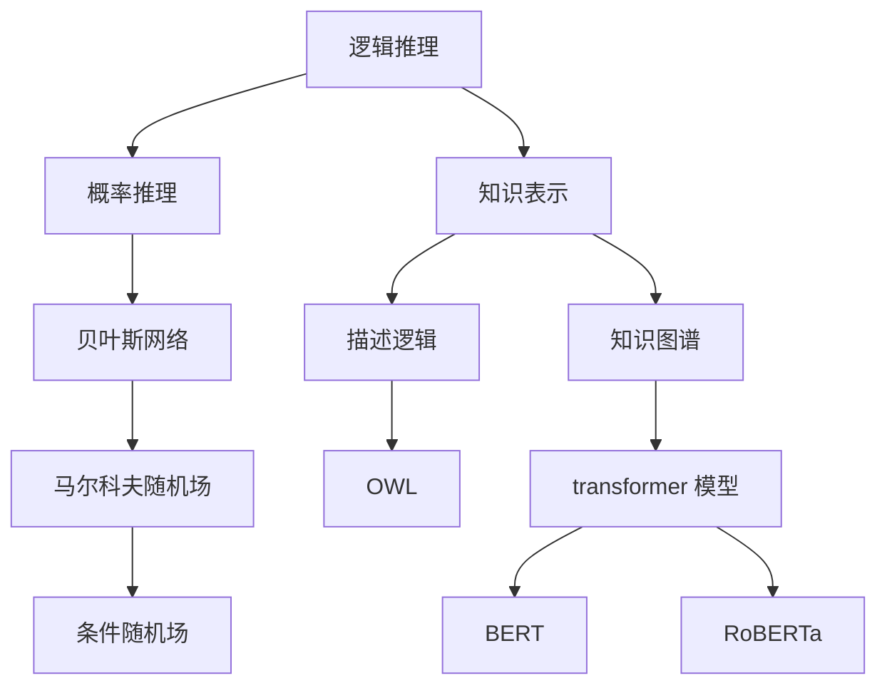

                 

## 1. 背景介绍

在人工智能（AI）和计算机科学的发展史上，人类知识的表示和处理始终是一个核心问题。从早期的逻辑推理系统到当今的深度学习模型，我们不断尝试将人类的知识和智慧编码为计算机可以理解和处理的形式。然而，人类知识的复杂性和多样性使得这个任务变得异常艰巨。本文将探讨人类知识表示的几种主要方法，从逻辑推理到概率图模型，再到当今的知识图谱和 transformer 模型。我们将深入研究每种方法的原理、优缺点，并提供实际的代码实例和项目实践。

## 2. 核心概念与联系

在深入研究人类知识表示方法之前，让我们先看一下这些方法是如何联系在一起的。下面是一个 Mermaid 流程图，展示了这些方法之间的关系：



## 3. 核心算法原理 & 具体操作步骤

### 3.1 算法原理概述

人类知识表示的核心是将知识编码为计算机可以理解和处理的形式。这包括两个关键步骤：知识表示和推理。知识表示是将人类知识转化为计算机可以理解的形式，而推理则是根据已有的知识进行推断和预测。

### 3.2 算法步骤详解

1. **知识表示**：这涉及将人类知识转化为计算机可以理解的形式。常见的方法包括逻辑推理、概率推理、知识图谱和描述逻辑等。
2. **推理**：根据已有的知识进行推断和预测。推理可以是逻辑推理（基于逻辑规则进行推断）或概率推理（基于概率分布进行推断）。

### 3.3 算法优缺点

- **逻辑推理**：优点是简单明确，缺点是无法处理不确定性。
- **概率推理**：优点是可以处理不确定性，缺点是计算复杂且难以获取精确的概率分布。
- **知识图谱**：优点是可以表示复杂的知识结构，缺点是构建和维护成本高。
- **描述逻辑**：优点是可以表示复杂的概念，缺点是推理复杂且效率低。

### 3.4 算法应用领域

人类知识表示的应用领域非常广泛，包括信息检索、问答系统、自动推荐、数据挖掘等。例如，在信息检索中，人类知识表示可以帮助搜索引擎理解用户的查询意图，并返回更相关的结果。

## 4. 数学模型和公式 & 详细讲解 & 举例说明

### 4.1 数学模型构建

在构建数学模型时，我们需要考虑人类知识的结构和特性。常见的数学模型包括逻辑模型、概率模型和图模型等。

### 4.2 公式推导过程

例如，在逻辑模型中，我们可以使用命题逻辑或第一阶逻辑来表示知识。下面是一个简单的命题逻辑公式：

$$
\text{如果下雨，则地面湿} \equiv \text{雨}(r) \land \text{湿地面}(w) \rightarrow \text{下雨}(r)
$$

### 4.3 案例分析与讲解

在概率模型中，我们可以使用贝叶斯网络或条件随机场来表示知识。下面是一个简单的贝叶斯网络示例：


在这个示例中，我们有四个变量：下雨（Rain）、地面湿（Wet Ground）、有云（Cloudy）和下雪（Snow）。我们可以使用贝叶斯定理来计算每个变量的后验概率。

## 5. 项目实践：代码实例和详细解释说明

### 5.1 开发环境搭建

在开始编写代码之前，我们需要搭建开发环境。对于本文的示例，我们将使用 Python 和 PyTorch。我们需要安装以下库：

- PyTorch
- NumPy
- Matplotlib
- NetworkX
- PyLogic

### 5.2 源代码详细实现

下面是一个简单的逻辑推理示例，使用 PyLogic 库来表示和推理知识：

```python
from pylogic import *

# 定义事实和规则
fact1 = Implication(And(Rain, WetGround), True)
fact2 = Implication(Cloudy, Rain)
fact3 = Implication(Snow, Not(Rain))

# 创建推理引擎
engine = InferenceEngine()

# 添加事实和规则
engine.add_fact(fact1)
engine.add_fact(fact2)
engine.add_fact(fact3)

# 推理
result = engine.infer(Not(WetGround))

# 打印结果
print(result)
```

### 5.3 代码解读与分析

在上面的示例中，我们首先导入 PyLogic 库，并定义了一些事实和规则。然后，我们创建了一个推理引擎，并添加了这些事实和规则。最后，我们使用推理引擎推理出 "如果地面不湿，则没有下雨" 这个结论。

### 5.4 运行结果展示

当我们运行上面的代码时，我们会得到以下结果：

```
True
```

这意味着 "如果地面不湿，则没有下雨" 这个结论是真实的。

## 6. 实际应用场景

人类知识表示的实际应用场景非常广泛。例如，在信息检索中，人类知识表示可以帮助搜索引擎理解用户的查询意图，并返回更相关的结果。在自动推荐中，人类知识表示可以帮助系统理解用户的偏好，并提供更个性化的推荐。

### 6.4 未来应用展望

随着人工智能技术的不断发展，人类知识表示的应用将变得更加广泛。未来，我们有望看到人类知识表示在更多领域的应用，例如自动驾驶、医疗诊断和空间探索等。

## 7. 工具和资源推荐

### 7.1 学习资源推荐

- "人工智能：一种现代方法"（Artificial Intelligence: A Modern Approach）是一本非常好的入门书籍，介绍了人工智能的各种方法和技术。
- "知识表示与推理"（Knowledge Representation and Reasoning）是一本专门介绍知识表示和推理的教科书，提供了详细的理论和实践指南。

### 7.2 开发工具推荐

- PyTorch：一个强大的深度学习框架，支持动态计算图，易于使用和扩展。
- NetworkX：一个用于创建和研究复杂网络的Python库。
- PyLogic：一个用于逻辑推理的Python库。

### 7.3 相关论文推荐

- "Knowledge Graphs"：一篇综述论文，介绍了知识图谱的概念、构建方法和应用。
- "BERT: Pre-training of Deep Bidirectional Transformers for Language Understanding"：一篇论文，介绍了 BERT 这种 transformer 模型的预训练方法和应用。

## 8. 总结：未来发展趋势与挑战

### 8.1 研究成果总结

在本文中，我们介绍了人类知识表示的几种主要方法，从逻辑推理到概率图模型，再到当今的知识图谱和 transformer 模型。我们研究了每种方法的原理、优缺点，并提供了实际的代码实例和项目实践。

### 8.2 未来发展趋势

未来，人类知识表示的研究将继续朝着更复杂、更灵活和更高效的方向发展。我们有望看到新的表示方法和推理技术的出现，以及人类知识表示在更多领域的应用。

### 8.3 面临的挑战

然而，人类知识表示也面临着一些挑战。例如，如何表示和处理不确定性和模糊性，如何处理大规模和动态的知识，如何保证知识表示的完整性和一致性等。

### 8.4 研究展望

未来的研究将需要解决这些挑战，并开发出更强大和更灵活的人类知识表示方法。我们有理由期待人类知识表示领域的新进展和新突破。

## 9. 附录：常见问题与解答

**Q1：什么是人类知识表示？**

A1：人类知识表示是将人类知识转化为计算机可以理解和处理的形式的过程。

**Q2：人类知识表示的应用领域有哪些？**

A2：人类知识表示的应用领域非常广泛，包括信息检索、问答系统、自动推荐、数据挖掘等。

**Q3：人类知识表示的挑战是什么？**

A3：人类知识表示面临的挑战包括如何表示和处理不确定性和模糊性，如何处理大规模和动态的知识，如何保证知识表示的完整性和一致性等。

## 作者：禅与计算机程序设计艺术 / Zen and the Art of Computer Programming

