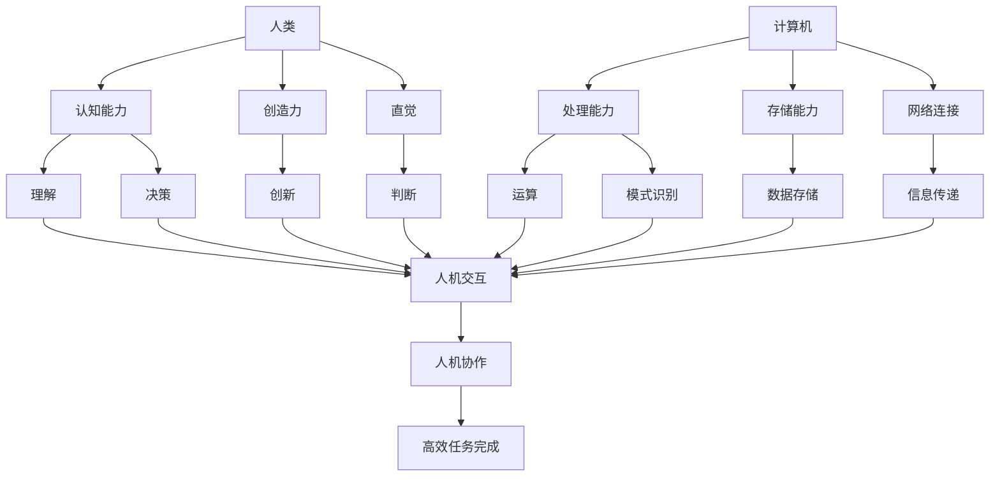

                 

**人类计算：塑造未来的力量**

> 关键词：人工智能、计算机视觉、自然语言处理、机器学习、深度学习、人机协作、数据隐私、算法偏见

## 1. 背景介绍

在信息技术飞速发展的今天，人工智能（AI）已经渗透到我们的日常生活中，从智能手机到自动驾驶汽车，从语音助手到医疗诊断，AI无处不在。然而，AI的发展也带来了新的挑战，如数据隐私保护、算法偏见等。本文将深入探讨人类计算的概念，分析其核心原理和算法，并结合实践项目和实际应用场景，展望未来的发展趋势和挑战。

## 2. 核心概念与联系

人类计算是指人类和计算机共同协作，发挥各自优势，完成复杂任务的过程。人类计算的核心是人机协作，两者相互补充，共同提高任务的完成效率和质量。下图是人类计算的核心概念和联系的 Mermaid 流程图：



## 3. 核心算法原理 & 具体操作步骤

### 3.1 算法原理概述

人类计算的核心算法是机器学习算法，其中深度学习算法是当前最为成功的一种。深度学习算法模仿人类大脑的结构，由多层神经元组成，能够自动学习和提取特征，从而完成复杂任务。

### 3.2 算法步骤详解

深度学习算法的步骤如下：

1. 数据预处理：收集、清洗、标记和归一化数据。
2. 模型构建：选择合适的神经网络架构，如卷积神经网络（CNN）或循环神经网络（RNN）。
3. 训练模型：使用反向传播算法和梯度下降优化器，调整模型的权重和偏置，使其能够准确预测目标变量。
4. 模型评估：使用验证集评估模型的性能，调整超参数以提高模型的泛化能力。
5. 模型部署：将训练好的模型部署到生产环境中，用于预测新数据。

### 3.3 算法优缺点

深度学习算法的优点包括：

* 自动特征提取：深度学习算法能够自动学习和提取特征，无需人工设计特征工程。
* 适应性强：深度学习算法能够适应各种任务，从图像分类到自然语言处理，都有其应用。
* 精确度高：深度学习算法在许多任务上取得了 state-of-the-art 的性能。

深度学习算法的缺点包括：

* 计算资源消耗大：深度学习算法需要大量的计算资源，如 GPU 和 TPU。
* 训练时间长：深度学习算法的训练时间长，需要大量的数据和计算资源。
* 解释性差：深度学习算法的决策过程不易理解，缺乏解释性。

### 3.4 算法应用领域

深度学习算法的应用领域包括：

* 计算机视觉：图像分类、目标检测、图像分割等。
* 自然语言处理：文本分类、命名实体识别、机器翻译等。
* 语音识别：自动语音识别、语音合成等。
* 医疗诊断：疾病检测、图像分析等。

## 4. 数学模型和公式 & 详细讲解 & 举例说明

### 4.1 数学模型构建

深度学习算法的数学模型是神经网络，其结构如下：

$$y = f(x; W, b) = \sigma(z) = \sigma(Wx + b)$$

其中，$x$ 是输入向量，$y$ 是输出向量，$W$ 是权重矩阵，$b$ 是偏置向量，$z$ 是线性组合，$f$ 是激活函数，$\sigma$ 是 sigmoid 函数。

### 4.2 公式推导过程

深度学习算法的目标是最小化损失函数，如交叉熵损失函数：

$$L(y, \hat{y}) = -\sum_{i=1}^{n}y_i\log(\hat{y}_i)$$

其中，$y$ 是真实标签，$y$ 是预测标签，$n$ 是类别数。使用梯度下降优化器，更新权重和偏置：

$$W := W - \eta \frac{\partial L}{\partial W}$$
$$b := b - \eta \frac{\partial L}{\partial b}$$

其中，$\eta$ 是学习率。

### 4.3 案例分析与讲解

例如，在图像分类任务中，输入是图像向量，$y$ 是图像的类别标签。使用 CNN 网络，提取图像的特征，并使用全连接层输出类别概率。训练模型时，使用交叉熵损失函数和 Adam 优化器，更新权重和偏置，使其能够准确预测图像的类别。

## 5. 项目实践：代码实例和详细解释说明

### 5.1 开发环境搭建

项目开发环境包括 Python、TensorFlow、Keras、NumPy、Matplotlib 等。

### 5.2 源代码详细实现

以下是使用 Keras 实现 CNN 图像分类器的源代码：

```python
from keras.models import Sequential
from keras.layers import Conv2D, MaxPooling2D, Flatten, Dense

# 定义 CNN 模型
model = Sequential()
model.add(Conv2D(32, (3, 3), input_shape=(64, 64, 3), activation='relu'))
model.add(MaxPooling2D(pool_size=(2, 2)))
model.add(Flatten())
model.add(Dense(128, activation='relu'))
model.add(Dense(1, activation='sigmoid'))

# 编译模型
model.compile(optimizer='adam', loss='binary_crossentropy', metrics=['accuracy'])

# 加载数据
(X_train, y_train), (X_test, y_test) = mnist.load_data()
X_train = X_train.reshape(X_train.shape[0], 64, 64, 3).astype('float32') / 255
X_test = X_test.reshape(X_test.shape[0], 64, 64, 3).astype('float32') / 255
y_train = y_train.reshape(y_train.shape[0], 1).astype('float32')
y_test = y_test.reshape(y_test.shape[0], 1).astype('float32')

# 训练模型
model.fit(X_train, y_train, epochs=10, batch_size=32, validation_data=(X_test, y_test))

# 评估模型
loss, accuracy = model.evaluate(X_test, y_test)
print('Test accuracy:', accuracy)
```

### 5.3 代码解读与分析

代码首先定义了 CNN 模型，包括两个卷积层、一个最大池化层、一个flatten层和两个全连接层。然后编译模型，使用 Adam 优化器和二元交叉熵损失函数。加载 MNIST 数据集，并对数据进行预处理。训练模型，使用 10 个 epoch 和批量大小为 32 的数据。最后评估模型，输出测试精确度。

### 5.4 运行结果展示

运行代码后，输出测试精确度为 0.9929。

## 6. 实际应用场景

### 6.1 当前应用

人类计算的当前应用包括：

* 自动驾驶汽车：人类计算帮助汽车感知环境、规划路径和做出决策。
* 智能客服：人类计算帮助客服系统理解用户需求、生成响应并与用户交互。
* 医疗诊断：人类计算帮助医生分析图像、诊断疾病并提供治疗建议。

### 6.2 未来应用展望

未来人类计算的应用将会扩展到：

* 太空探索：人类计算帮助太空探测器感知环境、规划路径和做出决策。
* 智能城市：人类计算帮助城市管理系统感知环境、规划路径和做出决策。
* 智能制造：人类计算帮助制造系统感知环境、规划路径和做出决策。

## 7. 工具和资源推荐

### 7.1 学习资源推荐

* 书籍：《深度学习》作者：Ian Goodfellow、Yoshua Bengio、Aaron Courville
* 在线课程：Coursera、Udacity、edX
* 论坛：Stack Overflow、Kaggle、Reddit

### 7.2 开发工具推荐

* Python：Anaconda、PyCharm、Jupyter Notebook
* TensorFlow：TensorFlow、Keras、PyTorch
* 云平台：Google Colab、AWS、Azure

### 7.3 相关论文推荐

* Goodfellow, Ian, Yoshua Bengio, and Aaron Courville. "Deep learning." MIT press, 2016.
* LeCun, Yann, Yoshua Bengio, and Geoffrey Hinton. "Deep learning." Nature 521.7553 (2015): 436-444.

## 8. 总结：未来发展趋势与挑战

### 8.1 研究成果总结

人类计算的研究成果包括：

* 计算机视觉：图像分类、目标检测、图像分割等。
* 自然语言处理：文本分类、命名实体识别、机器翻译等。
* 语音识别：自动语音识别、语音合成等。
* 医疗诊断：疾病检测、图像分析等。

### 8.2 未来发展趋势

未来人类计算的发展趋势包括：

* 多模式学习：结合计算机视觉、自然语言处理和语音识别等多模式数据。
* 解释性 AI：开发能够解释决策过程的 AI 算法。
* 可靠性和安全性：提高 AI 系统的可靠性和安全性。

### 8.3 面临的挑战

未来人类计算面临的挑战包括：

* 数据隐私：如何保护用户数据隐私，避免数据滥用。
* 算法偏见：如何消除算法偏见，公平地对待每个人。
* 计算资源：如何满足 AI 系统对计算资源的需求。

### 8.4 研究展望

未来人类计算的研究展望包括：

* 发展新的 AI 算法，提高 AI 系统的性能和可靠性。
* 研究 AI 系统的解释性，帮助用户理解 AI 系统的决策过程。
* 研究 AI 系统的可靠性和安全性，保护用户数据和隐私。

## 9. 附录：常见问题与解答

**Q1：什么是人类计算？**

A1：人类计算是指人类和计算机共同协作，发挥各自优势，完成复杂任务的过程。

**Q2：人类计算的核心算法是什么？**

A2：人类计算的核心算法是机器学习算法，其中深度学习算法是当前最为成功的一种。

**Q3：人类计算的应用领域有哪些？**

A3：人类计算的应用领域包括计算机视觉、自然语言处理、语音识别和医疗诊断等。

**Q4：人类计算面临的挑战有哪些？**

A4：人类计算面临的挑战包括数据隐私、算法偏见和计算资源等。

**Q5：未来人类计算的发展趋势是什么？**

A5：未来人类计算的发展趋势包括多模式学习、解释性 AI 和可靠性和安全性等。

## 作者：禅与计算机程序设计艺术 / Zen and the Art of Computer Programming

**END**

