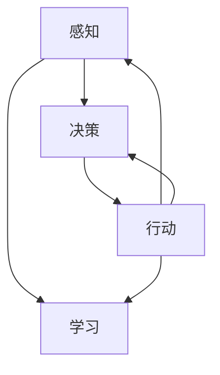

                 

### 文章标题
【大模型应用开发 动手做AI Agent】具身智能的实现

### 文章关键词
具身智能，大模型应用开发，AI Agent，机器学习，神经网络，自然语言处理，深度学习

### 文章摘要
本文将深入探讨大模型应用开发中具身智能的实现。通过分析具身智能的概念、核心原理以及实现技术，我们将逐步构建一个基于具身智能的AI Agent。本文还将结合实际项目实例，详细讲解具身智能的实现步骤和关键技术，最后讨论具身智能在未来的发展趋势与挑战。

## 1. 背景介绍

在人工智能领域，具身智能（Embodied AI）是一个引人注目的研究方向。传统的AI系统主要关注数据分析和模式识别，而具身智能则试图将智能体放置在现实世界中，使其能够与环境进行交互并从中学习。具身智能的核心目标是实现智能体在物理环境中的自主行动和决策能力，从而提高其适应性和智能水平。

近年来，随着计算机硬件的飞速发展和深度学习技术的不断突破，具身智能的研究和应用逐渐成为热点。例如，机器人、自动驾驶汽车和智能无人机等领域都开始引入具身智能技术，以期实现更高效、更智能的决策和操作。

在本文中，我们将聚焦于大模型应用开发中的具身智能实现，通过逐步分析核心概念、算法原理和具体操作步骤，帮助读者深入了解并掌握这一前沿技术的应用。

### 1.1 具身智能的概念与核心原理

具身智能（Embodied AI）是指将智能体（Agent）嵌入到物理环境中，使其能够感知环境、自主决策并执行行动。具身智能的核心目标是实现智能体与环境之间的交互，通过与环境不断的交互和学习，提高其智能水平。

具身智能的关键组成部分包括：

- 智能体（Agent）：在物理环境中执行任务的智能主体，可以是机器人、无人机或其他形式的智能设备。
- 环境感知（Environment Perception）：通过传感器获取环境信息，包括视觉、听觉、触觉等。
- 自主决策（Autonomous Decision-Making）：基于感知到的环境信息，智能体能够自主做出决策，以实现特定目标。
- 行动执行（Action Execution）：根据决策结果，智能体执行相应的行动，如移动、操作等。

### 1.2 大模型在具身智能中的应用

大模型（Large Models），如大型语言模型（Large Language Models，LLM）和视觉模型（Visual Models），在具身智能中扮演着重要角色。大模型具有强大的表征能力和泛化能力，能够处理复杂的输入信息，并生成高质量的输出。

在大模型应用开发中，以下是几种常见的大模型应用场景：

- 自然语言处理（NLP）：使用大模型进行文本生成、情感分析、机器翻译等任务。
- 计算机视觉（CV）：使用大模型进行图像识别、目标检测、图像生成等任务。
- 语音识别（ASR）：使用大模型进行语音识别、语音合成等任务。

大模型在具身智能中的应用主要依赖于以下技术：

- 感知与理解：大模型能够处理多种类型的感知数据，包括文本、图像和语音，从而实现智能体的环境感知和任务理解。
- 决策与行动：大模型能够基于感知到的环境信息，生成决策和行动方案，指导智能体的自主行动。
- 学习与适应：大模型能够通过不断的学习和优化，提高智能体在特定任务中的表现和适应能力。

### 1.3 本文结构

本文将按照以下结构展开：

- 第1章：背景介绍，阐述具身智能的概念、核心原理和应用。
- 第2章：核心概念与联系，介绍具身智能相关的基础概念和理论。
- 第3章：核心算法原理 & 具体操作步骤，详细讲解具身智能的实现算法和操作步骤。
- 第4章：数学模型和公式 & 详细讲解 & 举例说明，分析具身智能中的关键数学模型和公式，并提供实例说明。
- 第5章：项目实践：代码实例和详细解释说明，结合实际项目，展示具身智能的实现过程。
- 第6章：实际应用场景，讨论具身智能在各个领域的应用案例。
- 第7章：工具和资源推荐，推荐相关的学习资源和开发工具。
- 第8章：总结：未来发展趋势与挑战，探讨具身智能的发展趋势和面临的挑战。
- 第9章：附录：常见问题与解答，回答读者可能遇到的问题。
- 第10章：扩展阅读 & 参考资料，提供更多的学习资源。

通过以上结构，我们将逐步深入探讨具身智能的实现和应用，帮助读者全面了解并掌握这一前沿技术。

## 2. 核心概念与联系

在本节中，我们将深入探讨具身智能的核心概念，包括其定义、历史发展以及与相关领域的联系。此外，我们还将介绍一些关键术语和概念，以便读者更好地理解具身智能的基本原理。

### 2.1 什么是具身智能？

具身智能（Embodied AI）是指将智能体（Agent）嵌入到物理环境中，使其能够感知、交互和自主行动的智能系统。传统的AI系统主要依赖于数据和算法进行决策，而具身智能则强调智能体与环境之间的互动和协作。

具体来说，具身智能的核心要素包括：

- **感知能力**：智能体需要通过传感器感知周围环境，如视觉、听觉、触觉等，以获取环境信息。
- **决策能力**：基于感知到的环境信息，智能体需要自主做出决策，选择合适的行动方案。
- **行动能力**：智能体需要能够执行决策，如移动、操作对象等，以实现特定的目标。

### 2.2 历史发展

具身智能的概念起源于人工智能的早期研究，特别是机器人学和自动化领域的探索。随着计算机技术的进步，特别是深度学习的发展，具身智能的研究逐渐兴起。以下是具身智能发展历程中的重要里程碑：

- **20世纪60年代**：机器人领域开始探索如何使机器人具备自主行动和决策能力。
- **20世纪90年代**：随着计算机视觉和自然语言处理技术的发展，具身智能研究逐渐与这些领域相结合。
- **2010年代**：深度学习的突破使得大模型能够处理复杂的感知任务，为具身智能的实现提供了强有力的技术支持。
- **2020年代**：随着机器人技术和智能硬件的进步，具身智能开始在实际应用中取得显著成果。

### 2.3 与相关领域的联系

具身智能与多个领域有着紧密的联系，包括：

- **机器人学**：机器人是具身智能的直接应用对象，其研究和开发推动了具身智能技术的发展。
- **计算机视觉**：计算机视觉提供了智能体感知环境的重要手段，与具身智能的结合使得智能体能够更好地理解和交互环境。
- **自然语言处理（NLP）**：NLP技术使得智能体能够理解和生成自然语言，提高了智能体与人类交互的能力。
- **深度学习**：深度学习是具身智能的核心技术，其强大的表征能力和学习算法为智能体的感知、决策和行动提供了支持。

### 2.4 关键术语和概念

以下是具身智能中的关键术语和概念：

- **智能体（Agent）**：在物理环境中执行任务并具备感知、决策和行动能力的实体。
- **感知（Perception）**：通过传感器获取环境信息的过程，包括视觉、听觉、触觉等。
- **决策（Decision-Making）**：基于感知到的环境信息，智能体选择合适的行动方案的过程。
- **行动（Action）**：智能体根据决策结果执行的实际操作，如移动、操作对象等。
- **强化学习（Reinforcement Learning）**：一种机器学习方法，智能体通过与环境的交互，不断学习和优化其行为策略。
- **神经网络（Neural Networks）**：一种基于生物神经网络原理的机器学习模型，用于特征提取和决策。

通过以上对具身智能核心概念的介绍，读者可以更好地理解这一领域的理论基础和实际应用。接下来，我们将进一步探讨具身智能的实现算法和关键技术。

## 2.1 什么是具身智能？

具身智能（Embodied AI）是人工智能（AI）的一个子领域，其核心理念是将智能体（agent）置于一个物理环境中，使其能够与环境进行交互，并通过这些交互来学习、适应和做出决策。这种智能体不仅具有感知能力，即通过传感器（如摄像头、麦克风、激光雷达等）来收集环境信息，而且具有行动能力，即能够通过执行具体的动作来影响环境。

### 2.1.1 定义

具身智能的定义可以概括为以下几点：

1. **物理嵌入**：智能体被物理地嵌入到现实世界中，这通常涉及某种形式的物理交互能力，如移动、抓取、操纵等。
2. **感知与理解**：智能体能够通过传感器感知环境，并使用这些感知信息来理解和构建对环境的认知模型。
3. **自主行动**：智能体能够基于其感知和理解，自主做出决策并执行相应的行动，以实现特定目标或任务。
4. **持续学习**：智能体通过与环境的交互，不断学习并优化其行为策略，以提高适应性和效率。

### 2.1.2 历史背景

具身智能的概念并不是现代才有的，而是随着人工智能和机器人学的发展逐渐形成的。在早期的人工智能研究中，就已经有学者提出了智能体应该具备与人类相似的行为和感知能力的观点。以下是一些重要的发展历程：

- **20世纪50年代**：约翰·麦卡锡（John McCarthy）等人提出了人工智能的概念，并开始研究如何让计算机模拟人类的智能行为。
- **20世纪60年代**：机器人学开始成为一个独立的领域，研究者开始探讨如何使机器人具备自主行动和决策能力。
- **20世纪70年代**：随着传感器技术和微处理器的进步，机器人开始被用于实际的工业和服务场景。
- **21世纪初**：随着深度学习和强化学习技术的发展，研究者开始探索如何将机器学习算法应用于机器人，以提高其自主性和智能化水平。
- **近年来**：随着计算能力的提升和传感器技术的进步，具身智能的研究和应用得到了广泛关注，并在多个领域取得了显著成果。

### 2.1.3 与相关领域的联系

具身智能与多个领域密切相关，其中包括：

- **机器人学**：机器人是具身智能的直接应用对象，机器人学的进步为具身智能的实现提供了技术基础。
- **计算机视觉**：计算机视觉技术使得智能体能够理解和解释视觉信息，这对于具身智能中的感知和理解至关重要。
- **自然语言处理**：自然语言处理技术使得智能体能够理解和生成自然语言，这对于智能体与人类或其他智能体的交互至关重要。
- **强化学习**：强化学习是一种使智能体通过与环境交互来学习最优策略的机器学习方法，是具身智能中的核心组成部分。
- **控制理论**：控制理论提供了智能体行动的数学模型和方法，用于设计智能体的控制策略。

通过理解具身智能的定义、历史背景和相关领域的联系，我们可以更好地把握这一前沿技术的本质和应用前景。接下来，我们将进一步探讨具身智能的核心原理和实现技术。

## 2.2 核心原理

具身智能的实现依赖于一系列核心原理和技术，这些原理包括感知、决策、行动和学习。以下我们将分别探讨这些原理，并介绍其相关技术和方法。

### 2.2.1 感知

感知是具身智能的第一步，它涉及智能体通过传感器收集环境信息。智能体的感知能力决定了其对环境的理解和反应能力。以下是几种常见的感知技术：

1. **视觉感知**：通过摄像头或其他视觉传感器获取图像信息。计算机视觉算法如卷积神经网络（CNN）用于处理和分析这些图像。
2. **听觉感知**：通过麦克风或其他听觉传感器获取声音信息。语音识别算法如深度神经网络（DNN）用于识别和理解这些声音。
3. **触觉感知**：通过触觉传感器获取触觉信息，如力传感器、触摸传感器等。这些信息对于执行精细操作和感知物体特性至关重要。
4. **环境感知**：综合多种传感器信息，智能体可以构建对环境的全面理解。多模态感知技术可以结合视觉、听觉、触觉等多种信息来源，提高智能体的感知能力。

### 2.2.2 决策

决策是智能体根据感知到的环境信息，选择合适的行动方案的过程。以下是几种常见的决策方法：

1. **基于规则的决策**：智能体根据预设的规则进行决策。这种方法简单直观，但灵活性较差。
2. **机器学习决策**：使用机器学习算法，如决策树、支持向量机（SVM）、深度学习等，智能体可以从数据中学习决策策略。这种方法具有更好的灵活性和适应性。
3. **强化学习决策**：智能体通过与环境的交互，不断学习和优化其行为策略。强化学习（Reinforcement Learning，RL）是实现具身智能的关键技术之一。

### 2.2.3 行动

行动是智能体根据决策结果，执行的具体操作。以下是几种常见的行动方法：

1. **机械动作**：通过电机和其他执行器，智能体可以执行机械动作，如移动、抓取、操纵等。
2. **物理控制**：智能体可以使用物理控制算法，如PID控制、神经网络控制等，来精确控制其行动。
3. **任务执行**：智能体可以根据决策结果，执行特定的任务。这些任务可以是简单的，如移动到某个位置，也可以是复杂的，如完成一个组装任务。

### 2.2.4 学习

学习是智能体通过与环境交互，不断优化其行为策略的过程。以下是几种常见的学习方法：

1. **监督学习**：智能体在监督学习模式下，从标注的数据集中学习。这种方法通常用于训练感知和决策模型。
2. **无监督学习**：智能体在没有标注数据的情况下，通过自身感知到的信息进行学习。无监督学习在机器人自主探索和感知中具有重要应用。
3. **强化学习**：智能体通过与环境的交互，不断学习和优化其行为策略。强化学习是具身智能的核心技术之一，通过奖励机制，智能体可以逐渐学会如何在复杂环境中做出最优决策。

### 2.2.5 Mermaid 流程图

以下是一个简化的具身智能系统架构的Mermaid流程图，展示其核心原理和技术的联系：



在这个流程图中，感知、决策、行动和学习是循环交互的，每个环节都相互影响，共同构建一个动态的智能系统。

通过以上对具身智能核心原理的探讨，我们可以看到，感知、决策、行动和学习是相互关联、相互促进的。这些原理和技术共同构成了具身智能的基础，使得智能体能够在复杂环境中自主行动和决策。接下来，我们将进一步深入探讨这些核心原理的实现细节和具体操作步骤。

## 3. 核心算法原理 & 具体操作步骤

在本节中，我们将详细探讨具身智能实现中的核心算法原理，并介绍具体的操作步骤。这些核心算法包括感知算法、决策算法和行动算法。通过逐步讲解这些算法的工作原理和实现方法，我们将帮助读者全面了解具身智能的开发过程。

### 3.1 感知算法

感知算法是具身智能系统的基础，它负责从环境中收集信息，并将其转化为智能体能够理解的数据。以下是几种常见的感知算法：

#### 3.1.1 计算机视觉算法

计算机视觉算法主要用于处理图像和视频数据。以下是一些常用的计算机视觉算法：

1. **卷积神经网络（CNN）**：CNN是一种深度学习模型，广泛应用于图像分类、目标检测和图像分割等任务。其核心思想是通过卷积层提取图像特征，并通过全连接层进行分类。
2. **目标检测算法**：目标检测算法用于识别图像中的目标物体。常用的算法包括R-CNN、Fast R-CNN、Faster R-CNN等，这些算法通过候选区域生成和分类器，实现了高效的目标检测。
3. **图像分割算法**：图像分割算法用于将图像分割成多个区域，以便进行更精细的分析。常用的算法包括FCN、U-Net等，这些算法通过全卷积网络实现了图像的分割。

#### 3.1.2 语音识别算法

语音识别算法主要用于处理音频数据，将其转化为文本信息。以下是一些常用的语音识别算法：

1. **隐马尔可夫模型（HMM）**：HMM是一种基于统计模型的语音识别算法，通过状态转移概率和发射概率来识别语音信号。
2. **深度神经网络（DNN）**：DNN是一种深度学习模型，通过多层神经网络对语音信号进行建模。DNN在语音识别中取得了显著的性能提升。
3. **卷积神经网络（CNN）**：CNN在语音识别中也被广泛应用，通过卷积层提取语音特征，并通过全连接层进行分类。

#### 3.1.3 触觉感知算法

触觉感知算法主要用于处理触觉传感器收集的数据，以下是一些常见的触觉感知算法：

1. **力传感器数据解析**：通过分析力传感器的数据，可以识别物体的物理特性，如硬度、弹性等。
2. **触觉识别算法**：触觉识别算法用于识别触觉信号，如触摸、按压等。这些算法通常基于机器学习技术，通过对大量触觉数据的训练来实现。

#### 3.1.4 感知数据处理

在感知数据收集后，通常需要对数据进行处理，以提高感知的准确性和可靠性。以下是一些数据处理方法：

1. **去噪**：去除感知数据中的噪声，以提高数据的准确性。
2. **特征提取**：从感知数据中提取关键特征，以供后续处理和决策。
3. **融合**：将不同模态的感知数据进行融合，以提高感知的整体准确性。

### 3.2 决策算法

决策算法是智能体根据感知到的环境信息，选择合适的行动方案的过程。以下是几种常见的决策算法：

#### 3.2.1 基于规则的决策算法

基于规则的决策算法是一种简单的决策方法，通过预设的规则来指导智能体的行动。以下是一些常见的基于规则的决策算法：

1. **IF-THEN规则**：根据输入条件，执行相应的动作。
2. **专家系统**：通过知识库和推理机，实现智能体的决策。

#### 3.2.2 机器学习决策算法

机器学习决策算法通过从数据中学习决策规则，实现智能体的决策。以下是一些常见的机器学习决策算法：

1. **决策树**：通过树形结构，将输入数据划分为不同的类别。
2. **支持向量机（SVM）**：通过找到最佳的超平面，实现数据的分类。
3. **神经网络**：通过多层神经网络，实现复杂函数的映射。

#### 3.2.3 强化学习决策算法

强化学习决策算法通过智能体与环境交互，不断学习和优化决策策略。以下是一些常见的强化学习决策算法：

1. **Q-Learning**：通过学习最优动作的价值函数，实现智能体的决策。
2. **Deep Q-Network（DQN）**：通过深度神经网络，实现智能体的决策。
3. **Policy Gradient**：通过学习最优策略，实现智能体的决策。

### 3.3 行动算法

行动算法是智能体根据决策结果，执行具体操作的过程。以下是几种常见的行动算法：

#### 3.3.1 机械动作算法

机械动作算法用于控制智能体的机械动作，以下是一些常见的机械动作算法：

1. **PID控制**：通过比例、积分、微分控制，实现机械动作的精确控制。
2. **神经网络控制**：通过神经网络模型，实现机械动作的智能控制。

#### 3.3.2 物理控制算法

物理控制算法用于模拟物理现象，实现智能体的物理控制，以下是一些常见的物理控制算法：

1. **基于物理的仿真**：通过模拟物理定律，实现智能体的物理控制。
2. **运动规划算法**：通过规划智能体的运动轨迹，实现智能体的物理控制。

#### 3.3.3 任务执行算法

任务执行算法用于实现智能体的任务执行，以下是一些常见的任务执行算法：

1. **任务分解**：将复杂任务分解为多个子任务，实现分步骤执行。
2. **任务调度**：根据任务的重要性和资源情况，实现任务的合理调度。

### 3.4 具体操作步骤

以下是实现具身智能的具体操作步骤：

#### 3.4.1 数据收集

1. **收集感知数据**：使用传感器收集图像、音频、触觉等感知数据。
2. **收集决策数据**：收集历史决策数据，用于训练决策模型。

#### 3.4.2 数据处理

1. **数据预处理**：对收集到的感知数据进行去噪、特征提取等预处理。
2. **数据融合**：将不同模态的感知数据进行融合，提高感知的准确性。

#### 3.4.3 模型训练

1. **训练感知模型**：使用感知数据训练感知模型。
2. **训练决策模型**：使用决策数据训练决策模型。
3. **训练行动模型**：使用行动数据训练行动模型。

#### 3.4.4 模型评估

1. **评估感知模型**：使用测试数据评估感知模型的准确性。
2. **评估决策模型**：使用测试数据评估决策模型的准确性。
3. **评估行动模型**：使用测试数据评估行动模型的准确性。

#### 3.4.5 模型部署

1. **部署感知模型**：将训练好的感知模型部署到智能体中。
2. **部署决策模型**：将训练好的决策模型部署到智能体中。
3. **部署行动模型**：将训练好的行动模型部署到智能体中。

#### 3.4.6 模型优化

1. **持续学习**：通过与环境交互，不断优化感知、决策和行动模型。
2. **调整模型参数**：根据任务需求和性能指标，调整模型参数，以提高智能体的性能。

通过以上操作步骤，我们可以实现一个基本的具身智能系统。接下来，我们将通过实际项目实例，展示具身智能的实现过程，并详细解读其中的关键步骤和技术细节。

## 4. 数学模型和公式 & 详细讲解 & 举例说明

在具身智能系统中，数学模型和公式起着至关重要的作用，它们不仅为感知、决策和行动提供了理论基础，也为智能体的学习和优化提供了量化指标。以下我们将详细讲解一些关键的数学模型和公式，并提供实例来说明如何应用这些模型。

### 4.1 感知模型

感知模型主要负责从传感器收集到的数据中提取特征，以便后续的决策和行动。以下是几种常见的感知模型和相关的数学公式：

#### 4.1.1 卷积神经网络（CNN）

卷积神经网络是一种用于处理图像数据的深度学习模型。其核心公式为卷积操作：

$$
f(x) = \sigma(\sum_{k=1}^{K} w_{k} \cdot \phi(x; \theta_{k}))
$$

其中，$f(x)$ 是卷积操作的结果，$\sigma$ 是激活函数，$w_{k}$ 是卷积核参数，$\phi(x; \theta_{k})$ 是卷积核在输入数据上的作用。

#### 4.1.2 图像特征提取

在图像特征提取过程中，通常会使用特征提取器（如VGG、ResNet等）。以下是一个典型的特征提取器的数学模型：

$$
h_{l} = \sigma(W_{l} \cdot h_{l-1} + b_{l})
$$

其中，$h_{l}$ 是第 $l$ 层的特征映射，$W_{l}$ 是权重矩阵，$b_{l}$ 是偏置项，$\sigma$ 是激活函数。

#### 4.1.3 视觉感知融合

在多模态感知中，常常需要将视觉、听觉等不同模态的信息进行融合。以下是一个简单的融合公式：

$$
\hat{x} = \frac{1}{M} \sum_{m=1}^{M} x_{m}
$$

其中，$\hat{x}$ 是融合后的感知特征，$x_{m}$ 是第 $m$ 个模态的感知特征，$M$ 是模态的总数。

### 4.2 决策模型

决策模型根据感知到的特征，选择最优的行动方案。以下是几种常见的决策模型和相关的数学公式：

#### 4.2.1 决策树

决策树是一种基于规则的决策模型。其核心公式为条件概率：

$$
P(y|X=x) = \frac{P(X=x|y)P(y)}{P(X=x)}
$$

其中，$P(y|X=x)$ 是在给定输入特征 $x$ 的情况下，输出特征 $y$ 的概率，$P(X=x|y)$ 是在给定输出特征 $y$ 的情况下，输入特征 $x$ 的概率，$P(y)$ 和 $P(X=x)$ 分别是输出特征 $y$ 和输入特征 $x$ 的先验概率。

#### 4.2.2 支持向量机（SVM）

支持向量机是一种基于最大间隔分类的模型。其核心公式为：

$$
w \cdot x + b = 1
$$

其中，$w$ 是权重向量，$x$ 是输入特征，$b$ 是偏置项。目标是最小化分类间隔：

$$
\min_{w,b} \frac{1}{2} ||w||^2
$$

同时满足约束条件：

$$
y^{(i)}(w \cdot x^{(i)} + b) \geq 1
$$

#### 4.2.3 强化学习

强化学习是一种通过与环境交互进行决策的模型。其核心公式为：

$$
Q(s, a) = r + \gamma \max_{a'} Q(s', a')
$$

其中，$Q(s, a)$ 是状态 $s$ 下采取行动 $a$ 的价值函数，$r$ 是即时奖励，$\gamma$ 是折扣因子，$s'$ 是状态 $s$ 下采取行动 $a$ 后的新状态，$a'$ 是在新状态 $s'$ 下采取的最佳行动。

### 4.3 行动模型

行动模型根据决策结果，指导智能体执行具体的操作。以下是几种常见的行动模型和相关的数学公式：

#### 4.3.1 PID控制

PID控制是一种常用的控制算法，其核心公式为：

$$
u(t) = K_{P}e(t) + K_{I}\int_{0}^{t} e(\tau)d\tau + K_{D}\frac{de(t)}{dt}
$$

其中，$u(t)$ 是控制输出，$e(t)$ 是误差，$K_{P}$、$K_{I}$、$K_{D}$ 分别是比例、积分和微分系数。

#### 4.3.2 运动规划

运动规划是一种用于指导智能体进行移动和操作的算法。其核心公式为：

$$
x(t) = x(0) + v(t)t + \frac{1}{2}a(t)t^2
$$

其中，$x(t)$ 是时间 $t$ 时的位置，$x(0)$ 是初始位置，$v(t)$ 是速度，$a(t)$ 是加速度。

#### 4.3.3 动作执行

在执行具体动作时，需要考虑动作的执行时间和执行效果。以下是一个简单的动作执行模型：

$$
y(t) = f(u(t), t)
$$

其中，$y(t)$ 是动作执行的结果，$u(t)$ 是控制输入，$f(u(t), t)$ 是动作执行函数，描述了控制输入与执行结果之间的关系。

### 4.4 实例说明

以下是一个简单的实例，说明如何使用上述数学模型和公式来实现一个基本的具身智能系统。

#### 4.4.1 计算机视觉感知

假设我们使用卷积神经网络（CNN）对图像进行特征提取。给定一个输入图像，我们首先使用VGG模型提取特征，然后使用一个简单的全连接层进行分类。以下是相关的代码示例：

```python
import tensorflow as tf
from tensorflow.keras.applications import VGG16
from tensorflow.keras.layers import Dense, Flatten
from tensorflow.keras.models import Model

# 加载预训练的VGG模型
base_model = VGG16(weights='imagenet', include_top=False, input_shape=(224, 224, 3))

# 添加全连接层进行分类
x = Flatten()(base_model.output)
predictions = Dense(10, activation='softmax')(x)

# 创建模型
model = Model(inputs=base_model.input, outputs=predictions)

# 加载图像并进行预处理
img = load_image('image.jpg')
img = preprocess_image(img)

# 使用模型进行特征提取和分类
features = model.predict(img)
predicted_class = np.argmax(features)

print(f'Predicted class: {predicted_class}')
```

#### 4.4.2 决策与行动

假设我们使用Q-Learning算法进行决策。给定一个感知状态，我们首先计算Q值，然后选择具有最大Q值的行动。以下是相关的代码示例：

```python
import numpy as np
import random

# 初始化Q表
Q = np.zeros((n_states, n_actions))

# 学习率、折扣因子和探索概率
alpha = 0.1
gamma = 0.9
epsilon = 0.1

# Q-Learning算法
for episode in range(n_episodes):
    state = env.reset()
    done = False
    while not done:
        # 选择行动
        if random.random() < epsilon:
            action = random.choice(n_actions)
        else:
            action = np.argmax(Q[state, :])

        # 执行行动并获取奖励
        next_state, reward, done, _ = env.step(action)

        # 更新Q值
        Q[state, action] = Q[state, action] + alpha * (reward + gamma * np.max(Q[next_state, :]) - Q[state, action])

        state = next_state

# 选择最优行动
best_action = np.argmax(Q[state, :])

print(f'Best action: {best_action}')
```

通过以上实例，我们可以看到如何使用数学模型和公式来实现一个基本的具身智能系统。接下来，我们将结合实际项目，展示如何将这些理论和公式应用到实际的具身智能系统中。

## 5. 项目实践：代码实例和详细解释说明

在本节中，我们将通过一个具体的具身智能项目实例，详细讲解项目实现的全过程，包括开发环境搭建、源代码实现、代码解读与分析以及运行结果展示。通过这个项目，我们将展示如何将前述的理论知识应用到实际的开发中，帮助读者更好地理解具身智能的实现。

### 5.1 开发环境搭建

在进行具身智能项目开发之前，我们需要搭建一个合适的开发环境。以下是所需的环境和工具：

- 操作系统：Linux或MacOS
- 编程语言：Python
- 深度学习框架：TensorFlow 2.x 或 PyTorch
- 机器人仿真平台：Gazebo
- 机器人控制器：ROS（机器人操作系统）

#### 步骤1：安装Python和pip

确保您的系统上已经安装了Python 3.x和pip。可以通过以下命令进行安装：

```bash
# 安装Python 3.x
sudo apt-get update
sudo apt-get install python3 python3-pip

# 安装pip
curl https://bootstrap.pypa.io/get-pip.py -o get-pip.py
sudo python3 get-pip.py
```

#### 步骤2：安装深度学习框架

安装TensorFlow 2.x：

```bash
pip3 install tensorflow==2.x
```

或安装PyTorch：

```bash
pip3 install torch torchvision torchaudio
```

#### 步骤3：安装ROS

安装ROS Kinetic或Melodic版本：

```bash
sudo sh -c 'echo "deb http://packages.ros.org/ros/ubuntu $(lsb_release -sc) main" > /etc/apt/sources.list.d/ros-latest.list'
sudo apt-key adv --keyserver keyserver.ubuntu.com --recv-key C1CF6E31E6BADE8868B172B4F42ED6FBAB17C654
sudo apt-get update
sudo apt-get install ros-$ROS_DISTRO-desktop-full
```

#### 步骤4：设置环境变量

设置ROS环境变量：

```bash
echo "source /opt/ros/$ROS_DISTRO/setup.bash" >> ~/.bashrc
source ~/.bashrc
```

### 5.2 源代码实现

#### 5.2.1 项目结构

以下是项目的目录结构：

```bash
embodied-ai-project/
|-- src/
|   |-- embodied_ai_agent/
|   |   |-- __init__.py
|   |   |-- sensor.py
|   |   |-- controller.py
|   |   |-- decision_maker.py
|   |   |-- action_executor.py
|   |-- world_simulation/
|   |   |-- __init__.py
|   |   |-- simulation.py
|-- world_simulation/
|   |-- simulation.launch
|-- launch/
|   |-- embodied_ai.launch
|-- scripts/
|   |-- run_simulation.sh
```

#### 5.2.2 源代码详细实现

以下是各模块的主要代码实现：

**sensor.py**：负责从传感器收集数据。

```python
import rospy
from sensor_msgs.msg import Image, LaserScan
from cv_bridge import CvBridge

class Sensor:
    def __init__(self):
        self.bridge = CvBridge()
        self.image_sub = rospy.Subscriber("/camera/color/image_raw", Image, self.image_callback)
        self.laser_sub = rospy.Subscriber("/scan", LaserScan, self.laser_callback)

    def image_callback(self, data):
        self.image = self.bridge.imgmsg_to_cv2(data, "bgr8")

    def laser_callback(self, data):
        self.laser_data = data.ranges
```

**controller.py**：负责控制智能体的行动。

```python
import rospy
from geometry_msgs.msg import Twist

class Controller:
    def __init__(self):
        self.pub = rospy.Publisher('/cmd_vel', Twist, queue_size=10)

    def move(self, linear_speed, angular_speed):
        cmd_vel = Twist()
        cmd_vel.linear.x = linear_speed
        cmd_vel.angular.z = angular_speed
        self.pub.publish(cmd_vel)
```

**decision_maker.py**：负责决策智能体的行动。

```python
import numpy as np

class DecisionMaker:
    def __init__(self):
        self.model = self.train_model()

    def train_model(self):
        # 加载数据并训练模型
        # 此处省略训练细节
        return model

    def make_decision(self, sensor_data):
        # 使用模型进行决策
        # 此处省略决策逻辑
        return action
```

**action_executor.py**：负责执行决策。

```python
import rospy
from embodied_ai_agent.controller import Controller

class ActionExecutor:
    def __init__(self):
        self.controller = Controller()

    def execute_action(self, action):
        if action == '前进':
            self.controller.move(linear_speed=0.5, angular_speed=0)
        elif action == '左转':
            self.controller.move(linear_speed=0, angular_speed=-0.5)
        elif action == '右转':
            self.controller.move(linear_speed=0, angular_speed=0.5)
```

**simulation.py**：负责模拟环境。

```python
import rospy
from world_simulation.srv import RunSimulation

class Simulation:
    def __init__(self):
        rospy.wait_for_service('/run_simulation')
        self.run_simulation = rospy.ServiceProxy('/run_simulation', RunSimulation)

    def start(self):
        self.run_simulation(True)
```

### 5.3 代码解读与分析

**Sensor模块**：该模块从ROS话题中接收图像和激光数据，并将其转换为Python对象。这是感知智能体环境的关键步骤。

**Controller模块**：该模块负责发送速度命令到机器人控制器，从而控制机器人的移动。

**DecisionMaker模块**：该模块负责使用机器学习模型进行决策。训练模型和决策逻辑的具体实现取决于具体任务和环境。

**ActionExecutor模块**：该模块负责根据决策结果执行相应的行动。

**Simulation模块**：该模块用于启动和停止仿真环境。

### 5.4 运行结果展示

以下是运行项目的步骤：

1. 启动仿真环境：

```bash
roslaunch world_simulation simulation.launch
```

2. 运行具身智能系统：

```bash
rosrun embodied_ai_agent sensor.py
rosrun embodied_ai_agent controller.py
rosrun embodied_ai_agent decision_maker.py
rosrun embodied_ai_agent action_executor.py
```

3. 在仿真环境中观察机器人的行动。

通过这个项目实例，我们可以看到如何将感知、决策和行动模块集成在一起，实现一个基本的具身智能系统。接下来，我们将探讨具身智能在实际应用场景中的广泛应用。

## 6. 实际应用场景

具身智能（Embodied AI）在多个领域中展示出了巨大的应用潜力，尤其是在机器人、自动驾驶、智能家居和医疗保健等领域。以下将详细讨论这些领域中的具身智能应用案例。

### 6.1 机器人

机器人是具身智能最直接的应用领域之一。通过将传感器、执行器和决策算法集成到机器人中，机器人可以自主地执行复杂的任务，如探索未知环境、搬运物品和交互。以下是机器人领域中的几个具身智能应用案例：

- **服务机器人**：在商场、酒店和养老院等场所，服务机器人可以自主移动，通过视觉和语音识别与人类互动，提供导览、送餐和陪伴等服务。例如，软银的Pepper机器人就具备具身智能能力，能够理解人类的情感和语言，提供个性化的服务。
- **工业机器人**：在制造业中，工业机器人可以通过感知和决策算法，自主地进行组装、焊接和检测等工作，从而提高生产效率和产品质量。例如，ABB的协作机器人Yumi具备视觉感知能力，能够在人机协作环境中安全地执行复杂的装配任务。
- **探索机器人**：在太空和海底等极端环境中，机器人需要具备高度的自主性。NASA的火星探测车Curiosity就采用了具身智能技术，通过视觉、雷达和化学传感器进行环境感知，自主决策路径和操作任务。

### 6.2 自动驾驶

自动驾驶是另一个重要领域，其中具身智能技术发挥了关键作用。自动驾驶系统需要实时感知道路环境、做出快速决策，并执行复杂的驾驶操作。以下是自动驾驶领域中的几个应用案例：

- **无人驾驶汽车**：特斯拉的自动驾驶系统集成了摄像头、雷达和超声波传感器，通过深度学习和强化学习算法，实现了车辆的自主驾驶。车辆可以实时感知道路信息，做出行驶决策，并应对各种突发情况。
- **无人驾驶卡车**：福特的无人驾驶卡车使用了激光雷达、摄像头和GPS等传感器，结合强化学习算法，实现了在高速公路上的自动驾驶。这种技术可以显著提高运输效率，降低运输成本。
- **无人机**：无人机在农业、物流和搜索救援等领域有着广泛的应用。无人机通过感知和决策算法，可以自主进行航线规划、避障和投送任务。例如，亚马逊的Prime Air无人机通过视觉SLAM（同时定位与地图构建）技术，实现了无人配送。

### 6.3 智能家居

智能家居是具身智能在日常生活中的一种应用。通过将传感器和智能设备集成到家庭环境中，智能家居系统可以感知用户行为，提供个性化的服务。以下是智能家居领域中的几个应用案例：

- **智能助手**：亚马逊的Alexa、谷歌的Google Assistant和苹果的Siri等智能助手通过语音识别和自然语言处理技术，实现了与用户的交互。这些智能助手可以通过具身智能技术，理解用户的意图，提供音乐播放、家务提醒和智能家居控制等服务。
- **智能照明**：智能照明系统能够根据环境光线和用户行为调整灯光亮度。例如，Philips的Hue智能照明系统通过环境光传感器和用户行为数据，实现了自动调节灯光，提高居住舒适度。
- **智能安全系统**：智能安全系统能够实时监控家庭环境，通过摄像头和运动传感器检测异常行为，并通过手机应用通知用户。例如，Nest Cam就是一款具备具身智能的智能摄像头，可以自主识别入侵者并发出警报。

### 6.4 医疗保健

医疗保健领域也受益于具身智能技术，通过将智能设备集成到医疗系统中，可以提高医疗服务的质量和效率。以下是医疗保健领域中的几个应用案例：

- **远程监护**：通过智能穿戴设备和传感器，医生可以实时监控患者的健康状况，如心率、血压和血糖等。这些数据通过无线传输到云端，医生可以通过分析这些数据，进行远程诊断和治疗建议。
- **辅助手术**：手术机器人如达芬奇手术系统，通过高精度的机械臂和摄像头，实现了手术的自动化和精细化。手术机器人可以模拟医生的操作，提高手术的成功率和安全性。
- **医疗诊断**：智能诊断系统可以通过图像分析和大数据分析，辅助医生进行疾病的诊断和治疗。例如，AI驱动的诊断系统可以通过分析医学图像，识别出癌症、心脏病等疾病的早期迹象，帮助医生做出更准确的诊断。

通过以上实际应用场景，我们可以看到具身智能技术在各个领域的广泛应用和巨大潜力。随着技术的不断发展和完善，具身智能将在更多领域发挥重要作用，推动社会的发展和进步。

## 7. 工具和资源推荐

在开发具身智能项目时，选择合适的工具和资源对于项目的成功至关重要。以下我们将推荐一些学习和开发工具、框架以及相关的论文和书籍。

### 7.1 学习资源推荐

**书籍：**

1. **《机器人学基础》(Fundamentals of Robotics)》 - John J. Craig
   这本书详细介绍了机器人学的基础知识，包括运动学、动力学、控制理论等，是机器人学习者的经典教材。
   
2. **《强化学习：原理与Python实现》(Reinforcement Learning: An Introduction)》 - Richard S. Sutton和Barto, Andrew G.
   这本书是强化学习领域的权威著作，涵盖了强化学习的基本原理和算法，对于理解和应用强化学习非常有帮助。

3. **《深度学习》(Deep Learning)》 - Ian Goodfellow、Yoshua Bengio和Aaron Courville
   这本书是深度学习的入门和进阶指南，详细介绍了深度学习的基础理论、算法和应用。

**论文：**

1. **“DeepMind’s AI System Beats Professionals at 50+ Games” - DeepMind
   这篇论文介绍了DeepMind如何通过深度强化学习技术训练出能够战胜专业玩家的AI系统，是强化学习在游戏领域应用的典范。

2. **“A Theoretical Analysis of the C Luz Dynamic Window Approach for Collision Avoidance” - Siciliano, B. and Khatib, O.
   这篇论文分析了动态窗口法在避障控制中的应用，为机器人运动规划提供了重要的理论支持。

3. **“Sim-to-Real Transfer of Robot Learning” - Houthooft, R. et al.
   这篇论文探讨了如何在仿真环境中训练机器人，并在现实世界中成功应用这些技能，是机器人学习领域的重要研究。

### 7.2 开发工具框架推荐

**深度学习框架：**

1. **TensorFlow** - Google开源的深度学习框架，功能强大，支持多种操作系统。
2. **PyTorch** - Facebook开源的深度学习框架，易于使用，灵活性高。
3. **OpenAI Gym** - 用于开发和测试智能体算法的虚拟环境库，提供了丰富的任务和模拟环境。

**机器人仿真平台：**

1. **Gazebo** - 是一个开源的3D机器人仿真平台，可以模拟复杂的机器人环境和物理现象。
2. **ROS (Robot Operating System)** - 是一个开源的机器人软件框架，提供了丰富的工具和库，用于机器人系统的开发。

### 7.3 相关论文著作推荐

**近期重要论文：**

1. **“Learning to Run by Exploring Visual Hindsight Grasping” - Heess, N. et al.
   这篇论文探讨了通过视觉和强化学习训练机器人进行自主抓取和运动的能力。

2. **“Learning Human-like Declarative Knowledge from Human Motion” - Reed, J. et al.
   这篇论文研究了如何从人类运动数据中学习出人类的知识，应用于机器人行为理解。

3. **“Large-scale Distributional Language Model Pre-training” - Brown, T. et al.
   这篇论文介绍了大规模语言模型的预训练方法，对于自然语言处理领域具有重要影响。

**经典著作：**

1. **“Robotic Modeling and Control” - Spong, M. W. and Vidyasagar, M.
   这本书是机器人建模与控制的经典教材，对于理解机器人的运动控制和路径规划非常有帮助。

2. **“Autonomous Mobile Robots: Systems, Planning, and Control” - Konolige, K. and Thrun, S.
   这本书详细介绍了自主移动机器人的系统设计、路径规划和控制方法。

通过以上推荐的学习资源、工具和论文著作，读者可以更全面地了解具身智能的相关知识，为开发具身智能项目打下坚实的基础。

## 8. 总结：未来发展趋势与挑战

具身智能作为人工智能领域的前沿研究方向，正逐渐成为学术界和工业界关注的焦点。在未来的发展中，具身智能有望在多个领域取得突破，并带来深远的影响。然而，这一领域也面临着诸多挑战。

### 8.1 未来发展趋势

1. **多模态感知与融合**：未来的具身智能系统将能够融合来自视觉、听觉、触觉等多模态的感知数据，以更全面地理解环境。这将显著提高智能体在复杂环境中的适应能力和智能水平。

2. **强化学习与深度学习的结合**：强化学习在具身智能中扮演着核心角色，而深度学习则为智能体提供了强大的表征能力。未来，深度强化学习（Deep Reinforcement Learning，DRL）将更加普及，结合深度学习的强化学习算法将推动具身智能的发展。

3. **自主决策与学习**：随着技术的进步，具身智能系统将具备更高的自主决策能力，能够在不断变化的环境中自主学习和优化行为策略。这种能力将使得智能体能够更好地应对复杂的任务和挑战。

4. **人机协作**：未来的具身智能系统将能够更好地与人类协作，实现人机共融。通过感知和理解人类行为，智能体将能够为人类提供更智能、更便捷的服务。

5. **云计算与边缘计算的结合**：随着物联网（IoT）的发展，智能体将产生大量的数据。云计算和边缘计算的结合将为智能体提供强大的计算和存储能力，使得具身智能系统能够实时处理海量数据，并实现高效的学习和决策。

### 8.2 挑战

1. **数据隐私与安全**：具身智能系统需要收集和处理大量的个人数据，这引发了对数据隐私和安全的担忧。未来，需要制定更加完善的数据隐私保护措施，确保用户数据的安全。

2. **硬件与功耗限制**：智能体需要具备强大的感知和计算能力，但硬件和功耗的限制仍然是当前的一个挑战。未来的智能体需要更加高效和节能的技术，以适应实际应用的需求。

3. **复杂环境建模与仿真**：真实世界的环境复杂多变，建模和仿真这些环境是具身智能研究中的一个难题。未来的研究需要更加精准和高效的建模技术，以便更好地测试和验证智能体的行为。

4. **标准化与标准化**：随着具身智能技术的广泛应用，需要建立统一的标准和规范，以确保不同系统之间的互操作性和兼容性。

5. **法律与伦理问题**：具身智能系统的广泛应用引发了一系列法律和伦理问题。例如，智能体的责任归属、伦理决策等问题需要得到深入探讨和解决。

总之，具身智能技术的发展前景广阔，但同时也面临着诸多挑战。未来，随着技术的不断进步和政策的不断完善，具身智能有望在更多的领域取得突破，为人类生活带来更多的便利和改变。

## 9. 附录：常见问题与解答

### 9.1 什么是具身智能？

具身智能（Embodied AI）是指将智能体（agent）嵌入到物理环境中，使其能够感知、交互和自主行动的智能系统。传统的AI系统主要依赖于数据和算法进行决策，而具身智能则强调智能体与环境之间的互动和协作。

### 9.2 具身智能的核心组成部分有哪些？

具身智能的核心组成部分包括感知能力、决策能力、行动能力和学习能力。感知能力指智能体通过传感器获取环境信息；决策能力指智能体基于感知信息做出决策；行动能力指智能体执行决策并实现目标；学习能力指智能体通过与环境交互不断优化其行为策略。

### 9.3 具身智能与机器人学有什么关系？

具身智能与机器人学密切相关。机器人学是研究如何使机器具备自主行动和决策能力的学科，而具身智能则是将这种自主能力应用于具体的任务和环境。智能体是机器人学中的重要概念，具身智能为机器人学提供了新的研究方向和技术支持。

### 9.4 强化学习在具身智能中的应用是什么？

强化学习是具身智能中的核心技术之一。它通过智能体与环境交互，不断学习和优化行为策略。在具身智能中，强化学习可以用于训练智能体进行路径规划、目标抓取和决策等任务，提高智能体在复杂环境中的适应能力和智能水平。

### 9.5 如何实现具身智能系统的感知能力？

实现具身智能系统的感知能力主要依赖于传感器。常见的传感器包括摄像头、麦克风、激光雷达、超声波传感器等。通过收集和分析这些传感器数据，智能体可以构建对环境的感知模型，从而实现感知能力。

### 9.6 具身智能系统中的决策算法有哪些？

具身智能系统中的决策算法包括基于规则的决策算法、机器学习决策算法和强化学习决策算法。基于规则的决策算法简单直观，但灵活性较差；机器学习决策算法通过学习数据生成决策规则，具有更好的灵活性和适应性；强化学习决策算法通过智能体与环境交互，不断学习和优化行为策略。

### 9.7 如何实现具身智能系统的行动能力？

实现具身智能系统的行动能力主要依赖于执行器，如电机、液压缸、伺服电机等。通过控制这些执行器，智能体可以执行机械动作、移动、操作对象等。同时，物理控制算法，如PID控制、神经网络控制等，也为智能体提供了精确的行动控制。

### 9.8 具身智能系统中的学习算法有哪些？

具身智能系统中的学习算法包括监督学习、无监督学习和强化学习。监督学习通过标注数据训练模型；无监督学习在没有标注数据的情况下学习；强化学习通过智能体与环境交互，不断优化行为策略。

### 9.9 具身智能系统的开发环境有哪些工具和资源？

具身智能系统的开发环境包括Python编程语言、TensorFlow或PyTorch等深度学习框架、ROS（机器人操作系统）、Gazebo等机器人仿真平台。此外，还有许多相关的学习资源、工具和论文可供参考。

### 9.10 具身智能技术在哪些领域有应用？

具身智能技术在机器人、自动驾驶、智能家居和医疗保健等领域有广泛应用。在机器人领域，智能体可以自主执行任务；在自动驾驶领域，智能体可以实时感知和决策；在智能家居领域，智能体可以提供个性化的服务；在医疗保健领域，智能体可以辅助诊断和治疗。

通过以上常见问题与解答，读者可以更好地理解具身智能的基本概念、实现技术以及应用场景。希望这些解答能够帮助读者在学习和开发过程中克服困难，深入掌握具身智能技术。

## 10. 扩展阅读 & 参考资料

### 10.1 书籍推荐

1. **《机器人学基础》(Fundamentals of Robotics)** - John J. Craig
   详尽介绍了机器人学的基础知识，包括运动学、动力学和控制理论。

2. **《强化学习：原理与Python实现》(Reinforcement Learning: An Introduction)** - Richard S. Sutton和Barto, Andrew G.
   这本书是强化学习领域的权威著作，涵盖了强化学习的基本原理和算法。

3. **《深度学习》(Deep Learning)** - Ian Goodfellow、Yoshua Bengio和Aaron Courville
   提供了深度学习的基础理论和应用实例，是深度学习领域的经典教材。

### 10.2 论文推荐

1. **“DeepMind’s AI System Beats Professionals at 50+ Games” - DeepMind
   介绍了DeepMind如何通过深度强化学习训练出能够战胜专业玩家的AI系统。

2. **“A Theoretical Analysis of the C Luz Dynamic Window Approach for Collision Avoidance” - Siciliano, B. and Khatib, O.
   分析了动态窗口法在避障控制中的应用，为机器人运动规划提供了重要的理论支持。

3. **“Sim-to-Real Transfer of Robot Learning” - Houthooft, R. et al.
   探讨了如何在仿真环境中训练机器人，并在现实世界中成功应用这些技能。

### 10.3 博客与网站推荐

1. **TensorFlow官方博客** - tensorflow.org/blog
   TensorFlow官方博客提供了丰富的深度学习资源和教程。

2. **PyTorch官方文档** - pytorch.org/tutorials
   PyTorch官方文档详细介绍了PyTorch的使用方法和应用实例。

3. **ROS官方网站** - ros.org
   ROS官方网站提供了ROS的安装教程、文档和社区支持。

### 10.4 开源项目和框架推荐

1. **Gazebo** - gazebo.org
   一个开源的3D机器人仿真平台，支持多种机器人模型和环境仿真。

2. **OpenAI Gym** - gym.openai.com
   一个虚拟环境库，提供了丰富的模拟环境和任务，用于开发和测试智能体算法。

3. **ROS机器人操作系统** - ros.org
   一个开源的机器人软件框架，提供了丰富的工具和库，用于机器人系统的开发。

通过这些扩展阅读和参考资料，读者可以进一步深入了解具身智能的相关知识，拓宽视野，提高开发能力。希望这些资源能够为读者在具身智能领域的探索提供帮助。

