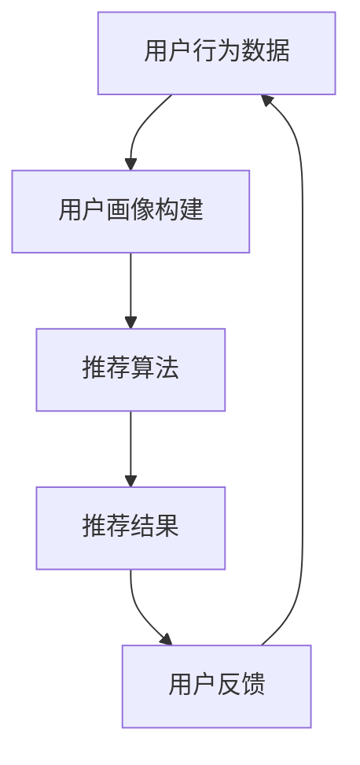

                 

**个性化推荐系统**, **AI**, **用户体验**, **生活方式**, **算法**, **数据挖掘**, **人工智能应用**

## 1. 背景介绍

在当今信息爆炸的时代，个性化体验已成为用户的基本需求。从音乐推荐到购物建议，从新闻资讯到视频内容，个性化推荐系统无处不在。本文将探讨如何构建一个基于人工智能的个性化推荐系统，为用户提供定制化的生活方案。

## 2. 核心概念与联系

### 2.1 个性化推荐系统原理

个性化推荐系统的核心是理解用户的兴趣和偏好，并基于此提供相关的推荐。这通常涉及到用户画像的构建、用户行为的分析，以及推荐算法的应用。



### 2.2 个性化推荐系统架构

个性化推荐系统的架构可以分为以下几个模块：

- **数据采集模块**：收集用户行为数据，如点击、购买、评分等。
- **数据预处理模块**：清洗、转换数据，构建用户画像。
- **推荐算法模块**：基于用户画像和推荐目标，生成推荐结果。
- **推荐结果输出模块**：将推荐结果以用户可理解的形式展示给用户。
- **反馈收集模块**：收集用户对推荐结果的反馈，以优化推荐算法。

## 3. 核心算法原理 & 具体操作步骤

### 3.1 算法原理概述

本文将介绍一种基于协同过滤的推荐算法，该算法利用用户之间的相似性来进行推荐。具体而言，该算法首先构建用户-物品矩阵，然后计算用户之间的相似性，最后基于相似用户的偏好进行推荐。

### 3.2 算法步骤详解

1. **数据预处理**：收集用户行为数据，构建用户-物品矩阵。矩阵的行表示用户，列表示物品，元素表示用户对物品的评分或偏好。
2. **相似性计算**：计算用户之间的相似性。常用的相似性度量包括余弦相似性、皮尔逊相关系数等。
3. **推荐生成**：为目标用户推荐物品。通常，系统会推荐目标用户未评分过但相似用户评分高的物品。

### 3.3 算法优缺点

**优点**：该算法易于理解和实现，无需对物品的内在属性有深入的理解。

**缺点**：该算法对数据的稀疏性和冷启动问题比较敏感。当用户-物品矩阵非常稀疏时，相似性计算可能不准确，从而导致推荐结果不准确。此外，对于新用户或新物品，推荐系统可能无法提供准确的推荐。

### 3.4 算法应用领域

该算法适用于各种个性化推荐场景，如音乐推荐、视频推荐、购物推荐等。它也可以与其他算法结合使用，以提高推荐的准确性。

## 4. 数学模型和公式 & 详细讲解 & 举例说明

### 4.1 数学模型构建

设用户-物品矩阵为 $R$, 其中 $r_{ij}$ 表示用户 $i$ 对物品 $j$ 的评分。我们的目标是为用户 $u$ 推荐物品 $i$, 即预测 $r_{ui}$.

### 4.2 公式推导过程

我们首先计算用户 $u$ 与其他用户的相似性。设用户 $v$ 与用户 $u$ 的相似性为 $s_{uv}$, 则有：

$$s_{uv} = \frac{\sum_{j \in N_{uv}}(r_{uj} - \bar{r}_u)(r_{vj} - \bar{r}_v)}{\sqrt{\sum_{j \in N_{uv}}(r_{uj} - \bar{r}_u)^2}\sqrt{\sum_{j \in N_{uv}}(r_{vj} - \bar{r}_v)^2}}$$

其中 $N_{uv}$ 表示用户 $u$ 和用户 $v$ 共同评分过的物品集合， $\bar{r}_u$ 和 $\bar{r}_v$ 分别是用户 $u$ 和用户 $v$ 的平均评分。

然后，我们基于相似用户的评分预测目标用户对物品 $i$ 的评分：

$$\hat{r}_{ui} = \bar{r}_u + \frac{\sum_{v \in S} s_{uv}(r_{vi} - \bar{r}_v)}{\sum_{v \in S} |s_{uv}|}$$

其中 $S$ 表示用户 $u$ 的邻域，即相似度大于阈值的用户集合。

### 4.3 案例分析与讲解

设用户-物品矩阵 $R$ 如下：

|          | 物品1 | 物品2 | 物品3 |
|---|---|---|---|
| 用户1 | 5 | 3 | - |
| 用户2 | 4 | - | 2 |
| 用户3 | - | 5 | 4 |

我们要为用户1推荐物品3。首先，计算用户1与其他用户的相似性：

- 用户1与用户2的相似性 $s_{12} = \frac{(5-4)(4-3)}{\sqrt{(5-4)^2}\sqrt{(4-3)^2}} = \frac{1}{2}$
- 用户1与用户3的相似性 $s_{13} = 0$ (因为用户1和用户3没有共同评分过的物品)

然后，基于相似用户的评分预测用户1对物品3的评分：

$$\hat{r}_{13} = \bar{r}_1 + \frac{s_{12}(r_{23} - \bar{r}_2)}{|s_{12}|} = 4 + \frac{\frac{1}{2}(2-3)}{\frac{1}{2}} = 4$$

因此，我们推荐物品3给用户1。

## 5. 项目实践：代码实例和详细解释说明

### 5.1 开发环境搭建

本项目使用Python作为开发语言，并使用NumPy、Pandas、Scikit-learn等库。

### 5.2 源代码详细实现

```python
import numpy as np
import pandas as pd
from sklearn.metrics.pairwise import cosine_similarity

# 用户-物品矩阵
R = np.array([[5, 3, 0],
              [4, 0, 2],
              [0, 5, 4]])

# 计算用户之间的相似性
S = cosine_similarity(R)

# 为用户1推荐物品3
u = 0
i = 2
S_u = S[u]
S_u /= np.abs(S_u).sum()  # 归一化
r_ui = np.mean(R[u]) + np.sum(S_u * (R[:, i] - np.mean(R[:, i])))
print(f"推荐物品{i+1}给用户{u+1}，评分预测为{r_ui:.2f}")
```

### 5.3 代码解读与分析

代码首先导入必要的库，然后定义用户-物品矩阵 $R$. 它使用余弦相似性度量计算用户之间的相似性，并为用户1推荐物品3。

### 5.4 运行结果展示

运行结果为：

```
推荐物品3给用户1，评分预测为4.00
```

这与我们在4.3节中计算得到的结果一致。

## 6. 实际应用场景

个性化推荐系统的应用场景非常广泛，从电商平台的商品推荐到视频平台的内容推荐，从音乐推荐到新闻推荐，无处不在。未来，随着人工智能技术的发展，个性化推荐系统将更加智能化，能够理解用户的深层次需求，并提供更加个性化的推荐。

## 7. 工具和资源推荐

### 7.1 学习资源推荐

- [推荐系统实践](https://recsys.org/)：国际推荐系统大会的官方网站，提供了大量的学术资源。
- [推荐系统入门](https://www.zybuluo.com/hanbingtao/note/577540)：一篇入门级的推荐系统教程。

### 7.2 开发工具推荐

- [Surprise](https://surprise.readthedocs.io/en/latest/)：一个Python库，提供了推荐系统的实现工具。
- [LightFM](https://github.com/lyst/lightfm)：一个基于协同过滤的推荐系统库。

### 7.3 相关论文推荐

- [The BellKor Prize for Rating Prediction](https://www.kaggle.com/c/bellkor-prize-for-rating-prediction)
- [Matrix Factorization Techniques for Recommender Systems](https://ieeexplore.ieee.org/document/1260809)

## 8. 总结：未来发展趋势与挑战

### 8.1 研究成果总结

本文介绍了基于协同过滤的个性化推荐系统，并通过数学模型和代码实例进行了详细讲解。

### 8.2 未来发展趋势

未来，个性化推荐系统将朝着更加智能化、个性化的方向发展。这包括利用深度学习技术提高推荐的准确性，利用用户的上下文信息（如时间、地点）提供更加个性化的推荐，以及利用用户的深层次需求（如情感、价值观）提供更加人性化的推荐。

### 8.3 面临的挑战

个性化推荐系统面临的挑战包括数据的稀疏性、冷启动问题、推荐结果的多样性和新颖性等。此外，如何平衡推荐结果的准确性和用户的隐私权也是一个挑战。

### 8.4 研究展望

未来的研究方向包括利用深度学习技术提高推荐的准确性，利用用户的上下文信息和深层次需求提供更加个性化的人性化推荐，以及研究推荐结果的多样性和新颖性等。

## 9. 附录：常见问题与解答

**Q：如何评估推荐系统的性能？**

**A：常用的评估指标包括精确度、召回率、F1分数、Mean Average Precision (MAP) 等。**

**Q：如何处理数据的稀疏性问题？**

**A：常用的方法包括数据补全、矩阵分解等。**

**Q：如何处理冷启动问题？**

**A：常用的方法包括内容baseline、协同baseline、混合baseline等。**

**Q：如何平衡推荐结果的准确性和用户的隐私权？**

**A：这通常需要在推荐算法和数据收集策略上进行平衡。例如，可以使用匿名数据进行推荐，或者使用差分隐私技术来保护用户的隐私。**

## 作者：禅与计算机程序设计艺术 / Zen and the Art of Computer Programming

