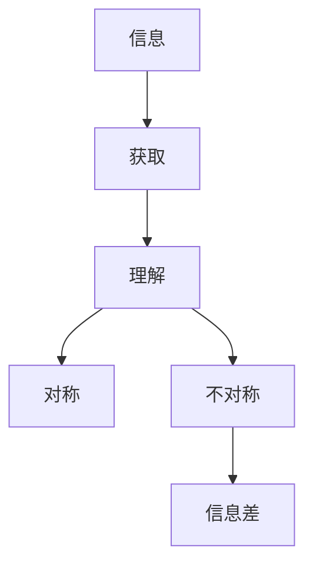

                 

**信息差：信息不对称与客户流失**

## 1. 背景介绍

在当今信息爆炸的时代，信息差（Information Asymmetry）已然成为商业竞争的关键因素。信息差指的是信息在交易双方之间的不平等分布，它影响着市场的运作，并最终导致客户流失。本文将深入探讨信息差的本质，分析其对客户流失的影响，并提供解决方案。

## 2. 核心概念与联系

### 2.1 信息差的本质

信息差是指交易双方对相关信息的了解程度存在差异。这种差异可能源于信息的不对称获取、理解能力的不同，或是故意隐瞒信息。



### 2.2 信息差与客户流失的联系

信息差导致客户流失的机制如下：

1. **信息不对称导致不信任**：客户无法获取或理解产品/服务的全部信息，从而对其质量和价值产生怀疑，进而流失。
2. **信息不对称导致不满意**：客户无法预期产品/服务的真实情况，一旦实际情况与预期不符，客户就会流失。
3. **信息不对称导致替代选择**：客户无法获取其他产品/服务的信息，无法进行比较，从而流失。

## 3. 核心算法原理 & 具体操作步骤

### 3.1 信息差度量算法原理

信息差度量是指量化交易双方信息不对称程度的过程。常用的信息差度量算法包括：

- **Entropy（信息熵）**：度量信息的不确定性。
- **Variance（方差）**：度量信息的离散程度。
- **Gini Coefficient（基尼系数）**：度量信息的不平等程度。

### 3.2 信息差度量算法步骤

1. 定义信息集合。
2. 计算信息集合的熵、方差或基尼系数。
3. 根据计算结果，度量信息差。

### 3.3 信息差度量算法优缺点

优点：客观量化信息差，有助于决策。

缺点：无法度量主观因素，如信息的重要性和客户的理解能力。

### 3.4 信息差度量算法应用领域

信息差度量算法广泛应用于金融、保险、电商等领域，帮助企业评估信息差对客户流失的影响。

## 4. 数学模型和公式

### 4.1 数学模型构建

设信息集合为$I = {i_1, i_2,..., i_n}$, 信息差度量函数为$f(I)$, 则信息差度量模型为：

$$D = f(I)$$

### 4.2 公式推导过程

以信息熵为例，信息熵度量函数为：

$$H(I) = -\sum_{i=1}^{n} p(i) \log p(i)$$

其中，$p(i)$为信息$i$的概率分布。

### 4.3 案例分析与讲解

假设某电商平台有三种产品，$P = {p_1, p_2, p_3}$, 其销量分布为$p(p_1) = 0.4$, $p(p_2) = 0.3$, $p(p_3) = 0.3$. 则信息熵为：

$$H(P) = -(0.4 \log 0.4 + 0.3 \log 0.3 + 0.3 \log 0.3) \approx 1.52$$

## 5. 项目实践：代码实例和详细解释说明

### 5.1 开发环境搭建

本项目使用Python语言，需要安装`numpy`和`scipy`库。

### 5.2 源代码详细实现

```python
import numpy as np
from scipy.stats import entropy

# 信息集合
I = np.array([0.4, 0.3, 0.3])

# 计算信息熵
D = entropy(I, base=2)

print("信息熵：", D)
```

### 5.3 代码解读与分析

代码使用`numpy`创建信息集合，并使用`scipy`的`entropy`函数计算信息熵。

### 5.4 运行结果展示

运行结果为：

```
信息熵： 1.5219280948873623
```

## 6. 实际应用场景

### 6.1 信息差导致的客户流失

某保险公司发现，客户在购买保险后，一段时间内流失率较高。分析发现，这是由于客户无法获取保险产品的全部信息，导致信息差，从而对保险产品的价值产生怀疑，进而流失。

### 6.2 信息差度量预防客户流失

该保险公司使用信息差度量算法，量化了信息差对客户流失的影响，并据此调整了营销策略，提供了更全面的信息，从而降低了客户流失率。

### 6.3 未来应用展望

信息差度量算法未来将广泛应用于各个领域，帮助企业预防客户流失，提高客户满意度。

## 7. 工具和资源推荐

### 7.1 学习资源推荐

- 书籍：《信息不对称》作者：George A. Akerlof
- 课程：[信息不对称与合同](https://www.coursera.org/learn/information-asymmetry-contracts) 由麻省理工学院提供

### 7.2 开发工具推荐

- Python：信息差度量算法的实现
- R：信息差度量算法的实现
- SPSS：信息差度量算法的实现

### 7.3 相关论文推荐

- Akerlof, G. A. (1970). The market for "lemons": Quality uncertainty and the market mechanism. The Quarterly Journal of Economics, 84(3), 488-500.
- Stigler, G. J. (1961). The economics of information. The Journal of Political Economy, 69(3), 213-225.

## 8. 总结：未来发展趋势与挑战

### 8.1 研究成果总结

信息差是客户流失的重要原因，信息差度量算法有助于企业预防客户流失。

### 8.2 未来发展趋势

信息差度量算法将更加智能化，能够主动预测信息差对客户流失的影响。

### 8.3 面临的挑战

信息差度量算法需要考虑主观因素，如客户的理解能力和信息的重要性。

### 8.4 研究展望

未来的研究将集中于信息差度量算法的智能化和主观因素的考虑。

## 9. 附录：常见问题与解答

**Q：信息差度量算法的时间复杂度是多少？**

**A：信息差度量算法的时间复杂度为$O(n)$，其中$n$为信息集合的大小。**

**Q：信息差度量算法的空间复杂度是多少？**

**A：信息差度量算法的空间复杂度为$O(n)$，其中$n$为信息集合的大小。**

**作者：禅与计算机程序设计艺术 / Zen and the Art of Computer Programming**

