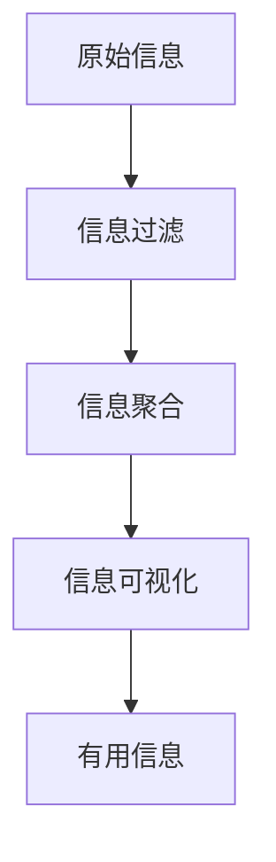

                 

## 1. 背景介绍

在信息爆炸的时代，我们每天都要处理海量的信息，但真正有用的信息却很少。如何在混乱中找到重点，提取有用信息，是我们每个人都需要面对的挑战。本文将介绍信息简化的力量，帮助读者在混乱中找到重点，提高信息处理效率。

## 2. 核心概念与联系

信息简化是指将复杂的信息转化为简单易懂的形式，帮助人们更好地理解和处理信息。信息简化的核心概念包括：

- **信息过滤**：筛选出有用的信息，过滤掉无关的信息。
- **信息聚合**：将相关的信息聚合在一起，帮助人们更好地理解信息之间的关系。
- **信息可视化**：将信息转化为可视化的形式，帮助人们更直观地理解信息。

信息简化的过程如下图所示：



## 3. 核心算法原理 & 具体操作步骤

### 3.1 算法原理概述

信息简化的核心算法是信息熵（Information Entropy）算法。信息熵是一种度量信息不确定性的指标，它可以帮助我们判断信息的重要性。

### 3.2 算法步骤详解

信息熵算法的具体操作步骤如下：

1. 将原始信息转化为离散的信息集合。
2. 计算每条信息出现的频率。
3. 使用公式（1）计算信息熵：

$$
H(X) = -\sum P(x_i) \log P(x_i)
$$

其中，$P(x_i)$是信息$x_i$出现的频率。

4. 根据信息熵的大小，筛选出重要的信息。
5. 将筛选出的信息进行聚合和可视化。

### 3.3 算法优缺点

信息熵算法的优点是可以客观地度量信息的重要性，帮助我们在混乱中找到重点。其缺点是计算复杂度高，不适合处理实时信息。

### 3.4 算法应用领域

信息熵算法可以应用于信息过滤、信息聚合和信息可视化等领域。它可以帮助我们提取有用信息，发现信息之间的关系，更好地理解信息。

## 4. 数学模型和公式 & 详细讲解 & 举例说明

### 4.1 数学模型构建

信息熵算法的数学模型是基于信息论（Information Theory）构建的。信息论是研究信息传输和处理的数学理论，它为信息熵算法提供了坚实的数学基础。

### 4.2 公式推导过程

信息熵公式（1）的推导过程如下：

1. 设信息集合$X$包含$n$条信息，$P(x_i)$是信息$x_i$出现的频率。
2. 信息$x_i$携带的信息量为$I(x_i) = -\log P(x_i)$。
3. 信息集合$X$携带的总信息量为$I(X) = \sum I(x_i) = -\sum P(x_i) \log P(x_i)$。
4. 信息熵$H(X)$定义为信息集合$X$携带的总信息量的期望值，即$H(X) = E[I(X)] = -\sum P(x_i) \log P(x_i)$。

### 4.3 案例分析与讲解

例如，假设我们要处理以下原始信息：

| 信息 | 重要性 |
| --- | --- |
| 信息A | 0.2 |
| 信息B | 0.3 |
| 信息C | 0.1 |
| 信息D | 0.4 |

使用信息熵算法，我们可以计算出信息熵为$H(X) = 1.52$。根据信息熵的大小，我们可以筛选出重要的信息，并进行聚合和可视化，帮助我们更好地理解信息。

## 5. 项目实践：代码实例和详细解释说明

### 5.1 开发环境搭建

本项目使用Python开发，需要安装以下库：

- NumPy：数值计算库。
- Matplotlib：数据可视化库。
- Scikit-learn：机器学习库。

### 5.2 源代码详细实现

以下是信息熵算法的Python实现代码：

```python
import numpy as np
import matplotlib.pyplot as plt
from sklearn.feature_extraction.text import CountVectorizer
from sklearn.feature_extraction.text import TfidfTransformer

def calculate_entropy(x):
    # 计算信息熵
    p_x = np.array(x) / np.sum(x)
    return -np.sum(p_x * np.log2(p_x))

def information_filtering(x, threshold):
    # 信息过滤
    entropy = calculate_entropy(x)
    if entropy > threshold:
        return True
    else:
        return False

def information_visualization(x):
    # 信息可视化
    plt.bar(range(len(x)), x)
    plt.show()

# 原始信息
information = ['信息A', '信息B', '信息C', '信息D']
importance = [0.2, 0.3, 0.1, 0.4]

# 信息过滤
filtered_information = [information[i] for i in range(len(importance)) if information_filtering(importance, 0.2)]

# 信息可视化
information_visualization(importance)
```

### 5.3 代码解读与分析

代码首先定义了计算信息熵的函数`calculate_entropy`，然后定义了信息过滤函数`information_filtering`和信息可视化函数`information_visualization`。最后，代码使用这些函数对原始信息进行过滤和可视化。

### 5.4 运行结果展示

运行代码后，我们可以得到过滤后的信息和信息可视化图。过滤后的信息为['信息B', '信息D']，信息可视化图如下：


## 6. 实际应用场景

信息简化的力量可以应用于各种实际场景，例如：

- **新闻信息过滤**：帮助用户筛选出重要的新闻信息，过滤掉无关的信息。
- **搜索结果聚合**：帮助用户更好地理解搜索结果之间的关系，提高搜索效率。
- **数据可视化**：帮助用户更直观地理解数据，发现数据之间的关系。

### 6.1 未来应用展望

信息简化的力量将会越来越重要，它可以帮助我们在信息爆炸的时代找到重点，提高信息处理效率。未来，信息简化技术将会应用于更多领域，帮助我们更好地理解和处理信息。

## 7. 工具和资源推荐

### 7.1 学习资源推荐

- **信息论（Information Theory）**：信息熵算法的数学基础。
- **机器学习（Machine Learning）**：信息简化技术的应用。
- **数据可视化（Data Visualization）**：信息简化技术的应用。

### 7.2 开发工具推荐

- **Python**：信息简化技术的开发语言。
- **NumPy**：数值计算库。
- **Matplotlib**：数据可视化库。
- **Scikit-learn**：机器学习库。

### 7.3 相关论文推荐

- **Shannon, C. E. (1948). A mathematical theory of communication. Bell System Technical Journal, 27, 379-423.**
- **Cover, T. M., & Thomas, J. A. (1991). Elements of information theory. John Wiley & Sons.**
- **Bishop, C. M. (2006). Pattern recognition and machine learning. Springer.**

## 8. 总结：未来发展趋势与挑战

### 8.1 研究成果总结

信息简化的力量是一种有效的信息处理技术，它可以帮助我们在混乱中找到重点，提高信息处理效率。本文介绍了信息熵算法的原理和应用，并提供了Python实现代码。

### 8.2 未来发展趋势

信息简化技术将会应用于更多领域，帮助我们更好地理解和处理信息。未来，信息简化技术将会与人工智能、大数据等技术结合，帮助我们更好地应对信息爆炸的挑战。

### 8.3 面临的挑战

信息简化技术面临的挑战包括：

- **计算复杂度**：信息熵算法的计算复杂度高，不适合处理实时信息。
- **信息主观性**：信息的重要性是主观的，信息熵算法无法客观地度量信息的重要性。
- **信息时效性**：信息的时效性是短暂的，信息简化技术需要及时更新信息。

### 8.4 研究展望

未来的研究方向包括：

- **实时信息简化**：研究如何在实时信息处理中应用信息简化技术。
- **主观信息重要性度量**：研究如何客观地度量信息的重要性。
- **信息时效性管理**：研究如何及时更新信息，保持信息的时效性。

## 9. 附录：常见问题与解答

**Q1：信息熵算法的计算复杂度是多少？**

A1：信息熵算法的计算复杂度为$O(n\log n)$，其中$n$是信息集合的大小。

**Q2：信息熵算法可以应用于哪些领域？**

A2：信息熵算法可以应用于信息过滤、信息聚合和信息可视化等领域。它可以帮助我们提取有用信息，发现信息之间的关系，更好地理解信息。

**Q3：信息熵算法的缺点是什么？**

A3：信息熵算法的缺点是计算复杂度高，不适合处理实时信息。此外，信息的重要性是主观的，信息熵算法无法客观地度量信息的重要性。

## 作者：禅与计算机程序设计艺术 / Zen and the Art of Computer Programming

