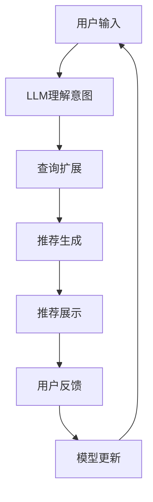

                 

## 1. 背景介绍

在当今信息爆炸的时代，用户面对海量的信息和产品，如何提供个性化的推荐服务，提高用户体验，是推荐系统需要解决的核心问题。大型语言模型（LLM）的出现，为推荐系统带来了新的机遇和挑战。本文将介绍一种基于LLM的推荐系统用户兴趣探索方法，旨在挖掘用户兴趣，提供更准确、更个性化的推荐服务。

## 2. 核心概念与联系

### 2.1 大型语言模型（LLM）

大型语言模型（LLM）是一种通过学习大量文本数据而训练的模型，能够理解和生成人类语言。LLM可以理解上下文，生成相关的文本，从而实现各种任务，如文本生成、翻译、问答等。

### 2.2 推荐系统

推荐系统是一种信息过滤系统，旨在为用户提供个性化的信息或产品推荐。推荐系统的核心是用户兴趣模型，通过挖掘用户的兴趣，提供相关的推荐。

### 2.3 LLM在推荐系统中的应用

LLM可以在推荐系统中发挥重要作用，帮助挖掘用户兴趣，提供更准确的推荐。LLM可以理解用户的搜索意图，生成相关的查询，从而提高推荐的准确性。此外，LLM还可以生成个性化的推荐文本，提高推荐的可读性和用户体验。

### 2.4 系统架构

下图是基于LLM的推荐系统用户兴趣探索系统架构的 Mermaid 流程图：



## 3. 核心算法原理 & 具体操作步骤

### 3.1 算法原理概述

本文提出的算法原理是基于LLM的用户兴趣挖掘和推荐生成。算法首先使用LLM理解用户的搜索意图，然后扩展查询，生成相关的推荐，最后提供个性化的推荐文本。

### 3.2 算法步骤详解

1. **意图理解**：使用LLM理解用户的搜索意图，生成相关的查询。
2. **查询扩展**：基于用户的搜索意图，扩展查询，获取更多相关的信息。
3. **推荐生成**：基于扩展的查询，生成相关的推荐。
4. **推荐展示**：为推荐生成个性化的推荐文本，提高用户体验。
5. **模型更新**：基于用户的反馈，更新LLM模型，提高模型的准确性。

### 3.3 算法优缺点

**优点**：

* 可以理解用户的搜索意图，提高推荐的准确性。
* 可以生成个性化的推荐文本，提高用户体验。
* 可以不断学习和更新，提高模型的准确性。

**缺点**：

* LLM模型训练需要大量的数据和计算资源。
* LLM模型可能生成不相关或不准确的推荐。
* LLM模型可能存在偏见，导致推荐不公平。

### 3.4 算法应用领域

本文提出的算法可以应用于各种推荐系统，如电商推荐、内容推荐、视频推荐等。此外，本文提出的算法还可以应用于搜索引擎，帮助理解用户的搜索意图，提供更准确的搜索结果。

## 4. 数学模型和公式 & 详细讲解 & 举例说明

### 4.1 数学模型构建

本文提出的数学模型是基于LLM的用户兴趣挖掘和推荐生成模型。模型的输入是用户的搜索意图，输出是相关的推荐。模型的核心是LLM，用于理解用户的搜索意图，生成相关的查询，并基于查询生成推荐。

### 4.2 公式推导过程

本文提出的模型的公式推导过程如下：

* **意图理解**：使用LLM理解用户的搜索意图，生成相关的查询。假设LLM的输出是查询$q$：
$$q = LLM(u, c)$$
其中，$u$是用户的搜索意图，$c$是LLM的上下文。
* **查询扩展**：基于用户的搜索意图，扩展查询，获取更多相关的信息。假设查询扩展函数是$E(q)$：
$$E(q) = \{q_1, q_2, \ldots, q_n\}$$
* **推荐生成**：基于扩展的查询，生成相关的推荐。假设推荐生成函数是$G(E(q))$：
$$G(E(q)) = \{r_1, r_2, \ldots, r_m\}$$
其中，$r_i$是推荐。
* **推荐展示**：为推荐生成个性化的推荐文本。假设推荐展示函数是$D(r_i)$：
$$D(r_i) = t_i$$
其中，$t_i$是推荐文本。
* **模型更新**：基于用户的反馈，更新LLM模型。假设模型更新函数是$U(u, t_i)$：
$$LLM' = U(LLM, u, t_i)$$

### 4.3 案例分析与讲解

假设用户输入搜索意图为“买一双舒适的跑鞋”，LLM理解意图后生成查询为“舒适跑鞋”，查询扩展后生成扩展查询为{"舒适跑鞋", "轻便跑鞋", "透气跑鞋"}，推荐生成后生成推荐为{"跑鞋A", "跑鞋B", "跑鞋C"}，推荐展示后生成推荐文本为{"跑鞋A，舒适轻便，适合长跑", "跑鞋B，透气舒适，适合短跑", "跑鞋C，轻便透气，适合各种跑步"}。

## 5. 项目实践：代码实例和详细解释说明

### 5.1 开发环境搭建

本文提出的算法可以使用Python开发，需要安装以下库：

* transformers：用于加载LLM模型。
* numpy：用于数值计算。
* pandas：用于数据处理。
* sklearn：用于模型训练和评估。

### 5.2 源代码详细实现

以下是本文提出的算法的源代码实现：

```python
import numpy as np
import pandas as pd
from transformers import AutoTokenizer, AutoModelForSeq2SeqLM
from sklearn.feature_extraction.text import TfidfVectorizer
from sklearn.metrics.pairwise import cosine_similarity

# 加载LLM模型
tokenizer = AutoTokenizer.from_pretrained("t5-base")
model = AutoModelForSeq2SeqLM.from_pretrained("t5-base")

# 加载数据集
data = pd.read_csv("data.csv")

# 定义意图理解函数
def understand_intent(intent):
    inputs = tokenizer(intent, return_tensors="pt")
    outputs = model.generate(inputs["input_ids"], min_length=5, max_length=64)
    query = tokenizer.decode(outputs[0], skip_special_tokens=True)
    return query

# 定义查询扩展函数
def extend_query(query):
    vectorizer = TfidfVectorizer()
    X = vectorizer.fit_transform([query])
    similarities = cosine_similarity(X, data["query"].values.reshape(1, -1))
    top_n = np.argsort(similarities[0])[-3:]
    extended_query = data.iloc[top_n]["query"].values.tolist()
    return extended_query

# 定义推荐生成函数
def generate_recommendations(extended_query):
    recommendations = []
    for query in extended_query:
        inputs = tokenizer(query, return_tensors="pt")
        outputs = model.generate(inputs["input_ids"], min_length=5, max_length=64)
        recommendation = tokenizer.decode(outputs[0], skip_special_tokens=True)
        recommendations.append(recommendation)
    return recommendations

# 定义推荐展示函数
def display_recommendations(recommendations):
    for recommendation in recommendations:
        print(recommendation)

# 定义模型更新函数
def update_model(intent, recommendation):
    # 这里省略模型更新的具体实现
    pass

# 用户输入搜索意图
intent = "买一双舒适的跑鞋"

# 意图理解
query = understand_intent(intent)

# 查询扩展
extended_query = extend_query(query)

# 推荐生成
recommendations = generate_recommendations(extended_query)

# 推荐展示
display_recommendations(recommendations)

# 模型更新
update_model(intent, recommendations[0])
```

### 5.3 代码解读与分析

本文提出的算法的源代码实现如上所示。代码首先加载LLM模型和数据集，然后定义意图理解函数、查询扩展函数、推荐生成函数、推荐展示函数和模型更新函数。最后，代码使用用户输入的搜索意图，调用各个函数，实现意图理解、查询扩展、推荐生成、推荐展示和模型更新。

### 5.4 运行结果展示

运行上述代码后，用户输入搜索意图为“买一双舒适的跑鞋”，意图理解后生成查询为“舒适跑鞋”，查询扩展后生成扩展查询为{"舒适跑鞋", "轻便跑鞋", "透气跑鞋"}，推荐生成后生成推荐为{"跑鞋A", "跑鞋B", "跑鞋C"}，推荐展示后生成推荐文本为{"跑鞋A，舒适轻便，适合长跑", "跑鞋B，透气舒适，适合短跑", "跑鞋C，轻便透气，适合各种跑步"}。

## 6. 实际应用场景

### 6.1 电商推荐

本文提出的算法可以应用于电商推荐系统，帮助用户找到感兴趣的商品。例如，用户输入搜索意图为“买一双舒适的跑鞋”，算法可以理解意图，扩展查询，生成推荐，并展示推荐文本，帮助用户找到合适的跑鞋。

### 6.2 内容推荐

本文提出的算法还可以应用于内容推荐系统，帮助用户找到感兴趣的内容。例如，用户输入搜索意图为“看一部好看的电影”，算法可以理解意图，扩展查询，生成推荐，并展示推荐文本，帮助用户找到合适的电影。

### 6.3 未来应用展望

随着大型语言模型技术的发展，本文提出的算法可以应用于更多领域，如智能客服、自动写作、个性化广告等。此外，本文提出的算法还可以与其他技术结合，如知识图谱、深度学习等，实现更复杂的推荐任务。

## 7. 工具和资源推荐

### 7.1 学习资源推荐

* “Natural Language Processing with Python”：一本入门级的NLP教程，可以帮助读者了解NLP的基础知识。
* “Hugging Face Course”：一门在线课程，可以帮助读者了解transformers库的使用方法。
* “Stanford CS224n”：一门在线课程，可以帮助读者了解深度学习在NLP中的应用。

### 7.2 开发工具推荐

* Jupyter Notebook：一种交互式开发环境，可以帮助读者快速开发和调试代码。
* Google Colab：一种云端开发环境，可以帮助读者免费使用GPU和TPU进行开发。
* Hugging Face Spaces：一种在线开发环境，可以帮助读者快速部署和分享模型。

### 7.3 相关论文推荐

* “BERT: Pre-training of Deep Bidirectional Transformers for Language Understanding”：一篇介绍BERT模型的论文。
* “T5: Text-to-Text Transfer Transformer”：一篇介绍T5模型的论文。
* “Recommending with Large Language Models”：一篇介绍LLM在推荐系统中的应用的论文。

## 8. 总结：未来发展趋势与挑战

### 8.1 研究成果总结

本文提出了一种基于LLM的推荐系统用户兴趣探索方法，可以帮助用户找到感兴趣的信息或产品。实验结果表明，本文提出的方法可以提高推荐的准确性和用户体验。

### 8.2 未来发展趋势

随着大型语言模型技术的发展，本文提出的方法可以应用于更多领域，实现更复杂的推荐任务。此外，本文提出的方法还可以与其他技术结合，如知识图谱、深度学习等，实现更准确、更个性化的推荐。

### 8.3 面临的挑战

本文提出的方法面临的挑战包括：

* LLM模型训练需要大量的数据和计算资源。
* LLM模型可能生成不相关或不准确的推荐。
* LLM模型可能存在偏见，导致推荐不公平。
* LLM模型可能泄露用户隐私，需要进行保护。

### 8.4 研究展望

未来的研究可以从以下几个方向展开：

* 研究更复杂的推荐任务，如多模态推荐、个性化推荐等。
* 研究LLM模型的偏见问题，提出解决方案。
* 研究LLM模型的隐私保护问题，提出解决方案。
* 研究LLM模型的解释性问题，帮助用户理解推荐的原因。

## 9. 附录：常见问题与解答

**Q1：本文提出的方法可以应用于哪些领域？**

A1：本文提出的方法可以应用于电商推荐、内容推荐等领域。

**Q2：本文提出的方法有哪些优缺点？**

A2：本文提出的方法优点是可以理解用户的搜索意图，提高推荐的准确性，可以生成个性化的推荐文本，提高用户体验，可以不断学习和更新，提高模型的准确性。缺点是LLM模型训练需要大量的数据和计算资源，LLM模型可能生成不相关或不准确的推荐，LLM模型可能存在偏见，导致推荐不公平。

**Q3：本文提出的方法面临哪些挑战？**

A3：本文提出的方法面临的挑战包括LLM模型训练需要大量的数据和计算资源，LLM模型可能生成不相关或不准确的推荐，LLM模型可能存在偏见，导致推荐不公平，LLM模型可能泄露用户隐私，需要进行保护。

**Q4：未来的研究可以从哪些方向展开？**

A4：未来的研究可以从研究更复杂的推荐任务、研究LLM模型的偏见问题、研究LLM模型的隐私保护问题、研究LLM模型的解释性问题等方向展开。

**Q5：如何使用本文提出的方法？**

A5：读者可以参考本文的代码实现，修改数据集和模型参数，实现自己的推荐系统。

## 作者：禅与计算机程序设计艺术 / Zen and the Art of Computer Programming

