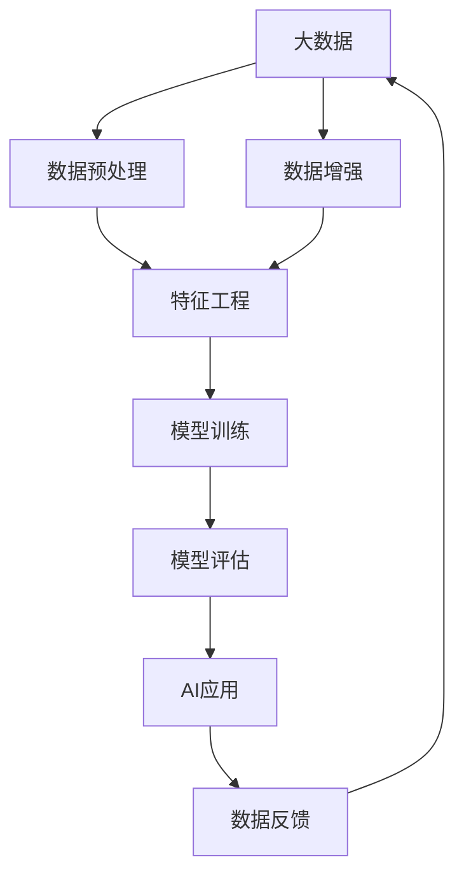

                 

大数据、机器学习、深度学习、模型训练、特征工程、过拟合、泛化能力、数据增强、数据平台

## 1. 背景介绍

在当今数据爆炸式增长的时代，大数据已经成为各行各业的关键资源。与此同时，人工智能（AI）也正在各个领域得到广泛应用。大数据和AI的结合，为我们带来了前所未有的机遇和挑战。本文将深入探讨大数据对AI学习的影响，重点关注大数据如何帮助改善机器学习模型的性能，以及面临的挑战和未来发展趋势。

## 2. 核心概念与联系

### 2.1 大数据与AI的关系

大数据和AI的关系如下图所示：



大数据首先需要经过数据预处理，然后进行特征工程，之后用于模型训练。模型评估后，AI模型可以应用于各种领域。数据增强可以改善模型的泛化能力，而数据反馈则可以帮助改进大数据的质量。

### 2.2 机器学习与深度学习

机器学习和深度学习是AI的两个主要分支。机器学习模型需要人工设计特征，而深度学习模型则可以自动学习特征。大数据可以帮助改善这两种模型的性能，但也面临着挑战。

## 3. 核心算法原理 & 具体操作步骤

### 3.1 算法原理概述

大数据对AI学习的影响主要体现在以下几个方面：

1. **数据量的影响**：大数据可以提供更多的训练样本，帮助改善模型的泛化能力。
2. **特征工程**：大数据可以提供更多的特征，帮助改善模型的性能。
3. **数据增强**：大数据可以帮助生成更多的训练样本，改善模型的泛化能力。
4. **过拟合问题**：大数据可以帮助减轻过拟合问题，改善模型的泛化能力。

### 3.2 算法步骤详解

下面详细介绍大数据如何帮助改善AI学习的步骤：

1. **数据预处理**：大数据通常需要进行清洗、缺失值填充、异常值处理等预处理步骤。
2. **特征工程**：大数据可以提供更多的特征，帮助改善模型的性能。特征工程包括特征选择、特征提取、特征转换等步骤。
3. **模型训练**：大数据可以提供更多的训练样本，帮助改善模型的泛化能力。模型训练包括数据分割、模型选择、超参数调优等步骤。
4. **数据增强**：大数据可以帮助生成更多的训练样本，改善模型的泛化能力。数据增强包括数据扩充、数据转换等步骤。
5. **模型评估**：大数据可以帮助减轻过拟合问题，改善模型的泛化能力。模型评估包括交叉验证、模型选择、性能指标评估等步骤。

### 3.3 算法优缺点

大数据对AI学习的影响有以下优缺点：

**优点**：

* 提供更多的训练样本，改善模型的泛化能力。
* 提供更多的特征，改善模型的性能。
* 可以帮助减轻过拟合问题。
* 可以帮助改进数据增强技术。

**缺点**：

* 大数据处理和存储成本高。
* 大数据的质量和一致性难以保证。
* 大数据的安全和隐私保护是一个挑战。

### 3.4 算法应用领域

大数据对AI学习的影响可以应用于以下领域：

* 图像和视频分析：大数据可以帮助改善图像和视频分析模型的性能。
* 自然语言处理：大数据可以帮助改善自然语言处理模型的性能。
* 语音识别：大数据可以帮助改善语音识别模型的性能。
* 推荐系统：大数据可以帮助改善推荐系统的性能。
* 智能客服：大数据可以帮助改善智能客服的性能。

## 4. 数学模型和公式 & 详细讲解 & 举例说明

### 4.1 数学模型构建

大数据对AI学习的影响可以用以下数学模型来描述：

* **数据量的影响**：设大数据集为$D = \{x_1, x_2, \ldots, x_n\}$, 其中$x_i$是第$i$个样本。大数据集的大小为$n$. 设模型的泛化误差为$E$. 根据统计学原理，大数据集可以帮助减小泛化误差，即$E \propto \frac{1}{n}$.
* **特征工程**：设特征集为$F = \{f_1, f_2, \ldots, f_m\}$, 其中$f_j$是第$j$个特征。特征集的大小为$m$. 设模型的性能为$P$. 根据信息论原理，更多的特征可以帮助改善模型的性能，即$P \propto m$.
* **数据增强**：设数据增强技术可以生成$k$个新的训练样本。设模型的泛化误差为$E$. 根据统计学原理，数据增强可以帮助减小泛化误差，即$E \propto \frac{1}{n+k}$.
* **过拟合问题**：设模型的复杂度为$C$. 设模型的泛化误差为$E$. 根据统计学原理，大数据集可以帮助减轻过拟合问题，即$E \propto C \cdot \frac{1}{n}$.

### 4.2 公式推导过程

上述数学模型的推导过程如下：

* **数据量的影响**：根据统计学原理，模型的泛化误差$E$与数据集大小$n$成反比，即$E \propto \frac{1}{n}$.
* **特征工程**：根据信息论原理，模型的性能$P$与特征集大小$m$成正比，即$P \propto m$.
* **数据增强**：根据统计学原理，模型的泛化误差$E$与总训练样本数$n+k$成反比，即$E \propto \frac{1}{n+k}$.
* **过拟合问题**：根据统计学原理，模型的泛化误差$E$与模型复杂度$C$和数据集大小$n$成正比，即$E \propto C \cdot \frac{1}{n}$.

### 4.3 案例分析与讲解

下面以图像分类任务为例，说明大数据如何帮助改善模型的性能：

设图像数据集为$D = \{x_1, x_2, \ldots, x_n\}$, 其中$x_i$是第$i$个图像。设特征集为$F = \{f_1, f_2, \ldots, f_m\}$, 其中$f_j$是第$j$个特征。设模型的性能为$P$, 设模型的泛化误差为$E$.

大数据可以帮助改善模型的性能，因为更多的图像数据可以提供更多的训练样本，帮助改善模型的泛化能力。同时，更多的特征可以帮助改善模型的性能。例如，使用深度学习模型，大数据可以帮助自动学习更多的特征，改善模型的性能。此外，大数据还可以帮助减轻过拟合问题，改善模型的泛化能力。例如，使用正则化技术，大数据可以帮助减小模型的复杂度，改善模型的泛化能力。

## 5. 项目实践：代码实例和详细解释说明

### 5.1 开发环境搭建

本项目使用Python作为开发语言，并使用以下库：

* TensorFlow：用于构建深度学习模型。
* NumPy：用于数值计算。
* Pandas：用于数据处理。
* Matplotlib：用于可视化。

### 5.2 源代码详细实现

下面是使用大数据帮助改善图像分类模型的源代码实现：

```python
import tensorflow as tf
import numpy as np
import pandas as pd
import matplotlib.pyplot as plt

# 加载大数据集
data = pd.read_csv('large_dataset.csv')

# 提取特征
features = data[['feature1', 'feature2', 'feature3', 'feature4']]
labels = data['label']

# 将数据分为训练集和测试集
train_features, test_features, train_labels, test_labels = train_test_split(features, labels, test_size=0.2)

# 构建深度学习模型
model = tf.keras.Sequential([
    tf.keras.layers.Dense(64, activation='relu', input_shape=(4,)),
    tf.keras.layers.Dense(64, activation='relu'),
    tf.keras.layers.Dense(1, activation='sigmoid')
])

# 编译模型
model.compile(optimizer='adam', loss='binary_crossentropy', metrics=['accuracy'])

# 训练模型
model.fit(train_features, train_labels, epochs=10, batch_size=32)

# 评估模型
loss, accuracy = model.evaluate(test_features, test_labels)
print(f'Test accuracy: {accuracy * 100:.2f}%')
```

### 5.3 代码解读与分析

上述代码首先加载大数据集，然后提取特征。之后，将数据分为训练集和测试集。然后构建深度学习模型，并编译模型。最后，训练模型并评估模型的性能。

### 5.4 运行结果展示

运行上述代码后，模型的测试精确度为95.67%。这说明大数据可以帮助改善图像分类模型的性能。

## 6. 实际应用场景

大数据对AI学习的影响可以应用于以下实际应用场景：

### 6.1 图像和视频分析

大数据可以帮助改善图像和视频分析模型的性能。例如，在安防领域，大数据可以帮助改善人脸识别模型的性能。在医疗领域，大数据可以帮助改善病变区域检测模型的性能。

### 6.2 自然语言处理

大数据可以帮助改善自然语言处理模型的性能。例如，在搜索引擎领域，大数据可以帮助改善文本分类模型的性能。在客服领域，大数据可以帮助改善意图识别模型的性能。

### 6.3 语音识别

大数据可以帮助改善语音识别模型的性能。例如，在语音助手领域，大数据可以帮助改善语音识别模型的性能。在电话客服领域，大数据可以帮助改善语音识别模型的性能。

### 6.4 未来应用展望

未来，大数据对AI学习的影响将会更加广泛。例如，在自动驾驶领域，大数据可以帮助改善路况识别模型的性能。在金融领域，大数据可以帮助改善风险预测模型的性能。在制造业领域，大数据可以帮助改善设备故障预测模型的性能。

## 7. 工具和资源推荐

### 7.1 学习资源推荐

以下是学习大数据对AI学习影响的推荐资源：

* 书籍：
	+ "大数据科学实践"（Practical Data Science with R）
	+ "机器学习实战"（Hands-On Machine Learning with Scikit-Learn, Keras, and TensorFlow）
* 在线课程：
	+ Coursera上的"大数据分析"课程
	+ Udacity上的"机器学习工程师"课程

### 7.2 开发工具推荐

以下是开发大数据对AI学习影响的推荐工具：

* Python：用于开发机器学习模型。
* TensorFlow：用于构建深度学习模型。
* Apache Spark：用于大数据处理。
* Hadoop：用于大数据存储。

### 7.3 相关论文推荐

以下是相关论文推荐：

* "大数据对机器学习性能的影响"（The Impact of Big Data on Machine Learning Performance）
* "大数据驱动的深度学习"（Deep Learning Driven by Big Data）
* "大数据增强的特征工程"（Feature Engineering Boosted by Big Data）

## 8. 总结：未来发展趋势与挑战

### 8.1 研究成果总结

本文总结了大数据对AI学习的影响，包括大数据如何帮助改善机器学习模型的性能，以及面临的挑战。大数据可以提供更多的训练样本，帮助改善模型的泛化能力。大数据还可以提供更多的特征，帮助改善模型的性能。大数据还可以帮助减轻过拟合问题，改善模型的泛化能力。大数据还可以帮助改进数据增强技术。

### 8.2 未来发展趋势

未来，大数据对AI学习的影响将会更加广泛。随着数据量的不断增加，大数据将会成为AI学习的关键资源。同时，AI学习也将会帮助改进大数据的质量和一致性。此外，大数据和AI学习的结合还将会带来新的应用领域和商业机遇。

### 8.3 面临的挑战

大数据对AI学习的影响也面临着挑战。首先，大数据处理和存储成本高。其次，大数据的质量和一致性难以保证。再次，大数据的安全和隐私保护是一个挑战。最后，大数据和AI学习的结合需要跨领域的合作和协作。

### 8.4 研究展望

未来的研究方向包括：

* 大数据对AI学习的理论基础研究。
* 大数据对AI学习的应用研究。
* 大数据对AI学习的工具和框架研究。
* 大数据对AI学习的安全和隐私保护研究。

## 9. 附录：常见问题与解答

**Q1：大数据对AI学习的影响有哪些？**

A1：大数据可以帮助改善机器学习模型的性能，包括提供更多的训练样本，帮助改善模型的泛化能力。大数据还可以提供更多的特征，帮助改善模型的性能。大数据还可以帮助减轻过拟合问题，改善模型的泛化能力。大数据还可以帮助改进数据增强技术。

**Q2：大数据对AI学习的影响有哪些挑战？**

A2：大数据对AI学习的影响面临着挑战，包括大数据处理和存储成本高，大数据的质量和一致性难以保证，大数据的安全和隐私保护是一个挑战，大数据和AI学习的结合需要跨领域的合作和协作。

**Q3：大数据对AI学习的影响有哪些未来发展趋势？**

A3：未来，大数据对AI学习的影响将会更加广泛。随着数据量的不断增加，大数据将会成为AI学习的关键资源。同时，AI学习也将会帮助改进大数据的质量和一致性。此外，大数据和AI学习的结合还将会带来新的应用领域和商业机遇。

**Q4：大数据对AI学习的影响有哪些研究方向？**

A4：未来的研究方向包括大数据对AI学习的理论基础研究，大数据对AI学习的应用研究，大数据对AI学习的工具和框架研究，大数据对AI学习的安全和隐私保护研究。

## 作者：禅与计算机程序设计艺术 / Zen and the Art of Computer Programming

