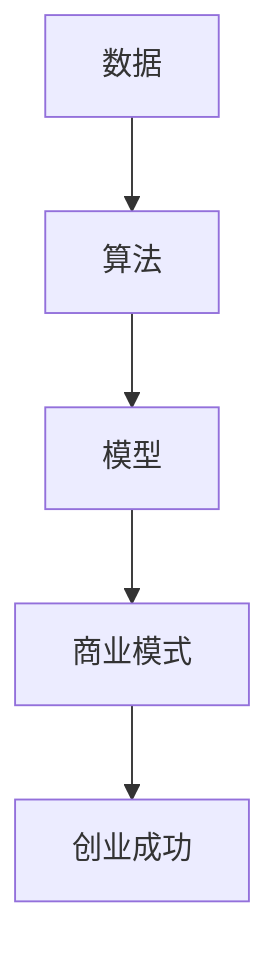

                 

**大模型创业的波折与变化**

**作者：禅与计算机程序设计艺术 / Zen and the Art of Computer Programming**

## 1. 背景介绍

大模型，即大规模语言模型，是当前人工智能领域最为活跃的方向之一。自从2018年Google发布了Transformer模型以来，大模型的发展如火如荼，从几十亿参数到千亿参数，再到万亿参数，模型规模不断刷新着人们的认知。然而，大模型的创业之路并非一帆风顺，而是充满了波折与变化。本文将从技术、商业和伦理三个维度，剖析大模型创业的挑战和机遇。

## 2. 核心概念与联系

### 2.1 大模型的定义与特点

大模型是指通过大规模数据训练而获得的，能够理解、生成或预测人类语言的模型。其特点包括：

- **规模大**：大模型的参数数量通常在十亿级甚至千亿级以上。
- **通用性强**：大模型可以在多种任务上表现出色，如翻译、写作、对话等。
- **理解能力强**：大模型可以理解上下文，并根据上下文生成相关的输出。

### 2.2 大模型创业的关键要素

大模型创业的关键要素包括：

- **数据**：大量、高质量的数据是大模型的基础。
- **算力**：大模型的训练需要海量的算力支持。
- **算法**：大模型的核心是其算法，如Transformer、BERT、T5等。
- **商业模式**：大模型的商业化是创业成功的关键。

### 2.3 核心概念联系图

## 3. 核心算法原理 & 具体操作步骤

### 3.1 算法原理概述

大模型的核心算法是Transformer，其引入了自注意力机制，能够同时关注输入序列的所有位置，从而理解上下文。此外，大模型还广泛应用了预训练和微调的技术，即先在大规模数据上预训练模型，然后在特定任务上微调模型。

### 3.2 算法步骤详解

大模型的训练步骤包括：

1. **数据预处理**：清洗、标记、切分数据。
2. **模型构建**：构建Transformer模型，设置参数数量、层数等。
3. **预训练**：在大规模数据上进行预训练，如Masked Language Model任务。
4. **微调**：在特定任务上微调模型，如翻译、写作等。
5. **评估**：评估模型在特定任务上的表现。

### 3.3 算法优缺点

优点：

- **理解能力强**：大模型可以理解上下文，生成相关的输出。
- **通用性强**：大模型可以在多种任务上表现出色。

缺点：

- **训练困难**：大模型需要海量的数据和算力支持。
- **解释性差**：大模型的决策过程不易理解。

### 3.4 算法应用领域

大模型的应用领域包括：

- **自然语言处理**：如翻译、写作、对话等。
- **搜索引擎**：大模型可以理解用户的意图，提供更相关的搜索结果。
- **虚拟助手**：大模型可以与用户进行对话，提供帮助。

## 4. 数学模型和公式 & 详细讲解 & 举例说明

### 4.1 数学模型构建

大模型的数学模型是Transformer，其可以表示为：

$$M(x) = f(x; W, b)$$

其中，$x$是输入序列，$W$和$b$是模型参数，$f$是模型的前向传播过程。

### 4.2 公式推导过程

Transformer模型的前向传播过程包括：

1. **Embedding**：将输入序列转换为向量表示。
2. **Positional Encoding**：为每个位置添加位置信息。
3. **Encoder/Decoder**：自注意力层和Feed-Forward网络组成的编码器和解码器。
4. **Output Layer**：输出层，生成输出序列。

### 4.3 案例分析与讲解

例如，在Masked Language Model任务中，模型需要预测被mask的单词。模型的输入是一个序列，其中某些单词被mask，模型的输出是被mask的单词的可能性分布。模型可以通过最大化预测概率来进行训练。

## 5. 项目实践：代码实例和详细解释说明

### 5.1 开发环境搭建

大模型的开发需要安装如下软件：

- Python：大模型的开发通常使用Python。
- PyTorch或TensorFlow：大模型的训练需要深度学习框架。
- CUDA：大模型的训练需要GPU加速。

### 5.2 源代码详细实现

大模型的实现包括：

- **数据预处理**：使用Python的NLP库，如NLTK、Spacy等。
- **模型构建**：使用PyTorch或TensorFlow构建Transformer模型。
- **训练**：使用Adam优化器，在大规模数据上进行预训练。
- **微调**：在特定任务上微调模型。

### 5.3 代码解读与分析

大模型的代码通常包括：

- **数据加载**：使用PyTorch的DataLoader加载数据。
- **模型定义**：使用PyTorch的nn.Module定义模型。
- **训练循环**：使用PyTorch的Optimizer和Loss进行训练。
- **评估**：使用PyTorch的metric计算模型的指标。

### 5.4 运行结果展示

大模型的运行结果包括：

- **训练损失**：训练过程中模型的损失值。
- **评估指标**：模型在特定任务上的指标，如BLEU、ROUGE等。
- **生成示例**：模型生成的示例，如翻译、写作等。

## 6. 实际应用场景

### 6.1 当前应用

大模型当前的应用包括：

- **搜索引擎**：如Bing、Google等。
- **虚拟助手**：如Siri、Alexa等。
- **写作助手**：如Copy.ai、Jasper.ai等。

### 6.2 未来应用展望

未来，大模型的应用将会扩展到：

- **自动驾驶**：大模型可以理解语音指令，控制车辆。
- **医疗**：大模型可以帮助医生诊断病情，开药方。
- **教育**：大模型可以提供个性化的学习路径，帮助学生学习。

## 7. 工具和资源推荐

### 7.1 学习资源推荐

- **课程**：斯坦福大学的CS224n自然语言处理课程。
- **书籍**："Attention is All You Need"论文，"Natural Language Processing with Python"书籍。
- **博客**：Hugging Face的博客，提供了大量的大模型教程。

### 7.2 开发工具推荐

- **框架**：PyTorch、TensorFlow。
- **库**：Transformers库，提供了预训练的大模型。
- **硬件**：NVIDIA GPUs，提供了GPU加速。

### 7.3 相关论文推荐

- **Transformer**："Attention is All You Need"论文。
- **BERT**："BERT: Pre-training of Deep Bidirectional Transformers for Language Understanding"论文。
- **T5**："Exploring the Limits of Transfer Learning with a Unified Text-to-Text Transformer"论文。

## 8. 总结：未来发展趋势与挑战

### 8.1 研究成果总结

大模型的研究成果包括：

- **模型规模**：从几十亿参数到千亿参数，再到万亿参数。
- **任务能力**：大模型可以在多种任务上表现出色。
- **理解能力**：大模型可以理解上下文，生成相关的输出。

### 8.2 未来发展趋势

未来，大模型的发展趋势包括：

- **模型规模**：模型规模将会继续扩大。
- **多模态**：大模型将会支持多模态输入，如文本、图像、音频等。
- **解释性**：大模型的解释性将会得到改进。

### 8.3 面临的挑战

大模型面临的挑战包括：

- **训练困难**：大模型需要海量的数据和算力支持。
- **解释性差**：大模型的决策过程不易理解。
- **伦理挑战**：大模型可能会生成不当的输出，需要进行监管。

### 8.4 研究展望

未来，大模型的研究将会关注：

- **模型压缩**：如何在保持模型性能的同时减小模型规模。
- **多模态学习**：如何将多模态信息整合到大模型中。
- **伦理监管**：如何监管大模型的输出，防止其生成不当的内容。

## 9. 附录：常见问题与解答

**Q：大模型需要多少算力？**

**A：大模型的训练需要海量的算力支持。例如，训练万亿参数的模型需要数千个GPU节点。**

**Q：大模型的数据从哪里来？**

**A：大模型的数据通常来自互联网，如维基百科、书籍、新闻等。**

**Q：大模型的商业化路径是什么？**

**A：大模型的商业化路径包括API服务、模型出售、数据服务等。**

**Q：大模型的伦理挑战是什么？**

**A：大模型的伦理挑战包括生成不当的输出、数据隐私、模型偏见等。**

**Q：大模型的未来发展方向是什么？**

**A：大模型的未来发展方向包括模型规模扩大、多模态学习、解释性改进等。**

## 结束语

大模型创业的道路并非一帆风顺，而是充满了波折与变化。然而，大模型的发展也为我们带来了无限的可能性，从自然语言处理到自动驾驶，大模型的应用领域正在不断扩展。未来，大模型的发展将会面临更多的挑战，但也将会带来更多的机遇。我们期待着大模型创业的未来，期待着大模型为我们带来的变化。

**作者：禅与计算机程序设计艺术 / Zen and the Art of Computer Programming**

