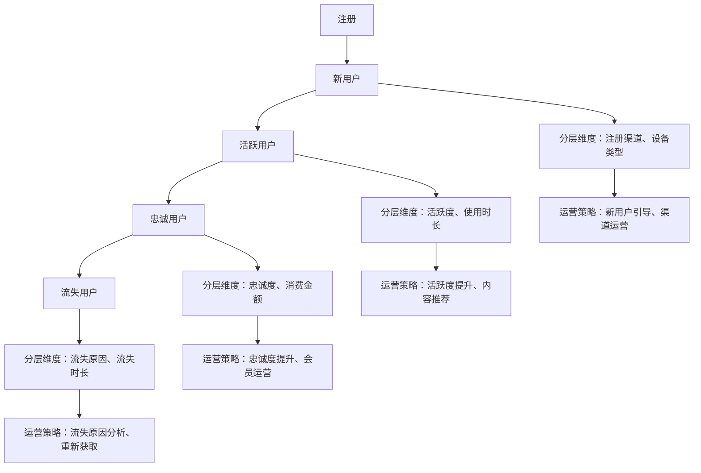

                 

**用户分层运营**是现代互联网产品运营的核心策略之一，通过将用户按价值、活跃度等维度分层，实现差异化运营，提高运营效率和产品价值。本文将详细介绍如何进行有效的用户分层运营，包括核心概念、算法原理、数学模型、项目实践，以及工具和资源推荐。

## 1. 背景介绍

在互联网产品发展初期，运营者往往采用“一刀切”的方式对待所有用户，然而随着用户规模的扩大和运营成本的提高，这种方式已不再适用。用户分层运营正是基于此背景应运而生，通过对用户进行分层，实现差异化运营，提高运营效率和产品价值。

## 2. 核心概念与联系

### 2.1 核心概念

- **用户分层**：根据用户的特征（如价值、活跃度、忠诚度等）将用户划分为不同的层级。
- **差异化运营**：根据用户层级采取不同的运营策略，实现运营效率和产品价值的最大化。
- **用户生命周期**：用户从注册到流失的整个过程，分层运营需要考虑用户生命周期的不同阶段。

### 2.2 核心概念联系

用户分层运营的核心是将用户按特征分层，然后根据层级实施差异化运营。如下图所示，用户生命周期的不同阶段对应不同的分层维度和运营策略。



## 3. 核心算法原理 & 具体操作步骤

### 3.1 算法原理概述

用户分层运营的核心算法是**聚类算法**，将用户按特征聚为不同的类别，实现用户分层。常用的聚类算法包括K-Means、层次聚类、DBSCAN等。

### 3.2 算法步骤详解

以K-Means算法为例，用户分层运营的具体操作步骤如下：

1. **数据预处理**：收集用户数据，并对数据进行清洗、缺失值填充、特征工程等预处理。
2. **特征选择**：选择合适的特征（如活跃度、消费金额、使用时长等）作为分层维度。
3. **初始化聚类中心**：随机选择K个用户作为初始聚类中心。
4. **聚类**：将用户根据距离最近的聚类中心进行分类。
5. **更新聚类中心**：计算每个类别的聚类中心，并更新聚类中心的位置。
6. **重复聚类**：重复步骤4和5，直到聚类结果不再发生变化。
7. **评估聚类结果**：使用轮廓系数、Silhouette系数等指标评估聚类结果的质量。
8. **运营策略制定**：根据聚类结果，制定针对不同用户层级的运营策略。

### 3.3 算法优缺点

- **优点**：K-Means算法简单易用，运行速度快，适合大规模数据集。
- **缺点**：K-Means算法对初始聚类中心的选择敏感，聚类结果易受噪声数据影响，不适合非凸形状的数据集。

### 3.4 算法应用领域

用户分层运营的算法广泛应用于电商、社交、游戏等互联网产品，帮助运营者实现差异化运营，提高运营效率和产品价值。

## 4. 数学模型和公式 & 详细讲解 & 举例说明

### 4.1 数学模型构建

用户分层运营的数学模型可以表示为：

$$Z = \arg\max\sum_{k=1}^{K}\sum_{x\in C_k}sim(x,c_k)$$

其中，$Z$表示用户分层结果，$K$表示用户层级数，$C_k$表示第$k$层用户集合，$c_k$表示第$k$层聚类中心，$sim(x,c_k)$表示用户$x$与聚类中心$c_k$的相似度。

### 4.2 公式推导过程

上述数学模型的推导过程如下：

1. 定义用户特征向量$x = (x_1, x_2,..., x_n)$，其中$x_i$表示用户的第$i$个特征。
2. 定义聚类中心$c_k = (c_{k1}, c_{k2},..., c_{kn})$，其中$c_{ki}$表示第$k$层聚类中心的第$i$个特征。
3. 定义相似度函数$sim(x,c_k) = \frac{x \cdot c_k}{\|x\| \cdot \|c_k\|}$，其中$\|x\|$和$\|c_k\|$分别表示向量$x$和$c_k$的模长。
4. 目标函数为最大化用户与聚类中心的相似度之和，即$\arg\max\sum_{k=1}^{K}\sum_{x\in C_k}sim(x,c_k)$。

### 4.3 案例分析与讲解

例如，某电商平台想对用户进行分层运营，选择活跃度和消费金额作为分层维度。用户特征向量$x = (x_1, x_2)$，其中$x_1$表示用户的活跃度，$x_2$表示用户的消费金额。聚类中心$c_k = (c_{k1}, c_{k2})$，其中$c_{k1}$表示第$k$层聚类中心的活跃度，$c_{k2}$表示第$k$层聚类中心的消费金额。相似度函数$sim(x,c_k) = \frac{x_1c_{k1} + x_2c_{k2}}{\sqrt{x_1^2 + x_2^2} \cdot \sqrt{c_{k1}^2 + c_{k2}^2}}$。目标函数为最大化用户与聚类中心的相似度之和，即$\arg\max\sum_{k=1}^{K}\sum_{x\in C_k}sim(x,c_k)$。

## 5. 项目实践：代码实例和详细解释说明

### 5.1 开发环境搭建

用户分层运营项目的开发环境包括：

- **编程语言**：Python
- **数据处理库**：Pandas、NumPy
- **机器学习库**：Scikit-learn
- **可视化库**：Matplotlib、Seaborn

### 5.2 源代码详细实现

以下是用户分层运营项目的源代码实现（以K-Means算法为例）：
```python
import pandas as pd
import numpy as np
from sklearn.cluster import KMeans
from sklearn.preprocessing import StandardScaler
from sklearn.metrics import silhouette_score

# 加载用户数据
data = pd.read_csv('user_data.csv')

# 数据预处理
data = data.dropna()
X = data[['active', 'consumption']].values

# 特征标准化
scaler = StandardScaler()
X = scaler.fit_transform(X)

# K-Means聚类
kmeans = KMeans(n_clusters=3, random_state=0)
kmeans.fit(X)

# 评估聚类结果
score = silhouette_score(X, kmeans.labels_)
print('Silhouette Score:', score)

# 运营策略制定
labels = kmeans.labels_
data['cluster'] = labels
data.to_csv('clustered_users.csv', index=False)
```
### 5.3 代码解读与分析

上述代码实现了用户分层运营的关键步骤：

1. 加载用户数据，并对数据进行预处理。
2. 选择活跃度和消费金额作为分层维度，并对特征进行标准化。
3. 使用K-Means算法对用户进行聚类，并评估聚类结果的质量。
4. 根据聚类结果，制定针对不同用户层级的运营策略。

### 5.4 运行结果展示

运行上述代码后，将生成包含用户分层结果的CSV文件`clustered_users.csv`，运营者可以根据文件内容制定针对不同用户层级的运营策略。

## 6. 实际应用场景

### 6.1 用户生命周期管理

用户分层运营可以帮助运营者管理用户生命周期，实现差异化运营。例如，对新用户实施引导运营，对活跃用户实施内容推荐运营，对忠诚用户实施会员运营，对流失用户实施重新获取运营。

### 6.2 产品功能优化

用户分层运营可以帮助运营者优化产品功能，实现产品价值的最大化。例如，根据用户层级推荐个性化内容，优化产品界面，改进产品功能等。

### 6.3 运营成本节省

用户分层运营可以帮助运营者节省运营成本，实现运营效率的提高。例如，对高价值用户实施重点运营，对低价值用户实施低成本运营等。

### 6.4 未来应用展望

随着互联网产品的发展，用户分层运营将会越来越重要。未来，用户分层运营将会结合更多的技术手段，如人工智能、大数据等，实现更精准、更智能的运营。

## 7. 工具和资源推荐

### 7.1 学习资源推荐

- **书籍**：《数据分析入门》《机器学习》《Python机器学习实用指南》
- **在线课程**： Coursera、Udacity、edX上的机器学习和数据分析课程
- **博客**：KDnuggets、Towards Data Science、Medium上的机器学习和数据分析文章

### 7.2 开发工具推荐

- **编辑器**：PyCharm、Jupyter Notebook、Visual Studio Code
- **数据库**：MySQL、PostgreSQL、MongoDB
- **可视化工具**：Tableau、Power BI、Looker

### 7.3 相关论文推荐

- **用户分层运营相关论文**：[User Segmentation for Personalized Recommender Systems](https://dl.acm.org/doi/10.1145/3178876.3188520)、[Customer Segmentation Using Clustering Algorithms](https://ieeexplore.ieee.org/document/7922263)
- **机器学习相关论文**：[K-Means](https://dl.acm.org/doi/10.5555/321032.321034)、[DBSCAN](https://dl.acm.org/doi/10.1145/344779.344801)

## 8. 总结：未来发展趋势与挑战

### 8.1 研究成果总结

本文详细介绍了用户分层运营的核心概念、算法原理、数学模型、项目实践，以及工具和资源推荐。通过实践项目，运营者可以实现差异化运营，提高运营效率和产品价值。

### 8.2 未来发展趋势

未来，用户分层运营将会结合更多的技术手段，如人工智能、大数据等，实现更精准、更智能的运营。此外，用户分层运营将会与其他运营策略结合，实现全面的运营管理。

### 8.3 面临的挑战

用户分层运营面临的挑战包括：

- **数据质量**：用户分层运营需要大量的用户数据，然而数据质量往往不高，需要进行预处理。
- **算法选择**：用户分层运营需要选择合适的聚类算法，然而算法选择往往需要大量的实验和调参。
- **运营成本**：用户分层运营需要投入大量的人力和物力，运营成本较高。

### 8.4 研究展望

未来，用户分层运营的研究将会朝着以下方向发展：

- **实时分层**：实现实时的用户分层，根据用户实时行为进行分层。
- **动态分层**：实现动态的用户分层，根据用户生命周期的变化进行分层。
- **多维度分层**：实现多维度的用户分层，结合更多的维度进行分层。

## 9. 附录：常见问题与解答

**Q1：用户分层运营的目的是什么？**

A1：用户分层运营的目的是实现差异化运营，提高运营效率和产品价值。

**Q2：用户分层运营的核心算法是什么？**

A2：用户分层运营的核心算法是聚类算法，常用的聚类算法包括K-Means、层次聚类、DBSCAN等。

**Q3：用户分层运营的优点是什么？**

A3：用户分层运营的优点包括实现差异化运营、提高运营效率、提高产品价值等。

**Q4：用户分层运营的缺点是什么？**

A4：用户分层运营的缺点包括数据质量不高、算法选择困难、运营成本高等。

**Q5：用户分层运营的未来发展趋势是什么？**

A5：用户分层运营的未来发展趋势包括实时分层、动态分层、多维度分层等。

**作者：禅与计算机程序设计艺术 / Zen and the Art of Computer Programming**

