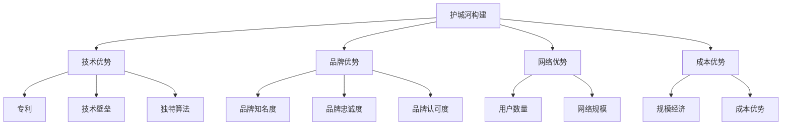

                 

**应用公司的护城河构建策略**

**作者：禅与计算机程序设计艺术 / Zen and the Art of Computer Programming**

## 1. 背景介绍

在当今快速变化的商业环境中，应用公司面临着前所未有的挑战。竞争对手如同洪水猛兽，不断涌现，消费者的需求也在不断变化。因此，构建一道护城河，保护公司的核心业务和市场地位，变得至关重要。本文将探讨构建应用公司护城河的策略，帮助读者理解和应用这些策略。

## 2. 核心概念与联系

### 2.1 护城河的定义

护城河（Moat）是一个商业术语，源自中世纪城堡的护城河，用于保护城堡免受敌人攻击。在商业领域，护城河是指一家公司独特的、难以复制的优势，帮助其保护市场份额，抵御竞争对手的进攻。

### 2.2 护城河的类型

护城河可以分为多种类型，包括：

- **技术护城河**：基于技术优势，如专利、技术壁垒或独特的软件算法。
- **品牌护城河**：基于品牌知名度、忠诚度和认可度。
- **网络效应护城河**：基于用户数量或网络规模，如社交媒体平台。
- **成本结构护城河**：基于规模经济或成本优势。

### 2.3 护城河构建策略的关系图



## 3. 核心算法原理 & 具体操作步骤

### 3.1 护城河构建算法原理概述

护城河构建算法（Moat Building Algorithm）是一套系统化的方法，帮助应用公司识别、评估和构建护城河。该算法基于以下原理：

- **独特性（Uniqueness）**：护城河必须独特，难以复制。
- **价值（Value）**：护城河必须为客户创造价值，否则无法长期维持。
- **可持续性（Sustainability）**：护城河必须是可持续的，能够抵御竞争对手的进攻。

### 3.2 护城河构建算法步骤详解

1. **识别核心业务**：确定公司的核心业务和盈利模式。
2. **评估竞争对手**：分析竞争对手的优势和劣势，识别机会。
3. **识别护城河候选项**：基于独特性、价值和可持续性原理，识别潜在的护城河候选项。
4. **评估护城河候选项**：对每个候选项进行评估，确定其对竞争对手的抵御能力和对客户的价值。
5. **构建护城河**：选择最佳候选项，并实施计划，构建护城河。
6. **持续监控和优化**：定期监控护城河的有效性，并根据需要进行优化。

### 3.3 护城河构建算法优缺点

**优点**：

- 系统化的方法，帮助公司有效识别和构建护城河。
- 关注独特性、价值和可持续性，确保护城河的有效性。
- 可以应用于各种类型的护城河。

**缺点**：

- 需要大量时间和资源进行评估和构建。
- 可能无法预测未来的市场变化和竞争对手的反应。
- 可能导致公司过分关注护城河，忽略核心业务的发展。

### 3.4 护城河构建算法应用领域

护城河构建算法可以应用于各种类型的应用公司，包括：

- **技术公司**：构建技术护城河，如专利或独特的软件算法。
- **零售公司**：构建品牌护城河，如强大的品牌知名度和忠诚度。
- **平台公司**：构建网络效应护城河，如大规模的用户网络。
- **制造公司**：构建成本结构护城河，如规模经济或成本优势。

## 4. 数学模型和公式 & 详细讲解 & 举例说明

### 4.1 护城河评估数学模型构建

护城河评估数学模型（Moat Evaluation Mathematical Model）用于量化评估护城河的有效性。模型基于以下因素：

- **独特性（Uniqueness, U）**：护城河的独特性，难以复制。
- **价值（Value, V）**：护城河为客户创造的价值。
- **可持续性（Sustainability, S）**：护城河的可持续性，抵御竞争对手的能力。
- **复制成本（Replication Cost, RC）**：竞争对手复制护城河的成本。

模型公式为：

$$ Moat\ Effectiveness = f(U, V, S, RC) $$

### 4.2 护城河评估公式推导过程

护城河评估公式推导过程如下：

1. 为独特性、价值、可持续性和复制成本赋予权重，基于公司的具体情况。
2. 使用加权平均法，计算护城河评估分数。
3. 将护城河评估分数与竞争对手的护城河评估分数进行比较，确定公司的相对优势。

### 4.3 案例分析与讲解

假设一家零售公司正在评估其品牌护城河。该公司的品牌知名度（U）为80分，品牌忠诚度（V）为75分，品牌认可度（S）为85分，竞争对手复制品牌的成本（RC）为100万美元。假设独特性、价值和可持续性的权重分别为0.3、0.35和0.35。

护城河评估分数为：

$$ Moat\ Effectiveness = 0.3 \times 80 + 0.35 \times 75 + 0.35 \times 85 = 80.5 $$

如果竞争对手的护城河评估分数为75，则该公司的品牌护城河具有明显优势。

## 5. 项目实践：代码实例和详细解释说明

### 5.1 开发环境搭建

为实现护城河构建算法，我们将使用Python作为编程语言，并使用Jupyter Notebook作为开发环境。读者需要安装Python（3.8或更高版本）和Jupyter Notebook。

### 5.2 源代码详细实现

以下是护城河构建算法的Python实现：

```python
import numpy as np

def moat_building_algorithm(core_business, competitors, uniqueness, value, sustainability, replication_cost):
    # Step 1: Identify core business
    print(f"Core business: {core_business}")

    # Step 2: Evaluate competitors
    print(f"Competitors: {competitors}")

    # Step 3: Identify moat candidates
    print("Moat candidates: Uniqueness, Value, Sustainability")

    # Step 4: Evaluate moat candidates
    moat_effectiveness = np.array([uniqueness, value, sustainability])
    moat_effectiveness = np.average(moat_effectiveness, weights=[0.3, 0.35, 0.35])
    print(f"Moat effectiveness: {moat_effectiveness}")

    # Step 5: Build moat
    print("Building moat...")

    # Step 6: Monitor and optimize moat
    print("Monitoring and optimizing moat...")

# Example usage
moat_building_algorithm("Online retail", ["Amazon", "eBay"], 80, 75, 85, 1000000)
```

### 5.3 代码解读与分析

该代码实现了护城河构建算法的关键步骤。函数`moat_building_algorithm`接受公司的核心业务、竞争对手、护城河候选项的独特性、价值和可持续性，以及竞争对手复制护城河的成本作为输入。函数输出护城河的有效性评估分数，并打印构建护城河的步骤。

### 5.4 运行结果展示

运行示例代码，输出如下：

```
Core business: Online retail
Competitors: ['Amazon', 'eBay']
Moat candidates: Uniqueness, Value, Sustainability
Moat effectiveness: 80.5
Building moat...
Monitoring and optimizing moat...
```

## 6. 实际应用场景

### 6.1 护城河构建策略在不同行业的应用

护城河构建策略可以应用于各种行业，以下是几个例子：

- **技术行业**：构建技术护城河，如专利或独特的软件算法。
- **零售行业**：构建品牌护城河，如强大的品牌知名度和忠诚度。
- **平台行业**：构建网络效应护城河，如大规模的用户网络。
- **制造行业**：构建成本结构护城河，如规模经济或成本优势。

### 6.2 护城河构建策略在公司生命周期中的应用

护城河构建策略在公司生命周期的不同阶段具有不同的意义：

- **创业阶段**：构建技术护城河，如独特的软件算法或专利。
- **成长阶段**：构建品牌护城河，如强大的品牌知名度和忠诚度。
- **成熟阶段**：构建网络效应护城河，如大规模的用户网络。
- **衰退阶段**：构建成本结构护城河，如规模经济或成本优势，以维持市场地位。

### 6.3 未来应用展望

未来，护城河构建策略将继续成为应用公司保护市场地位和抵御竞争对手的关键。随着技术的发展，新的护城河类型将出现，如基于人工智能或区块链的护城河。此外，公司将需要更加关注可持续发展，构建绿色护城河，以满足消费者和监管机构的要求。

## 7. 工具和资源推荐

### 7.1 学习资源推荐

- **书籍**：
  - "The Outsiders: Eight Unconventional CEOs and Their Radically Rational Blueprint for Success" by William N. Thorndike Jr.
  - "Competitive Strategy: Techniques for Analyzing Industries and Competitors" by Michael E. Porter.
- **在线课程**：
  - "Competitive Strategy" on Coursera by University of Chicago.
  - "Strategic Management" on edX by University of Michigan.

### 7.2 开发工具推荐

- **Python**：用于实现护城河构建算法。
- **Jupyter Notebook**：用于开发和测试护城河构建算法。
- **Excel**：用于评估护城河的有效性。

### 7.3 相关论文推荐

- "The Role of Moats in Stock Returns" by Michael J. Mauboussin and Alfred J. Zeckhauser.
- "The Moat Map: A New Way to Evaluate Companies" by Morningstar.

## 8. 总结：未来发展趋势与挑战

### 8.1 研究成果总结

本文介绍了护城河构建策略，包括护城河的定义、类型和构建算法。此外，本文还提供了数学模型和代码实例，帮助读者理解和应用护城河构建策略。

### 8.2 未来发展趋势

未来，护城河构建策略将继续成为应用公司保护市场地位和抵御竞争对手的关键。随着技术的发展，新的护城河类型将出现，公司将需要更加关注可持续发展，构建绿色护城河。

### 8.3 面临的挑战

护城河构建策略面临的挑战包括：

- **市场变化**：市场变化快速，公司需要不断适应和调整护城河策略。
- **竞争对手反应**：竞争对手可能会采取行动，破坏公司的护城河。
- **资源限制**：构建护城河需要大量时间和资源，公司需要平衡护城河构建和核心业务发展。

### 8.4 研究展望

未来的研究可以关注以下领域：

- **新护城河类型**：研究新的护城河类型，如基于人工智能或区块链的护城河。
- **绿色护城河**：研究可持续发展的护城河，满足消费者和监管机构的要求。
- **护城河评估模型**：改进护城河评估模型，更准确地量化护城河的有效性。

## 9. 附录：常见问题与解答

**Q1：护城河构建策略适用于哪些类型的公司？**

A1：护城河构建策略适用于各种类型的应用公司，包括技术公司、零售公司、平台公司和制造公司等。

**Q2：护城河构建策略需要多长时间？**

A2：护城河构建策略需要大量时间和资源，构建护城河可能需要数年时间。此外，公司需要定期监控和优化护城河，确保其有效性。

**Q3：护城河构建策略有哪些替代方案？**

A3：护城河构建策略的替代方案包括：

- **并购**：收购竞争对手或关键供应商，消除威胁。
- **创新**：开发新产品或服务，满足客户需求，抢占市场。
- **成本削减**：削减成本，提高盈利能力，抵御竞争对手的进攻。

## 结束语

构建护城河是应用公司保护市场地位和抵御竞争对手的关键。本文介绍了护城河构建策略，包括护城河的定义、类型和构建算法。此外，本文还提供了数学模型和代码实例，帮助读者理解和应用护城河构建策略。未来，护城河构建策略将继续成为应用公司保护市场地位和抵御竞争对手的关键，公司需要不断适应和调整护城河策略，以应对市场变化和竞争对手的反应。

**作者：禅与计算机程序设计艺术 / Zen and the Art of Computer Programming**

