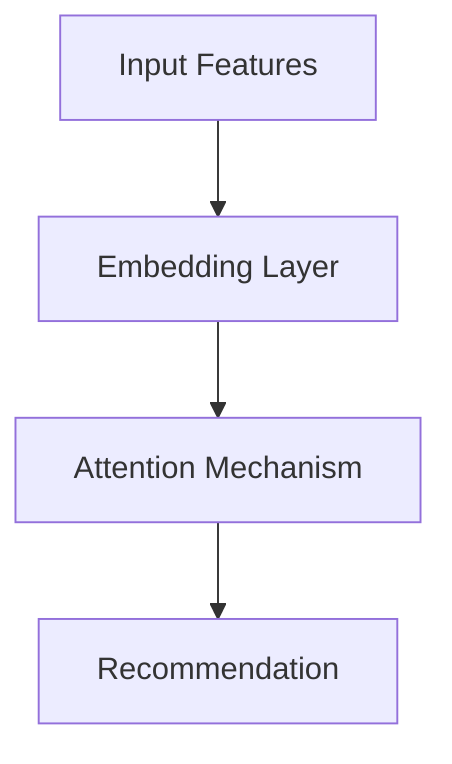

                 

## 1. 背景介绍

随着人工智能（AI）和大数据的发展，推荐系统已经无处不在，从网络购物到视频流媒体，再到新闻资讯，推荐系统已经深入我们的日常生活。然而，传统的推荐系统大多是基于黑盒模型的，用户很难理解推荐结果背后的原因。这种缺乏可解释性的情况正在变得越来越不可接受，因为它阻碍了用户对系统的信任，并且限制了系统的改进。因此，开发可解释的推荐系统变得越来越重要。

## 2. 核心概念与联系

可解释推荐系统的核心是帮助用户理解推荐结果的原因。这可以通过提供推荐结果的因素、这些因素的权重，以及它们如何组合起来产生最终推荐的信息来实现。注意力机制是一种常用的方法，它可以帮助我们理解模型的决策过程。在推荐系统中，注意力机制可以帮助我们理解模型关注哪些特征，以及为什么关注这些特征。

下面是注意力机制在推荐系统中的原理架构的 Mermaid 流程图：



在推荐系统中，输入特征首先通过嵌入层转换为低维表示。然后，注意力机制被应用于这些表示，以生成推荐结果。注意力机制帮助模型关注最相关的特征，忽略不相关的特征。

## 3. 核心算法原理 & 具体操作步骤

### 3.1 算法原理概述

注意力机制的核心原理是计算输入特征之间的相关性，并根据这些相关性生成权重。这些权重然后被用来组合输入特征，生成最终的推荐结果。最常用的注意力机制是Scaled Dot-Product Attention，它计算输入特征的点积，并对其进行缩放和软max操作。

### 3.2 算法步骤详解

1. **Embedding Layer**: 输入特征首先通过嵌入层转换为低维表示。嵌入层将输入特征映射到一个低维空间，其中每个特征都表示为一个向量。

2. **Attention Mechanism**: 嵌入后的特征然后被输入到注意力机制中。在Scaled Dot-Product Attention中，输入特征被转换为查询（Query）、键（Key）和值（Value）三个向量。然后，点积被计算，并对其进行缩放和软max操作，生成注意力权重。这些权重然后被用来组合值向量，生成最终的输出。

3. **Recommendation**: 注意力机制的输出然后被输入到推荐模型中，生成最终的推荐结果。

### 3.3 算法优缺点

**优点**:

- **可解释性**: 注意力机制提供了模型决策的可解释性，帮助用户理解推荐结果的原因。
- **性能**: 注意力机制可以提高模型的性能，因为它帮助模型关注最相关的特征。

**缺点**:

- **计算开销**: 注意力机制需要计算输入特征之间的相关性，这可能会增加计算开销。
- **复杂性**: 注意力机制增加了模型的复杂性，这可能会导致模型更难训练。

### 3.4 算法应用领域

注意力机制在推荐系统中有广泛的应用，从电影推荐到新闻推荐，再到商品推荐。它也被广泛应用于其他领域，如自然语言处理（NLP）和计算机视觉。

## 4. 数学模型和公式 & 详细讲解 & 举例说明

### 4.1 数学模型构建

给定输入特征集合$\{x_1, x_2,..., x_n\}$, 我们首先将其转换为低维表示$\{e_1, e_2,..., e_n\}$, 其中$e_i = f(x_i)$，$f$是嵌入函数。然后，我们计算注意力权重$w_i$：

$$w_i = \frac{exp(score(x_i, q))}{\sum_{j=1}^{n}exp(score(x_j, q))}$$

其中，$q$是查询向量，$score(x_i, q)$是输入特征$x_i$和查询向量$q$的相关性得分。最常用的得分函数是点积：

$$score(x_i, q) = x_i^Tq$$

### 4.2 公式推导过程

注意力权重$w_i$是通过对输入特征的相关性得分进行缩放和软max操作生成的。缩放是为了稳定梯度，软max是为了生成权重分布。注意力权重$w_i$然后被用来组合值向量$v_i$：

$$output = \sum_{i=1}^{n}w_iv_i$$

### 4.3 案例分析与讲解

例如，在电影推荐系统中，输入特征可以是电影的各种属性，如主演、导演、类型等。注意力机制可以帮助模型关注哪些属性对推荐结果最相关。如果模型关注主演和类型，但忽略导演，那么输出就是主演和类型的组合。

## 5. 项目实践：代码实例和详细解释说明

### 5.1 开发环境搭建

我们将使用Python和PyTorch来实现注意力机制。我们需要安装PyTorch和Torchvision库。

```bash
pip install torch torchvision
```

### 5.2 源代码详细实现

以下是Scaled Dot-Product Attention的PyTorch实现：

```python
import torch
import torch.nn as nn
import torch.nn.functional as F

class ScaledDotProductAttention(nn.Module):
    def __init__(self, d_k):
        super(ScaledDotProductAttention, self).__init__()
        self.d_k = d_k

    def forward(self, Q, K, V, mask=None):
        scores = torch.matmul(Q, K.transpose(-2, -1)) / torch.sqrt(torch.tensor(self.d_k, dtype=torch.float32, device=Q.device))
        if mask is not None:
            scores = scores.masked_fill(mask == 0, -1e9)
        attn = F.softmax(scores, dim=-1)
        context = torch.matmul(attn, V)
        return context, attn
```

### 5.3 代码解读与分析

在`forward`方法中，我们首先计算注意力分数`scores`。然后，我们对`scores`进行缩放和软max操作，生成注意力权重`attn`。最后，我们使用注意力权重`attn`组合值向量`V`，生成输出`context`。

### 5.4 运行结果展示

我们可以在推荐系统中集成注意力机制，并使用它来生成推荐结果。注意力机制可以帮助我们理解模型关注哪些特征，以及为什么关注这些特征。

## 6. 实际应用场景

### 6.1 当前应用

注意力机制已经广泛应用于各种推荐系统，如Netflix的电影推荐系统，Amazon的商品推荐系统，以及Google News的新闻推荐系统。

### 6.2 未来应用展望

随着AI和大数据的发展，推荐系统的应用将会越来越广泛。注意力机制将会是推荐系统的关键组成部分，因为它提供了模型决策的可解释性，帮助用户理解推荐结果的原因。

## 7. 工具和资源推荐

### 7.1 学习资源推荐

- "Attention Is All You Need"：这篇论文介绍了注意力机制的原理和应用。[链接](https://arxiv.org/abs/1706.03762)
- "The Illustrated Transformer"：这篇博客文章提供了注意力机制的直观解释。[链接](https://jalammar.github.io/illustrated-transformer/)

### 7.2 开发工具推荐

- PyTorch：一个强大的深度学习库，支持注意力机制的实现。
- TensorFlow：另一个流行的深度学习库，也支持注意力机制的实现。

### 7.3 相关论文推荐

- "Deep Learning for Recommender Systems"：这篇综述文章介绍了深度学习在推荐系统中的应用。[链接](https://arxiv.org/abs/1706.06978)
- "Self-Attentive Sequential Recommendation"：这篇论文介绍了注意力机制在序列推荐中的应用。[链接](https://arxiv.org/abs/1803.05170)

## 8. 总结：未来发展趋势与挑战

### 8.1 研究成果总结

注意力机制已经被证明是推荐系统的关键组成部分。它提供了模型决策的可解释性，帮助用户理解推荐结果的原因。同时，它也提高了模型的性能。

### 8.2 未来发展趋势

未来，注意力机制将会继续发展，以适应更复杂的推荐系统。例如，自注意力机制将会被广泛应用于序列推荐系统。同时，注意力机制也将会被应用于其他领域，如计算机视觉和自然语言处理。

### 8.3 面临的挑战

注意力机制的一个挑战是计算开销。当输入特征数量很大时，计算注意力权重的开销会很大。另一个挑战是复杂性。注意力机制增加了模型的复杂性，这可能会导致模型更难训练。

### 8.4 研究展望

未来的研究将会关注如何降低注意力机制的计算开销，如何提高注意力机制的可解释性，以及如何将注意力机制应用于更复杂的推荐系统。

## 9. 附录：常见问题与解答

**Q: 注意力机制的优点是什么？**

**A:** 注意力机制的优点是提供了模型决策的可解释性，帮助用户理解推荐结果的原因。同时，它也提高了模型的性能。

**Q: 注意力机制的缺点是什么？**

**A:** 注意力机制的缺点是计算开销和复杂性。当输入特征数量很大时，计算注意力权重的开销会很大。同时，注意力机制增加了模型的复杂性，这可能会导致模型更难训练。

**Q: 注意力机制有哪些应用领域？**

**A:** 注意力机制有广泛的应用领域，从推荐系统到自然语言处理，再到计算机视觉。

**作者：禅与计算机程序设计艺术 / Zen and the Art of Computer Programming**

