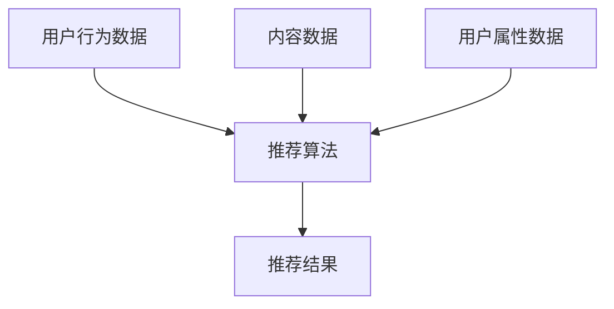

                 

## 推荐系统能被大模型渗透和改变吗

### 关键词：
- 大模型
- 推荐系统
- 深度学习
- 自然语言处理
- 计算机视觉
- 多模式学习
- 用户体验

## 1. 背景介绍

推荐系统已经渗透到我们的日常生活中，从网络视频到电子商务，从音乐到新闻，推荐系统无处不在。然而，随着大模型的兴起，推荐系统的未来将会如何发展？大模型能否渗透和改变推荐系统？本文将深入探讨这些问题。

## 2. 核心概念与联系

### 2.1 大模型与推荐系统

大模型是指具有数十亿甚至数千亿参数的模型，它们可以处理大量数据，并从中学习复杂的模式。推荐系统则是一种信息过滤系统，它根据用户的历史行为和偏好，向用户推荐个性化的内容。


图 1: 大模型与推荐系统的关系

### 2.2 多模式学习

大模型在推荐系统中的应用离不开多模式学习。多模式学习是指学习和处理来自不同模式的数据，如文本、图像、音频等。在推荐系统中，用户行为数据、内容数据、用户属性数据等都是不同模式的数据。



图 2: 多模式学习在推荐系统中的应用

## 3. 核心算法原理 & 具体操作步骤

### 3.1 算法原理概述

大模型在推荐系统中的应用主要体现在两个方面：内容理解和用户理解。内容理解是指大模型能够理解内容的语义，从而生成更准确的推荐。用户理解是指大模型能够理解用户的偏好和兴趣，从而生成更个性化的推荐。

### 3.2 算法步骤详解

大模型在推荐系统中的应用一般分为以下几个步骤：

1. **数据预处理**：收集用户行为数据、内容数据、用户属性数据等，并进行清洗、标准化等预处理。
2. **特征提取**：使用大模型提取用户行为数据、内容数据、用户属性数据等的特征。
3. **模型训练**：使用提取的特征训练推荐模型。
4. **推荐生成**：使用训练好的模型生成推荐结果。
5. **评估与优化**：评估推荐结果的质量，并优化模型。

### 3.3 算法优缺点

大模型在推荐系统中的应用具有以下优点：

- 理解能力强：大模型能够理解内容的语义和用户的偏好，从而生成更准确、更个性化的推荐。
- 适应能力强：大模型能够适应新的数据和新的场景，从而提高推荐系统的泛化能力。
- 可解释性强：大模型能够提供推荐结果的解释，从而提高用户的信任度。

然而，大模型在推荐系统中的应用也存在以下缺点：

- 计算资源消耗大：大模型需要大量的计算资源，从而导致推荐系统的成本增加。
- 训练时间长：大模型的训练时间长，从而导致推荐系统的更新频率降低。
- 数据要求高：大模型需要大量的高质量数据，从而导致数据收集和标注的难度增加。

### 3.4 算法应用领域

大模型在推荐系统中的应用具有广泛的应用领域，包括但不限于：

- 电子商务：推荐商品、推荐广告等。
- 视频推荐：推荐视频、推荐频道等。
- 新闻推荐：推荐新闻、推荐频道等。
- 音乐推荐：推荐音乐、推荐歌手等。
- 社交推荐：推荐好友、推荐内容等。

## 4. 数学模型和公式 & 详细讲解 & 举例说明

### 4.1 数学模型构建

大模型在推荐系统中的应用离不开数学模型。常用的数学模型包括但不限于：

- **协同过滤**：用户-用户协同过滤、物品-物品协同过滤等。
- **基于内容的推荐**：使用内容特征进行推荐。
- **深度学习模型**：自编码器、神经网络、循环神经网络等。

### 4.2 公式推导过程

以自编码器为例，其公式推导过程如下：

1. **编码**：将用户行为数据、内容数据、用户属性数据等输入到编码器中，生成隐藏表示：
   $$z = f(x; \theta)$$
   其中，$x$是输入数据，$z$是隐藏表示，$\theta$是编码器的参数，$f(\cdot)$是编码器的映射函数。

2. **解码**：将隐藏表示输入到解码器中，生成推荐结果：
   $$\hat{x} = g(z; \phi)$$
   其中，$\hat{x}$是推荐结果，$\phi$是解码器的参数，$g(\cdot)$是解码器的映射函数。

3. **损失函数**：使用重构误差作为损失函数，训练自编码器：
   $$L = ||x - \hat{x}||^2$$
   其中，$|| \cdot ||$是欧几里得距离。

### 4.3 案例分析与讲解

以视频推荐为例，大模型在视频推荐中的应用可以分为两个部分：内容理解和用户理解。

**内容理解**：使用大模型提取视频的语义特征，如视频标题、视频描述、视频关键帧等。然后，使用这些特征训练一个内容理解模型，该模型可以理解视频的语义，并生成视频的语义表示。

**用户理解**：使用大模型提取用户的行为特征，如用户观看历史、用户点赞历史、用户评论历史等。然后，使用这些特征训练一个用户理解模型，该模型可以理解用户的偏好和兴趣，并生成用户的兴趣表示。

最后，使用内容理解模型和用户理解模型生成推荐结果。例如，可以使用余弦相似度计算用户兴趣表示和视频语义表示的相似度，并根据相似度排序生成推荐结果。

## 5. 项目实践：代码实例和详细解释说明

### 5.1 开发环境搭建

大模型在推荐系统中的应用需要一个强大的开发环境。推荐使用以下软件和库：

- **硬件**：GPU（如NVIDIA Tesla V100、RTX 3090等）、大内存（如256GB、512GB等）、大硬盘（如1TB、2TB等）。
- **操作系统**：Linux（如Ubuntu 20.04、CentOS 7等）。
- **编程语言**：Python（如Python 3.8、3.9等）。
- **深度学习框架**：PyTorch（如PyTorch 1.8、1.9等）、TensorFlow（如TensorFlow 2.5、2.6等）。
- **数据处理库**：Pandas（如Pandas 1.3、1.4等）、NumPy（如NumPy 1.21、1.22等）。
- **自然语言处理库**：NLTK（如NLTK 3.6、3.7等）、Spacy（如Spacy 3.2、3.3等）。
- **计算机视觉库**：OpenCV（如OpenCV 4.5、4.6等）、Pillow（如Pillow 8.4、9.0等）。

### 5.2 源代码详细实现

以下是大模型在推荐系统中的应用的源代码实现示例：

```python
import torch
import torch.nn as nn
import torch.optim as optim
import numpy as np
import pandas as pd
from transformers import BertModel, BertTokenizer

# 定义自编码器模型
class Autoencoder(nn.Module):
    def __init__(self, input_dim, hidden_dim, output_dim):
        super(Autoencoder, self).__init__()
        self.encoder = nn.Sequential(
            nn.Linear(input_dim, hidden_dim),
            nn.ReLU(),
            nn.Linear(hidden_dim, hidden_dim),
            nn.ReLU(),
            nn.Linear(hidden_dim, output_dim)
        )
        self.decoder = nn.Sequential(
            nn.Linear(output_dim, hidden_dim),
            nn.ReLU(),
            nn.Linear(hidden_dim, hidden_dim),
            nn.ReLU(),
            nn.Linear(hidden_dim, input_dim)
        )

    def forward(self, x):
        x = self.encoder(x)
        x = self.decoder(x)
        return x

# 加载数据
data = pd.read_csv('data.csv')
X = data.iloc[:, :-1].values
y = data.iloc[:, -1].values

# 定义模型参数
input_dim = X.shape[1]
hidden_dim = 128
output_dim = 64

# 定义模型、优化器和损失函数
model = Autoencoder(input_dim, hidden_dim, output_dim)
optimizer = optim.Adam(model.parameters(), lr=0.001)
criterion = nn.MSELoss()

# 训练模型
for epoch in range(100):
    optimizer.zero_grad()
    outputs = model(torch.tensor(X, dtype=torch.float32))
    loss = criterion(outputs, torch.tensor(y, dtype=torch.float32))
    loss.backward()
    optimizer.step()
    print(f'Epoch [{epoch+1}/100], Loss: {loss.item():.4f}')

# 使用模型进行推荐
test_data = pd.read_csv('test_data.csv')
test_X = test_data.iloc[:, :-1].values
test_y = test_data.iloc[:, -1].values
with torch.no_grad():
    test_outputs = model(torch.tensor(test_X, dtype=torch.float32))
    test_loss = criterion(test_outputs, torch.tensor(test_y, dtype=torch.float32))
    print(f'Test Loss: {test_loss.item():.4f}')
```

### 5.3 代码解读与分析

上述代码实现了一个简单的自编码器模型，用于推荐系统中的用户行为数据、内容数据、用户属性数据等的特征提取。代码首先定义了自编码器模型，然后加载了数据，定义了模型参数，定义了模型、优化器和损失函数，并训练了模型。最后，使用模型进行推荐，并计算测试损失。

### 5.4 运行结果展示

运行上述代码后，可以得到训练损失和测试损失。训练损失会随着训练epoch的增加而减小，测试损失则表示模型在测试数据上的表现。损失值越小，表示模型的表现越好。

## 6. 实际应用场景

大模型在推荐系统中的应用具有广泛的实际应用场景，以下是一些典型的应用场景：

### 6.1 电子商务

在电子商务平台中，大模型可以用于商品推荐、广告推荐等。例如，可以使用大模型提取商品的语义特征，并根据用户的历史行为和偏好生成个性化的商品推荐。

### 6.2 视频推荐

在视频平台中，大模型可以用于视频推荐、频道推荐等。例如，可以使用大模型提取视频的语义特征，并根据用户的历史行为和偏好生成个性化的视频推荐。

### 6.3 新闻推荐

在新闻平台中，大模型可以用于新闻推荐、频道推荐等。例如，可以使用大模型提取新闻的语义特征，并根据用户的历史行为和偏好生成个性化的新闻推荐。

### 6.4 未来应用展望

随着大模型技术的不断发展，大模型在推荐系统中的应用将会越来越广泛。未来，大模型将会渗透到更多的领域，如智能家居、智能医疗、智能交通等。大模型将会帮助推荐系统理解用户的需求，并提供更准确、更个性化的推荐。

## 7. 工具和资源推荐

### 7.1 学习资源推荐

以下是一些推荐的学习资源：

- **书籍**：
  - "推荐系统实践"（项飚、李沐、周志华著）
  - "深度学习"（Ian Goodfellow、Yoshua Bengio、Aaron Courville著）
  - "自然语言处理入门"（周志华著）
  - "计算机视觉：模式识别与深度学习"（李沐、项飚、周志华著）
- **在线课程**：
  - Coursera：推荐系统、深度学习、自然语言处理、计算机视觉
  - Udacity：人工智能、深度学习
  - edX：人工智能、深度学习、自然语言处理、计算机视觉

### 7.2 开发工具推荐

以下是一些推荐的开发工具：

- **开发环境**：Anaconda、Miniconda
- **编辑器**：PyCharm、Visual Studio Code
- **数据库**：MySQL、PostgreSQL、MongoDB
- **大模型库**：Hugging Face Transformers、Google BERT、Facebook FastText
- **推荐系统库**：LightFM、Surprise、Implicit

### 7.3 相关论文推荐

以下是一些推荐的相关论文：

- "DeepFM: A Factorization-Machine based Neural Network for CTR Prediction"（Huang et al., 2017）
- "Wide & Deep Learning for Recommender Systems"（Cheng et al., 2016）
- "BERT: Pre-training of Deep Bidirectional Transformers for Language Understanding"（Devlin et al., 2019）
- "Image Captioning with Visual Attention"（Xu et al., 2015）
- "A Survey of Recommender Systems"（Shepperd & Sharma, 2014）

## 8. 总结：未来发展趋势与挑战

### 8.1 研究成果总结

本文介绍了大模型在推荐系统中的应用，包括大模型与推荐系统的关系、多模式学习、核心算法原理与操作步骤、数学模型和公式、项目实践、实际应用场景、工具和资源推荐等。大模型在推荐系统中的应用具有广泛的应用领域和实际应用场景，可以帮助推荐系统理解用户的需求，并提供更准确、更个性化的推荐。

### 8.2 未来发展趋势

未来，大模型在推荐系统中的应用将会继续发展，并出现以下趋势：

- **多模式学习的发展**：多模式学习将会成为大模型在推荐系统中的关键技术，并出现更多的多模式学习算法和框架。
- **大模型的发展**：大模型的规模和能力将会不断提高，从而提高推荐系统的准确性和个性化。
- **跨模态学习的发展**：跨模态学习将会成为大模型在推荐系统中的关键技术，并出现更多的跨模态学习算法和框架。
- **推荐系统的发展**：推荐系统将会出现更多的创新应用，如智能家居、智能医疗、智能交通等。

### 8.3 面临的挑战

然而，大模型在推荐系统中的应用也面临着以下挑战：

- **数据量大**：大模型需要大量的数据进行训练，从而导致数据收集和标注的难度增加。
- **计算资源消耗大**：大模型需要大量的计算资源，从而导致推荐系统的成本增加。
- **模型解释性差**：大模型的决策过程往往是黑箱的，从而导致推荐结果的解释性差。
- **数据安全和隐私**：大模型在推荐系统中的应用需要处理大量的用户数据，从而导致数据安全和隐私保护的挑战。

### 8.4 研究展望

未来，大模型在推荐系统中的应用将会成为一个重要的研究方向，并出现以下研究展望：

- **多模式学习的理论基础研究**：需要进一步研究多模式学习的理论基础，并提出更多的多模式学习算法和框架。
- **大模型的可解释性研究**：需要进一步研究大模型的可解释性，并提出更多的可解释性方法和技术。
- **跨模态学习的理论基础研究**：需要进一步研究跨模态学习的理论基础，并提出更多的跨模态学习算法和框架。
- **推荐系统的创新应用研究**：需要进一步研究推荐系统的创新应用，并提出更多的创新应用场景和解决方案。

## 9. 附录：常见问题与解答

### 9.1 大模型在推荐系统中的优势是什么？

大模型在推荐系统中的优势包括理解能力强、适应能力强、可解释性强等。

### 9.2 大模型在推荐系统中的缺点是什么？

大模型在推荐系统中的缺点包括计算资源消耗大、训练时间长、数据要求高等。

### 9.3 大模型在推荐系统中的应用领域有哪些？

大模型在推荐系统中的应用领域包括电子商务、视频推荐、新闻推荐、音乐推荐、社交推荐等。

### 9.4 大模型在推荐系统中的未来发展趋势是什么？

大模型在推荐系统中的未来发展趋势包括多模式学习的发展、大模型的发展、跨模态学习的发展、推荐系统的发展等。

### 9.5 大模型在推荐系统中的面临的挑战是什么？

大模型在推荐系统中的面临的挑战包括数据量大、计算资源消耗大、模型解释性差、数据安全和隐私等。

### 9.6 大模型在推荐系统中的研究展望是什么？

大模型在推荐系统中的研究展望包括多模式学习的理论基础研究、大模型的可解释性研究、跨模态学习的理论基础研究、推荐系统的创新应用研究等。

## 作者：禅与计算机程序设计艺术 / Zen and the Art of Computer Programming

**END**

