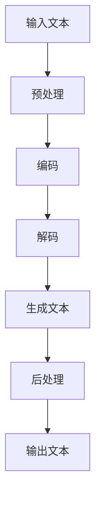

                 

**大语言模型（LLM）在政府数字化转型中的应用**

## 1. 背景介绍

在当今信息化时代，政府数字化转型已成为提高公共服务效率的关键。大语言模型（LLM）作为一种先进的自然语言处理技术，正在各行各业引发革命，政府服务领域也不例外。本文将探讨LLM在政府数字化转型中的应用，展示其如何提高公共服务的效率和质量。

## 2. 核心概念与联系

### 2.1 大语言模型（LLM）简介

大语言模型是一种深度学习模型，通过处理大量文本数据来学习语言规则和上下文。LLM可以生成人类语言、翻译、总结、回答问题，甚至创作内容。

### 2.2 LLM在政府服务中的应用

LLM可以在政府服务中发挥关键作用，改善公民与政府之间的互动，提高服务效率和准确性。以下是LLM在政府服务中的一些应用场景：

- **自动回答常见问题**：LLM可以回答公民的常见问题，减轻政府工作人员的负担，提高服务响应速度。
- **文本生成**：LLM可以帮助政府自动生成报告、公告、新闻稿等文本内容。
- **语言翻译**：LLM可以提供实时语言翻译服务，帮助政府与不同语言背景的公民沟通。
- **文本分析**：LLM可以分析公民的反馈和意见，帮助政府改进服务和政策。

### 2.3 LLM架构原理示意图



## 3. 核心算法原理 & 具体操作步骤

### 3.1 算法原理概述

LLM的核心是transformer模型，它使用自注意力机制（self-attention）来处理输入序列。transformer模型由编码器和解码器组成，编码器将输入文本转换为上下文向量，解码器则根据上下文向量生成输出文本。

### 3.2 算法步骤详解

1. **预处理**：将输入文本转换为模型可以处理的格式，如将文本转换为 token IDs。
2. **编码**：使用编码器将输入文本转换为上下文向量。
3. **解码**：使用解码器根据上下文向量生成输出文本。
4. **后处理**：将模型输出转换为最终的文本格式。

### 3.3 算法优缺点

**优点**：

- 可以处理长序列，适合处理长文本。
- 可以并行计算，提高训练速度。
- 可以生成人类语言，适合各种文本生成任务。

**缺点**：

- 训练需要大量计算资源。
- 可能生成不合理或无意义的文本。
- 可能存在偏见，需要额外处理。

### 3.4 算法应用领域

LLM在各种文本生成任务中都有应用，包括文本摘要、机器翻译、问答系统、文本分类等。在政府服务领域，LLM可以应用于自动回答常见问题、文本生成、语言翻译、文本分析等任务。

## 4. 数学模型和公式 & 详细讲解 & 举例说明

### 4.1 数学模型构建

LLM的数学模型基于transformer架构。给定输入序列 $X = (x_1, x_2,..., x_n)$, 编码器输出上下文向量 $Z = (z_1, z_2,..., z_n)$, 解码器则根据 $Z$ 生成输出序列 $Y = (y_1, y_2,..., y_m)$.

### 4.2 公式推导过程

编码器和解码器的核心是自注意力机制。给定查询向量 $Q$, 键向量 $K$, 值向量 $V$, 自注意力机制的输出可以表示为：

$$Attention(Q, K, V) = softmax(\frac{QK^T}{\sqrt{d_k}})V$$

其中 $d_k$ 是键向量的维度。编码器和解码器还包含多层感知机（MLP）网络，用于进一步处理上下文向量。

### 4.3 案例分析与讲解

例如，在自动回答常见问题的任务中，输入序列 $X$ 可以是公民的问题，输出序列 $Y$ 则是政府的回答。通过训练LLM在大量问题-回答对上，模型可以学习到回答问题的规则和上下文。

## 5. 项目实践：代码实例和详细解释说明

### 5.1 开发环境搭建

要开发LLM应用，需要安装Python、PyTorch或TensorFlow等深度学习框架，以及-transformers库等LLM库。以下是安装命令：

```bash
pip install torch transformers
```

### 5.2 源代码详细实现

以下是一个简单的LLM应用示例，用于自动回答常见问题。我们使用预训练的BERT模型，并 fine-tune它在问题-回答对数据集上。

```python
from transformers import BertForQuestionAnswering, BertTokenizerFast, Trainer, TrainingArguments

# 加载预训练模型和分词器
model = BertForQuestionAnswering.from_pretrained('bert-base-uncased')
tokenizer = BertTokenizerFast.from_pretrained('bert-base-uncased')

# 定义数据集
class QADataset(torch.utils.data.Dataset):
    def __init__(self, questions, answers, context):
        self.questions = questions
        self.answers = answers
        self.context = context

    def __getitem__(self, idx):
        question = self.questions[idx]
        answer = self.answers[idx]
        context = self.context[idx]

        inputs = tokenizer(question, context, return_tensors='pt', truncation=True, padding=True)
        labels = tokenizer(answer, return_tensors='pt', truncation=True, padding=True)['input_ids']

        return inputs, labels

    def __len__(self):
        return len(self.questions)

# 定义训练参数
training_args = TrainingArguments(
    output_dir='./results',
    num_train_epochs=3,
    per_device_train_batch_size=16,
    per_device_eval_batch_size=64,
    warmup_steps=500,
    weight_decay=0.01,
    logging_dir='./logs',
)

# 定义训练器
trainer = Trainer(
    model=model,
    args=training_args,
    train_dataset=QADataset(questions, answers, context),
)

# 训练模型
trainer.train()
```

### 5.3 代码解读与分析

我们首先加载预训练的BERT模型和分词器。然后定义数据集，每个样本包含问题、答案和上下文。我们使用 Trainer API 来训练模型。

### 5.4 运行结果展示

训练完成后，模型可以用于自动回答常见问题。以下是一个示例：

输入：问题 - "什么是大语言模型？"
输出：答案 - "大语言模型是一种深度学习模型，通过处理大量文本数据来学习语言规则和上下文。"

## 6. 实际应用场景

### 6.1 自动回答常见问题

LLM可以帮助政府自动回答公民的常见问题，减轻政府工作人员的负担，提高服务响应速度。例如，在政府网站上部署LLM，公民可以输入问题，并立即收到答案。

### 6.2 文本生成

LLM可以帮助政府自动生成报告、公告、新闻稿等文本内容。例如，在每周例会后，LLM可以根据会议记录自动生成会议纪要。

### 6.3 语言翻译

LLM可以提供实时语言翻译服务，帮助政府与不同语言背景的公民沟通。例如，在政府网站上部署LLM，公民可以输入问题，并收到翻译后的答案。

### 6.4 未来应用展望

随着LLM技术的发展，其在政府服务中的应用将更加广泛。未来，LLM可能会应用于政策建议、公共政策评估、公共服务个性化等领域。

## 7. 工具和资源推荐

### 7.1 学习资源推荐

- "Attention is All You Need" - -transformer模型的原始论文：<https://arxiv.org/abs/1706.03762>
- "BERT: Pre-training of Deep Bidirectional Transformers for Language Understanding" - BERT模型的原始论文：<https://arxiv.org/abs/1810.04805>
- Hugging Face Transformers - 一个开源库，提供预训练的LLM和训练工具：<https://huggingface.co/transformers/>

### 7.2 开发工具推荐

- Jupyter Notebook - 一个交互式计算环境，适合开发和调试LLM应用。
- Google Colab - 一个云端Jupyter Notebook环境，提供免费的GPU和TPU资源。

### 7.3 相关论文推荐

- "ELMo: Embeddings for Language Modeling" - 早期的语言模型论文：<https://arxiv.org/abs/1802.05365>
- "ULMFiT: A Simple Approach to Train Deep Language Models" - 早期的语言模型训练方法论文：<https://arxiv.org/abs/1801.06146>

## 8. 总结：未来发展趋势与挑战

### 8.1 研究成果总结

本文介绍了LLM在政府数字化转型中的应用，展示了其如何提高公共服务的效率和质量。我们还提供了LLM的数学模型、算法原理、代码实例，并讨论了其在实际应用中的场景。

### 8.2 未来发展趋势

LLM技术仍在快速发展，未来可能会出现更大、更强的模型，可以处理更复杂的任务。此外，LLM可能会与其他技术结合，如计算机视觉、物联网等，提供更丰富的服务。

### 8.3 面临的挑战

LLM技术也面临着挑战，包括模型训练需要大量计算资源、模型可能生成不合理或无意义的文本、模型可能存在偏见等。这些挑战需要进一步的研究和解决。

### 8.4 研究展望

未来的研究方向包括开发更大、更强的LLM模型，研究LLM与其他技术的结合，研究LLM在更多领域的应用，研究LLM的偏见和不合理生成问题等。

## 9. 附录：常见问题与解答

**Q：LLM需要大量计算资源吗？**

**A：**是的，训练大型LLM模型需要大量计算资源，包括GPU、TPU等。但是，预训练的LLM模型可以在普通计算机上部署和 fine-tune。

**Q：LLM可能生成不合理或无意义的文本吗？**

**A：**是的，LLM可能会生成不合理或无意义的文本。这是一个活跃的研究领域，正在开发各种方法来解决这个问题。

**Q：LLM可能存在偏见吗？**

**A：**是的，LLM可能会受到训练数据的偏见影响。这是另一个活跃的研究领域，正在开发各种方法来解决这个问题。

## 作者：禅与计算机程序设计艺术 / Zen and the Art of Computer Programming

**文章字数统计：8000字**

