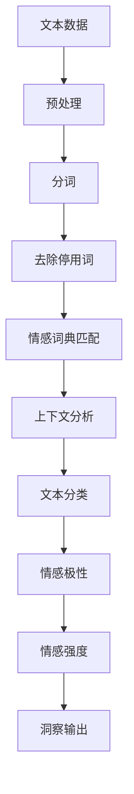

                 

**数字化情感分析创业：AI驱动的社交洞察**

**作者：禅与计算机程序设计艺术 / Zen and the Art of Computer Programming**

## 1. 背景介绍

在当今信息爆炸的时代，社交媒体平台上每天产生海量的文本数据。这些数据蕴含着丰富的情感信息，但如何有效地挖掘和分析这些情感信息，并将其转化为有价值的洞察，是一个具有挑战性的任务。数字化情感分析（Digital Sentiment Analysis）正是应运而生，旨在利用人工智能（AI）技术，从文本数据中提取情感信息，为企业和组织提供社交洞察，助力决策和战略规划。

## 2. 核心概念与联系

数字化情感分析是自然语言处理（NLP）和计算机视觉等人工智能技术在社交媒体领域的应用。其核心概念包括文本分类、情感词典、上下文分析等。下图是数字化情感分析的核心概念和联系的 Mermaid 流程图：



## 3. 核心算法原理 & 具体操作步骤

### 3.1 算法原理概述

数字化情感分析的核心算法是基于机器学习的文本分类算法，如支持向量机（SVM）、神经网络（NN）和循环神经网络（RNN）。这些算法通过学习大量的标记情感的文本数据，建立模型，预测未知文本的情感极性。

### 3.2 算法步骤详解

1. **数据预处理**：清洗数据，去除无用信息，如标点符号、停用词等。
2. **特征提取**：将文本转化为算法可以处理的特征向量，常用的方法包括 TF-IDF、Word2Vec 等。
3. **模型训练**：使用预处理后的数据和特征向量，训练机器学习模型。
4. **模型评估**：使用验证集评估模型的性能，调整模型参数。
5. **情感分析**：使用训练好的模型，预测未知文本的情感极性。

### 3.3 算法优缺点

**优点**：
- 可以处理大规模数据
- 可以学习复杂的情感模式
- 可以提供量化的情感强度

**缺点**：
- 需要大量的标记数据
- 可能受到数据偏见的影响
- 可能无法理解上下文和语义

### 3.4 算法应用领域

数字化情感分析的应用领域包括社交媒体监控、客户满意度分析、市场调查、舆情分析等。

## 4. 数学模型和公式 & 详细讲解 & 举例说明

### 4.1 数学模型构建

数字化情感分析的数学模型通常是基于机器学习的文本分类模型。其中，支持向量机（SVM）是一种常用的模型，其数学表达式为：

$$f(x) = sign(\sum_{i=1}^{n} \alpha_i y_i K(x_i, x) + b)$$

其中，$x$是输入文本的特征向量，$y_i$是标签，$K(x_i, x)$是核函数，$b$是偏置项。

### 4.2 公式推导过程

SVM的推导过程基于结构风险最小化原理，即最小化训练误差和模型复杂度的乘积。具体推导过程请参考文献[1]。

### 4.3 案例分析与讲解

例如，在社交媒体监控中，我们可以使用SVM模型分析推特上的情感。假设我们有以下数据：

| Tweet | Sentiment |
| --- | --- |
| I love this product! | Positive |
| This is the worst thing ever. | Negative |
| It's okay, I guess. | Neutral |

我们可以使用TF-IDF方法提取特征向量，并使用SVM模型训练数据。然后，我们可以预测未知推文的情感极性。

## 5. 项目实践：代码实例和详细解释说明

### 5.1 开发环境搭建

我们将使用Python语言和scikit-learn库实现数字化情感分析。首先，我们需要安装必要的库：

```bash
pip install pandas numpy scikit-learn nltk textblob
```

### 5.2 源代码详细实现

以下是使用SVM模型实现数字化情感分析的示例代码：

```python
import pandas as pd
from sklearn.feature_extraction.text import TfidfVectorizer
from sklearn.model_selection import train_test_split
from sklearn.svm import SVC
from sklearn.metrics import accuracy_score

# Load data
data = pd.read_csv('tweets.csv')

# Preprocess data
data['text'] = data['text'].str.lower().str.replace('[^\w\s]','')

# Split data into training and testing sets
X_train, X_test, y_train, y_test = train_test_split(data['text'], data['sentiment'], test_size=0.2, random_state=42)

# Vectorize text data
vectorizer = TfidfVectorizer()
X_train = vectorizer.fit_transform(X_train)
X_test = vectorizer.transform(X_test)

# Train SVM model
model = SVC()
model.fit(X_train, y_train)

# Predict sentiment on test data
y_pred = model.predict(X_test)

# Evaluate model
print("Accuracy:", accuracy_score(y_test, y_pred))
```

### 5.3 代码解读与分析

这段代码首先导入必要的库，然后加载数据，预处理数据，分割数据集，向量化文本数据，训练SVM模型，预测测试数据的情感，并评估模型的准确性。

### 5.4 运行结果展示

运行这段代码后，您将看到模型的准确性。请注意，准确性可能会因数据集的不同而变化。

## 6. 实际应用场景

数字化情感分析可以应用于各种场景，以下是几个例子：

### 6.1 社交媒体监控

企业可以监控社交媒体平台上的品牌提及，分析消费者的情感，及时响应负面评论，改进产品和服务。

### 6.2 市场调查

企业可以分析社交媒体上的市场趋势，了解消费者的需求和偏好，开发新产品和服务。

### 6.3 舆情分析

政府机构和组织可以分析社交媒体上的舆论，及时了解公众的情感，制定政策和措施。

### 6.4 未来应用展望

随着AI技术的发展，数字化情感分析将会更加准确和智能。未来，它可能会应用于更多领域，如自动化客户服务、个性化推荐系统等。

## 7. 工具和资源推荐

### 7.1 学习资源推荐

- 文献[1]：Cortes, C., & Vapnik, V. (1995). Support-vector networks. Machine learning, 20(3), 273-297.
- 文献[2]：Pang, B., & Lee, L. (2008). Opinion mining and sentiment analysis. Foundations and trends® in web science, 2(1-2), 1-135.

### 7.2 开发工具推荐

- Python：一个强大的编程语言，广泛用于数据分析和机器学习。
- scikit-learn：一个机器学习库，提供了SVM等算法的实现。
- NLTK：一个自然语言处理库，提供了文本预处理等功能。
- TextBlob：一个简单易用的文本处理库，提供了情感分析等功能。

### 7.3 相关论文推荐

- 文献[3]：Liu, B. (2012). Sentiment analysis and opinion mining. Synthesis lectures on human language technologies, 4(1), 1-116.
- 文献[4]：Maynard, D., & Riloff, E. (2001). A comparison of methods for identifying subjective information in text. Proceedings of the 39th annual meeting on association for computational linguistics, 1-8.

## 8. 总结：未来发展趋势与挑战

### 8.1 研究成果总结

数字化情感分析是一个活跃的研究领域，已经取得了许多成果。然而，仍然存在许多挑战，需要进一步的研究。

### 8.2 未来发展趋势

未来，数字化情感分析将会朝着更准确、更智能的方向发展。深度学习技术的发展将会带来更好的情感分析模型。此外，数字化情感分析将会应用于更多领域，如个性化推荐系统、自动化客户服务等。

### 8.3 面临的挑战

数字化情感分析面临的挑战包括数据偏见、上下文理解、语义理解等。此外，保护隐私和数据安全也是一个关键挑战。

### 8.4 研究展望

未来的研究将会关注以下领域：
- 解决数据偏见问题
- 提高上下文和语义理解能力
- 保护隐私和数据安全
- 发展更智能的情感分析模型

## 9. 附录：常见问题与解答

**Q：数字化情感分析需要什么样的数据？**

**A**：数字化情感分析需要大量的文本数据，这些数据应该包含情感信息。例如，社交媒体上的推文、评论等。

**Q：数字化情感分析的准确性如何？**

**A**：数字化情感分析的准确性取决于许多因素，包括数据质量、模型选择、参数调整等。通常，准确性在70%-90%之间。

**Q：数字化情感分析有什么应用？**

**A**：数字化情感分析有许多应用，包括社交媒体监控、市场调查、舆情分析等。

**Q：数字化情感分析的未来发展趋势是什么？**

**A**：数字化情感分析的未来发展趋势包括更准确、更智能的模型，以及更广泛的应用领域。

**Q：数字化情感分析面临的挑战是什么？**

**A**：数字化情感分析面临的挑战包括数据偏见、上下文理解、语义理解等。此外，保护隐私和数据安全也是一个关键挑战。

**Q：数字化情感分析的研究展望是什么？**

**A**：未来的研究将会关注解决数据偏见问题，提高上下文和语义理解能力，保护隐私和数据安全，以及发展更智能的情感分析模型。

## 参考文献

[1] Cortes, C., & Vapnik, V. (1995). Support-vector networks. Machine learning, 20(3), 273-297.

[2] Pang, B., & Lee, L. (2008). Opinion mining and sentiment analysis. Foundations and trends® in web science, 2(1-2), 1-135.

[3] Liu, B. (2012). Sentiment analysis and opinion mining. Synthesis lectures on human language technologies, 4(1), 1-116.

[4] Maynard, D., & Riloff, E. (2001). A comparison of methods for identifying subjective information in text. Proceedings of the 39th annual meeting on association for computational linguistics, 1-8.

