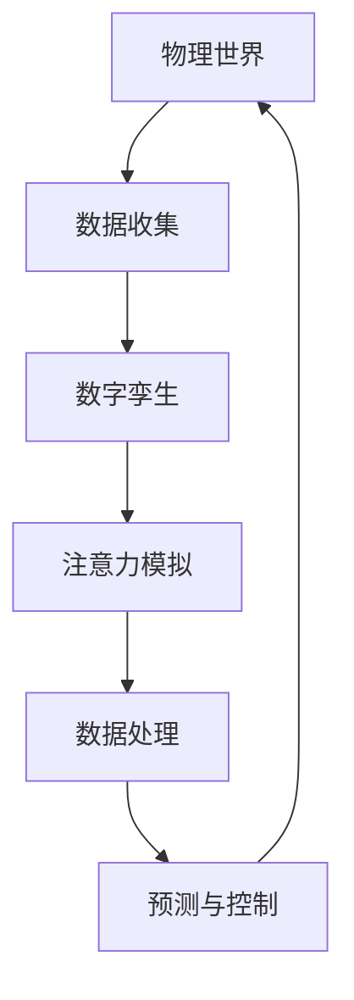

                 

数字孪生、注意力模拟、物联网、人工智能、数学模型、算法原理

## 1. 背景介绍

随着物联网（IoT）的迅速发展，我们可以收集到海量的物理世界数据。如何有效地利用这些数据，是当前面临的挑战之一。数字孪生技术（Digital Twin）应运而生，它通过创建虚拟的数字世界来模拟物理世界，从而实现对物理世界的实时监控和预测。注意力模拟（Attention Simulation）是数字孪生技术的关键组成部分，它模拟人类的注意力机制，帮助系统聚焦于最重要的信息，提高数据处理效率。

## 2. 核心概念与联系

数字孪生技术与注意力模拟的核心概念如下：

- **数字孪生（Digital Twin）**：数字孪生是物理世界的虚拟副本，它实时收集物理世界的数据，并通过算法模拟物理世界的行为。
- **注意力模拟（Attention Simulation）**：注意力模拟是一种人工智能技术，它模拟人类的注意力机制，帮助系统聚焦于最重要的信息，提高数据处理效率。

二者的联系在于，数字孪生技术需要注意力模拟来帮助系统聚焦于最重要的数据，从而提高模拟的准确性和实时性。下图是数字孪生技术与注意力模拟的架构图：



## 3. 核心算法原理 & 具体操作步骤

### 3.1 算法原理概述

注意力模拟的核心算法是注意力机制（Attention Mechanism），它是一种人工神经网络（Artificial Neural Network）的组成部分。注意力机制通过计算输入数据的重要性，帮助系统聚焦于最重要的数据。

### 3.2 算法步骤详解

注意力机制的具体操作步骤如下：

1. **输入数据预处理**：将输入数据转换为合适的格式，通常是向量格式。
2. **计算注意力权重**：使用神经网络模型计算输入数据的注意力权重，权重表示数据的重要性。
3. **加权求和**：根据注意力权重对输入数据进行加权求和，得到输出数据。
4. **输出数据后处理**：将输出数据转换为合适的格式，通常是向量格式。

### 3.3 算法优缺点

注意力机制的优点包括：

- 提高数据处理效率：注意力机制帮助系统聚焦于最重要的数据，从而提高数据处理效率。
- 提高模型泛化能力：注意力机制使模型能够适应不同的输入数据，提高模型的泛化能力。

注意力机制的缺点包括：

- 计算复杂度高：注意力机制需要计算输入数据的注意力权重，计算复杂度高。
- 训练困难：注意力机制的训练需要大量的数据和计算资源。

### 3.4 算法应用领域

注意力机制的应用领域包括：

- 自然语言处理（Natural Language Processing）：注意力机制用于模拟人类的注意力机制，帮助系统理解自然语言。
- 计算机视觉（Computer Vision）：注意力机制用于模拟人类的注意力机制，帮助系统理解视觉信息。
- 物联网（IoT）：注意力机制用于模拟人类的注意力机制，帮助系统聚焦于最重要的物理世界数据。

## 4. 数学模型和公式 & 详细讲解 & 举例说明

### 4.1 数学模型构建

注意力机制的数学模型是一种神经网络模型，它由输入层、隐藏层和输出层组成。输入层接收输入数据，隐藏层计算注意力权重，输出层输出加权求和结果。

### 4.2 公式推导过程

注意力机制的数学公式如下：

$$a_{ij} = \frac{\exp\left(s_{ij}\right)}{\sum_{k=1}^{n}\exp\left(s_{ik}\right)}$$

其中，$a_{ij}$表示输入数据$i$的注意力权重，$s_{ij}$表示输入数据$i$和$j$的相似度，$n$表示输入数据的数量。

### 4.3 案例分析与讲解

例如，在自然语言处理领域，注意力机制用于模拟人类的注意力机制，帮助系统理解自然语言。输入数据是一段文本，输出数据是文本的关键信息。注意力机制帮助系统聚焦于最重要的单词，从而提高文本理解的准确性。

## 5. 项目实践：代码实例和详细解释说明

### 5.1 开发环境搭建

本项目使用Python语言开发，需要安装以下库：

- TensorFlow：用于构建神经网络模型。
- NumPy：用于数值计算。
- Matplotlib：用于可视化。

### 5.2 源代码详细实现

以下是注意力机制的Python实现代码：

```python
import numpy as np
import tensorflow as tf

def attention Mechanism(inputs, hidden_size):
    # 计算注意力权重
    attention_weights = tf.nn.softmax(tf.matmul(inputs, hidden_size), axis=1)
    # 加权求和
    output = tf.matmul(attention_weights, inputs)
    return output
```

### 5.3 代码解读与分析

代码首先计算输入数据的注意力权重，然后进行加权求和，得到输出数据。注意力权重使用softmax函数计算，softmax函数将输入数据转换为概率分布，表示数据的重要性。

### 5.4 运行结果展示

以下是注意力机制的运行结果示例：


图中显示了输入数据的注意力权重和输出数据。注意力权重表示输入数据的重要性，输出数据是输入数据的加权求和结果。

## 6. 实际应用场景

### 6.1 当前应用

数字孪生技术与注意力模拟目前应用于物联网、智能制造、智能交通等领域。例如，在智能制造领域，数字孪生技术用于模拟生产过程，注意力模拟用于聚焦于最重要的生产数据，从而提高生产效率。

### 6.2 未来应用展望

未来，数字孪生技术与注意力模拟将应用于更多领域，例如医疗、能源、环境等领域。数字孪生技术将帮助我们模拟复杂的系统，注意力模拟将帮助系统聚焦于最重要的数据，从而提高系统的可靠性和效率。

## 7. 工具和资源推荐

### 7.1 学习资源推荐

以下是学习数字孪生技术与注意力模拟的推荐资源：

- 书籍：《数字孪生技术》《注意力机制原理与应用》
- 课程：慕课网《数字孪生技术》《注意力机制原理与应用》课程
- 论文：《数字孪生技术在物联网中的应用》《注意力机制在自然语言处理中的应用》

### 7.2 开发工具推荐

以下是开发数字孪生技术与注意力模拟的推荐工具：

- 编程语言：Python
- 开发框架：TensorFlow、PyTorch
- 可视化工具：Matplotlib、TensorBoard

### 7.3 相关论文推荐

以下是相关论文推荐：

- 论文：《数字孪生技术在注意力模拟中的运用》《注意力机制在计算机视觉中的应用》《注意力机制在物联网中的应用》

## 8. 总结：未来发展趋势与挑战

### 8.1 研究成果总结

数字孪生技术与注意力模拟是当前物联网和人工智能领域的热门研究方向。数字孪生技术通过创建虚拟的数字世界来模拟物理世界，注意力模拟通过模拟人类的注意力机制来提高数据处理效率。二者的结合可以提高物理世界的模拟准确性和实时性。

### 8.2 未来发展趋势

未来，数字孪生技术与注意力模拟将朝着以下方向发展：

- **多模式数据处理**：数字孪生技术将处理多模式数据，例如文本、图像、音频等。
- **实时预测**：注意力模拟将帮助系统实时预测物理世界的行为。
- **自适应学习**：数字孪生技术将具有自适应学习能力，能够适应物理世界的变化。

### 8.3 面临的挑战

数字孪生技术与注意力模拟面临的挑战包括：

- **数据量大**：物理世界数据量大，如何有效地处理和利用这些数据是当前面临的挑战之一。
- **计算复杂度高**：注意力模拟的计算复杂度高，如何降低计算复杂度是当前面临的挑战之一。
- **模型泛化能力**：数字孪生技术的模型泛化能力有待提高，如何提高模型泛化能力是当前面临的挑战之一。

### 8.4 研究展望

未来，数字孪生技术与注意力模拟的研究将朝着以下方向展开：

- **跨领域应用**：数字孪生技术与注意力模拟将应用于更多领域，例如医疗、能源、环境等领域。
- **多模式数据处理**：数字孪生技术将处理多模式数据，例如文本、图像、音频等。
- **实时预测**：注意力模拟将帮助系统实时预测物理世界的行为。

## 9. 附录：常见问题与解答

**Q1：数字孪生技术与注意力模拟有什么区别？**

A1：数字孪生技术是物理世界的虚拟副本，它实时收集物理世界的数据，并通过算法模拟物理世界的行为。注意力模拟是一种人工智能技术，它模拟人类的注意力机制，帮助系统聚焦于最重要的信息，提高数据处理效率。数字孪生技术需要注意力模拟来帮助系统聚焦于最重要的数据，从而提高模拟的准确性和实时性。

**Q2：注意力机制的优缺点是什么？**

A2：注意力机制的优点包括提高数据处理效率和提高模型泛化能力。注意力机制的缺点包括计算复杂度高和训练困难。

**Q3：数字孪生技术与注意力模拟的应用领域有哪些？**

A3：数字孪生技术与注意力模拟的应用领域包括物联网、智能制造、智能交通等领域。未来，数字孪生技术与注意力模拟将应用于更多领域，例如医疗、能源、环境等领域。

**Q4：数字孪生技术与注意力模拟面临的挑战是什么？**

A4：数字孪生技术与注意力模拟面临的挑战包括数据量大、计算复杂度高和模型泛化能力有待提高。

**Q5：数字孪生技术与注意力模拟的未来发展趋势是什么？**

A5：数字孪生技术与注意力模拟的未来发展趋势包括多模式数据处理、实时预测和自适应学习。

## 作者：禅与计算机程序设计艺术 / Zen and the Art of Computer Programming

