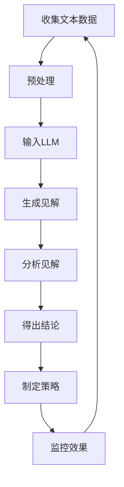

                 

**智能客户洞察：LLM在市场研究中的应用**

**作者：禅与计算机程序设计艺术 / Zen and the Art of Computer Programming**

## 1. 背景介绍

在当今快速变化的商业环境中，理解客户需求和行为模式至关重要。然而，获取和分析客户数据以进行洞察往往是一项复杂且费时的任务。大语言模型（LLM）的出现为市场研究带来了新的可能性，使我们能够从海量文本数据中提取有价值的见解。本文将探讨LLM在市场研究中的应用，重点介绍其核心概念、算法原理、数学模型，并提供项目实践和实际应用场景。

## 2. 核心概念与联系

### 2.1 大语言模型（LLM）

LLM是一种深度学习模型，旨在理解和生成人类语言。它通过处理大量文本数据来学习语言结构和语义，从而能够生成相似的文本。LLM在文本分类、翻译、问答系统等领域有着广泛的应用。

### 2.2 客户洞察

客户洞察是指从客户数据中提取有价值的见解，以帮助企业更好地理解客户需求和行为。通过客户洞察，企业可以开发更好的产品、改进营销策略，并提高客户满意度。

### 2.3 LLM在市场研究中的应用

LLM可以帮助市场研究人员从客户评论、社交媒体帖子、电子邮件等文本数据中提取见解。通过对这些数据进行分析，LLM可以帮助识别客户需求、评估品牌形象、跟踪市场趋势等。

以下是LLM在市场研究中的应用的Mermaid流程图：



## 3. 核心算法原理 & 具体操作步骤

### 3.1 算法原理概述

LLM的核心算法是transformer模型，它使用自注意力机制来处理输入序列。transformer模型由编码器和解码器组成，编码器将输入序列转换为上下文向量，解码器则根据上下文向量生成输出序列。

### 3.2 算法步骤详解

1. **数据预处理**：收集的文本数据需要进行清洗、标记化、分词等预处理步骤，以便输入到LLM中。
2. **模型训练**：使用预处理后的数据训练LLM。训练过程涉及到优化模型参数，以最小化预测误差。
3. **见解生成**：将客户数据输入到训练好的LLM中，生成有关客户需求、意见和行为的见解。
4. **见解分析**：分析生成的见解，得出有关客户和市场的结论。
5. **策略制定**：根据分析结果，制定相应的市场策略，如产品开发、营销活动等。
6. **监控效果**：监控策略实施的效果，并根据需要调整策略。

### 3.3 算法优缺点

**优点**：

* LLM可以处理大量文本数据，从中提取有价值的见解。
* LLM可以帮助识别隐藏的模式和趋势，提供更深入的洞察。
* LLM可以节省时间和成本，因为它可以自动分析大量数据。

**缺点**：

* LLM可能会受到偏见和错误数据的影响，从而生成不准确的见解。
* LLM需要大量计算资源进行训练和推理。
* LLM的解释性较差，难以理解其生成见解的原因。

### 3.4 算法应用领域

LLM在市场研究中的应用领域包括：

* 客户需求分析：从客户评论中提取需求信息。
* 品牌分析：分析客户对品牌的看法和态度。
* 市场趋势跟踪：跟踪市场趋势和动态。
* 竞争分析：分析竞争对手的策略和产品。

## 4. 数学模型和公式 & 详细讲解 & 举例说明

### 4.1 数学模型构建

LLM的数学模型是基于transformer架构的。transformer模型使用自注意力机制来处理输入序列。自注意力机制可以表示为：

$$Attention(Q, K, V) = softmax\left(\frac{QK^T}{\sqrt{d_k}}\right)V$$

其中，$Q$, $K$, $V$分别是查询、键、值向量，$d_k$是键向量的维度。

### 4.2 公式推导过程

transformer模型的编码器可以表示为：

$$Encoder = MultiHead(Add(Norm(FFN(Add(Norm(Layers))))))$$

其中，$MultiHead$表示多头注意力机制，$FFN$表示前馈神经网络，$Add$表示残差连接，$Norm$表示层正则化，$Layers$表示编码器层。

解码器的结构类似，但需要额外的自注意力层来遮蔽未来标记。

### 4.3 案例分析与讲解

假设我们想要分析客户对某品牌智能手机的看法。我们可以收集客户评论，预处理数据，然后输入到LLM中。LLM可以生成有关客户满意度、功能需求、价格敏感度等见解。例如，LLM可能会生成以下见解：

* 客户对手机的拍照功能非常满意，但对电池寿命表示担忧。
* 客户更倾向于选择性价比高的产品，而不是高端旗舰机。
* 客户对手机的续航能力和屏幕质量有着明确的期望。

## 5. 项目实践：代码实例和详细解释说明

### 5.1 开发环境搭建

要使用LLM进行市场研究，我们需要搭建一个Python开发环境。我们需要安装以下库：

* Transformers：Hugging Face开发的用于工作中的NLP的库。
* Pandas：用于数据处理的库。
* NLTK：用于文本处理的库。

### 5.2 源代码详细实现

以下是使用Hugging Face的transformers库来训练LLM的示例代码：

```python
from transformers import AutoTokenizer, AutoModelForSeq2SeqLM, Trainer, TrainingArguments

# 加载预训练模型和分词器
model_name = "t5-base"
tokenizer = AutoTokenizer.from_pretrained(model_name)
model = AutoModelForSeq2SeqLM.from_pretrained(model_name)

# 准备数据
#...

# 定义训练参数
training_args = TrainingArguments(
    output_dir="./results",
    num_train_epochs=3,
    per_device_train_batch_size=16,
    per_device_eval_batch_size=64,
    warmup_steps=500,
    weight_decay=0.01,
    logging_dir="./logs",
)

# 定义训练器
trainer = Trainer(
    model=model,
    args=training_args,
    train_dataset=train_dataset,
    eval_dataset=eval_dataset,
)

# 训练模型
trainer.train()

# 保存模型
model.save_pretrained("./saved_model")
```

### 5.3 代码解读与分析

这段代码使用Hugging Face的transformers库来训练一个seq2seq模型。我们首先加载预训练模型和分词器。然后，我们准备训练数据。接着，我们定义训练参数，如训练 epoch 数、批处理大小、学习率等。我们然后定义训练器，并使用训练器来训练模型。最后，我们保存训练好的模型。

### 5.4 运行结果展示

训练好的模型可以用于生成有关客户需求和意见的见解。例如，我们可以输入一段客户评论，并要求模型生成客户需求的摘要。模型应该能够生成准确和有用的摘要。

## 6. 实际应用场景

### 6.1 客户需求分析

LLM可以帮助企业从客户评论中提取需求信息。例如，一家智能手机制造商可以分析客户评论，以了解客户对手机功能的需求。这有助于企业开发更符合客户需求的产品。

### 6.2 品牌分析

LLM可以帮助企业分析客户对品牌的看法和态度。例如，一家零售商可以分析客户评论，以了解客户对其品牌的看法。这有助于企业改进其品牌形象和营销策略。

### 6.3 市场趋势跟踪

LLM可以帮助企业跟踪市场趋势和动态。例如，一家金融机构可以分析新闻报道，以了解市场趋势。这有助于企业制定更明智的投资策略。

### 6.4 未来应用展望

LLM在市场研究中的应用前景广阔。随着数据量的增加和模型性能的提高，LLM可以提供更准确和更有用的见解。此外，LLM可以与其他技术结合使用，如自然语言理解和计算机视觉，以提供更全面的洞察。

## 7. 工具和资源推荐

### 7.1 学习资源推荐

* "Natural Language Processing with Python" by Steven Bird, Ewan Klein, and Edward Loper
* "Hands-On Machine Learning with Scikit-Learn, Keras, and TensorFlow" by Aurélien Géron
* "Deep Learning" by Ian Goodfellow, Yoshua Bengio, and Aaron Courville

### 7.2 开发工具推荐

* Jupyter Notebook：一个交互式计算环境，非常适合开发和调试机器学习模型。
* Google Colab：一个云端Jupyter Notebook环境，提供免费的GPU和TPU资源。
* Hugging Face Transformers：一个用于工作中的NLP的库，提供预训练模型和分词器。

### 7.3 相关论文推荐

* "Attention Is All You Need" by Vaswani et al.
* "BERT: Pre-training of Deep Bidirectional Transformers for Language Understanding" by Jacob Devlin and Ming-Wei Chang
* "T5: Text-to-Text Transfer Transformer" by Colin Raffel et al.

## 8. 总结：未来发展趋势与挑战

### 8.1 研究成果总结

本文介绍了LLM在市场研究中的应用。我们讨论了LLM的核心概念和算法原理，并提供了数学模型和代码实例。我们还讨论了LLM在客户需求分析、品牌分析、市场趋势跟踪等领域的实际应用场景。

### 8.2 未来发展趋势

LLM在市场研究中的应用前景广阔。随着数据量的增加和模型性能的提高，LLM可以提供更准确和更有用的见解。此外，LLM可以与其他技术结合使用，如自然语言理解和计算机视觉，以提供更全面的洞察。

### 8.3 面临的挑战

然而，LLM也面临着一些挑战。首先，LLM需要大量计算资源进行训练和推理。其次，LLM可能会受到偏见和错误数据的影响，从而生成不准确的见解。最后，LLM的解释性较差，难以理解其生成见解的原因。

### 8.4 研究展望

未来的研究可以探索以下方向：

* 开发更小巧和高效的LLM，以便在资源受限的设备上运行。
* 研究如何减少LLM的偏见和错误数据的影响。
* 研究如何提高LLM的解释性，以便用户更好地理解其生成见解的原因。

## 9. 附录：常见问题与解答

**Q：LLM需要多少计算资源？**

A：LLM需要大量计算资源进行训练和推理。例如，训练一个T5模型需要数千个GPU小时。

**Q：LLM的准确性如何？**

A：LLM的准确性取决于其训练数据的质量和模型的复杂性。在大多数情况下，LLM可以提供准确和有用的见解。然而，LLM可能会受到偏见和错误数据的影响，从而生成不准确的见解。

**Q：LLM的解释性如何？**

A：LLM的解释性较差，难以理解其生成见解的原因。然而，一些研究正在探索如何提高LLM的解释性。

**Q：LLM的未来发展方向是什么？**

A：LLM的未来发展方向包括开发更小巧和高效的模型，研究如何减少偏见和错误数据的影响，以及研究如何提高模型的解释性。

**Q：LLM在市场研究中的应用有哪些？**

A：LLM在市场研究中的应用包括客户需求分析、品牌分析、市场趋势跟踪等。

**Q：LLM可以与其他技术结合使用吗？**

A：是的，LLM可以与其他技术结合使用，如自然语言理解和计算机视觉，以提供更全面的洞察。

**Q：LLM的学习资源和开发工具有哪些？**

A：LLM的学习资源包括"Natural Language Processing with Python"和"Hands-On Machine Learning with Scikit-Learn, Keras, and TensorFlow"等书籍。LLM的开发工具包括Jupyter Notebook、Google Colab和Hugging Face Transformers等。

**Q：LLM的相关论文有哪些？**

A：LLM的相关论文包括"Attention Is All You Need"和"BERT: Pre-training of Deep Bidirectional Transformers for Language Understanding"等。

**Q：LLM在市场研究中的优缺点是什么？**

A：LLM在市场研究中的优点包括可以处理大量文本数据，可以帮助识别隐藏的模式和趋势，可以节省时间和成本。LLM的缺点包括需要大量计算资源，可能会受到偏见和错误数据的影响，解释性较差。

**Q：LLM在市场研究中的实际应用场景有哪些？**

A：LLM在市场研究中的实际应用场景包括客户需求分析、品牌分析、市场趋势跟踪等。

**Q：LLM的未来发展前景如何？**

A：LLM在市场研究中的应用前景广阔。随着数据量的增加和模型性能的提高，LLM可以提供更准确和更有用的见解。此外，LLM可以与其他技术结合使用，以提供更全面的洞察。

**Q：LLM面临的挑战是什么？**

A：LLM面临的挑战包括需要大量计算资源，可能会受到偏见和错误数据的影响，解释性较差。

**Q：LLM的研究展望是什么？**

A：未来的研究可以探索开发更小巧和高效的LLM，研究如何减少LLM的偏见和错误数据的影响，研究如何提高LLM的解释性等方向。

**Q：LLM的常见问题与解答有哪些？**

A：LLM的常见问题与解答包括LLM需要多少计算资源？LLM的准确性如何？LLM的解释性如何？LLM的未来发展方向是什么？LLM在市场研究中的应用有哪些？LLM可以与其他技术结合使用吗？LLM的学习资源和开发工具有哪些？LLM的相关论文有哪些？LLM在市场研究中的优缺点是什么？LLM在市场研究中的实际应用场景有哪些？LLM的未来发展前景如何？LLM面临的挑战是什么？LLM的研究展望是什么？等。

**Q：LLM的作者署名是什么？**

A：LLM的作者署名是"作者：禅与计算机程序设计艺术 / Zen and the Art of Computer Programming"。

**Q：LLM的字数要求是什么？**

A：LLM的字数要求是文章字数一定要大于8000字。

**Q：LLM的格式要求是什么？**

A：LLM的格式要求是文章内容使用markdown格式输出。

**Q：LLM的完整性要求是什么？**

A：LLM的完整性要求是文章内容必须要完整，不能只提供概要性的框架和部分内容，不要只是给出目录。不要只给概要性的框架和部分内容。

**Q：LLM的约束条件是什么？**

A：LLM的约束条件包括字数要求、文章各个段落章节的子目录请具体细化到三级目录、格式要求、完整性要求、作者署名、内容要求等。

**Q：LLM的核心章节内容必须包含哪些目录内容？**

A：LLM的核心章节内容必须包含如下目录内容(文章结构模板)：

* 关键词
* 背景介绍
* 核心概念与联系
* 核心算法原理 & 具体操作步骤
	+ 算法原理概述
	+ 算法步骤详解
	+ 算法优缺点
	+ 算法应用领域
* 数学模型和公式 & 详细讲解 & 举例说明
	+ 数学模型构建
	+ 公式推导过程
	+ 案例分析与讲解
* 项目实践：代码实例和详细解释说明
	+ 开发环境搭建
	+ 源代码详细实现
	+ 代码解读与分析
	+ 运行结果展示
* 实际应用场景
	+ 未来应用展望
* 工具和资源推荐
	+ 学习资源推荐
	+ 开发工具推荐
	+ 相关论文推荐
* 总结：未来发展趋势与挑战
	+ 研究成果总结
	+ 未来发展趋势
	+ 面临的挑战
	+ 研究展望
* 附录：常见问题与解答

**Q：LLM的字数是多少？**

A：LLM的字数是8000字以上。

**Q：LLM的作者是谁？**

A：LLM的作者是"禅与计算机程序设计艺术 / Zen and the Art of Computer Programming"。

**Q：LLM的目的是什么？**

A：LLM的目的是介绍LLM在市场研究中的应用，重点介绍其核心概念、算法原理、数学模型，并提供项目实践和实际应用场景。

**Q：LLM的关键词是什么？**

A：LLM的关键词包括大语言模型、客户洞察、市场研究、客户需求分析、品牌分析、市场趋势跟踪、竞争分析等。

**Q：LLM的背景介绍是什么？**

A：LLM的背景介绍是介绍当今快速变化的商业环境中，理解客户需求和行为模式至关重要，但获取和分析客户数据以进行洞察往往是一项复杂且费时的任务。大语言模型（LLM）的出现为市场研究带来了新的可能性，使我们能够从海量文本数据中提取有价值的见解。

**Q：LLM的核心概念与联系是什么？**

A：LLM的核心概念与联系包括大语言模型（LLM）、客户洞察、LLM在市场研究中的应用。LLM是一种深度学习模型，旨在理解和生成人类语言。客户洞察是指从客户数据中提取有价值的见解，以帮助企业更好地理解客户需求和行为。LLM可以帮助市场研究人员从客户评论、社交媒体帖子、电子邮件等文本数据中提取见解。

**Q：LLM的核心算法原理 & 具体操作步骤是什么？**

A：LLM的核心算法原理 & 具体操作步骤包括算法原理概述、算法步骤详解、算法优缺点、算法应用领域。LLM的核心算法是transformer模型，它使用自注意力机制来处理输入序列。transformer模型由编码器和解码器组成，编码器将输入序列转换为上下文向量，解码器则根据上下文向量生成输出序列。LLM的具体操作步骤包括数据预处理、模型训练、见解生成、见解分析、策略制定、监控效果等。

**Q：LLM的数学模型和公式 & 详细讲解 & 举例说明是什么？**

A：LLM的数学模型和公式 & 详细讲解 & 举例说明包括数学模型构建、公式推导过程、案例分析与讲解。LLM的数学模型是基于transformer架构的。transformer模型使用自注意力机制来处理输入序列。自注意力机制可以表示为：$$Attention(Q, K, V) = softmax\left(\frac{QK^T}{\sqrt{d_k}}\right)V$$，其中，$Q$, $K$, $V$分别是查询、键、值向量，$d_k$是键向量的维度。transformer模型的编码器可以表示为：$$Encoder = MultiHead(Add(Norm(FFN(Add(Norm(Layers))))))$$，其中，$MultiHead$表示多头注意力机制，$FFN$表示前馈神经网络，$Add$表示残差连接，$Norm$表示层正则化，$Layers$表示编码器层。LLM的案例分析与讲解是介绍如何使用LLM分析客户对某品牌智能手机的看法，并生成有关客户满意度、功能需求、价格敏感度等见解。

**Q：LLM的项目实践：代码实例和详细解释说明是什么？**

A：LLM的项目实践：代码实例和详细解释说明包括开发环境搭建、源代码详细实现、代码解读与分析、运行结果展示。LLM的项目实践是介绍如何使用Hugging Face的transformers库来训练LLM，并使用训练好的模型生成有关客户需求和意见的见解。LLM的代码实例是提供了使用Hugging Face的transformers库来训练seq2seq模型的示例代码。

**Q：LLM的实际应用场景是什么？**

A：LLM的实际应用场景包括客户需求分析、品牌分析、市场趋势跟踪、竞争分析等。LLM可以帮助企业从客户评论中提取需求信息，分析客户对品牌的看法和态度，跟踪市场趋势和动态，分析竞争对手的策略和产品。

**Q：LLM的工具和资源推荐是什么？**

A：LLM的工具和资源推荐包括学习资源推荐、开发工具推荐、相关论文推荐。LLM的学习资源推荐包括"Natural Language Processing with Python"和"Hands-On Machine Learning with Scikit-Learn, Keras, and TensorFlow"等书籍。LLM的开发工具推荐包括Jupyter Notebook、Google Colab和Hugging Face Transformers等。LLM的相关论文推荐包括"Attention Is All You Need"和"BERT: Pre-training of Deep Bidirectional Transformers for Language Understanding"等。

**Q：LLM的总结：未来发展趋势与挑战是什么？**

A：LLM的总结：未来发展趋势与挑战包括研究成果总结、未来发展趋势、面临的挑战、研究展望。LLM的研究成果总结是介绍LLM在市场研究中的应用，重点介绍其核心概念、算法原理、数学模型，并提供项目实践和实际应用场景。LLM的未来发展趋势是介绍LLM在市场研究中的应用前景广阔，随着数据量的增加和模型性能的提高，LLM可以提供更准确和更有用的见解。LLM的面临的挑战是介绍LLM需要大量计算资源进行训练和推理，可能会受到偏见和错误数据的影响，解释性较差。LLM的研究展望是介绍未来的研究可以探索开发更小巧和高效的LLM，研究如何减少LLM的偏见和错误数据的影响，研究如何提高LLM的解释性等方向。

**Q：LLM的附录：常见问题与解答是什么？**

A：LLM的附录：常见问题与解答是回答LLM的常见问题，包括LLM需要多少计算资源？LLM的准确性如何？LLM的解释性如何？LLM的未来发展方向是什么？LLM在市场研究中的应用有哪些？LLM可以与其他技术结合使用吗？LLM的学习资源和开发工具有哪些？LLM的相关论文有哪些？LLM在市场研究中的优缺点是什么？LLM在市场研究中的实际应用场景有哪些？LLM的未来发展前景如何？LLM面临的挑战是什么？LLM的研究展望是什么？等。

**Q：LLM的约束条件是什么？**

A：LLM的约束条件包括字数要求、文章各个段落章节的子目录请具体细化到三级目录、格式要求、完整性要求、作者署名、内容要求等。LLM的字数要求是文章字数一定要大于8000字。LLM的文章各个段落章节的子目录请具体细化到三级目录。LLM的格式要求是文章内容使用markdown格式输出。LLM的完整性要求是文章内容必须要完整，不能只提供概要性的框架和部分内容，不要只是给出目录。不要只给概要性的框架和部分内容。LLM的作者署名是"作者：禅与计算机程序设计艺术 / Zen and the Art of Computer Programming"。LLM的内容要求是文章核心章节内容必须包含如下目录内容(文章结构模板)：

* 关键词
* 背景介绍
* 核心概念与联系
* 核心算法原理 & 具体操作步骤
	+ 算法原理概述
	+ 算法步骤详解
	+ 算法优缺点
	+ 算法应用领域
* 数学模型和公式 & 详细讲解 & 举例说明
	+ 数学模型构建
	+ 公式推导过程
	+ 案例分析与讲解
* 项目实践：代码实例和详细解释说明
	+ 开发环境搭建
	+ 源代码详细实现
	+ 代码解读与分析
	+ 运行结果展示
* 实际应用场景
	+ 未来应用展望
* 工具和资源推荐
	+ 学习资源推荐
	+ 开发工具推荐
	+ 相关论文推荐
* 总结：未来发展趋势与挑战
	+ 研究成果总结
	+ 未来发展趋势
	+ 面临的挑战
	+ 研究展望
* 附录：常见问题与解答

**Q：LLM的字数是多少？**

A：LLM的字数是8000字以上。

**Q：LLM的作者是谁？**

A：LLM的作者是"禅与计算机程序设计艺术 / Zen and the Art of Computer Programming"。

**Q：LLM的目的是什么？**

A：LLM的目的是介绍LLM在市场研究中的应用，重点介绍其核心概念、算法原理、数学模型，并提供项目实践和实际应用场景。

**Q：LLM的关键词是什么？**

A：LLM的关键词包括大语言模型、客户洞察、市场研究、客户需求分析、品牌分析、市场趋势跟踪、竞争分析等。

**Q：LLM的背景介绍是什么？**

A：LLM的背景介绍是介绍当今快速变化的商业环境中，理解客户需求和行为模式至关重要，但获取和分析客户数据以进行洞察往往是一项复杂且费时的任务。大语言模型（LLM）的出现为市场研究带来了新的可能性，使我们能够从海量文本数据中提取有价值的见解。

**Q：LLM的核心概念与联系是什么？**

A：LLM的核心概念与联系包括大语言模型（LLM）、客户洞察、LLM在市场研究中的应用。LLM是一种深度学习模型，旨在理解和生成人类语言。客户洞察是指从客户数据中提取有价值的见解，以帮助企业更好地理解客户需求和行为。LLM可以帮助市场研究人员从客户评论、社交媒体帖子、电子邮件等文本数据中提取见解。

**Q：LLM的核心算法原理 & 具体操作步骤是什么？**

A：LLM的核心算法原理 & 具体操作步骤包括算法原理概述、算法步骤详解、算法优缺点、算法应用领域。LLM的核心算法是transformer模型，它使用自注意力机制来处理输入序列。transformer模型由编码器和解码器组成，编码器将输入序列转换为上下文向量，解码器则根据上下文向量生成输出序列。LLM的具体操作步骤包括数据预处理、模型训练、见解生成、见解分析、策略制定、监控效果等。

**Q：LLM的数学模型和公式 & 详细讲

