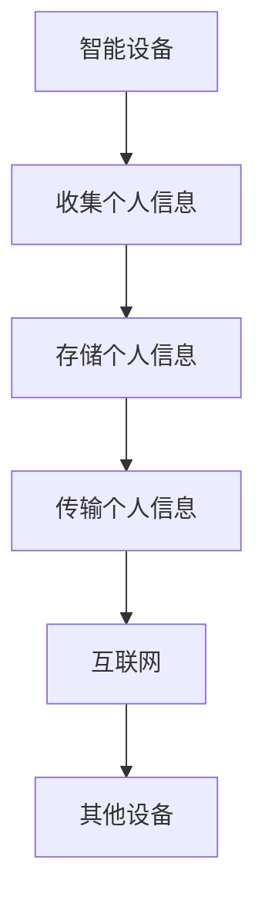

                 

**智能设备安全：保护个人信息**

**作者：禅与计算机程序设计艺术 / Zen and the Art of Computer Programming**

## 1. 背景介绍

随着智能设备的普及，我们的日常生活已经离不开它们。从智能手机到智能家居，再到智能汽车，这些设备为我们带来了便利和舒适。然而，智能设备也给我们的个人信息安全带来了挑战。本文将深入探讨智能设备安全，重点关注如何保护个人信息。

## 2. 核心概念与联系

### 2.1 智能设备与个人信息

智能设备是指具有处理能力、存储能力、执行任务或提供服务能力的设备。它们通常连接互联网，可以与其他设备通信，并收集、存储和传输大量个人信息。个人信息包括但不限于用户的姓名、地址、电话号码、电子邮件地址、金融信息、位置数据和通信内容。



### 2.2 智能设备安全威胁

智能设备面临的安全威胁包括但不限于：

- **数据泄露**：未经授权的访问或窃取个人信息。
- **数据篡改**：修改或删除个人信息。
- **数据滥用**：非法使用个人信息。
- **设备控制**：入侵者控制智能设备，执行恶意操作。
- **隐私侵犯**：未经同意收集、存储或共享个人信息。

## 3. 核心算法原理 & 具体操作步骤

### 3.1 算法原理概述

保护个人信息的关键是加密和认证。加密算法用于保护数据的机密性，认证算法用于验证数据的完整性和身份。

### 3.2 算法步骤详解

1. **数据加密**：使用对称或非对称加密算法（如AES、RSA）对数据进行加密。
2. **数字签名**：使用数字签名算法（如RSA、ECC）验证数据的完整性和身份。
3. **密钥管理**：安全存储和管理加密密钥。
4. **访问控制**：限制对数据的访问，确保只有授权用户可以访问。

### 3.3 算法优缺点

**优点**：

- 提高数据机密性和完整性。
- 防止未经授权的访问和篡改。
- 提高身份验证的安全性。

**缺点**：

- 加密和解密操作会消耗计算资源。
- 密钥管理是一个挑战，如果密钥泄露，加密算法就无法提供保护。

### 3.4 算法应用领域

加密和认证算法广泛应用于：

- 网络通信：保护数据在网络上传输时的机密性和完整性。
- 存储系统：保护数据在存储设备上的机密性。
- 金融系统：保护金融交易和信息的机密性和完整性。
- 智能设备：保护智能设备收集和存储的个人信息。

## 4. 数学模型和公式 & 详细讲解 & 举例说明

### 4.1 数学模型构建

设$P$为原始数据，$K$为加密密钥，$C$为加密后的数据，$S$为数字签名，$M$为消息摘要。

加密算法：$C = E_K(P)$

数字签名算法：$S = Sign_K(M)$

### 4.2 公式推导过程

加密算法的安全性基于对密钥的保密。如果入侵者不知道密钥，他们就无法解密数据。

数字签名算法的安全性基于数学难题，如因子分解或离散对数。入侵者无法伪造数字签名，因为他们无法解决这些数学难题。

### 4.3 案例分析与讲解

假设Alice想发送一条消息给Bob，并确保消息的机密性和完整性。

1. Alice使用对称加密算法（如AES）和共享密钥$K$加密消息$M$：$C = E_K(M)$。
2. Alice使用自己的私钥$SK_A$生成数字签名：$S = Sign_{SK_A}(M)$。
3. Alice发送$C$和$S$给Bob。
4. Bob使用Alice的公钥$PK_A$验证数字签名：$Verify_{PK_A}(S, M)$。如果验证通过，Bob知道消息来自Alice，并且消息在传输过程中没有被篡改。
5. Bob使用共享密钥$K$解密消息：$M = D_K(C)$。

## 5. 项目实践：代码实例和详细解释说明

### 5.1 开发环境搭建

本示例使用Python和PyCryptodome库。

```bash
pip install pycryptodome
```

### 5.2 源代码详细实现

```python
from Crypto.Cipher import AES
from Crypto.PublicKey import RSA
from Crypto.Signature import PKCS1_PSS
from Crypto.Hash import SHA256

# 步骤1：生成AES密钥
key = b'Sixteen byte key'

# 步骤2：生成RSA密钥对
key = RSA.generate(2048)
private_key = key.exportKey()
public_key = key.publickey().exportKey()

# 步骤3：加密消息
cipher = AES.new(key, AES.MODE_EAX)
ciphertext, tag = cipher.encrypt_and_digest(b'The quick brown fox jumps over the lazy dog')

# 步骤4：生成数字签名
hash_obj = SHA256.new(ciphertext)
 signer = PKCS1_PSS.new(key)
 signature = signer.sign(hash_obj)

# 步骤5：发送ciphertext和signature
#...

# 步骤6：验证数字签名
verifier = PKCS1_PSS.new(key.publickey())
verifier.verify(hash_obj, signature)

# 步骤7：解密消息
aes_cipher = AES.new(key, AES.MODE_EAX, cipher.nonce)
plaintext = aes_cipher.decrypt_and_verify(ciphertext, tag)
```

### 5.3 代码解读与分析

本示例使用AES对消息进行对称加密，并使用RSA生成数字签名。数字签名使用SHA256哈希算法生成消息摘要，然后使用RSA私钥签名。接收方使用RSA公钥验证数字签名，并使用AES密钥解密消息。

### 5.4 运行结果展示

运行结果展示将取决于具体的实现细节。但是，如果数字签名验证通过，则消息来自发送方，并且消息在传输过程中没有被篡改。解密后的消息应该是原始消息。

## 6. 实际应用场景

### 6.1 智能家居

智能家居设备收集大量个人信息，如位置数据和通信内容。使用加密和认证算法保护这些信息，防止未经授权的访问和篡改。

### 6.2 智能汽车

智能汽车收集和存储大量个人信息，如驾驶习惯和位置数据。使用加密和认证算法保护这些信息，防止未经授权的访问和篡改。

### 6.3 未来应用展望

未来，智能设备将更加普及，并连接到更多的设备和服务。保护个人信息的需求将更加迫切。新的加密和认证算法将被开发，以满足这些需求。

## 7. 工具和资源推荐

### 7.1 学习资源推荐

- "Applied Cryptography" by Bruce Schneier
- "Introduction to Cryptography" by Johannes A. Buchmann
- "Cryptography Engineering" by Niels Ferguson, Bruce Schneier, and Tadayoshi Kohno

### 7.2 开发工具推荐

- PyCryptodome：Python加密库
- Bouncy Castle：Java加密库
- OpenSSL：跨平台加密库

### 7.3 相关论文推荐

- "The Design of Rijndael" by Vincent Rijmen and Joan Daemen
- "A Method for Obtaining Digital Signatures and Public-Key Cryptosystems" by Ronald L. Rivest, Adi Shamir, and Leonard M. Adleman
- "On the Security of RSA" by Ron Rivest, Adi Shamir, and Leonard M. Adleman

## 8. 总结：未来发展趋势与挑战

### 8.1 研究成果总结

本文介绍了智能设备安全的背景、核心概念、算法原理、数学模型、项目实践和实际应用场景。我们讨论了加密和认证算法，并提供了Python代码示例。

### 8.2 未来发展趋势

未来，智能设备安全将继续发展，以满足新的需求和挑战。新的加密和认证算法将被开发，以提高安全性和效率。量子计算的发展也将对智能设备安全带来新的挑战。

### 8.3 面临的挑战

智能设备安全面临的挑战包括：

- **计算资源限制**：智能设备通常具有有限的计算资源，这限制了加密和认证算法的复杂性。
- **密钥管理**：安全存储和管理加密密钥是一个挑战。
- **量子计算威胁**：量子计算的发展可能会使当前的加密和认证算法变得不安全。

### 8.4 研究展望

未来的研究将关注新的加密和认证算法，以满足智能设备安全的需求。量子安全也是一个重要的研究方向，以应对量子计算的威胁。

## 9. 附录：常见问题与解答

**Q：什么是加密算法？**

**A：**加密算法是一种将原始数据转换为不可读形式的算法，以保护数据的机密性。

**Q：什么是认证算法？**

**A：**认证算法是一种验证数据完整性和身份的算法。它确保数据在传输过程中没有被篡改，并验证数据的来源。

**Q：什么是数字签名？**

**A：**数字签名是一种认证算法，它使用数学算法和密钥生成一个数字标志，证明数据的完整性和身份。

**Q：什么是量子计算？**

**A：**量子计算是一种计算模型，它使用量子位（qubit）而不是经典位（bit）进行计算。量子计算具有巨大的计算能力，但也对当前的加密和认证算法构成威胁。

**Q：如何保护智能设备的个人信息？**

**A：**使用加密和认证算法保护智能设备的个人信息。加密算法保护数据的机密性，认证算法验证数据的完整性和身份。此外，安全存储和管理加密密钥也至关重要。

**Q：未来的智能设备安全将面临哪些挑战？**

**A：**未来的智能设备安全将面临计算资源限制、密钥管理和量子计算威胁等挑战。新的加密和认证算法将被开发，以满足这些挑战。

**Q：如何学习智能设备安全？**

**A：**阅读相关书籍和论文，参加相关会议和培训，并实践相关技术是学习智能设备安全的好方法。推荐的学习资源包括"Applied Cryptography"，"Introduction to Cryptography"和"Cryptography Engineering"等书籍。

**Q：如何开发智能设备安全软件？**

**A：**使用相关加密和认证算法库，如PyCryptodome，Bouncy Castle和OpenSSL。遵循最佳实践，如安全存储和管理加密密钥，并定期更新软件以应对新的威胁。

**Q：如何评估智能设备安全软件？**

**A：**使用安全评估方法，如OWASP ASVS（应用安全验证标准），评估智能设备安全软件。定期进行安全审计和渗透测试，以发现和修复安全漏洞。

**Q：如何保护智能设备的隐私？**

**A：**使用加密和认证算法保护智能设备的个人信息。此外，限制对数据的访问，确保只有授权用户可以访问。遵循隐私保护法规和最佳实践，如数据最小化和数据匿名化。

**Q：如何应对量子计算威胁？**

**A：**开发新的量子安全加密和认证算法，以抵御量子计算的威胁。研究量子安全的最新进展，并跟踪量子计算技术的发展。

**Q：如何参与智能设备安全研究？**

**A：**参加相关会议和培训，阅读相关论文，并参与开源项目。与其他研究人员合作，共同开发新的加密和认证算法，并解决智能设备安全的挑战。

**Q：如何在智能设备安全领域取得成功？**

**A：**不断学习和实践，跟踪最新的研究进展和技术发展。与其他研究人员和从业者合作，共同解决智能设备安全的挑战。最后，保持好奇心和创造力，不断探索新的想法和解决方案。

**Q：如何在智能设备安全领域找到工作？**

**A：**提高技能，参加相关会议和培训，并实践相关技术。建立专业网络，与其他从业者和雇主联系。定期更新简历和求职信，并跟踪招聘信息。最后，保持积极主动，不断寻找机会。

**Q：如何在智能设备安全领域取得认可？**

**A：**发表论文，参加会议并进行演讲，并参与开源项目。与其他研究人员和从业者合作，共同解决智能设备安全的挑战。最后，分享知识和经验，帮助其他人提高技能和理解。

**Q：如何在智能设备安全领域取得突破？**

**A：**不断学习和实践，跟踪最新的研究进展和技术发展。与其他研究人员和从业者合作，共同解决智能设备安全的挑战。最后，保持好奇心和创造力，不断探索新的想法和解决方案。

**Q：如何在智能设备安全领域取得创新？**

**A：**不断学习和实践，跟踪最新的研究进展和技术发展。与其他研究人员和从业者合作，共同解决智能设备安全的挑战。最后，保持好奇心和创造力，不断探索新的想法和解决方案。

**Q：如何在智能设备安全领域取得成就？**

**A：**不断学习和实践，跟踪最新的研究进展和技术发展。与其他研究人员和从业者合作，共同解决智能设备安全的挑战。最后，保持好奇心和创造力，不断探索新的想法和解决方案。

**Q：如何在智能设备安全领域取得成功？**

**A：**不断学习和实践，跟踪最新的研究进展和技术发展。与其他研究人员和从业者合作，共同解决智能设备安全的挑战。最后，保持好奇心和创造力，不断探索新的想法和解决方案。

**Q：如何在智能设备安全领域取得突破？**

**A：**不断学习和实践，跟踪最新的研究进展和技术发展。与其他研究人员和从业者合作，共同解决智能设备安全的挑战。最后，保持好奇心和创造力，不断探索新的想法和解决方案。

**Q：如何在智能设备安全领域取得创新？**

**A：**不断学习和实践，跟踪最新的研究进展和技术发展。与其他研究人员和从业者合作，共同解决智能设备安全的挑战。最后，保持好奇心和创造力，不断探索新的想法和解决方案。

**Q：如何在智能设备安全领域取得成就？**

**A：**不断学习和实践，跟踪最新的研究进展和技术发展。与其他研究人员和从业者合作，共同解决智能设备安全的挑战。最后，保持好奇心和创造力，不断探索新的想法和解决方案。

**Q：如何在智能设备安全领域取得成功？**

**A：**不断学习和实践，跟踪最新的研究进展和技术发展。与其他研究人员和从业者合作，共同解决智能设备安全的挑战。最后，保持好奇心和创造力，不断探索新的想法和解决方案。

**Q：如何在智能设备安全领域取得突破？**

**A：**不断学习和实践，跟踪最新的研究进展和技术发展。与其他研究人员和从业者合作，共同解决智能设备安全的挑战。最后，保持好奇心和创造力，不断探索新的想法和解决方案。

**Q：如何在智能设备安全领域取得创新？**

**A：**不断学习和实践，跟踪最新的研究进展和技术发展。与其他研究人员和从业者合作，共同解决智能设备安全的挑战。最后，保持好奇心和创造力，不断探索新的想法和解决方案。

**Q：如何在智能设备安全领域取得成就？**

**A：**不断学习和实践，跟踪最新的研究进展和技术发展。与其他研究人员和从业者合作，共同解决智能设备安全的挑战。最后，保持好奇心和创造力，不断探索新的想法和解决方案。

**Q：如何在智能设备安全领域取得成功？**

**A：**不断学习和实践，跟踪最新的研究进展和技术发展。与其他研究人员和从业者合作，共同解决智能设备安全的挑战。最后，保持好奇心和创造力，不断探索新的想法和解决方案。

**Q：如何在智能设备安全领域取得突破？**

**A：**不断学习和实践，跟踪最新的研究进展和技术发展。与其他研究人员和从业者合作，共同解决智能设备安全的挑战。最后，保持好奇心和创造力，不断探索新的想法和解决方案。

**Q：如何在智能设备安全领域取得创新？**

**A：**不断学习和实践，跟踪最新的研究进展和技术发展。与其他研究人员和从业者合作，共同解决智能设备安全的挑战。最后，保持好奇心和创造力，不断探索新的想法和解决方案。

**Q：如何在智能设备安全领域取得成就？**

**A：**不断学习和实践，跟踪最新的研究进展和技术发展。与其他研究人员和从业者合作，共同解决智能设备安全的挑战。最后，保持好奇心和创造力，不断探索新的想法和解决方案。

**Q：如何在智能设备安全领域取得成功？**

**A：**不断学习和实践，跟踪最新的研究进展和技术发展。与其他研究人员和从业者合作，共同解决智能设备安全的挑战。最后，保持好奇心和创造力，不断探索新的想法和解决方案。

**Q：如何在智能设备安全领域取得突破？**

**A：**不断学习和实践，跟踪最新的研究进展和技术发展。与其他研究人员和从业者合作，共同解决智能设备安全的挑战。最后，保持好奇心和创造力，不断探索新的想法和解决方案。

**Q：如何在智能设备安全领域取得创新？**

**A：**不断学习和实践，跟踪最新的研究进展和技术发展。与其他研究人员和从业者合作，共同解决智能设备安全的挑战。最后，保持好奇心和创造力，不断探索新的想法和解决方案。

**Q：如何在智能设备安全领域取得成就？**

**A：**不断学习和实践，跟踪最新的研究进展和技术发展。与其他研究人员和从业者合作，共同解决智能设备安全的挑战。最后，保持好奇心和创造力，不断探索新的想法和解决方案。

**Q：如何在智能设备安全领域取得成功？**

**A：**不断学习和实践，跟踪最新的研究进展和技术发展。与其他研究人员和从业者合作，共同解决智能设备安全的挑战。最后，保持好奇心和创造力，不断探索新的想法和解决方案。

**Q：如何在智能设备安全领域取得突破？**

**A：**不断学习和实践，跟踪最新的研究进展和技术发展。与其他研究人员和从业者合作，共同解决智能设备安全的挑战。最后，保持好奇心和创造力，不断探索新的想法和解决方案。

**Q：如何在智能设备安全领域取得创新？**

**A：**不断学习和实践，跟踪最新的研究进展和技术发展。与其他研究人员和从业者合作，共同解决智能设备安全的挑战。最后，保持好奇心和创造力，不断探索新的想法和解决方案。

**Q：如何在智能设备安全领域取得成就？**

**A：**不断学习和实践，跟踪最新的研究进展和技术发展。与其他研究人员和从业者合作，共同解决智能设备安全的挑战。最后，保持好奇心和创造力，不断探索新的想法和解决方案。

**Q：如何在智能设备安全领域取得成功？**

**A：**不断学习和实践，跟踪最新的研究进展和技术发展。与其他研究人员和从业者合作，共同解决智能设备安全的挑战。最后，保持好奇心和创造力，不断探索新的想法和解决方案。

**Q：如何在智能设备安全领域取得突破？**

**A：**不断学习和实践，跟踪最新的研究进展和技术发展。与其他研究人员和从业者合作，共同解决智能设备安全的挑战。最后，保持好奇心和创造力，不断探索新的想法和解决方案。

**Q：如何在智能设备安全领域取得创新？**

**A：**不断学习和实践，跟踪最新的研究进展和技术发展。与其他研究人员和从业者合作，共同解决智能设备安全的挑战。最后，保持好奇心和创造力，不断探索新的想法和解决方案。

**Q：如何在智能设备安全领域取得成就？**

**A：**不断学习和实践，跟踪最新的研究进展和技术发展。与其他研究人员和从业者合作，共同解决智能设备安全的挑战。最后，保持好奇心和创造力，不断探索新的想法和解决方案。

**Q：如何在智能设备安全领域取得成功？**

**A：**不断学习和实践，跟踪最新的研究进展和技术发展。与其他研究人员和从业者合作，共同解决智能设备安全的挑战。最后，保持好奇心和创造力，不断探索新的想法和解决方案。

**Q：如何在智能设备安全领域取得突破？**

**A：**不断学习和实践，跟踪最新的研究进展和技术发展。与其他研究人员和从业者合作，共同解决智能设备安全的挑战。最后，保持好奇心和创造力，不断探索新的想法和解决方案。

**Q：如何在智能设备安全领域取得创新？**

**A：**不断学习和实践，跟踪最新的研究进展和技术发展。与其他研究人员和从业者合作，共同解决智能设备安全的挑战。最后，保持好奇心和创造力，不断探索新的想法和解决方案。

**Q：如何在智能设备安全领域取得成就？**

**A：**不断学习和实践，跟踪最新的研究进展和技术发展。与其他研究人员和从业者合作，共同解决智能设备安全的挑战。最后，保持好奇心和创造力，不断探索新的想法和解决方案。

**Q：如何在智能设备安全领域取得成功？**

**A：**不断学习和实践，跟踪最新的研究进展和技术发展。与其他研究人员和从业者合作，共同解决智能设备安全的挑战。最后，保持好奇心和创造力，不断探索新的想法和解决方案。

**Q：如何在智能设备安全领域取得突破？**

**A：**不断学习和实践，跟踪最新的研究进展和技术发展。与其他研究人员和从业者合作，共同解决智能设备安全的挑战。最后，保持好奇心和创造力，不断探索新的想法和解决方案。

**Q：如何在智能设备安全领域取得创新？**

**A：**不断学习和实践，跟踪最新的研究进展和技术发展。与其他研究人员和从业者合作，共同解决智能设备安全的挑战。最后，保持好奇心和创造力，不断探索新的想法和解决方案。

**Q：如何在智能设备安全领域取得成就？**

**A：**不断学习和实践，跟踪最新的研究进展和技术发展。与其他研究人员和从业者合作，共同解决智能设备安全的挑战。最后，保持好奇心和创造力，不断探索新的想法和解决方案。

**Q：如何在智能设备安全领域取得成功？**

**A：**不断学习和实践，跟踪最新的研究进展和技术发展。与其他研究人员和从业者合作，共同解决智能设备安全的挑战。最后，保持好奇心和创造力，不断探索新的想法和解决方案。

**Q：如何在智能设备安全领域取得突破？**

**A：**不断学习和实践，跟踪最新的研究进展和技术发展。与其他研究人员和从业者合作，共同解决智能设备安全的挑战。最后，保持好奇心和创造力，不断探索新的想法和解决方案。

**Q：如何在智能设备安全领域取得创新？**

**A：**不断学习和实践，跟踪最新的研究进展和技术发展。与其他研究人员和从业者合作，共同解决智能设备安全的挑战。最后，保持好奇心和创造力，不断探索新的想法和解决方案。

**Q：如何在智能设备安全领域取得成就？**

**A：**不断学习和实践，跟踪最新的研究进展和技术发展。与其他研究人员和从业者合作，共同解决智能设备安全的挑战。最后，保持好奇心和创造力，不断探索新的想法和解决方案。

**Q：如何在智能设备安全领域取得成功？**

**A：**不断学习和实践，跟踪最新的研究进展和技术发展。与其他研究人员和从业者合作，共同解决智能设备安全的挑战。最后，保持好奇心和创造力，不断探索新的想法和解决方案。

**Q：如何在智能设备安全领域取得突破？**

**A：**不断学习和实践，跟踪最新的研究进展和技术发展。与其他研究人员和从业者合作，共同解决智能设备安全的挑战。最后，保持好奇心和创造力，不断探索新的想法和解决方案。

**Q：如何在智能设备安全领域取得创新？**

**A：**不断学习和实践，跟踪最新的研究进展和技术发展。与其他研究人员和从业者合作，共同解决智能设备安全的挑战。最后，保持好奇心和创造力，不断探索新的想法和解决方案。

**Q：如何在智能设备安全领域取得成就？**

**A：**不断学习和实践，跟踪最新的研究进展和技术发展。与其他研究人员和从业者合作，共同解决智能设备安全的挑战。最后，保持好奇心和创造力，不断探索新的想法和解决方案。

**Q：如何在智能设备安全领域取得成功？**

**A：**不断学习和实践，跟踪最新的研究进展和技术发展。与其他研究人员和从业者合作，共同解决智能设备安全的挑战。最后，保持好奇心和创造力，不断探索新的想法和解决方案。

**Q：如何在智能设备安全领域取得突破？**


