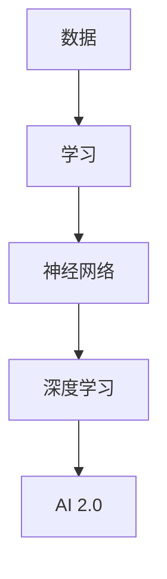

                 

**AI 2.0 时代的机遇**

**作者：禅与计算机程序设计艺术 / Zen and the Art of Computer Programming**

## 1. 背景介绍

在人工智能（AI）领域，我们正处于一个转折点。第一代人工智能（AI 1.0）以规则为基础，依赖于专家系统和符号处理。然而，随着深度学习和神经网络的兴起，我们进入了第二代人工智能（AI 2.0）时代，其特点是学习能力和数据驱动。本文将探讨AI 2.0的核心概念、算法原理、数学模型，并提供项目实践和工具推荐，最后展望未来发展趋势。

## 2. 核心概念与联系

AI 2.0的核心概念包括深度学习、神经网络、数据驱动和学习能力。这些概念是相互关联的，共同构成了AI 2.0的基础。下图是这些概念的关系图：



## 3. 核心算法原理 & 具体操作步骤

### 3.1 算法原理概述

AI 2.0的核心算法是深度学习，它是一种机器学习方法，使用神经网络模型从数据中学习。深度学习算法的目标是找到最优的模型参数，以最小化预测误差。

### 3.2 算法步骤详解

1. **数据预处理**：收集并清洗数据，将其转换为适合模型的格式。
2. **模型构建**：选择合适的神经网络架构，定义层数和激活函数。
3. **训练**：使用反向传播算法和梯度下降优化器更新模型参数，以最小化损失函数。
4. **评估**：在验证集上评估模型性能，调整超参数以提高性能。
5. **部署**：将训练好的模型部署到生产环境中，进行预测。

### 3.3 算法优缺点

**优点**：深度学习可以自动学习特征，适用于大规模数据集，具有高准确性。

**缺点**：深度学习需要大量数据和计算资源，易受过拟合影响，解释性差。

### 3.4 算法应用领域

深度学习在图像、语音、自然语言处理等领域有广泛应用，如图像分类、目标检测、语音识别和机器翻译。

## 4. 数学模型和公式 & 详细讲解 & 举例说明

### 4.1 数学模型构建

神经网络的数学模型可以表示为：

$$y = f(wx + b)$$

其中，$x$是输入向量，$w$是权重向量，$b$是偏置项，$f$是激活函数，$y$是输出。

### 4.2 公式推导过程

损失函数（如均方误差）的目标是最小化预测误差：

$$L = \frac{1}{n}\sum_{i=1}^{n}(y_i - \hat{y}_i)^2$$

其中，$y_i$是真实值，$hat{y}_i$是预测值，$n$是样本数。

### 4.3 案例分析与讲解

例如，在图像分类任务中，输入$x$是图像特征向量，$y$是类别标签。模型的目标是学习权重$w$和偏置项$b$，使得预测类别与真实类别一致。

## 5. 项目实践：代码实例和详细解释说明

### 5.1 开发环境搭建

使用Python、TensorFlow和Keras搭建深度学习开发环境。

### 5.2 源代码详细实现

```python
import tensorflow as tf
from tensorflow.keras.models import Sequential
from tensorflow.keras.layers import Dense

# 定义模型
model = Sequential()
model.add(Dense(32, input_dim=100, activation='relu'))
model.add(Dense(10, activation='softmax'))

# 编译模型
model.compile(loss='categorical_crossentropy', optimizer='adam', metrics=['accuracy'])

# 训练模型
model.fit(x_train, y_train, epochs=10, batch_size=32)
```

### 5.3 代码解读与分析

上述代码定义了一个具有两个全连接层的模型，使用ReLU激活函数和softmax输出。模型使用交叉熵损失函数和Adam优化器进行编译，并使用训练集进行训练。

### 5.4 运行结果展示

模型的训练精度和损失函数值会在训练过程中打印出来。

## 6. 实际应用场景

### 6.1 当前应用

AI 2.0在自动驾驶、医疗影像分析、金融风险评估等领域有广泛应用。

### 6.2 未来应用展望

未来，AI 2.0将在人工智能芯片、量子计算、边缘计算等领域有更多应用。

## 7. 工具和资源推荐

### 7.1 学习资源推荐

- 书籍：《深度学习》作者：Ian Goodfellow、Yoshua Bengio、Aaron Courville
- 课程：斯坦福大学深度学习课程（CS231n）

### 7.2 开发工具推荐

- TensorFlow
- PyTorch
- Keras

### 7.3 相关论文推荐

- "Deep Learning" by Ian Goodfellow, Yoshua Bengio, and Aaron Courville
- "ImageNet Classification with Deep Convolutional Neural Networks" by Krizhevsky, Sutskever, and Hinton

## 8. 总结：未来发展趋势与挑战

### 8.1 研究成果总结

AI 2.0取得了显著成就，在各种领域取得了领先地位。

### 8.2 未来发展趋势

AI 2.0将朝着更强大、更通用的模型发展，并与其他技术（如量子计算）结合。

### 8.3 面临的挑战

AI 2.0面临的挑战包括数据隐私、算法解释性、计算资源等。

### 8.4 研究展望

未来的研究将关注模型解释性、可靠性、安全性和通用性。

## 9. 附录：常见问题与解答

**Q：AI 2.0与AI 1.0有何不同？**

**A：**AI 2.0以学习能力和数据驱动为特点，而AI 1.0则以规则为基础。

**Q：深度学习需要大量数据吗？**

**A：**是的，深度学习需要大量数据来训练模型。数据量越大，模型性能通常越好。

**Q：如何避免过拟合？**

**A：**常用方法包括数据增强、正则化、 dropout、早停等。

## 结束语

AI 2.0为我们带来了前所未有的机遇，我们有理由期待未来的发展。然而，我们也必须意识到面临的挑战，并努力克服这些挑战，推动AI技术的进步。

**作者署名：禅与计算机程序设计艺术 / Zen and the Art of Computer Programming**

