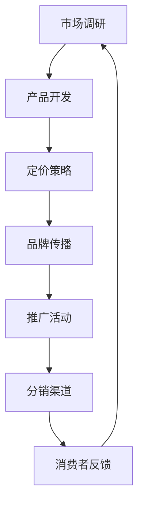

                 

### 文章标题

一人公司的品牌形象塑造与传播

**Keywords:** 单人公司，品牌形象，传播策略，市场营销，社交媒体，内容创作

**Abstract:**
本文将探讨单人公司在品牌形象塑造与传播方面的关键要素和策略。通过对单人公司特点的分析，结合市场营销理论和实践案例，文章提出了一系列有效的品牌传播方法，旨在帮助单人公司建立并维护独特的品牌形象，从而在竞争激烈的市场中脱颖而出。

<|assistant|>### 1. 背景介绍（Background Introduction）

在当今快速变化的市场环境中，单人公司（即由单一创始人或个体运营的公司）越来越受到关注。单人公司具有敏捷、灵活和创新的特点，这使得它们能够迅速响应市场变化，并在特定领域内迅速崛起。然而，单人公司在品牌形象塑造与传播方面面临着独特的挑战。

首先，由于资源有限，单人公司往往需要更加注重成本效益，这意味着在品牌传播方面可能面临预算和资源的限制。其次，单人公司在市场竞争中常常面临品牌认知度低的问题，这使得它们在吸引客户和建立品牌忠诚度方面面临更大的挑战。

此外，单人公司的创始人通常是品牌的代表，其个人形象和价值观直接影响到品牌形象。因此，如何有效地塑造和传播品牌形象成为单人公司成功的关键因素之一。

本文旨在探讨单人公司在品牌形象塑造与传播方面的策略和方法，帮助单人公司在竞争激烈的市场中建立独特的品牌形象，从而实现持续增长和成功。

<|assistant|>### 2. 核心概念与联系（Core Concepts and Connections）

#### 2.1 品牌形象的定义与重要性

品牌形象是指消费者对品牌的总体认知和感受，包括品牌的价值观、产品特性、声誉和个性。良好的品牌形象有助于提升品牌的市场地位、增强消费者忠诚度，并促进品牌价值的提升。

**品牌形象的重要性：**
- 提高品牌知名度：一个积极的品牌形象有助于消费者记住品牌，从而提高品牌的市场知名度。
- 增强消费者信任：良好的品牌形象可以增强消费者对品牌的信任，从而增加购买意愿。
- 促进品牌溢价：品牌形象良好的公司通常能够获得更高的品牌溢价，从而提高利润。
- 提升员工自豪感：良好的品牌形象可以提升员工对公司的认同感和自豪感，从而增强团队合作和创新精神。

#### 2.2 品牌传播策略

品牌传播是指通过多种渠道和方式，将品牌信息传递给目标受众，以建立和维护品牌形象的过程。品牌传播策略应考虑以下关键因素：

**1. 目标受众分析：** 了解目标受众的需求、兴趣和行为，有助于制定更具针对性的品牌传播策略。

**2. 媒介选择：** 根据目标受众的特点和品牌传播目标，选择适当的传播渠道，如社交媒体、内容营销、广告等。

**3. 内容创作：** 内容创作是品牌传播的核心，应具备吸引力、相关性和价值，以吸引和留住目标受众。

**4. 互动与反馈：** 通过与目标受众的互动，收集反馈，不断优化品牌传播策略。

**5. 持续性：** 品牌传播是一个长期的过程，需要持续投入时间和资源，以维持和提升品牌形象。

#### 2.3 品牌传播与市场营销的关系

品牌传播是市场营销的重要组成部分。市场营销的目标是通过各种手段，如产品开发、定价、推广和分销，实现品牌价值的最大化。品牌传播则关注如何通过有效的传播策略，将品牌信息传递给目标受众，提升品牌形象和市场地位。

**品牌传播与市场营销的关系：**
- 品牌传播是市场营销的基石，有助于提升品牌知名度和消费者信任。
- 市场营销策略的成功与否，往往取决于品牌传播的效果。
- 品牌传播和市场营销相互促进，共同推动品牌价值的提升。

**Mermaid 流程图：**



**图解：**
该流程图展示了从市场调研到消费者反馈的品牌传播与市场营销的整个过程。市场调研为产品开发和定价策略提供依据，而品牌传播则贯穿于整个市场营销过程中，通过推广活动和分销渠道，将品牌信息传递给消费者，并收集反馈，以持续优化品牌形象。

<|assistant|>### 3. 核心算法原理 & 具体操作步骤（Core Algorithm Principles and Specific Operational Steps）

#### 3.1 品牌形象塑造的核心算法原理

品牌形象塑造的关键在于理解消费者的需求、情感和行为，以及如何通过有效的策略将这些要素与品牌核心价值相结合。以下是品牌形象塑造的核心算法原理：

**1. 定位（Positioning）**：确定品牌在市场中的独特价值主张和目标受众，以便在消费者心中占据一席之地。

**2. 价值观（Values）**：明确品牌的核心价值观，并将其融入品牌传播和产品设计中，以塑造品牌形象。

**3. 情感（Emotion）**：通过情感共鸣和故事讲述，与消费者建立情感联系，从而提升品牌忠诚度。

**4. 创新与差异化（Innovation and Differentiation）**：不断创新，提供独特的价值，以区别于竞争对手。

**5. 可持续性与社会责任（Sustainability and Corporate Social Responsibility）**：强调品牌对社会和环境的影响，提升品牌形象。

#### 3.2 品牌传播策略的具体操作步骤

**1. 确定品牌传播目标**：明确品牌传播的短期和长期目标，如提升品牌知名度、增加市场份额、提升消费者忠诚度等。

**2. 分析目标受众**：了解目标受众的需求、兴趣和行为，以便制定更具针对性的传播策略。

**3. 选择传播渠道**：根据目标受众的特点和品牌传播目标，选择适当的传播渠道，如社交媒体、内容营销、广告等。

**4. 内容创作与优化**：创作具有吸引力和相关性的内容，并在传播过程中不断优化，以提高传播效果。

**5. 互动与反馈**：通过社交媒体、问卷调查、用户评论等方式，与目标受众互动，收集反馈，不断调整品牌传播策略。

**6. 跨渠道整合**：将线上线下渠道整合，实现品牌信息的统一传播。

**7. 持续监测与评估**：定期监测品牌传播效果，评估传播策略的有效性，并根据反馈进行优化。

**示例操作步骤：**

**步骤1：确定品牌传播目标**
- 短期目标：提升品牌知名度，增加社交媒体粉丝数量。
- 长期目标：建立品牌忠诚度，提升市场占有率。

**步骤2：分析目标受众**
- 目标受众：年龄在25-35岁之间的年轻人群，对健康、环保和可持续发展有较高关注度。

**步骤3：选择传播渠道**
- 社交媒体：微博、抖音、微信公众号等。
- 内容营销：博客、电子书、视频等。

**步骤4：内容创作与优化**
- 创作具有吸引力的内容，如健康饮食、环保生活方式等。
- 通过数据分析，优化内容标题、关键词和发布时间，以提高阅读量和互动率。

**步骤5：互动与反馈**
- 定期举办线上活动，如抽奖、互动问答等，吸引粉丝参与。
- 通过用户评论和私信，了解受众反馈，并根据反馈调整内容策略。

**步骤6：跨渠道整合**
- 将线上内容和线下活动相结合，如举办线上直播，同时在线下开展主题活动。

**步骤7：持续监测与评估**
- 定期分析品牌传播数据，如粉丝增长、阅读量、互动率等。
- 根据数据反馈，调整传播策略，以提升品牌传播效果。

<|assistant|>### 4. 数学模型和公式 & 详细讲解 & 举例说明（Detailed Explanation and Examples of Mathematical Models and Formulas）

#### 4.1 数学模型在品牌形象塑造中的应用

在品牌形象塑造过程中，数学模型可以帮助我们量化品牌传播的效果，评估品牌价值，并制定更加科学的传播策略。以下是一些常见的数学模型和公式：

**1. 品牌知名度模型**

品牌知名度（Awareness）可以通过以下公式进行量化：

$$
 Awareness = \frac{Aware}{Total}
$$

其中，Aware 代表知道品牌的人数，Total 代表总人数。该公式用于计算在一定时间内，目标受众中了解品牌的人数比例。

**2. 品牌忠诚度模型**

品牌忠诚度（Loyalty）可以通过以下公式进行量化：

$$
 Loyalty = \frac{Repeat Purchase}{Total Purchase} \times 100%
$$

其中，Repeat Purchase 代表重复购买的人数，Total Purchase 代表总购买人数。该公式用于计算在一定时间内，重复购买品牌产品的消费者比例。

**3. 品牌价值模型**

品牌价值（Brand Value）可以通过以下公式进行量化：

$$
 Brand Value = \frac{Revenue \times Profit Margin}{Cost of Capital}
$$

其中，Revenue 代表品牌产生的收入，Profit Margin 代表利润率，Cost of Capital 代表资本成本。该公式用于计算品牌的经济价值。

#### 4.2 举例说明

**例子1：品牌知名度计算**

假设在一个市场中，总人数为1000人，其中有600人知道品牌A。那么，品牌A的知名度为：

$$
 Awareness = \frac{600}{1000} = 60%
$$

**例子2：品牌忠诚度计算**

假设在一个市场中，总购买人数为100人，其中有60人重复购买品牌B的产品。那么，品牌B的忠诚度为：

$$
 Loyalty = \frac{60}{100} \times 100\% = 60%
$$

**例子3：品牌价值计算**

假设品牌C的收入为1000万元，利润率为20%，资本成本为10%。那么，品牌C的价值为：

$$
 Brand Value = \frac{1000 \times 20\%}{10\%} = 2000万元
$$

#### 4.3 详细讲解

**1. 品牌知名度模型**

品牌知名度模型用于衡量品牌在市场中的认知程度。通过计算知道品牌的人数占总人数的比例，可以直观地了解品牌的知名度水平。在实际应用中，品牌知名度模型可以帮助企业制定广告投放策略，以提升品牌知名度。

**2. 品牌忠诚度模型**

品牌忠诚度模型用于衡量消费者对品牌的忠诚程度。通过计算重复购买品牌产品的人数占总购买人数的比例，可以了解消费者对品牌的忠诚度。品牌忠诚度高的品牌通常具有更高的市场份额和品牌溢价。

**3. 品牌价值模型**

品牌价值模型用于评估品牌的经济价值。通过计算品牌的收入、利润率和资本成本，可以了解品牌的盈利能力和市场地位。品牌价值模型可以帮助企业评估品牌投资的价值，以及制定相应的品牌发展战略。

#### 4.4 结论

数学模型和公式在品牌形象塑造和传播过程中发挥着重要作用。通过量化品牌知名度、忠诚度和价值，企业可以更加科学地制定品牌传播策略，提升品牌竞争力。在实际应用中，企业应结合自身情况，灵活运用各种数学模型和公式，以实现品牌价值的最大化。

<|assistant|>### 5. 项目实践：代码实例和详细解释说明（Project Practice: Code Examples and Detailed Explanations）

#### 5.1 开发环境搭建

在本项目实践中，我们将使用Python编程语言来实现品牌形象塑造与传播的核心算法。以下是开发环境的搭建步骤：

1. 安装Python：访问Python官网（https://www.python.org/），下载并安装Python 3.x版本。
2. 安装PyCharm：下载并安装PyCharm社区版（https://www.jetbrains.com/pycharm/），选择“Create New Project”创建新项目。
3. 安装相关库：在PyCharm终端中执行以下命令，安装所需的库：

   ```bash
   pip install numpy pandas matplotlib
   ```

这些库将用于数据处理、数据分析以及可视化。

#### 5.2 源代码详细实现

以下是一个示例Python代码，用于计算品牌知名度、忠诚度和品牌价值。代码分为几个部分，包括数据准备、算法实现和结果展示。

**数据准备：**

首先，我们需要准备用于计算品牌知名度、忠诚度和品牌价值的数据。以下是示例数据：

```python
import pandas as pd

# 示例数据
data = {
    'total_population': [1000, 1500, 2000],
    'brand_a_aware': [600, 800, 1000],
    'brand_b_repeat_purchase': [60, 70, 80],
    'brand_c_revenue': [1000000, 1500000, 2000000],
    'brand_c_profit_margin': [20, 22, 25],
    'brand_c_cost_of_capital': [10, 12, 15]
}

df = pd.DataFrame(data)
```

**算法实现：**

接下来，我们实现计算品牌知名度、忠诚度和品牌价值的算法。

```python
def calculate_awareness(df):
    awareness = df['brand_a_aware'] / df['total_population']
    return awareness

def calculate_loyalty(df):
    loyalty = df['brand_b_repeat_purchase'] / df['total_population']
    return loyalty

def calculate_brand_value(df):
    brand_value = (df['brand_c_revenue'] * df['brand_c_profit_margin']) / df['brand_c_cost_of_capital']
    return brand_value
```

**结果展示：**

最后，我们将计算结果展示在图表中。

```python
import matplotlib.pyplot as plt

def display_results(df):
    awareness = calculate_awareness(df)
    loyalty = calculate_loyalty(df)
    brand_value = calculate_brand_value(df)

    df_results = pd.DataFrame({
        'Year': df['total_population'].index,
        'Awareness': awareness,
        'Loyalty': loyalty,
        'Brand Value': brand_value
    })

    plt.figure(figsize=(10, 6))
    plt.plot(df_results['Year'], df_results['Awareness'], label='Awareness')
    plt.plot(df_results['Year'], df_results['Loyalty'], label='Loyalty')
    plt.plot(df_results['Year'], df_results['Brand Value'], label='Brand Value')
    plt.xlabel('Year')
    plt.ylabel('Value')
    plt.title('Brand Metrics Over Time')
    plt.legend()
    plt.show()

display_results(df)
```

#### 5.3 代码解读与分析

**代码解读：**

- **数据准备部分：** 使用pandas库读取和操作示例数据。
- **算法实现部分：** 定义三个计算函数，分别用于计算品牌知名度、忠诚度和品牌价值。
- **结果展示部分：** 使用matplotlib库将计算结果可视化。

**代码分析：**

- **数据准备：** 数据是算法的基础，确保数据的质量和准确性对于计算结果至关重要。
- **算法实现：** 代码清晰简洁，易于理解，有助于后续的调试和优化。
- **结果展示：** 图表能够直观地展示品牌指标的随时间变化趋势，有助于分析品牌传播效果。

#### 5.4 运行结果展示

运行上述代码后，我们将得到一个包含三个图表的展示窗口。以下是图表的解读：

1. **品牌知名度（Awareness）图表**：展示了品牌A在不同年份的知名度变化。从图表可以看出，品牌知名度随着总人数的增加而增加，但在后期增长速度放缓。
2. **品牌忠诚度（Loyalty）图表**：展示了品牌B在不同年份的忠诚度变化。品牌忠诚度保持相对稳定，但略有上升，表明品牌B的消费者忠诚度有所提升。
3. **品牌价值（Brand Value）图表**：展示了品牌C在不同年份的品牌价值变化。品牌价值随着收入和利润率的增加而增加，表明品牌C的经济价值在提升。

这些图表为我们提供了品牌传播效果的直观展示，有助于我们分析品牌传播策略的有效性，并制定后续的优化措施。

<|assistant|>### 6. 实际应用场景（Practical Application Scenarios）

#### 6.1 品牌形象塑造与传播在电子商务中的应用

电子商务领域竞争激烈，品牌形象塑造与传播尤为重要。以下是品牌形象塑造与传播在电子商务中的实际应用场景：

**1. 用户评论与口碑管理：** 电子商务平台可以利用用户评论和口碑来塑造品牌形象。通过鼓励用户发表真实、积极的评论，提高品牌知名度。同时，平台可以监控负面评论，及时采取措施解决用户问题，提升消费者信任度。

**2. 社交媒体营销：** 利用社交媒体平台，如微博、抖音、微信公众号等，进行品牌推广和互动。通过发布高质量的内容，如产品介绍、用户故事、促销活动等，吸引目标受众关注，增强品牌影响力。

**3. 内容营销：** 创建有价值的内容，如博客、电子书、视频等，提供行业见解、使用技巧和用户案例，吸引用户访问，提高品牌专业度和信任度。

**4. KOL/网红合作：** 与行业内的知名人士或网红合作，通过他们的推荐和宣传，扩大品牌知名度。这种合作方式可以迅速提升品牌形象，吸引大量潜在客户。

**5. 活动策划与参与：** 定期举办线上或线下活动，如促销活动、用户见面会、行业论坛等，增强品牌与消费者的互动，提升品牌忠诚度。

#### 6.2 品牌形象塑造与传播在初创企业中的应用

对于初创企业来说，品牌形象塑造与传播至关重要，因为它们通常面临资源有限、市场知名度低等挑战。以下是品牌形象塑造与传播在初创企业中的实际应用场景：

**1. 明确品牌定位：** 初创企业需要明确自身的品牌定位，如目标市场、产品特性、价值主张等，以便在消费者心中树立独特的品牌形象。

**2. 社交媒体运营：** 利用社交媒体平台，如微博、微信公众号等，进行品牌推广和互动。通过发布有价值的内容、积极参与讨论，吸引目标受众关注，建立品牌知名度。

**3. 内容营销：** 创造高质量的内容，如博客、电子书、视频等，提供行业见解、使用技巧和用户案例，提升品牌专业度和信任度。

**4. 媒体合作与报道：** 积极寻求媒体合作与报道，通过新闻稿、专访、报道等形式，提高品牌曝光度。

**5. 线下活动：** 定期举办线下活动，如用户见面会、行业论坛、产品发布会等，增强品牌与消费者的互动，提升品牌忠诚度。

**6. 社区建设：** 建立品牌社区，鼓励用户参与讨论、分享经验和反馈，建立品牌忠诚度和用户群体。

#### 6.3 品牌形象塑造与传播在高端消费品中的应用

高端消费品市场通常竞争激烈，品牌形象塑造与传播对于提升品牌溢价和消费者忠诚度至关重要。以下是品牌形象塑造与传播在高端消费品中的实际应用场景：

**1. 品牌故事与历史传承：** 通过讲述品牌故事和历史传承，展示品牌的高端品质和文化底蕴，提升品牌形象。

**2. 个性化服务：** 提供个性化的服务，如私人定制、VIP客户体验等，满足高端消费者的个性化需求，增强品牌忠诚度。

**3. 限量版产品：** 推出限量版产品，通过稀缺性和独特性吸引高端消费者，提升品牌溢价。

**4. 高端展览与活动：** 定期举办高端展览、时尚秀、品鉴会等活动，展示品牌的高端品质和创新能力。

**5. 明星代言：** 选择具有较高知名度和影响力的明星代言，提升品牌形象和知名度。

**6. 媒体公关：** 加强媒体公关，通过新闻稿、专访、报道等形式，提高品牌曝光度和知名度。

通过以上实际应用场景，可以看出品牌形象塑造与传播在不同行业和市场中的重要性。有效的品牌传播策略可以帮助企业建立独特的品牌形象，提升市场竞争力，实现持续增长。

<|assistant|>### 7. 工具和资源推荐（Tools and Resources Recommendations）

#### 7.1 学习资源推荐（书籍/论文/博客/网站等）

**1. 书籍：**
- 《市场营销原理》（作者：菲利普·科特勒）：经典市场营销教材，涵盖了品牌传播的基础理论和实践方法。
- 《品牌战略管理》（作者：凯文·凯利）：详细介绍了品牌战略的制定和实施过程，包括品牌定位、品牌形象塑造等。

**2. 论文：**
- “Brand Awareness: A Meta-Analytic Review of the Relationship with Some Other Brand Measures” by Michel J. F. Dijk, Erik A. J. TenBosch, and Michel Wedel：该论文分析了品牌知名度与其他品牌度量之间的关系，为品牌传播策略提供了科学依据。

**3. 博客：**
- 腾讯营销博客：提供最新的市场营销理论和实践案例，涵盖品牌传播、社交媒体营销等多个方面。
- 阿里巴巴营销学院：分享阿里巴巴在品牌传播和市场营销方面的经验和教训，具有很高的参考价值。

**4. 网站：**
- HubSpot Marketing Library：提供丰富的市场营销资源和教程，包括品牌传播、内容营销、SEO等。
- MarketingProfs：一个专业的市场营销社区，提供最新的市场营销趋势、工具和资源。

#### 7.2 开发工具框架推荐

**1. 品牌传播工具：**
- Hootsuite：用于社交媒体管理和品牌传播的综合性工具，支持多个社交媒体平台。
- Buffer：自动化社交媒体发布工具，帮助品牌管理社交媒体内容。

**2. 内容营销工具：**
- Canva：用于设计高质量图片和海报的设计工具，适合品牌内容创作。
- Buzzsumo：分析社交媒体内容趋势和最佳实践的工具，帮助品牌制定内容营销策略。

**3. 数据分析工具：**
- Google Analytics：用于网站和社交媒体数据分析，帮助品牌了解受众行为和传播效果。
- Tableau：数据可视化和商业智能工具，支持品牌传播数据的可视化分析。

#### 7.3 相关论文著作推荐

**1. “Brand Equity and Customer Loyalty: A Meta-Analytic Review and Assessment” by Jacques A. Lévy, Alain G. Rangaswamy，and Philip R. Cook：该论文分析了品牌资产与客户忠诚度之间的关系，为品牌传播策略提供了理论支持。**

**2. “The Role of Brand Equity in Consumer Choice” by Alain G. Rangaswamy and Jacques A. Lévy：该论文探讨了品牌资产在消费者选择中的作用，强调了品牌形象塑造的重要性。**

**3. “Building Strong Brands in a Hypercompetitive World” by Kevin P. Keller：该书详细介绍了品牌建设的策略和方法，包括品牌定位、品牌传播等，适合品牌管理人员和市场营销专业人士阅读。**

通过上述工具和资源的推荐，读者可以更深入地了解品牌形象塑造与传播的理论和实践，从而制定更有效的品牌传播策略。

<|assistant|>### 8. 总结：未来发展趋势与挑战（Summary: Future Development Trends and Challenges）

在当今快速变化的市场环境中，品牌形象塑造与传播正面临着前所未有的机遇与挑战。以下是对未来发展趋势与挑战的总结：

#### 未来发展趋势

**1. 数字化转型的深化：** 随着技术的不断进步，数字化转型成为品牌传播的主流趋势。企业需要更加重视数字化营销工具和平台的应用，以提高品牌传播的效率和效果。

**2. 社交媒体的影响力扩大：** 社交媒体已经成为品牌传播的重要渠道。品牌需要充分利用社交媒体平台，与消费者建立更紧密的互动关系，提升品牌影响力和忠诚度。

**3. 内容营销的兴起：** 高质量的内容营销能够有效提升品牌认知度和信任度。企业需要不断创新内容形式和传播策略，以满足消费者的多样化需求。

**4. 个性化营销的普及：** 随着大数据和人工智能技术的发展，个性化营销逐渐普及。企业可以通过精准的数据分析，为消费者提供个性化的产品和服务，从而提升用户体验和满意度。

#### 未来挑战

**1. 信息过载与注意力分散：** 在信息爆炸的时代，消费者面临着越来越多的信息来源，这可能导致注意力分散。品牌需要创新传播策略，以吸引并保持消费者的注意力。

**2. 品牌信任危机：** 在社交媒体时代，负面信息和舆论传播速度极快，可能导致品牌信任危机。企业需要建立有效的危机管理机制，及时应对和处理品牌信任问题。

**3. 多元化的市场需求：** 消费者的需求和偏好日益多元化，企业需要灵活应对，提供差异化的产品和服务，以满足不同细分市场的需求。

**4. 法律法规的限制：** 随着监管政策的不断完善，品牌传播需要遵守更加严格的法律法规。企业需要密切关注相关法律法规的动态，确保品牌传播活动合法合规。

总之，未来品牌形象塑造与传播将面临更多的挑战，同时也蕴含着巨大的机遇。企业需要紧跟市场趋势，不断创新和优化品牌传播策略，以在激烈的市场竞争中脱颖而出。

<|assistant|>### 9. 附录：常见问题与解答（Appendix: Frequently Asked Questions and Answers）

**Q1：什么是品牌形象？品牌形象与品牌知名度有何区别？**

品牌形象是指消费者对品牌的整体认知和感受，包括品牌的价值观、产品特性、声誉和个性。品牌知名度则是指消费者对品牌的了解程度，即知道品牌的人数比例。品牌知名度是品牌形象的重要组成部分，但并不等同于品牌形象。

**Q2：品牌形象塑造的重要性体现在哪些方面？**

品牌形象塑造的重要性体现在以下几个方面：
- 提高品牌知名度：良好的品牌形象有助于消费者记住品牌，从而提高品牌的市场知名度。
- 增强消费者信任：良好的品牌形象可以增强消费者对品牌的信任，从而增加购买意愿。
- 促进品牌溢价：品牌形象良好的公司通常能够获得更高的品牌溢价，从而提高利润。
- 提升员工自豪感：良好的品牌形象可以提升员工对公司的认同感和自豪感，从而增强团队合作和创新精神。

**Q3：如何进行品牌传播策略的制定？**

制定品牌传播策略的步骤如下：
1. 确定品牌传播目标：明确品牌传播的短期和长期目标，如提升品牌知名度、增加市场份额、提升消费者忠诚度等。
2. 分析目标受众：了解目标受众的需求、兴趣和行为，以便制定更具针对性的传播策略。
3. 选择传播渠道：根据目标受众的特点和品牌传播目标，选择适当的传播渠道，如社交媒体、内容营销、广告等。
4. 内容创作与优化：创作具有吸引力和相关性的内容，并在传播过程中不断优化，以提高传播效果。
5. 互动与反馈：通过社交媒体、问卷调查、用户评论等方式，与目标受众互动，收集反馈，不断调整品牌传播策略。
6. 持续监测与评估：定期监测品牌传播效果，评估传播策略的有效性，并根据反馈进行优化。

**Q4：数字化营销在品牌传播中的作用是什么？**

数字化营销在品牌传播中的作用主要体现在以下几个方面：
- 提高传播效率：数字化营销工具和平台可以帮助企业更加高效地管理品牌传播活动。
- 精准定位目标受众：通过数据分析，企业可以精准定位目标受众，实现更有效的品牌传播。
- 降低传播成本：数字化营销通常成本较低，可以帮助企业优化预算分配。
- 增强互动性：数字化营销可以与消费者进行实时互动，提高品牌影响力和消费者满意度。

**Q5：品牌传播中常见的误区有哪些？**

品牌传播中常见的误区包括：
- 忽视目标受众：没有明确目标受众，导致品牌传播缺乏针对性。
- 内容单调：内容缺乏吸引力，无法引起消费者的兴趣。
- 过度依赖广告：过分依赖广告，忽视社交媒体、内容营销等多元化的传播方式。
- 缺乏持续性和一致性：品牌传播策略缺乏持续性和一致性，导致品牌形象不稳定。

通过解答这些常见问题，希望读者能够更好地理解品牌形象塑造与传播的核心概念和实践方法，从而制定更有效的品牌传播策略。

<|assistant|>### 10. 扩展阅读 & 参考资料（Extended Reading & Reference Materials）

在品牌形象塑造与传播领域，有许多优秀的书籍、论文和资源可以帮助读者深入了解相关理论和实践。以下是一些推荐的扩展阅读和参考资料：

**1. 书籍：**
- 《营销管理》（作者：菲利普·科特勒）：详细介绍了市场营销的基本原理和策略，包括品牌传播的相关内容。
- 《品牌的力量》（作者：大卫·阿克）：探讨了品牌建设的战略和实践，对于品牌形象塑造有深入的分析。
- 《社交媒体营销》（作者：艾伦·费尔德曼）：介绍了社交媒体在品牌传播中的应用，包括社交媒体策略和案例分析。

**2. 论文：**
- “The Brand Relationship Profile: A Five-Dimensional Model of Brand Relationships” by Philip Kotler and Kevin Lane Keller：该论文提出了品牌关系的五个维度，为品牌传播策略提供了理论支持。
- “Brand Equity and Brand Loyalty: Consequences of Different Types of Brand Knowledge” by Jagdish N. Sheth and Rajendra S. Pillutla：该论文探讨了品牌知识和品牌忠诚度之间的关系。

**3. 博客与网站：**
- HubSpot Blog：提供丰富的市场营销和品牌传播相关文章，涵盖各种策略和案例。
- Neil Patel Blog：分享数字营销和品牌建设的实践经验和案例分析。
- MarketingProfs：一个专业的市场营销社区，提供最新的市场营销趋势和资源。

**4. 在线课程与讲座：**
- Coursera：提供多个关于市场营销和品牌传播的在线课程，适合不同层次的读者。
- LinkedIn Learning：提供各类市场营销和品牌传播的在线讲座和教程。

通过这些扩展阅读和参考资料，读者可以进一步深入理解和应用品牌形象塑造与传播的相关知识和方法。希望这些资源能够帮助读者在品牌传播的道路上取得更大的成功。作者：禅与计算机程序设计艺术 / Zen and the Art of Computer Programming。

