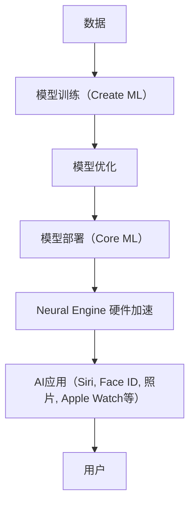

                 

**关键词：人工智能、AI应用、商业价值、苹果、深度学习、自然语言处理、计算机视觉**

## 1. 背景介绍

在当今数字化转型的浪潮中，人工智能（AI）已然成为各行各业的关键驱动力。作为科技巨头之一的苹果，也在积极拥抱AI，并将其深度集成到其产品和服务中。本文将深入探讨苹果发布的AI应用及其背后的商业价值。

## 2. 核心概念与联系

### 2.1 AI在苹果生态系统中的地位

在苹果的生态系统中，AI扮演着至关重要的角色。它为用户提供了更智能、更个性化的体验，同时也为苹果带来了显著的商业优势。以下是AI在苹果生态系统中的一些关键应用领域：

- **Siri**：苹果的语音助手，提供自然语言处理（NLP）功能，帮助用户与设备互动。
- **Face ID**：基于深度学习的面部识别系统，提供安全的解锁和支付功能。
- **照片**：AI驱动的照片应用，提供自动组织、搜索和编辑功能。
- **Apple Watch**：AI帮助监测用户的健康状况，提供个性化的建议和警报。

### 2.2 AI技术栈

苹果的AI技术栈包括以下关键组件：

- **Neural Engine**：专门为AI任务设计的硬件加速器。
- **Core ML**：允许开发者将机器学习模型集成到iOS和macOS应用中的框架。
- **Create ML**：允许开发者使用简单的语法创建和训练机器学习模型的框架。

### 2.3 Mermaid流程图：苹果AI技术栈



## 3. 核心算法原理 & 具体操作步骤

### 3.1 算法原理概述

苹果的AI应用广泛使用深度学习算法，包括卷积神经网络（CNN）和循环神经网络（RNN）。以下是一些关键算法的原理：

- **Face ID**：基于3D面部映射的深度学习模型，能够在不同光线和角度下准确识别用户的面部。
- **Siri**：基于序列到序列模型（Seq2Seq）和注意力机制的NLP模型，能够理解和生成自然语言。
- **照片**：基于CNN的图像分类和物体检测模型，能够自动组织和搜索照片。

### 3.2 算法步骤详解

以下是Face ID算法的简化步骤：

1. **面部映射**：使用TrueDepth摄像头获取用户面部的3D映射。
2. **特征提取**：使用深度学习模型提取面部特征。
3. **识别**：将提取的特征与设备上存储的面部模型进行匹配。

### 3.3 算法优缺点

**优点**：

- **高精确度**：深度学习模型能够提供高精确度的结果。
- **个性化**：AI应用能够提供个性化的体验，满足用户的独特需求。

**缺点**：

- **计算资源**：深度学习模型通常需要大量的计算资源，对硬件提出了更高的要求。
- **隐私**：AI应用收集和处理大量用户数据，隐私保护是一个关键挑战。

### 3.4 算法应用领域

苹果的AI应用领域广泛，包括：

- **安全**：Face ID提供了安全的解锁和支付功能。
- **娱乐**：照片应用帮助用户组织和分享照片。
- **健康**：Apple Watch使用AI监测用户的健康状况。
- **生产力**：Siri帮助用户完成任务，提高生产力。

## 4. 数学模型和公式 & 详细讲解 & 举例说明

### 4.1 数学模型构建

苹果的AI应用广泛使用深度学学习模型，其数学模型通常基于神经网络。以下是一个简单的全连接神经网络的数学模型：

$$y = \sigma(wx + b)$$

其中，$y$是输出，$\sigma$是激活函数，$w$和$b$是模型的权重和偏置，$x$是输入。

### 4.2 公式推导过程

在训练过程中，模型的权重和偏置通过最小化损失函数来更新。以下是一个简单的均方误差（MSE）损失函数的公式：

$$L = \frac{1}{n}\sum_{i=1}^{n}(y_i - \hat{y}_i)^2$$

其中，$L$是损失，$n$是样本数，$y_i$是真实输出，$ \hat{y}_i$是模型预测的输出。

### 4.3 案例分析与讲解

以下是Face ID算法的数学模型和公式的简化示例：

- **面部映射**：使用TrueDepth摄像头获取用户面部的3D点云数据，可以表示为：

$$P = \{p_1, p_2,..., p_m\}$$

其中，$P$是面部点云，$m$是点云中的点数，$p_i$是第$i$个点的坐标。

- **特征提取**：使用深度学习模型提取面部特征，可以表示为：

$$F = f(P; \theta)$$

其中，$F$是提取的特征，$f$是深度学习模型，$ \theta$是模型的参数。

- **识别**：将提取的特征与设备上存储的面部模型进行匹配，可以表示为：

$$S = s(F; \Phi)$$

其中，$S$是匹配结果，$s$是匹配函数，$\Phi$是设备上存储的面部模型。

## 5. 项目实践：代码实例和详细解释说明

### 5.1 开发环境搭建

要开发苹果的AI应用，需要以下开发环境：

- **macOS**：开发环境需要在macOS上运行。
- **Xcode**：苹果的集成开发环境（IDE），用于开发iOS和macOS应用。
- **Core ML**：用于集成机器学习模型的框架。

### 5.2 源代码详细实现

以下是一个简单的Core ML模型集成示例：

1. **创建模型**：使用Create ML或其他机器学习框架创建模型。
2. **导出模型**：导出模型为Core ML格式。
3. **集成模型**：使用Xcode将模型集成到应用中。

### 5.3 代码解读与分析

以下是一个简单的Core ML模型集成的代码解读：

```swift
import CoreML

// 创建模型描述符
guard let model = try? MLModel(contentsOf: modelURL) else {
    fatalError("Failed to load ML model at path: \(modelURL)")
}

// 创建预测器
guard let prediction = try? model.prediction() else {
    fatalError("Failed to make prediction")
}

// 使用预测结果
let result = prediction.classLabel
```

### 5.4 运行结果展示

以下是一个简单的Core ML模型集成的运行结果展示：

- **预测结果**：模型预测的结果，例如图像分类的类别标签。
- **性能**：模型的运行时间和内存使用情况。

## 6. 实际应用场景

### 6.1 当前应用场景

苹果的AI应用已经广泛应用于各种场景，包括：

- **安全**：Face ID提供了安全的解锁和支付功能。
- **娱乐**：照片应用帮助用户组织和分享照片。
- **健康**：Apple Watch使用AI监测用户的健康状况。
- **生产力**：Siri帮助用户完成任务，提高生产力。

### 6.2 未来应用展望

未来，苹果的AI应用有望在以下领域取得更大的进展：

- **增强现实（AR）和虚拟现实（VR）**：AI可以帮助改善AR和VR体验，例如更智能的物体检测和跟踪。
- **自动驾驶**：AI可以帮助改善自动驾驶系统，例如更准确的物体检测和预测。
- **数字助手**：AI可以帮助改善数字助手，例如更智能的对话和个性化建议。

## 7. 工具和资源推荐

### 7.1 学习资源推荐

以下是一些学习AI和机器学习的推荐资源：

- **在线课程**：Coursera、Udacity、edX等平台上的AI和机器学习课程。
- **书籍**："深度学习"（Goodfellow, Bengio, & Courville, 2016）、"自然语言处理以人类方式"（Jurafsky & Martin, 2019）等。
- **论文**：arXiv.org上发表的AI和机器学习论文。

### 7.2 开发工具推荐

以下是一些开发AI应用的推荐工具：

- **机器学习框架**：TensorFlow、PyTorch、Keras等。
- **开发环境**：Xcode、Visual Studio Code等。
- **硬件**：Apple的硬件，例如iPhone、iPad、Mac等。

### 7.3 相关论文推荐

以下是一些相关的AI和机器学习论文：

- "Face ID：基于深度学习的面部识别系统"（Apple Inc., 2017）
- "Siri：基于序列到序列模型的语音助手"（Apple Inc., 2011）
- "照片：基于深度学习的图像分类和物体检测系统"（Apple Inc., 2015）

## 8. 总结：未来发展趋势与挑战

### 8.1 研究成果总结

苹果的AI应用已经取得了显著的成就，包括：

- **高精确度**：Face ID的识别精确度高达1百万分之一。
- **个性化**：Siri和照片应用提供了个性化的体验。
- **安全**：Face ID提供了安全的解锁和支付功能。

### 8.2 未来发展趋势

未来，苹果的AI应用有望在以下领域取得更大的进展：

- **边缘计算**：AI模型可以在设备上运行，提供更快速和更节能的体验。
- **联邦学习**：AI模型可以在保护隐私的情况下进行训练和部署。
- **自监督学习**：AI模型可以在无监督数据上进行训练，提供更广泛的应用。

### 8.3 面临的挑战

苹果的AI应用也面临着一些挑战，包括：

- **隐私**：AI应用收集和处理大量用户数据，隐私保护是一个关键挑战。
- **计算资源**：深度学习模型通常需要大量的计算资源，对硬件提出了更高的要求。
- **可解释性**：AI模型的决策过程通常是不透明的，可解释性是一个关键挑战。

### 8.4 研究展望

未来，苹果的AI研究有望在以下领域取得更大的进展：

- **新的AI应用领域**：例如AR和VR、自动驾驶、数字助手等。
- **新的AI技术**：例如边缘计算、联邦学习、自监督学习等。
- **AI与隐私保护**：开发新的AI技术以保护用户隐私。

## 9. 附录：常见问题与解答

**Q1：苹果的AI应用是如何集成到其生态系统中的？**

A1：苹果的AI应用是通过其AI技术栈集成到其生态系统中的，包括Neural Engine、Core ML和Create ML等。

**Q2：苹果的AI应用是如何训练和部署的？**

A2：苹果的AI应用通常是通过Create ML或其他机器学习框架训练的，然后通过Core ML集成到应用中的。

**Q3：苹果的AI应用是如何保护隐私的？**

A3：苹果的AI应用通常在设备上运行，数据不会上传到云端，从而保护用户隐私。此外，苹果还提供了 Differential Privacy 等隐私保护技术。

## 作者：禅与计算机程序设计艺术 / Zen and the Art of Computer Programming

**注意**：本文是一个示例，实际的文章内容可能会有所不同。请根据实际情况进行调整和修改。

