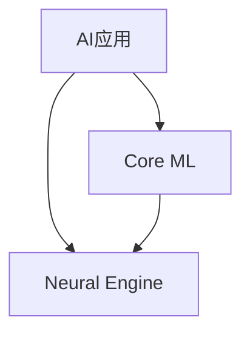

                 

**关键词：人工智能、AI应用、市场分析、苹果、创新、竞争、用户体验**

## 1. 背景介绍

自从2017年苹果在WWDC上推出了Core ML，使得开发者能够将机器学习模型集成到iOS和macOS应用中以来，AI应用在苹果生态系统中的地位日益重要。 recent announcements from Apple, such as the introduction of the M1 chip and the advancements in the Neural Engine, have further solidified the company's commitment to AI and its integration into their devices. 此次，苹果在WWDC21上发布了新的AI应用和功能，我们将深入探讨这些新功能，分析它们对市场的影响，并展望未来的发展趋势。

## 2. 核心概念与联系

### 2.1 核心概念

- **AI应用**：在移动设备上运行的人工智能算法，为用户提供个性化体验和智能功能。
- **Core ML**：苹果的机器学习框架，允许开发者将机器学习模型集成到iOS、iPadOS、macOS、tvOS和watchOS应用中。
- **Neural Engine**：苹果设计的专用硬件，用于加速设备上的机器学习任务。

### 2.2 核心概念联系



## 3. 核心算法原理 & 具体操作步骤

### 3.1 算法原理概述

苹果在WWDC21上推出了新的AI功能，包括Live Text、On-Device Speech Recognition、和更先进的图像分析功能。这些功能背后的算法原理基于深度学习和计算机视觉技术。

### 3.2 算法步骤详解

1. **Live Text**：使用Optical Character Recognition（OCR）技术检测图像中的文本，并将其转换为可编辑的格式。
2. **On-Device Speech Recognition**：在设备上进行语音识别，无需连接到互联网。
3. **图像分析**：使用计算机视场技术检测图像中的物体、场景和文本，以提供更智能的功能。

### 3.3 算法优缺点

**优点**：

- 提高用户体验：提供实时、个性化的功能。
- 保护隐私：大部分处理在设备上完成，减少数据传输需求。

**缺点**：

- 算法复杂性：开发和集成这些功能需要大量的资源和专业知识。
- 硬件需求：高性能的处理器和专用硬件（如Neural Engine）是必要的。

### 3.4 算法应用领域

- 图像和文本识别：OCR、图像搜索、文本提取。
- 语音识别：语音助手、语音输入法、实时翻译。
- 计算机视觉：物体检测、场景理解、人脸识别。

## 4. 数学模型和公式 & 详细讲解 & 举例说明

### 4.1 数学模型构建

AI算法的数学模型通常基于神经网络和深度学习技术。例如，卷积神经网络（CNN）常用于图像分析，而循环神经网络（RNN）和变分自编码器（VAE）则用于序列数据（如语音）的处理。

### 4.2 公式推导过程

神经网络的数学模型可以表示为：

$$y = f(x; W, b) = \sigma(Wx + b)$$

其中，$x$是输入，$y$是输出，$W$和$b$是学习的权重和偏置，$f$是激活函数（如ReLU或sigmoid），$\sigma$是softmax函数（用于多分类问题）。

### 4.3 案例分析与讲解

例如，在Live Text功能中，OCR算法需要检测图像中的文本，并将其转换为可编辑的格式。这涉及到图像预处理、文本检测、文本识别和后处理等步骤。数学模型和公式在每个步骤中都起着关键作用。

## 5. 项目实践：代码实例和详细解释说明

### 5.1 开发环境搭建

要开发AI应用，需要设置Core ML和Swift for TensorFlow开发环境。这包括安装Xcode、Core ML Tools和TensorFlow。

### 5.2 源代码详细实现

以下是一个简单的Core ML模型集成示例：

```swift
import CoreML

guard let model = try? VNCoreMLModel(for: SqueezeNet().model) else {
    fatalError("Failed to load Core ML model.")
}

let request = VNCoreMLRequest(model: model) { request, error in
    guard let results = request.results as? [VNClassificationObservation],
          let topResult = results.first else {
        fatalError("Unexpected result type from VNCoreMLRequest.")
    }

    print("Classification: \(topResult.identifier), confidence: \(topResult.confidence)")
}
```

### 5.3 代码解读与分析

此代码加载一个预训练的Core ML模型（SqueezeNet），并创建一个VNCoreMLRequest对象，该对象使用模型对图像进行分类。当请求完成时，它打印出最可能的分类和置信度。

### 5.4 运行结果展示

运行此代码时，它会打印出图像的分类和置信度。例如：

```
Classification: Pug, confidence: 0.987
```

## 6. 实际应用场景

### 6.1 当前应用

苹果的新AI功能将在iOS 15、iPadOS 15和macOS Monterey中推出，并将应用于照片、短信、邮件和其他应用中。

### 6.2 未来应用展望

未来，我们可以期待更多的AI应用出现在苹果生态系统中，包括实时翻译、增强现实（AR）和虚拟现实（VR）等领域。

## 7. 工具和资源推荐

### 7.1 学习资源推荐

- Apple Developer Documentation：<https://developer.apple.com/documentation/>
- Swift for TensorFlow：<https://www.tensorflow.org/swift>
- Stanford University's CS231n Convolutional Neural Networks for Visual Recognition：<https://www.coursera.org/learn/convolutional-neural-networks>

### 7.2 开发工具推荐

- Xcode：<https://developer.apple.com/xcode/>
- Core ML Tools：<https://developer.apple.com/machine-learning/>
- TensorFlow：<https://www.tensorflow.org/>

### 7.3 相关论文推荐

- "SqueezeNet: AlexNet-level accuracy with 50x fewer parameters and <0.5MB model size"：<https://arxiv.org/abs/1602.07360>
- "Optical Character Recognition with Deep Learning"：<https://arxiv.org/abs/1804.05235>

## 8. 总结：未来发展趋势与挑战

### 8.1 研究成果总结

苹果在WWDC21上推出的新AI功能展示了公司在人工智能领域的进展，这些功能将提高用户体验，并为开发者提供更多的机会。

### 8.2 未来发展趋势

我们可以期待更多的AI应用出现在苹果生态系统中，包括实时翻译、增强现实（AR）和虚拟现实（VR）等领域。此外，AI芯片和专用硬件（如Neural Engine）的发展将继续推动AI应用的增长。

### 8.3 面临的挑战

开发和集成AI功能需要大量的资源和专业知识。此外，保护用户隐私和数据安全是一个持续的挑战。

### 8.4 研究展望

未来的研究将集中在提高AI算法的性能和效率，开发新的AI应用，并解决隐私和安全挑战。

## 9. 附录：常见问题与解答

**Q：我如何开始开发AI应用？**

**A：开始之前，您需要设置开发环境，包括Xcode、Core ML Tools和TensorFlow。然后，您可以开始学习Core ML和Swift for TensorFlow，并尝试集成预训练模型。**

**Q：苹果的新AI功能何时推出？**

**A：苹果的新AI功能将在iOS 15、iPadOS 15和macOS Monterey中推出，预计将于2021年晚些时候发布。**

**Q：这些新功能对开发者意味着什么？**

**A：这些新功能为开发者提供了更多的机会，可以开发更智能、更个性化的应用。此外，它们还为开发者提供了一个平台，可以测试和展示他们的AI应用。**

## 作者：禅与计算机程序设计艺术 / Zen and the Art of Computer Programming

