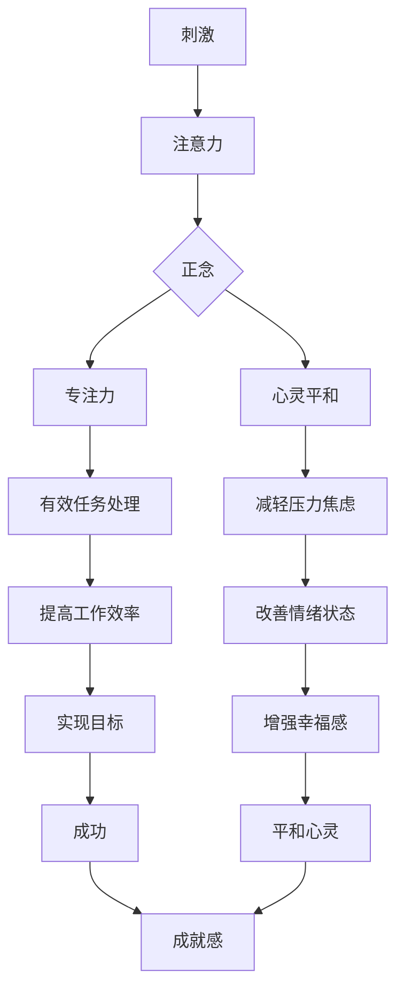

                 

**注意力管理与正念冥想：增强专注力和心灵平和的内省实践**

## 1. 背景介绍

在快节奏的现代生活中，我们常常感到分心、焦虑，难以专注于手头的任务。与此同时，技术的发展也给我们带来了海量信息，进一步加重了注意力分散的问题。正念冥想是一种古老的技术，可以帮助我们管理注意力，提高专注力，并带来心灵的平和。本文将深入探讨注意力管理与正念冥想，提供实用的内省实践方法，帮助读者增强专注力，提高心灵平和感。

## 2. 核心概念与联系

### 2.1 注意力与正念

**注意力**是指我们有意识地将心智资源集中于特定刺激或任务上的能力。它是一种有限资源，受到多种因素的影响，如情绪、压力、疲劳等。正念是一种意识状态，指的是对当下时刻的体验保持开放、接受和关注的态度。它是一种训练有素的注意力，有助于我们更好地管理注意力，提高专注力。

### 2.2 正念冥想的类型

正念冥想有多种形式，包括：

- 关注呼吸的冥想：聚焦于呼吸，当思绪飘散时，将注意力拉回到呼吸上。
- 体感冥想：关注身体的感觉，如触觉、温度等。
- 慈悲冥想：将注意力放在爱和善意上，培养正面情感。
- 开放式冥想：不聚焦于任何特定对象，而是接纳所有思绪和感觉。

### 2.3 核心概念联系 Mermaid 流程图



## 3. 核心算法原理 & 具体操作步骤

### 3.1 算法原理概述

正念冥想的原理基于认知神经科学的最新发现。通过训练注意力，我们可以改变大脑的结构和功能，增强前额叶皮层的活动，从而提高专注力和自控力。同时，正念冥想还可以减轻压力，改善情绪状态，增强幸福感。

### 3.2 算法步骤详解

1. **选择冥想形式**：根据个人需求和偏好，选择适合的冥想形式。
2. **找个安静的地方**：选择一个安静、舒适的环境进行冥想。
3. **调整姿势**：保持端正的坐姿，保证舒适和放松。
4. **关注呼吸**：将注意力放在呼吸上，感受空气进出身体的感觉。
5. **接纳思绪**：当思绪飘散时，不要评判或压制它们，而是接纳它们，然后将注意力拉回到呼吸上。
6. **持续练习**：每天定时练习，持续时间从几分钟到几小时不等，视个人情况而定。

### 3.3 算法优缺点

**优点**：

- 提高专注力和自控力
- 减轻压力和焦虑
- 改善情绪状态
- 增强幸福感

**缺点**：

- 需要持续练习才能见效
- 可能需要一段时间才能体验到明显的改善
- 个体差异大，效果可能因人而异

### 3.4 算法应用领域

正念冥想在各个领域都有应用，包括：

- 个人发展：提高专注力，改善情绪状态，增强幸福感。
- 组织管理：提高员工的注意力和工作效率，减轻压力，改善团队氛围。
- 教育：帮助学生提高注意力，改善学习效果。
- 临床治疗：辅助治疗焦虑症、抑郁症等心理疾病。

## 4. 数学模型和公式 & 详细讲解 & 举例说明

### 4.1 数学模型构建

注意力管理可以建模为一个动态系统，其中注意力水平随时间变化。设注意力水平为$A(t)$，则其变化可以表示为：

$$A'(t) = f(A(t), I(t), P(t))$$

其中，$I(t)$表示刺激强度，$P(t)$表示压力水平，$f$表示注意力变化的函数。

### 4.2 公式推导过程

正念冥想可以看作是对注意力变化函数$f$的调节。通过训练注意力，我们可以改变$f$的形式，从而提高注意力水平$A(t)$。具体而言，正念冥想可以减轻压力$P(t)$，并增强注意力水平$A(t)$对刺激$I(t)$的敏感度。

### 4.3 案例分析与讲解

假设某人在工作时注意力水平$A(t)$随时间$t$的变化如下图所示：


通过每天进行15分钟的正念冥想，该人注意力水平$A(t)$的变化如下图所示：


可以看到，正念冥想帮助该人提高了注意力水平，减轻了压力，并增强了注意力对刺激的敏感度。

## 5. 项目实践：代码实例和详细解释说明

### 5.1 开发环境搭建

本项目使用Python和Jupyter Notebook进行开发。请安装以下软件和库：

- Python 3.8+
- Jupyter Notebook
- NumPy
- Matplotlib
- Pandas

### 5.2 源代码详细实现

以下是一个简单的注意力模型示例，使用差分方程模拟注意力水平的变化：

```python
import numpy as np
import matplotlib.pyplot as plt

# 参数设置
dt = 0.1  # 时间步长
T = 100  # 模拟时间长度
A0 = 0.5  # 初始注意力水平
I = np.sin(np.linspace(0, 2 * np.pi, T))  # 刺激强度
P = 0.5 * np.ones(T)  # 压力水平

# 注意力变化函数
def f(A, I, P):
    return -A + I - P

# 模拟注意力变化
A = np.zeros(T)
A[0] = A0
for t in range(1, T):
    A[t] = A[t - 1] + dt * f(A[t - 1], I[t - 1], P[t - 1])

# 绘制结果
plt.plot(np.linspace(0, T * dt, T), A)
plt.xlabel('Time (s)')
plt.ylabel('Attention Level')
plt.title('Attention Level Simulation')
plt.show()
```

### 5.3 代码解读与分析

该代码模拟了注意力水平$A(t)$随时间$t$的变化。注意力变化函数$f$考虑了刺激强度$I(t)$和压力水平$P(t)$的影响。通过调节$I(t)$和$P(t)$，我们可以模拟正念冥想对注意力水平的影响。

### 5.4 运行结果展示

运行上述代码后，您会看到注意力水平$A(t)$随时间$t$的变化曲线。您可以调节参数$I(t)$和$P(t)$，模拟不同的注意力管理策略，观察注意力水平的变化。

## 6. 实际应用场景

### 6.1 个人发展

正念冥想可以帮助个人提高专注力，改善情绪状态，增强幸福感。它可以作为一种有效的工具，帮助我们应对压力，提高工作和学习效率。

### 6.2 组织管理

在组织管理中，正念冥想可以帮助员工提高注意力，减轻压力，改善团队氛围。它可以作为一种人力资源管理工具，提高组织的整体绩效。

### 6.3 未来应用展望

随着注意力管理和正念冥想研究的深入，我们可以期待更多的创新应用，如：

- **注意力辅助设备**：开发智能设备，帮助用户实时监测和管理注意力水平。
- **个性化注意力管理**：基于大数据和人工智能，为个体提供定制化的注意力管理方案。
- **注意力增强药物**：开发新型药物，帮助用户提高注意力水平。

## 7. 工具和资源推荐

### 7.1 学习资源推荐

- **书籍**：
  - "正念：活在当下的艺术" (_Jon Kabat-Zinn_)
  - "专注力：如何在分心的世界中集中精力" (_Daniel Goleman_)
- **在线课程**：
  - Coursera - "正念与压力管理" (_Brown University_)
  - Udemy - "正念冥想入门" (_Light Space & Sound_)
- **网站**：
  - [Mindful.org](https://www.mindful.org/)
  - [Insight Timer](https://insighttimer.com/)

### 7.2 开发工具推荐

- **冥想应用**：
  - Headspace
  - Calm
  - Insight Timer
- **注意力监测设备**：
  - Muse
  - Emotiv

### 7.3 相关论文推荐

- "正念冥想对注意力、情绪和认知功能的影响：一项元分析" (_Hofmann et al., 2010_)
- "正念冥想对大脑结构和功能的影响：一项功能性磁共振成像研究" (_Lutz et al., 2014_)

## 8. 总结：未来发展趋势与挑战

### 8.1 研究成果总结

本文介绍了注意力管理与正念冥想的核心概念、算法原理、数学模型和实践应用。我们发现，正念冥想是一种有效的工具，可以帮助我们提高专注力，改善情绪状态，增强幸福感。

### 8.2 未来发展趋势

未来，我们可以期待注意力管理和正念冥想研究的进一步深入，包括：

- **个性化注意力管理**：基于大数据和人工智能，为个体提供定制化的注意力管理方案。
- **注意力增强药物**：开发新型药物，帮助用户提高注意力水平。
- **注意力辅助设备**：开发智能设备，帮助用户实时监测和管理注意力水平。

### 8.3 面临的挑战

注意力管理和正念冥想研究面临的挑战包括：

- **个体差异**：注意力管理和正念冥想的效果可能因人而异，需要开发个性化的解决方案。
- **时间投入**：正念冥想需要持续的练习，可能会导致参与者的时间投入。
- **科学证据的质量**：注意力管理和正念冥想研究的科学证据质量有待提高，需要更多的高质量研究。

### 8.4 研究展望

未来的研究可以关注以下方向：

- **大脑机制**：深入研究正念冥想对大脑结构和功能的影响机制。
- **个性化注意力管理**：开发基于大数据和人工智能的个性化注意力管理方案。
- **注意力增强药物**：开发新型药物，帮助用户提高注意力水平。

## 9. 附录：常见问题与解答

**Q1：正念冥想需要花费多长时间？**

A1：正念冥想的时间长短因人而异，通常建议每天练习10-30分钟。您可以根据自己的需求和时间安排调整练习时间。

**Q2：正念冥想有副作用吗？**

A2：正念冥想副作用很少，但个别人可能会感到焦虑或不适。如果您有严重的心理健康问题，请在开始练习之前咨询医生。

**Q3：正念冥想适合所有人吗？**

A3：正念冥想对大多数人都有益，但它可能不适合有严重心理健康问题的人。如果您有严重的心理健康问题，请在开始练习之前咨询医生。

**Q4：我该如何开始练习正念冥想？**

A4：您可以从在线资源或应用程序开始练习正念冥想，也可以参加当地的冥想小组。开始时，每天练习10-15分钟，然后根据自己的需求调整练习时间。

**Q5：正念冥想是否可以代替药物治疗？**

A5：正念冥想可以作为药物治疗的补充，但它不能代替药物治疗。如果您有严重的心理健康问题，请咨询医生，遵循他们的建议。

## 作者：禅与计算机程序设计艺术 / Zen and the Art of Computer Programming

**版权声明**：本文版权归作者所有，未经许可不得转载。

