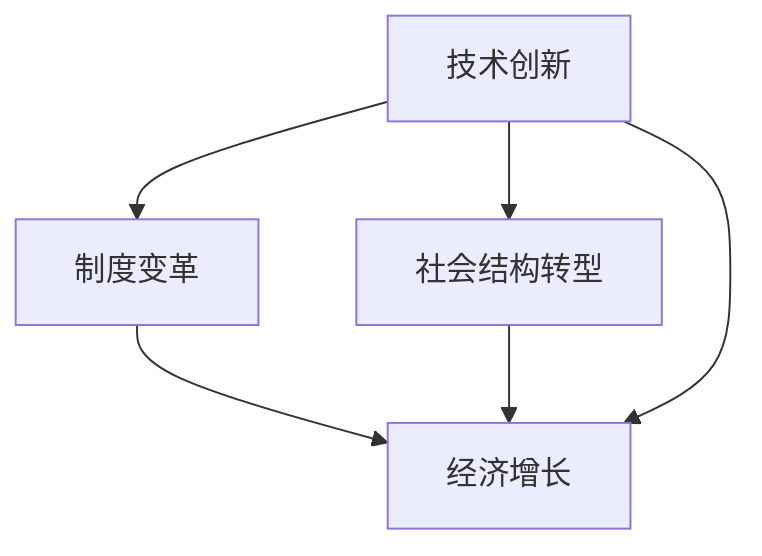

                 

## 1. 背景介绍

在当今世界，经济增长是各国政府和政策制定者关注的重点。然而，传统的经济指标和模型并不能完全解释经济增长的复杂性和多样性。深层次问题，如技术创新、制度变革和社会结构转型，对经济增长的长期影响正在引起越来越多的关注。本文将深入探讨这些深层次问题如何塑造经济增长的长期轨迹，并提供一个综合框架来理解和预测这些影响。

## 2. 核心概念与联系

### 2.1 关键概念

- **技术创新**：指新技术、新产品或新生产过程的开发和采用。
- **制度变革**：指规则、规范和程序的变化，这些规则、规范和程序塑造了经济行为和交易。
- **社会结构转型**：指人口结构、教育水平和劳动力市场参与的变化。
- **经济增长**：指一个国家或地区的总产出或收入的长期增加。

### 2.2 核心概念联系 Mermaid 流程图



## 3. 核心算法原理 & 具体操作步骤

### 3.1 算法原理概述

我们将使用系统动力学方法来建模和分析深层次问题对经济增长的长期影响。系统动力学是一种跨学科方法，用于研究复杂系统的长期行为。它将非线性关系、反馈回路和延迟效应等因素考虑在内。

### 3.2 算法步骤详解

1. **问题识别**：确定需要研究的深层次问题。
2. **概念模型构建**：使用系统动力学方法，将关键变量和关系可视化表示出来。
3. **数学模型构建**：将概念模型转化为数学方程，描述系统的动态行为。
4. **模型校验**：使用历史数据校验模型的有效性。
5. **模型预测**：使用模型预测未来趋势和分析政策干预的影响。
6. **模型迭代**：根据新数据和反馈，不断修正和改进模型。

### 3.3 算法优缺点

**优点**：系统动力学方法可以处理复杂系统，考虑到非线性关系和反馈回路，有助于理解长期趋势。

**缺点**：模型构建需要大量专业知识和时间，模型的准确性依赖于输入数据的质量。

### 3.4 算法应用领域

系统动力学方法广泛应用于环境、能源、交通、卫生等领域。在经济领域，它用于研究长期增长、技术创新和政策影响等问题。

## 4. 数学模型和公式 & 详细讲解 & 举例说明

### 4.1 数学模型构建

我们构建一个简单的系统动力学模型，描述技术创新、制度变革和社会结构转型对经济增长的影响。模型包含四个关键变量：技术水平（T）、制度质量（I）、人力资本水平（H）和总产出（Y）。

$$
\frac{dT}{dt} = f(T, I, H) \\
\frac{dI}{dt} = g(T, I, Y) \\
\frac{dH}{dt} = h(T, I, Y) \\
\frac{dY}{dt} = k(T, I, H, Y)
$$

### 4.2 公式推导过程

函数f、g、h和k描述了各变量之间的关系。例如，技术水平的变化取决于当前技术水平、制度质量和人力资本水平。这些关系可以通过回归分析或专家判断来确定。

### 4.3 案例分析与讲解

假设我们有以下关系：

$$
f(T, I, H) = a \cdot T \cdot I \cdot H \\
g(T, I, Y) = b \cdot T \cdot (1 - I) \cdot Y \\
h(T, I, Y) = c \cdot T \cdot I \cdot Y \\
k(T, I, H, Y) = d \cdot T \cdot I \cdot H \cdot Y
$$

其中a、b、c和d是模型参数。我们可以使用数值方法（如Euler方法或Runge-Kutta方法）来求解这些方程，预测技术创新、制度变革和社会结构转型对经济增长的长期影响。

## 5. 项目实践：代码实例和详细解释说明

### 5.1 开发环境搭建

我们使用Python和Scipy库来求解系统动力学模型。首先，安装必要的库：

```bash
pip install scipy matplotlib
```

### 5.2 源代码详细实现

以下是模型求解的Python代码：

```python
import numpy as np
import matplotlib.pyplot as plt
from scipy.integrate import odeint

# 定义模型方程
def model(y, t, a, b, c, d):
    T, I, H, Y = y
    dTdt = a * T * I * H
    dIdt = b * T * (1 - I) * Y
    dHdt = c * T * I * Y
    dYdt = d * T * I * H * Y
    return [dTdt, dIdt, dHdt, dYdt]

# 参数设置
a, b, c, d = 0.1, 0.05, 0.02, 0.5

# 初始条件
T0, I0, H0, Y0 = 0.5, 0.6, 0.7, 1000

# 时间向量
t = np.linspace(0, 50, 1000)

# 初始条件向量
y0 = [T0, I0, H0, Y0]

# 求解模型
sol = odeint(model, y0, t, args=(a, b, c, d))

# 绘制结果
plt.plot(t, sol[:, 0], label='Technological Level (T)')
plt.plot(t, sol[:, 1], label='Institutional Quality (I)')
plt.plot(t, sol[:, 2], label='Human Capital Level (H)')
plt.plot(t, sol[:, 3], label='Total Output (Y)')
plt.xlabel('Time')
plt.ylabel('Level')
plt.legend()
plt.show()
```

### 5.3 代码解读与分析

代码定义了模型方程，设置了参数和初始条件，使用Scipy的odeint函数求解了模型，并绘制了结果。

### 5.4 运行结果展示

运行代码后，我们可以看到技术水平、制度质量、人力资本水平和总产出随时间变化的图表。这些图表展示了技术创新、制度变革和社会结构转型如何影响经济增长。

## 6. 实际应用场景

### 6.1 当前应用

系统动力学方法已经应用于各种经济增长研究，包括技术创新对增长的影响、制度变革对增长的影响，以及人力资本积累对增长的影响。

### 6.2 未来应用展望

未来，系统动力学方法可以与大数据和机器学习技术结合，更准确地预测经济增长。此外，它可以帮助政策制定者设计更有效的政策，以促进技术创新、制度变革和社会结构转型，从而推动经济增长。

## 7. 工具和资源推荐

### 7.1 学习资源推荐

- **书籍**："System Dynamics: Feedback, Control, and Policy Analysis" by Jay W. Forrester
- **在线课程**：Coursera上的"System Dynamics: Thinking in Systems"课程

### 7.2 开发工具推荐

- **Stella**: 系统动力学软件，用于建模和模拟复杂系统。
- **Python**: 用于求解系统动力学模型和数据分析。

### 7.3 相关论文推荐

- "Endogenous Growth Theory" by Robert E. Lucas Jr.
- "Institutions and Economic Performance: Theory and Evidence from Africa" by Daron Acemoglu, Simon Johnson, and James A. Robinson

## 8. 总结：未来发展趋势与挑战

### 8.1 研究成果总结

本文提供了一个系统动力学框架，用于研究技术创新、制度变革和社会结构转型对经济增长的长期影响。这个框架可以帮助我们更好地理解这些深层次问题如何塑造经济增长的长期轨迹。

### 8.2 未来发展趋势

未来，系统动力学方法将与大数据和机器学习技术结合，更准确地预测经济增长。此外，它将帮助政策制定者设计更有效的政策，以促进技术创新、制度变革和社会结构转型。

### 8.3 面临的挑战

系统动力学方法的一个挑战是模型构建需要大量专业知识和时间。此外，模型的准确性依赖于输入数据的质量。

### 8.4 研究展望

未来的研究可以扩展这个框架，考虑更多因素，如自然资源、环境变化和全球化。此外，研究可以应用这个框架来分析特定国家或地区的经济增长。

## 9. 附录：常见问题与解答

**Q：系统动力学方法需要什么样的数据？**

**A**：系统动力学方法需要关键变量的时间序列数据，以及这些变量之间关系的信息。

**Q：系统动力学方法如何处理不确定性？**

**A**：系统动力学方法通常使用 Monte Carlo模拟来处理不确定性。这涉及到对模型参数进行随机采样，并观察模型输出的分布。

**Q：系统动力学方法如何与其他方法结合？**

**A**：系统动力学方法可以与其他方法结合，如统计方法、经济学方法和计算机模拟方法。例如，它可以与大数据和机器学习技术结合，更准确地预测经济增长。

---

作者：禅与计算机程序设计艺术 / Zen and the Art of Computer Programming

