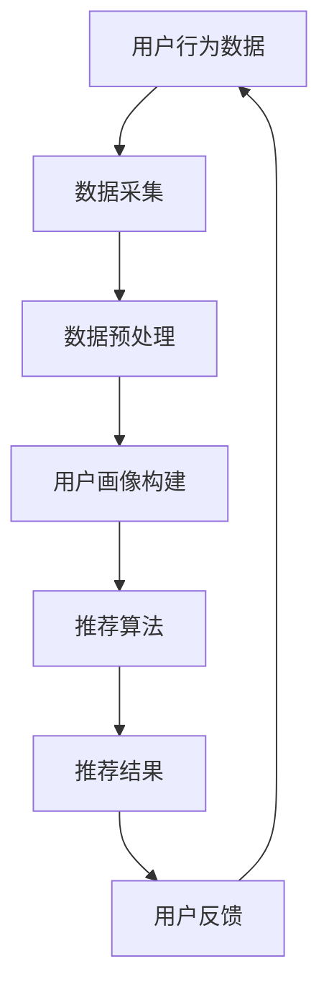

                 

**用户画像在电商个性化推荐中的应用：方法与实践**

## 1. 背景介绍

在当今竞争激烈的电商市场，如何为每个用户提供个性化的产品推荐已成为关键成功要素。用户画像（User Profiling）技术在此过程中发挥着至关重要的作用。本文将深入探讨用户画像在电商个性化推荐中的应用，包括核心概念、算法原理、数学模型、项目实践，以及未来发展趋势。

## 2. 核心概念与联系

### 2.1 用户画像

用户画像是指对用户特征、行为、偏好等方面的综合描述，旨在帮助理解用户需求，从而提供个性化服务。在电商领域，用户画像通常包括用户的购买历史、浏览历史、搜索历史、兴趣爱好、 Demographics 等信息。

### 2.2 个性化推荐

个性化推荐（Personalized Recommendation）是指根据用户画像，为每个用户提供定制化的产品推荐。其目标是提高推荐的相关性和用户满意度，从而增加销售额和用户忠诚度。

### 2.3 架构图

下图描述了用户画像在电商个性化推荐系统中的架构：



## 3. 核心算法原理 & 具体操作步骤

### 3.1 算法原理概述

个性化推荐算法通常基于协同过滤（Collaborative Filtering）、内容过滤（Content-based Filtering）、混合过滤（Hybrid Filtering）或深度学习（Deep Learning）等技术。本文重点介绍基于协同过滤的用户画像构建和个性化推荐。

### 3.2 算法步骤详解

1. **数据采集**：收集用户的购买、浏览、搜索等行为数据，以及产品的属性数据。
2. **数据预处理**：清洗、转换和归一化数据，构建用户-产品交互矩阵。
3. **用户画像构建**：使用协同过滤技术，如基于用户的协同过滤（User-based CF）或基于物品的协同过滤（Item-based CF），计算用户之间的相似度或产品之间的相似度，从而构建用户画像。
4. **推荐算法**：基于用户画像，使用推荐算法（如基于用户的推荐或基于物品的推荐）为每个用户推荐相关产品。
5. **评估和优化**：使用评估指标（如精确度、召回率、F1-score）评估推荐系统的性能，并不断优化算法。

### 3.3 算法优缺点

**优点**：
- 可以为每个用户提供个性化推荐。
- 无需对产品进行详细描述，只需记录用户行为即可。

**缺点**：
- 受数据稀疏性的影响，难以为新用户或新产品提供准确推荐。
- 可能受到“冷启动”问题的影响，即新用户或新产品缺乏足够的行为数据。

### 3.4 算法应用领域

用户画像和个性化推荐技术广泛应用于电商、视频推荐、音乐推荐、新闻推荐等领域，帮助企业提高用户满意度和销售额。

## 4. 数学模型和公式 & 详细讲解 & 举例说明

### 4.1 数学模型构建

假设我们有 $m$ 个用户和 $n$ 个产品，用户-产品交互矩阵 $R \in \mathbb{R}^{m \times n}$ 表示用户对产品的评分或购买行为。用户画像可以表示为用户-用户相似度矩阵 $S \in \mathbb{R}^{m \times m}$ 或产品-产品相似度矩阵 $P \in \mathbb{R}^{n \times n}$。

### 4.2 公式推导过程

**基于用户的协同过滤（User-based CF）：**
1. 计算用户-用户相似度矩阵 $S$：
   $$S_{ij} = \cos(R_{i}, R_{j}) = \frac{R_{i} \cdot R_{j}}{\|R_{i}\| \cdot \|R_{j}\|}$$
   其中，$R_{i}$ 和 $R_{j}$ 分别是用户 $i$ 和 $j$ 的评分向量。
2. 为用户 $i$ 推荐产品 $k$：
   $$P_{ik} = \sum_{j=1}^{m} S_{ij} \cdot R_{jk}$$
   其中，$P_{ik}$ 是用户 $i$ 对产品 $k$ 的预测评分。

**基于物品的协同过滤（Item-based CF）：**
1. 计算产品-产品相似度矩阵 $P$：
   $$P_{kl} = \cos(R^{k}, R^{l}) = \frac{R^{k} \cdot R^{l}}{\|R^{k}\| \cdot \|R^{l}\|}$$
   其中，$R^{k}$ 和 $R^{l}$ 分别是产品 $k$ 和 $l$ 的评分向量。
2. 为用户 $i$ 推荐产品 $k$：
   $$P_{ik} = \frac{\sum_{l=1}^{n} P_{kl} \cdot R_{il}}{\sum_{l=1}^{n} |P_{kl}|}$$
   其中，$P_{ik}$ 是用户 $i$ 对产品 $k$ 的预测评分。

### 4.3 案例分析与讲解

假设我们有以下用户-产品评分矩阵 $R$：

$$
R = \begin{bmatrix}
5 & 3 & 0 & 0 \\
3 & 4 & 5 & 0 \\
0 & 0 & 4 & 5 \\
5 & 0 & 3 & 4 \\
\end{bmatrix}
$$

**用户-用户相似度矩阵 $S$：**

$$
S = \begin{bmatrix}
1 & 0.9 & 0 & 0.9 \\
0.9 & 1 & 0.9 & 0 \\
0 & 0.9 & 1 & 0.9 \\
0.9 & 0 & 0.9 & 1 \\
\end{bmatrix}
$$

**产品-产品相似度矩阵 $P$：**

$$
P = \begin{bmatrix}
1 & 0.6 & 0 & 0 \\
0.6 & 1 & 0.6 & 0 \\
0 & 0.6 & 1 & 0.6 \\
0 & 0 & 0.6 & 1 \\
\end{bmatrix}
$$

使用上述公式，我们可以为每个用户推荐相关产品。

## 5. 项目实践：代码实例和详细解释说明

### 5.1 开发环境搭建

本项目使用 Python 语言，并依赖于 NumPy、Pandas、Scikit-learn、Surprise 等库。请确保已安装这些库，并设置好开发环境。

### 5.2 源代码详细实现

以下是基于用户的协同过滤算法的 Python 实现：

```python
import numpy as np
import pandas as pd
from sklearn.metrics.pairwise import cosine_similarity
from surprise import Dataset, Reader, KNNWithMeans

# 读取数据
reader = Reader(rating_scale=(1, 5))
data = Dataset.load_from_df(pd.read_csv('ratings.csv'), reader)

# 构建用户-用户相似度矩阵
sim_options = {
    'name': 'cosine',
    'user_based': True
}
algo = KNNWithMeans(sim_options=sim_options)
algo.fit(data.build_full_trainset())

# 为用户推荐产品
uid = '1'  # 示例用户 ID
iid = '5'  # 示例产品 ID
pred = algo.predict(uid, iid)
print(f'预测评分：{pred.est}')
```

### 5.3 代码解读与分析

1. 使用 Surprise 库读取数据，并构建用户-产品评分矩阵。
2. 设置相似度计算选项，并使用 KNNWithMeans 算法构建用户-用户相似度矩阵。
3. 为示例用户推荐示例产品，并打印预测评分。

### 5.4 运行结果展示

运行上述代码，您将看到为示例用户推荐示例产品的预测评分。

## 6. 实际应用场景

### 6.1 电商平台个性化推荐

电商平台可以使用用户画像和个性化推荐技术为每个用户提供定制化的产品推荐，从而提高用户满意度和销售额。

### 6.2 视频推荐系统

视频平台可以基于用户的观看历史和偏好构建用户画像，并为每个用户推荐相关视频，从而提高用户粘性和流量。

### 6.3 未来应用展望

随着大数据和人工智能技术的发展，用户画像和个性化推荐技术将进一步融合，为用户提供更加智能和个性化的服务。此外，这些技术还将应用于更多领域，如智能家居、智能医疗等。

## 7. 工具和资源推荐

### 7.1 学习资源推荐

- [Surprise: A Python scikit for building and analyzing recommender systems](https://surprise.readthedocs.io/en/latest/)
- [MovieLens Dataset](https://grouplens.org/datasets/movielens/)
- [Recommender Systems: An Introduction](https://www.oreilly.com/library/view/recommender-systems-an/9781449361331/)

### 7.2 开发工具推荐

- Python：一个强大的编程语言，广泛应用于数据分析和机器学习领域。
- Jupyter Notebook：一个交互式计算环境，支持 Python、R 等语言，并提供丰富的可视化工具。
- TensorFlow、PyTorch：两个流行的深度学习框架，可以用于构建复杂的推荐系统。

### 7.3 相关论文推荐

- [The Netflix Prize: A Case Study in Recommender Systems](https://dl.acm.org/doi/10.1145/1390697.1390700)
- [Collaborative Filtering for Everyday Life: A Survey of Recent Research](https://dl.acm.org/doi/10.1145/3368089)
- [Deep Learning for Recommender Systems: A Survey of Recent Advances and Future Directions](https://arxiv.org/abs/2009.11923)

## 8. 总结：未来发展趋势与挑战

### 8.1 研究成果总结

本文介绍了用户画像在电商个性化推荐中的应用，包括核心概念、算法原理、数学模型、项目实践，以及工具和资源推荐。通过实践项目，我们展示了如何使用基于用户的协同过滤算法构建用户画像并进行个性化推荐。

### 8.2 未来发展趋势

未来，用户画像和个性化推荐技术将继续发展，并出现以下趋势：

- **深度学习**：深度学习技术将进一步应用于推荐系统，从而提高推荐的准确性和个性化。
- **多模式学习**：推荐系统将结合多种数据模式，如用户行为数据、内容数据、外部数据等，从而构建更全面的用户画像。
- **实时推荐**：推荐系统将实时响应用户行为，并提供即时个性化推荐。

### 8.3 面临的挑战

然而，用户画像和个性化推荐技术也面临着以下挑战：

- **数据隐私**：如何在保护用户隐私的同时构建有效的用户画像是一个关键挑战。
- **数据稀疏性**：如何处理数据稀疏性问题，从而为新用户或新产品提供准确推荐是另一个挑战。
- **冷启动问题**：如何为新用户或新产品提供有效推荐，从而解决“冷启动”问题。

### 8.4 研究展望

未来的研究将关注以下方向：

- **多模式学习**：结合多种数据模式，构建更全面的用户画像。
- **实时推荐**：实时响应用户行为，提供即时个性化推荐。
- **数据隐私保护**：在保护用户隐私的同时构建有效的用户画像。

## 9. 附录：常见问题与解答

**Q：如何评估推荐系统的性能？**

A：常用的评估指标包括精确度（Precision）、召回率（Recall）、F1-score、Mean Average Precision（MAP）、Normalized Discounted Cumulative Gain（NDCG）等。

**Q：如何处理数据稀疏性问题？**

A：常用的方法包括填充缺失值、使用矩阵因子化技术、引入外部信息等。

**Q：如何解决“冷启动”问题？**

A：常用的方法包括使用内容过滤技术、引入外部信息、使用基线推荐等。

**Q：如何保护用户隐私？**

A：常用的方法包括匿名化数据、使用差分隐私技术、使用联邦学习技术等。

## 作者：禅与计算机程序设计艺术 / Zen and the Art of Computer Programming

