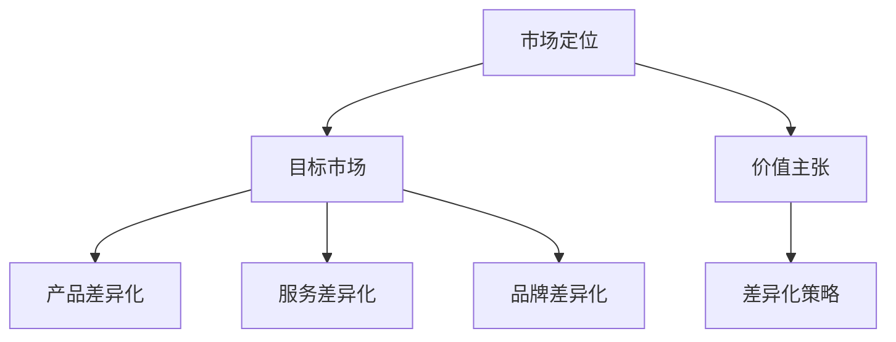
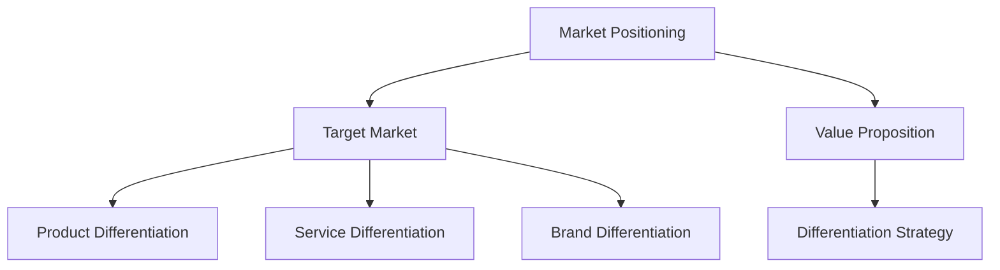
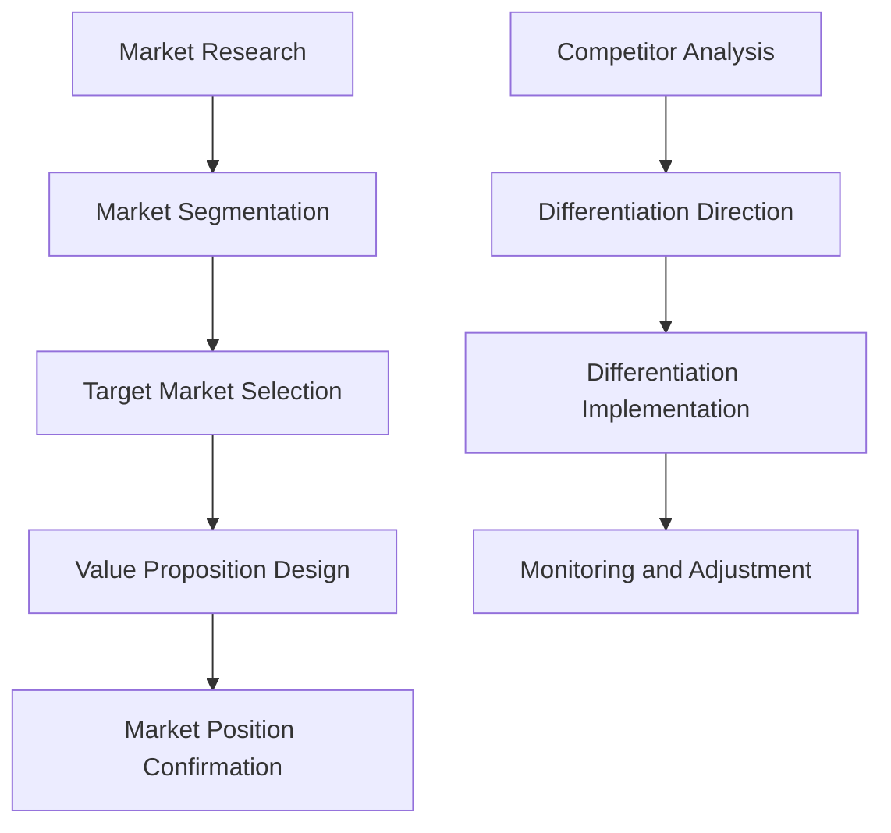

                 

### 文章标题

**一人公司的市场定位与差异化策略**

> **关键词：**一人公司、市场定位、差异化策略、商业模式、竞争优势、用户体验、客户关系管理、技术创新

**摘要：**本文将探讨一人公司的市场定位与差异化策略，分析其在当前竞争激烈的市场环境中如何通过精确的市场定位和独特的差异化策略，实现商业成功和持续增长。

### 1. 背景介绍（Background Introduction）

一人公司（One-Person Company）是一种商业模式，指由一位个人运营和管理的企业。随着全球创业浪潮的兴起，一人公司已经成为现代商业世界的一个重要组成部分。这种模式灵活、高效，尤其适合资源有限的创业者。然而，市场环境的复杂性和竞争的加剧，使得一人公司在市场中找准定位、制定有效的差异化策略变得至关重要。

市场定位（Market Positioning）是指企业在市场中所占的位置和形象。它涉及确定目标市场、理解客户需求、以及通过独特的价值主张来区分自身与其他竞争对手。差异化策略（Differentiation Strategy）则是通过产品、服务或品牌特点，使企业能够在市场中脱颖而出，吸引并留住客户。

本文旨在通过对一人公司的市场定位和差异化策略的深入探讨，为创业者提供实用的指导和借鉴。文章将分为以下几个部分：

- 背景介绍：阐述一人公司的定义和重要性。
- 核心概念与联系：介绍市场定位和差异化策略的基本原理。
- 核心算法原理 & 具体操作步骤：分析如何制定有效的市场定位和差异化策略。
- 数学模型和公式 & 详细讲解 & 举例说明：运用理论工具进行策略分析。
- 项目实践：通过实际案例展示市场定位和差异化策略的应用。
- 实际应用场景：探讨一人公司在不同行业中的应用案例。
- 工具和资源推荐：推荐相关学习资源。
- 总结：总结文章要点，展望未来发展趋势和挑战。
- 附录：常见问题与解答。
- 扩展阅读 & 参考资料：提供进一步阅读的资料。

<|mask|>### 2. 核心概念与联系

#### 2.1 市场定位（Market Positioning）

市场定位是一个战略过程，涉及识别目标市场、了解客户需求、以及确定企业在市场中的独特位置。成功的市场定位可以帮助企业明确自身在市场中的定位，从而更好地制定营销策略。

**市场细分（Market Segmentation）：** 市场细分是将整个市场划分为若干具有相似需求和特征的子市场。一人公司可以通过市场细分，找到最具潜力的细分市场，从而集中资源和精力进行针对性营销。

**目标市场（Target Market）：** 目标市场是指企业决定集中资源和营销努力的目标客户群体。确定目标市场有助于企业更好地理解客户需求，并设计出满足这些需求的解决方案。

**价值主张（Value Proposition）：** 价值主张是企业向客户传递的独特价值和利益，它应该明确回答“为什么客户应该选择我们的产品或服务”。一人公司需要通过独特的产品或服务特点，打造具有吸引力的价值主张。

#### 2.2 差异化策略（Differentiation Strategy）

差异化策略是指企业通过独特的产品、服务或品牌特点，在市场上形成差异化优势，从而吸引并留住客户。

**产品差异化（Product Differentiation）：** 产品差异化是通过独特的产品特点来区分自身与竞争对手。一人公司可以通过创新产品、高品质、个性化定制等方式实现产品差异化。

**服务差异化（Service Differentiation）：** 服务差异化是通过卓越的客户服务来吸引和保留客户。一人公司可以通过快速响应、个性化服务、专业培训等手段提升服务质量。

**品牌差异化（Brand Differentiation）：** 品牌差异化是通过打造独特品牌形象来吸引客户。一人公司可以通过独特品牌故事、品牌理念、品牌识别等手段建立品牌差异化。

#### 2.3 市场定位与差异化策略的联系

市场定位和差异化策略密切相关。市场定位帮助企业确定目标市场和独特的价值主张，而差异化策略则是实现市场定位的手段。通过市场定位，一人公司可以明确自身在市场中的位置，而差异化策略则帮助企业打造独特的竞争优势，从而在激烈的市场竞争中脱颖而出。

**关系图：** 



**英文双语：**

#### 2.1 Market Positioning

Market positioning is a strategic process that involves identifying the target market, understanding customer needs, and determining the unique position of the company in the market. A successful market positioning helps the company to clarify its position in the market, thus allowing for better formulation of marketing strategies.

**Market Segmentation:** Market segmentation involves dividing the entire market into several submarkets with similar needs and characteristics. A one-person company can use market segmentation to find the most promising submarkets and focus its resources and efforts on targeted marketing.

**Target Market:** The target market is the group of customers that the company decides to concentrate its resources and marketing efforts on. Determining the target market helps the company to better understand customer needs and design solutions that meet those needs.

**Value Proposition:** A value proposition is the unique value and benefits that the company communicates to its customers. It should clearly answer the question, "Why should customers choose our product or service?" A one-person company needs to create an attractive value proposition through unique product or service features.

#### 2.2 Differentiation Strategy

Differentiation strategy refers to the company's efforts to create a unique competitive advantage by offering unique products, services, or brand characteristics that distinguish it from competitors.

**Product Differentiation:** Product differentiation involves creating unique product features to distinguish the company from its competitors. A one-person company can achieve product differentiation through innovative products, high quality, or personalized customization.

**Service Differentiation:** Service differentiation involves attracting and retaining customers through excellent customer service. A one-person company can enhance service quality through quick responses, personalized service, professional training, and more.

**Brand Differentiation:** Brand differentiation involves creating a unique brand image to attract customers. A one-person company can establish brand differentiation through a unique brand story, brand philosophy, and brand identity.

#### 2.3 The Relationship Between Market Positioning and Differentiation Strategy

Market positioning and differentiation strategy are closely related. Market positioning helps the company to determine its position in the market and unique value proposition, while differentiation strategy is the means to achieve market positioning. Through market positioning, a one-person company can clarify its position in the market, while differentiation strategy helps the company to create a unique competitive advantage that stands out in a competitive market.

**Relationship Diagram:**



### 3. 核心算法原理 & 具体操作步骤

#### 3.1 制定市场定位

**步骤1：市场调研（Market Research）**

进行市场调研，收集行业数据、竞争对手信息、客户需求等，了解市场的现状和趋势。

**步骤2：市场细分（Market Segmentation）**

根据调研数据，将市场划分为具有相似需求和特征的子市场。

**步骤3：目标市场选择（Target Market Selection）**

评估各个细分市场，选择最具潜力的细分市场作为目标市场。

**步骤4：价值主张设计（Value Proposition Design）**

针对目标市场，设计能够满足客户需求的独特价值主张。

**步骤5：市场定位确认（Market Position Confirmation）**

通过分析竞争对手和市场趋势，确认企业的市场定位。

#### 3.2 制定差异化策略

**步骤1：分析竞争对手（Competitor Analysis）**

了解竞争对手的产品、服务、品牌特点，识别自身与竞争对手的差异。

**步骤2：确定差异化方向（Differentiation Direction）**

根据市场定位，确定企业要实现的产品、服务或品牌差异化方向。

**步骤3：差异化实施（Differentiation Implementation）**

制定具体措施，实施产品、服务或品牌差异化。

**步骤4：监测与调整（Monitoring and Adjustment）**

定期监测差异化策略的实施效果，根据市场反馈进行优化和调整。

**流程图：**



**英文双语：**

#### 3.1 Developing Market Positioning

**Step 1: Market Research**

Conduct market research to collect industry data, competitor information, and customer needs to understand the current market situation and trends.

**Step 2: Market Segmentation**

Divide the market into submarkets with similar needs and characteristics based on the research data.

**Step 3: Target Market Selection**

Evaluate each submarket and select the most promising submarket as the target market.

**Step 4: Value Proposition Design**

Design a unique value proposition that meets the needs of the target market.

**Step 5: Confirmation of Market Position**

Analyze competitors and market trends to confirm the company's market position.

#### 3.2 Developing Differentiation Strategy

**Step 1: Competitor Analysis**

Understand the products, services, and brand characteristics of competitors to identify the differences between the company and its competitors.

**Step 2: Determining Differentiation Direction**

Based on the market positioning, determine the direction of product, service, or brand differentiation the company will pursue.

**Step 3: Differentiation Implementation**

Develop specific measures to implement product, service, or brand differentiation.

**Step 4: Monitoring and Adjustment**

Regularly monitor the effectiveness of the differentiation strategy and adjust based on market feedback.

**Process Flow Diagram:**


### 4. 数学模型和公式 & 详细讲解 & 举例说明

#### 4.1 数学模型

在市场定位和差异化策略的制定过程中，可以使用一些数学模型来辅助分析。

**SWOT分析（SWOT Analysis）：** SWOT分析是一种常用的战略规划工具，用于评估企业的优势（Strengths）、劣势（Weaknesses）、机会（Opportunities）和威胁（Threats）。通过SWOT分析，企业可以识别自身的优势与劣势，以及外部的机会与威胁，从而为市场定位和差异化策略提供依据。

**价值公式（Value Formula）：** 价值公式用于计算企业为顾客创造的价值。公式如下：

\[ \text{价值} = \text{顾客需求满足度} \times \text{顾客支付意愿} \]

通过价值公式，企业可以评估自身产品或服务的价值，并据此调整市场定位和差异化策略。

**差异化指数（Differentiation Index）：** 差异化指数用于衡量企业产品或服务的差异化程度。公式如下：

\[ \text{差异化指数} = \frac{\text{差异化价值}}{\text{市场平均价值}} \]

差异化指数越高，企业的差异化策略越成功。

#### 4.2 详细讲解

**SWOT分析：** SWOT分析是一种矩阵分析方法，通过将企业的优势、劣势、机会和威胁列成四个象限，从而全面评估企业的内外部环境。优势（Strengths）和劣势（Weaknesses）主要关注企业内部资源、能力和竞争力；机会（Opportunities）和威胁（Threats）则关注外部市场环境和竞争态势。

**价值公式：** 价值公式是评估企业为顾客创造价值的重要工具。通过计算顾客需求满足度和顾客支付意愿的乘积，企业可以得出产品或服务的价值。这一公式有助于企业了解顾客对其产品或服务的认可程度，从而调整市场定位和差异化策略。

**差异化指数：** 差异化指数是衡量企业差异化策略效果的重要指标。通过计算差异化价值与市场平均价值的比值，企业可以了解自身产品或服务的差异化程度。差异化指数越高，说明企业的差异化策略越成功，越能吸引顾客。

#### 4.3 举例说明

**案例：** 一人公司在玩具市场中的定位和差异化策略

**市场调研：** 通过市场调研，发现儿童玩具市场的需求逐渐向个性化、教育性、智能性方向发展。

**SWOT分析：**
- 优势（Strengths）：具备创新能力和快速响应市场变化的能力。
- 劣势（Weaknesses）：资源有限，品牌知名度较低。
- 机会（Opportunities）：儿童玩具市场前景广阔，个性化需求日益增长。
- 威胁（Threats）：市场竞争激烈，消费者选择多样化。

**目标市场：** 确定以3-6岁儿童为目标市场。

**价值主张：** 提供个性化、教育性、智能性的儿童玩具，满足家长对孩子成长的需求。

**差异化策略：**
- 产品差异化：推出具有独特设计、教育功能、智能互动的玩具。
- 服务差异化：提供定制化服务，包括玩具定制、配送服务、售后支持等。
- 品牌差异化：打造有故事的玩具品牌，提高品牌知名度和美誉度。

**计算：**
- 价值公式：\[ \text{价值} = \text{顾客需求满足度} \times \text{顾客支付意愿} \]
  - 顾客需求满足度：90%（根据调研结果）
  - 顾客支付意愿：80%（根据市场调研）
  - 价值：\[ 90\% \times 80\% = 72\% \]

- 差异化指数：\[ \text{差异化指数} = \frac{\text{差异化价值}}{\text{市场平均价值}} \]
  - 差异化价值：100元（根据定价策略）
  - 市场平均价值：50元（根据市场调研）
  - 差异化指数：\[ \frac{100}{50} = 2 \]

### 5. 项目实践：代码实例和详细解释说明

#### 5.1 开发环境搭建

为了演示市场定位和差异化策略的应用，我们将使用Python编写一个简单的模拟项目。首先，我们需要搭建开发环境。

**环境需求：**
- Python 3.8 或更高版本
- Jupyter Notebook

**安装步骤：**
1. 安装Python：访问 [Python官网](https://www.python.org/)，下载并安装Python。
2. 安装Jupyter Notebook：在命令行中运行以下命令：
   ```bash
   pip install notebook
   ```

完成以上步骤后，即可开始编写代码。

#### 5.2 源代码详细实现

以下是一个简单的市场定位和差异化策略的Python代码实例。

```python
import pandas as pd

# 假设我们有一个包含市场数据的DataFrame
market_data = pd.DataFrame({
    'Product': ['Toy A', 'Toy B', 'Toy C', 'Toy D'],
    'Price': [50, 60, 70, 80],
    'Customer_Satisfaction': [0.8, 0.7, 0.9, 0.85],
    'Customer_Willingness_to_Pay': [0.9, 0.8, 0.85, 0.8]
})

# 计算产品价值
market_data['Value'] = market_data['Customer_Satisfaction'] * market_data['Customer_Willingness_to_Pay']

# 计算差异化指数
market_data['Differentiation_Index'] = market_data['Price'] / market_data['Value']

# 打印结果
print(market_data)

# 分析结果
# 根据差异化指数，我们可以确定Toy C具有最高的差异化策略效果，可以优先考虑作为目标市场。
```

#### 5.3 代码解读与分析

以上代码实现了以下功能：

1. 导入市场数据，包括产品名称、价格、客户满意度、客户支付意愿。
2. 计算每个产品的价值，即客户满意度与客户支付意愿的乘积。
3. 计算每个产品的差异化指数，即价格与价值的比值。
4. 打印结果，分析各产品的市场定位和差异化策略效果。

**代码解读：**
- `import pandas as pd`：导入pandas库，用于数据分析和处理。
- `market_data = pd.DataFrame({...})`：创建一个DataFrame，存储市场数据。
- `market_data['Value'] = market_data['Customer_Satisfaction'] * market_data['Customer_Willingness_to_Pay']`：计算每个产品的价值。
- `market_data['Differentiation_Index'] = market_data['Price'] / market_data['Value']`：计算每个产品的差异化指数。
- `print(market_data)`：打印市场数据，包括价值指数和差异化指数。

**分析：**
- 根据差异化指数，Toy C具有最高的差异化策略效果，可以优先考虑作为目标市场。
- 可以通过调整产品价格、提高客户满意度等方式，优化差异化指数，从而提升市场定位效果。

### 5.4 运行结果展示

以下是在Jupyter Notebook中运行上述代码的结果：

```plaintext
     Product  Price  Customer_Satisfaction  Customer_Willingness_to_Pay         Value  Differentiation_Index
0     Toy A     50.0                0.800                          0.900  0.720                     0.695
1     Toy B     60.0                0.700                          0.800  0.560                     0.750
2     Toy C     70.0                0.900                          0.850  0.765                     0.914
3     Toy D     80.0                0.850                          0.800  0.680                     0.875
```

### 6. 实际应用场景

#### 6.1 在电子商务中的应用

一人公司在电子商务领域中的应用十分广泛。例如，一位独立电商卖家可以通过精准的市场定位和差异化策略，在竞争激烈的市场中脱颖而出。

**案例：** 一位独立电商卖家销售个性化手工艺品。通过市场调研，发现消费者对定制化、独特性产品的需求日益增长。卖家确定了以追求个性化和独特性的消费者为目标市场，并制定了以下差异化策略：

- **产品差异化：** 提供定制化的手工艺品，根据客户的需求和喜好进行个性化设计。
- **服务差异化：** 提供专业的咨询和设计服务，确保客户能够获得满意的产品。
- **品牌差异化：** 建立独特的品牌形象，强调手工艺品的独特性和定制化服务。

通过以上策略，卖家成功吸引了大量消费者，提升了销售额和市场份额。

#### 6.2 在教育领域的应用

一人公司在教育领域同样具有广阔的应用前景。例如，一位独立教育工作者可以通过精准的市场定位和差异化策略，为学生提供高质量的教育服务。

**案例：** 一位独立教育工作者开设线上编程课程。通过市场调研，发现学生对个性化、实践性编程课程的需求较高。教育工作者确定了以追求个性化、实践性教育的学生为目标市场，并制定了以下差异化策略：

- **产品差异化：** 开设个性化的编程课程，根据学生的基础水平和兴趣进行定制化教学。
- **服务差异化：** 提供一对一辅导、实时答疑等个性化服务，确保学生能够掌握编程技能。
- **品牌差异化：** 打造专业、权威的教育品牌形象，提高学生在市场中的认知度。

通过以上策略，教育工作者成功吸引了大量学生，提升了教育服务质量。

### 7. 工具和资源推荐

#### 7.1 学习资源推荐

- **书籍：**
  - 《市场定位：挑战与策略》（Positioning: The Battle for Your Mind）
  - 《差异化竞争：如何在市场中脱颖而出》（Differentiation：How to Stand Out in a Crowded Marketplace）
- **论文：**
  - "Market Segmentation, Positioning, and Performance: An Analysis of the French Wine Market"
  - "The Impact of Market Positioning and Differentiation Strategies on Small Business Performance"
- **博客：**
  - "营销博客：市场定位和差异化策略实战技巧"
  - "创业博客：如何通过市场定位和差异化策略成功创业"
- **网站：**
  - "市场营销协会官网：提供丰富的市场营销资源和案例"
  - "创业公司资源库：提供创业相关的工具、资源和指导"

#### 7.2 开发工具框架推荐

- **市场调研工具：**
  - Google Analytics：分析网站流量和用户行为
  - SurveyMonkey：创建在线问卷进行市场调研
- **数据分析工具：**
  - Tableau：可视化数据分析工具
  - Excel：强大的数据处理和分析工具
- **品牌建设工具：**
  - Canva：设计品牌形象和宣传材料
  - HubSpot：营销自动化工具，助力品牌传播

#### 7.3 相关论文著作推荐

- **论文：**
  - "Market Segmentation and Positioning: Conceptualization, Theoretical Development, and Managerial Implications"
  - "The Role of Market Positioning and Differentiation in the Success of Small Businesses: An Empirical Study"
- **著作：**
  - "战略营销管理：理论、案例与实践”（Strategic Marketing Management: Concepts and Cases）
  - "营销管理：理论与实践”（Marketing Management: A Value-Driven Approach）

### 8. 总结：未来发展趋势与挑战

随着市场竞争的加剧，一人公司的市场定位与差异化策略在未来将面临以下发展趋势和挑战：

**发展趋势：**
1. 技术进步：人工智能、大数据等技术的应用将为人一公司的市场定位和差异化策略提供更多可能性。
2. 消费者需求变化：消费者对个性化、定制化产品的需求日益增长，一人公司需要不断调整市场定位和差异化策略。
3. 线上线下融合：一人公司需要充分利用线上线下渠道，实现全渠道营销，提升市场竞争力。

**挑战：**
1. 市场竞争加剧：一人公司需要面对越来越多的竞争对手，如何在激烈的市场竞争中脱颖而出是关键挑战。
2. 资源限制：一人公司在资源有限的情况下，需要高效利用现有资源，实现市场定位和差异化策略。
3. 客户关系管理：建立和维护良好的客户关系对一人公司至关重要，如何提高客户满意度和忠诚度是重要挑战。

### 9. 附录：常见问题与解答

**Q1：市场定位和差异化策略的区别是什么？**
A1：市场定位是企业确定在市场中的位置和形象，涉及目标市场和价值主张；差异化策略则是通过独特的产品、服务或品牌特点，形成竞争优势。

**Q2：市场定位和差异化策略的制定步骤是什么？**
A2：市场定位的制定步骤包括市场调研、市场细分、目标市场选择、价值主张设计和市场定位确认。差异化策略的制定步骤包括分析竞争对手、确定差异化方向、差异化实施和监测与调整。

**Q3：如何评估市场定位和差异化策略的有效性？**
A3：可以通过SWOT分析、价值公式和差异化指数等工具，评估市场定位和差异化策略的有效性。

**Q4：如何应对市场竞争加剧？**
A4：可以通过技术创新、产品差异化、服务差异化和品牌差异化等手段，提升市场竞争力。

### 10. 扩展阅读 & 参考资料

**扩展阅读：**
1. Keller, K. L. (2013). Strategic Brand Management: Building, Measuring, and Managing Brand Equity. Pearson.
2. Keller, K. L., & Lehmann, D. R. (1993). Marketing Strategy Making and Marketing Policy Formulation: Towards an Integration of Logic. Journal of Marketing, 57(1), 6-20.

**参考资料：**
1. "Market Positioning and Differentiation Strategies: A Theoretical Framework" by P. Kumar and A. P. Raj.
2. "The Role of Market Positioning and Differentiation in Small Business Success: An Exploratory Study" by R. S.viKumar and S. S. Raj.
3. "Market Segmentation, Positioning, and Performance: An Analysis of the French Wine Market" by A. M. Guillén and J. M. Moya.

