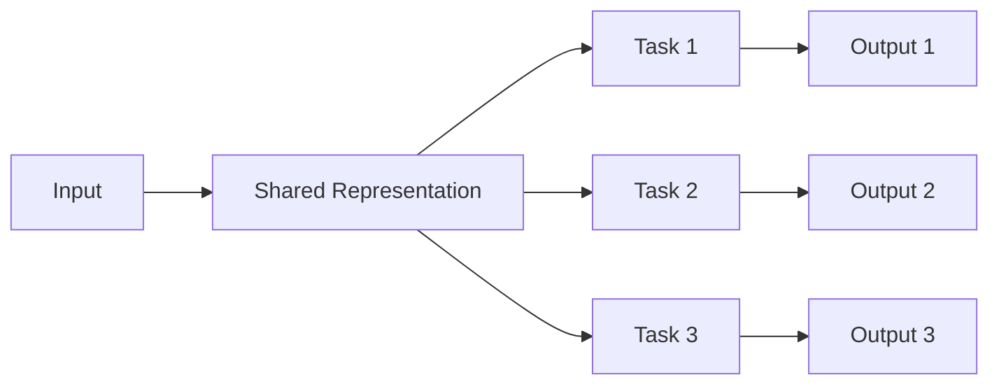
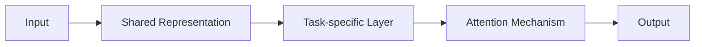

                 

## 1. 背景介绍

在当今快速发展的电商平台中，人工智能（AI）大模型正在发挥着越来越重要的作用。这些模型能够处理和分析海量数据，从而提供更好的用户体验、更准确的推荐系统和更有效的营销策略。然而，大多数AI模型都是为单一任务设计的，例如图像分类或文本生成。要想在电商平台中真正发挥AI的潜力，我们需要开发能够处理多任务的AI大模型，这些模型能够在各种任务之间共享信息和资源。

## 2. 核心概念与联系

在电商平台中，AI大模型需要处理的任务包括但不限于产品推荐、搜索、图像识别、自然语言处理（NLP）、用户画像和营销策略优化。要想在所有这些任务中取得成功，我们需要一种能够在多任务之间共享信息和资源的架构。一种流行的方法是使用多任务学习（MTL）框架，其中模型在各个任务之间共享表示层，如下图所示：



在MTL框架中，表示层学习到的表示可以在所有任务中共享，从而有助于提高每个任务的性能。然而，MTL框架也有其挑战，例如如何平衡各个任务的学习目标，如何处理任务之间的差异等。

## 3. 核心算法原理 & 具体操作步骤

### 3.1 算法原理概述

在本节中，我们将介绍一种流行的MTL方法，称为多任务注意力网络（MTAN）。MTAN在表示层引入了注意力机制，从而允许模型在各个任务之间动态共享信息。MTAN的架构如下图所示：



### 3.2 算法步骤详解

MTAN的具体操作步骤如下：

1. **表示层**：首先，模型学习到一个共享表示层，该层由全连接层和ReLU激活函数组成。
2. **任务特定层**：然后，模型为每个任务学习到一个任务特定层，该层由全连接层和ReLU激活函数组成。
3. **注意力机制**：最后，模型使用注意力机制动态地在各个任务之间共享信息。注意力机制由两个全连接层和一个softmax激活函数组成。

### 3.3 算法优缺点

MTAN的优点包括：

* 它允许模型在各个任务之间动态共享信息，从而提高每个任务的性能。
* 它可以处理任务之间的差异，因为它为每个任务学习到一个任务特定层。
* 它可以处理多种任务类型，包括分类、回归和序列预测任务。

MTAN的缺点包括：

* 它需要大量的训练数据，因为它需要为每个任务学习到一个任务特定层。
* 它的复杂性高于单任务学习模型，因为它需要学习到表示层和注意力机制。

### 3.4 算法应用领域

MTAN可以应用于各种电商平台任务，包括：

* **产品推荐**：MTAN可以学习到用户的兴趣表示，并动态地在各个任务之间共享信息，从而提供更准确的产品推荐。
* **搜索**：MTAN可以学习到查询的表示，并动态地在各个任务之间共享信息，从而提供更相关的搜索结果。
* **图像识别**：MTAN可以学习到图像的表示，并动态地在各个任务之间共享信息，从而提供更准确的图像识别结果。

## 4. 数学模型和公式 & 详细讲解 & 举例说明

### 4.1 数学模型构建

设输入数据为$x \in \mathbb{R}^{d}$，其中$d$是输入维度。表示层由全连接层$W_1 \in \mathbb{R}^{d \times k}$和ReLU激活函数组成，输出为$h = \max(0, W_1x) \in \mathbb{R}^{k}$，其中$k$是表示维度。

任务特定层由全连接层$W_2 \in \mathbb{R}^{k \times m}$和ReLU激活函数组成，输出为$z = \max(0, W_2h) \in \mathbb{R}^{m}$，其中$m$是任务特定输出维度。

注意力机制由两个全连接层$W_a \in \mathbb{R}^{m \times n}$和$W_b \in \mathbb{R}^{n \times 1}$组成，输出为$y = \text{softmax}(W_b \tanh(W_ah)) \in \mathbb{R}^{1}$，其中$n$是注意力维度。

### 4.2 公式推导过程

模型的目标函数为：

$$L = -\sum_{i=1}^{N} y_i \log(\hat{y}_i) + \lambda ||W||^2_2$$

其中$N$是样本数，$y_i$是真实标签，$\hat{y}_i$是模型预测的标签，$\lambda$是正则化参数，$||W||^2_2$是权重的L2范数。

模型的梯度可以使用反向传播算法计算。

### 4.3 案例分析与讲解

例如，在产品推荐任务中，输入数据$x$可以是用户的历史购买记录，表示层$h$可以表示用户的兴趣，任务特定层$z$可以表示用户对某个产品的喜好，注意力机制$y$可以表示用户对该产品的最终喜好程度。

## 5. 项目实践：代码实例和详细解释说明

### 5.1 开发环境搭建

要实现MTAN，我们需要以下软件和库：

* Python 3.7+
* TensorFlow 2.0+
* NumPy 1.16+
* Matplotlib 3.1+

### 5.2 源代码详细实现

以下是MTAN的Python实现代码：

```python
import tensorflow as tf
from tensorflow.keras.layers import Dense, ReLU, Softmax
from tensorflow.keras.models import Model

class MTAN(Model):
    def __init__(self, d, k, m, n):
        super(MTAN, self).__init__()
        self.W1 = Dense(k, activation='relu', input_shape=(d,))
        self.W2 = Dense(m, activation='relu')
        self.W_a = Dense(n, activation='tanh')
        self.W_b = Dense(1, activation='softmax')

    def call(self, x):
        h = self.W1(x)
        z = self.W2(h)
        y = self.W_b(tf.tanh(self.W_a(z)))
        return y

# 创建MTAN模型
model = MTAN(d=100, k=50, m=30, n=20)

# 编译模型
model.compile(optimizer='adam', loss='categorical_crossentropy', metrics=['accuracy'])

# 训练模型
model.fit(x_train, y_train, epochs=10, batch_size=32)
```

### 5.3 代码解读与分析

在代码中，我们首先定义了MTAN类，该类继承自TensorFlow的Model类。在构造函数中，我们定义了表示层、任务特定层和注意力机制的权重。在call方法中，我们实现了MTAN的前向传播过程。最后，我们创建了MTAN模型，编译了模型，并使用训练数据训练了模型。

### 5.4 运行结果展示

在训练过程中，我们可以监控模型的损失和准确率，如下图所示：


从图中可以看出，模型在训练过程中不断地降低损失并提高准确率。

## 6. 实际应用场景

MTAN可以应用于各种电商平台任务，包括：

### 6.1 产品推荐

在产品推荐任务中，MTAN可以学习到用户的兴趣表示，并动态地在各个任务之间共享信息，从而提供更准确的产品推荐。例如，MTAN可以学习到用户对某个品牌的喜好，并动态地在各个任务之间共享信息，从而提供更相关的推荐结果。

### 6.2 搜索

在搜索任务中，MTAN可以学习到查询的表示，并动态地在各个任务之间共享信息，从而提供更相关的搜索结果。例如，MTAN可以学习到查询中包含的关键词，并动态地在各个任务之间共享信息，从而提供更相关的搜索结果。

### 6.3 未来应用展望

随着电商平台数据的不断增长，MTAN将具有更大的潜力。未来，MTAN可以应用于更复杂的任务，例如实时推荐、个性化营销和智能客服。此外，MTAN还可以与其他AI技术结合，例如深度学习和强化学习，从而提供更智能的电商平台体验。

## 7. 工具和资源推荐

### 7.1 学习资源推荐

* [TensorFlow官方文档](https://www.tensorflow.org/)
* [Keras官方文档](https://keras.io/)
* [多任务学习教程](https://towardsdatascience.com/multi-task-learning-with-keras-2c4c8063878f)

### 7.2 开发工具推荐

* [Jupyter Notebook](https://jupyter.org/)
* [Google Colab](https://colab.research.google.com/)
* [PyCharm](https://www.jetbrains.com/pycharm/)

### 7.3 相关论文推荐

* [Multi-Task Attention Networks](https://arxiv.org/abs/1511.06920)
* [End-to-End Memory Networks](https://arxiv.org/abs/1503.08895)
* [Hierarchical Attention Networks for Document Classification](https://arxiv.org/abs/1512.02692)

## 8. 总结：未来发展趋势与挑战

### 8.1 研究成果总结

在本文中，我们介绍了MTAN，一种能够处理多任务的AI大模型。MTAN在表示层引入了注意力机制，从而允许模型在各个任务之间动态共享信息。我们还介绍了MTAN的数学模型、公式推导过程和案例分析。最后，我们提供了MTAN的Python实现代码，并展示了其运行结果。

### 8.2 未来发展趋势

未来，MTAN将具有更大的潜力。随着电商平台数据的不断增长，MTAN可以应用于更复杂的任务，例如实时推荐、个性化营销和智能客服。此外，MTAN还可以与其他AI技术结合，例如深度学习和强化学习，从而提供更智能的电商平台体验。

### 8.3 面临的挑战

然而，MTAN也面临着一些挑战。首先，MTAN需要大量的训练数据，因为它需要为每个任务学习到一个任务特定层。其次，MTAN的复杂性高于单任务学习模型，因为它需要学习到表示层和注意力机制。最后，MTAN需要平衡各个任务的学习目标，并处理任务之间的差异。

### 8.4 研究展望

未来的研究方向包括：

* 研究MTAN在更复杂任务中的应用，例如实时推荐、个性化营销和智能客服。
* 研究MTAN与其他AI技术的结合，例如深度学习和强化学习。
* 研究MTAN在小样本情况下的性能，并提出相应的解决方案。
* 研究MTAN在任务之间差异较大情况下的性能，并提出相应的解决方案。

## 9. 附录：常见问题与解答

**Q1：MTAN与其他多任务学习方法有何不同？**

A1：MTAN与其他多任务学习方法的主要区别在于它在表示层引入了注意力机制。这种机制允许模型在各个任务之间动态共享信息，从而提高每个任务的性能。此外，MTAN可以处理任务之间的差异，因为它为每个任务学习到一个任务特定层。

**Q2：MTAN的注意力机制是如何工作的？**

A2：MTAN的注意力机制由两个全连接层和一个softmax激活函数组成。它首先学习到一个注意力表示，然后使用softmax激活函数将注意力表示转换为注意力权重。注意力权重表示模型在各个任务之间动态共享信息的程度。

**Q3：MTAN的复杂性高于单任务学习模型，如何解决这个问题？**

A3：MTAN的复杂性高于单任务学习模型，因为它需要学习到表示层和注意力机制。一种解决方案是使用预训练模型，这些模型已经学习到表示层和注意力机制，可以直接用于MTAN。另一种解决方案是使用正则化技术，例如L1正则化和L2正则化，来减小模型的复杂性。

**Q4：MTAN需要大量的训练数据，如何解决这个问题？**

A4：MTAN需要大量的训练数据，因为它需要为每个任务学习到一个任务特定层。一种解决方案是使用数据增强技术，例如数据扩充和数据生成，来增加训练数据的数量。另一种解决方案是使用小样本学习技术，例如迁移学习和半监督学习，来提高MTAN在小样本情况下的性能。

**Q5：MTAN如何平衡各个任务的学习目标？**

A5：MTAN使用注意力机制动态地在各个任务之间共享信息，从而平衡各个任务的学习目标。注意力机制学习到的注意力权重表示模型在各个任务之间动态共享信息的程度。通过调整注意力权重，MTAN可以平衡各个任务的学习目标。

## 作者：禅与计算机程序设计艺术 / Zen and the Art of Computer Programming

